### AYS Digest 13/7: Refugees evacuated from Piraeus port

_In today’s digest: The EU decides on a new resettlement framework and harmonization of asylum rules\. At least four people died, including two children, after a boat capsized off Lesvos\. Human Rights Watch reports on continued abuse at the Hungarian border\. A hundred people arrive per day in Calais but the warehouse is empty\._
#### Syria
### At least ten people killed in airstrikes on Syrian refugee camp

Presumably Russian fighter jets struck a Syrian makeshift refugee camp at the border with Jorda, killing at least ten people\. Jordanian authorities refuse to let them enter the country, citing security reasons, after a suicide bomber killed seven border guards last month\.
#### EU
### Commission wants to harmonize asylum rules and create EU resettlement framework

The European Commission wants to “discourage secondary movements of asylum seekers” both through sanctions and by creating a “harmonized set of rules at the EU level” \(full press release is available [here](http://europa.eu/rapid/press-release_IP-16-2433_en.htm) \) \.

Sanctions for the “abuse of the process, lack of cooperation and secondary movements” will be compulsory in all EU countries and are supposed to deter refugees from moving from one EU country to another\. Sanctions can include a rejection of the asylum application or a shorter time\-frame of between one and two months during which the asylum procedure can be reviewed\.

Standardized rules at the EU level are also meant to prevent refugees from ‘choosing’ the country where they wish to go\. The length of asylum procedures for example will be standardized, as one EU official tells the EU Observer that “the length of procedures among member states is very diverse” and “these discrepancies is one of the incentives for secondary movement, asylum seekers go and apply in a member state, where they can expect a quick decision”\. The registration of an asylum request should not take more than three days, while a first instance decision should be made in less than six months\. The fast\-track procedure will allow governments to take decisions within two months and in case of an inadmissible request, a decision will be made within a month\. Faster procedures will be possible thanks to an EU list of safe countries of origin and safe countries of transit\.

The proposal also wants to standardize conditions at reception facilities by making sure that asylum seekers are provided with legal assistance from the very beginning of the procedure and get access to a personal interview\. Asylum\-seekers should have access to the labour market at the latest six months after the asylum application is lodged, and no later than three months if the claim is likely to be well\-founded\.

[Another proposal by the EC](http://The%20annual%20EU%20resettlement%20plans%20will%20set%20the%20broad%20geographical%20priorities%20from%20where%20the%20resettlement%20will%20take%20place,%20the%20maximum%20total%20number%20of%20persons%20to%20be%20resettled%20in%20the%20following%20year%20based%20on%20the%20participation%20and%20contributions%20made%20by%20the%20Member%20States%20and%20Associated%20Schengen%20countries%20in%20the%20specific%20annual%20resettlement%20plan.%20%20The%20EU%20Resettlement%20Framework%20sets%20out%20the%20criteria%20which%20should%20be%20taken%20into%20account%20when%20determining%20the%20regions%20or%20third%20countries%20from%20which%20resettlement%20will%20take%20place,%20such%20as%20the%20number%20of%20persons%20in%20need%20of%20international%20protection%20in%20third%20countries,%20the%20overall%20relations%20between%20the%20EU%20and%20third%20countries%20and%20their%20effective%20cooperation%20in%20the%20area%20of%20asylum%20and%20migration,%20including%20developing%20their%20asylum%20system%20and%20cooperation%20on%20irregular%20migration,%20readmission%20and%20return.%20%20The%20new%20EU%20Resettlement%20Framework%20will%20establish%20a%20common%20set%20of%20standard%20procedures%20for%20the%20selection%20and%20treatment%20of%20resettlement%20candidates.%20It%20also%20specifies%20the%20common%20eligibility%20criteria%20for%20resettlement%20to%20the%20EU%20under%20the%20targeted%20EU%20resettlement%20schemes,%20sets%20out%20common%20grounds%20for%20the%20exclusion%20of%20candidates%20and%20the%20type%20of%20resettlement%20procedure%20%28ordinary%20procedure%20or%20expedited%20procedure%29%20which%20could%20be%20used.) will look at creating a common resettlement framework\. An annual EU resettlement plan will set geographical priorities from where the resettlement will take place, as well as the maximum total number of persons to be resettled in the following year\. The framework will also establish a common set of standard procedures for the selection and treatment of resettlement candidates and will specify who is eligible for resettlement\. There will be no quotas and ‘member countries will decide themselves how many refugees need to be resettled each year’, with the Commission providing 10,000 euro per resettled refugee\.

[The Guardian](https://www.theguardian.com/world/2016/jul/13/eu-officials-finalise-common-asylum-system-resettle-refugees) argues that the under the proposal, “refugees will only be formally resettled in Europe from third countries that agree to readmit migrants who arrived in Europe by informal means”, in an agreement that recalls the EU\-Turkey deal\. It will also make it easier to for the EU to expel refugees, as the Commission wants to create a list of safe third countries within five years\.

[Iverna McGowan, head of Amnesty International’s European Institutions Office, says](https://www.amnesty.org/en/latest/news/2016/07/european-commission-proposals-on-resettlement-and-asylum-a-cynical-attempt-to-strengthen-the-walls-of-fortress-europe/) : “The proposals the commission published today are not about improving refugee protection globally, but about reducing irregular arrivals to Europe\. They take good tools, like resettlement, and put them to bad ends; they use fine words, but these mask some pretty cynical intentions\.” She adds: “What the commission is really trying to do with these proposals is resettle some refugees so they can return more\.”

This is Bahar, she is 91 and traveled from Iraq to Greece\. 
 She wants to rejoin her daughter in Germany\. Photo and text by 
María Serrano Martin\.
#### Greece
### Boat with 13 people capsizes off the south shore of Lesvos

Today around around 1am, a three meter wooden boat left Turkey for Lesvos and flipped 45 min later on the Greek side of the border because of high waves\. People swam for over 8h until they got rescued by a boat\. The boat had 13 people on it and six people were rescued, while one family of four died, including a four year old girl and a young boy\. Only two people on the boat had a life vest and three men are still missing\. One boat with 25 people was picked up off the north east coast and brought into Mitilini harbor and one boat with 45 people was able to land safely in the South of Lesvos\.

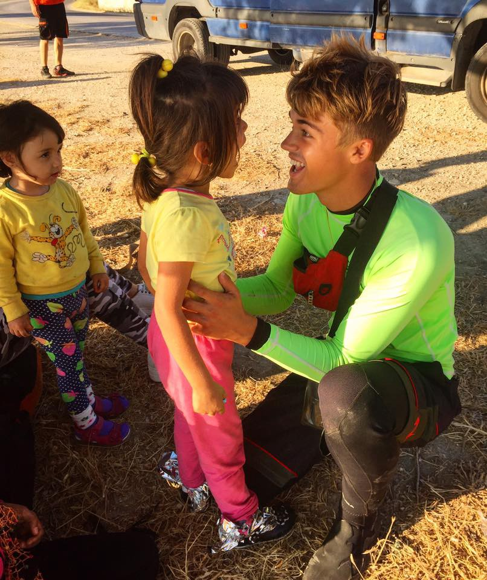

More than 45 Syrian refugees safely landed on Katia Beach in South Lesvos this morning\. Photo by ERCI

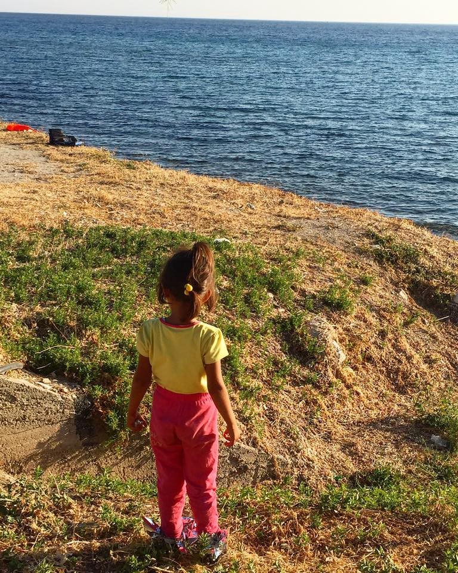

More than 45 Syrian refugees safely landed on Katia Beach in South Lesvos this morning\. Photo by ERCI

To prevent these kind of tragedies and ensure a safe landing, please try to spread this safety flyer among your contacts\. Tell people who are trying to cross and find themselves in a difficult situation to call the United Rescue Alarm Phone\.

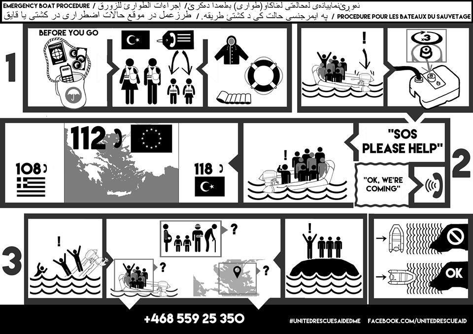

### Leros locals continue to confront refugees

‘Golden Dawn’ fascists gathered outside Pikpa Lerou, a house in Leros that hosts refugee women and children\. Local activists say the house was ‘under siege’ but protests have now ended without major incidents\.

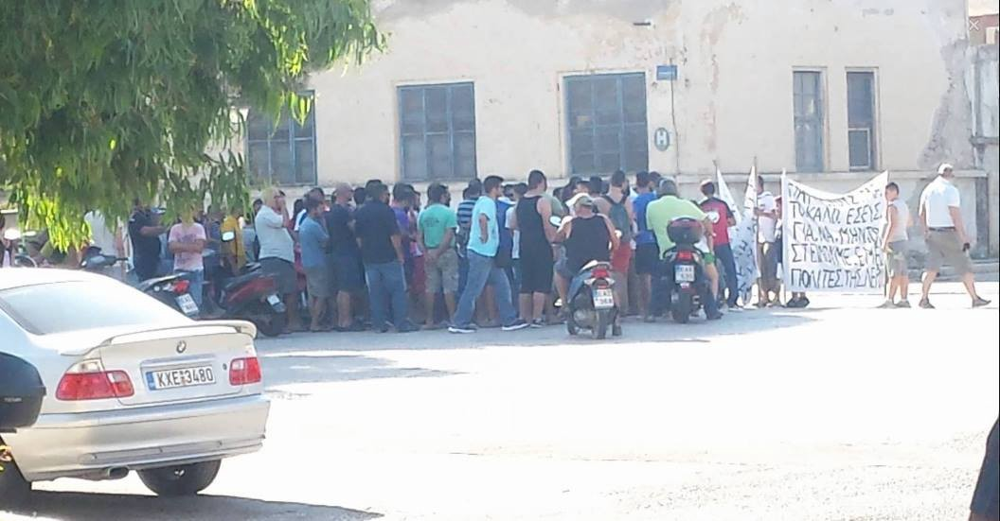

Meanwhile, a source from the camp tells us that police is registering refugees to understand how many are still there, as many left the island on their own\. Since Saturday, a group of 20–30 Leros residents has started attacking and threatening refugees\. Previously, a group of Yazidis had left the refugee camp after recent fights inside the camp but got attacked outside the camp by locals\. They were forced to return by police, despite fearing for their safety\. Many volunteers have left the island, after several threats and attacks\.

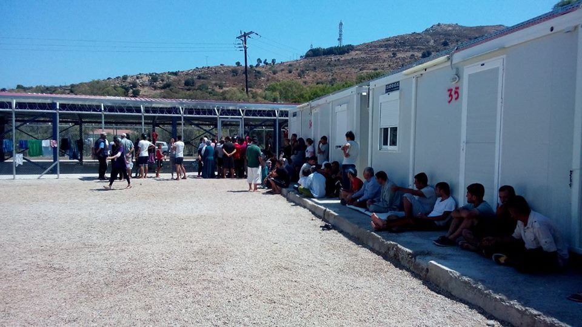

Photo of registration in Leros\.
### Remaining refugees are being evacuated from Piraeus port

Story written by L\. Mertes

The mood was somber at dinner time in the port of Piraeus tonight\.

Refugees stood in line solemnly waiting for their daily ration of government food as the sun set in the distance and ferries whisked tourists away to island destinations\.

Greek authorities arrived at the port this morning around 10am and cordoned off the area around the so called Stonehouse, a building on the edge of the port between the E1 and E2 terminals\.

They blocked either end of the building so refugees couldn’t leave the area with their possessions\.

One Afghan refugee managed to get permission to go to the restroom and didn’t return\. In the process he lost everything he owned: his tent, his ID and all of his clothes\.

Police officers yelled at the refugees not to leave the area with their tents\. Eventually they brought in a crane with which they crushed the tents, blankets, clothes and paperwork inside\. They also used knives to slash the tents and snapped poles so they couldn’t be used again\.

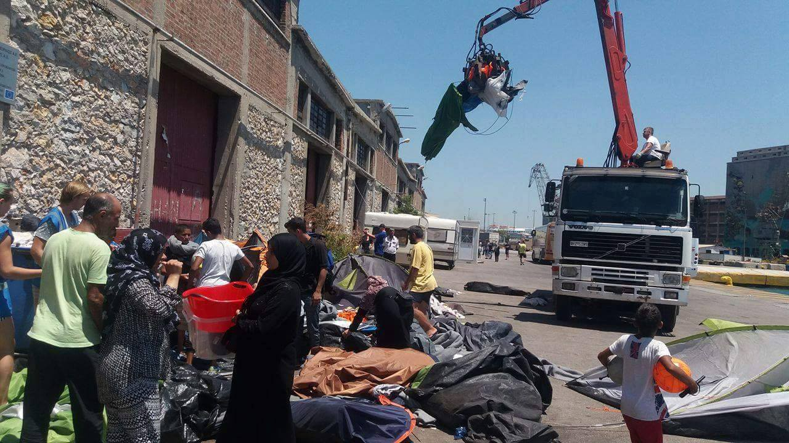

Police officers yelled at the refugees not to leave the area with their tents\. Eventually they brought in a crane with which they crushed the tents, blankets, clothes and paperwork inside\.

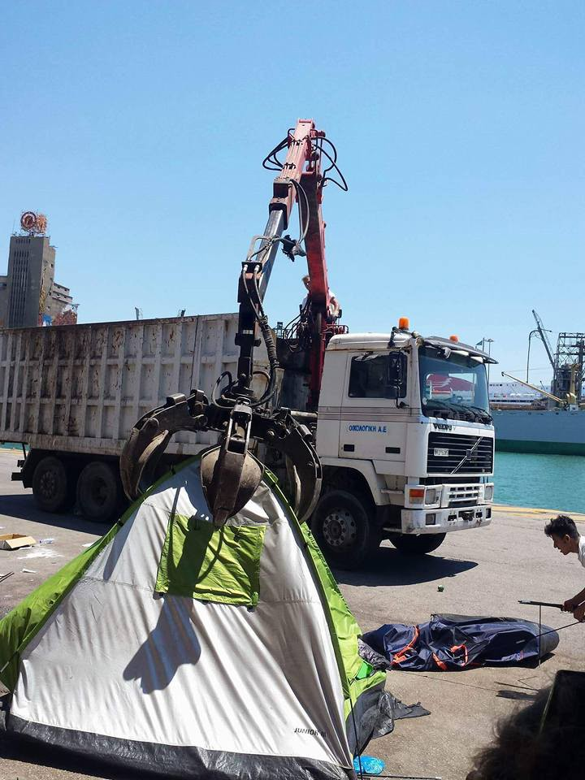

Photo by Joao Pequeno

Refugees were told through a Farsi and Greek speaking interpreter that they were being moved to a new camp and needed to board the buses immediately, one refugee present said\.

They had orders to evacuate five hundred people but around 200 hundred left today, according to one long term volunteer\.

The police entered the building and threw away the refugees’ belongings if they didn’t move fast enough\.

All of those moved today were Afghan nationals; the Syrians who shared the building moved under the bridge where the remaining refugees in the port reside\.

Others who weren’t at the camp returned to find the building shuttered and their possessions gone\.

Newspapers in Greece have reported in recent weeks that the government has been in talks with regional authorities in the Peloponnese about taking the port’s residents\.

“They told them they were being taken to a good camp but people don’t trust the advice of the police\. The last time they tried to evacuate people they sent them to a camp and they returned to Piraeus,” said Mohammed, who has lived in the port for three months\.

“Imagine preferring the tent to the camp ?” he added noting that the poor facilities and distance from the cities put them in an even worse situation\.

“People don’t trust them \(the authorities \) anymore,” he said\.

Some volunteers however claim they have warned the ports residents that this day was coming\.

Renata Blazkova, who has been at the port full time for the last four months has been trying to get people placed in the “better” camps like Elefsina, Elonas, Oinofita\.

“They don’t want to go,” she said\.

The population of the port has fluctuated in recent weeks — from a high of 1,500 to approximately 1,000\. In the last week alone before this morning’s police operation around 200 fewer people arrived at mealtime than the week before\.

Blazkova emphasized that no one was injured in the operation\. One witness reported that one Afghan national was kicked by a police officer as he filmed the operation and two volunteers were detained\.

Blazkova will meet with port police in order to try to recover passports, ID cards and papers confiscated in the operation\.

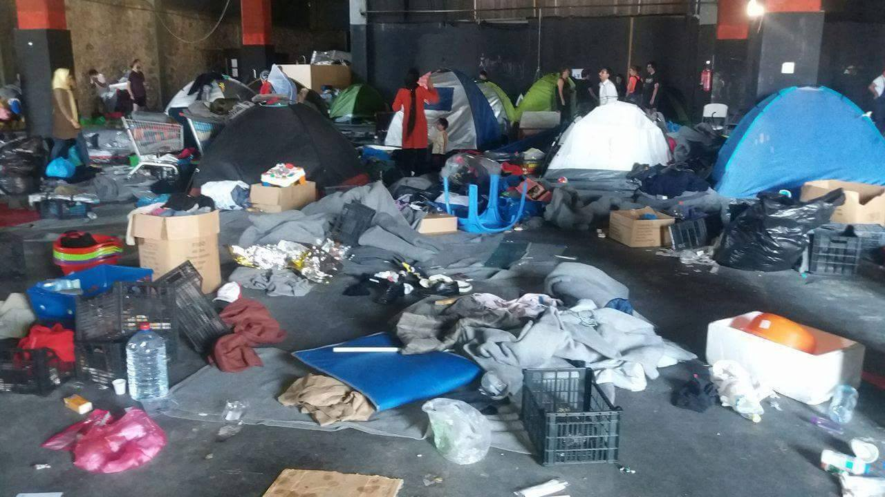

Eviction was done without prior notice, and people who weren’t at the camp returned to find the building shuttered and their possessions gone\.
### Pre\-registration for people not residing in camps

The Mobile Info Team for refugees in Greece says pre\-registration for people who do do not reside in official camps will start on Thursday the 14th of July and will last until the end of July, from Monday until Saturday each week, from 8\.30 until 15\.00\.

Pre\-registration will be done at the back of the regional asylum office in Thessaloniki, the same place where all the people living in camps were pre\-registered:

_Pontou 30_ 
_Menemeni 546 28_

The place will be very busy and it is advised to come early\. If you come from outside Thessaloniki, keep in mind that the process could take multiple days\. Information in Arabic and Farsi is also provided by the [Mobile Info Team](https://www.facebook.com/mobileinfoteam/photos/a.1800063030222418.1073741830.1796286800600041/1810477442514310/?type=3&hc_location=ufi) \.
### Borderfree is building a school and “Basel hilft mit” is helping finance a medical practice in Petra Camp

“Basel hilft mit” has purchased a hospital bed and will participate in paying the wages of two doctors as well as the purchase of necessary drugs in Petra camp\. The camp continues to grow, as Yazidis continue to get attacked in other camps and are transferred to Petra were they are safer\.

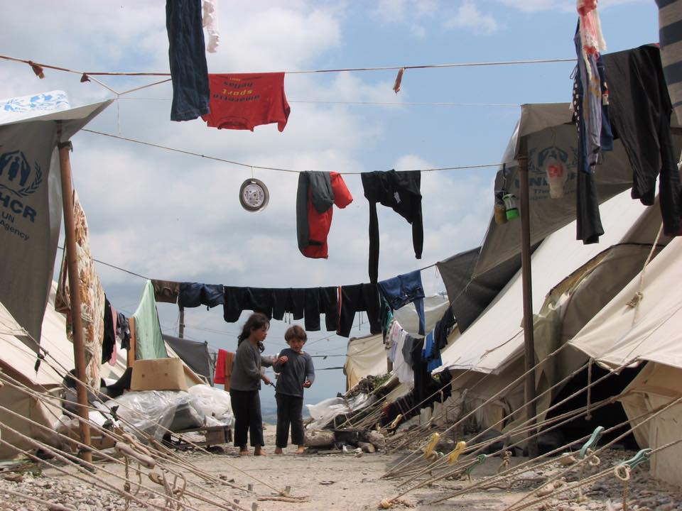

Photo by “Basel hilft mit”

Meanwhile, Borderfree has started the construction of a school, a project it already managed very successfully in Idomeni\.

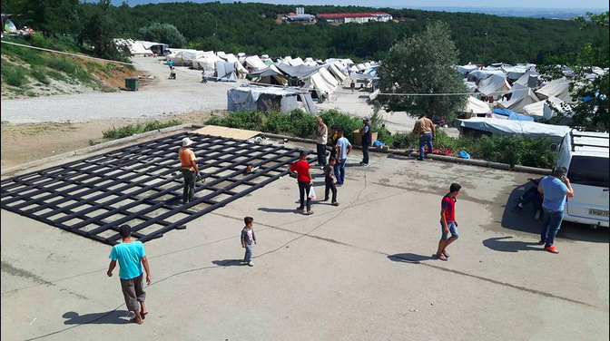

Photo by Borderfree
#### Serbia
### Report of Šid camp

After refugees at the bus station in Subotica reported that three buses with single men had been transported to the city of Šid, at the border with Croatia, local volunteers went looking for the new camp\. According to them around 70 refugees, mostly from Afghanistan, Pakistan and Iran are living there under “very good” conditions\. They point out adequate food, shelter, wash infrastructure and medical care\. The only major issue seems to be the lack of clothes\. The volunteers also point out that refugees trying to cross the border with Croatia are being pushed back to Serbia — refugees trying to cross a second time are imprisoned for seven days and pushed back again\.
#### Hungary
### Migrants abused at the border

[Human Rights Watch](https://www.hrw.org/news/2016/07/13/hungary-migrants-abused-border) reports on continued abuse at the border between Hungary and Serbia, as refugees are being pushed back from this country as well\. Lydia Gall, Balkans and Eastern Europe researcher at Human Rights Watchs says ““Hungary is breaking all the rules for asylum seekers transiting through Serbia, summarily dismissing claims and sending them back across the border,” and “people who cross into Hungary without permission, including women and children, have been viciously beaten”\. People wishing to enter Hungary legally have to cross transit zones, but only 15 are allowed to enter, meaning hundreds of people are stuck in a no\-mans land in very poor conditions for days and weeks on end\.

Since July 5th, Hungarian border officials are allowed to return asylum seekers and migrants apprehended up to eight kilometers inside Hungarian territory to Serbia — Serbia is considered a safe country by Hungary, but not by the UNHCR\.
### Support needed at Kelebija camp

One of those no\-mans lands is the Kelebija camp, situated before the Tompa transit zone, were currently more than 400 people are stuck\. The “I’m Human Organization” \(IHO\) needs help to provide food and non food items and as the number of refugees stuck at the border increases, so does the number of kids\. IHO is therefore looking for funds to provide school activities\. For more information, please contact info@iHo\.org\.uk\.
#### France
### 100 new refugees arrive per day in Calais but warehouse almost empty

Care4Calais says 7,000 refugees are currently in Calais and about 100 arrive per day — nevertheless, the warehouse is almost empty, as Calais has disappeared from the collective consciousness\. Almost everything is needed right now and you can check out the most urgent needs as well as ways to donate on their website [http://care4calais\.org/donate/](http://care4calais.org/donate/) \.

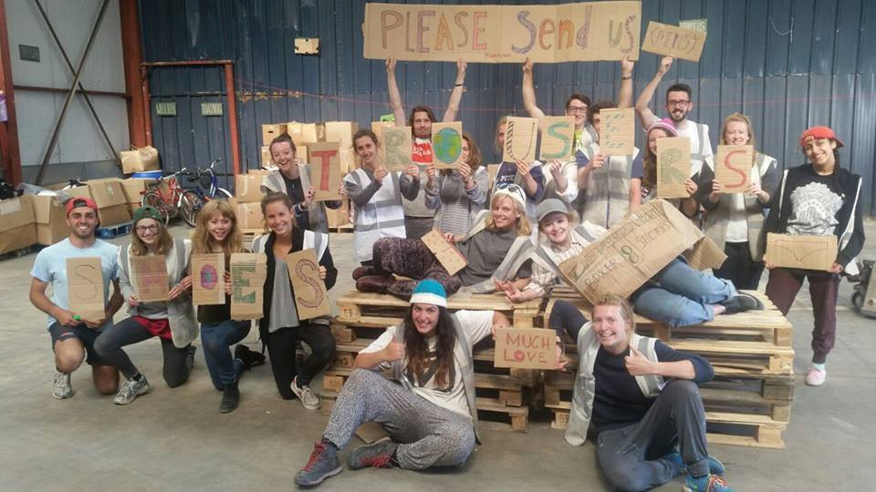

Photo by Care4Calais — featuring motivated volunteers and an empty warehouse\.
### 62 shelters to be destroyed in Grand Synthe

The Refugee Info Bus reports on a letter from the mayor of Grand Synthe, Damien Careme, to NGO’s working at the Grand Synthe refugee camp near Dunkirk\. The letter states that only single women with children, families and people with significant health issues will be accepted into the camp\. The mayor also says that less than 800 out of 1,330 refugees are left in the camp, allowing authorities to destroy 62 out of the supposedly empty shelters\.

The Refugee Info Bus however notes that with the constant arrival of new refugees in Calais and more than 7,000 already forced to live in tents, it seems inevitable that people will want to relocate to Dunkirk\.

It goes on to say that the authorities have started to, and plan to destroy 62 of the 125 shelters that he claims are empty, by the 30th of July\. It is too bad that these shelters need to be destroyed and cannot be used to host refugees that will otherwise be forced to sleep in tents\.

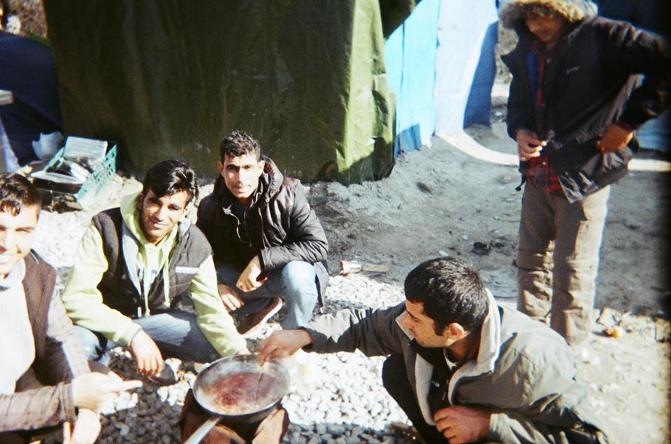

In March 2016, 40 disposable cameras were distributed to residents of the Jungle, these are some of their photos\. Cameras provided by “The Worldwide Tribe” and coordination by Beatrice Lily Lorigan\.

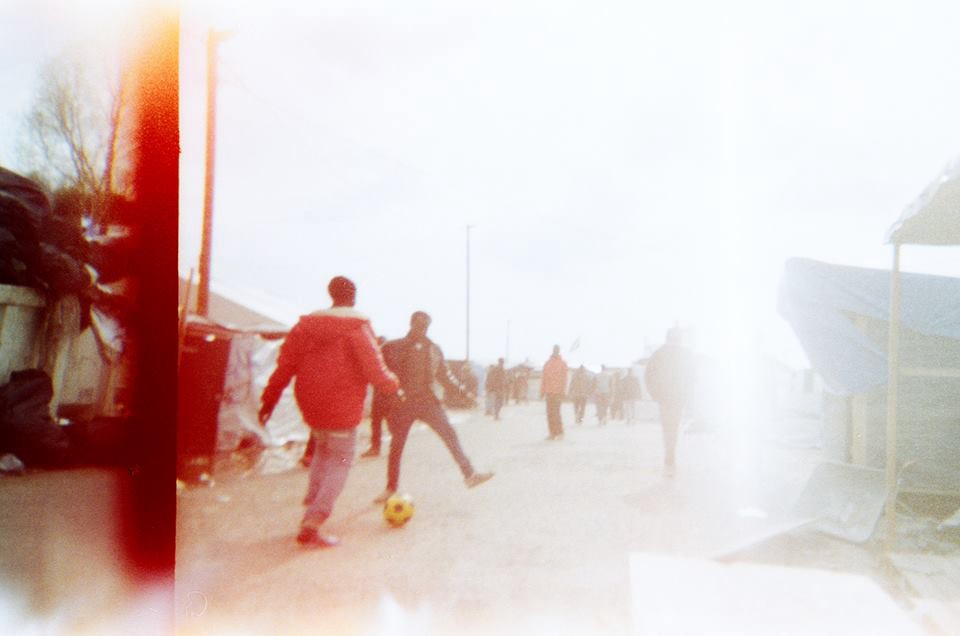

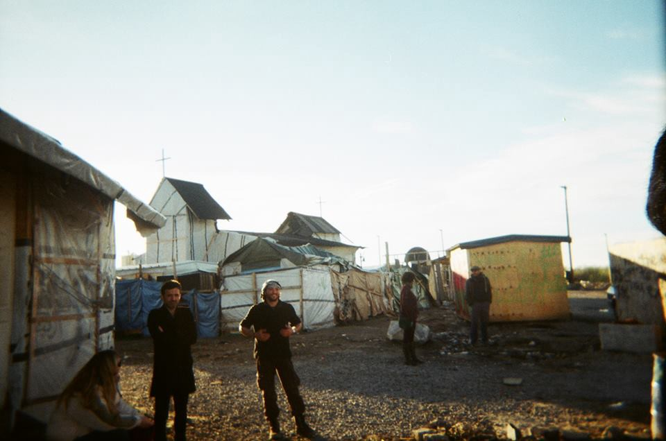

_Converted [Medium Post](https://areyousyrious.medium.com/ays-digest-13-7-refugees-evacuated-from-piraeus-port-4f06c06abb11) by [ZMediumToMarkdown](https://github.com/ZhgChgLi/ZMediumToMarkdown)._
