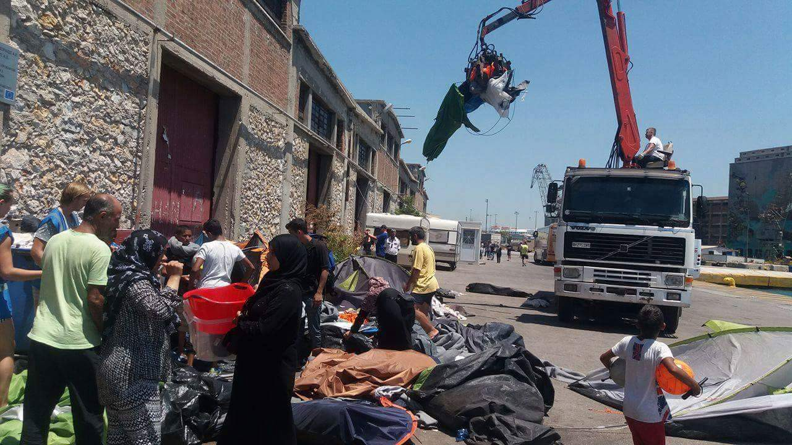

### AYS DIGEST 14/7/16: Man killed in fight at Elliniko
#### Sections of Aleppo cut off from supplies after airstrikes\. Refugees and activists march in solidarity in Athens\. Unregistered Iraqis ineligible for relocation program, confirmed\. Mixed reports on nature of Piraeus port evictions\. Victory and solidarity for refugees and migrants as “migrants prison” is shut down in Spain\! 1200 refugees remain in Belgrade\. Hungary prepares 10,000\-man\-strong patrol of their border\. Austria deporting rejected asylum applicants via C\-130\. Switzerland pushing back refugees and migrants to Italy\. Despondent rejected asylum applicant flees at airport in Frankfurt, Germany\.

Refugees and Activists in Athens\. Photo Credit: Nasim Lomani
#### Syria
### Sections of Aleppo cut off from supplies after airstrikes\.

A major supply road for the rebel\-held portion of Aleppo was severely damaged Wednesday morning [in a series of airstrikes](http://www.nbcnews.com/slideshow/aleppo-left-hungry-damaged-after-series-airstrikes-n609256) that also inflicted heavy damage on the city, causing many civilian casualties\. Syrian American Medical Society reports a direct hit on a hospital in Aleppo\.

Hospital hit in Airstrikes\. Photo Credit: Irish Emergency Logistics Team

Food prices are skyrocketing and are expected only to go up after this series of airstrikes\. The destruction of Castello road came on the heels of a twice\-extended country\-wide truce declared on July 6th\.

The US is expected to form an “anti\-terror pact” with Russia, providing more support to Bashar al\-Assad, a new development as the US continues to support rebel opposition groups, bringing more questions as to what expanded US involvement in the Syrian war will bring\.
#### Turkey
### Life\-jacket distribution re\-initializing\.

The CK Relief team is restarting their initiative to provide free life jackets to children crossing from Izmir and are looking for volunteers\. Anyone interested in joining their team should contact them on their Facebook page [here](https://www.facebook.com/theckteamrefugeeslesvos/) \.
#### GENERAL
### IOM has registered a total of 3693 people killed during attempted Mediterranean crossings to date\.

I [n the first half of 2016](http://www.dw.com/en/iom-highlights-refugee-drownings/a-19399205) , the total number of sear arrivals in Europe in the first half of 2016 is around 238,000, a little over a quarter of the number of total arrivals in 2015\. Although this would indicate that the official closure of the Balkan route has had some minor slowing effect, it certainly undermines the very notion of “closure\.” Secretary\-general of IOM said,

> “It’s like water\. One builds a dam and the water flows around it\. Refugees are innovative because they are desperate\. When you erect a blockade at one spot, they search for another route\.” 

Stonehouse Eviction, Greece
#### GREECE

_UPDATE: In the wake of the report of the European Commission and the news that Iraqi asylum rates have dropped below 75%, as of July 1st, Iraqis who have not already registered for relocation are ineligible\. Iraqis remain eligible for family reunification and asylum procedure\. A list of the countries which are now eligible has been published by the European Commission: Central African Republic, Eritrea,Seychelles, Dominica, Bahrain, Laos, Saudi Arabia and Syria\._
#### Elliniko

Fight at Elliniko camp leaves one Afghan man dead\. According to sources, a fight between 40–50 men in Elliniko camp resulted in three Afghan men being taken to the hospital, with one of the men, who originally tried to intervene and put a stop to the fight, suffered serious head wounds as well as stab wounds\. Police are investigating the cause of the incident\.
#### Leros

The people of Leros band together to support volunteers and refugees at Pikpa\. Fascist anti\-refugee factions had threatened volunteers, saying that they would attack and force them off the island on Wednesday at 5 o’ clock, PM\. What happened, however, turned out differently\. Refugee Solidarity Community writes:

> On Wednesday afternoon, a massive poster was hanging in the main square of Lakki and a letter from a doctor at the hospital circulated on social media calling on all Lerians to come as stand in solidarity: in defence of Pikpa, its residents and the vestiges of a fast disappearing democracy and rule of law\. By 3 o’clock all volunteers were assembled and in defence positions, some upstairs with the children, some patrolling the corridors, some comforting the terrified residents… then they came, in a steady stream, without fanfare, the heart and soul of Leros, the real Lerians, those that love freedom\. 

The people of Leros came and showed solidarity with volunteers and refugees, standing up for their fellow man\. Read the entire dramatic story [here](https://www.facebook.com/rscntwrk/posts/287418784946602) \.
#### Lesvos

> The Lesvos boat report notes that one boat with forty passengers was picked up by Frontex today and safely transported to port\. The passengers were transferred to Moria camp\. A merciful day on the Aegean\. 

In the horrific aftermath of this week’s tragedies in the Mediterreanean, officials recovered the four body of those who drowned\. They were a Syrian [family from Aleppo](http://www.ekathimerini.com/210433/article/ekathimerini/news/bodies-recovered-off-lesvos-belonged-to-syrian-family-from-aleppo) : mother, father, and two children ages 4 and 6\.

For those interested in getting involved in supporting those on Lesvos: BRF Medical Team Lesbos is looking for senior doctors\!

> Are you a senior doctor \(or do you know a senior doctor\), are you available right now, in August or September, and are you willing to help the refugees in Lesbos by providing acute medical care?
 

> Send an email to reina@bootvluchteling\.nl 

Refugees Protest in Athens\. Photo Credit: Nasim Lomani
#### Kos

Each day there are new arrivals, small rubber boats landing on the island regularly each night again\. The number of refugees on the island has risen to about 680 persons total by tonight\.
#### Thessaloniki
### Pre\-registration program commenced for refugees outside of camps\.

According to Mobile Info Team for Refugees in Greece, on July 14th, pre\-registration for refugees outside of camps commenced, operating from 8\.00 to 15\.00, Monday through Friday every week until the end of July\.

> The location will be at the back of the regional asylum office in Thessaloniki which is located in Kalochori, in the west of Thessaloniki\. This is the same place where all the people living in camps were pre\-registered\. 

Further questions and translations can be [found on the original post](https://www.facebook.com/mobileinfoteam/photos/a.1800063030222418.1073741830.1796286800600041/1810477442514310/?type=3&theater) or on a series of [flyers released](https://www.facebook.com/groups/infopointforidomenivolunteers/permalink/298829860463314/) \.

There is a noborder camp at the law school in Thessaloniki\. Individuals have overheard faculty authorities [trying to request that authorities evict](https://twitter.com/g_christides/status/753539496336060416/photo/1) the camp, but thus far no action has been taken\.
#### Athens
### Mixed reports in the aftermath of Piraeus eviction\.

More [stories of abuse and wrongdoing](https://twitter.com/Refugees_Gr/status/753231302577491968) are emerging in the aftermath of yesterdays surprise eviction of Piraeus port camp\. However, other volunteers confirm that for refugees staying in “the storehouse,” advance notice was given in order to give refugees time to gather their belongings\. Additionally, it is strongly hoped that their new location is safer than the old one as there was prior concern of electrical and other hazards\.

Overwhelmed by a wonderful donation of glasses, there are plenty to be, responsibly, distributed after refugees get their eyes tested\. Any person who can possibly assist with this project is encouraged to [view the original post](https://www.facebook.com/groups/204202716585823/permalink/312985115707582/?hc_location=ufi) \.

Stonehouse, Athens
#### SPAIN
### Victory and solidarity for refugees and migrants as “migrants prison” is shut down\!

Subsequent to a protest movement, the Barcelona City Council has barred the re\-opening of the local “Foreigners Prison,” on both technical and safety grounds\. This humanitarian victory would have been impossible without the work of volunteers and activists\!

#### SERBIA
### Around 1,200 refugees remain in Belgrade, putting local aid efforts under heavy strain\.

The asylum center Krnjaca is full to capacity; as a result the number of refugees who sleep outside every night is only increasing, averaging around 150–200 per night\. Info Park, Refugee Aid Serbia, Covekoljublje, Caritas and Jesuit Refugee Service are all in collaboration to support aid initiatives in the park\. The numbers in the park are almost equal [to last year’s high point in August](http://www.b92.net/eng/news/society.php?yyyy=2016&mm=07&dd=14&nav_id=98615) \.
#### HUNGARY
### 10,000\-strong army to “manage” Hungarian border\.

Despite massive international criticism on the deplorable treatment of refugees by Hungarian authorities, Hungarian officials have moved forward on a massive military and police initiative to repel any refugees trying to enter from Serbia\. Around 10,000 military and police are being mobilized\.

[Human Rights Watch researchers](http://budapestbeacon.com/civil-society/hungary-is-breaking-all-the-rules-for-asylum-seekers-transiting-through-serbia-says-ngo/36161) have decried the abuse of refugees, stating, “Hungary is breaking all the rules for asylum seekers transiting through Serbia, summarily dismissing claims and sending them back across the border\.”

IHA donations\. Photo Credit: IHA

In the midst of this operation, Intereuropean Humanitarian Aid \(IHA\) is mobilizing again at Roeszke in an effort to support those near the border\. Consider supporting their work [here](https://www.facebook.com/groups/1652972374920129/permalink/1730199890530710/) \.
#### AUSTRIA
### Austria to deport rejected applicants by military plane\.

In an [interview with Die Welt](http://www.welt.de/politik/ausland/article157033032/Arbeitserlaubnis-fuer-Asylbewerber-ist-undenkbar.html) , Austrian interior minister, Wolfgang Sobotka says that the 37,500 asylum request limit will not be reached in 2016\. Sobotka is firmly opposed to the harmonisation of asylum across Europe\.

[Austria is going to deport](http://derstandard.at/2000041113464/Heiss-umfehdete-Herculesaufgabe) 14 rejected asylum applicants next week to Bulgaria, using a military C\-130\. Government plans to deport 50,000 rejected asylum applicants by the year 2019\. One flight hour of the plane costs 11,800 Euro\. Critics from the Green Party say that the money could be instead invested in integration programmes\. The government argues that the flight hours are included in the yearly flight hours quota\.
#### SWITZERLAND
### Miniature, nascent Idomeni blossoms on the border\.

Makeshift camps are appearing at the Swiss\-Italian border near Como, transforming the town into an [“open\-air refugee center,”](http://www.thelocal.ch/20160714/chaos-in-como-after-swiss-send-back-refugees) according to officials\. This situation was escalated when a group of refugees attempted to cross at a nearby border crossing, but were forced back to Como\. This development was recent as as of recently, Switzerland was allowing around 100 refugees pass at the border crossing per 15 days\. With this suddenly being revoked, we can only expect a new hotspot to emerge\.
#### GERMANY
### Asylum seeker attempts to evade deportation by fleeing to the tarmac\.

A 19 years old asylum seeker fled to the runway of the Airport Frankfurt am Main, Germany, shortly before his deportation back to Bulgaria\. The runway was closed for 4 minutes and one passenger plane had to abort its landing approach\. The young man was caught by police and put in jail, where he will wait till his deportation\.

It has been officially confirmed that 2015 was a record\-breaking year for Germany in terms of immigration\. 2015 saw officially the highest numbers of immigrants to Germany, around 2\.14 million \(this figure also includes those seeking asylum and non\-asylum\-seeking migration\) \.

_Converted [Medium Post](https://areyousyrious.medium.com/syria-1cfc65c739d7) by [ZMediumToMarkdown](https://github.com/ZhgChgLi/ZMediumToMarkdown)._
