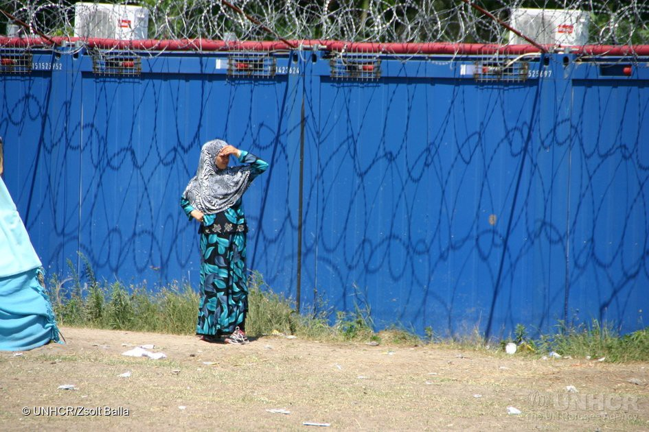
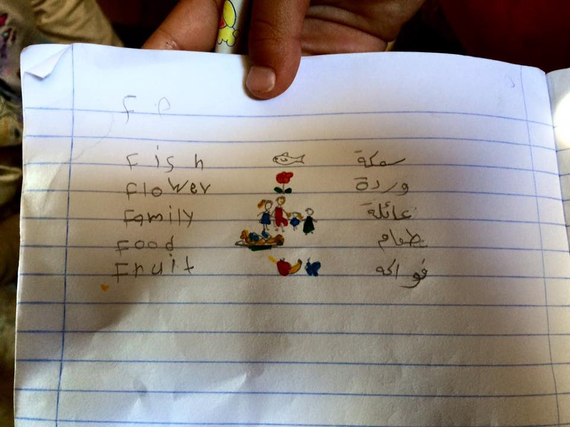
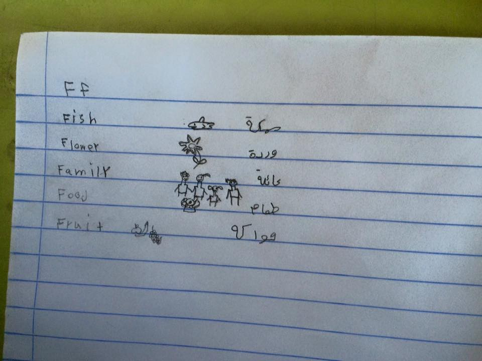
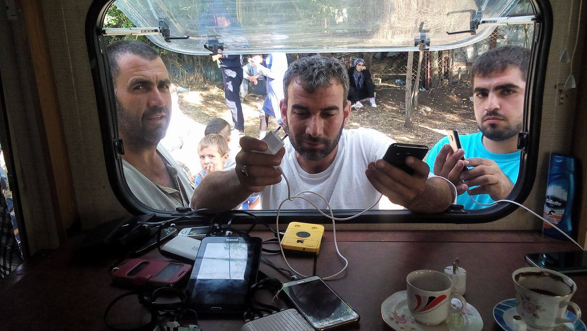
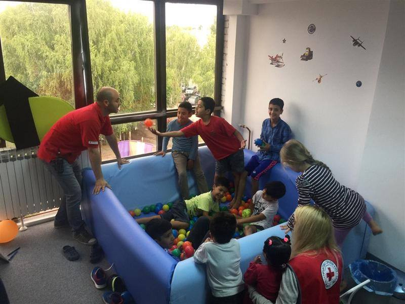
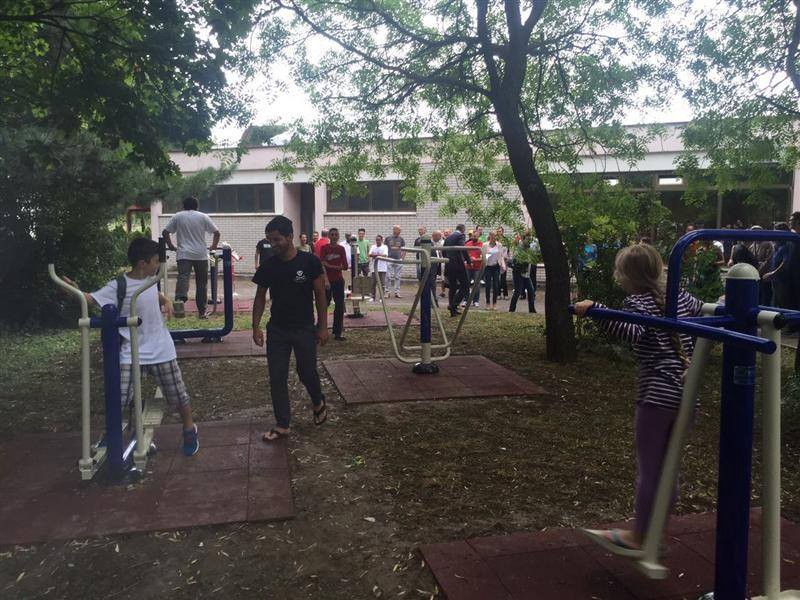

### AYS DAILY DIGEST 15/07: Worrisome news from Hungary

_Military coupe attempt in Turkey\. New arrivals to Greece\. Due to dare condition in Greek camps, NGOs are pulling out\. Help urgently needed at the Serbian — Hungary border\. Almost 1,000 people rescued in six operation in the Mediterranean\._

UNHCR worried about refugee situation at the Serbian\-Hungarian border\. Photo: UNHCR
#### France
### Time for solidarity after the Nice attack

At least 84 people were killed and dozens injured when a truck rammed through a crowd celebrating Bastille Day along the waterfront promenade in the southern French city of Nice on Thursday\.

After this tragic happening, comments and conclusions from some prominent EU politicians prompt us to remind that it is the refugees who are perhaps the only ones who can relate to the families of the victims, having lost their family members in the same inexplicable violence and terror\. They should certainly not have to fear being judged each time a similar incident occurs\.
#### Turkey
### Military coup attempted

To uphold the fact that Turkey cannot be regarded as a safe country for refugees is tonight’s news from Turkey, where earlier tonight a military coup was announced, only to be finished after couple of hours, followed by big celebrations in the streets\. Reportedly, the main bridges on the Bosphorus were closed, gunfire was heard in different areas while the military helicopters were flying over and the army was gathered in the city centers\. The situation is evolving hourly, and latest news speaks of military surrendering\.
#### Greece
### New Arrivals

52 people were picked up by the Greek Coast Guard in front of the airport on Lesvos and brought into Mitilini harbour\. People were then transferred by the Coast Guard bus to Moria camp\.
### MSF called on big pharmaceutical companies Pfizer and GSK to drop the price of the pneumonia vaccine\* \(PCV\) for governments and humanitarian organisations in emergency contexts

MSF paid 60 Euros per dose for the pneumonia vaccine, which it bought through local pharmacies\. This is 20 times more than the lowest global price of the vaccine, which is roughly 2\.80 Euros per dose\.

Despite vaccinating highly vulnerable children, humanitarian organisations such as MSF are unable to purchase vaccines at the lowest available price\.

Another vaccine used by MSF during these campaigns protects children against six diseases and is also expensive, priced around 65 euros per dose\.

> “Governments and humanitarian organisations need tools to protect children living through one of the biggest crises of our times,” said Dr\. Apostolos Veizis, Director of MSF’s Medical Operational Support Unit in Greece\. “Pfizer and GSK must drop the price of the pneumonia vaccine\. 

> With the collapse of the healthcare systems in Syria, Iraq and Afghanistan, most children living in the camps and outside have not been immunised in their country or during the journey\. These kids are living in horrendous conditions and should not pay the price of fleeing for their lives with their health\. We have to protect them at all cost against pneumonia and other deadly diseases,” [said Veizis](http://www.msf.org/en/article/20160714-greece-expensive-pneumonia-vaccine-key-barrier-vaccinating-refugee-children) \. 

### Preliminary pre\-registration data

UNHCR’s Pre\-Registration data analysis is out\. It is based on 20\.100 records made during the period from June 9 until July 5 and contains age and gender breakdown as well as information about the vulnerable \(as per Greek law\) individuals, unaccompanied minors etc\.

### Greek Forum of Refugees to pull out from Elliniko

Due to unbearable living condition in camps, the Greek Forum of Refugees has decided to temporarily withdraw their Community Workers from the Elliniko Camp, “as we cannot guarantee their safety,” their statement said\.

Many refugees have been waiting for any further information about their registration for a long time in really bad living conditions\. Inaction and indifference of security forces in the camps is apparent, and it has threatened the safety of not only refugees but the aid workers and volunteers working there, the Greek Refugee Forum states in their [press release](http://refugees.gr/en1/2016/07/15/we-came-here-for-safety-and-survival-stronger-security-needed-in-camps/) today\.

Their remind about the recent incident in the Elliniko Camp when a young Afghan lost his life after he was stabbed in a fight\.

> “The responsibility of state authorities is to ensure the protection of the women, men, and children in the camps, which means providing access to their legal rights and protecting their safety\. While we acknowledge the efforts of the Greek state to open reception centers and allow UNHCR and many aid agencies to operate within these sites, we cannot accept the mismanagement and ineffective policies that have resulted in conditions where violence is common and security is at stake\. Current camp management has a lack of appropriate training, unclear protocols in responding to incidents of conflict, and no effective methods for mediation, leading us to urge an evaluation of the criteria used to choose employees\. There is an extremely small number of people who make administrative decisions and control access to information in the camps, which results in inefficient work distribution, lack of coordination and understanding of responsibilities, and unclear communication between all responsible actors\. The Ministry of Migration should be ensuring dignity and security in the camps so that beneficiaries can rely on them, and aid organizations should operate to support the work of the state and not substitute it\. The Ministry should enlarge and extend its Human Resources and establish clear guidelines and protocols for the protection of camp residents and the aid workers who assist them daily\.” 

### Three Afghans detained over fake passports

Police in northwestern Greece on Friday detained three Afghan nationals who tried to board flights at Aktion Airport with forged Japanese passports\.
### Womens’ safe center on Chios

Action From Switzerland is creating a designated [women’s centre on Chios](https://actionfromswitzerland.ch/stories/the-athena-centre-for-women/) , a hub from where specific needs of the women refugee population of Chios will be addressed through a series of meaningful and potentially income\-generating educational programmes and activities\. For the women, domestic violence has become normalised\. Due to the trauma they’ve experienced fleeing war, violence tends to be an outlet\. Report of sexual harassment and sexual violence are also on the rise which is a cause for concern\.

Experienced female voluteers, especially if they are arabic/farsi speakers or trained councillors in SGBV, are urged to send a PM to [AFS page](https://www.facebook.com/actionfromswitzerland/) \.
### Situation is improving in Cherso

[Open Cultural Center in Cherso](https://www.facebook.com/OpenCulturalCenter/) camp is increasing its activities\. Everyday there are English classes for the nine and ten year old children\. Right now children are learning the alphabet\.

> “A big shukran to all the people who donated notebooks and pencils to our school\. As you know we are a non profit organisation and all of your donations and money funds afford our students to learn in our school and escape for a while from their emotional stressful all day life\.
 

> Again: shukran shukran shukran to all beautiful people who support us \!” 

Especially the girls love to draw small pictures next to the words we learned in connection with the letter\. Photo OCC
### Translators without Borders are organizing a training course in translation and interpretation

This half\-day \(4 hour\) course is aimed at anyone engaged in interpretation in regards to seeking an introduction to the principles and standards of interpretation and to learn practical interpretation skills to apply in their work\. The course will take place in morning or afternoon sessions from 22–28 July at The Cube \(8 Kleisovis Str, 10677\) in central Athens\. The sessions are detailed [in this sign up form](https://docs.google.com/) , and the main contact for all interested is [lali@translatorswithoutborders\.org](mailto:lali@translatorswithoutborders.org) \.
#### Serbia
### Help needed at the border with Hungary

More people at the border\. Photo by IHO

Volunteers from [I am Human Organization \(IHO\)](http://www.iHo.org.uk) who are at the border between Serbia and Hungary, are reporting about the increase of people who are forced back from the EU\.

> “Yesterday itself around 50 people including 11 kids arrived, the total number of people stuck now at Kelebija is more than 450 including more than 75 kids… 

> On the other hand, it is happening every day to meet groups of Afghans and Pakistanis pushed back with terrible stories of torture and inhuman treatment\. We have already sent many calls to human rights and legal assistance organization to step in and report every single case we meet, but so far nothing\.” 

IHO also reports that the situation “in complete” is difficult with the lack of food and supplements \(tents & clothes\) \.

> “We got some fights situations and people started to push each other for one single item\.” 

IHO announced that they will set a storage next to the border and start collecting donations\.

> “Every single item you donate makes a difference in other’s lives especially kids who are running around with no socks and shoes and sometimes t\-shirts\. We can confirm the following lists of items that needed urgently, which you can send us or donate to iHo bank account \(bank account details below\): 

> Kids socks / kids shoes / kids clothes / Diapers and baby Milk / Milk & Water bottles / Hygiene Packets\. Women clothes / Women Socks and Shoes / Hygiene Packets\. Men Clothes / Socks and Shoes 41–42–43–44\. Tents / Blankets\. 

> Food is covered by other independent volunteers for now but still the need for water and other drinks there\.” 

PLEASE MENTION IN YOUR DONATIONS LETTER WHETHER ITS FOR THE DONATIONS/FOOD OR THE SCHOOL PROJECT\. JA SAM COVEK ORGANIZATION RS35265100000016247454 \(IBAN\) RZBSRSBG \(BIC\) RAIFFEISEN BANK AD If you would like to join our team since 18th of July, send us mail to [info@iHo\.org\.uk](mailto:info@iHo.org.uk)
#### Hungary
### UNHCR deeply concerned by events in Hungary

UNHCR expressed its worry about the treatment refugees and asylum seekers are having in Hungary\. [The Agency is “deeply concerned”](http://www.unhcr.org/news/latest/2016/7/5788c85a4/unhcr-concerned-hungary-pushing-asylum-seekers-serbia.html) that asylum\-seekers are being forced back across the border into Serbia under new Hungarian regulations\. More worryingly, the Agency calls for an investigation into reports that they were being subjected to violence and abuse\. The reports are saying that violence is occurring when people are apprehended within the transit zones, or in police detention facilities\. Reports include cases of bites by unleashed police dogs, the use of pepper spray and beatings\.

Previously, different human rights groups warned about the situation with refugees in Hungary asking for prompt action\. Human Rights Watch stated that Hungary is breaking “all the rules for asylum seekers transiting through Serbia, summarily dismissing claims and sending them back across the border\.”

Meanwhile, the number of refugees and migrants at the Serbian\-Hungarian border had reached more than 1,400, according to the UNHCR\. Most of the refugees at the border are women and children\. The new restrictions came into effect on July 5, extending border controls to an eight\-kilometre area inside Hungarian territory and authorize the police to intercept people within this area and send them to the other side of the fence, often to remote areas without adequate services\. Around 10,000 military and police are being mobilized\.
#### Croatia
### Kids playground in Porin

With donations from Croatian Red Cross and C&A Foundation, asylum center Porin in Zagreb now has a new space for kids and outside recreational area for adults\. Playground and the recreational area will be used together with local population, hoping that it will be places where people will get together, make new friendships and learn more about each other\. RC volunteers will help to develop activity programs, too\.

Playground in Porin\. Photo CRC
#### Italy
### Almost 1,000 people rescued

The Italian coast guard say almost 1,000 migrants were rescued in six separate operations in the Mediterranean on Tuesday, although four people suffocated\.

Italian firemen and marines have found the boat that sunk on April 18th last year near Sicily\. Inside the shipwreck they recovered 458 of overall 675 bodies\. 170 have been recovered after the boat sank, which makes a total number of at least 845 deaths, [Tagesschau](http://www.tagesschau.de/ausland/tote-fluechtlingsschiff-101.html) reports\. Only 28 people survived\. By means of identifying personal items they have so far been able to determine the boad was carrying people from Ethiopia, Eritrea, Bangladesh, Sudan, Somalia, Mali, Gambia, Senegal, Ivory Coast and Guinea\. According to the marine officials, they had children on board as well\.
#### Switzerland
### Fighting prejudices

Similar to recent information coming from volunteers in Greece who report that the inhabitants of some villages nearby Kilkis area expressed unwillingness to let a group of refugees rent a house in the area, Swiss canton of Aargau opened up the same topic in the town of Rekigen\.

According to [Aargauer Zeitung](http://www.aargauerzeitung.ch/aargau/zurzach/gemeinderat-ruft-vermieter-auf-keine-wohnungen-fuer-anerkannte-fluechtlinge-130422618) , the local community is strictly against letting the apartments to some of the refugees who expressed a wish to stay there after having obtained asylum\. The main fear of the locals seems to be that, since they are unemployed, they would be a financial burden to the community\. On the other hand, the president of the Asylum Network in Aargau, as a reaction to these claims, proposed concrete ways of work integration and financial independence for the potential new inhabitants of Rekigen\.
#### Germany
### Only 54 refugees employed by 30 companies

According to the [Destatis,](https://www.destatis.de/EN/PressServices/Press/pr/2016/07/PE16_246_12421.html;jsessionid=A1E13B2D23D295E7B975BAF19C69303F.cae3) the number of immigrants entering Germany surged 46 per cent to a record high last year following the mass inflow of refugees and a big jump in people arriving from other parts of the European Union\. About 45 per cent of the new arrivals were from the EU, while 13 per cent were citizens of non\-EU member European countries, the report states\. A further 30 per cent were from Asian states, including refugees fleeing war and poverty in Syria, Afghanistan, Iraq and Pakistan\. Five per cent came from Africa\.

Out of the million refugees taken in by EU’s strongest economy, the federal Employment Agency states that about 131,000 refugees are neither employed nor enrolled on any courses or training programmes\. A survey by the [Frankfurter Allgemeine](http://www.faz.net/aktuell/wirtschaft/unternehmen/welcher-konzern-stellte-fluechtlinge-ein-14322168.html) newspaper shows that the top 30 German companies had together employed only 54 refugees\. Some blame the lack of interest in long trainings, while others blamed German bureaucracy, particularly the tough restrictions on where refugees can live\. A spokesman of one of the big companies thus concluded: “For us it would be a big help if the refugees could determine their place of residence themselves\.”
#### General
### New app for connecting people

[Médecins Sans Frontières](http://www.msf.org.uk/article/msf-launches-app-for-public-to-help-deliver-medical-care-to-most-vulnerable) \(MSF\) unveiled a first\-of\-its\-kind mobile phone app in which people across the globe can locate communities in remote parts of the world affected by natural disasters, disease outbreaks or conflict\.

_Converted [Medium Post](https://areyousyrious.medium.com/ays-daily-digest-16-07-worrisome-news-from-hungary-b0ee4ddff7d2) by [ZMediumToMarkdown](https://github.com/ZhgChgLi/ZMediumToMarkdown)._
