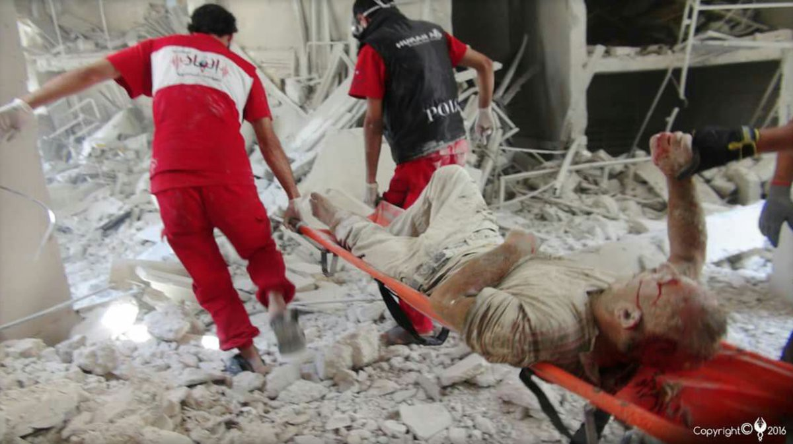
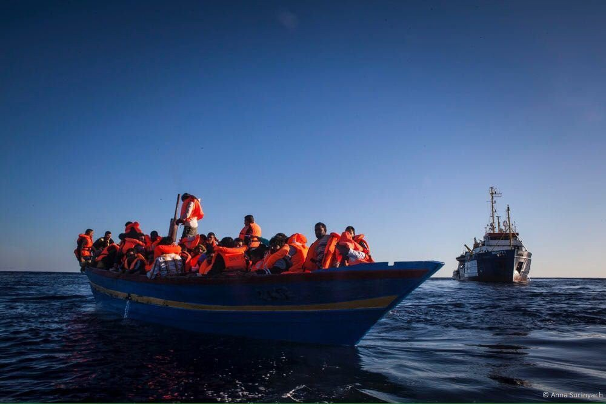
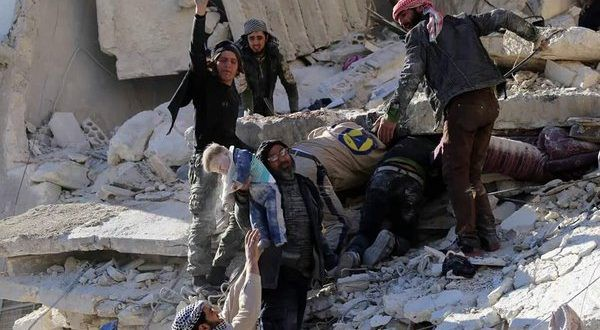
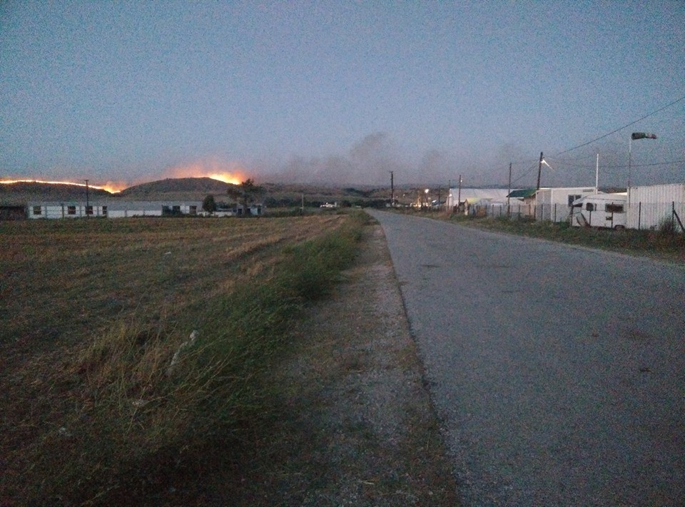
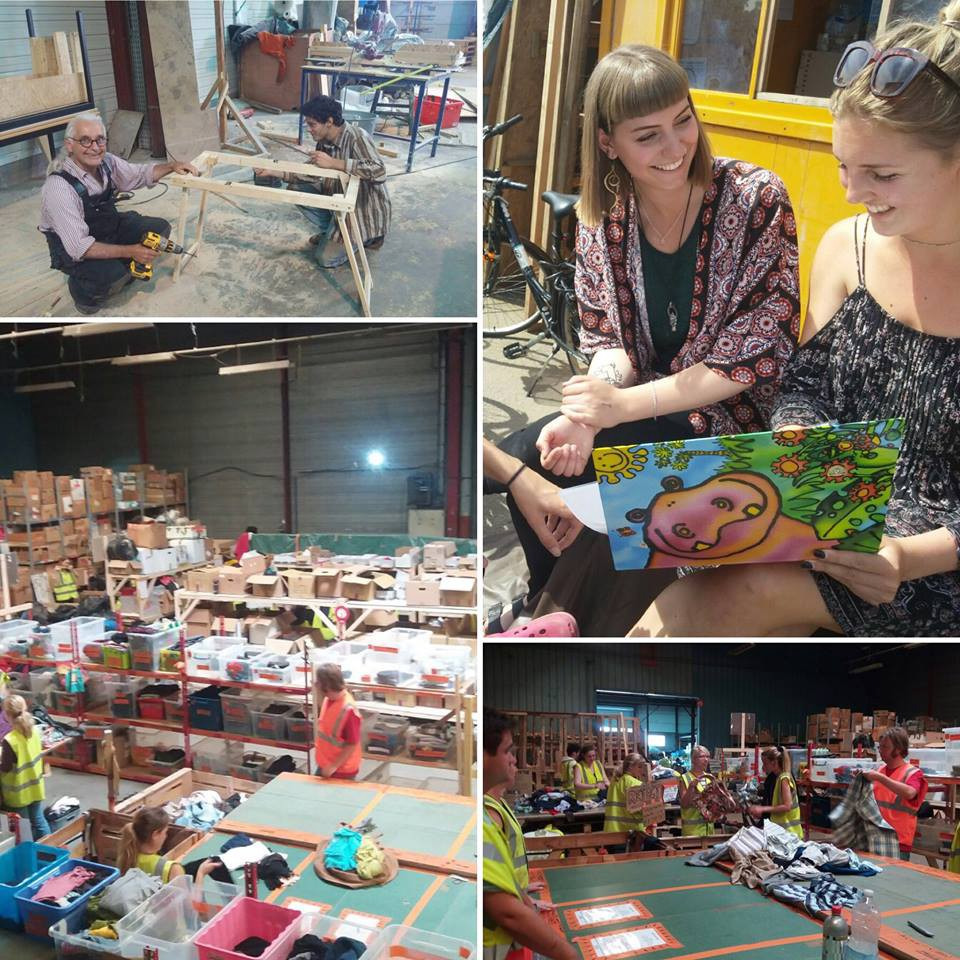
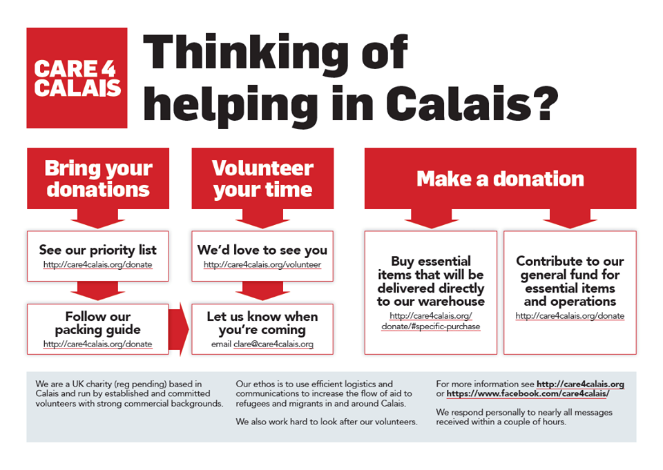
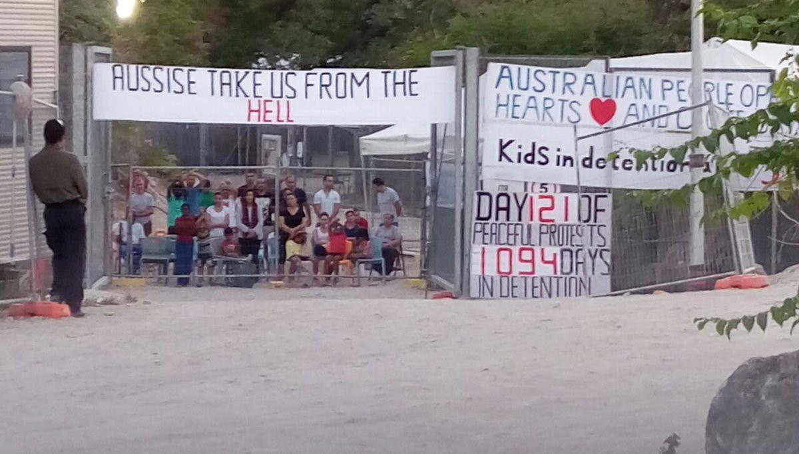

### AYS daily digest 18/7: Syria is burning in the aftermath of Nice tragedy

Aleppo today\. Photo: SAMS
#### General
### **238 people saved in Mediterranean today\.**

MSF reports that rescue operations were carried out last night in the Mediterranean\. Dignity 1 saved 102 people from a small wooden boat floating in the open sea, and Aquarius saved 136 people from the rubber dinghy, the people have been covered with gas which causes severe burns when it comes to contact with the sea, MSF reports\.

Wooden boat with 102 passengers\. Photo: MSF
### **World’s six wealthiest countries host less than 9% of the world’s refugees**

While doctors are saving hundreds in the open seas, new Oxfam report proves what was already so painfully obvious — the world’s six wealthiest countries host less than 9% of the world’s refugees, according to a new Oxfam report\. While the United States, China, Japan, Germany, France and UK make up more than half the global economy, last year they only hosted 2\.1 million refugees and asylum seekers — just 8\.88% of the world’s total, the aid organization said in its report released Monday\.

Germany takes the largest share of refugees among the world’s richest countries \(around 700,000\), with the remaining 1\.4 million split between the other five nations\.

In sharp contrast, the nations that host more than half of the world’s refugees and asylum seekers account for less than 2% of the world’s GDP\. Jordan, Turkey, Pakistan, Lebanon, South Africa and Palestine collectively host almost 12 million people\.
#### Afghanistan
### **While clashes are being reported, Afghanistan, backed up by UNHCR calls for people to return home**

As Taliban hold more ground in Afghanistan then in 2001, and there are constant reports on fighting, clashes and civilian casualties, one of the solutions that world leaders have come up with in order not to take in those coming from this country comes in a very strange form\. As Daily news reports, the Afghan government has launched a national campaign to persuade its citizens to return home\. This is the first instance in the last two decades the Afghan government has formally launched a campaign to encourage its citizens to leave their refugee life in Pakistan\.

Addressing the Afghan refugees, Afghan consulate general Dr Abdullah Waheen Poyan said that Afghanistan needs your contribution in the peace process\. Come back and take part in the reconstruction of Afghanistan\.

The UNHCR is giving $400 to every returning refugee to start a life in Afghanistan\.
#### Syria
### **Many civilian casualties fall under U\.S\. backed coalition and strong help from France in the aftermath of Nice tragedy\.**

French Interior minister Bernard Cazeneuve, left, flanked by French Defence minister Jean\-Yves Le Drian, delivers a speech after a defense and security council at the Élysée Presidential Palace in Paris, on Monday\. _PHOTO: AGENCE FRANCE\-PRESSE/GETTY IMAGES_

Even though rich countries are reluctant to take in the casualties of war, it seems that French president Hollande has put his harsh words into action by attacking, as part of the U\.S\. led coalition, what seem to be ISIS strongholds in Syria\. As the Sunni extremist group has claimed responsibility for Nice attacks, no real links were made between the group and the driver of the bus, but it seems that consequences of words are taking many more innocent lives\. ABC news reports that Syrian activist groups say airstrikes by the U\.S\.led coalition targeting areas controlled by the Islamic State group have killed at least 15 civilians yesterday and U\.S\. medical organization SAMS also reports on 28 casualties including children in one quarter of Aleppo\.
### **Hundreds have died since the escalation of bombing from all sides**

Aleppo burning

As bombing has escalated even before Nice attacks, The Syrian Observatory for Human Rights reports of more than a hundred civilians, many of them children, have died from coalition bombs since May the 31st during the Manbij m operation in Manbij city\. Coupled with regime attacks backed by Russians, Syria is burning with many hundreds of civilians reported dying in the attacks in the last two and a half months\.
### **Aleppo’s main supply artery closed\.**

![Smoke rises after air strikes on Castello Road in Aleppo, Syria, last month \[Abdalrhman Ismail/Reuters\]](assets/68b03e417330/1*CWpapJIv3lw7XhXnigoQqA.jpeg)

Smoke rises after air strikes on Castello Road in Aleppo, Syria, last month \[Abdalrhman Ismail/Reuters\]

To make things worse, the main supply road in Aleppo, Castello road is closed\. This is the “artery of the city” where food and medical supplies come in and with it being closed of “people are fighting over loafs of bread now” as prices have risen over 300 percent, Al Jazeera\. reports
#### Lebanon
### **Refugees protest in Lebanon**

The Daily Star Lebanon reports that Syrian refugees in an east Lebanon makeshift camp Monday held a protest over the conditions they were living in\.
#### Greece
### **76 new arrivals in Greek islands**

There were 76 new arrivals in Greek islands in the last 24 hours\. There are now 2,960 people on Lesvos, 2,480 on Chios and 1,059 on Samos that have arrived since EU\-Turkey deal has been implemented\. All of them have seeked asylum as reported by Greek ANA\-MPA news agency reported on Sunday\.
### Fire in the Nea Kavala camp

There are reports of a fire in Nea Kavala camp, still no casualties reports fortunately\.

Nea Kavala camp
### Those who are not inside official camps can pre\-register now

Also, if you are working with refugees around Thessaloniki and Athens that are not inside official camps, they are able to pre\- register, too\. Please follow this News that moves link for more information [http://bit\.ly/29PyXXd](http://bit.ly/29PyXXd) as it gives also details on public transportation and official statements from the government on this issue\.

Since not much has changed in Greece and reality is shaped by waiting in the camps we would like to share one message that can perhaps help to understand what it feels like to be treated like a number out of around 56 000 people stranded in Greece:
### **Four months in Greece — message from a refugee**

“Four months in Greece…Every one maybe want to ask how do feel after four months in the camps\. \. I cannot answer simply how I feel can you help me please???? When your home is small tent in the middle of nowhere\. \. \.when you must wake up every morning trying to make your week tent more strong in face of the wind , rain or even the heat and you can’t do it… when you see every day sick people , pregnant women , kids fighting the sickness in the dark of this tents and nobody cares… when you hope from the world to give you a solutions after four months waiting and the only solution that they give move you to other camps and give you bigger tent\. \. when you see people ranaway from the war maybe they will find the safety in some where in this planet, and now???? They are hopeless at the gates of Europe to the extent they would prefer a return to war because they think it is more merciful from here…when someone asks you for help and you can’t help him and you don’t know any body can help…When they forget your name and they called you by your tent number\. If you can tell me how I feel please tell me because I don’t have words to discredit how I feel\.”

2B5

Vasilika camp
#### Serbia
### **Political mood changing in Serbia — refugees threatened with arrests and more control on the borders**

As political mood is changing in Serbia and people are not allowed to seek shelter in camps and centers in fear of being arrested as announced by minister Vulin, not much is let but to sleep on the streets in increased numbers\. As if that is not enough, Serbia tightens border controls with FYROM and Bulgaria in a joint operation between police and army\. Allegedly joint military and police forces will prevent illegal entry of migrants from FYROM and Bulgaria and aims to stop human trafficking\.

### **Distribution of more than a thousand of meals daily in center of Belgrade**

Amidst all this, there is more pressure on the organizations left in the center of the city, but as Info park reports, they have, together with Praxis managed to distribute some 1400 meals today with donations by C&A Foundation and AXA, Čovekoljublje \(Philanthropy\), Jesuit Refugee Service \(JRS\), Help Now Switzerland and Caritas\.
#### France
### **Calais urges for help in donations and volunteers — please read**

While the government is busy with war, volunteers in Calais are asking for solidarity funds since they are running out of supplies and volunteers since 6000 refugees are living in a camp in Calais and 30 arriving daily\.

If you are able to volunteer for any period of time, please read this message [http://bit\.ly/29PzioW](http://bit.ly/29PzioW) , if you can’t volunteer, but can donate, please follow the link [http://bit\.ly/29QyKxP](http://bit.ly/29QyKxP)

Care4Calais has issued the most comprehensive call for help since they have have summarized it in several points and made a diagram of how you can understand what it is that is needed and how you can help\. Please read their message, too [http://bit\.ly/2a6RlaB](http://bit.ly/2a6RlaB)

As if these calls for help aren’t enough, the doctor currently working with mothers and children in Calais has put out a call to help a new newborn that has just came into this world only to be welcomed by the Jungle\. Sophie Muller, the doctor in question would like to fundraise in order to be able to get the new parents and a new baby out of the Jungle for at least couple of weeks\. They have done it before with other newborns and it was really beneficial for them\. Please turn to this link to help [Www\.paypal\.me/calaisrefugeeaid](http://www.paypal.me/calaisrefugeeaid)
#### Australia
### **Refugees still protesting detention in Down Under**

Nauru camp today

It might seem far away, but state sanctioned violence against migrants of this world is the same everywhere\. Today marks the day 121 of continued protests of detained refugees in the Nauru camp in down under\.

_Converted [Medium Post](https://areyousyrious.medium.com/ays-daily-digest-18-7-syria-is-burning-in-the-aftermath-of-nice-tragedy-68b03e417330) by [ZMediumToMarkdown](https://github.com/ZhgChgLi/ZMediumToMarkdown)._
