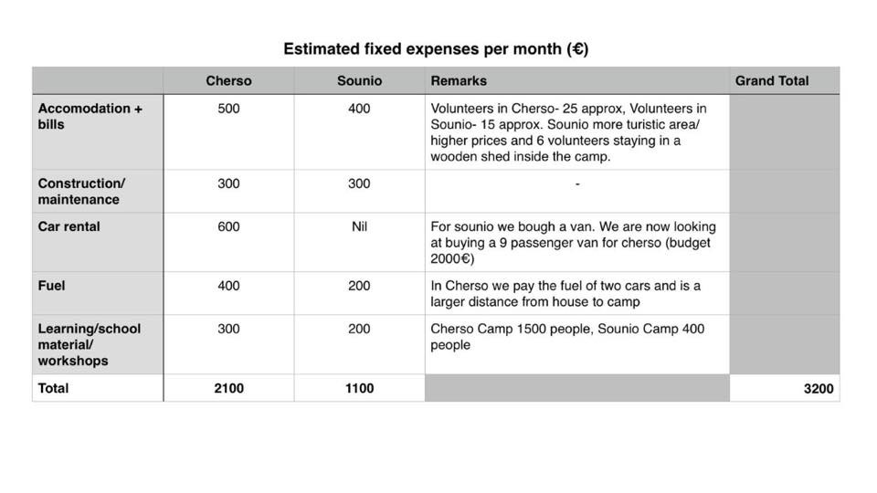
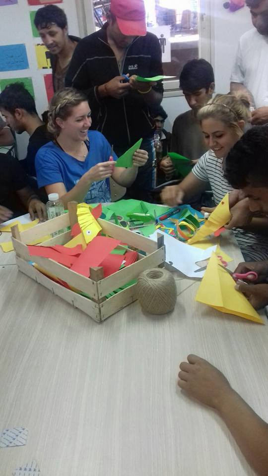

### AYS Daily News Digest 19/7: The Long Wait

](assets/56c082fb9154/1*_s8VnV1zNFBVGs1E6IeBLg.jpeg)

Volunteers doing their best to put smiles on refugee children’s faces\. Credits: [**Contaminando Sonrisas**](https://www.facebook.com/CntmSonrisas/)

> Refugee children, many of whom are orphans, being deported back to their countries of origin after reaching 18\. Deportations from Serbia also in preparation\. Police in France is confiscating even that little food and water refugees have\. They claim it is dangerous, being hungry and dehydrated isn’t? Meanwhile, killings in Syria continue\. 

#### Syria
### The Syrian Civil Defense Force hit by ‪‎Russian Airstrikes

The Civil Defense Force was targeted in a Russian air strike\. The Civil Defense Force has been providing life\-saving services since the start of the war\. It has also, for the whole time, been the target of different fractions\.

See the video [here](https://www.facebook.com/groups/1652972374920129/) \.
### Raqqa is being silently slaughtered

Reports say that 160 civilians were killed by coalition arstrikes on [Altokhar](https://www.facebook.com/hashtag/altokhar?hc_location=ufi) village near [Manbij](https://www.facebook.com/hashtag/manbij?hc_location=ufi) today\.
### Pain, casualties and great despair after yet another bombing of Aleppo

”We don’t need charity\. We need you to protect us\! We have nobody but God\! We have nobody but God\! We have nobody but God\!”

According to the UN, there has been 400\.000 deaths so far in Aleppo\.

Watch the video of today’s bombing [here](https://www.facebook.com/liveupdatesfromsyria/videos/912533192190457/?autoplay_reason=gatekeeper&video_container_type=0&video_creator_product_type=2&app_id=2392950137) \.

Credits: Syria Civil Defense

US\-led coalition forces carrying out airstrikes in Syria must redouble efforts to prevent civilian deaths and investigate possible violations of international humanitarian law, Amnesty International urged amid growing reports that scores of men, women and children were killed in their homes in al\-Tukhar village, near Manbij, on 18–19 July\.

Since June, more than 100 civilians are reported to have been killed in suspected coalition attacks on the Manbij area of northern Syria, which has been controlled by the armed group calling itself Islamic State \(IS\) \.

“The bombing of al\-Tukhar may have resulted in the largest loss of civilian life by coalition operations in Syria\. There must be a prompt, independent and transparent investigation to determine what happened, who was responsible, and how to avoid further needless loss of civilian life\. Anyone responsible for violations of international humanitarian law must be brought to justice and victims and their families should receive full reparation,” said Magdalena Mughrabi, interim Deputy Director of the Middle East and North Africa Programme at Amnesty International\.
#### Lebanon
### Help fight the bad environmental impacts of the refugee crisis

The environmental impacts of the refugee crisis are severely underestimated as is the ensuing health crisis caused by unsanitary conditions — it needs addressing immediately\.

The garbage situation in Lebanon is awful\. It is root to disease, discomfort and builds on the already tense situation between the Lebanese and the Syrians\. Streets and fields are filling up with trash\. The Lebanese blame the Syrians for overloading the capacity of the garbage system\. The municipalities are broke and tensions are rising\.

**H [umanitarianman Martin Kvernbekk](https://www.facebook.com/humanitarianman/?rc=p)** was requested if he could help provide simple garbage bins to Rachaya municipality\. The municipality promised that if the bins are there, they will empty them on a regular basis\. Each trash bin is $29 USD when bought in bulk\.

If you can help Martin with funds to acquire 100 bins, he will personally go buy and place them out\! See what the garbage crisis looks like in Martin’s [video](https://www.facebook.com/humanitarianman/videos/321107794899380/?hc_location=ufi) \.
#### Greece
### Urgent call to action: Nurture Project International \(NPI\)

More and more refugee children are at risk of malnutrition\. Help NPI provide high calorie food packs, micronutrient sachets, and Iron supplements to refugee children and pregnant and lactating women\.

NPI teams are currently collecting information in all camps on the dietary diversity of mother and child pairs\. This includes collecting data, assessing appropriateness of their response, addressing caloric need for children under the age of 24 months, pregnant women, and lactating women as well as addressing iron deficiency and micronutrient deficiency for all children under the age of five years old, pregnant women, and lactating women\. As the NPI collect complete records of population groups in the camps and basic nutrition indicators, more and more malnourished, underweight, and at risk mothers and children are identified\. Quick and urgent action is needed, [donate](http://nurtureprojectinternational.org/donations/urgent-campaign-nutrition-response/) $25 today to make a difference\.
### OCC started English lessons at Sounio Camp

Many kids attended\. They had a lot of fun and were very happy afterwards\!

](assets/56c082fb9154/1*nfzOpsfC-mkQYpyWh6GhOg.jpeg)

Credits: [**Open Cultural Center — OCC — former Idomeni Cultural Center**](https://www.facebook.com/OpenCulturalCenter/)

](assets/56c082fb9154/1*zbH8ptPjKUKL2tnkciraqw.jpeg)

Credits: [**Open Cultural Center — OCC — former Idomeni Cultural Center**](https://www.facebook.com/OpenCulturalCenter/)

](assets/56c082fb9154/1*0LvWY88BZh_8c474nCvlFw.jpeg)

Credits: [**Open Cultural Center — OCC — former Idomeni Cultural Center**](https://www.facebook.com/OpenCulturalCenter/)
### Clowns spotted in Turkey, bringing smiles to refugees’ faces

From Contaminando Sonrisas, a group of mainly Spanish clowns who have been going around Turkey the last 10 days in different refugees camps and realities to bring a smile to children and adults\. Since Idomeni was shut down, they kept working in various camps in Northern Greece as well\.

](assets/56c082fb9154/1*4fKI2m_yGF2XRASo3nFIbg.jpeg)

Credits: [**Contaminando Sonrisas**](https://www.facebook.com/CntmSonrisas/)

](assets/56c082fb9154/1*CeWq_bAJo1jXGCevRXPIRw.jpeg)

Credits: [**Contaminando Sonrisas**](https://www.facebook.com/CntmSonrisas/)

](assets/56c082fb9154/1*QuDFYKdTA_0eqdOhOADeUg.jpeg)

Credits: [**Contaminando Sonrisas**](https://www.facebook.com/CntmSonrisas/)

](assets/56c082fb9154/1*_s8VnV1zNFBVGs1E6IeBLg.jpeg)

Credits: [**Contaminando Sonrisas**](https://www.facebook.com/CntmSonrisas/)
### This is how you can support refugees in Idomeni, Greece

Open Cultural Center \(former Idomeni Cultural Centre\) presents their costs over the the past 5 weeks\.

Open Cultural Center expenditures for the past month\. Credits: Open Cultural Center

The project covers two different camps with a total of over 2000 refugees\. Part of these costs are covered by some volunteers who come to the fields and have raised donations, the rest are covered by the donations that the organization received from private individuals, small associations, as well as events and activities they organized\.

OCC’s and with 30–45 independent are in need of donations in order to be able to over the costs of the project and to continue delivering education and cultural activities\.

You can help in the following ways:
1. [Free Donation](https://www.youcaring.com/idomeni-cultural-center-561260)
2. [Donation of 1 € per month](https://www.teaming.net/openculturalcenter)
3. Material donations in form of school supplies are also more than welcome

### Tents and blankets urgently needed in Thessaloniki

If you can help, please contact [**No Border Camp Thessaloniki 2016**](https://www.facebook.com/NoBorderCampThessaloniki2016/?fref=nf) **\.**
### Tourism crisis at Lesvos

The island of Lesvos is especially quiet for this time of the year\. More specifically, there are no tourists due to the refugee crisis\. With all the volunteers leaving as well, the local community is having a hard time financially\.

Lets not forget Lesvos\! One way to help is by supporting these two girls in organizing Symbiosis festival\. It is starting next week and volunteers are needed\!

### Let the refugees cook

Being able to cook and feed oneself is a very simple right that we should all have access to\.

And yet for many refugees living in camps this is quite simply not a reality\. They either have to rely on catered food or they are forced to cook in far from ideal conditions\.

The organization Better Days has been working on setting up communal kitchens in various camps in Northern Greece\.

These spaces allow refugees to prepare supplementary and culturally appropriate food in a safe, hygienic, and sustainable setting\.

If you would like any more information or are interested in funding their work, please get in touch with [**Together for Better Days**](https://www.facebook.com/betterdays.ngo/?fref=nf) \.

](assets/56c082fb9154/1*KeqgO2DCg9m8VhnwzLj2jg.jpeg)

How healthy can a meal prepared in these conditions be? Credits: [**Together for Better Days**](https://www.facebook.com/betterdays.ngo/?fref=nf)
### Who are the Mobile Info Team, what can they do for you and what you can do for them

The Mobile Info Team are a group of volunteers dedicated to bringing refugees reliable information and up\-to\-date news on asylum\. Based in Northern Greece, MIT makes weekly visits to 8 different camps in the Thessaloniki area, as well as taking on some specific cases they feel they can help with and bridging the gap between on\-the\-ground needs in camps and other groups who can meet them\. Their aim is to give refugees enough verified info that they can make the informed decisions that best suit them\.

MIT are currently searching for people who have already had interviews with the Greek Asylum Service \(NOT pre\-registration\) and/or been successfully relocated from Greece, in order to better understand what applicants can expect\.

They are also looking for volunteers in camps across Greece who would be interested in helping to share their infosheets remotely\. They provide info, volunteers would update an infowall in their camp\.

If you can help them with either, please write to:
[https://www\.facebook\.com/mobileinfoteam/](https://www.facebook.com/mobileinfoteam/?hc_location=ufi) 
or
mobileinfoteam@gmail\.com

Donations are always appreciated\!
[https://www\.youcaring\.com/mobile\-info\-team\-584271](https://www.facebook.com/l.php?u=https%3A%2F%2Fwww.youcaring.com%2Fmobile-info-team-584271&h=2AQHv7cQM&s=1&enc=AZOstBlEc3DRV573Ys4LeBh2LYD9OHTLK4ulDMUZuLrrA-c5G2ZfKkeOjf_d_JPupPRxACMuJyrsGSCIvUSOKVCf&hc_location=ufi) 
Foundation bank account:
IBAN — NL76 INGB 0007 3490 21
BIC — INGBNL2A
### Severe weather warning: Waves up to 2 metres expected

The severe weather warning applies to the whole Aegean Sea for the next 24 hours\. Samos will be having waves < 1m, Lesbos, Chios and Kastelorizo <1\.5 m, and the rest of the islands will have < 2m\!

You can always reach the weather report through this [link](https://sao.ngo/weather) \.

The weather in this link is updated twice daily\.

Credits: United Rescue Aid
#### Serbia
### Are deportations from Serbia to start soon?

Last Friday, the AC Krnjaca started to be emptied\. First to be kicked out were the refugees without valid documents\. Thereafter, all the rest were moved to Sid, Adasevci and Principovac\. These places now hold about 600 refugees, while there are less then 100 in Krnjaca\. This is a really strong indication that these refugees may be transferred to Croatia\.

New documented refugees are being sent to AC Sjenica, Tutin, Bogovadja and Banja Koviljaca\. Refugees without the documents sleep outside\.

Info Park reported that around 650 refugees slept at Belgrade’s bus station\. More specifically, this morning around 8:15 they counted more than 650 refugees sleeping or just waking up in the park\. More than 520 refugees were in the lines for breakfast\. The organization fed refugees with 1,000 pastry packets, salty and sweet, provided by Caritas, and an almost similar number of tea or coffee cups\.

All went peaceful and in order\. There was lots of effort, not only by Info Park staff, but also the refugees themselves, to regulate the queues\.

We are afraid that deportations from Serbia could happen soon, as prime minister Vucic announced this Saturday\.

### Refugee workshops ar Miksaliste

The Refugee Aid Miksaliste, together with the Fondacija Ana i Vlade and the USAID, organize two workshops a week for refugees at Miksaliste\. These partners gave refugees language lessons, general info about their stay in Serbia, as well as information on the available aid organizations\.

The workshops also aim at creating cultural awareness among the locals and to promote integration of the refugees\.

 \.](assets/56c082fb9154/1*scT-y7GShG3xSBHAGd769w.jpeg)

Crafts workshops for refugees at Miksaliste\. Credits: [Refugee Aid Miksalište](https://www.facebook.com/RefugeeAidMiksaliste/?ref=stream) \.

 \.](assets/56c082fb9154/1*-MAf71rVLSDlHmofVJZ3Og.jpeg)

Flowers of hope\. Credits: [Refugee Aid Miksalište](https://www.facebook.com/RefugeeAidMiksaliste/?ref=stream) \.
### Aid coming to refugees at Miksaliste tonight

Refugee Aid Mikaliste and their partners: Praxis, Save the Children, Centre for the Integration of Youth and Adra, will tonight again distribute the aid to the refugees living in the park near the University of Economics\.

](assets/56c082fb9154/1*RzLHjN0nSQeBw4qQ-T4bLQ.jpeg)

Aid is on its way to Miksaliste\. Thank you [**Refugee Aid Miksalište**](https://www.facebook.com/RefugeeAidMiksaliste/)
### Hundreds of Migrants ‘Reached Belgrade via Bulgaria’ Last Week

Up to 300 migrants reached Belgrade on a daily basis after having crossed into Serbia from Bulgaria, a non\-profit says\.

Info Park, an NGO that deals with feeding **migrants** who aren’t registered with Serbian authorities, say a minimum of 50 people did so every day last week\.

The development comes as Serbia [announced](http://www.novinite.com/articles/175516/Serbia+Sending+Army%2C+Police+along+Bulgarian+Border+over+%3Cb%3EMigrants%3C/b%3E) it was setting up joint army and police forces to deploy them to the borders with Macedonia and Bulgaria\.

Bulgaria’s Interior Ministry estimates, quoted by news website Dnevnik\.bg, suggest as many as 254 “third\-country nationals” were detained last week while trying to enter Serbia\.

Of these, 145 were neither detected while crossing into Bulgaria nor registered with the State Agency for Refugees\.
#### Croatia
### “Weird Wired Landscapes” photo story exhibition

The exhibition holds 13 photos’ story made by Branko Pašić, by which he shows the problematic side of the barbed wire fences\.

This multilayered exhibition, which touches the subjects of politics, economics and ideology while, at the same time, does not forget the aesthetics\.

The exhibition opens today and will be on display till the 1st of August in Galerija Principij in Rijeka\. Read more about the exhibition [here](http://www.h-alter.org/vijesti/weird-wired-landscapes) \.
#### Austria
### Refugees started a hunger strike to protest inhumane conditions of the food they are given

The food given to refugees is of sub\-human condition\. For example, a bottle of an expired juice and 200g of the worst quality mortadella makes a lunch for 3 children and 2 adults\!

](assets/56c082fb9154/1*MET3v3I2_qw0hHi8AovUQw.jpeg)

Hungry refugees\. Credits: [**Plattform Refugees Welcome**](https://www.facebook.com/plattform.refugees.welcome/)
#### Germany
### Visiting the IOM “Family Assistance Programme” centres may speed up the
processing of refugees’ visa application

The IOM “Family Assistance Programme” centers provide support and legal advice to refugees before their actual appointments to apply for family reunion, in cases of having a family member in Germany\. The Centers check if all the needed documents are there and provide other advice refugees may seek for\.

The program started about a week ago, with the first refugees being given appointments at the German embassies in Turkey and Lebanon\. The centers will open in Istanbul, Beirut and Gaziantep\.

More info in [English](http://www.tuerkei.diplo.de/contentblob/4823252/Daten/6615693/iomfamilienuntersttzungsprogrammeng.pdf) and [Arabic](http://www.tuerkei.diplo.de/contentblob/4823244/Daten/6653860/iomfamilienuntersttzungsprogrammara.pdf) \.
#### France
### Welcome to Our Jungle — Refugee Voices, a participatory photography project by the refugees of the Calais camp

[‘Welcome to Our Jungle](http://www.welcometoourjungle.com/) ’ is a participatory photography project based in the refugee camp known as the ‘Jungle’ in Calais, giving a much needed platform for the voices of those directly affected by the crisis\.

Participatory photography involves empowering participants by putting the cameras into their hands and giving them the skills to tell their own stories\.

### Art in Calais

](assets/56c082fb9154/1*6CDbj2j005TGsxcE3a80cg.jpeg)

Credits: [**ART in the Jungle**](https://www.facebook.com/ARTintheJungle/)

](assets/56c082fb9154/1*4Zn0lqmPO-vy-bVabdiBjA.jpeg)

Credits: [**ART in the Jungle**](https://www.facebook.com/ARTintheJungle/)

](assets/56c082fb9154/1*3xxI-W27xH5pJ3krjzSbbA.jpeg)

Credits: [**ART in the Jungle**](https://www.facebook.com/ARTintheJungle/)
### Police raiding some restaurants in the Calais refugee camp, confiscating food and water from refugees

As a part of the raid, the police are arresting restaurant owners and confiscating goods\. Many more police are on stand by down the road including water canon\. Atmosphere seems calm and resigned\.

](assets/56c082fb9154/1*j5Q6pU3-FCvijytegW6z-A.jpeg)

Credits: [**Calais — People to People Solidarity — Action from UK**](https://www.facebook.com/groups/CalaisMigrantSolidarityActionFromUK/)

French police officers bagged food \(both donated and cooked from the camp’s restaurants\) because considered “not fit for consumption”\. The police is arresting one owner from each place of business and confiscating anything and everything that is part of their business: pots and pans, gas stoves, food supplies, scissors and shavers\.

Refugee owner of the Kids Restaurant has been arrested\. The pretext is the ‘illegal business without authorization, an underground economy being sustained, and the absence of health safety measures”\. 
We all know the real reasons…to discourage the refugees from staying in Calais, to prevent them from helping themselves, and to kill the solidarity and sharing that has existed between refugees and volunteers for many months now\.

Kids Restaurant and Welcome Restaurant in the camp are responsible for feeding the unaccompanied minors of Calais as well as other members of the Jungle Community\. See the [video](https://www.facebook.com/groups/1652972374920129/) \.

This action from the government today is more to intimidate and discourage both refugees and volunteers than anything else\.
#### UK
### The Bureau of Investigative Journalism Revealed: The thousands of former child refugees deported to Afghanistan and Iraq

Thousands of young people who sought refuge in Britain as unaccompanied child asylum seekers have since been deported to war torn countries that are in part controlled by Islamic State, the Taliban or other repressive regimes, a Home Office minister has admitted\.

James Brokenshire said that over the past nine years 2,748 young people — many of whom had spent formative years in the UK, forging friendships and going to school — had been returned to the likes of Afghanistan, Iraq, Iran, Libya and Syria\.

The bulk — some 2,018 — have concerned Afghanistan, but an investigation has found that 60 young people have also been deported to Iraq since 2014, the year so\-called Islamic State began its brutal regime in swathes of the country\.

The findings, which were triggered by questions from the Bureau of Investigative Journalism and Labour MP Louise Haigh, raise serious concerns about what happens to child asylum seekers when they turn 18, and at a time when Britain is being urged to help thousands of orphaned child refugees from Syria\.

Labour frontbencher Haigh said: “These shocking figures reveal the shameful reality behind our asylum system\.

“Children who flee countries ravaged by war in the most appalling of circumstances are granted safe haven and build a life here in the UK, but at the age of 18 can be forced onto a charter flight and back to a dangerous country they have no links to and barely any memory of\.

“With many more vulnerable young children due to arrive in the UK over the next five years the Government needs to answer serious questions and provide a cast\-iron guarantee that vulnerable young people will not sent back to war zones\.”
### Community and faith groups will be able to sponsor Syrian refugee families who are being resettled in the UK under a new scheme launched by the Government today

Community and faith groups will be able to sponsor Syrian refugee families who are being resettled in the UK under a new scheme [launched by the Government today\.](http://www.parliament.uk/business/publications/written-questions-answers-statements/written-statement/Commons/2016-07-19/HCWS95)

Under the community sponsorship programme, charities and community interest companies will need to provide housing for the family they sponsor, as well as helping them to integrate into life in the UK, access medical and social services, arranging English language tuition and supporting them towards employment and self\-sufficiency\.

The scheme will be primarily aimed at helping the 20,000 Syrian refugees being resettled here by 2020\. The Government has not committed to using community sponsorship to expand that scheme and bring more refugees to safety\. However, the Refugee Council hopes it will become a way for more refugees to come to the UK safely and legally in the future\.

Sponsoring organisations need the agreement of their local authority and a comprehensive plan for resettlement in order to apply for the scheme\. The Home Office has promised it will check that potential sponsors do not present a risk to the resettled family\.

Refugee Council Chief Executive Maurice Wren welcomed the announcement of the scheme, saying: “This scheme helps harness the eagerness and determination of the public to welcome refugees into their communities\. Hopefully it can also become a way for more refugees of all nationalities to reach the UK safely and legally in the future\.

“While this sponsorship scheme is welcome progress, it must be complemented by a much wider, compassionate and comprehensive response from the Government to addressing the global refugee crisis which prioritises giving more refugees safe passage here, particularly those who are desperate to join their loved ones\.”
### Boris Johnson says Assad must go if Syrians’ suffering is to end

Johnson said: “I will be making clear my view that the suffering of the Syrian people will not end while Assad remains in power\. The international community, including Russia, must be united on this\.”

The official Foreign Office view is that Assad can stay only for a short period as part of a transitional government\.

_Converted [Medium Post](https://areyousyrious.medium.com/ays-daily-news-digest-19-7-the-long-wait-56c082fb9154) by [ZMediumToMarkdown](https://github.com/ZhgChgLi/ZMediumToMarkdown)._
