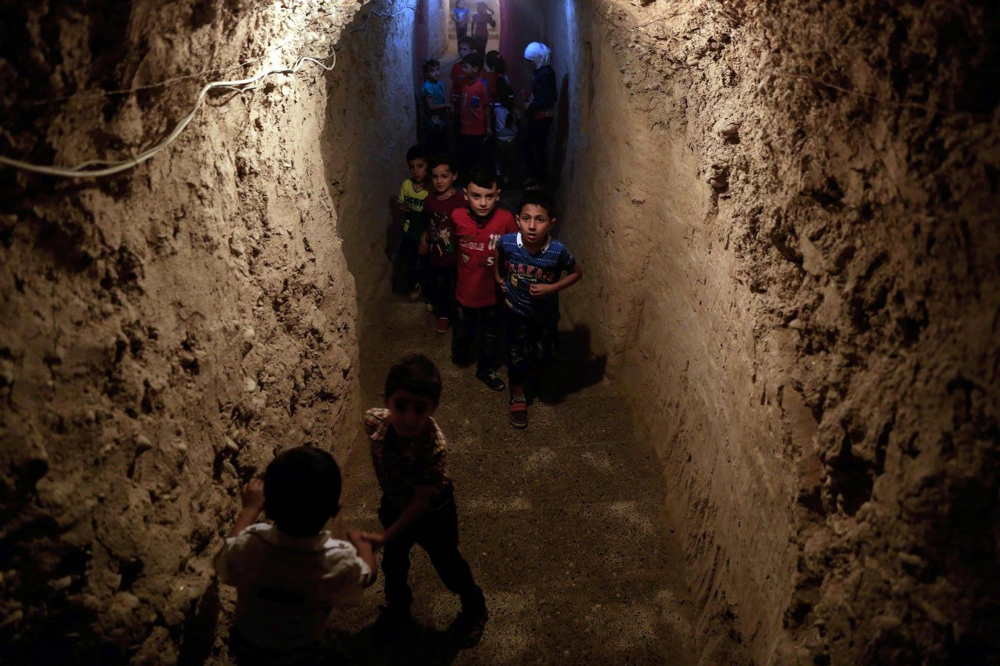
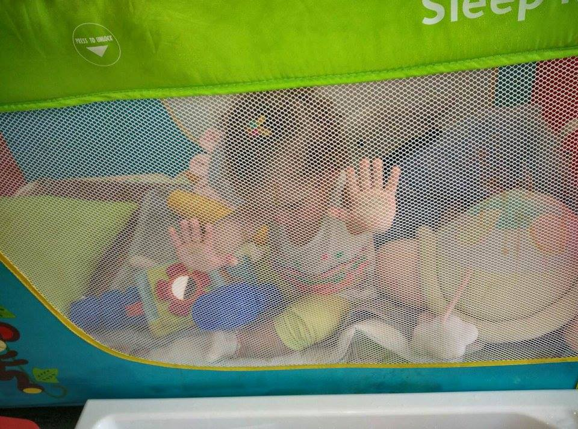
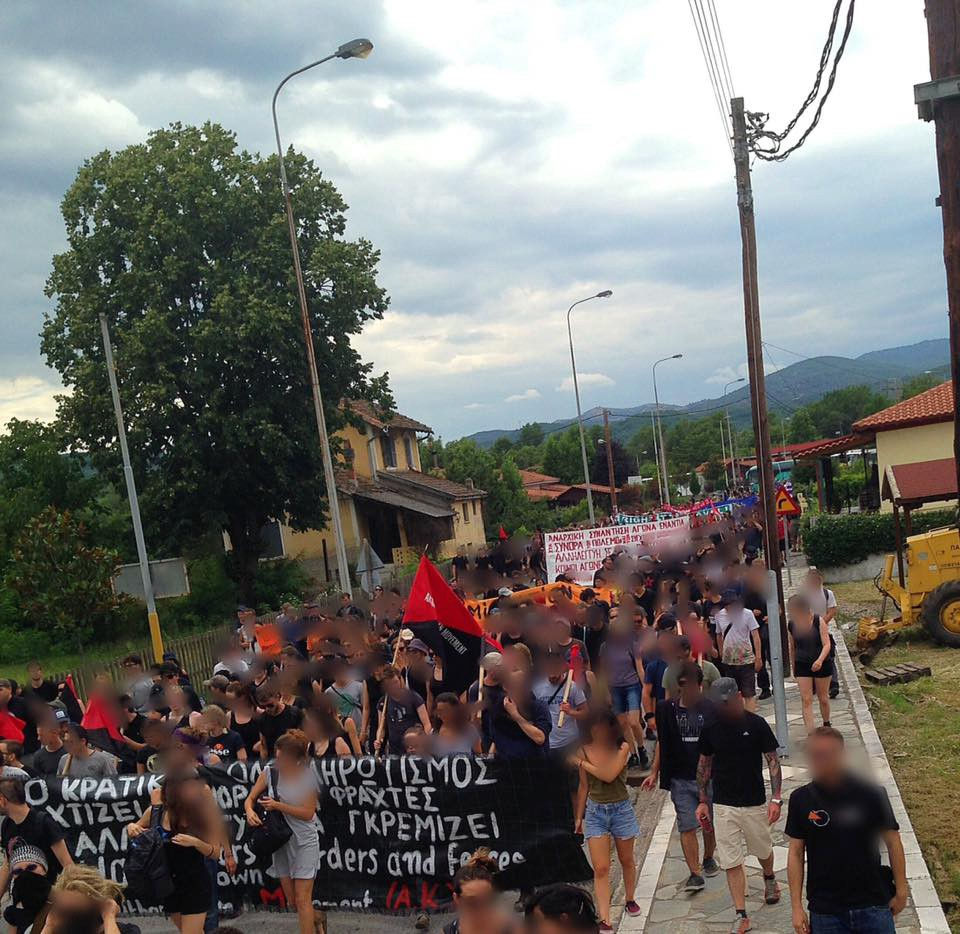
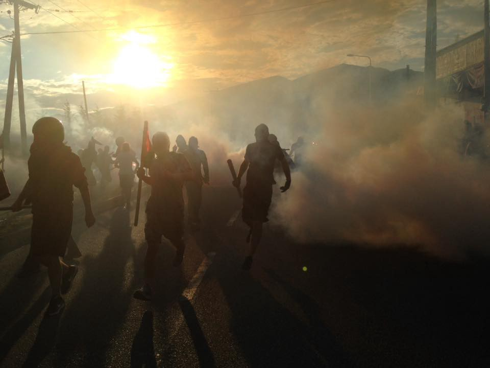
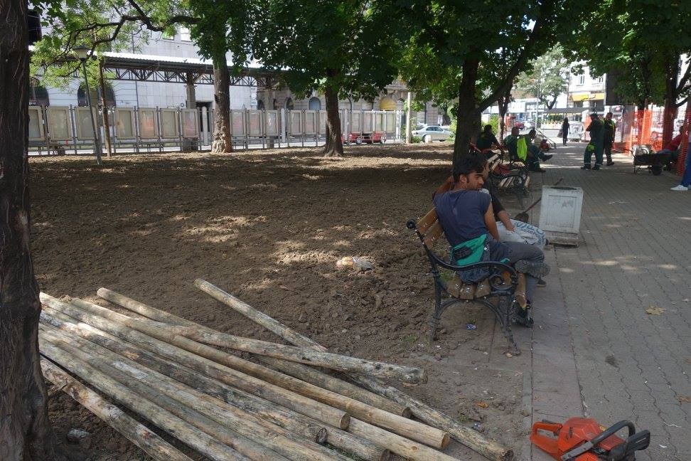
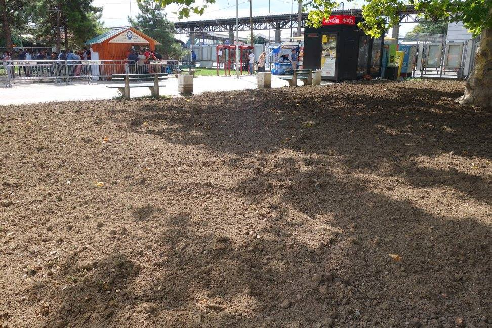
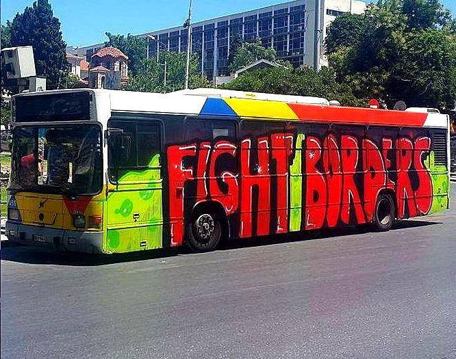

### Hope is tested through fires of cruelty: AYS Digest 20/7

In this digest, the suffering of children of Syria and beyond, the callous ambivalence of systems of order in select Greek camps, activists and refugees speak out, possible plans to cut refugees off from support structures\.

](assets/124fc2a2ad12/1*sVUnU3tUUBG_fvTJXJE01Q.jpeg)

Xanthi Camp, Greece; Photo Credit: [Nima Yaghmaei Photography](https://www.facebook.com/nyagphotos/)
#### SYRIA
### The future must be protected in Syria and abroad\.

In light of media attention of the truly horrific murder of a young Palestinian boy, it is sobering to reflect upon the sheen number of children who have been killed since the beginning of the fighting\. 21556 children have been killed in the Syrian war since 2011\. Of them, 19773 were killed by regime forces, with up to 159 of these children having been tortured to death\. A further 729 children have been killed by rebel groups\. The U\.S\. and Russia have killed 112 and 479 respectively\. 351 and 49 were killed by ISIS and Jabhat al\-Nusra\.

Syrian Children play underground\. Photo Credit: Art Against Project

Those that have survived and will survive remain at risk, whether being put to work in dangerous, exploitative jobs, being manipulated or coerced into joining fighting forces, or simply living under threat and away from educational, empowering opportunities\. It is crucial that this generation of young Syrians, and of all children affected by war, is not lost and that they are protected, for the future of the region, and for humanity\.

Photo Courtesy of Novosadski Humanitarni Centar
#### TURKEY
### As feared, the post\-coup unrest further destabilizes refugees’ fate\.

As European countries express dismay over the crackdown that President Erdogan is conducting throughout many sectors of Turkish government institutions, the [EU\-Turkey migration deal remains tenuously in place](http://www.politico.eu/article/post-coup-crackdown-throws-doubt-on-turkey-eu-migration-deal-recep-tayyip-erdogan/?cmpid=sf) \. German Chancellor Angela Merkel reassured the public that there is no indication that Turkey has stopped fulfilling it’s end of the agreement\. For how long that will remain this way, however, remains a mystery\. Although the EU\-Turkey deal has been soundly criticized by all corners of the humanitarian community, the further instability could give rise to an even more treacherous landscape for refugees\.

In the meantime, members of Teachers Beyond Borders have kindly shared this link to materials on a series of books designed for [Arabic\-speakers learning Turkish](http://www.teachersbeyondborders.com.au/il-turkish.html) \. Language skills are crucial and empowering, so knowledge that goes far will blossom into strength later\.
#### GREECE
### Volunteers in Greece report the presence of low\-flying Turkish fighter jets in close proximity to some Greek islands\.

Although this is not unusual, it is a possible indicator of an attempt to reassert Turkish authority in monitoring the perimeter of Turkish territory\.

Protest at Paranthesti; Photo credit: Beyond Europe
#### Xanthi and Paranthesti

According to reports from Beyond Europe, two protests were organized at closed camps today — Xanthi and Paranthesti\. Both protests were organized similarly, with delegations of lawyers and doctors requesting access in order to check on the conditions of the camp\. In Xanthi, the delegation was refused and pushed back\. The crowd pushed back, breaking through some of the walls, to which the police responded with batons and tear gas\. At Paranthesti, the protests went much more smoothly as the delegation was given access, although journalists were barred\.

Protest at Xanthi, Photo Credit: Beyond Europe
#### Malakasa
### Desperate situation reaches critical mass in Malakasa\.

A volunteer delegation reports truly disturbing conditions at a camp in Malakasa\. Nearly one thousand people, mostly Afghan, languish in what is basically captivity, slowly burning under the merciless Greek sun\. Water supplies are limited, medical care even moreso, and this combination with limited waste facilities makes for a potentially disastrous situation\. Refugees are pitted against one another as interpreters are given special privileges which are sometimes abused\. The lack of any psychosocial care and any legal aid only further intensifies already desperate and at\-risk minds\. As a result, domestic violence is rampant\.
#### There are no schools, no NGOs who do any meaningful work, and no official interpreters\. They have never spoken with any lawyers\. No reporters or photographers are permitted, and there is a de facto shut down of information flow coming in and out of the camp\.

So writes Shala Ghafari, [who reported on the camp](https://www.facebook.com/permalink.php?story_fbid=10105140406890189&id=830886) \. Camp authorities maintain that projects are ongoing, however, the mismatch of the stories indicates otherwise\. It is encouraged that more humanitarian attention is brought to this camp in order to strengthen barely existent protection\. As media attention flickers, it is increasingly urgent to remain alert and observant of conditions in camps as the closure of the Balkan route ossifies current “support” structures, bringing little motivation for internal auditing or change\.
#### BULGARIA
### Refugee hunter freed as refugees caught in Bulgaria\.

Petar Nizamov who famously “apprehended” several refugees at the Bulgarian border, subjecting them to heaps of abuse, has been released on bail today in an irreversible decision made by a Bulgarian court\. The court ruled that it was unlikely that Nizamov, who had participated in citizen patrol units of the border, would reoffend while on bail\. Nizamov still must be tried for the charges against him\.

In the last 24 hours alone, hundreds of refugees have been apprehended at the Bulgarian\-Serbian border\. In a new crackdown on the quiet Balkan Route, Bulgarian Secret Police stepped up patrols and are drawing in a truly staggering number of individuals\. The Deputy Interior Minister says that this initiative is designed to sent a message that instability in Turkey does not make for an opportune moment to jump borders\.
#### SERBIA
### Park renovation a possible threat to refugees congregating\.

](assets/124fc2a2ad12/1*i-GNMsu6_FVtpRMoge6JVQ.jpeg)

Photo Credit: [**Novosadski humanitarni centar**](https://www.facebook.com/NSHCentar/)

As Refugee Aid Miksaliste continues programs for women and children in collaboration with several other NGOs, Info Park, Refugee Aid Serbia, and other organizations continue to be the primary distributors of goods and meals in the parks that are currently the primary meeting places for hundreds of stranded refugees\. Furthermore, Info Park reports that some misdeeds are afoot in the parks where they serve\. As can be seen, the park has been tilled and apparently seeded with new grass, which is a perplexing choice as the searing summer heat may otherwise completely burn up any growth\. It is suspected that this might be a polite version of trying to nudge refugees out of the common eye and park\. Those in Belgrade are advised to stay vigilant\.

Refugees in the Park in Belgrade\. Photo Credit: Info Park\.

For those interested in turning their attention north, I’m Human Organization will be assembling in Belgrade prior to driving up to Subotica and the Hungarian transit zones\. Interested parties are encouraged to contact the I’m Human Organization on Facebook\. Regardless, it remains that the primary needs at the border camps remain primarily material\. High quality tents and tarps are in high demand as harsh weather conditions have been effectively decimating any shelter\.
#### CROATIA
### Possibly 1,700 refugees may be imminently pushed back to Croatia\.

Citing the re\-establishment of the Dublin regulation, Croatian NGO The Welcome Initiative warns that up to 1700 refugees may be pushed back to Croatia from Austria\. The group has released a comprehensive statement including that “These are refugees who came to Austria via the so\-called Balkan refugee route\. Although the information about their return to Croatia is two weeks old, Austrian organization Interkulturelles Zentrum and the Welcome Initiative stress that there has been no official reaction to the announcement of their arrival, let alone any plan how they will be accommodated, taken care of and integrated\.” All that can be done is to watch and wait\.
#### HUNGARY
### New billboards repeat old talking points in campaign about Hungarian refugee referendum\.

The Hungarian government continues its propaganda campaign in order to persuade citizens to vote to reject EU refugee quotas in an upcoming referendum\. Six billboards total have been unveiled so far, citing “links” between so\-called “migrants” and the Paris terror attacks, describing the “sharp increase” in attacks on women in recent years and other common anti\-refugee talking points\.

Hungarians will vote on October 2nd on the question: “Do you want the European Union to be entitled to prescribe the mandatory settlement of non\-Hungarian citizens in Hungary without the consent of parliament?”

As a result of this increasingly hostile climate, activists remain crucial in maintaining an honest, civil, and humane dialogue about the rights of refugees in Hungarian society\.
#### GERMANY
### High court rules that deporting Syrian refugee to Hungary is inhumane\.

No Border Camp, Thessaloniki; Photo Credit: Athanasios Marvakis

The Higher Administrative Court in Mannheim, Baden\-Württemberg, enjoined the deportation of a Syrian refugee to Hungary, arguing treatment there is inhuman\. The man first arrived in Germany in 2014, at which point the Hungarian custody system had already been considered in significant dimensions flawed, and therefore the claimant would have risked “inhuman and demeaning treatment” by asking for asylum in Hungary, according to the court\.

Chancellor Merkel addressed concerns in the wake of the disturbing axe attack by an Afghan refugee, which injured several dozen on a train\. She noted that in spite of the current rising atmosphere of concern, that the data does not point to refugees posing any significant terroristic threat to Germany\. It is hopeful that in these uncertain days, that people will not give into fear, but remain grounded in facts\.

_Converted [Medium Post](https://areyousyrious.medium.com/hope-is-tested-through-fires-of-cruelty-ays-digest-20-7-124fc2a2ad12) by [ZMediumToMarkdown](https://github.com/ZhgChgLi/ZMediumToMarkdown)._
