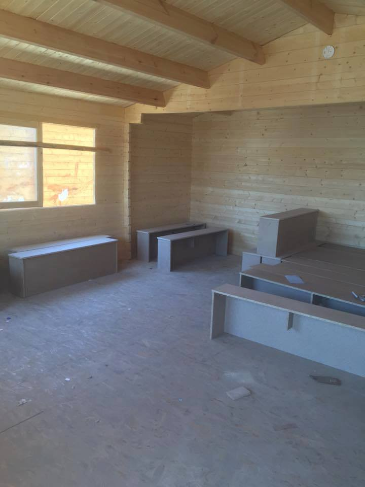

### AYS Daily Digest 22/7: Refugee protest march from Belgrade to Hungary

_About 300 people took part in protest in Belgrade, while some of them started marching toward Hungary asking for border to be open\. While the Europe is not ready to admit that the deal with Turkey was never really alive, more and more people are arriving to the continent every day, risking their lives and hoping to be safe\. New route is created at the north of Italy\. Meanwhile, in Syria situation is not improving and it does not look like the West cares enough about children and civilians in this country, as well as many other where wars are going on\._

Photo: Twitter — Benjamin Von Wyl\. Refugees who are walking from Belgrade toward Hungary\.
#### **Serbia**
### 300 refugees march in protest

A group of refugees staying in Belgrade’s city parks started a protest today, demanding opening of Serbian\-Hungarian border\. As we already reported at [our FB page](https://www.facebook.com/areyousyrious/) , around 300 people left the city centre earlier this afternoon and started marching towards Hungarian border along the E\-75 highway, intending to walk the route of 200km that leads to the border\. Around 11pm those marching had arrived 44km further from Belgrade, leaving them about 145 km to Horgos\.

The number of refugees in Serbia is increasing steadily due to trafficking, pushback from Hungary and tightened security on its border\.

Meanwhile, on Sunday, Serbia set up a joint police and military force to patrol the border with Bulgaria and Macedonia and prevent illegal movements into Serbia and the smuggling of refugees\.

> „Around 3000 refugees are currently on the Serbian territory\. They do not wish to stay here, but want to continue their journey, but with the borders closed, that journey will go significantly slower and will be very difficult\. Serbia cannot suffer because the EU is incapable of finding a common solution\.“, Serbia’s minister for social affairs Aleksandar Vulin said today, [RTS](http://www.rts.rs/page/stories/sr/story/125/drustvo/2394627/vulin-odsustvo-jedinstvenog-resenja-za-migrantsku-krizu.html) reports\. 

According to [BIRN](http://www.balkaninsight.com/en/article/serbia-is-expanding-capacaties-for-refugees-07-21-2016) , Serbian authorities are expanding capacities in refugee camps, opening four more centres in the towns of Vranje, Dimitrovgrad, Pirot and Kikinda\.

Still, a large number of refugees are not “visible to the authorities” and are outside the camps, sleeping rough in parks in Belgrade\. They will soon be facing another problem, as the announced eviction of the park is planned to begin in a couple of days, leaving the refugees once again with nowhere to lay their heads\.

Refugees protesting earlier today, photo: Miksalište

Refugees’ protest notes directed at Hungary Photo: Info Park

#### **Syria**
### Disturbing development in Aleppo

[Report from UN Office for the Coordination of Humanitarian Affairs](http://reliefweb.int/sites/reliefweb.int/files/resources/ERC_USG%20Stephen%20O%27Brien%20Statement%20on%20Aleppo%2C%20Syria%2021July2016.pdf) expresses urgency for unconditional, unimpeded and sustained access to the millions of people in besieged and hard\-to\-reach areas across Syria

> „I am gravely alarmed by the disturbing developments in the eastern part of Aleppo City in Syria, where civilian, humanitarian and commercial movements have been effectively cut off following the closure of Castello Road, the last remaining access route in and out of this area“, under\-Secretary\-General for Humanitarian Affairs and Emergency Relief Coordinator, Stephen O’Brien said in a report published on Thursday\. 

Humanitarians have not been able to reach eastern Aleppo since clashes started on 7 July between the Government of Syria forces and non\-state armed groups, which rendered the road impassable\.

Therefore, O’Brien urges all the parties involved in the conflict „to lift all sieges, to respect the safety of medical and humanitarian workers, and to ensure the protection of civilians and civilian infrastructure\.“
### Who do you care for more — Pokemon or children?

A campaign involving children in Syrian villages asks gamers from the West to take a break from their hunt for digital creatures from the Pokemon GO game and to turn their attention to young people trapped in war zones\.

Do we care for them?
#### **Mediterranean**
### More lives saved at the sea

424 lives were saved in a total of 4 operations since this morning by MOAS, Proactive Open Arms and Emergency\. Also, MSF Sea team helped 209 people, include 2 pregnant women and 50 children, of whom 45 are traveling without parents\.

Photo: MOAS

International organization for Migrations \(IOM\) estimates that 242,179 migrants and refugees entered Europe by sea in 2016 through 20 July, arriving mostly in Italy and Greece\. 
 
So far this year an estimated 2,977 deaths have been recorded, compared with 1,906 through 30 July last year\. These figures do not include thousands of migrants and refugees rescued on the Mediterranean during the past 48 hours, nor the recovery of nearly two dozen additional corpses believed to be en route to Italian ports Friday morning \(22 July\) \.

> “Yesterday \(21 July\) there was a landing of 842 people,” IOM Rome spokesperson Flavio Di Giacomo said Friday morning\. “There was one corpse\. On Saturday \(23 July\) a ship should arrive in Calabria with an additional 18 bodies on board\. We still do not know what happened or how they died\.” 

Those deaths would bring to 2,996 the total IOM is estimating for this year’s casualties to date among migrants and refugees in the Mediterranean\.

Photo: MOAS
#### Turkey
### Syrians worried about their fate in Turkey

Following the failed military coup in Turkey, mob mentality took hold hundreds of people during the pro\-Erdogan celebrations the past weekend, destroying nearly all Syrian\-run establishments along the district’s main shopping strip\.

Turkey hosts about 2\.5 million Syrians who are widely grateful toward Erdogan for giving them refuge since civil war broke out in their country\. But, according to [Deutsche Welle](http://www.dw.com/en/syrian-shops-in-ankara-hit-in-post-coup-riots/a-19416521) , the riots in Onder have left the neighborhood’s roughly 40,000 inhabitants worried about their fate in post\-coup Turkey\.
#### **Greece**

100 new arrivals to Greece

Two boats with approximately 100 people were intercepted today in the south of Lesvos by Frontex and brought into Mytilene harbor\.

With the help from volunteers, a new refugee squat opened at Halides 21 in Ano Patisia and they are asking for volunteers, as well as supplies such as cleaning products, food, water, toys, baby food, etc\.

Despite the efforts to help and protect the refugees, we must not forget that some people are still being held in closed detention centres with no right to receive visits, to leave the premises or even to get in contact with doctors or lawyers and in such conditions they wait for a decision by the authorities, most likely to be deported\.

PHOTO detention centre in Xanthi, Greece Photo: Nima Yaghmaei

Time is of the essence for the children who have been staying in the refugee camps for at least several months now\. So far the informal educational centres and provisional schools have done their best to provide a substitute to real education that thousands of refugee children currently stuck in Greece should be entitled to\. Another such centre was built and is ready to open its doors to around 195 children in Softex camp\.

Photo: Chloe Kousoula\.

According to [Ekathimerini](http://www.ekathimerini.com/210648/article/ekathimerini/news/councilors-call-for-plan-to-tackle-exarchia-malaise) , the City of Athens council adopted a resolution on Thursday calling on the government to help draw up an action plan to tackle the increasing isolation of the Exarchia neighborhood in the city center\. The municipal councilors identified illegal street trading, squatting as well as the dealing and use of drugs as being among the key crimes threatening to make Exarchia a no\-go area\.

Many refugees found shelter in this area\. They are protected and ofered every kind of help\. Number of squats have been formed in different building around this neighborhood which is considered a hotbed of ultra leftist political activity\. Refugees feel safe and welcome in this area of Athens\.
#### **Serbia / Hungary**
### Serious harm on the physical and mental health of refugees

In their latest report, MSF warns that restrictive policies at the Serbia/Hungarian border having a serious impact on the physical and mental health of already vulnerable refugee communities

MSF teams at the ex so called Balkan route have seen an increase in the level of violence against migrants since the route was “closed”\.

> _Conditions here are unfit for human beings\. Families are living in inappropriate tents, with no shower, clean water and with no access to basic services\. In the last months, an increasing number of our patients reported cases of violence and abuse and showed physical trauma directly associated with violence\. Many of these cases were allegedly perpetrated by Hungarian authorities_ , said Simon Burroughs, MSF’s Head of Mission in Serbia\. _We strongly condemn the use of excessive force and we urge the Hungarian authorities to take the necessary actions for these practices to stop_ \. 

Since April, out of 510 mental health consultations, 65% report that they were subjected to physical trauma by people wearing uniforms in Hungarian territory, MSF [reports](http://reliefweb.int/report/serbia/refugees-sharp-increase-violence-against-migrants-border-closures-balkans) \.
#### **Austria**
### A small victory for refugees

After 2 days of hunger strike at the hotel Favorita, where refugees complained about bad conditions and a lack of food, Platform Refugees Welcome reports the quality and quantity of food has been significantly better for the past three days and refugees staying at the camp are grateful and happy with the current situation concerning that\.
#### **Italy/Switzerland**
### New refugee route

Italy is struggling to deal with the thousands of refugees who are rescued in the Mediterranean each week and brought to ports in Sicily and elsewhere in the south\.

So far this year, around 84,000 have been intercepted in rubber dinghies and ex\-fishing boats and brought to the safety of dry land\. Many have later continued towards Switzerland\. But Switzerland is now beefing up its border security, deploying border guards and a drone to fly over the region in an attempt to catch the migrants, Telegraph [reports](http://www.telegraph.co.uk/news/2016/07/22/refugees-and-migrants-stuck-in-italy-open-up-new-route-to-northe/) \.

After last year’s stories of people living in industrial areas, some reportedly hiding in the mountains even during the harsh winter months, now dozens have been living rough around the train station of Como, including small children and babies\.

In just two weeks this month, more than 1,300 were stopped at the Swiss border\.

In the first six months of the year there have been more than 14,000 illegal entries, or attempted entries, into Switzerland\. Migrants who are caught are sent back to Italy\.

There are more than 130,000 migrants living in reception centres in Italy, waiting to hear if they will be granted asylum or expelled\.
#### **Germany**
### Dispersion of responsibility with serious consequences on human lives

Berlin government is hoping to close down the mass refugee shelter at Tempelhof airport\. According to [Deutsche Welle](http://www.dw.com/en/berlin-to-stop-housing-refugees-in-tempelhof-hangars-in-theory/a-19415068) , they want to divide the housing and administration into two locations and close the hangars as a mass refugee shelter by 2017\.

Photo by UNHCR\. Airport turned into refugee shelter\.

Many refugees are still forced to spend months living in makeshift partitioned spaces in the hangars — with 12 bunk\-beds to a section\.

> “There is minimal privacy, no doors, there’s a constant noise in the hall — it’s absolutely inhumane to put people in a hall like that for weeks and months\. There’s a sports hall in Berlin where the light can’t even be turned off at night\. It’s torture — whether deliberate or not\.“, said Katharina Müller of the NGO Berlin Refugee Council\. 

Along with the chaotic scenes at the massively overburdened LaGeSo registration center in the north of the city, the sight of several thousand people sleeping inside the hangars at Tempelhof airport was among the defining images of Germany’s refugee crisis\.
### Thousands of refugee children alone in Germany

According to the Federal Association for Unaccompanied Minor Refugees, at the end of January 2016 there were more than 60,000 children and adolescents in Germany who entered the country as a refugee without a parent or guardian\.

The number of such asylum applications submitted had more than tripled compared to 2014\. Unfortunately, the attention to this matter was only given recently, following the Würzberg train attack\. The usual procedure is outlined by the Federal Office for Migration and Refugees has several stages and is usually much more complex than it seems on the paper\. Older adolescents are also taken to collective accommodation centers again and again, instead of providing them with decentralized accommodation, advisor at the Federal Association for Unaccompanied Minor Refugees [confirmed](http://m.dw.com/en/a-look-at-germanys-unaccompanied-minor-refugees/a-19411645) \.
#### **France**
### Massive evacuation of refugees

Evacuation of more than a thousand of refugees from a makeshift camp located between the stations Jaurès and Colonel Fabien in Paris started earlier today\.

France, photo: Twitter — Pauline Froissart

In the light of that event, director of France Terre d’asile demanded that all the regional centers welcome and relocate the refugees equally, so as to stop the pressure on Paris and Calais, claiming it is a matter of a political decision, Le Monde [reports](http://www.lemonde.fr/immigration-et-diversite/article/2016/07/22/evacuation-d-un-campement-de-plus-d-un-millier-de-migrants-a-paris_4973069_1654200.html) \.

**General**
### Call for another international court

After a United Nations Inquiry commission concluded last month that the crimes of Islamic State against the Yazidi minority in northern Iraq amounted to genocide, the call for accountability and prosecution of the perpetrators increased\.

Absence of a court with the capacity and the jurisdiction to try the major perpetrators is the main obstacle in seeing convictions for genocide, war crimes and crimes against humanity, former US ambassador for war crimes Stephen Rapp claims in an [interview](https://www.justicetribune.com/articles/former-us-war-crimes-ambassador-calls-un-investigative-probe-yazidi-genocide) with the International Justice Tribune\.

Photo: Flickr\-UN Photo\-Amanda Voisard\.
### A new App to help us understand eachother better

A project was developed with a goal of offering a free solution to reduce communication issues among refugees and volunteers everywhere, thanks to the collaboration of different helpers around the world who offer to translate live from Arabic to English for example\.

[VENTO\.TV/refugees](http://vento.tv/refugees) gives the volunteers a totally free communication tool: you can video call a translator \(non\-official\) whenever they are available online\.

WEB VERSION: [https://www\.vento\.tv/refugees](https://www.vento.tv/refugees)

APP FOR ANDROID: [https://play\.google\.com/store/apps/details…](https://play.google.com/store/apps/details?id=tv.vento.ventoapk.refugees)

_Converted [Medium Post](https://areyousyrious.medium.com/ays-daily-digest-22-7-refugee-protest-march-from-belgrade-to-hungary-c417c64294a) by [ZMediumToMarkdown](https://github.com/ZhgChgLi/ZMediumToMarkdown)._
