### AYS Daily Digest 23/7: MSF estimates 20 people have died in the Mediterranean Sea every day since March

_New victims in Afghanistan and Syria\. More people are arriving to Greece and Italy from war\-torn countries\. Situation in Turkey does not help to refugees\. Some positive announcements from Greece — communal kitchens run by refugees and new, humane, camp\. From Serbia announcement about possible hunger strike at the border with Hungary\. In a world we are living now, solidarity with those in need means a lot\._

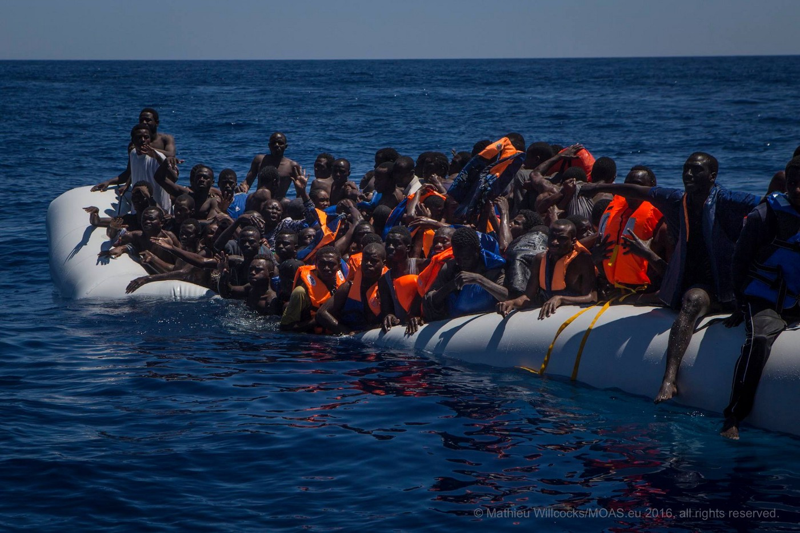

More solidarity with people in need can save humanity\. Photo by MOAS
#### Syria\-Afghanistan
### Syria and Afghanistan are not safe countries for anybody

Only today in Syria at least 16 people were killed, while in Afghanistan that number is much higher — over 60 people in just one attack\. Most of the victims in both countries are civilians\. As long as this is happening, people will continue to run away from misery and war, looking for freedom and safety in other countries, and they deserve to feel welcomed\.
#### Greece
### Situation in Turkey affects number of people who are arriving to Greece

The situation in Turkey is also not getting any better and it reflects in a number of new arrivals to Greece islands\. Yesterday, around 100 arrived at the isle of Lesbos \(Mytilene\), while an overall number of people who arrived over the last 10 days is over 430\. These numbers are showing that Turkish authorities are doing less to prevent refugees from making the perilous sea crossing\.

Currently, on the island of Lesbos, there are 3,084 people, another 2,477 people are trapped on the island of Chios and 1,067 on Samos\. The North Aegean islands are believed to be holding 6,628 people\.
### Communal kitchens to be open in three camps

Oxfam and Norwegian Refugee Council \(NRC\) announced plans to launch communal kitchens in three camps in northern Greece\. The three camps are Oreokastro in Thessaloniki, Cherso in Kilkis and Doliana in Ioannina where installment of appliances and kitchen utensils already started\. Refugees will be largely involved in running these kitchens, which should improve a quality of their food a lot\. If these pilot kitchens are successful, the model will be gradually extended to the other refugee centers in Greece\. The kitchens will be combined with the distribution of vouchers that refugees will use to buy food and other daily necessities from shops in their local area, he said, thus helping boost local markets\.

Refugees who are living in camps are complaining about the quality of the food for several months asking for the solution to be found\. Maybe this can be it\.
### Protests and clashed with the police

For now, the dire situation in the camps is reasons for refugees and volunteers to protest almost every day\. Today we found out about three protests, including one which became violent after protesters and police clashed\.

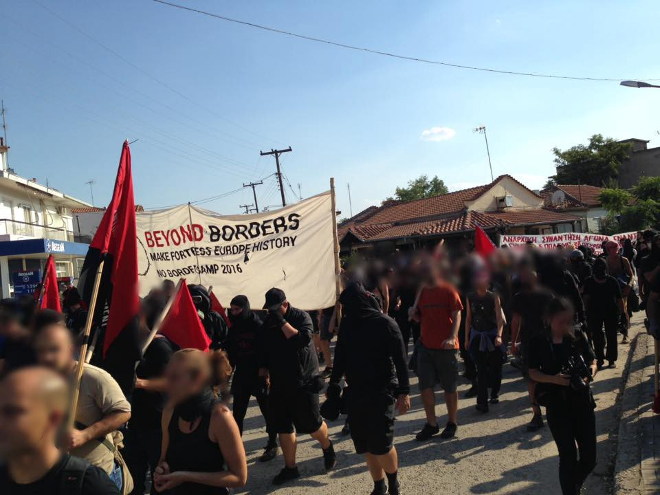

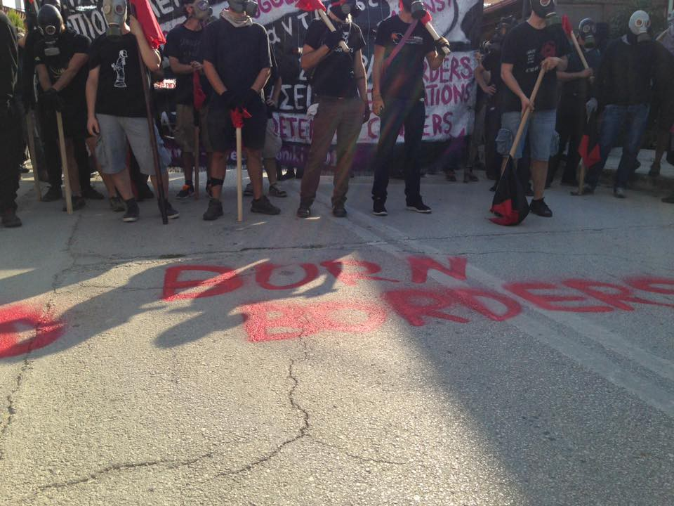

NoBorder Camp activists tryied to approach the fence but were stopped by the police\. Photo NoBorder

300 people — mostly activists from NoBorder Camp — demonstrated in the border village Kastanies and were on the way to the fence when police stopped them\. Slogans on many languages were shouted, but police stopped the demonstration with teargas\.

The refugees at Oraiokastro camp also protested today\. They gathered in the front of the camp and closed the road\. People in these camp are not satisfied how it is run, and they complain about possible corruption\.

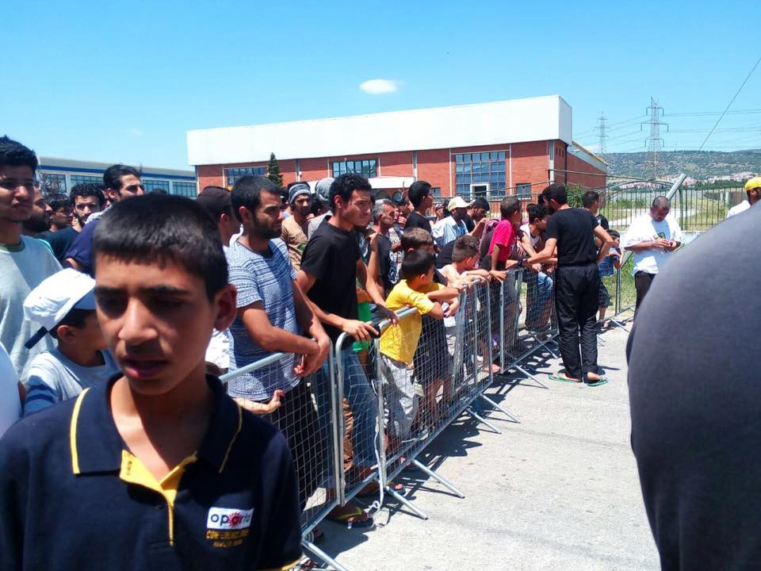

Protests in Oraikastro\. Photo Refugees\.tv

In Thessaloniki, groups of activist, refugees, volunteers and citizens, gathered to show support to refugees and migrant in Greece, too\.

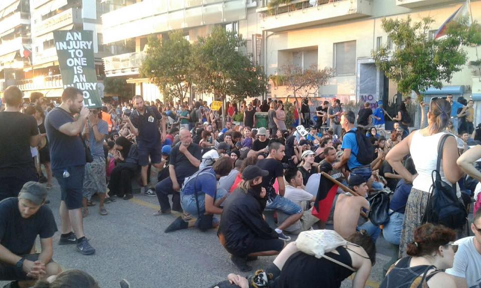

Photo by Refugees\.tv
### New camp to be open in Thessaloniki

Today we received some good information from Thessaloniki where a new camp is being prepared that will host 800 people\. What makes this camp different is that it will be run by volunteers who are turning a textile factory into a refugee camp with humane conditions\. The project is done in partnership with the Greek ministry of migration\. [The camp will be called Elpída](https://www.facebook.com/elpidafactory/?hc_location=ufi) , which is Greek for hope\. As we found out, first people could — 150 — will probably move in soon\. We will try to find more info about are to be the residents of this camps, and who will run it\. For now, we bring some pictures from the site\. It does look much different from any other place\.

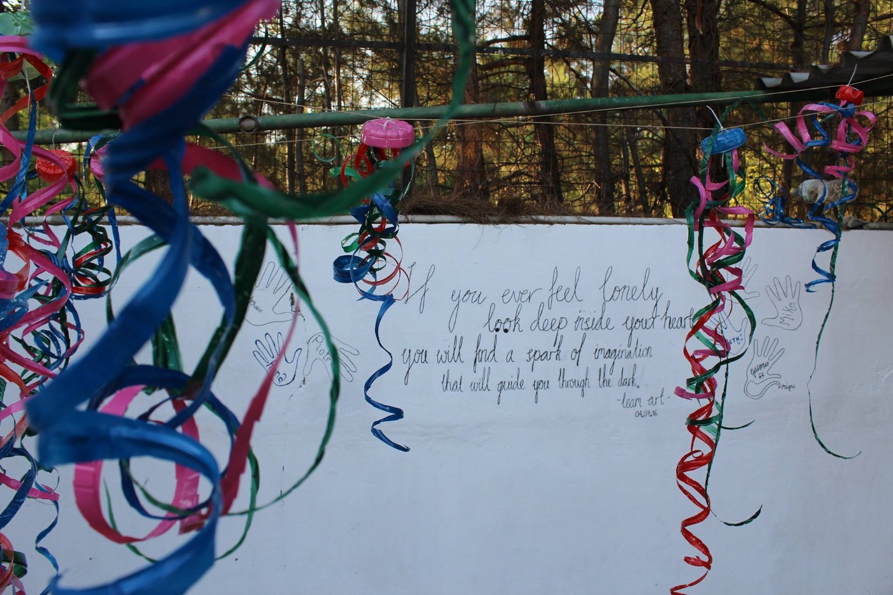

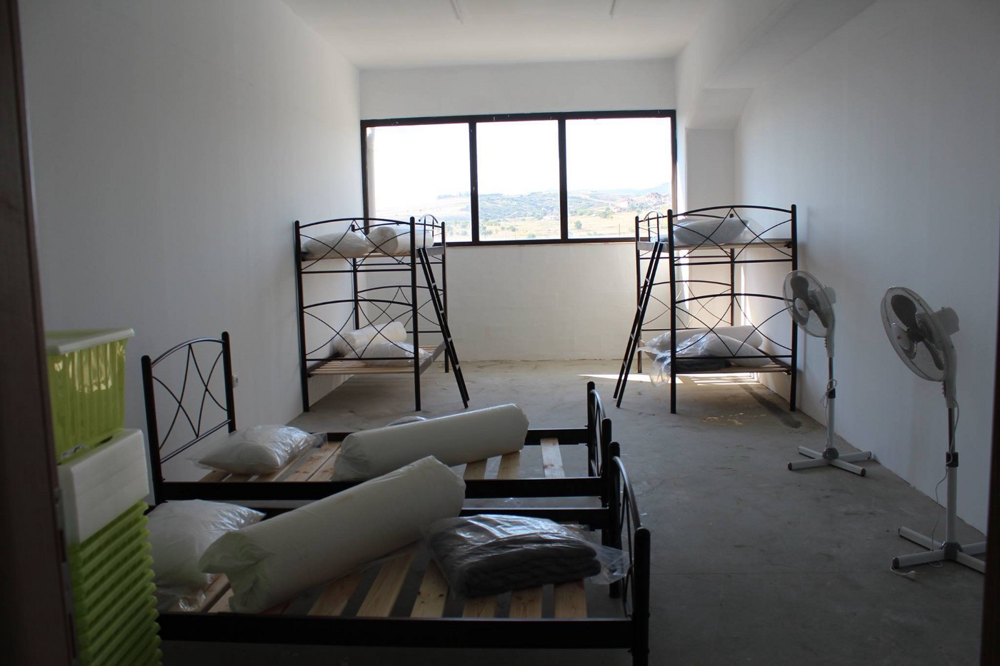

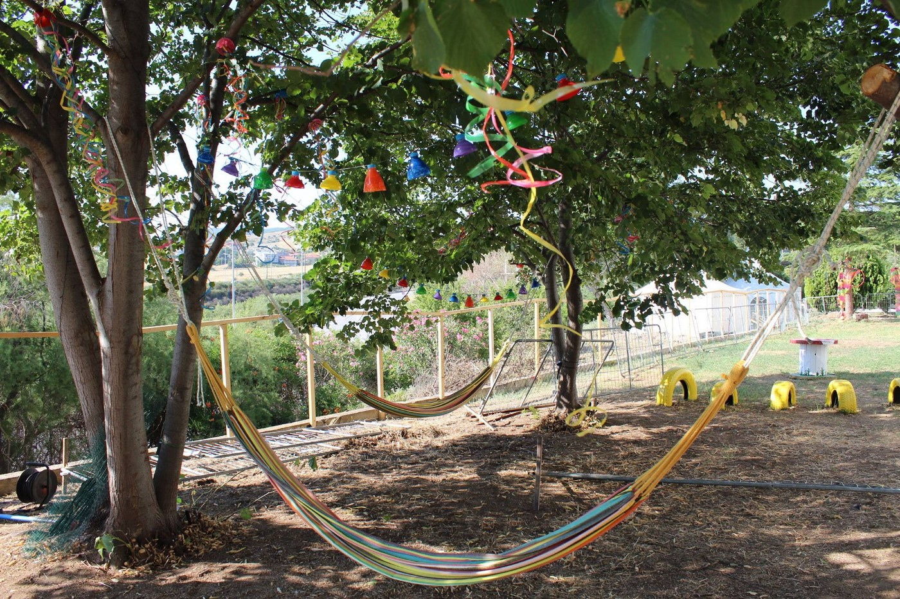

Refugee camp could look like this too\.
### Internet as a basic need for refugees

Recent research by Thomson Reuters Foundation showed that refugees need information more than anything, and that is why it is necessary to provide free internet access in camps and places where they live\. For them, internet is not the only source of information, but they use it on their smartphones to plan their journey towards Europe, to apply for asylum, and to stay in touch with family\.

In June, the UN passed a resolution to amend Article 19 which made internet access a basic human right\.
### More funding for refugees

The government in Greece has been granted an extra 82\.6 million euros from the European Commission\. The money should be spent to improve the life of refugees in this country\. Out of this amount, 24\.2 million euros is awarded to the Greek Ministry of Health, for increasing the capacity to provide primary health care to migrants and refugees\. The rest is given to the Greek Ministry of Defense to provide migrants with urgent shelter, accommodation, catering, health care and transportation\.

With this extra funding, the emergency assistance awarded for activities in Greece reaches 345 million euros since the start of 2015, including support to Greek authorities, EU agencies, international organizations, and NGOs\. This emergency funding comes on top of the 509 million euros already allocated to Greece under the national programs for 2014–2020\.
### Calls for volunteers

Volunteers are still needed in many places in Greece\. one of them is Elliniko warehouse, but they are many other places where you are needed\. Please, check Greek Volunteer info page fro more info

For more info for volunteers [follow this link](http://www.greecevol.info/index.php) \.
#### Serbia
### Help needed in Novi Sad

People from Afghanistan who started marching from Belgrade toward Hungarian border yesterday decided to stop marching and came to Novi Sad\. About 120 refugees, mostly young man from Afghanistan, took part in this march as a sign of protest because of the closed borders of Europe\. The last information we got from volunteers who have been following the group, is that they came to Novi Sad hoping to catch the train toward Subotica, city at the border, where they are planning to start the hunger strike\.

**Show solidarity, if you meet them\!**

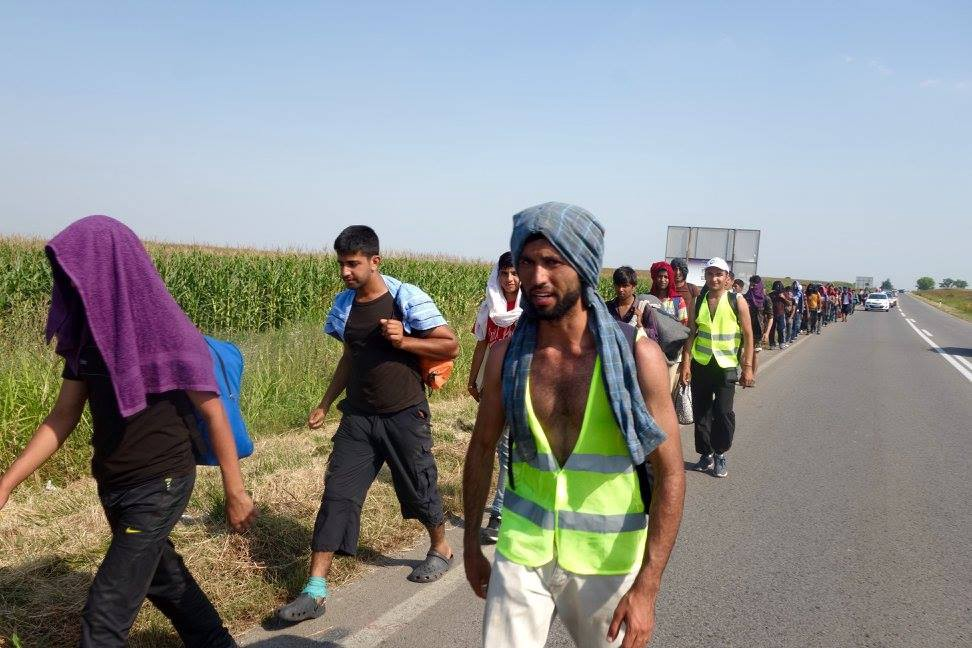

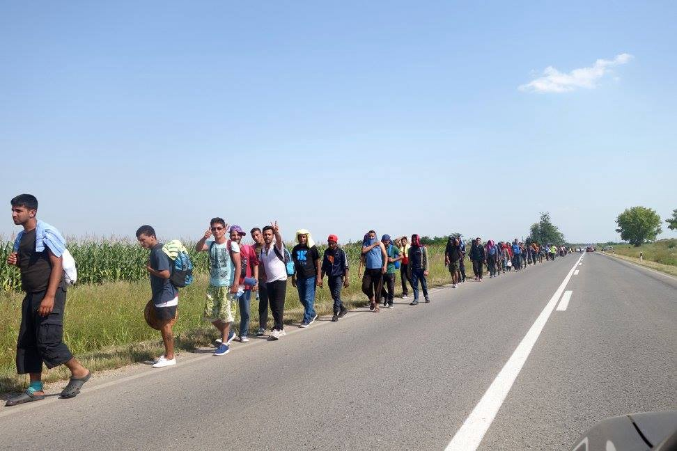

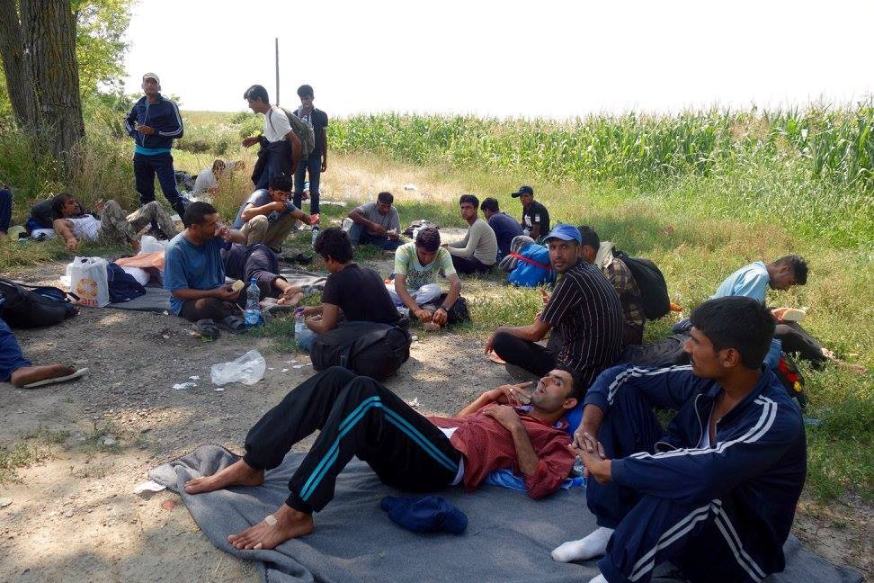

About 150 people in a march toward the borde with Hungary\. Photo by InfoHouse\.

They need:

> _Bandages/ band aids / socks / shoes / T\-shirts / painkillers / tissues / nasal stray_ 

Just as the reminder — Afghan refugees are facing the extremely difficult situation in terms of getting asylum and in terms of discrimination they face in the camps\. It became more difficult for Afghans to receive asylum, while the EU seems more keen to return Afghans to their country, despite acknowledging the difficult security context\.
#### Italy
### People living in the streets of the eternal city

With the Mediterranean route very busy, the number of people who are living in the streets of Italy is increasing\. In Rome, in Via Cupa between 100–200 people lives\. Volunteers are providing food, water, and clothes\. People, mostly from African countries, are sleeping on mattresses, and only lucky ones do have tents\.

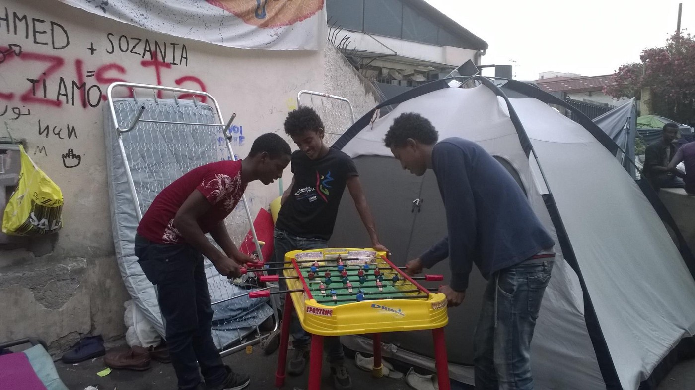

Food for refugees living in the streets of rome is provided by volunteers\.
#### General
#### Lebanon\-Turkey
### Family assistance program

International Organization for Migrations \(IOM\) announced family assistance program that can help getting faster embassy appointments and also a new fast appointment if someone misses his appointment because of border\-crossing issues and they do legal advice for families planning to reunite with someone in Germany\) as mentioned on 19/7 — I asked for the addresses of the centers that they mention in their info text and got the following addresses:

> Istanbul:
 

> Bestekar Şevki Bey Sokak No: 9 Balmumcu — Beşiktaş/İstanbul 

> Beirut:
 

> Bekfaya Street
 

> Kashouees building 

The center in Gaziantep is not open yet\.

> IOM asks to contact them via email first, such is possible in German, English, and Arabic\.
 

> [Info\.fap\.tr@iom\.int](mailto:Info.fap.tr@iom.int) \(for Turkey\)
 

> [Info\.fap\.lb@iom\.int](mailto:Info.fap.lb@iom.int) \(for Lebanon\) 

The IOM is planning to offer a hotline for legal questions in the next couple of weeks\.
### AYS needs you

Our friend Rando Wagner set up a crowdfunding site for AYS\. Please, consider donating to support our work, and we will continue to provide info and work with people who need our help\.
[https://www\.gofundme\.com/areyousyrious](https://www.gofundme.com/areyousyrious)

_Converted [Medium Post](https://areyousyrious.medium.com/ays-daily-digest-23-7-msf-estimates-20-people-have-died-in-the-mediterranean-sea-every-day-since-b66ad6da696c) by [ZMediumToMarkdown](https://github.com/ZhgChgLi/ZMediumToMarkdown)._
