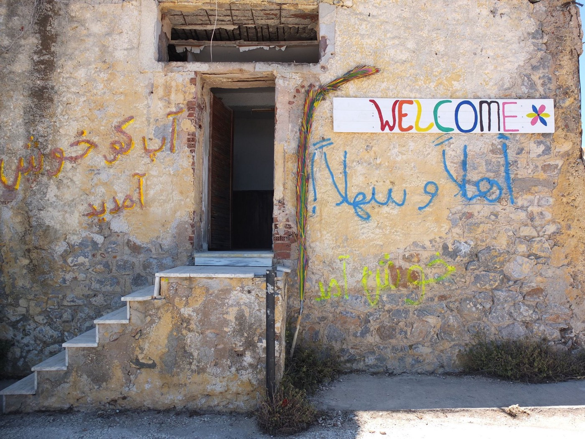
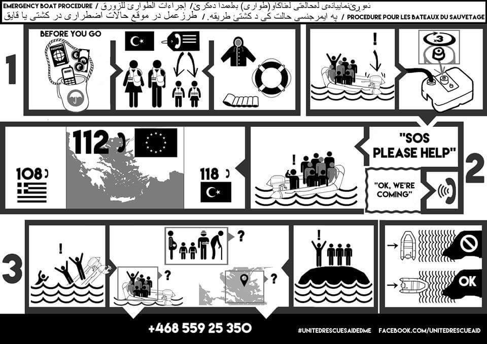
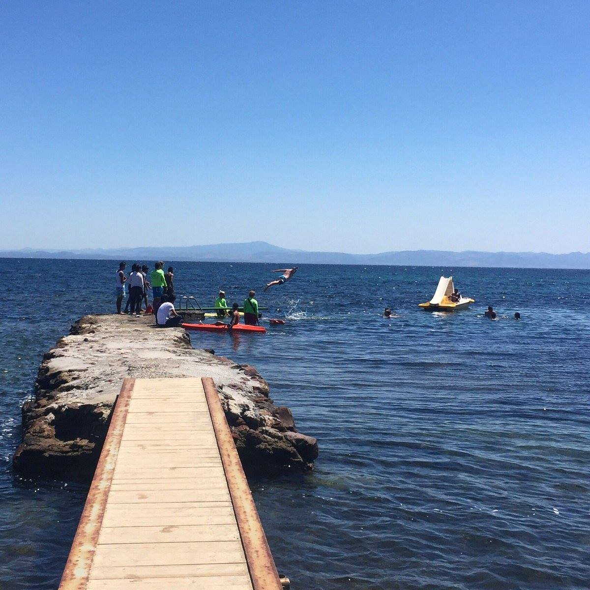
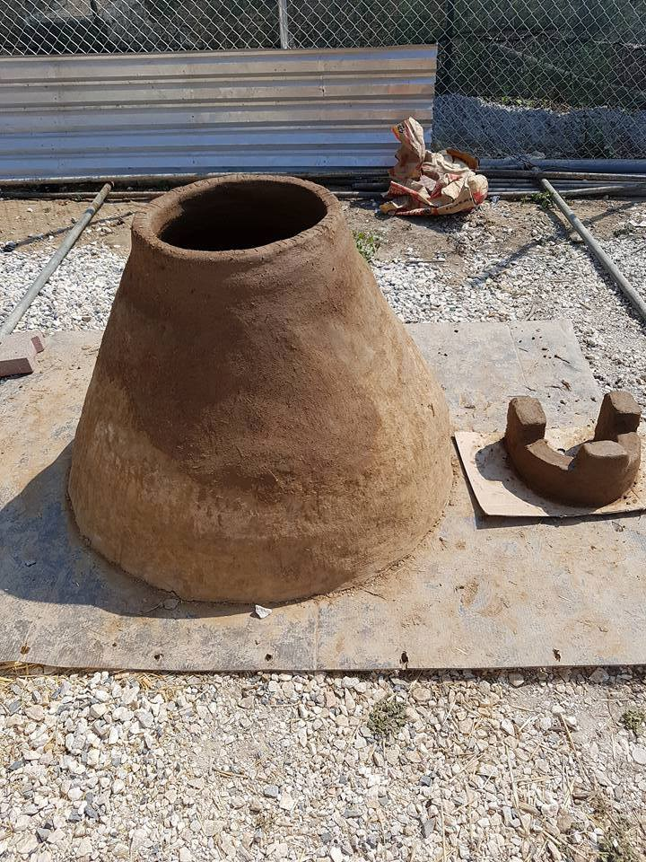
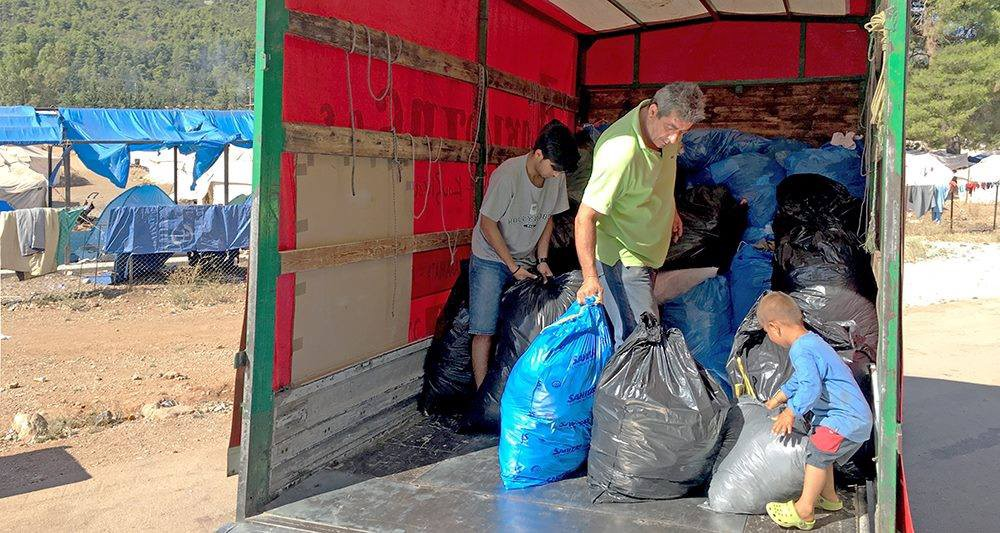
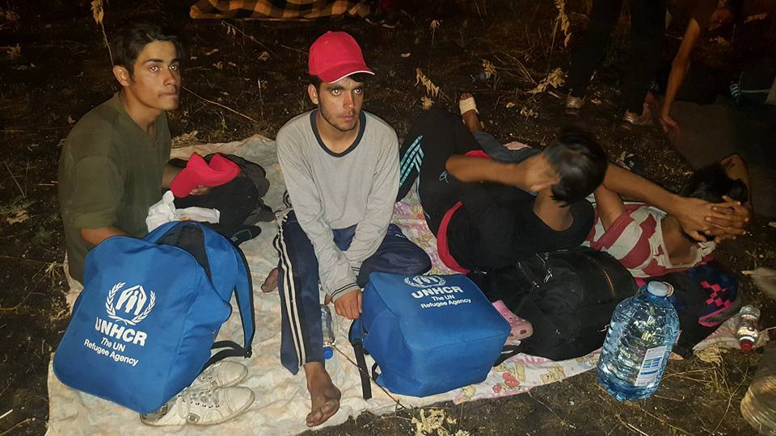
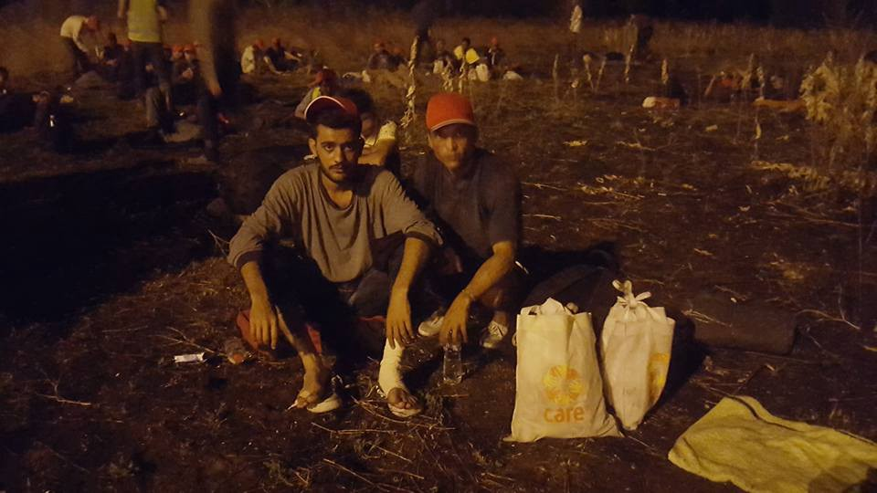

### AYS Daily Digest 24/7: While authorities strengthen surveillance, volunteers strengthening solidarity

_Closed borders cannot stop people from hoping and trying to reach the country where they will have a chance for a normal life\. 127 Afghani refugees arrived to Horgos border after over 100 km long march from Belgrade\. They are tired and hurt\. In Calais, one of the hardest days since December last year\. Help needed in Turkey, Greece, France, Italy… The wars are still raging and borders closed\._

No Border Social Center located on the main road from Moria to Mytilini is place where all the people are welcome\.
#### Turkey
### Call for volunteers in Izmir

Despite the grave situation in Turkey, there are many volunteers who are still active in the country\. Among them, Refugee Volunteers of Izmir \(ReVi\) \. “Our volunteers are safe to work here,” they write\. They inform about university scholarships available to Syrians living in Turkey\. The scholarship details are available [here](http://suriye.turkiyeburslari.gov.tr) \.

The deadline to apply is at the end of July\.

The ReVi started doing bracelets with Syrian women\. They will organize workshops and products will be sold at ReVi online store that is under construction\.

They also have plans to expand to other parts of Izmir\. For now, their work concentrated on families in the Basmane / Kadifekale areas\.

> “There are over 100,000 Syrians in Izmir\. So, if you’re in Izmir and would like to get involved, this might be a good time\. Go to joinrevi\.org for more info and to join one of our new volunteer meetings\.” 

To find out more about their activities, or to join the team, please [see their FB page](https://www.facebook.com/reviknitting) \.

FIUnited rescue flayer: Stay safe\.
#### Weather
### WARNING\!

> Severe warning for Leros, warning for Kos and attention for the rest of Aegean\. 

#### Greece
### Situation in camps around the country:

**Lesvos**

Two boats arrived, one north east of Lesvos one in the south, with 46 people in total\. Everyone is in good condition\.

Refugee rescue team members from Lesvos report witnessing abuse by the Greek coast guard, both verbal and physically threatening to the old people, women and men arriving on boats from the sea\. These and other accounts of similar behavior must not happen without alerting the organisations responsible for the well being of refugees\. We remain open for any information that could help protecting those fleeing war and violence in a hope for a safe place\.

PHOTO: “Lifeguards on Lesvos taking unaccompanied minors to swim & play in sea — so they won’t fear it after their journey\.” Lesvos photo by Rose Foran \(Twitter\)

**Elpida**

First 160 people moved in the newly opened Elpida camp today\.

> “The point of this project is to house refugees in humane conditions and to restore their dignity\. We hope Elpída will be a beacon of hope in an otherwise very dark sea\.”, said the founder of the Elpida camp\. 

Camp is a joint project whose preparation started a month ago and, [as we reported](ays-daily-digest-23-7-msf-estimates-20-people-have-died-in-the-mediterranean-sea-every-day-since-b66ad6da696c) , that will be an initial impulse in the growing atmosphere of wanting to provide safer and better living conditions to refugees who are waiting for news on their new future home\(land\) \.

We also received an urgent call for the Arabic speaking volunteers as of tomorrow\. If you can help out, even if just for a day or two, their contact is 30 695 556 0092

**Vasilika**

Refugees in the camp built their own oven to bake fresh bread, as they didn’t like the taste of the one served to them daily\.

PHOTO by Maik Meinhardt

**Gianitsa**

Refugee Support Europe organized distribution of tomatoes, cucumbers, tea bags and sugar ath the Gianitsa camp today, but what made this particular distribution for the 500 residents \(families\) of the camp special is that the food was entirely funded by 2 young volunteers from Portugal, who also helped with the distribution\. This organization is taking care of a growing number of camps and [they ask for donations](https://gogetfunding.com/alexandreiashop/) \.

**Skaramangas**

Organization Earth is in need of new volunteers for youth football training at Skaramangas camp\. Children aged 10 to 19 receive training twice a week\. The trainings are organized by football players staying at the camp, but also by professional trainers from a local football club\.

**Malakasar**

Dirty Girls of Lesvos collected dirty laundry from the Malakasar Camp with the help of its residents of all ages\. The flush toilets and showers are reportedly kept locked at the discretion of the government camp administrator, so several portable toilets and showers were brought in for the 1000 residents in the camp\.

PHOTO Dirty girls

**Sintax**

Two independent volunteers are setting up a cultural centre in Sinatex\. Although they are already teaching inside the camp, they want to build a separate space for informal education programme\. Two tents have already been set up\. They need long term volunteers who can take part in coordination, teaching English \(preferably people with educational background\), carpenters or any volunteers willing to help build the rest of the centre\. Those interested should be able to stay for at least two weeks\. with ideas for workshops and similar programmes are welcome, regardless of the time they can stay\. You can help from home as well\. For all information, please contact Alex Aronsky on Facebook\.

Nurture Project International is looking for Infant Feeding Team Lead in Thessaloniki, vacancy starting approximately August 9 and lasting for at least six weeks\. „The person must be a gentle yet strong leader, must be flexible, must work well in crisis situations, and must be a clear, direct, and respectful communicator\.“ For more information and applying, please write to: [Brooke@NurtureProjectInternational\.org](mailto:Brooke@NurtureProjectInternational.org)
#### Bulgaria
### Army is ready to strengthen surveillance at the border

[The media](http://www.novinite.com/articles/175599/Bulgarian+Army+Ready+to+Boost++Assistance+to+Police+in+Border+Protection,+Def+Min+Says#sthash.H312KFyW.dpuf) are reporting that the Bulgarian Army has deployed “enough personnel and equipment to assist police forces in protecting the country’s border with Turkey against a potential increase in migration pressure”\. They quote defense Minister Nikolay Nenchev said that the army is ready to strengthen surveillance and patrols along the border to help police in case migration pressure increased\.

> “According to the information I have, the situation is relatively calm; I hope it will stay that way in the future,” Nenchev told reporters at the border\. 

#### Serbia/Hungary
### The march ended at the Horgos border

A group of 127 people, who were walking for two days from Belgrade, reached Horgos \(Hungarian border zone\) tonight\. More than 250 refugees set on the march as a protest against closed borders, but 127 reached their destination\. The protesters are exhausted and many are injured, volunteers are reporting after they walked for over 100 km on over 35 degrees\.

> “The Horgoš group plans to start a hunger strike until they are let into Hungary \(hopefully after they recover a bit from this epic walk\) \. This could be a very important event because it may accelerate a current crisis on the northern border but also because it again revealed the big gaps in the existing humanitarian assistance in the civil sector, “ Info House volunteers are reporting\. 

Tired and exhosted after 100 km longer march\. Photo Info House

Legal entry into Hungary is permitted only through the so\-called transit zones\. According to UNHCR, only 15–20 people a day are allowed to pass through these areas, leaving hundreds more in “difficult conditions” outside the zones\.

![Miliana is a doctor who treats newly arrived refugees in Belgrade, Serbia\. She is treating the feet of a young man who has walked thousands of miles to get here and only arrived last night \(he had run out of money to take buses\) \. Her organization is a collection of doctors who go out with medical kits and treat refugees rather than wait for them to come to her\. A lot of people were able to get treatment for smaller issues that they normally wouldn’t wait in line at the medical tent for\. And you could see how soothing it was for them to just be cared for and to have some cream rubbed onto cramped legs and swollen ankles\. She made sure a diabetic patient was taking her daily dose of pills and then moved on to a boy who had a small but quite infected cut\. Many people in the park had some sort of gauze taped onto their arms or legs, thanks to her\! Photo by [Lifting Hands International](https://www.facebook.com/liftinghandsinternational/photos/a.170033390031093.1073741829.165551260479306/281774885523609/?type=3&theater) \.](assets/5dac2cd6f80b/1*QSXZyz5WoPTz8SZvQNwIIQ.jpeg)

Miliana is a doctor who treats newly arrived refugees in Belgrade, Serbia\. She is treating the feet of a young man who has walked thousands of miles to get here and only arrived last night \(he had run out of money to take buses\) \. Her organization is a collection of doctors who go out with medical kits and treat refugees rather than wait for them to come to her\. A lot of people were able to get treatment for smaller issues that they normally wouldn’t wait in line at the medical tent for\. And you could see how soothing it was for them to just be cared for and to have some cream rubbed onto cramped legs and swollen ankles\. She made sure a diabetic patient was taking her daily dose of pills and then moved on to a boy who had a small but quite infected cut\. Many people in the park had some sort of gauze taped onto their arms or legs, thanks to her\! Photo by [Lifting Hands International](https://www.facebook.com/liftinghandsinternational/photos/a.170033390031093.1073741829.165551260479306/281774885523609/?type=3&theater) \.

Hungary as a country is perhaps the most hostile to refugees out of those along the former Balkan Route\.

We are hoping that all people who participated will be safe and well\. Those who are able to help them, please do that\. Solidarity will save humanity\.

#### Italy
### Italy is struggling to place all the refugees

As the Mediterranean route betting busier, Italy is having more problems to find extra places for people who are coming every day\. We already reported about [refugees sleeping in the streets of Rome](https://medium.com/@AreYouSyrious/ays-daily-digest-23-7-msf-estimates-20-people-have-died-in-the-mediterranean-sea-every-day-since-b66ad6da696c#.dhan3hfyg) \.

Currently, about 135\.000 asylum seekers are placed in reception facilities\. Some continued their journey on their own tired of waiting and uncertainty, while borders are becoming harder and harder to cross\. [Local media are reporting](http://www.thelocal.it/20160722/italy-fears-calais-style-migrant-camps) about the town of Ventimiglia on the Italy\-France border, where some 30,000 people came since the start of 2016\. People are sleeping under bridges or on the beach front, on the streets\.

Data from the European Commission this week showed that of the 39,600 asylum seekers referred for relocation from Italy to other European countries, only 877 have been moved so far\.
#### France
### VOLUNTEERS: Help needed in Calais

More people are arriving in France, too\. All the volunteers out there, help is needed in Calais, again\. Volunteers are saying it has not busy like today since December last year\. Refugee Info Bus informed us how lots of the restaurants haven’t reopened after the police action last week, so even refugees with money are struggling to get enough to eat\.

“Calais Kitchen’s ingredient parcels are needed now more than ever\. They are low in supplies and funds to buy supplies, and need volunteers\. Refugee community kitchen is based offsite and so will be able to continue whatever happens with police actions/demolitions\. They need more food and more volunteers\. The onsite kitchens are Belgium, Kitchen in Calais and little Ashram\. All need financial donations, little Ashram is looking for long term volunteers too\.”

More info about how you can donate or volunteer you can find on their FB and web pages\. Volunteers, contact [calaiskitchens@gmail\.com](mailto:calaiskitchens@gmail.com)
#### Germany
### Army to train refugees

An interesting story was published by Frankfurter Allgemeine Sonntagszeitung \(reprinted in [the Financial Times](https://next.ft.com/content/7c4d3372-51ac-11e6-befd-2fc0c26b3c60#axzz4FLoUsKTE) \) today\. They quote the German defense minister saying that the army in this country will train more than 100 Syrian refugees “in a variety of civilian roles that could one day help them rebuild their shattered country”\.

Ursula von der Leyen, a central\-right politician, said in an interview that a pilot project involves training refugees in “handicraft, technology, medicine and logistics” with the idea that they can “one day they can return to Syria and help with the reconstruction effort\.”

_Converted [Medium Post](https://areyousyrious.medium.com/ays-daily-digest-25-7-with-the-new-wave-of-refugees-the-need-for-volunteers-increases-all-over-5dac2cd6f80b) by [ZMediumToMarkdown](https://github.com/ZhgChgLi/ZMediumToMarkdown)._
