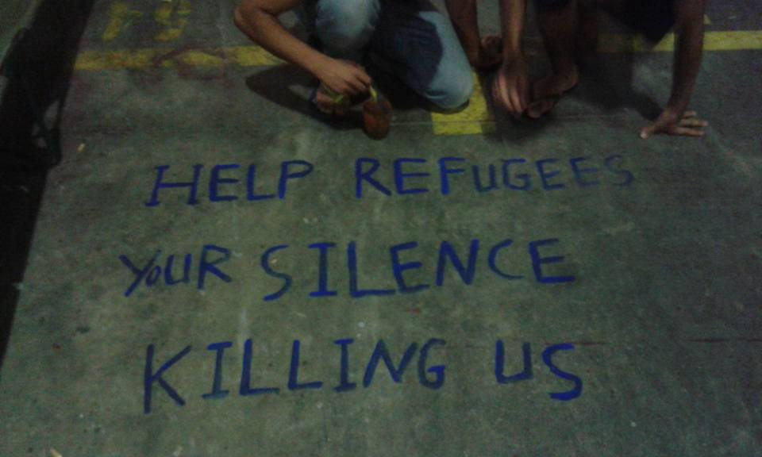
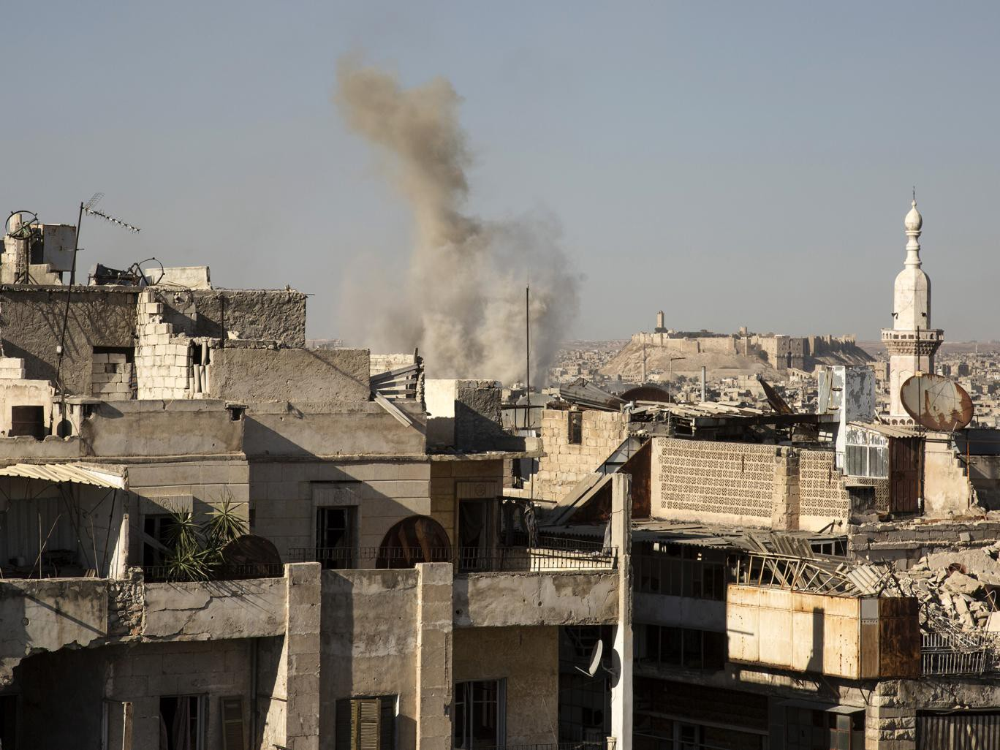
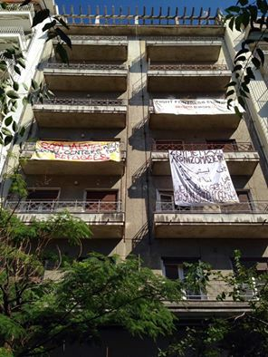
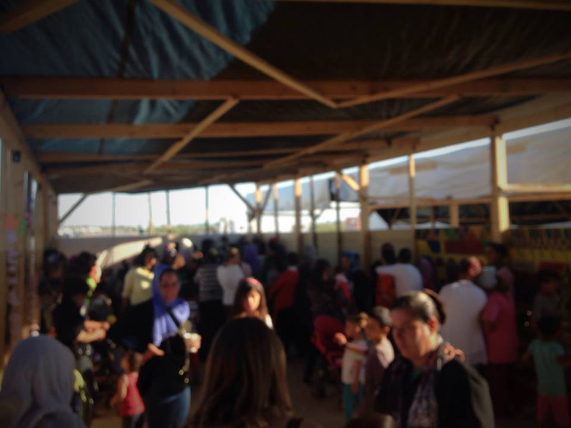
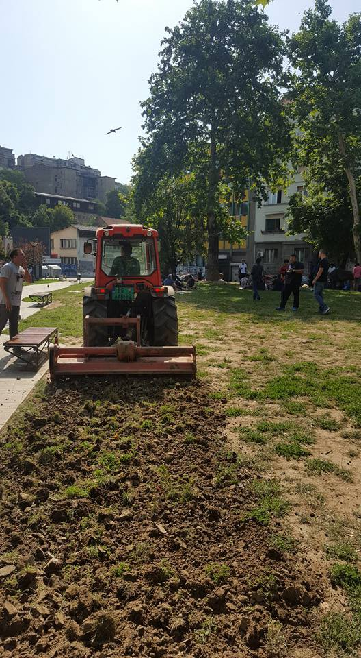
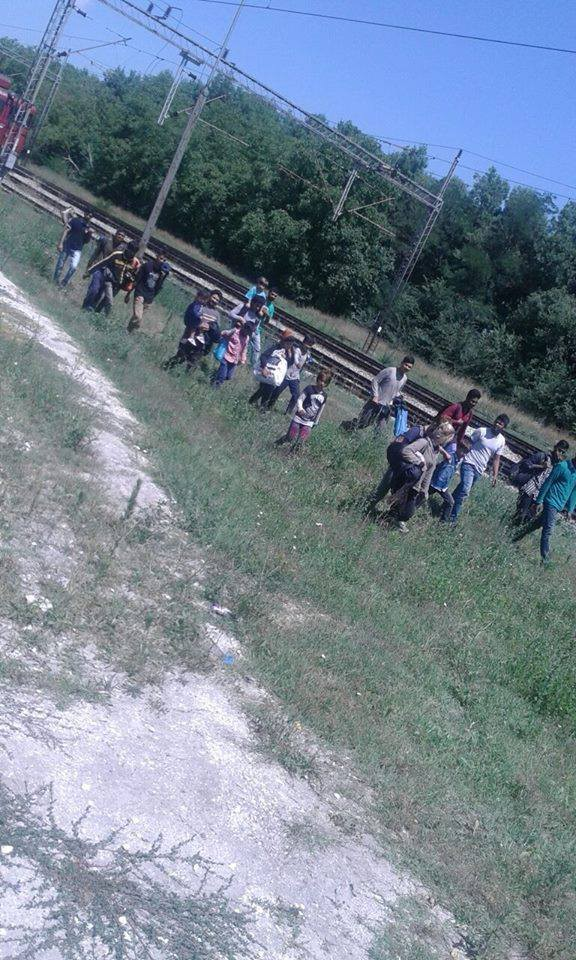
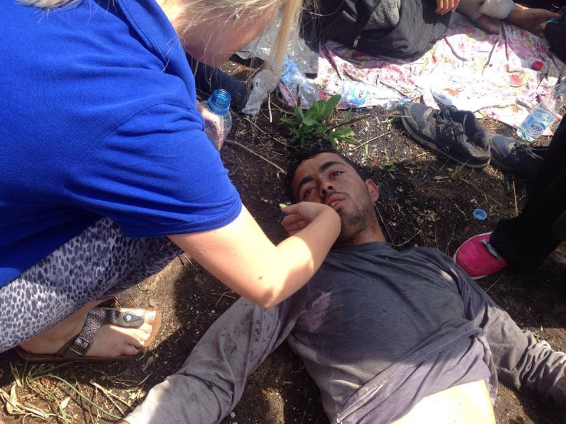
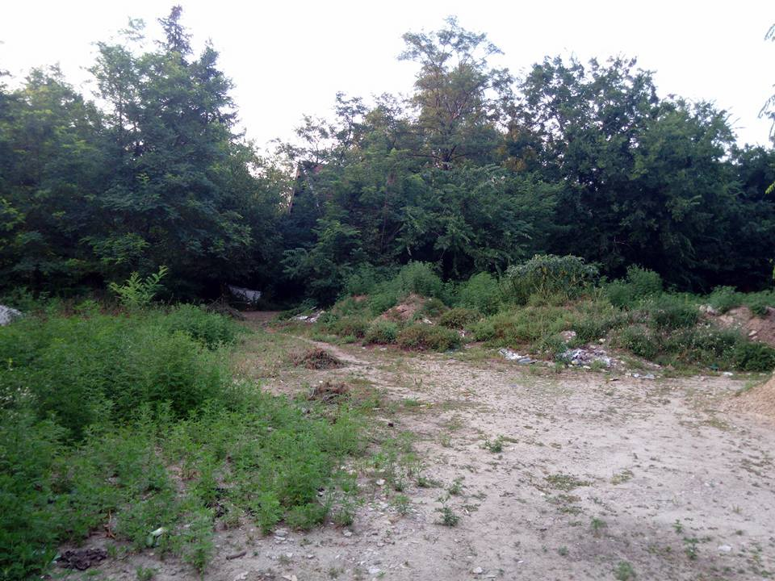
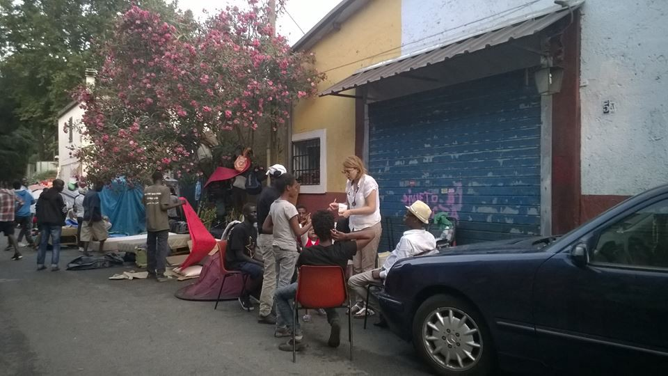

### AYS digest 25/7: Still stuck between closed borders and violence while solidarity not backing down

Oreokostro camp, Greece

_Attacks in Iraq, Germany and Syria\. Slight rise in arrivals to Greece with new solidarity squat opening in Thessaloniki and two camps calling for more volunteers\. Afghan park in Belgrade cleared out\. Dire situation in Horgoš: people’s health deteriorating due to closed borders and hunger strike\. iHo to build a learning center in Kelebija\. Baobab in Rome needs donations and UK Action for Refugees together with United to Assist Refugees UK and One Nation delivered aid to Syria\._
#### Iraq
### **New attacks in Baghdad**

Violence tightens its grip on Baghdad, where a new attack is reported to have killed 21 men, women, and children\. The death toll is expected to rise due to the grave nature of the injuries among the wounded\. This comes just one day after another suicide bomb attack\. Sincere condolences to the families and loved ones of the deceased\.
#### Syria
### **Bombing continues in Aleppo**

Bombing in Syria continues at the same terrifying pace\. Two strikes took place over the space of 24 hours as part of an overnight raid in the Al\-Shaar neighbourhood of Aleppo on Sunday\. Two makeshift hospitals and a blood bank were hit\. These hospitals provide urgent medical care to more than 200,000 civilians\.

Aleppo\. Getty images
#### Greece
### **Slight increase of arrivals over the weekend**

338 people arrived in Greek islands from Turkey in just two days from July 23rd–25th\. That brings the total number of those stuck throughout the Greek territory to 57,498\.
### **New solidarity squat and social center in Thessaloniki**

Not everything is so bleak: there are pockets of genuine solidarity and a willingness to do something about it\. Over 100 people \(Refugees & Activists\) have squatted a building and are now using it as a Social Center and Housing Project for Refugees in Karoulou Diehl 34 in downtown Thessaloniki\. They are calling for more people to come and show solidarity\. We send messagge of support, hope and solidarity\! Follow them through their FB page [http://bit\.ly/2apDZJZ](http://bit.ly/2apDZJZ)

Kοινότητα “Hurriya” squat in Thessaloniki
### **Call for volunteers in two camps**

If you are heading towards Greece, there are places calling for a helping hand\. One is in Lagadikia, Voyiatzoglou camp\. There is a group of 10 independent volunteers who are looking for help and more volunteers to join them\. They organise English lessons \(divided in 4 levels\) for teenagers and women in the morning/late afternoon \(11:00–14:00\) \. The afternoon \(17\.00:21\.00\) is dedicated to activities for unaccompanied teenagers\. This group of volunteers recommend having a car to reach the camp \(map: [http://bit\.ly/2a59PaP](http://bit.ly/2a59PaP) \) and being able to join their project for a minimum of 10 days\. A basic and general knowledge of English is also required for the classes\. Those who are willing and able can contact Inés: \+34647116488 \(Whatsapp\) \.

The other address is Nea Kavala camp where a new women’s space opened up\. We Are Here — Community Centre is calling for experienced female volunteers to come and keep the project alive\. Feel free to contact them on [their FB page](https://www.facebook.com/WeAreHereCentre/) \.

Women center\. Nea Kavala camp
#### Serbia
### **No park for refugees in Belgrade**

Belgrade authorities have decided that city parks are not to be used by all people equally\. Today they began “cleaning” the so\-called Afghan park, pushing the refugees out\. We, as well as those working in and around the park, condemn this decision to deny access to city parks to people who want and need to be there\.

Afghan park, Belgrade
### **150 people arrived to Preševo** **and 21 people pushed back**

This news comes as Hungary is pushing people back and more are arriving through Serbia’s south and east borders\. Over the weekend more than 150 people have come in Preševo camp, 68 of whom are children and 35 female\. Most of them from Afghanistan with others coming from Iraq, Syria, Pakistan, Iran, Palestine, Algeria and Mauritania\. People are coming from Greece so 90% of them do not have Macedonian papers\. It seems that Serbia is not readily accepting all of those who seek shelter in Preševo\. On Friday the 21st, people arriving near the camp’s entrance were pushed back by police and into Macedonia\.

People pushed back from the camp in Preševo and back to Macedonia
### **People’s health deteriorating due to closed borders and hunger strike**

The situation on the Hungarian border is reportedly getting worse as those who are a part of a hunger strike seem to be suffering more and more, with some of them fainting\. They are appealing to all European governments and are claiming that this is not a responsibility of Serbia and Hungary alone\. We are afraid that for the most part there is no reaction from those in power while people suffer and wait\.

Horgoš\. Photo Miodrag Sovilj
### **Help to build new learning center near Kelebija**

On the other part of Subotica story, at the border crossing Kelebija, iHO plans to build a learning center \(KLC\) and a shelter to take care of more than 70 kids there\. “This infrastructure project will see the light soon thanks to the funding and support of The Timber project\. KLC will be one of 2 large shelters where roughly 150 people can hang around and spend the day in a place they can eventually call home sweet home\. The plan includes 2 shelters: one for males and another for women with kids where we will hold educational and fun activities\.”

Work will start on Thursday and if you can, please support this project by donating to “Ja sam covek” organization RS35265100000016247454 \(IBAN\); RZBSRSBG \(BIC\), Raiffeisen bank AD

Location for the new learning center
#### Italy
### **Baobab needs donations**

Baobab community in Rome is calling for donated supplies\. They need canned food and small size summer clothes and shoes for men\. Donations can be delivered everyday between 8:30h and 21h in Via Cupa\. Also, our friend started a crowdfunding campaign to raise funds for Baobab, so you can help from a long distance\. Please check it out [http://bit\.ly/2atsWPr](http://bit.ly/2atsWPr)

Baobab, Rome
### **Unaccompanied minors face mafia in Italy**

Guardian has reported that many refugee children have disappeared from Sicily amid allegations of human\-trafficking by organized gangs\. This dire finding only proves that claims of protection for the most vulnerable has failed\. It must also serve as a warning for volunteers heading towards and working in the south of Italy\.
#### Germany
### **Attack in Bavaria\. We wish for a fast recovery of those injured and appeal to those in power not to counteract violence with violence**

A Syrian man killed himself and injured 15 people after a “deliberate explosion” outside a music festival in the [German](http://www.independent.co.uk/topic/Germany) town of Ansbach\. The 27\-year\-old detonated an explosive device near a bar in central Ansbach on Sunday evening — with three of those injured in a serious condition\. It has been reported that a man has already attempted to kill himself twice, but also that he might have some connections to ISIS\. The group appears to have claimed responsibility, but things are not as clear as day\.

We cannot speak directly of the motives, but it is known that the man has been denied asylum and was supposed to be deported to Bulgaria\. One thing is for sure: this was an act of desperation and mental health issues as much as anything else\. We hope for a speedy recovery for all those injured, but also appeal to the media to tone down possibility of hate speech and fabrication of stories as different political actors are trying to claim that the Germany’s asylum policies are to blame for this in a sense that they are too willing to accept those who seek it\. We hope that this brutal act of violence will not produce more violence in form of hate, racism, closed borders and bombs\.
#### UK
### UK councils divided when it comes to resettlement schemes

The battle over the resettlement of refugees in Britain continues\. Norfolk County Council had agreed last year to accept refugees as part of the government’s pledge to resettle 20,000 fleeing civil war — to be housed in Norwich and Broadland\. But the plan is threatening to fall apart\. Westminster is only willing to pay £1m towards resettlement costs — leaving a £400,000 shortfall\. At a meeting of Norfolk County Council’s full council today, councilors decided to continue to offer the county as a home and not to pull out of the government program\.

Proving that the solidarity movement is still alive and well, before the meeting, campaigners gathered outside County Hall calling for Norfolk to take the refugees\.

Suffolk, on the other hand, has agreed to take up to 200 Syrian refugees over the next five years\. Cambridge City Council agreed to host 50 Syrian refugees, with the first of them having arrived in December last year\. For more follow the link [http://bit\.ly/2a1vgcc](http://bit.ly/2a1vgcc)
### **Brits deliver help to Syria**

Also, Brits managed to deliver help outside its borders with UK Action for Refugees together with United to Assist Refugees UK and One Nation \(another British NGO\) managed to deliver a truck of flour to Syria that will feed 30\.000 people\.

_Converted [Medium Post](https://areyousyrious.medium.com/ays-digest-25-7-still-stuck-in-between-closed-borders-and-violence-with-solidarity-running-strong-5ddcc3749e3d) by [ZMediumToMarkdown](https://github.com/ZhgChgLi/ZMediumToMarkdown)._
