### Some settle in, some pushed out: AYS Digest 26/7

_Syrian Human Rights NGO office destroyed in airstrikes\. Erdogan invokes silent threat of pressing 3 million refugees into Europe, unhappy over EU\-Turkey deal disbursements\. Urgent information to prioritize safety on upcoming evacuation of E1\.5 Piraeus Port in Greece\. More refugee children learn to swim on Lesvos\. VIDEO from “The New Idomeni” at Horgoš, Serbia\. Court interpreter in Austria reveals massive negligence in providing accurate interpretation for refugees\._

#### SYRIA
### Twenty\-five explosive barrels targeted Daraya city through aerial bombardment\.

Additionally regime forces are continuing to advance on strongholds in Aleppo; nevertheless rebels are strengthening positions around al\-Castello road\. Supplies in many rebel\-held neighborhoods are running low as al\-Castello’s loss essentially cut them off from supply lines\. [Eighteen more people died today in regime helicopter airstrikes](http://www.syriahr.com/en/?p=48781) on rebel\-controlled territory\.

An independent human rights organization whose aim is to investigate human rights abuses in Syria was destroyed on Friday in a series of airstrikes on Douma\. The Violations Documentation Center had been in operation since 2011, and [vows to continue its work](http://syriadirect.org/news/missiles-destroy-human-rights-office-in-douma-as-activists-vow-to-keep-documenting-war-crimes/) for the dignity of all Syrians\.
#### TURKEY
### Turkey and the EU trade barbs as President Erdogan accuses the EU of not holding up their end of the deal\.

Speaking on German television, Erdogan insinuated that the EU had not started to pay the promised 3 billion euro to Turkey, a claim that was vehemently denied by a spokesman for the European Commission\. He stated that “the EU had “allocated” €740 million and would “allocate” a further €1\.4 billion “by the end of the month”, a [ccording to the EU Observer](https://euobserver.com/tickers/134493) \. The President also casually brought up his bargaining chip, hypothetically musing on how Europe would cope with an influx of 3 million refugees\.

Between January 1st and January 21st, over 33,000 people were stopped trying to cross from Greece into Turkey, [according to NewsThatMoves](https://newsthatmoves.org/en/more-than-33000-apprehensions-in-turkey/) \. With the official closure of the Balkan route, and so many refugees pressed to the margins, it is always difficult to ascertain true numbers of people passing through if they do not consistently register, however the number of interceptions will always be sadly marked\.
#### LIBYA
### The number of bodies that have washed up on the shores of Libya has officially risen to 87, according to Libyan authorities\.
#### GREECE
### URGENT: Regarding EVICTION DAY / PIREAUS E1\.5

Dear volunteers and refugees, teams on the ground were just contacted by UNHCR with the information that the E1\.5 area is about to be evacuated, police should have stopped this evening to give the last warning and monitor the “cleaning” during tomorrow morning\. The refugees should be then transported to camps in Athens surroundings\. On this side we will try to find out more about the possible locations and follow the situation\. We would also like to advise people to remain calm, follow instructions from volunteers and UNHCR and keep in mind that, if planning any kind of resistance, there are many vulnerable people and children on site\. Although we do not support the the camp solutions and many other ways our friends are treated, we also do not support or cooperate with any action that jeopardises people´s \(already fragile\) physical and mental integrity\. Please keep us posted by messaging our inbox as this develops tomorrow\.

In keeping with this news, yesterday two buses came to the Pireus and took 60 Afghans to Oinofita\.

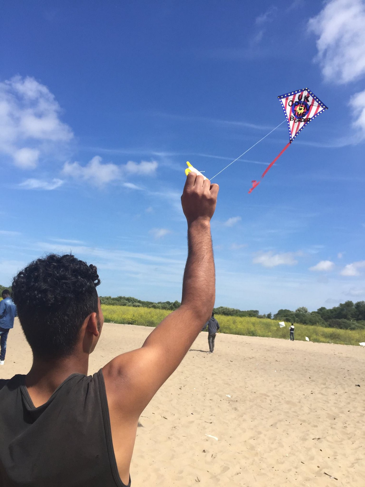

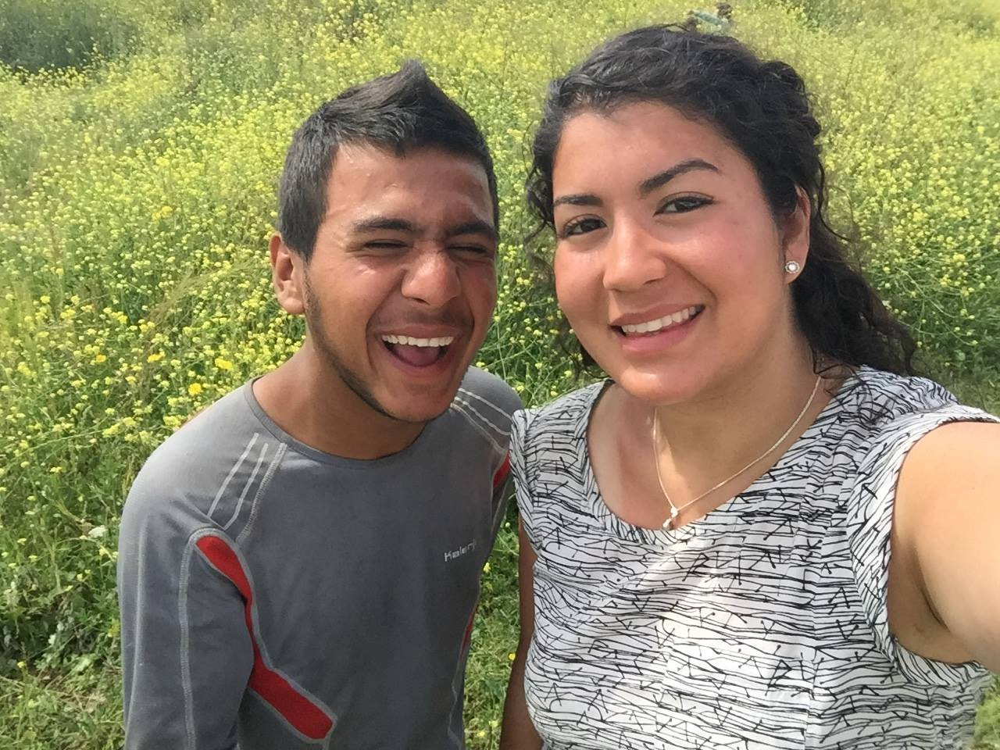

Happier days in Calais, Photo courtesy of Help 4 Refugee Kids
#### Islands
### 60 persons, mostly families, arrived by rubber boats two nights ago on Kos\.

Now there are about 800 persons seeking refuge at the small island\.
### A boat of 30 people landed in Skala on the north coast of Lesvos\.

They were intercepted by ERCI which assisted in translation and was able to help the passengers disembark onto safer vessels for transfer to the harbor\.

### Scared of the sea no more\. Proem Aid is providing swimming lessons to refugee children at Pikpa camp\.

These skills are not only lifesaving, but also help to empower the children and assist them in reclaiming possibly traumatizing memories\. What a perfect way to cool off\!

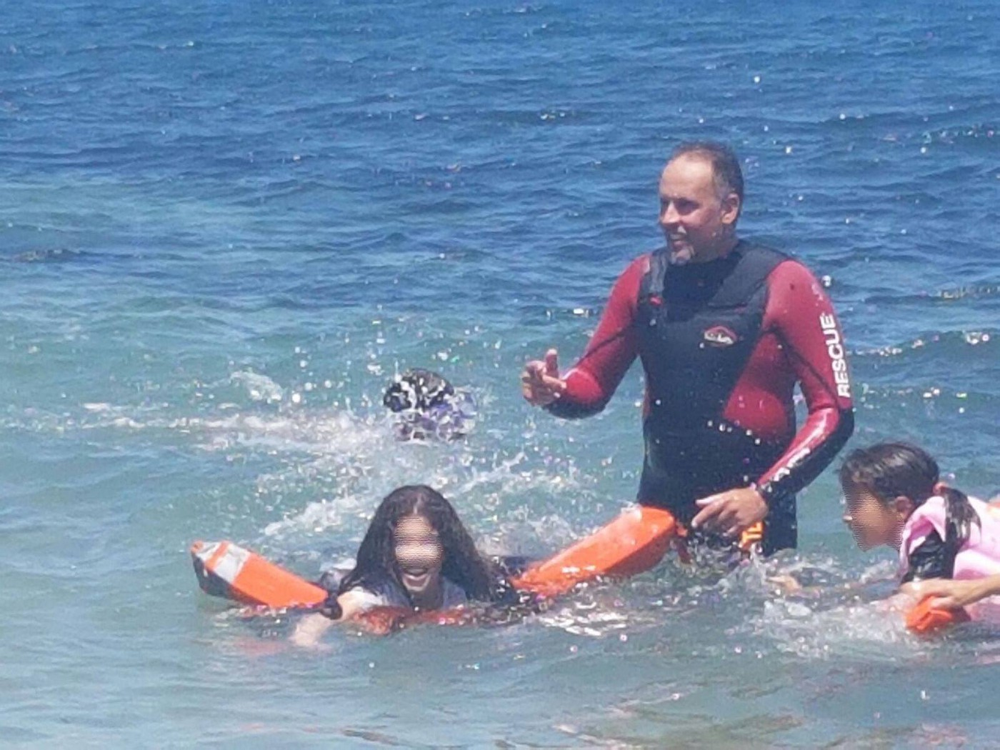

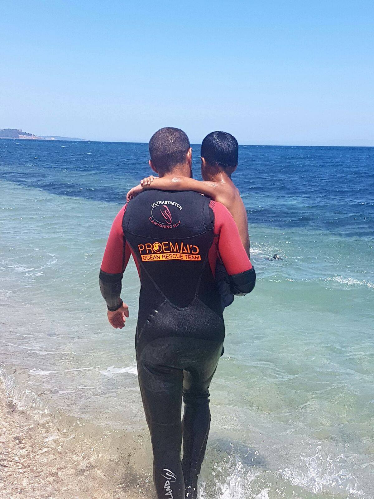

Photos courtesy of Proem Aid

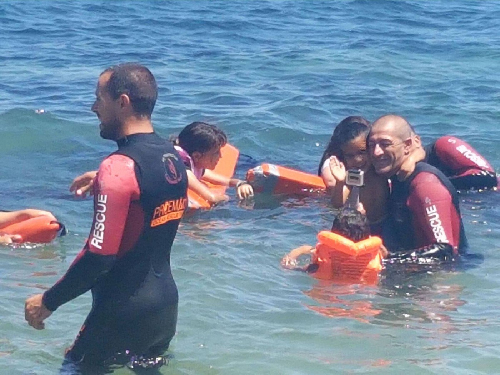

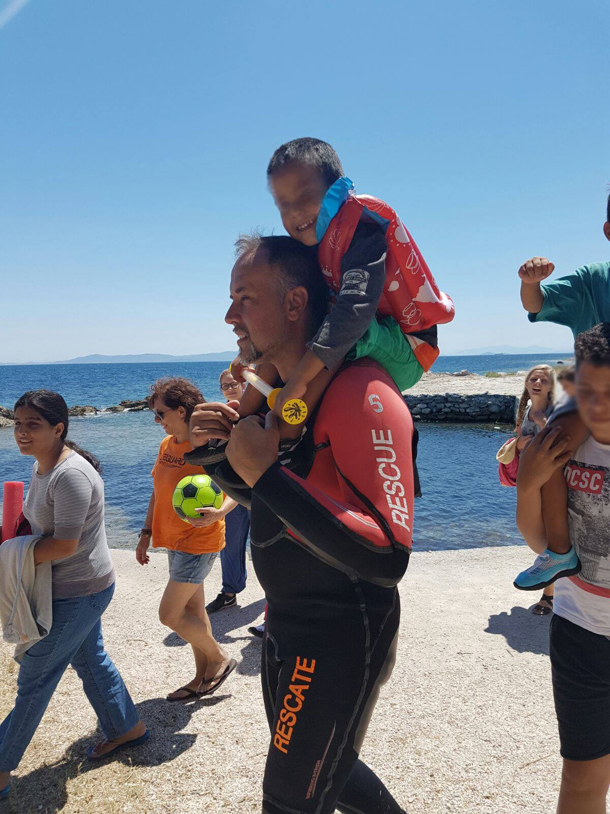

### Report from our friends at Action from Switzerland:

> 37 new arrivals on Chios, as is usual these days the mix of groups and nationalities was Libyan, Syrian, Moroccan, Algerian, and Western Saharan\. 

### Volunteers on Samos from Calais Action were able to set up great, solid sun shading for the blossoming school that is being assembled there\.

Furthermore, the children were able to [engage in some so\-called “colour therapy”](https://www.facebook.com/calaisaction/posts/1227452883973881) which will brighten spirits in the now and the later\.

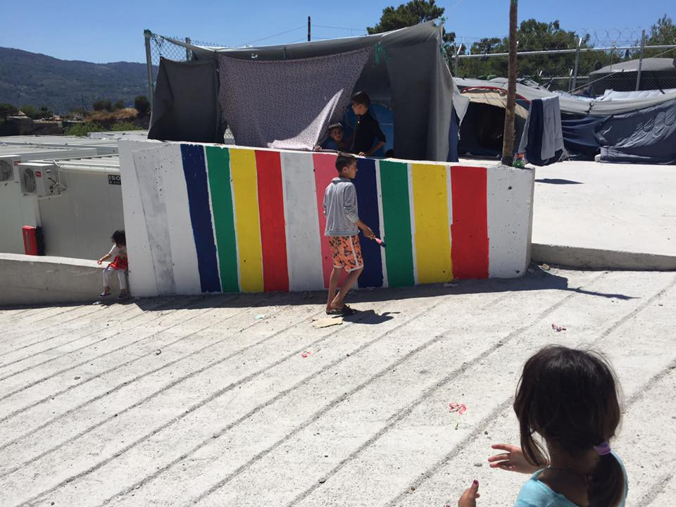

Photo courtesy of Calais Action

Photo courtesy of Calais Action

Additionally the following is a touching account of independent volunteers who have started a coffee and conversation project on Samos\.

_“ It was not groundbreaking, it did not remove the fences or cut down the barbed wires\. The same problems will still be there tomorrow but for two hours tonight the mental barriers erected by circumstance \( and politics and war\) were demolished\.Those here in samos seeking refuge from horrors beyond most of our imaginations, got the chance to sit and be “normal” Last night we opened a free cafe in the camp…_

_We were not volunteers and refugees, we were not them and us \. We were humans of all walks of life, all nationalities, cultures, languages…but a cup of coffee is a cup of coffee_

_Let me explain\. We bought chairs, laid out blankets, provided tables and poured coffee and tea\. We bought playing cards, draughts, dominoes\. We did not ask for a queue to be formed nor a ticket to be stamped\. There was no checking of numbers or ID\. We offered a coffee, a conversation, a chance to relax and a chance to feel human\._

_I hope you can appreciate the importance of this, of regaining your name for a moment, of regaining your dignity, of not having to ask for every little thing\. The importance of dignity in a situation where perhaps that is all you have left…your name and your dignity, both of which you may feel are slowly being stripped away\. Perhaps to sit and talk, to sit and listen to peoples dreams and nightmares, to peoples reasons for fleeing, their hopes of a future, their desires to return , their loss, their beliefs of a future again for their children is a small step in breaching this racist xenophobic imaginary line that divides so many\. \.or perhaps its even more simple, for a few hours it may well just be a coffee, a game of dominoes and a shared respect \._

_Whatever these evenings may become will no doubt become more apparent if we are able to continue\. and we do hope to continue\. \._

_As previously explained, photographs are forbidden from being taken inside the camp\._

_Can you help us to share a coffee ? [https://www\.gofundme\.com/278zukw4](https://l.facebook.com/l.php?u=https%3A%2F%2Fwww.gofundme.com%2F278zukw4&h=jAQEFYf8v)_ 
_Click here to support No more borders, no more tears by Jenny Graham_ 
_History will write of a time, our time, when shamefully those seeking refuge from a world at war, were dealt with behind barbed wire and steel gates\. Families fleeing torture, persecution and violence dealt with through a dehumanizing bureaucracy of losing their names to be given a number, losing…_ 

_Jenny Graham”_

Ten refugees were arrested in Rhodes attempting to fly out using forged documents\. Although the consequences of these attempts are severe, for those who are pushed out of the normal track of the system, the most extreme options are often seen as necessary\.
#### Thessaloniki
### Elpida camp \(Thessaloniki\) is searching for volunteers\.

They seek volunteers with experience in construction and carpentry as well as female Arabic translators, Arabic translators with some medical experience, and Arabic translators with experience with children\.
### Volunteers in Thessaloniki were able to distribute women’s hygiene packs donated by Days for Girls as well as food to folks outside of camps\.

As these topics of feminine hygiene are often taboo among families, it provided an empowering but discreet way to tend to these needs\. Furthermore, [the volunteer team were able to distribute](https://www.facebook.com/groups/478293189015540/permalink/599430103568514/) over 200 hot meals in the parks of Thessaloniki where many refugees are located, outside of the nominal protection of camps\. One of the volunteers learned it was a boy’s 15th birthday party, so they were able to bring a bit of birthday cheer with a cake\! Crafting supplies were also distributed to children in order to give them something to do\.

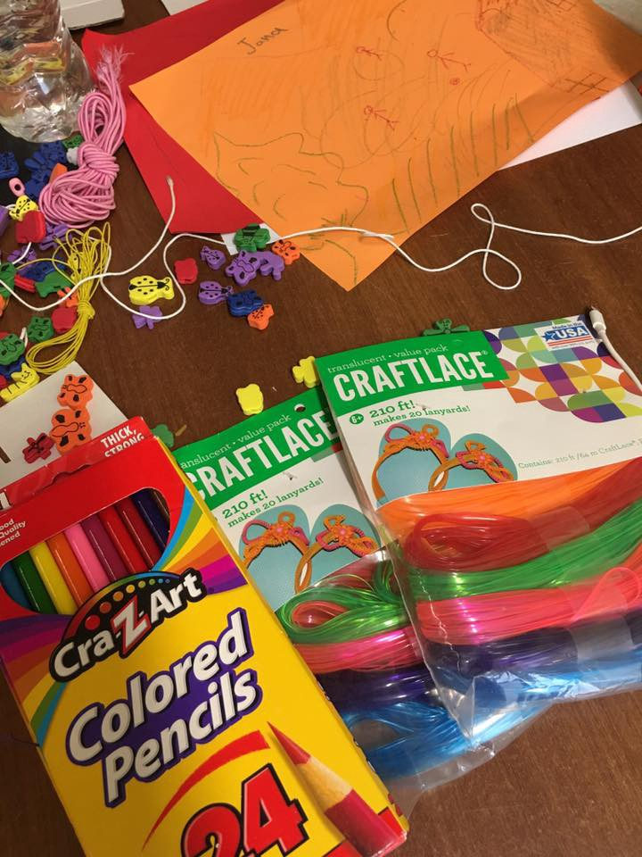

#### SERBIA
### Detailed video reveals true conditions of Horgoš transit zoneat Serbian\-Hungarian border\.

Courtesy of noborder activists in Belgrade, we understand that the hunger strikers at Horgoš who arrived recently now number around 300\. Twelve are in need of medical aid due to the toll taken on their bodies after the grueling march, and striking in the summer heat\. Twenty\-six more have set off from Belgrade to join their compatriots in Horgoš\.

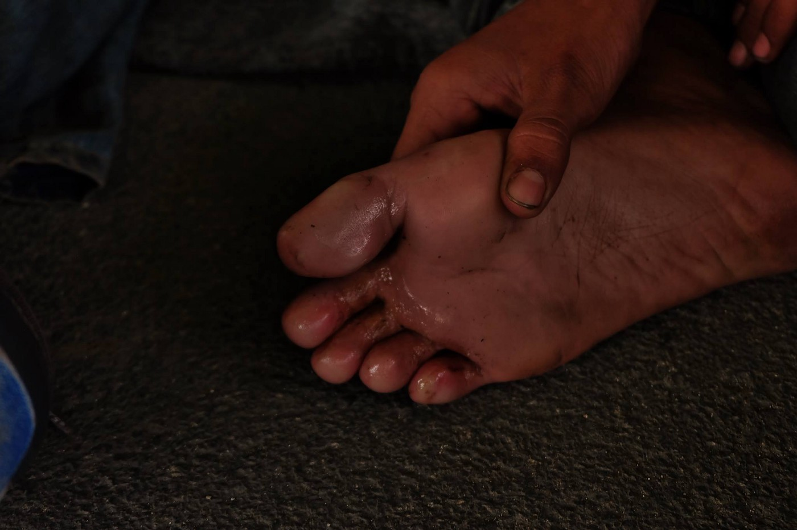

Refugees waiting in Belgrade, Nima Yaghmaei Photography

On the other side of the border in Röszke, Hungary, authorities prevented a Hungarian humanitarian NGO from distributing hot food for one week\. No explanation can be observed at this time\. The tempermental situations at the border only strengthen our encouragement that groups planning to help at the border bring local members of activist or volunteer efforts who can help provide translation and negotiation support\.
#### AUSTRIA
### Court\-certified interpreter reveals the complete lack of oversight and responsibility in providing adequate interpreters to refugees\.

Read the following distressing news from a court\-certified interpreter on the irresponsible behavior that is present not only in Austria, but across the route\. This report [was written by Border Crossing Spielfeld](https://www.facebook.com/RefugeesSpielfeld/photos/a.1631564003770749.1073741829.1631251033802046/1729755197284962/?type=3&theater) \.

> A certified court interpreter who attended recent court hearings in Graz concerning push\-backs of refugees at the border in Spielfeld told the independent radio station Radio Helsinki that while he was regularly working at the border crossing in Burgenland in autumn of 2015, neither he nor any of his colleagues have been asked to help out with translations at the border since the beginning of the year\. Since the beginning of 2016, the ministry of the interior has shifted to using only lay interpreters commissioned through the security firm G4S\. 

> “None of these people are trained interpreters\. They were newspaper vendors, cleaning staff of camps or security staff\. These people are under immense pressure\. I know of cases where the translator himself only received a positive decision by the authority a short while ago\. How can this lead to objective translations? In another case, a woman translator who wore a headscarf was told not to come back if she wore a scarf\. Under such conditions, translation work cannot be carried out properly\!” 

> Making reference to some of the details discussed during the court hearing, he said: “I would need about 15 minutes for the 3–4 standard questions mentioned by the officers\. There is no way this can work in 5 minutes”… “As I regularly work at court trials, I would have noticed the mistake in the instructions concerning the right to appeal\.” 

> The hearings which took place over the past few weeks have clearly shown that interpreters used at the border crossing in Spielfeld were sometimes not even able to understand German properly, translation was sketchy and officers regularly asked to interpreters to sum up what interviewees had said and what the final decision should be\. Interpreters also provided “expertise” as to which region people were likely to have come from and if there was currently a war in that region or not\. 

> For more about the hearings read our posts over the last few weeks\. Also, thank you to Radio Helsinki for their tireless commitment and radio reports produced on the subject\. 

> The quotes above are taken from their interview broadcast on 20 July \(in German\): [https://cba\.fro\.at/320813](https://www.facebook.com/l.php?u=https%3A%2F%2Fcba.fro.at%2F320813&h=WAQFbQfM8AQEpYK3Gyj2InJMvkKkXCWSuNs9w_gpWQY4hDQ&enc=AZPYLtF_l-qckZZB4ycfsfTuu_7oApbBv3UO7xT6rPNND1zb-9sPoj89_-JEOh3QE7_DsCXtue98RgFcXNHdi0umhDRjI6bjpI1M45rLQFBHJf-vBovpOfFZa5U06ELrsz71J7lbbGK-7zTQ73Txgu8S1wmuX-lYMuNdnYd0z0QbcavQ-DwBWHKtxlAIJulHJsY&s=1) 

Such strict measures of acceptance and adherence to the law is being required of those applying for asylum, the reality of this clear violation of the human right to understand what is being requested, explained, and demanded of you is particularly disturbing\. We would encourage any and all interpreters to share their experiences of the lack of mandated translation and interpretation support\.
#### FRANCE
### Help4Refugee children provides a wonderful report of the Refugee Kite Day activity that took place last week\.

It was a collaborative event put on by Happy Ravers, Help4Refugee Children and Raw Material — a mentoring and talent development charity who run music and media projects with young people\. The event featured kite\-flying, face painting, and some catchy drumming as all celebrated their unity and diversity together\. [Check out their album](https://www.facebook.com/help4refugeechildren/photos/?tab=album&album_id=1773600146196396) for more pics\!

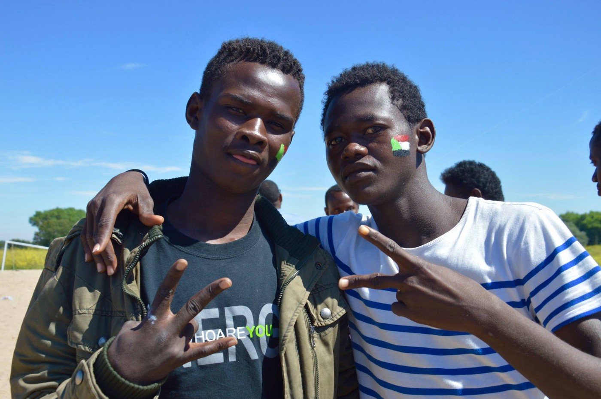

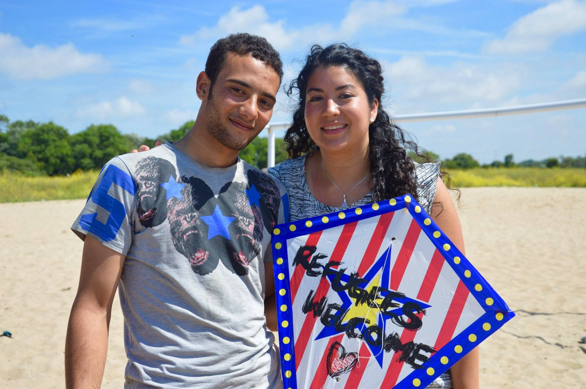

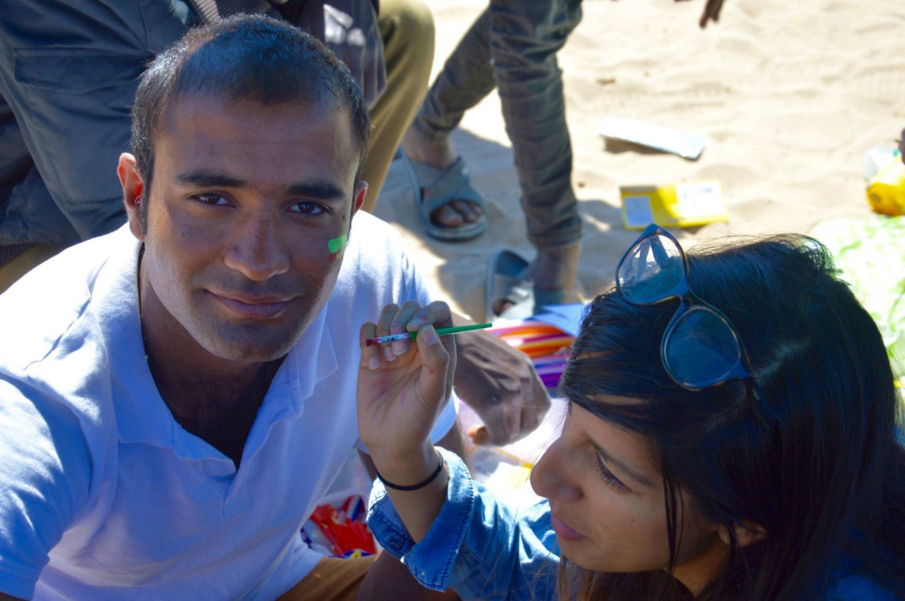

Photos courtesy of Help4Refugee Children
#### GENERAL
### According to data released by UNHCR, 70% of those participating in pre\-registration exercises in Greece in the last month were women and children \.

22% were women and a staggering 48% children\. [690 of the total number were unaccompanied minors](http://asylo.gov.gr/en/wp-content/uploads/2016/07/Preregistration-dataEnglish.pdf) \. Reports across Europe thoroughly demonstrate how unaccompanied minors are specific targets of exploitation and abuse\. It is crucial to treat these cases with care and to also take great precautions to preserve family groups and not inadvertently separate families\.

_Converted [Medium Post](https://areyousyrious.medium.com/some-settle-in-some-pushed-out-ays-digest-26-7-229ad118cb2c) by [ZMediumToMarkdown](https://github.com/ZhgChgLi/ZMediumToMarkdown)._
