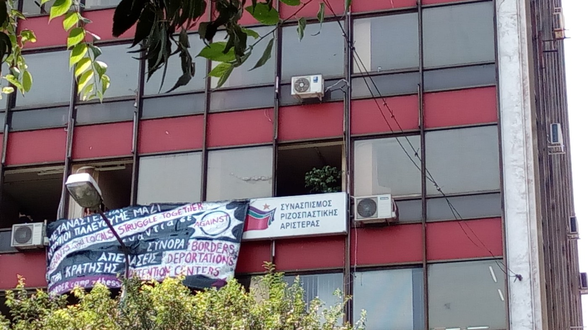

### AYS Short Report on the Eviction Day 27\.07\.2016
#### Squats in Thessaloniki and the Port of Piraeus were evacuated

Shortly after 4:00 AM Greek time today we received the first messages that the police had started evicting squat housing projects in Thessaloniki\. According to the police the owners of the buildings had sued those who occupied the buildings\. Affected squats were Orfanotrofio in Toumba, Hurriya in Karolou Dil and the Mandalidio building in Leoforos Nikis\. 85 persons were arrested during the eviction\. Most of the refugees from these squats have been set free and taken to the Diavata Reception Centre north of Thessaloniki, however, members of solidarity movements will be sued\. With the house emptied, the [Orfanotrofio building is being destroyed](http://www.seleo.gr/thessalonikh/217203-katedafizetai-to-orfanotrofeio-stin-toympa-pou-ekkenothike-simera-apo-antieksousiastes-foto-vinteo) despite the fact refugees still having life\-saving medicine inside\. Later on volunteers were able to transfer the medicine and other stuff safely from the squat\.

After the eviction took place activists occupied the offices of the Syriza party in Thessaloniki protesting against the police action\.

Later this morning around 10 AM police vehicles showed up at the Port of Piraeus together with 4 buses\. The forced evacuation of the Piraeus port area began calmly\. Police officers went around to wake up and inform people to leave\. Pretty much all of them had go\-bags ready\. An officer from the ministry confirmed there would be 10 busses and that every single person must leave today\. Till 12 PM Greek time, around 6 out of 8 busses have left\. The busses were going to Trikala camp, 5 hours away, and one bus to Oinofita so far\. Many people left on foot to the city of Athens\. Some other refugees going on the busses report the intention to come back to Athens after a few days\. With the people having left the port, the police destroyed all the tents\.

_Converted [Medium Post](https://areyousyrious.medium.com/ays-short-report-on-the-eviction-day-28-07-2016-16eb43948e94) by [ZMediumToMarkdown](https://github.com/ZhgChgLi/ZMediumToMarkdown)._
