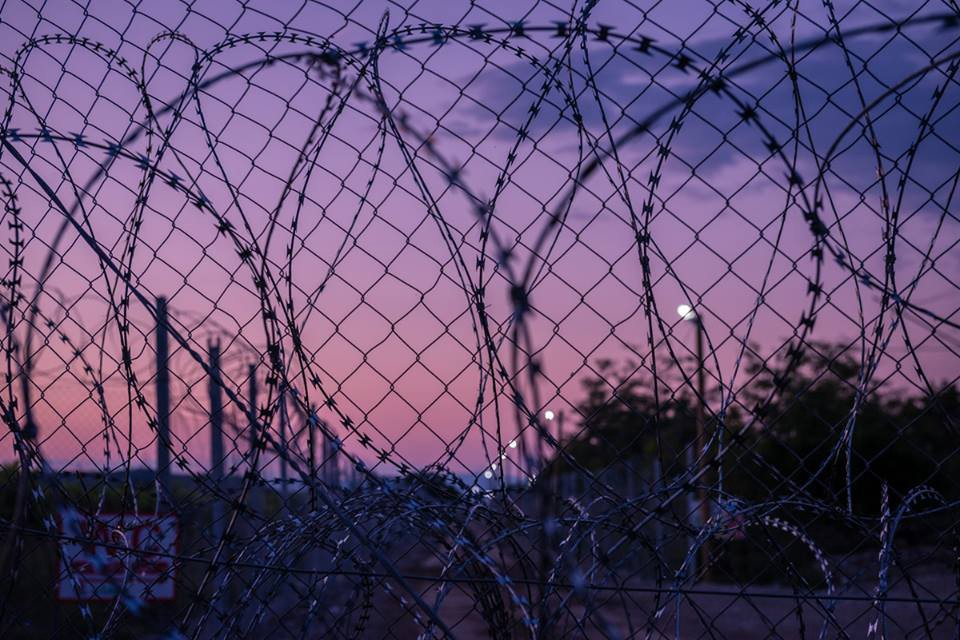
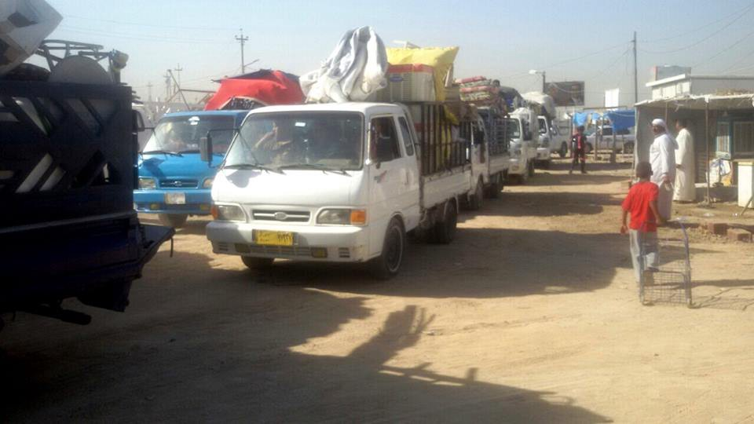
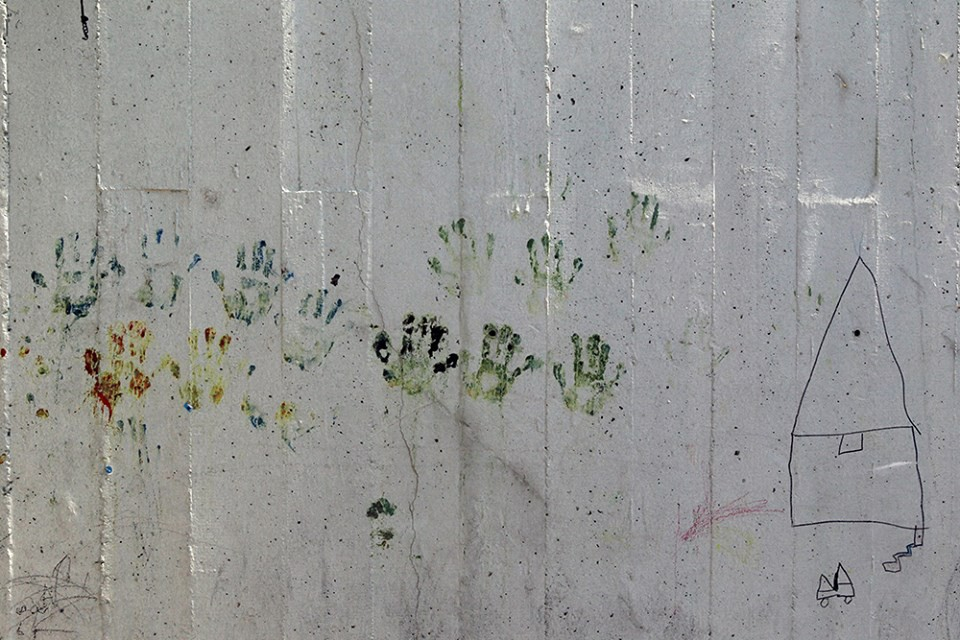
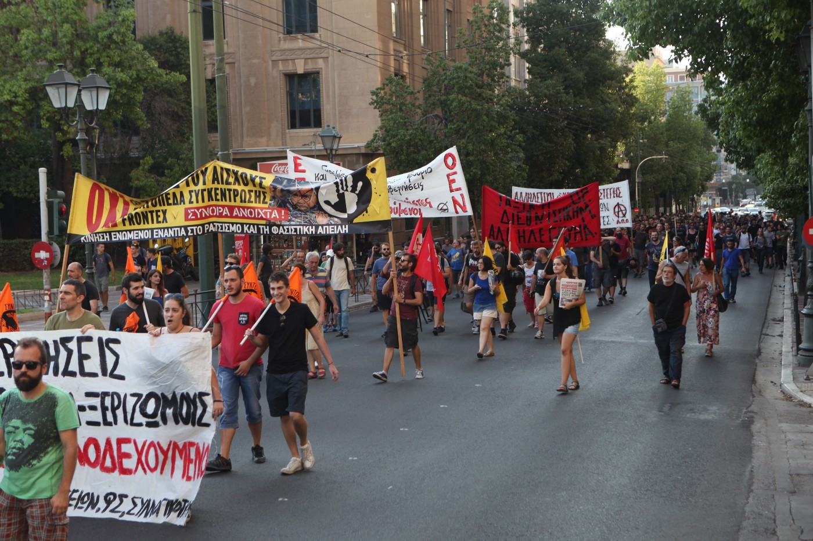
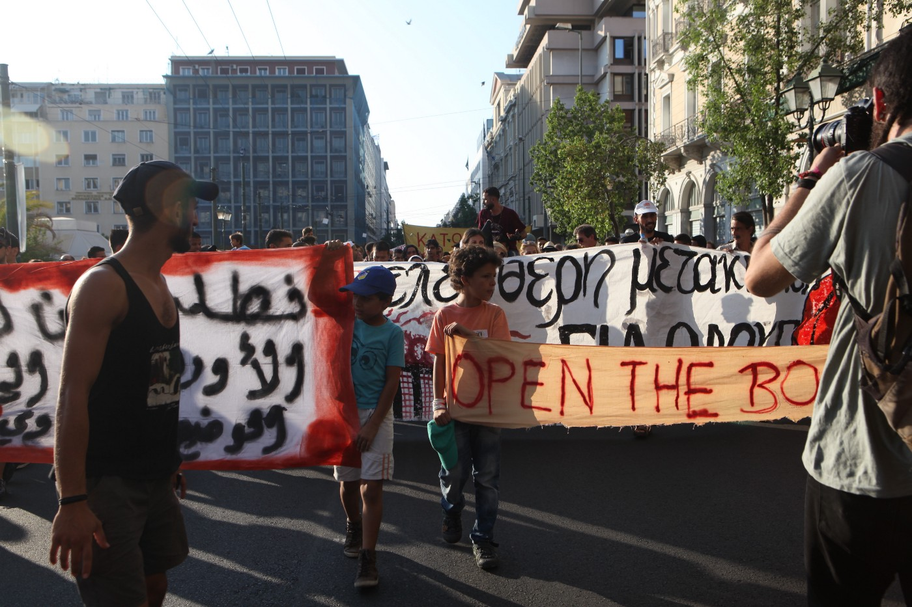
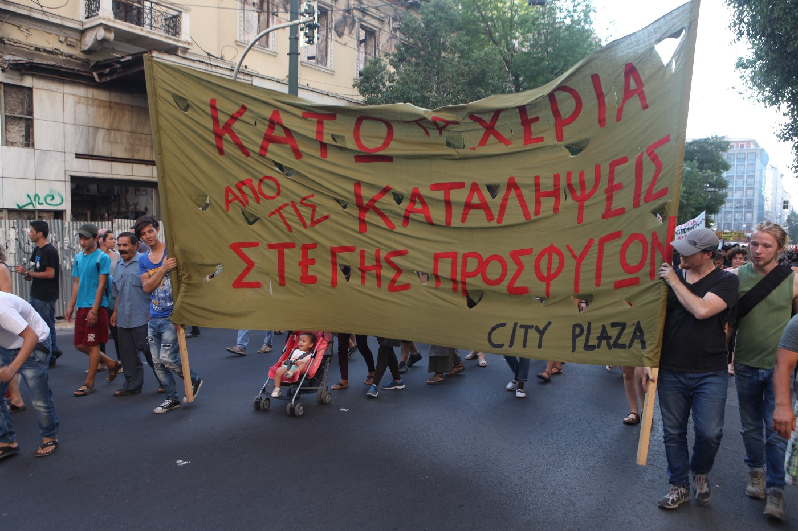

### AYS DAILY NEWS DIGEST 28/7 — Eastern Aleppo residents are being strangled by the siege
#### The joint Russian\-Syrian assault on the city and the shocking results have been making headlines for months\. Despite this, no action has been taken\. Now, the government is offering an amnesty deal to fighters who surrender as well as the creation of 3 humanitarian corridors to allow civilians to flee the battle field\. Those on the ground are rightly skeptical — as they should be, given the regime’s history of broken promises\. As people who are against the plight of refugees, we must fight against the conditions that create refugees in the first place\.

Idomeni\. Photo Credit: Ignacio Marin
#### Iraq
### Ramadi refugees are making their way to their home city\.

A photo of the convoy returning to Ramadi\. Photo Credit: UNHCR Iraq

UNHCR reported on a convoy of refugees from Ramadi returning to their home city\. Approximately 100 families are a part of the convoy which heads home, not knowing what to expect\. The city was retaken from ISIS by the government at the end of last year, but returns have been slow, as the city was totally demolished as a result of fighting between army forces and ISIS\. The move comes in the aftermath of a mortar attack staged on al\-Salam camp in southern Baghdad\. The refugees themselves are unsure of the move\. [“We are leaving because of mortar shelling on the camp\. Otherwise,we felt so comfortable in the camp, we got assistance from everywhere\. It was the best place for us,”](https://www.facebook.com/UNHCRinIraq/posts/1740955986122746) said one mother\.
#### Syria
### The siege of eastern Aleppo has become total, with regime claims of safe passage being viewed with suspicion\.

The SOHR confirmed that eastern Aleppo has been under siege by government forces since July 11, and that the siege has now become absolute\. “Today \[July 27\] there is no way at all to bring anything into Aleppo,” said SOHR director Rami Abdel Rahman\. The plight of Aleppo’s citizens has been a trending topic for quite some time now, as exemplified by the \#AleppoIsBurning hashtag, but despite this, no action has been taken\. The situation has only worsened, especially for the 300,000 people living in rebel controlled districts, with the government now taking moves to consolidate the ensuing victory\. Mass SMS messages were sent to Aleppo residents, saying that they should take a part in expelling rebel forces from their midst\. The UN estimates that only two to three weeks of supplies remain in the besieged part of the city, meaning that life will become all the more difficult in a very short time\.

Meanwhile, the Syrian state media is reporting on the government’s creation of humanitarian corridors in collaboration with Russian forces to aid civilians’ exit from besieged areas, but many are skeptical of the claim\. Assad has also offered to implement amnesty to rebel fighters who surrender within the next 3 months, which given the regime’s track record is a hard claim to swallow\. [“Everybody we’ve spoken to on the ground in Aleppo says that not only do they not trust either the Syrian regime or the Russians to implement this plan — and that the rebel forces will be safe if they surrender or if civilians flee through these corridors — but they also say it does not make sense to them that this would carried out in this way,”](http://www.aljazeera.com/news/2016/07/russia-syria-open-exit-route-aleppo-civilians-160728130330015.html) reported Al Jazeera journalist Mohamed Jamjoom\. The fall of eastern Aleppo and the exodus of its residents would likely create a new wave of refugees at a time when Turkey, the nearest safe country, as well as other countries neighboring Syria, have severely curtailed if not totally stemmed the flow of refugees\.

Meanwhile, Rami Jarrah has launched an initiative called “Aleppo Pathway” to help besieged civilians cope with the attacks\.

> [_Aleppo Pathway_](https://www.facebook.com/Aleppo-Pathway-245458785840208/) _is the page where proposed projects can be found and here below are the numbers to call if you want to donate to help support their work\._ 
 

> 
 

> _Reza Ceres 00905070336994_ 
 

> _[Fakhri Al Haj Bakkar](https://www.facebook.com/bakri.halabi1) 00905373324586_ 
 

> 
 

> _Email: aleppo\.pathway@gmail\.com_ 

### ISIS’ bombing of Qamishli has resulted in nearly 50 deaths\.

In one of the worst attacks on the city in years, ISIS struck near the headquarters of Kurdish security forces\. The town is located on the Turkish border, and the blast was powerful enough to shatter windows in a town in Turkey\. Hasaka province, where the town is located, was wrested by Kurdish forces from ISIS last year, and the group has claimed responsibility for the attack\.
#### Greece

**108 new arrivals have made their way to the islands, marking an increase since the coup attempt in Turkey\.**

As of 7:30AM, 35 have made it to Lesvos, 72 to Chios, and 1 to Kos\. The flow of refugees into Greece has risen in the aftermath of the coup attempt and fears of what was to come next\. On July 13, there were 8,475 refugees on the Greek islands, whereas on the 27th there were 9,140\. The increase is a result of fewer people returning to Turkey as the country recently faced a coup attempt, with the government taking extremely stringent measures with the implementation of a state of emergency\. [Ekathimerini reports](http://www.ekathimerini.com/210791/article/ekathimerini/news/refugee-flows-remain-a-concern) that this increase in numbers means that camps and hotspots which were already over\-capacity now find themselves even more burdened\. UNHCR’s weekly report had this to say:

> _“Between 18 and 24 July, 495 refugees and migrants crossed the sea to Greece, a slight increase from the 453 who had crossed the previous week\. The average daily arrival figures in July thus far stands at 54 compared to 52 in June\. Thus far in 2016, 159,670 have arrived to Greece by sea, contributing to a total of 250,154 arrivals that crossed the Mediterranean Sea\. From 1 January to 24 July 2016, the countries of origin of those who arrived in Greece continue to be mainly from the Syrian Arab Republic \(48%\), Afghanistan \(25%\) and Iraq \(15%\) \.”_ 

What’s left of the refugees in Piraeus, Gate E2\. The port was fully evacuated on July 27\. Photo Credit: Marios Lolos
### The death of a refugee girl in Softex camp sparks protest\.

The girl died today as a result of a seizure\. It took an ambulance 2 hours to reach the camp in what would have otherwise been a routine procedure\. Because of her death, refugees marched on the center of Thessaloniki, where they joined up with another protest against yesterday’s eviction of squatters approximately 100 squatters\. At the end of the protest, a new building was occupied and barricades were built to repel the eventual police attacks\.
### The eviction of squats has sparked protests throughout Greece\.

Protesters head toward Syntagma Square in Athens\. Photo credit : Alpkhan Photography

The following report was written by L\. Mertes:

> **_Athens_** 

> _More than two thousand people marched through downtown Athens today to protest the closure of three squats in Thessaloniki\._ 

> _The squats, emptu buildings occupied to house refugees, were home to some of Greece’s stranded refugee population of over 57,000\._ 

> _City Plaza, a hotel near Victoria Square in Athens occupied by over 400 refugees and a handful of activists, called for the protest\. Hotel residents left their building as a group and joined refugees from other squatted buildings in Athens on the route of the march\._ 

Children at the front of the march\. Photo Credit: Alpkhan Photography

> **_Thessaloniki_** 

> _The operation in Thessaloniki took place in the early morning hours Tuesday\._ 

> _Two of the three squats were occupied\. The third had only been occupied in recent days\. The Greek Orthodox Church owned one of the squats\._ 

> _The eviction was thought to be a response to the destruction of Thessaloniki City Hall by a group of 150 anarchists taking part in the No Borders Camp last week\._ 

> _“After the No Borders incident, people have been talking about an act of revenge in which the government tries to end the solidarity movement by attacking the sites of solidarity,” said Yiorgos Maniatis, a key organizer of the City Plaza squat\._ 

> _“Now you see a clear move to repress the solidarity movement\. It’s a fact that it’s a step back on the part of the Syriza government to answer its critics on the right with ‘law and order’ politics,” he added\._ 

> **_Camps vs\. Squats_** 

> _As most Greeks head off on summer holidays, the battle over where refugees should be housed appears to be reaching a crescendo\._ 

> _“The government doesn’t have the courage to move to a policy of integration in the cities\. They keep people in the camps in poor conditions,” said Maniatis\._ 

> _For some, the evictions appear to be a step in the wrong direction in a country burdened with the weight of austerity\._ 

> _“I don’t understand the logic of the evictions as the squats are self\-sufficient\. The idea that the government is taking people out of the squats and putting them in the camps seems to have a reverse logic\. The squats are taking some of the burden off the state,” said Charlotte Cheeseman, a City Plaza resident from the United Kingdom\._ 

> _“It’s not just as easy as closing them down and evicting people\. This model of alternative housing has a strong movement around it,” she added\._ 

> _“The camps that are close to the city are closed and the ones in the countryside are open but far from the cities\. So in fact all of the camps are closed,” said Vangelis, a member of the class solidarity movement in the Athens’ neighborhood of Exarchia, which is home to many of Athens’ squats and groups in the country’s solidarity movement\._ 

> _The timing of the operation was crucial\._ 

> _“Most people in Greece are on holiday now so it was a good opportunity for the state to try to take the squats and not to have a lot of reaction from the public,” said Vangelis\._ 

> _Refugees residing in the squats prefer them over the camps\._ 

> _Jamileh, an Iranian resident of Athens’ City Plaza squat said, “I feel sad for them \[the evicted refugees\] \. Maybe they will close City Plaza\. I’m worried about my children and where they will sleep if that happens\. City Plaza is the best place, they have a doctor, good food, classes everyday\. Everything we need we can get from City Plaza\.”_ 

> _Not everyone was worried about the potential for more evictions in Athens\._ 

> _“Yesterday I was worried\. Today I don’t think the government wants a battle with the immigrants\. They are strengthening \[the solidarity\] movement by fighting with them\. It’s not a state strategy to take all of the squats back\. It’s a tactic to take back some as an answer to the No Borders incident,” Vangelis said\._ 

> _Most of Greece’s stranded refugees, however, still have their sights on homes and destinations farther north\._ 

> _“It’s fine to close the squats if they open the borders,” said Sediq, a refugee from Afghanistan\._ 

City Plaza residents organized the protest\. Bride Walks in front of marchers\. Photo credit : Alpkhan Photography and L\. Mertes\.
### Now that pre\-registration has ended, refugees will receive information about follow\-up appointment by SMS\.

The Greek government has [released a memo](http://asylo.gov.gr/en/wp-content/uploads/2016/07/NEXT-STEPS.pdf) saying that refugees who have pre\-registered should expect to receive the date and location of the next appointment with the Asylum Office via SMS\. The message will be sent to the number given by the refugees during pre\-registration\. You may also find a list of appointments at [www\.asylo\.gov\.gr](http://asylo.gov.gr) \. Refugees who miss their appointment will have to repeat the process from the beginning\!
### An update on the situation in Skaramangas\.

[The report was written by Norman Hering in a Facebook group for volunteers in Skaramangas\.](https://m.facebook.com/groups/482637108599333?view=permalink&id=507072199489157&hc_location=ufi)

> _After over 3 months of asking for security by the police, we had a meeting of all groups and NGOs with the police director on Wednesday 27/7\. This came about after the recent arrival of around 1500 Pakistani men seeking preregistration\. Their presence cause a big disruption in services, especially the stoppage of UNHCR preregistration\. They stopped services last Wednesday and have not returned to date\. One of the UNHCR representatives told me he thought, but was not certain, they would not be returning to Skaramangas\. And the future of preregistration is uncertain\. The Pakistani men heard preregistration was going on at the camp and showed up en mass\. Some of them have been living here illegally for awhile\. Their presence pushed the authorities to pay attention to the many security issues we’ve had for months\. These include, but are not limited to, vandalism, breaking and entering, theft, physical intimidation, threats, and assault, sexual intimidation and assault\. Skaramangas has been operating like a small lawless town with no consequences for illegal behavior\. The director asked for very specific crimes committed so he could respond with his advice\. After hearing from everyone his first recommendation was security cameras\. We had previously discussed having them but the UNHCR said we could not as it was illegal and presented ethical issues around privacy\. One of the actors present is a lawyer and said he would look into the law with the Ministry of Migration\. Other NGOs expressed some reluctance to have cameras for the same ethical reasons\. It was suggested that we have cameras for aid distribution only to start and see how it goes\._ 

> _We looked at an offsite warehouse today and it appears to be good\. The owner was supposed to leave a key with a neighboring warehouse but failed to do so\. But from the appearance as viewed from the window, looks like it will work\. I will update after I have more specifics\._ 

> _Children’s vaccinations continued by the Red Cross after being cancelled due to the large group present at the gate \(see above\) \. All the NGOs left camp for varying times whilst the group was at the gate over this past week\. Apparently the authorities didn’t plan on other refugees showing up for preregistration and didn’t have any kind of plan other than to flee the camp\._ 

#### Italy
### Flow of refugees into Italy remains constant, according to the UNHCR weekly report\.

> _Between 18 and 24 July, 8,157 refugees and migrants arrived in Italy by sea which is a significant increase to the previous week’s arrivals of 2,148\. However, overall sea arrivals to Italy remain consistent with those of 2015\. As of 24 July, 88,009 persons arrived by sea to Italy in 2016, compared to 93,540 persons whom disembarked at the end of July 2015\. On three separate disembarkations this week the bodies of 39 individuals were discovered, bringing the total number of people dead or missing at sea to 2,990\. Their cause of death is believed to be from inhaling engine exhaust fumes or suffocation\. The top nationalities of origin among arrivals include Nigeria, Eritrea, Gambia, Cote D’Ivoire, and Sudan\._ 

### New project established to find homes for refugees in Tuscany\.

[Accoglienza migranti](http://www.regione.toscana.it/-/accoglienza-migranti) is the new service that Toscana Region established to record the hosting availability from families, privates and buildings’ owners, for asylum seekers, according to the Tuscan model of widespread hosting \(accoglienza diffusa\) \. A phone line is active from Monday to Friday, 9\.00–12\.00 \(on Thursday 14\.00–17\.00\) \. The phone number is 055 4383030\.

The service has been created for two projects\. Private citizens can call to offer a building \(under adequate regulation and able to host at least 5 people\), or they can host single asylum seekers in their family in which case, they must leave data about address and the family members\. The Protocollo e nel Patto di Solidarietà includes all the details of the contract between the family and the managing entity\.
### Refugee advocates seek clarification on project\.

Rete a Sinistra [wrote a letter](http://www.savonanews.it/2016/07/28/leggi-notizia/argomenti/al-direttore-3/articolo/hub-per-migranti-a-savona-lettera-aperta-di-rete-a-sinistra-al-prefetto.html) to the prefect of Savona, asking clarification about the project for the migrants’ hub\. According to them, the agreement State\-Regions 2014 foresees the creation of these hubs with measures adequate to the regional capacity, requiring the hosted people to be photo\-identified and health — screened, before asking for asylum; the agreement speaks also about temporary stay, necessary to the application’s submit and the procedure’s conclusion\. Nevertheless, the organization mentions that at least 12 months are required for this procedure\. In this case, a hub would be definitely inadequate, since endowed with living modules unable to host for long periods\. Other questions are related to the funds, the legal protection, the management of these people and the direction of this measure\. The organization mentions that they would be happy to see the substitution of the current receiving center with the adoption of the model of widespread hosting \(accoglienza diffusa\) \.
### Milanese town fights against taking in refugees\.

In the province of Milan, [several initiatives are taking place](http://www.ilgiorno.it/lodi/migranti-profughi-protesta-1.2382032) to prevent the arrival of 98 migrants into the town of San Colombano\. Last Monday, Milan’s prefecture stated that an agreement with a private will lead to the hosting of these people in a 140 square meter building in the city center\. The mayor explained the critical situation in terms of controls and social issues, especially after a citizens’ assembly, which approved two motions against this arrival unanimously\. Moreover, a petition collected 1892 signatures \(over the 7,300 people living there\) in the same direction\. The complain mentioned that 500 migrants are already present in the municipality, and the police is underemployed for the management and patrolling\.

_Converted [Medium Post](https://areyousyrious.medium.com/ays-daily-news-digest-28-7-eastern-aleppo-residents-are-being-strangled-by-the-siege-ed5980425fbe) by [ZMediumToMarkdown](https://github.com/ZhgChgLi/ZMediumToMarkdown)._
