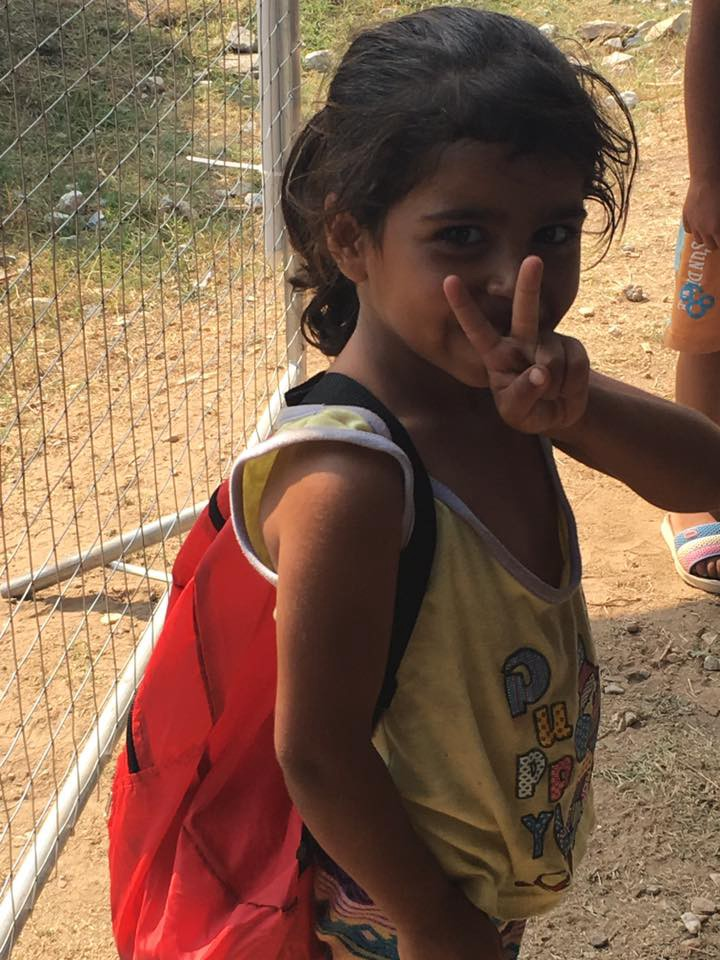
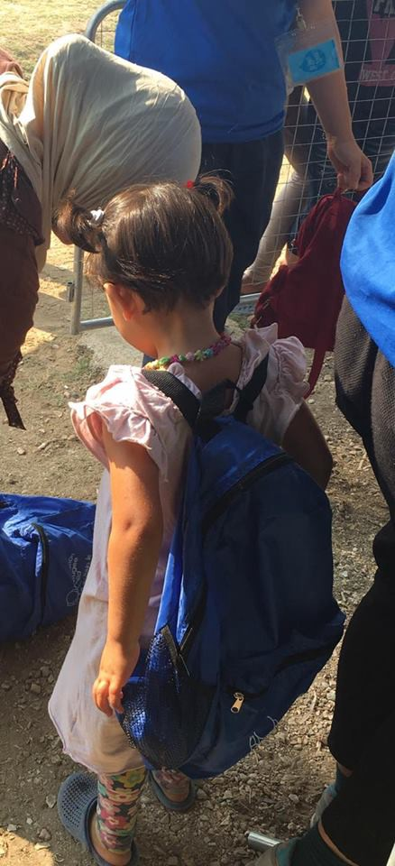
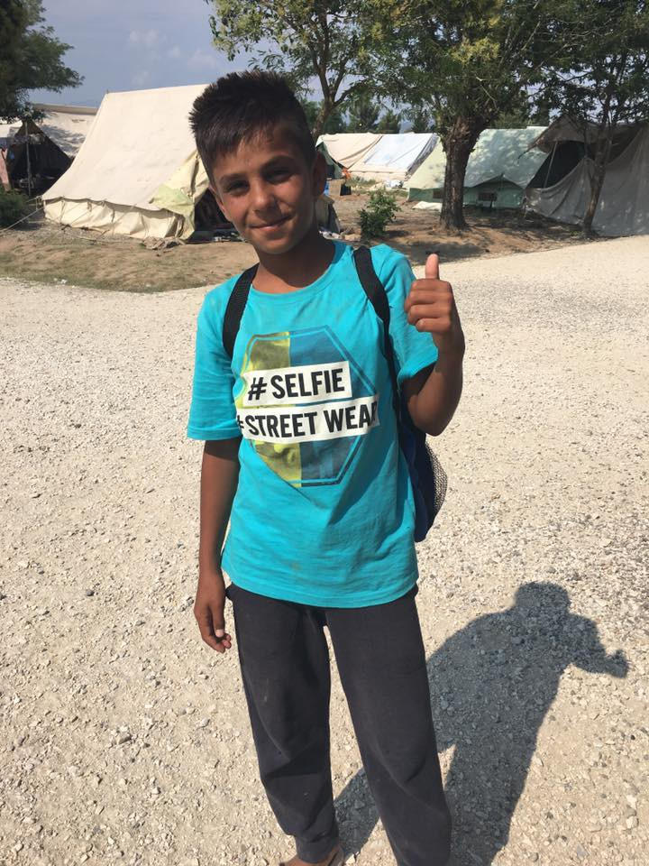

### AYS Daily News Digest 30/07: A new refugee born on a rescue boat

> Aylan Kurdi’s father says his son ‘died for nothing’ as refugee disasters put 2016 on course to be deadliest year ever\. Another refugee dies under police beatings\. 13,000 refugees asked Greece for protection this year, only 146 have been granted this protection, while others face deportations\. 

](assets/951da3f06aea/1*KRDiEQlsTeof0ZWmYt3wCg.jpeg)

The beautiful message sent by [**No Border Kitchen Lesvos**](https://www.facebook.com/NBKLesvos/)
#### Mediterranean
### 2016 has been deadliest year on record for refugees crossing the Mediterranean sea

> _Almost as many Europe\-bound asylum seekers and irregular migrants have died on desperate journeys so far this year than in all of 2015, the [deadliest year on record](http://www.aljazeera.com/news/2015/12/deaths-remembered-international-migrants-day-151218035026917.html) for refugees\._ 

> _At least 3,034 refugees perished on the Mediterranean Sea between January 1 and July 28 of 2016, compared with 1,970 in almost the same period a year earlier — an increase of 54 percent, [according](https://www.iom.int/news/mediterranean-migrant-arrivals-reach-251557-deaths-sea-pass-3034) to the International Organization for Migration \(IOM\) \._ 

> _“We are well on track to exceeding the total number of known deaths that occurred in 2015,” Niels Frenzen, director of the Immigration Clinic at USC Gould School of Law, told [Al Jazeera\.](http://www.aljazeera.com/news/2016/07/desperate-journeys-3034-refugees-die-months-160730100626791.html)_ 

#### Bulgarian\-Turkish border
### A new victim of the European Border Regime

> _The 28 year old Iranian Reza Hassani was missing for about 18 days\. He was found dead in the jungles of Karacadağ\._ 

> _It was reported from another source that he was beaten up together with a friend and pushed back “by Bulgarians into Turkey\.“ After the push\-back he was rarely able to move and got stuck in the middle of nowhere without a phone or food\. The police showed a photo of Reza Hassani’s dead corpse to his friend and told him that they will transport the body to the forensics\-center in Istanbul\._ 

> _It is still not clear if the push\-back was done by Bulgarian border police or by members of one of the nationalist voluntary groups\. Meanwhile the numbers of people who try to cross through Bulgaria seem to grow again, especially after the coup d’état attempt in Turkey\. Bulgarian’s prime minister, Boyko Borissov, spoke about 150–200 people, who were arrested on a daily bases at the Turkish\-Bulgarian border\._ 

#### Greece
### More than 13,000 migrants have lodged applications for asylum in Greece since the beginning of this year

> _According to the most updated available government figures, 13,583 migrants made asylum applications between January 1 and May 31\._ 

> _Of those, 5,731 lodged their applications in Attica, 3,007 in Thessaloniki, 1,918 on Lesvos, 526 on Samos, 210 on Chios and 130 on Leros\._ 

> _A total of 7,032 of the asylum applicants are from Syria, 1,248 from Iraq, 1,030 from Pakistan, 568 from Afghanistan, 544 from Albania, 518 from Iran, 372 from Bangladesh, 257 from Georgia, 212 from Morocco and 163 from the Palestinian Territories\._ 

> _It could take months for the requests to be processed even as the Aegean islands are seeing hundreds of new arrivals every week\. So far, just 588 decisions have been issued, 410 of which have been rejections\._ 

> _Greek authorities have granted refugee status to 146 people, while another 32 have been granted supplementary protection, which is a specific period of protection rather than the unconditional protection foreseen by full refugee status\._ 

> _Those whose appeals are rejected must be deported to Turkey\._ 

> _Migrants can appeal against rejections but usually this simply results in a postponement of their deportation, as 90 percent of appeals against rejections are turned down\._ 

### Volunteers at Lesvos being evicted from their housing, prevented from helping refugees

> _The Alpha Bank, despite the local and global support given to volunteers of **No Border Kitchen Lesvos,** decided to evict volunteers from their housing and hinder their work\._ 

> _The brave volunteers, however, squatted on the beach and organised a solidarity concert, through which they continued their work despite the difficulties\. The concert was in a true spirit of refugee aid efforts: people from all walks of life gathered together and danced to Greek, Arabic, Pakistani and Gypsy music\. We hope the organisation’s situation gets resolved soon\!_ 

 **’ new housing, after they were evicted from their previous home by a bank\. Credits: [No Border Kitchen Lesvos](https://www.facebook.com/NBKLesvos/)**](assets/951da3f06aea/1*nCmNFWXapGZu5_5IpLDVxQ.jpeg)

[**No Border Kitchen Lesvos**](https://www.facebook.com/NBKLesvos/) **’ new housing, after they were evicted from their previous home by a bank\. Credits: [No Border Kitchen Lesvos](https://www.facebook.com/NBKLesvos/)**
### Please help putting shoes on children’s bare feet

> _One of the gravest problems of a refugee camp Alexandreia is the lack of shoes, especially children’s shoes\. There are 400 new children arriving at the camp very soon, and the [Refugee Support Europe](https://gogetfunding.com/user/?uid=152510) is trying to make sure they all get proper shoes, so their feet stay healthy\. Any parent will know how quickly children wear the shoes out and how quickly they become too small\._ 
 

> _Please help them buy shoes by donating [here](https://gogetfunding.com/alexandreiashop/) \._ 

### The Center for Disease Control and Prevention called for the closure of reception centers for refugees across Greece\. Place refugees into local communities instead\!

> _This plea followed the organisation’s officials carrying out inspections on 16 centers in northern Greece and findingthe conditions there to pose a public health risk\._ 

> _According to KEELPNO’s findings, which were forwarded to the ministries of Migration Policy, Defense and Health, the cramming of hundreds of refugees into disused military barracks and industrial sites present a series of health risks for both the migrants and the general public\._ 

> _KEELPNO officials visited facilities with health officials from the Central Macedonia region between July 4 and 8\. In their reports from these visits, they concluded that the venues offered inadequate ventilation to the hundreds of refugees residing there with little more than a blanket or curtain separating one family from another\. They noted inadequate access to running water, while stressing the accumulation of large quantities of trash and waste on the premises\._ 

> _The report called for all reception to be closed down gradually and the refugees to be inducted into local communities\._ 

### Gifting refugee children in northern Greece

> _Drop in the Ocean and Operation Refugee Child co\-operated to distribute hundreds of backpacks filled with so many wonderful gifts for the children\. The backpacks were truly put together with love and each gift was thoughtfully packed, easy for distribution and sent all the way from America\._ 
 

> _There were personal notes to the children as well as numerous gifts for them to enjoy\._ 

> _The children send you a big “Thank you — Shukran\!”_ 

**](assets/951da3f06aea/1*UMfGscBHywzOE8Msmm8y_Q.jpeg)

Credits: **‎ [Kayra Martinez](https://www.facebook.com/kayra.martinez?fref=nf)**

**](assets/951da3f06aea/1*HMbeTkd-eYpkdg1WI3GF-A.jpeg)

Credits: **‎ [Kayra Martinez](https://www.facebook.com/kayra.martinez?fref=nf)**

**](assets/951da3f06aea/1*_6obEZHJLaMbgpTmYNMbDw.jpeg)

Credits: **‎ [Kayra Martinez](https://www.facebook.com/kayra.martinez?fref=nf)**

**](assets/951da3f06aea/1*696M-IfUUz7AgdDD8FTF1g.jpeg)

Credits: **‎ [Kayra Martinez](https://www.facebook.com/kayra.martinez?fref=nf)**

**](assets/951da3f06aea/1*S5NaJr86Pf8gpIQ3EV3yQg.jpeg)

Credits: **‎ [Kayra Martinez](https://www.facebook.com/kayra.martinez?fref=nf)**

**](assets/951da3f06aea/1*UuZ1LGG0h6HYMFaQTVAz5A.jpeg)

Credits: **‎ [Kayra Martinez](https://www.facebook.com/kayra.martinez?fref=nf)**
#### Italy
### Italian navy saving thousands of refugees

> _In the last 24 hours, 1,400 people have been saved by the Italian navy\. This video shows the landing of 564 of them in Augusta\._ 

### Reggio Calabria received another 538 refugees, tired, ill and, many of them, young and alone

> _538 migrants from Sub Saharan Africa have just landed in Reggio Calabria, carried by Bourbon Argos \(MSF\) \. 52 of them are women, 2 accompanied minors, around 50 unaccompanied\. An organization for first\-reception was ready on the harbor dock\._ 

> _7 migrants will be transferred in a hospital in Reggio\. Around hundred people have been diagnosed with scabies and treated with pressurized showers, which were prepared by the civil protection\._ 

### More refugees gaining access to employment in Italy

> _According to the newest report on “Migrants in the job market in Italy,” the employment trends look very different than before\._ 

> _In 2015, a consistent growth in the employment involved both migrants and Italians, against the negative trends of the previous years: 1,969,635 migrants have been employed, 783,953 from outside the EU, with an increase of \+4\.7% for this last category \(and overall 3%\) from 2014\. The Italian component records a similar consistent growth of 4\.1%\._ 

> _On the other hand, the unemployment of women, Italian but especially the non\-EU migrant women’s, is still increasing\._ 

### A refugee baby, Joy Aurora, born on a rescue ship

> _This morning, a Congolese woman gave birth to a little girl Joy Aurora on Italian navy ship Bettica\. Both mother and child are fine\._ 

> _The health team on board supported the operation, from Foundation Francesca Rava, Red Cross and the Italian navy\._ 

> _This is the third birth on board of Bettica\._ 

_Converted [Medium Post](https://areyousyrious.medium.com/ays-daily-news-digest-30-07-a-new-refugee-born-on-a-rescue-boat-951da3f06aea) by [ZMediumToMarkdown](https://github.com/ZhgChgLi/ZMediumToMarkdown)._
