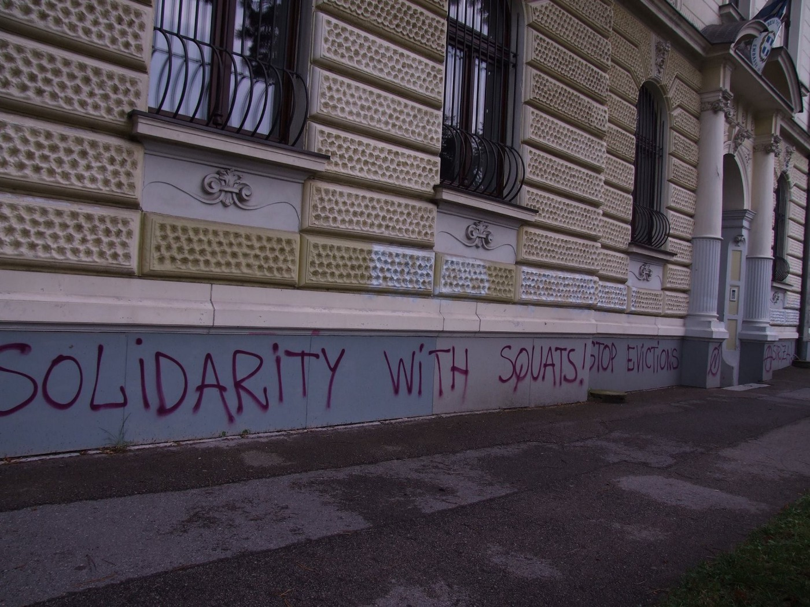
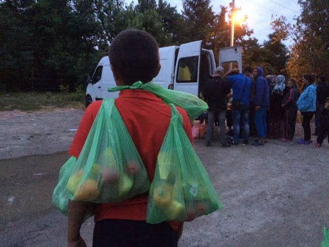
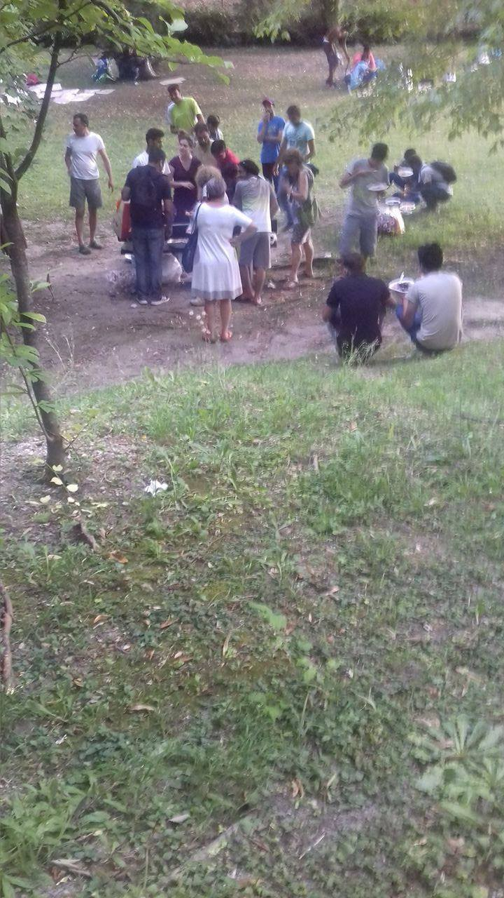
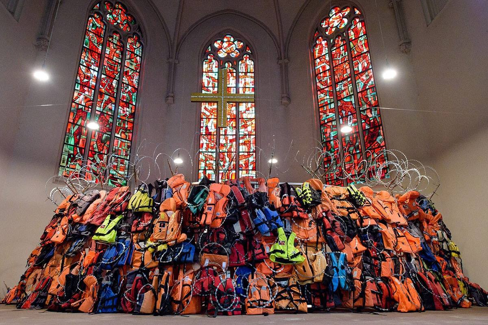
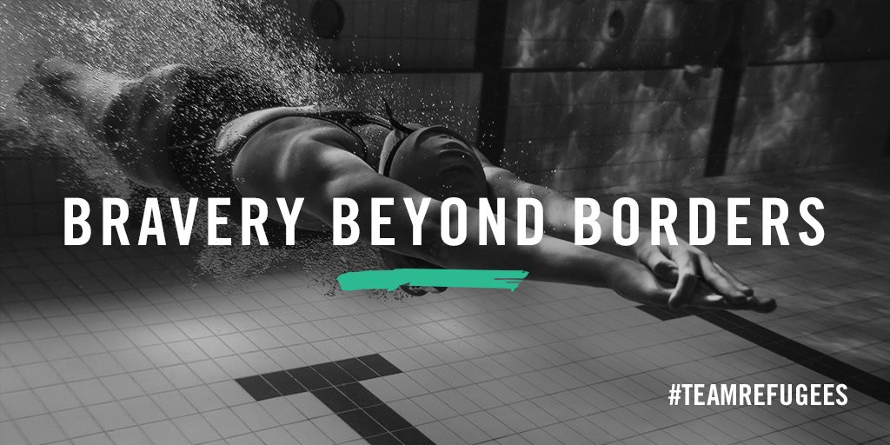

### AYS DAILY DIGEST 31/7: Balkan route — busy and active again, despite closed borders

_Governments from countries along the Balkan route are reporting increase in number of refugees\. That is situation in Greece, Serbia, Bulgaria, Hungary, but also in countries far away from this route, like Italy where from we received alarming information about people who are sleeping in the streets and need food\. Volunteers are needed in all of these countries\. Please, consider to volunteer or to help in any way you can\._

“Being a refugee is only a status\. You can change that status to be a better person in life\.” Yiech, memebr of Team Refugees\. Photo UNHCR\.
#### Libya
### 120 bodies found at the shores of Libya

More than 120 bodies of people who were trying to cross the sea and reach freedom, were found in July at the shores of Sabratha city, western Libya\. Bodies are found on a daily basis, and the victims are mainly sub\-Saharan Africans\. The bodies are buried in a cemetery for unidentified remains in Sabratha\.

At the same time, international media are reporting about human smugglers who are working in Libya with impunity, bringing migrants across the Sahara desert to the coast and on to rickety boats that attempt to cross the Mediterranean\.
#### Greece
### Greek government on alert as number of new comers increases

Almost all the countries along the Balkan route are reporting an increase in refugee flows in recent days\. Thodoris Dritsas, Greek shipping and island policy minister, told the local media that the country is “on alert” while the government is “planning our policy on the basis of all possibilities”\.

Officially, the number of refugees increased since the failed coup in Turkey\. At Lesbos and other islands currently there are 9,240 refugees\.
### Water needed in Agios Andreas camp

We received the alarming call for help from the camp of Agios Andreas\. According to volunteers, there is a possibility of waterborne diseases as several children fall ill\. Refugees reported the change in taste and color of water that is available in this camp\. The residents of the camp have no more drinking water\.

> “Until this issue becomes resolved the overwhelming majority of refugees continue buying bottled water from the closest shopping mall\. Unfortunately, most of them have run out of money \(including the provided by Mercy Corps credit cards\) \. Thus we need urgently bottled or packed waters for the almost 200 refugees in the camp\. Please help if you can and bring water ASAP to Agios Andreas\. “ 

Contact person on site is [Fatima Hammeed](https://www.facebook.com/fatima.hammeed) \.
### Solidarity with squats in Greece

More activist were arrested in Thessaloniki this weekend\. On Sunday, riot police arrested more than 26 activists after they barged into a church during the mass\. They were placed under arrest for “disturbing a religious gathering”\.

The activists were throwing flyers protesting against the clearing of abandoned buildings occupied by refugees in the Thessaloniki area\.

The activist informed the public that they entered the church as a response to the destruction of the squat “Orfanotrofeio,” placed in the building that was the church’s property\.

The activist, as a response to the eviction\-wave in Thessaloniki, squatted another house for a self\-organized space of solidarity together with refugees in Ano Patisia in Athens\.

Photo credit: Anarchist federation
#### Bulgaria
### Refugees arrested and prosecuted

The increase of refugees is recorded in Bulgaria, too\. The Interior Ministry reports that 500 refugees have been detained across the country over the past 7 days\. Of these, 120 have been arrested while trying to cross into Bulgaria from Turkey or Greece\.

Between January and end\-July, more than 2000 people were detained while trying to enter the country\. Most of the arrivals were from Iraq and Afghanistan\.

As many as 5000 were arrested while leaving the country for Serbia, compared to 4500 people for the same period of last year\.

Only on Sunday, 15 people were arrested in the region of Blagoevgrad, Southwestern Bulgaria\. None of them carried identity documents, but some claimed to be from Afghanistan\.
### Indictment against refugees

Bulgarian prosecution office announced that they have charged three Syrian citizens — Almohammad Abdulhamid, Al Abdallah Fadi and Al Fandi Yasim — with an attempt to illegally cross the border into Turkey and travel onward to Syria to join as ISIS fighters\.

Apparently, all three of them were arrested on February 9\. Previously they had been granted refugee status in Germany, but decided to travel back home\. According to the prosecution, they decided to join ISIS\. Bulgarian prosecution finds what they believe to be a proof that they will join ISIS on their mobile phones, both text and photo recordings\.

The Syrians should appear in the front of the court on August 2\. They face prison sentences of up to 10 years in jail\. We call on human rights activist and volunteers in Bulgaria, to follow this case carefully and report about it\.
#### Serbian\-Hungarian border
### Call for volunteers

The situation at the border is not getting any better and volunteers are still desperately needed\. Currently, 1400–1600 refugees are stuck between Horgos and Kelebija, unofficial transit camps and the state\-run Subotica camp\. More are scattered around the area\. More people are arriving every day\. Hungary allows up to 30 refugees to pass the border every day\.

All the volunteers, long\-term, especially those with vehicles and/or funds that can help with the purchase of items from local suppliers, are called to go to this border area\.

Dan Song is the coordinator in the field, and you can contact him at [dansong@gmail\.com](mailto:dansong@gmail.com) \.

Bank details below in case you would like to support financially\.

> Bank: PostFinance AG, Mingerstrasse 20 3030 Bern, Switzerland
 

> Bic/Swift: POFICHBEXXX
 

> Account Holder: FAIR\.
 

> Adress: Schlossstrasse 12, 2560 Nidau, Switzerland
 

> Account Number: 60–729289–0
 

> IBAN: CH65 0900 0000 6072 9289 0
 

> Message: Direkthilfe 

Help needed at the border area where number of refugees increases daily\. Photo Information Point for Idomeni Volunteers
#### Italy
### Help needed in Pordenone

After we publish [special report](https://medium.com/@AreYouSyrious/ays-special-situation-of-refugees-in-northern-italy-c5701864a3a4#.bfy2rl3ba) about situation in northern Italy, volunteers from Pordenone, northeast Italy in the Friuli\-Venezia Giulia region, contacted us with the call for help\.

Apparently, around 65 people are in the park near the Pordenone train station\. More are in the surrounding area\. They sleep in the open, while groups of volunteers from [Humanitarian mission in Europe](https://m.facebook.com/HME4REFUGEES/?__mref=message_bubble) \(HME\) and Retention Solidly, two small NGOs, are trying to help\. They bring them food, toiletries, clothes and shoes, but not have enough and need your help\. If you are in this area and able to help, please contact them through their FB page\.

Small group of volunteers are trying to help refugees in Pordenone and they need your help\. Photo by HME
#### General

Group of filmmakers, who are based in Rome, are planing to make the documentary about lost objects of refugees during their travel\. They are trying to found a way to finding that kind of objects\.

> “We are currently doing research for a documentary based on objects that were lost by refugees on their way to and from Europe — and about the stories of their owners\. Through tracing the owners and telling the story behind these objects, we aim to give a fuller picture of the individuals as human beings not just as refugees\. The things that we are looking for are objects that have an emotional value for their owners — i\.e\. photographs, letters, drawings, toys, jewelry, etc\.” 

If you have any advice or ideas contact Christine Pawlata and Erika Tasini at
[c\.pawlata@gmail\.com](mailto:c.pawlata@gmail.com) ”
### Lifejackets from the Greek beaches as an art work

Artists Andrew Wakeford and Fred George constructed an installation in that has been displayed in Saarbruecken, Germany, under the title “A wall of lifejackets and their stories”\. The installation is displayed at Johanneskirche\. It is made of original lifejackets found on the beaches of Greece, along with interviews and portraits of those who have fled across the Mediterranean Sea to Europe\.

Photograph by Oliver Dietze
### Go Refugee Team\!

[Refugee team](https://www.facebook.com/teamrefugees/?fref=nf) finally gathered in Rio\. Some of them met for the first time during the first sightseeing trip in Rio de Janeiro\.

You can [sign the petition](http://www.unhcr.org/refugeeday/) that will be delivered to UN headquarters in New York ahead of the UN General Assembly high\-level summit on September 19\. The petition asks governments to:
_\- Ensure every refugee child gets an education\._ 
_\- Ensure every refugee family has somewhere safe to live\._ 
_\- Ensure every refugee can work or learn new skills to make a positive contribution to their community\._

Photo credit UNHCR

_Converted [Medium Post](https://areyousyrious.medium.com/ays-daily-digest-31-7-balkan-route-busy-and-active-fa6f9df32186) by [ZMediumToMarkdown](https://github.com/ZhgChgLi/ZMediumToMarkdown)._
