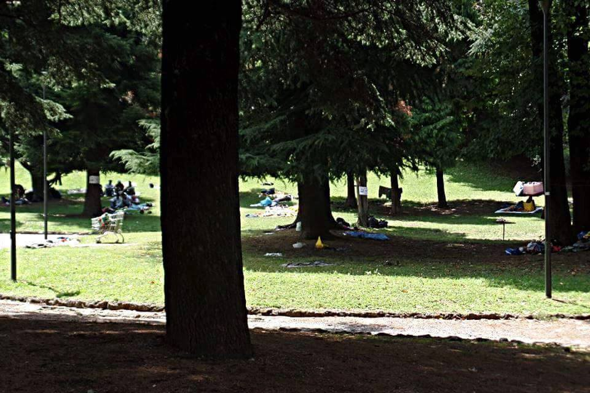
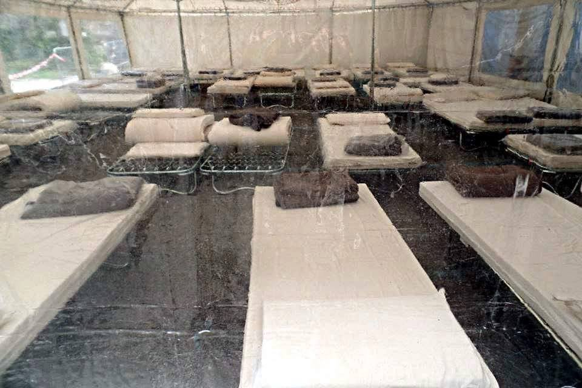

### AYS SPECIAL: Situation of refugees in northern Italy

_AYS team gathered information about situation of refugees in Italy, northern part\. We looked into situation in Como and Milano\. Help is needed in both areas and volunteers are urged to contact team in the field\._

Up to 250 refugees are sleeping out in open in Como\. Photo credit Henry Cyrenius
### Como

Since Switzerland tightened its border controls and implemented the Dublin agreement strictly, there was the fear that a new Idomeni could develop in border towns\. But beforehand: The border is not closed\. Refugees who arrive by train and do not ask for asylum are being pushed back as well as refugees who try to enter the country on another way and get caught\.

One of the border towns is Como, which is located next to Chiasso\. Up to 250 refugees sleep there on blankets in a park right next to the train station\. Most of them don’t stay longer than one week: While every day some 50 refugees arrive in Como, the same number makes it across the border or moves to another place\. Coherently the number of refugees in Como is stable, the turnover high\.

Caritas Como is offering a shelter, which can host around 50 people on an interim basis\. They have access to bathroom facilities and are being fed\. Most of the refugees in Como come from Eritrea, Ethiopia and Somalia, in addition there are people from Egypt, Morocco, Syria and western Africa\. According to Caritas about 35 percent of the refugees are children \(under 18\) \.

On daytime most of the refugees are not in Como, because in the morning they take the train and hope to cross Switzerland in order to get to Germany, England, the Scandinavian or the Benelux countries\. The ones being pushed back go to Como, Taranto, Rom, Milan and other camps all over Italy\. Red Cross is advising the refugees to go to Milan and take trains, which don’t cross Switzerland or Austria \(so basically France\) \. But Caritas Como reports, that the situation in Ventimiglia, close to the Italian\-French border, is almost the same as in Como since France strenghtened border controls too\. According to Caritas a lot of refugees are being picked up on their way from Milao to Como in Monza\. To avoid this, they leave before Monza and go by foot to the station after Monza\.

> To apply for asylum in Italy or to attend the relocation program, refugees who remain in the Lombardy have to go to Milano, Brescia or Monza\. Caritas is supporting them financially and with legal advice\. Italy is offering refugees an arrival shelter at the CAS \(Centri di Accoglienza Straordinaria\) \. These facilities receive 35 Euros a day by the government, of which the refugees get 2,5 Euro as pocket money\. Further they get a prepaid sim\-card which is charged with 15 Euro\. The rest of the money is meant for clothing, accomodation, documents, papers and other beuracratic processes\. If they refugees decide to decline this offer and continue their way and come back, they lose their right to this support\. 

Caritas and Red Cross distribute food to the refugees in the morning and evening\. For dinner a bus is transferring them to a mensa, where they get — according to Caritas — a well balanced catering\. If interested, refugees have the opportunity to visit language courses for free, arbitrated by Caritas\. Since about two weeks the NGO Firdaus \(arabic for „paradise“\) comes from Ticino and serves some 150 meals and NFIs

Refugees can use the toilets at the train station for free and charge their cell phone in the station for free\. Further Red Cross set up a tent with 32 beds und access to two toilets and one shower\. But most of them prefer to stay in the park, where is a standpipe with drinkable water, where they can wash their clothes, too\.

RC tent with 32 beds for refugees in Como\. Photo credit Henry Cyrenius

Red Cross is offering medical aid, financially supported by the town\. Firdaus reports, that a lot of refugees are afraid of going to the hospital, because they fear they will be registered and be stopped on their further way\. From time to time volunteers come, to distribute supplies or to help with food distribution\.

By now only Caritas, Red Cross, Firdaus and a few volunteers are onsite\. But the situation seems to be under control\. The atmosphere among the refugees is rather relaxed\. Caritas reports they need more food and especially underwear\.

_Volunteers are being advised to contact the Red Cross in Como, to distribute the goods orderly\._
### Milano

At the moment, there are some 3000 refugees in Milano, most of them stay in CAS or SPRAR\. SPARs \(Sistema di Protezione per Richiedenti Asilo e Rifugiati\) have strict stipulations and have space for around 22\.000 refugees all over Italy\. Becaus this is not enough, government is trying to change CAS\-facilities to SPRARS\.

Around the main station, 100 to 250 refugees are sleeping outside\. The station itself is closed during the night\. Most of the refugees have only a small or no change to get asylum\.

In Milano there is a migration hub, runned by Progetto Arca\. They are coordinating charities\. Refugees there have access to medical aid, food, wifi, access to information and children care\. If refugees arrive at night, they can offer 70 sleeping spaces, but actually around 120 people sleep there at the moment\. Further the hub is the registration point for refugees in Milano\. Refugees are free, to continue their journey, but are being advised to go to camps\. While during the last years 90 to 95 percent of the refugees decided to continue to another country, nowadays only 20 percent leave Italy\. The others are asking for asylum there\. It’s possible to ask in CAS for relocation or family reunion etc\. But only a few refugees participate at the relocation program\.

Legal support refugees get in CAS and SPRARs, where they get psychological support as well\. Meanwhile a network of Progetto Arca, police and shop owners developed, that they give the refugees the address of Progetto Arca to refugees, so they can find it\.

In Milano volunteers \(mainly locals of Milano\), or Save the Children, Terre des Hommes, AVSI \(they provide the rooms\), L’Albero della Vita, and Red Cross collaborate\) \. Progetto Arca currently employs some 320 persons\. A special standing has the Communitate Sant Egidio, a Catholic association leading the program Corredores Humanitarios\. With this program they are providing refugees the journey from their country of origin directly to Italia, without crossing the dangerous mediterranean sea with a vessel\.

In general, Italy handles the situation mostly on a municipal level, there is almost no national network\. „Global Shapers“ try at the moment to implement such a network\.

_Current needs in Milano are: hygiene items, towels, children and baby clothes, and shoes\._

_Long\-term volunteers are welcome in Milano, but should get in contact with Progetta Arca first, as well as aid convoys\._

\(Thanks to [Rigardu](https://www.facebook.com/rigardu/) for their help with this special report\)

_Converted [Medium Post](https://medium.com/are-you-syrious/ays-special-situation-of-refugees-in-northern-italy-c5701864a3a4) by [ZMediumToMarkdown](https://github.com/ZhgChgLi/ZMediumToMarkdown)._
