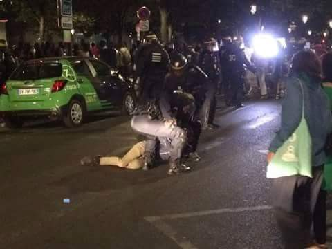

### AYS Daily News Digest 02/08: How the EU monopolization of the ‘legitimate means of movement’ is massively killing refugees

> Global armed conflicts becoming more deadly: statistics from Iraq and Syria\. Refugees in Greece: “We Did Not Expect to Live This Life in Europe\.” Refugees protest against the potential of being stuck in Greece for another two years by attacking the UN cabins\. Belgrade citizens, meet refugees living in your city\. Police attacking refugees and volunteers in Paris\. What to consider if you are thinking about housing a refugee family\. 

“Where are you from?” “Aleppo\.” 300,000 civilians still remain under siege in Aleppo\. I met this little boy in Serbia at a refugee shelter\. His family managed to get out of Aleppo over a year ago\. Credits: Nima
#### Iraq
### UN says 1,690 Iraqi civilian casualties in July alone

Last month, a total of 629 Iraqi civilians were killed and 1,061 were injured in acts of terrorism and armed conflict in Iraq, excluding active conflict zones in Anbar province\.

The most heavy\-hit area was Baghdad with 513 civilians killed and 887 injured\.

Another 130 members of the Iraqi military, including Peshmerga and allied militias, were killed and 146 were injured, [according](http://reliefweb.int/report/iraq/un-casualty-figures-iraq-month-july-2016-enar) to the United Nations Assistance Mission for Iraq \[UNAMI\] \.

“The number of casualties as a result of terrorism, violence and conflict in Iraq continues to remain high,” Special Representative of the UN Secretary\-General for Iraq \[SRSG\], Jan Kubis said\.

“We continue to deplore this unacceptable situation and look forward to the day, hopefully soon, when peace and tranquillity will return to Iraq\.”

Daily casualties in Iraq can be tracked through the [Iraq Body Count\.](https://www.iraqbodycount.org/database/recent/)
#### Syria
### Syrian child actor, Qusai Abtini, killed as he tried to escape Aleppo during the most recent shelling of the city

Qusai Abtini, a 14\-year\-old boy who played a role in the first television comedy produced in rebel\-held parts of Syria, was killed when a missile struck a car he was in as he tried to escape the city of Aleppo\.

Abtini was 10 years old when protests first erupted against the rule of President Bashar Assad in 2011, and took part in the demonstrations, often sitting on his older brother’s shoulders\.

He spoke in opposition videos, criticising Assad’s government and describing Aleppo’s destruction\. At the same time, he took part in school plays\.
### Dozens ill after suspected chlorine attack

More than two dozen people have been injured in a suspected chemical attack on a town in northern Syria, a doctor who treated the victims and aid workers said\.

The attack, using a gas cylinder laced with chlorine, targeted the town of Saraqeb in Idlib province, which is under opposition control\.

It came almost exactly a year after the UN security council [adopted a resolution](http://www.un.org/press/en/2015/sc12001.doc.htm) that set a 12 month\-deadline to identify the perpetrators of chlorine attacks in Syria\. The deadline expires next week\.

Ibrahim al\-Assaad, a doctor who treated the victims, said none of the 29 injured he saw exhibited physical wounds\. “All of them had breathing and lung problems, spanning mild, moderate and severe symptoms, while coughing and having bloodshot eyes,” he said\. “They smelled of chlorine, and the civil defence workers who rescued them said the site of the attack also smelled strongly of chlorine\.”
### Aleppo children continue burning tires and covering the city with black smoke to prevent airstrikes

](assets/786aa74a80cb/1*CgNozRhdLHG9R6RwWt1VYg.jpeg)

Credits: [Archicivilians](https://twitter.com/archicivilians/status/760536861576204292)
### Free Aleppo messages of love

‘To those who stand in solidarity with us, we love you, please keep going’
#### Greece
### Athens Mayor Calls on Gov’t to Empty Squats Used for Housing Migrants

Athens Mayor [Giorgos Kaminis](http://greece.greekreporter.com/tag/giorgos-kaminis/) sent a letter to Citizen Protection and Migration Policy Ministers Nikos Toskas and Yannis Mouzalas asking for the evacuation of squats used for migrant accommodation\.

In the letter, that was also forwarded to Prime Minister Alexis Tsipras, the mayor complains about the growing phenomenon of so\-called solidarity groups occupying vacant public and private buildings and house [migrants and refugees](http://greece.greekreporter.com/tag/migrants/) \. The mayor asks for the migrants to be taken out and transferred to official migrant hospitality structures\.

The mayor argues that even though many stranded migrants live in bad conditions in makeshift camps such as in the former Athens airport at Elliniko, this “does not legitimize anyone occupying arbitrarily public or private buildings to house those persons, including families with young children, in conditions as poor or worse\.”

Kaminis mentions the example of the former high school in Neapolis that has been occupied since March and houses 300 refugees and migrants, and the same situation exists in many other buildings, particularly in the [Exarchia](http://greece.greekreporter.com/tag/exarchia/) neighborhood\.

Area residents have repeatedly complained about poor living conditions in the occupied areas, and the health risks they pose both to guests and neighbors\.

Kaminis says he expresses the opinion of the vast majority of Athens citizens and requests the transfer of refugees from the occupied buildings in organized hospitality structures, “in order to ensure the best possible living conditions for visitors and protect the basic rights of local residents\.”

Closing his letter, the mayor states that the Municipality of Athens is committed to accommodating many of the migrants in proper facilities, while the state must assume its responsibilities and ensure the best possible living conditions in the refugee camps\.
### Agios Andreas camp residents living in deplorable conditions

The living conditions at Agios Andreas are catastrophic and residents report big gaps in the basic services provision: the food is bad, not enough clothes are distributed, \(still\) no drinking water available on site, insufficient hygiene facilities, lack of health facilities, inadequate shelters \(see picture\), no access to transport \(for hospital visits\) and people are suffering more and more frequently from psychological problems
### Refugees in Nea Kavala clash with the UN for the latter’s lack of care and inefficiency

Refugees attacked the UN caravans \(cabins \) after, according to one volunteer and one resident of the camp, the UN told them that no refugees will be allowed to get out of Greece within, at least, the next 2 years\. UNHCR staff in Nea Kavala denies making such a statement, and says it is a complete rumor\.

Refugees\.tv has made similar statements, but says it is the asylum office that will not issue papers before June of 2017, causing refugees to destroy their premises\.

Photo by refugees\.tv

Refugees are threatening to burn tents and walk to the borders\. One refugee injured himself severely while attacking the Praxis container\. He was hospitalized\.

The demonstration is led by Arab and Kurdish refugees, while Yezidis seem reluctant to leave\. “They are threatening us by burning our tents if we did not get out with them\. We are forced to get out with them if they get out of the camp”

All the organizations that were aiding the camp left\. Refugees also are getting ready to get out of the camp\.

Coordinators have expressed worries about these events:
“Things are getting out of control in camps and this will only fuel groups in other camps\. Honestly, things are getting worse day by day\.”

[Here’s a video](https://www.youtube.com/watch?v=IXaAVI87o0M&feature=youtu.be) we received from Frances Penfold of the recent protests:
### Two boats with, overall, 47 refugees landed on Lesvos

One boat in Turkish waters heading to the south of Lesvos was pushed back to Turkey by Turkish Coast Guard\.

One boat with 16 people was brought into Skala Sikamineas harbor by Frontex\.

One boat with 31 people spotted north east of Korakas was picked up by Norwegian Frontex and brought into Mytilene harbor\.

One speedboat with smuggler on board dropped people off somewhere in the south\. The smuggler was caught by Swedish Frontex\. Refugees have not been found yet\.
### Two boats with, overall, 55 refugees landed on Chios

The first boar landed near Souada camp\. The other one was picked up by Oinassus\.
### Aid workers accused of trying to convert Muslim refugees at Lesbos camp

Christians working in Greece’s most notorious asylum detention centre have tried to convert some of the Muslim detainees, who have been held under the terms of the EU\-Turkey migration deal\.

On at least two occasions in recent months, aid workers have distributed conversion forms inside copies of Arabic versions of the St John’s gospel to people held at the Moria detention camp on Lesbos\.

The forms, seen by the Guardian, invite asylum seekers to sign a statement declaring the following: “I know I’m a sinner … I ask Jesus to forgive my sins and grant me eternal life\. My desire is to love and obey his word\.”

Muslim asylum seekers who received the booklet said they found the aid workers’ intervention insensitive\.
#### Serbia
### A photographer, Nima Yaghmaei, tells the stories of Belgrade refugees

> Grandpa left behind 

> _“I was with my family, and the grandchildren\. I’m old, so I was slower than the rest, and the kids needed to get to somewhere safe\._ 

> _So on the trip when we started to cross borders by foot I had to be left behind\. The whole family has made it to Germany now, but I’m still stuck on the way\. But god willing I will make it, and see them all again soon\.”_ 

> _I met this Afghan grandfather who was sleeping on the street in Belgrade, Serbia\. Despite his hardship, he had a big grin on his face, and he spoke with me in the warmest manner\. A grandfather at heart\._ 

Grandpa left behind\. Credits: Nima

> A refugee baby attacked by mosquitoes 

> The face of Afghan baby after spending the night sleeping in the street\. Mosquito were rampant, and in the abandoned warehouses of Belgrade, there isn’t much protection from outside elements\. 

A refugee baby attacked by mosquitoes\. Credits: Nima

> An Afghan boy traveling alone through Europe 

> “I’m 12 years old\. Things were dangerous, my family gave me some money and said run to Europe\. 

> It was dangerous\. I got shot at when I was crossing the Iranian border\.” 

An Afghan boy traveling alone through Europe\. Credits: Nima

The feet of the Afghan boy who tried to walk 200km to cross the Hungarian border, only to end up being beaten back by police\. Credits: Nima

> Travelling to join the father 

> “We’re more than ten people, all family, from three generations\. The smallest baby has never seen his father, hopefully soon in Germany\.” 

Travelling to join the father\. Credits: Nima

> Born on the road to Europe 

> Tonight this 6 month old baby and her mother, as well as dozens of other Afghan women and children are sleeping in the abandoned warehouses of Belgrade\. 

> Thankfully for these two, it is their last night\. Thanks to funds previously provided, the cost of their transport to a refugee camp with tents is covered for tomorrow morning\. 

Born on the road to Europe\. Credits: Nima

> Homeless in Greece 

> “I drove trucks for NATO\. From Kabul to Kandahar we would drive with the oil tankers\. The job was really dangerous, soon after leaving Kabul we would come under heavy fire from the surrounding villages if they were controlled by the Taliban\. 

> Once my third truck had exploded, I thought that is enough, and I left\. I wish I had applied legally in Afghanistan, but here I am now\. 

> I didn’t think my life would look like this at 37 years old\.” 

Homeless in Greece\. Credits: Nima
#### France
### Police attacking refugees and volunteers in Paris

Two nights ago, 17 people got injured in Paris, both refugees and volunteers, after riot cops charged at them, hitting them with their fists, batons and shields\. Five of the attacked refugees and volunteers were hospitalized\.

Many refugees are forced to sleep in the streets, and this has now became even more dangerous as police started to violently prevent them from congregating in one place\.

Police beatings at the Avenue of Flanders\. Credits: **Danica Jurisic**
### Calais Kitchen is in urgent need of donations, they are running out of money for food

About 50 new refugees arrive to Calais on a daily basis\. This means that the need for food is going up, and this amazing organization is trying hard to meet that need\. Please support them in this work\!

[A video of Calais Kitchen](https://www.facebook.com/calaiskitchens/videos/1396885986995434/) heroes:

#### UK
### The Home Office has won its appeal against a landmark ruling allowing four Syrian refugees living in the main camp in Calais to come to the UK

An immigration judge ruled earlier this year that the three teenagers, and a 26\-year\-old man, should be [immediately brought to Britain](https://www.theguardian.com/uk-news/2016/jan/20/four-syrian-refugees-must-brought-calais-camp-britain-judges-rule) and reunited with their families\.

Lawyers for the refugees had argued that the group faced intolerable conditions in the camp and their right to a family life under article 8 of the 1998 [Human Rights Act](https://www.theguardian.com/law/human-rights-act) would be upheld by allowing them to come to the UK\.

The four Syrians were brought to Britain and the decision was hailed by campaigners as a landmark ruling that [could pave the way](https://www.theguardian.com/uk-news/2016/jan/29/allowing-four-syrian-refugees-into-uk-may-set-limited-precedent) for many other unaccompanied minors to come to the UK from refugee camps in Europe\.

But three court of appeal judges decided in favour of the Home Office on Tuesday\.

Under a law called the Dublin Regulation, asylum claims must be made in the first country the person reaches, but a child refugee can have their claim transferred to another country if they have relatives lawfully living there\.

Lawyers for the four in this case had argued that the regulation was not working as not a single child had been brought to the UK from the Calais camp under the rule before the case had been brought\.

They also argued that it would take up to a year for them to be brought to Britain under the regulation because of bureaucratic failings in [France](https://www.theguardian.com/world/france) \.

Handing down their judgment, court of appeal judges Lord Justice Moore\-Bick, Lord Justice Longmore and Lord Justice Beatson ruled in favour of the Home Office appeal\. However, as the four have already been brought to the UK they will not face deportation\.

The judges said they “allowed” the Home Office’s appeal in the case\. The ruling stated that bypassing the Dublin III Regulation “can only be justified in an especially compelling case”\.
#### Italy
### 8,300 migrants rescued in five days

Some 1,800 migrants were rescued from waters off Libya on Monday, lifting the total picked up to 8,300 over five days, according to the Italian coastguard which coordinated the operations\.

Vessels from the coastguard, the Italian navy, humanitarian organisations and EU anti\-trafficking operation Sophia were involved in 16 operations to save people from 14 inflatable dinghies and two small wooden boats\.

The latest rescues will lift to over 94,000 the number of migrants brought to Italian ports this year, roughly in line with the pattern of 2015, according to Flavio Di Giacomo, a spokesman for the International Organization for Migration \(IOM\) \.
#### General
### Information for volunteers who are providing or are hoping to provide accommodation for refugees

This [document](https://lookaside.fbsbx.com/file/PROVIDING%20HOUSING%20FOR%20REFUGEES%201%20August%202016.pdf?token=AWwlLtUXOF_oGcg-ER6wAw5Ycu1WllZGhBdXxKLxTvhFCqGqqQRUaq4XT_pKktPG7245c_QVPhxRWFeBc8BMk6g6sxf9noYLW3QMwgBDfsMFshCyOFNTeqJ1KzXWkPH748h-Nt6jkHPM_HJCuSe-yZUplUrBEKmr3GPrDj60B6BJmyFj1b6oxttBCU3lfSm2qBE) contains a set of guidance notes highlights some of the issues that have occurred in volunteers attempts to house refugees\. Thereafter, it provides hints and tips for volunteer\-based future management of refugee housing needs\.
### **Refugee Deaths** at Sea: Numbers

The 2016 coming to be the deadliest year so far\. It is important to look at how European policies impacted the refugees’ **death** rate: governments keep killing refugees massively by denying them a safe passage to claim asylum in Europe\.

_Converted [Medium Post](https://areyousyrious.medium.com/ays-daily-news-digest-02-08-how-the-eu-monopolization-of-the-legitimate-means-of-movement-is-786aa74a80cb) by [ZMediumToMarkdown](https://github.com/ZhgChgLi/ZMediumToMarkdown)._
