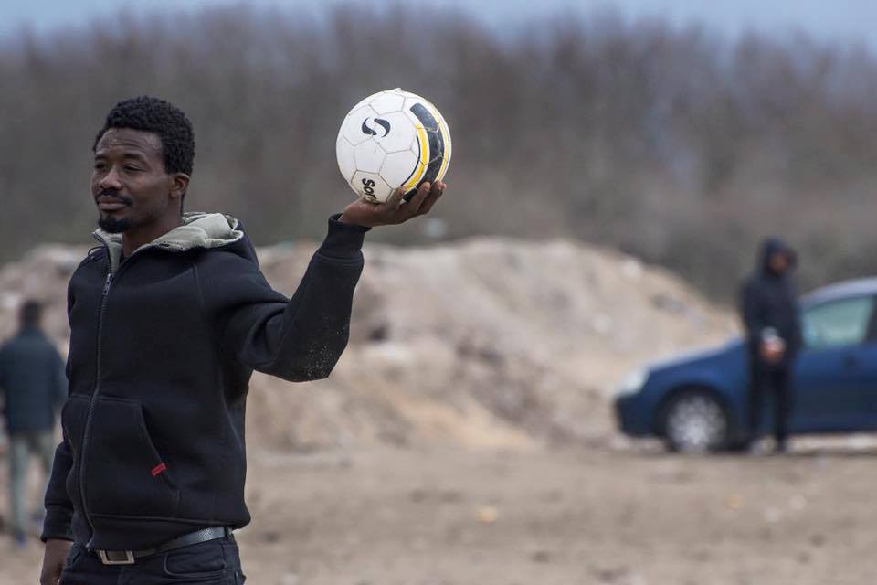

### AYS Daily News Digest 03/08: Yazidis, feeling unsafe, decide to leave Nea Kavala camp

Serbia — Photo by Nima

_In today’s digest: Yazidis are feeling unsafe and decide to leave the Nea Kavala camp, saying they are persistently threatened by other refugees\. Today also marks the second anniversary of the Yazidi genocide\. New projects are being created, as volunteers adapt to military camps\. Calais still needs help, of course\. Legal aid remains one of the main issues for refugees, but online projects emerge to support legal professionals in their tasks\._
#### Syria
### Over 150 airstrikes in Aleppo

Residents of Aleppo report over 150 airstrikes and long range missile strikes since this morning, all targeting the besieged eastern half of Aleppo\. The Syrian Observatory for Human Rights says that 40 civilians died “since the attack began and until Tuesday midnight”, among them 22 children\.
#### EU
### Future of the EU\-Turkey Deal

[The Pressproject](http://www.thepressproject.gr/article/98734/United-Nations-High-Commission-for-Refugees-The-EU-Turkey-Agreement-is-De-Facto-On-Hold) reports the head of the UNHCR Europe office Vincent Cochete says the EU\-Turkey agreement is “de\-facto on hold, since there are no negotiators \(on the Turkish side\) any more\. Since the coup the Turkish officers who operated as mediators have returned to their countries and, therefore, relocations have stopped\. At the same time the coup attempt has created complications as to the achievement of several goals \(as these were set\) in the March 18 agreement”\.

Meanwhile, Greek Immigration Minister says Europe “needs a Plan B” in case Turkey reneges on its deal with the EU\.

Turkey insists on visa\-free travel for its citizen by October, with Turkish Foreign Minister hinting that it could otherwise stop the agreement, while EU politicians, including German Foreign Minister Frank\-Walter Steinmeier, insist the country has not yet met the conditions for the visa\-free policy\.
### Relocation programme operating at a slow pace

Out of 66,400 people who are to be relocated from Greece to other EU countries, only 2,681 have been relocated so far\. For the head of the UNHCR Europe office Vincent Cochete, this is due both to problems in the registration of asylum requests in Greece and to the reluctance of EU countries who “even before the terrorist attacks, did not offer to accept refugees”\.

This comes after Czech President Milos Zeman, urged the Czech parliament on Tuesday to ignore EU quotas and take no refugees\. German EU commissioner Guenther Oettinger has rejected those comments, saying “the refugee quota has been approved by a large majority and is European law”, adding that Zeman’s comments weaken Europe as a whole\.

**Greece**
### Yazidis, feeling unsafe, decide to leave Nea Kavala camp

After yesterday’s protests in Nea Kavala, the Yazidi population of the camp has decided to leave collectively, saying they have been persistently threatened by other refugees and feel like it is unsafe for them to remain there\.

Around 430 people left the camp this morning and have remained in a field near the camp the entire day\.

Photo by Anna Norona

Photo by Anna Norona

Many Yazidi families are living on the streets of Thessaloniki, and the minority has faced persecution and discrimination throughout Greek refugee camps\. Similar incidents have already taken place in Cherso and Leros\.
### Anniversary of the Yazidi genocide

Today marks the second anniversary of the attack on Sinjar by ISIL, during which 5,000 Yazidis were murdered, forcing more than 50,000 to flee\. Today, the United Nations believes 3,200 women and children are held by the so called Islamic State and used as sexual slaves, while thousands of Yazidi men are still missing\. Yazidi boys are also being indoctrinated to fight for the same group that murdered their families\.

](assets/b33f7104726a/0*Fqjv93gJNuhCiieX.)

Photo by [SIRIUS\.HELP](https://www.facebook.com/sirius.help/)
### 3,691 refugees return home

[Ekathimerini](http://www.ekathimerini.com/210960/article/ekathimerini/news/thousands-of-migrants-return-home-through-iom-program) reports 3,691 refugees have returned home in 2016 within the framework of an assisted voluntary return and reintegration program by the IOM\. The majority of those who returned were Afghans, followed by Iraqis and Iranians, despite the dangers they could face in their home countries and their legitimate claims to asylum\.
### New projects emerge as volunteers adapt to military camps

More than two months passed since the Idomeni camp closed\. Volunteers have been building up new projects since then, trying to adapt to the new circumstances and to the cooperation with military officials\. Several projects have simply decided to completely bypass bureaucratic issues, by building up their own projects outside military camps\.

[**Eko Project**](https://www.facebook.com/ComunitatEKO/) **for example is renting a field next to the Vasilika camp,** as a way to rebuild the infrastructure that was present at the informal Eko station\. They will be able to start projects for and with refugees, without having to face bureaucratic hurdles\. The projects include the construction of a school, playroom, cinema, community kitchen and tea area, as well as a space for mothers and children\.

**The association “Soups and Socks” is also adapting to the current situation** , after their last project, the “Habibi Kitchen” in the Katsikas camp was closed by the military\. The group is planning to rent a warehouse next to the camp, where they will build a workshop, allowing people to repair and build everyday objects\.

The [habibi\.works](http://www.habibi.works/) website meanwhile is supposed to give refugees the chance to create and sell their own handmade items\. You can contact them on their website [_www\.soupandsocks\.eu_](http://www.soupandsocks.eu) if you want to help\.

**Finally, the [Welcommon project](http://anemosananeosis.gr/en/main-page-en-2/) in Athens, is planning to host 250 refugees in 50 rooms** in a private building starting September\. It is looking for volunteers from the 1st of August to end of August to prepare the building and for volunteers from September to end of 2016 to participate in the operation of Welcommon\.

> Of course, volunteers are still needed throughout Greece\. 38 volunteering opportunities are currently posted on [http://www\.greecevol\.info/](http://www.greecevol.info/) \. 

### HSA needs donations for Agios Andreas

The Humanitarian Support Agency \(HSA\) has been appointed to support site management at the Emergency Reception Site Agios Andreas\. They plan to create a community tea point and set\-up non\-formal education activities\. HSA reports on catastrophic conditions at the camp, with bad food and lack of clothes, lack of health facilities, inadequate shelter and many more issues\.

[Their list of needed items](https://lookaside.fbsbx.com/file/Emergency%20list%20for%20Agios%20Andreas%20camp.pdf?token=AWy0dmA45rzAzqqAJjmdOOean32ZQ6BcixD0cy092vlTDIClulevsuIVb09kUgjpNZoGeW8QRpzE0Bjp27fXAzPSGJCLbFtwOtz8dlJzimA_rTftCEW5QmWGKpuhA-QoJ5KJgP-cbfx7pr35pWcHb7ws) includes electric stoves, t\-shirts, hygiene kits and much more\. You can donate [here](http://humanitarian-support-agency.org/donate/) \.
### American fundraiser for Sindos camp

The Welcome Foundation, Americans for Refugees in Crisis and the Rahma Relief Foundation are launching a fundraiser for the Sindos camp, called Adopt\-a\-Tent, where donors will provide a pair of sneakers and either a pair of jeans or long skirt with leggings to each person in a single tent \(between two to seven people\) \. A container will be leaving the Detroit area for Greece end of August\.

Donations can be made to [http://www\.welcomefoundation\.org](http://www.welcomefoundation.org;) , [https://americansforrefugees\.org/donate/](https://americansforrefugees.org/donate/) and http://www\.rahmarelief\.org

Watermelon distribution thanks to Welcome Foundation, Americans for Refugees in Crisis and the Rahma Relief Foundation\. Photos provided by Ribhi Hazin
### Change of Skype Schedule

As the pre\-registration exercice ends, refugees who did not have the opportunity to pre\-register can do so by falling back on the good old Skype call to the Asylum Office\. The Greek Asylum Office says things should be smoother than during the times of Idomeni, since the majority of potential applicants have already registered\. Refucomm however reports that the Skype schedule will change on the 8th of August\. You can check out the schedule [here](https://www.facebook.com/notes/refucomm-communication-and-information-for-refugees/greece-changes-to-skype-schedule-for-registration-from-8th-august-2016/297274227291053?hc_location=ufi) \.
#### Bulgaria
### Bulgarian police cracks down on refugees

[Novonite](http://www.novinite.com/articles/175741/Bulgarian+Police+Detain+65+Migrants+in+Sofia) reports 65 refugees have been detained by the police in Sofia in less than 24 hours\. [Novonite](http://www.novinite.com/articles/175745/People+Smuggling+Rings+via+Bulgaria+%27Increasingly+Active%27+-+IntMin) also quotes Bulgarian Interior Minister Rumyana Bachvarova, who warns of increased migrant smuggling activity through the country’s territory\. The paper notes that the number of migrant arrivals to Bulgaria is on the rise, while Serbia has approved the establishment of joint military and police teams that will be deployed at the borders with Bulgaria and Macedonia to control the inflow of migrants\.
#### France
### Calais population on the rise

Despite the partial eviction of the Calais camp, the population continues to increase, with Help Refugees believing the camp could reach 10,000 people by September\. Help is therefore needed more than ever— the evacuation has not diminished the camp’s population, but has created the illusion that the problem has been solved, leading to a drop in donations\.

[Calais Refugee Aid](https://www.facebook.com/CalaisRefugeeAid/) is just one of many organisations doing a great job in the camp\. They made 250 essential food parcels to be distributed to the camp residents this weekend, while large food crates, including 400 bottles of 2L water, were delivered directly to the family camp to avoid them the hassle of queuing up\. Food items were also distributed to the Belgium kitchen, while a fundraiser is being organised to allow a woman who has just given birth to spend some time in a hotel away from the camp\. If you want to help, you can of course contact them through their Facebook page\.

An essential resource, if you want to get an overview of the Calais jungle and how to help is [Calaidipedia](http://www.calaidipedia.co.uk/) — it will provide you with all the essential information on terms of volunteering and donation needs
### Equipment needed for football players

The Worldwide Tribe and Copa90 are planning a one\-day football tournament on the 10th of September in Dunkirk, “uniting people from all over the world, through the power of football”\. To start training, the teams need about 60 sets of Men’s ’s football boots, shin pads, shorts and t\-shirts\. If you have any spares, you can send them to:

Emily
Exmouth House
3–11 Pine Street
London
EC1R 0JH

Photos provided by the Worldwide Tribe

Photos provided by the Worldwide Tribe
### Legal support projects emerging online

The lack of legal aid remains one of the main issues for refugees throughout Europe\. Legal aid needs to done by qualified professionals, who will always be overwhelmed by the existing needs\. We have however found several online projects, meant to support lawyers and paralegals in their tasks\. We have listed some of these below and hope they prove useful\.

**Asylum Links EU** :

The group is looking to answer refugees’ questions on their Facebook page and direct people to services \(medical, legal and housing\) where they can get further support\. 
The group is currently looking for volunteers and says “no previous experience or particular language skill is necessary, just compassion and absolute confidentiality about the content you’ll interact with”\. If you are ready to volunteer, you can contact them via their [Facebook page](http://facebook.com/asylumlinkseu) \.

**Moderated List\-serv: Rights in Exile Mailing List**

This google group enables lawyers and paralegals to discuss refugee cases & urgent matters in which they need assistance, anonymously\. If you are asking a question about a case, remember not to reveal a name, although it is likely that nationality and the particularities of the law in the state you are dealing with will be relevant to any help or suggestions another lawyer may try to give you\.

In order to join Rights in Exile Refugee Assistance click here: [https://groups\.google\.com/forum/…](https://groups.google.com/forum/?nomobile=true#%21forum/rights-in-exile-refugee-assistance)

[**Asylos\.eu**](http://asylos.eu/)

This NGO describes itself as a “pan\-European volunteer network that finds vital information to help refugees fleeing war, violence, and persecution to claim their right to asylum\. Over the past five years, we have produced more than 250 research notes to support asylum claims”\. Lawyers can submit research requests that might substantiate asylum cases\. Volunteers and donations are always welcome\.

[**Advocates Abroad**](http://www.advocatesabroad.org/)

Our friends at Advocates Abroad are providing remote and on the ground legal assistance, in particular in Greece and Turkey\. The field teams in Greece are comprised of qualified EU and US attorneys, operating alongside local attorneys and volunteers\. Advocates Abroad is currently looking for volunteers for both its remote and field teams\.

_Converted [Medium Post](https://areyousyrious.medium.com/ays-3-8-yazidis-forced-to-leave-nea-kavala-camp-b33f7104726a) by [ZMediumToMarkdown](https://github.com/ZhgChgLi/ZMediumToMarkdown)._
