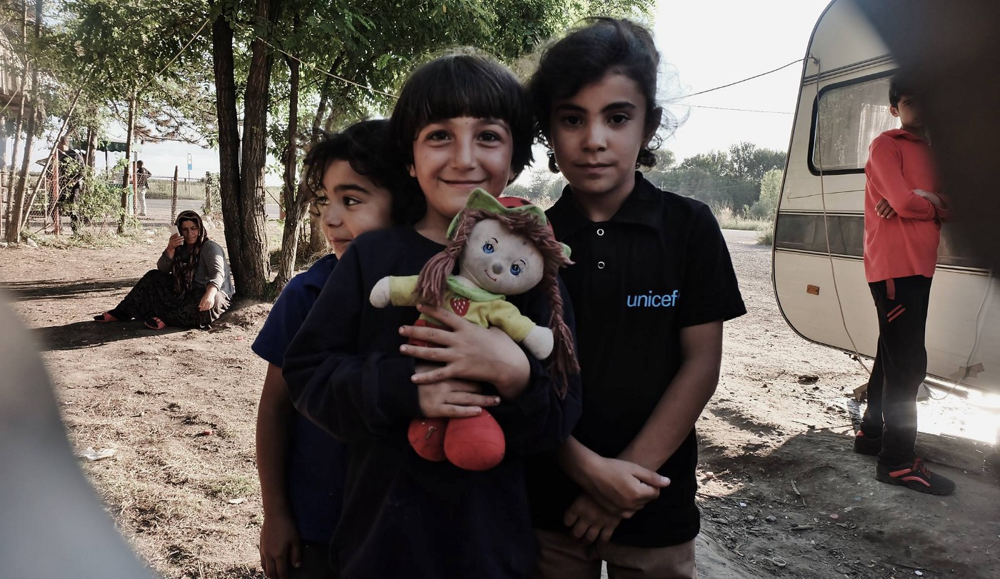
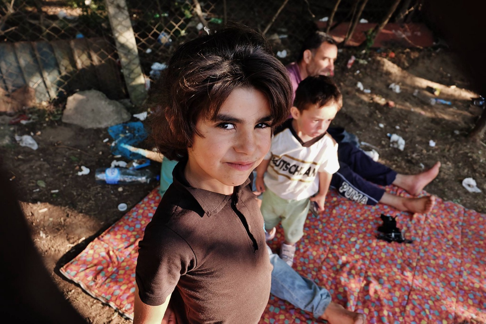
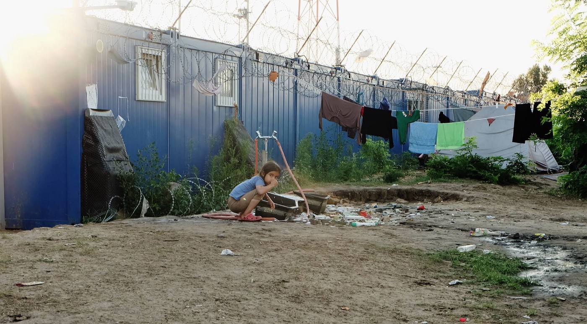
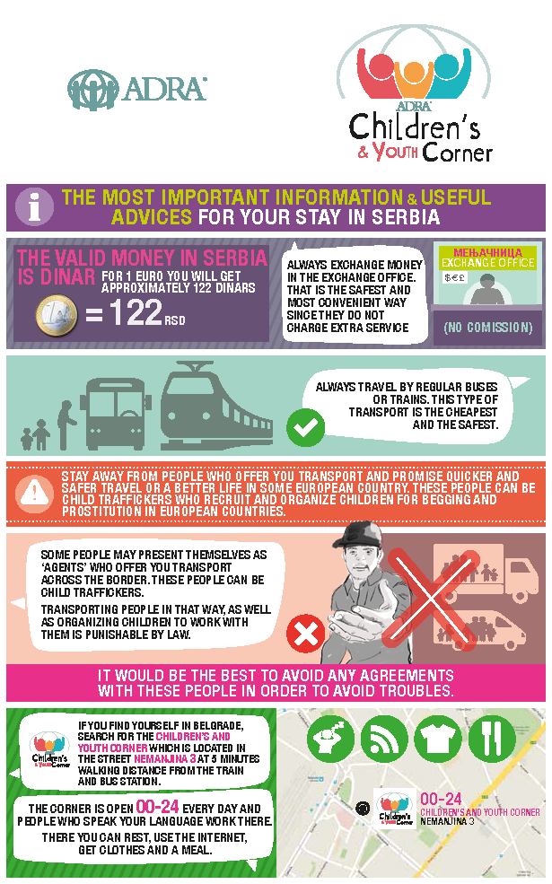
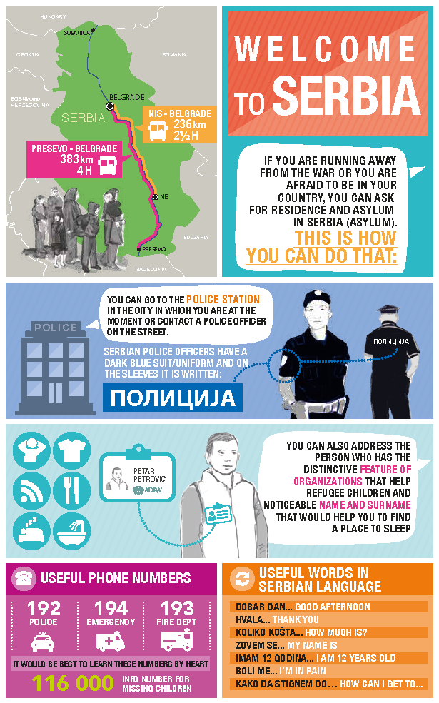
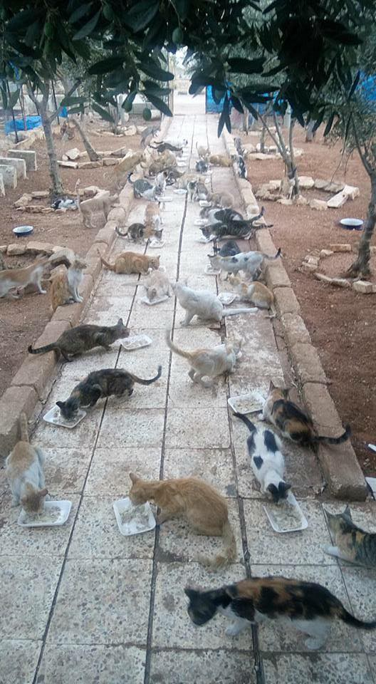
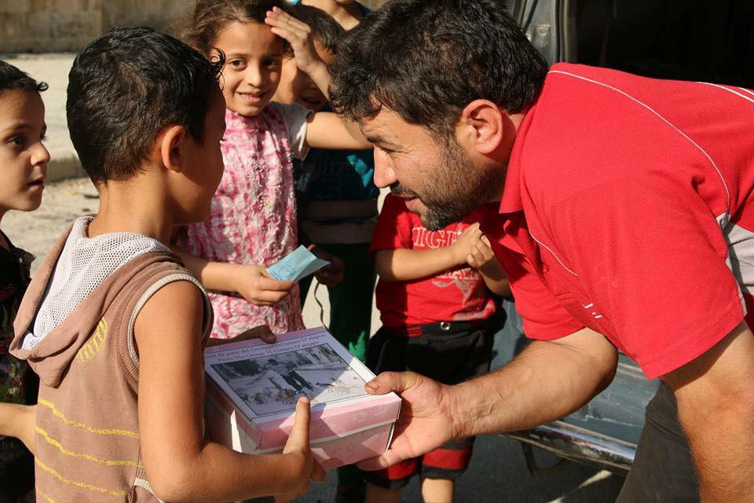
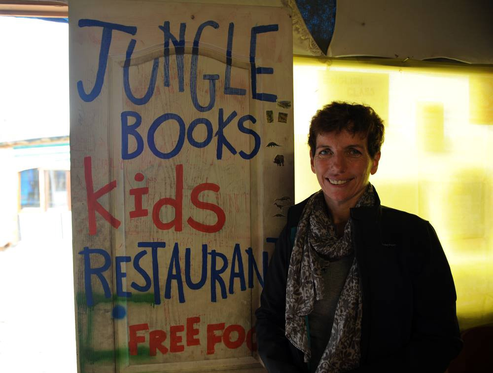
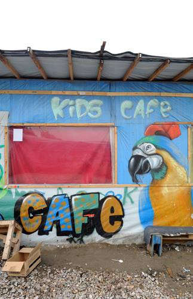
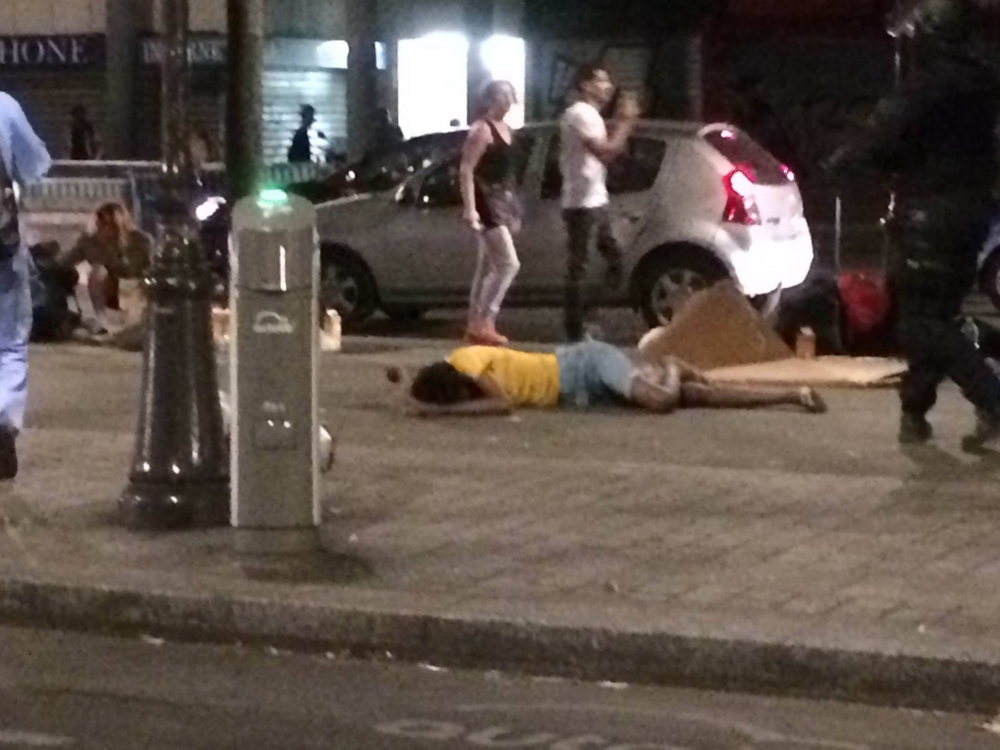

### AYS News Digest 4/8: Europe Let Me Down\.

_The EU and US reject UN refugee resettlement plan\. Syrian doctor to NPR: Don’t forget Madaya\. New Skype schedule in Greece\. Small fire near Sindos mostly contained\. Syrian cat\-lover and rescuer nominated for Nobel Peace Prize\. Refugee parents forced to offer their children grass to eat in Austria\. Children’s Learning Center to be closed in Calais\._

Photo Credit: Nima Yaghmaei Photography
### _SYRIA_
### Don’t forget Madaya, doctor implores\.

In an interview on NPR, Syrian American Medical Society’s Ammar Ghanem revisits the reality that Madaya is still cut off from basic supply chains, resulting in horrible starvation of the population\. Starvation has been repeatedly used as a weapon of warfare throughout the Syrian civil war\. Read the full interview [here](http://www.npr.org/2016/08/04/488637661/doctor-says-syrian-town-is-starving-for-food-medical-care) \.

Meanwhile, as the struggle to break the government siege on Aleppo continues, the government forces continue to gain ground\. Despite UN calls for hope in Syria, it is clear that the situation for civilians will remain dire\.

Photo Credit Nima Yaghmaei Photography
### GENERAL
### The EU and US have panned a proposed UN plan to resettle ten percent of the world’s refugee population annually\.

One out of one hundred people on earth are currently displaced, but the agreement which was presented on August 2nd was stripped of any meaningful decision allocating [responsibilities over portions of the refugee community\.](https://www.euractiv.com/section/global-europe/news/eu-us-reject-un-plan-to-resettle-refugees/) The timeline for adopting the accord has now shifted to 2018\.
### GREECE
Updated Skype schedule for refugees has been released\.

Although it is linked in Greek, the English translation will be posted as soon [as it becomes available](http://asylo.gov.gr/wp-content/uploads/2016/08/Skype_program_Greek_8_2016.pdf) \.

An important volunteer\-relevant update\. [**Thomaniku Alki**](https://www.facebook.com/thomanikuA) has announced that there is a potential way for NGOs and volunteers to secure a 30% discount on ferry ticketing with his help\. All interested are encouraged to contact him\.

News that Moves has a comprehensive guide to Assisted Voluntary Return from Greece\. IOM will assist qualifying individuals with executing their voluntary return from Greece\. Individuals are eligible if any of the following criteria are met:

> Their legal stay in Greece has expired 

> They no longer wish to remain in Greece \(includes refugees granted international protection\) 

> Their request for asylum is pending or has been rejected 

> They have voluntarily withdrawn their asylum application 

For more specific information, [please read here](https://newsthatmoves.org/en/assisted-voluntary-return-from-greece/) \.
### Islands

Due to the relocation of 300 to 400 refugees from Chios, sources from the Migration Ministry have said that around 1,000 individuals will be transferred from the islands\. Those to be transferred are refugees that have sought asylum who have completed the first part of the procedure\. They have not [left for Athens due to primarily financial reasons](http://greece.greekreporter.com/2016/08/03/greek-migration-ministry-1000-migrants-and-refugees-will-leave-from-the-aegean-islands/) \.

70 people were picked up south\-east of Lesvos\. Although four were taken to the hospital and two were initially missing, the result was good as those missing were found and the other four received medical care\.
### Athens

Alvio Dolores’s medical mission released a long update about the current situation in Athens\. There is nothing positive to report as terrible heat are taking a severe toll on all there\. The lack of medical staff has made coordinating medical care to independent and self\-organized camps very difficult; however regular trips to two squats have been organized by refugees themselves\.

> As ever we need support\. Medication, financial support but most importantly medical staff and doctors are sorely needed\. So please if you are a doctor,nurse or health worker who wants to support us or know anyone who is interested [please get in touch](https://www.facebook.com/aliviodolores/posts/209378599460421?hc_location=ufi) \. 

### Sindos/Thessaloniki

A fire broke out near Sindos camp, but fortunately it did not pose a threat\. The fire resulted from bushes near train tracks catching on fire in the terrific, dry Greek heat, but a crew of firefighters and several tankers have the fire mostly contained\.

There is an ongoing effort to provide support to Yezidi refugees who routinely face extraordinary discrimination at every point along the refugee route\. A fundraiser specifically to support them can be found [here](https://www.launchgood.com/project/help_yazidi_refugee_families#) \.
### Softex

Residents in Valisika camp collected over 200 liters of water for those in Softex after hearing word [that those in Softex were out of water](https://twitter.com/LaAnaIn) \. This story is a powerful reminder of the strength of those seeking asylum in Europe and the superiority of movements that celebrate and center this strength\.

Photo Credit: Nima Yaghmaei Photography
### SERBIA

ADRA Serbia has released a helpful series of info\-graphics for those transiting Serbia to refer to in order to preserve their safety and understand their options\. The infographics are available in multiple languages\. Below are those in English\. Follow [the link for the rest](https://www.facebook.com/ADRASerbia/photos/?tab=album&album_id=1834397953480899) \.

Photo credit: ADRA Srbija

In Kelebija, I’m Human Organization continues their activities\. Below is a video of some children’s activities\. They will be opening a learning center shortly\.

For a full update and to find ways to help out with these exciting projects, visit their [facebook page](https://www.facebook.com/imhumanIHO/posts/1083405085028851) \. IHO also reports that several non\-SIA refugees have been pushed back and rejected entry into Hungary\.
### MEDITERRANEAN

New initiatives to rescue people in the mediterranean\.

> The Minden is starting to her second SAR\-mission into the Mediterranean\.
 

> CADUS — redefine global solidarity and the owner of the ship LifeBoat are working together with Proactiva Open Arms and Atlantic Pacific InternationalRescue Boat Project to rescue refugees in distress\.
 

> The crew of the Minden could already help hundreds of people on their firstmission\. Cooperation with civil SAR\-teams like Sea\-Watch and JugendRettet e\.V\. is from high importance in terms of operations at sea\.
 

> You can see a small summary from our first mission in the video\. 

> To finance our further rescue\-missions we need your support: [https://www\.betterplace\.org/en/projects/35982](https://www.betterplace.org/en/projects/35982) 

> Find more infos and news at the Cadus fb\-page\. 

### ITALY
### A move to award the Nobel Peace Prize to rescuer and cat\-aficionado Mohammad Alaa Aljaleel has taken off\.

As his application was forwarded by the relevant authorities, the facebook page [**Nobel Peace Prize to Alaa**](https://www.facebook.com/Nobel-Peace-Prize-to-Alaa-1170344739694440/) has been growing, reflecting on the heroism of the so\-called “Cat Man of Aleppo\.” Alaa has long been involved with the rescue efforts in Aleppo and also runs an animal shelter where he and a few others tend to the needs of over 130 cats and several dogs\. The largest support for his efforts comes from an Italian\-based social media campaign Il gattaro D’aleppo\.

Photos courtesy of Il gattaro D’aleppo
### AUSTRIA
### Refugee parents forced to offer their children grass to eat\.

Aside from small\-scale volunteer efforts, many refugees in Austria have found themselves with no recourse or support structure after having been pushed back\. In a report written by a Children and Youth Services worker in Salzburg we learn that refugee families with small children are either on their way to Germany or have been pushed back from\. In some cases, they have reported that their money has been confiscated by police in order to “pay for their stay,” leaving them with no way to cover their costs\. The treatment of these families is horribly shameful\. Many of them either have not applied for asylum or have withdrawn their applications for asylum after having been told that they risk being deported back to Hungary\. More attention must be paid to this situation\.
### FRANCE

Photos courtesy of Calais Action
### Children’s learning center in Calais may be closed according to Calais Action\.

The Jungle Books Kids Cafe was stormed by police, recently, who informed the managers that all “businesses” inside of Calais will be required to close effective August 10th\. The closure is currently being contested, and those wishing to folow the story should follow the Calais Action page

Photos courtesy of Danica Jurisic
### Horrific news as several refugee squats were evicted recently, with the total number of refugees being around 1000\.

It was intended that they be taken to different camps around France, but when refugees and locals protested this decision in a protest, the police reacted with violence\. As a result, police are hunting down refugees sleeping in the streets\. Volunteers are requesting support for shelter, sleeping bags, medicine, hygiene items, and tents\.

_Converted [Medium Post](https://areyousyrious.medium.com/ays-news-digest-4-8-europe-let-me-down-ee5ad77a2725) by [ZMediumToMarkdown](https://github.com/ZhgChgLi/ZMediumToMarkdown)._
