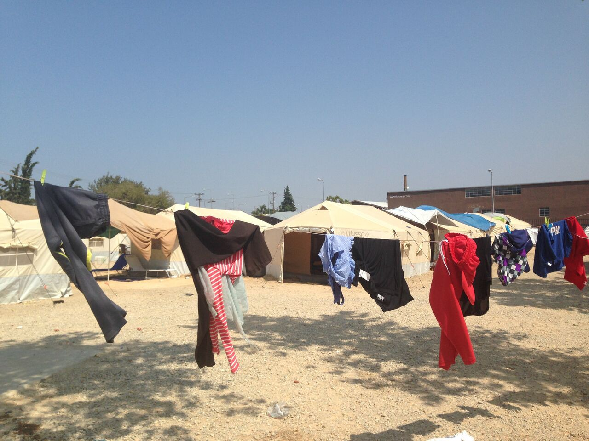
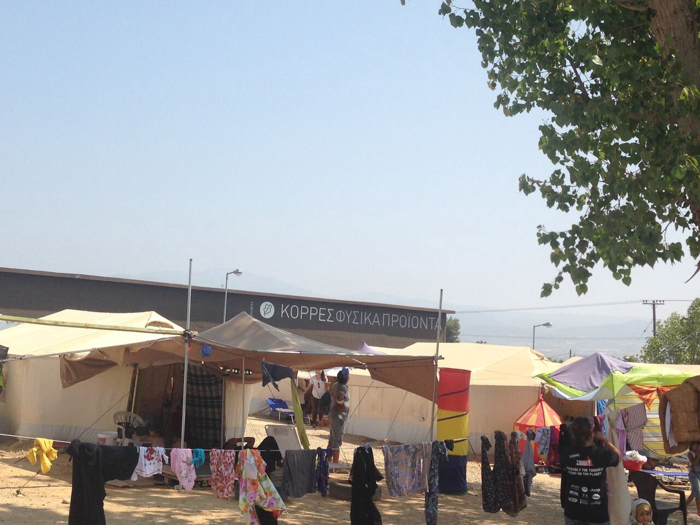
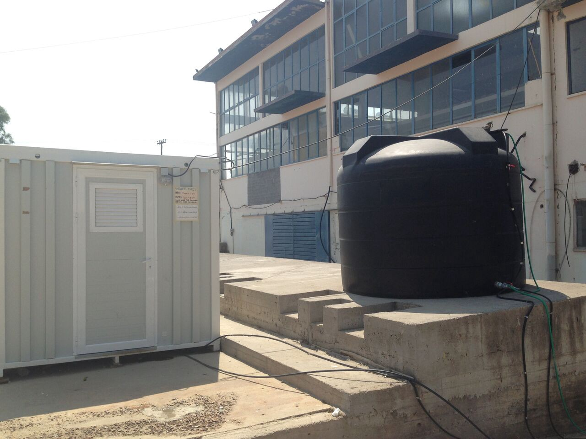
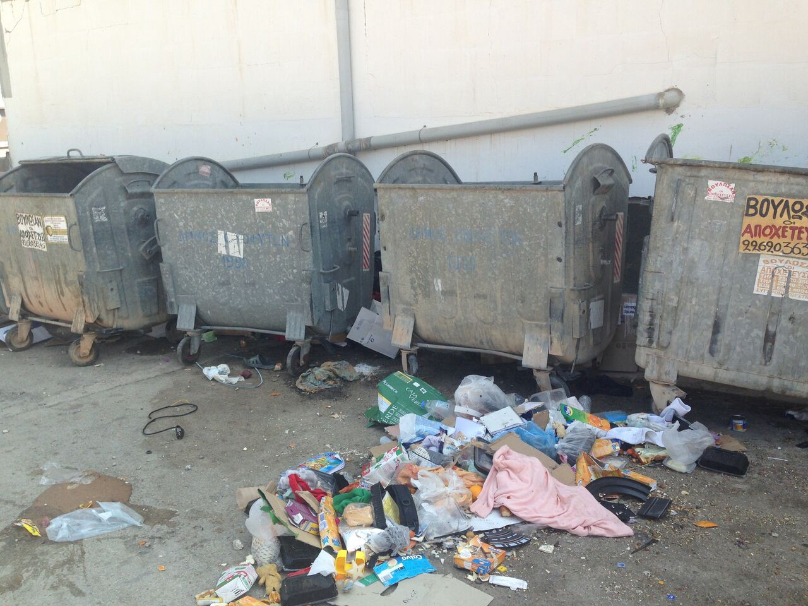
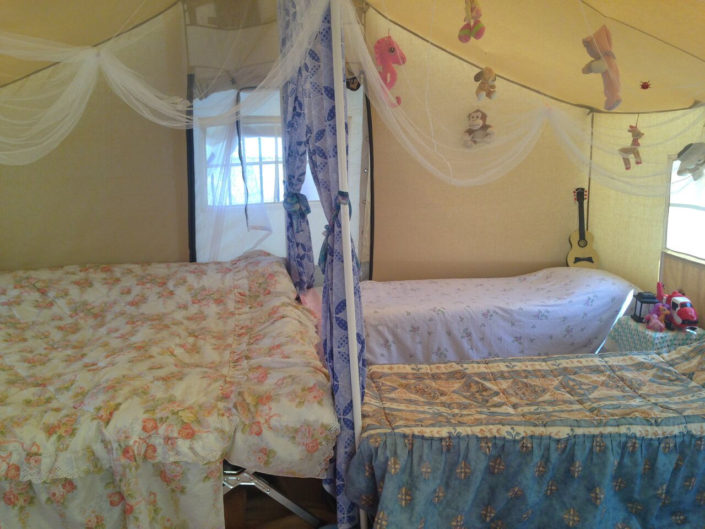
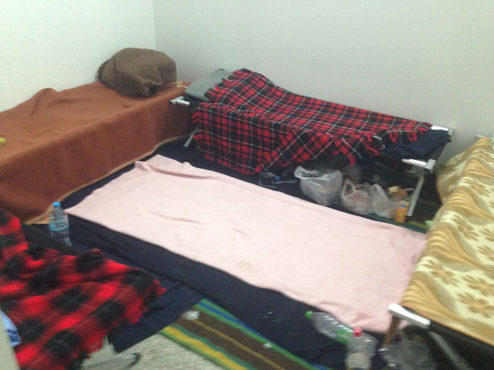
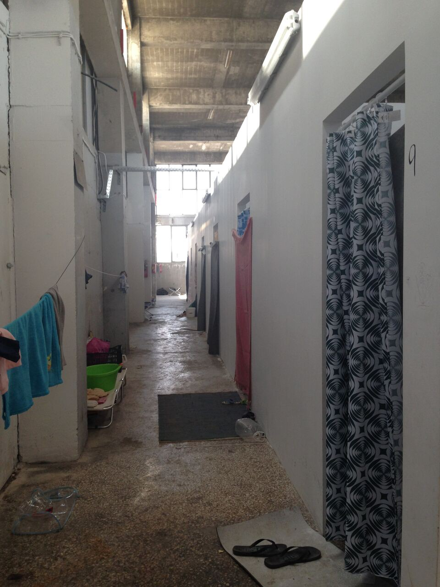
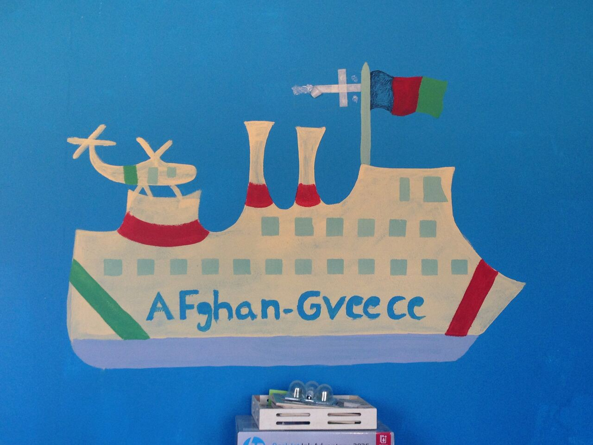
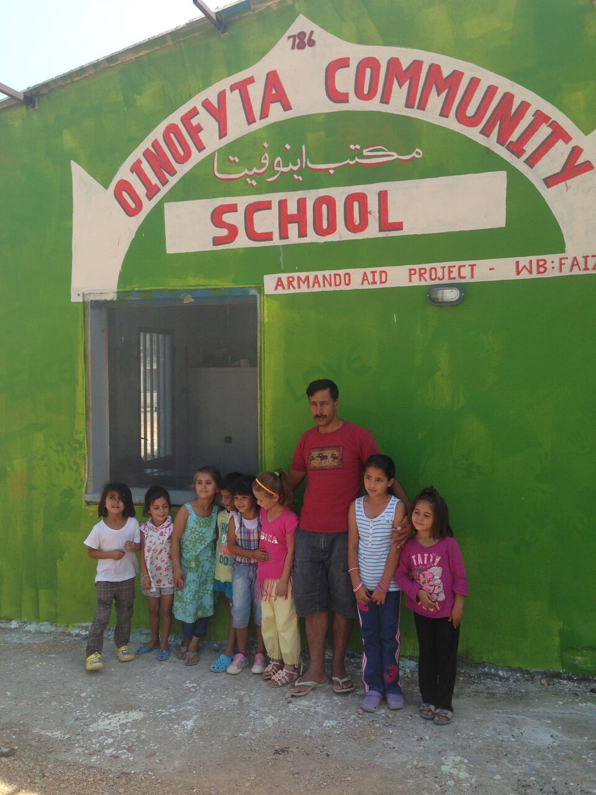
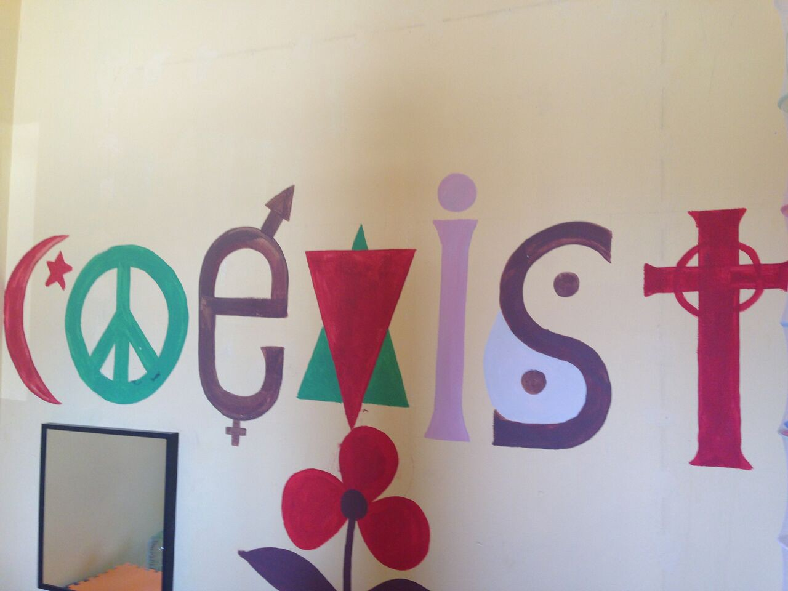

### AYS Special Report
### **Pining for Piraeus?: The Oinofyta Refugee Camp**

By: L\. Mertes

Photo by L\. Mertes

They were told it would feel like home\.

Some 800 Afghans — a dribble of the 57,000 stranded refugees stuck in Greece in hopes of peace and asylum — have been shipped 58 kilometers north of Athens where next to a freeway an assortment of tents and a warehouse has been refashioned into the Oinofyta refugee camp\.

Many now look back with longing to their time in the port of Piraeus; in a hastily thrown together camp they had wifi, an essential communication and connection tool for refugees, and water all the time, and better food\. That camp was clean, they say\.

“I hoped to find peace here but me and my friends are depressed,” says Nahid, a former Piraeus resident originally from a village near Herat\.

Industrial area turned into refugee camp\.

Residents must use the water stored here when the taps are turned off\.

Oinofyta is an industrial town filled with factories, warehouses and just over 8,000 residents\. The manufacturing plant of one of Greece’s most coveted brands, Korres, overshadows the new camp\. Founded 20 years ago by a pharmacist from the island of Naxos, it makes hair and skincare products\.

However, Greeks know the place for its heavy industrial pollution\. The Asopos River here turned purple from waste\. People died of cancers previously unheard of\. [Reuters reported](http://www.reuters.com/article/environment-greece-chromium6-dc-idUSL0817394820071205) that between 1989 and 2007, the portion of deaths from cancer in the town rose from 6 to 32 percent, which was attributed to the irresponsible dumping of industrial chemicals\.

It’s not clear whether the river has been cleaned up\.

For camp residents, their immediate concern is the trash that overflows from the dumpsters\.

Residents of the camp are worried because of the trash that overflows from the dumpsters\.

“We’ve had spoiled food four times \[since we arrived last week\] and the children got sick,” Nahid said\. “There’s no one we can speak to about this,” she added\. There appear to no quality checks on the food distributed to refugees who complain it is spoiled from the Greek summer temperatures, which go up to 38 degrees Celsius\.

Refugees who arrived first, months ago now, are living in cloth tents in the parking lot\. More recent arrivals sleep in the warehouse, crowded into noisy rooms with shower curtains for doors and no security\.

Space where refugees are living, no privacy and no security\.

“We can’t get to sleep until 4 a\.m\. because of the heat and the noise, and then we get up at 7a\.m\.,” Nahid said\.

Many new residents sent to the camp are single males, which makes mothers to the 200 children in the camp uneasy\.

“There are so many different people from different backgrounds and so many single people,” said Maryam, a mother of seven who spent time in the Moria and Kara Tepe camps on Lesvos before arriving in Oinofyta\.

**Segregating nationalities**

As the refugee crisis enters a second year, camps have become segregated by nationality\.

There’s a looming feeling among Afghans that Syrians are the valued refugees\.

“Piraeus had its own difficulties\. They were more focused on the Syrian people there\. I think the Greek government focuses on the Syrian population and they’ve left the Afghans to the side,” Nahid said\.

“Because the Syrians were there, they gave them more facilities\. Piraeus was better because the Afghans could benefit from the Syrians being around,” she said\.

Part of Europe’s pull was that is was supposed to be free from the discrimination faced back home\. This is especially poignant for Afghans who have witnessed unprecedented discrimination based on identity in recent months\. The country’s Hazara population — 9 percent of the country’s total — was targeted in a terrorist attack in Kabul last week that left more than 80 dead and 230 injured\. On July 25th, the Greek\-Afghan community held a memorial in front of the Parliament in Athens to commemorate the victims\.

**Out of touch?**

Much reporting on the crisis has focused on refugees dependence on their cell phones to navigate the journey from Afghanistan to Iran, Turkey and Greece, Whatsapp groups that provide people with crucial information, and access to websites where rights are outlined\.

In places like Oinofyta, however, refugees can be quickly excluded from the benefits provided by their cell phones when their credit runs out, devices are stolen, or wifi is non\-existent\.

“I don’t have any money left\. Even my brother who lives in a camp in Germany doesn’t have money to send\. I pray every night,” Maryam said\. The Taliban wanted her brother to work for them so he escaped to Germany\. She followed but found that the borders had been closed\.

“I had a phone but it broke, and now I don’t have one,” she said\.

She hadn’t spoken to her three daughters in Afghanistan in over a month\.

Besides a way to contact family members, cell phones are the crucial conduit between asylum seekers and the Greek government — specifically its asylum service\. Refugees receive a text message with the date and time of their appointment for an interview\. UNHCR recently concluded the pre\-registration of all would\-be asylum seekers in the country\.

**A Good Camp?**

Despite all the complaints, Oinofyta is considered a good camp here\. Many in Greece’s solidarity movement, a diverse group sympathetic to the plight of the country’s refugees, describes Oinofyta as a coveted location\.

People flooding into Greece have met a variety of fates\. Those not in refugee camps are sheltering in mostly in squats in urban areas\. Greek families have taken in some lucky refugees while individuals with enough money rent apartments\. Many must sleep as they can in the streets and in parks, pitching tents if possible\.

The government has recently evacuated three squats in Thessaloniki, increasing fears that operations in other cities will follow, all of which puts pressure on for better camps\. On Tuesday, the mayor of Athens, Giorgos Kaman's, called on the government to empty squats used to house refugees and migrants\.

That Oinofyta is seen as a “good” camp is testament to the low standards for acceptable housing in this EU country\.

It’s also become a testament to hope for a better future\.

The Disaster Tech Lab, in a rare bit of good news, says it hopes to have wifi up and running in the camp in the next two or three weeks\.

And one building of brightly painted rooms on the camp’s dusty grounds illustrates what hard work and even limited resources can do\.

The Oinofyta Community School with 85 students is the brainchild of Faiz Mohammad Khanzai, a school principal in Kabul before he came to Greece six months ago\. He travelled all over the country before settling in Oinofyta: Lesvos, Larissa, and later Idomeni in the hopes that the borders would be reopened\. After two months in a squat in Thessaloniki he moved to the Ellinko camp in Athens for a few weeks\. The camp manager there drove him and a few other families to Oinofyta a month and a half ago\.

“I was a principal in Afghanistan and \[the camp manager\] asked me if I wanted to do the same thing here and the next day they put me to work,” Khanzai said\.

He hasn’t had a day off since\.

The Oinofyta Community School with 85 students is the brainchild of Faiz Mohammad Khanzai, a school principal in Kabul before he came to Greece six months ago\.

His students study English and geography\. He is still working as he had to in Kabul at persuading parents to send their kids to his school\.

“We have some students \[back home in Afghanistan\] who want to go to school and have a pen and paper in their hands, but their parents don’t want them to\. They are pigeon keepers and spend money on the pigeons but don’t want to spend money on a notebook,” Khanzai said\.

School with 85 students, all refugees\.

When the school opened, he went tent to tent in the camp to try to get parents to send their children to class\.

“The first day only 10 children and two adults showed up,” he said\.

So he changed tactics\.

He delayed the school’s start time by 30 minutes\. He gave juice at the end of the day to students who attended\.

“I said to one family: ‘God forbid you need to go to the hospital\. If your child knows English it will be no problem, but if you don’t you’ll have to find a translator,’ ” Khanzai said\.

The next day the family sent both their children to school for the first time\. More followed\.

Khanzai believes Europe is the best place for his students, even as he has watched the continent become a less welcoming place for Afghans all of ages since the crisis began\.

“In Europe, they see people for people\. In Afghanistan, it’s not like that\.”

_Converted [Medium Post](https://medium.com/are-you-syrious/ays-special-report-302a851e584a) by [ZMediumToMarkdown](https://github.com/ZhgChgLi/ZMediumToMarkdown)._
