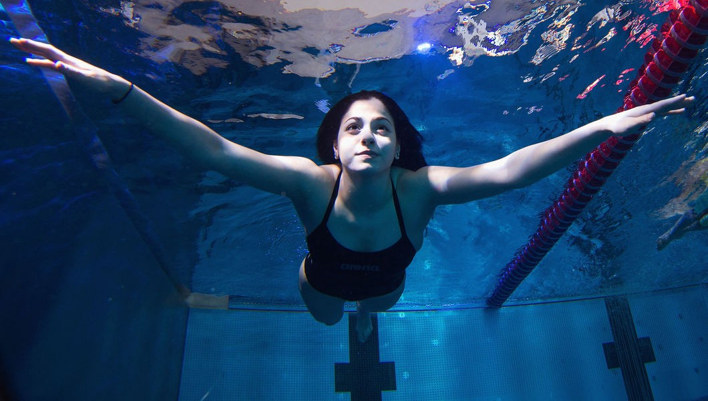
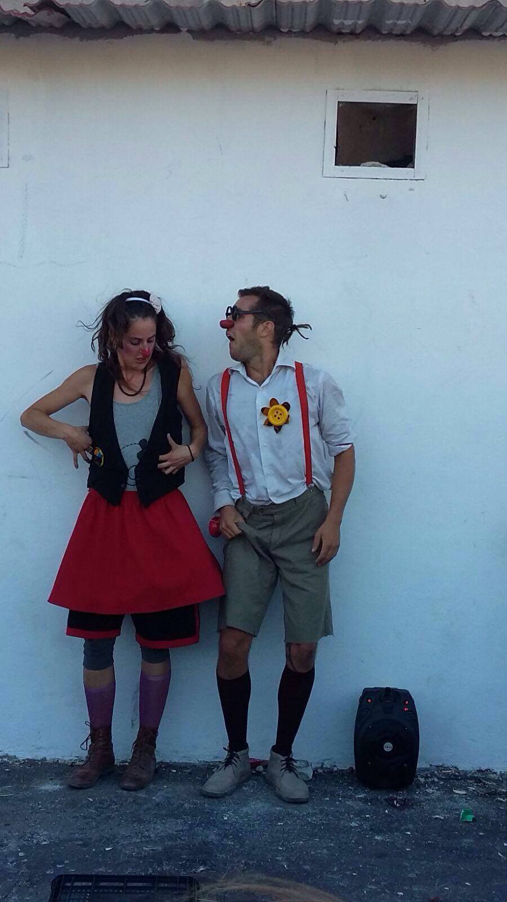
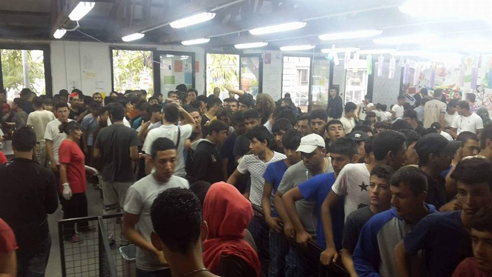
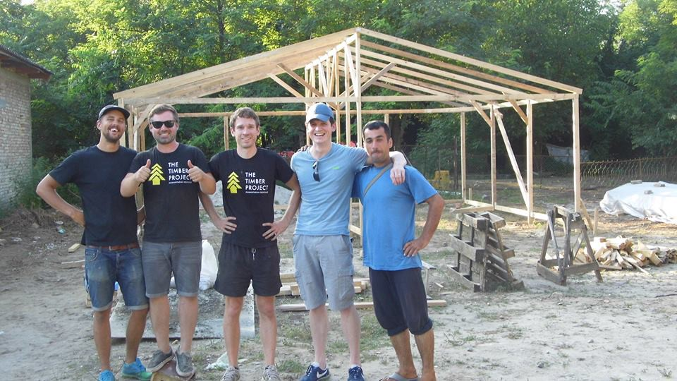
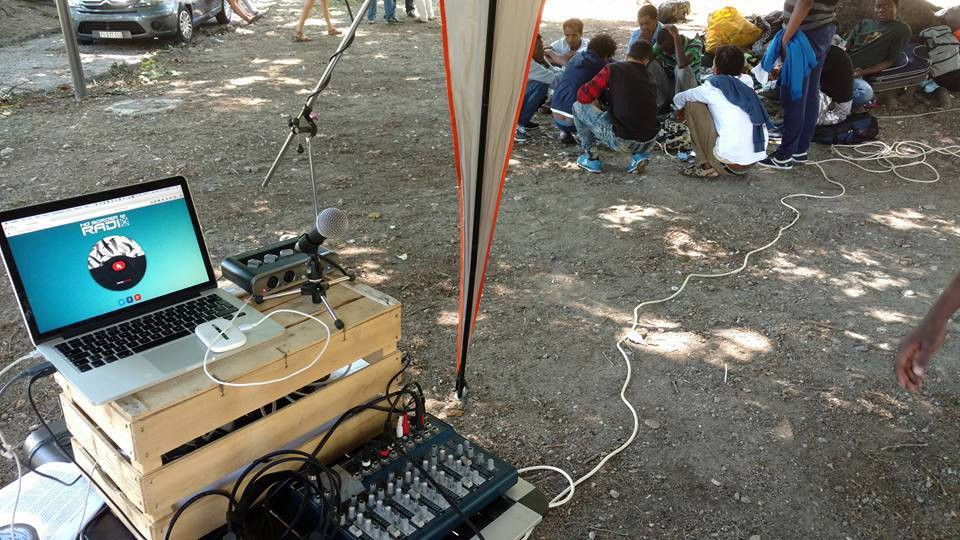

### AYS Daily Digest 6/8: Tightening of borders in Bulgaria and arrests of refugees

_Yusra Mardini is a hero of the day\. She came first in women 100m butterly at the Olympics in Rio\. Some future Olympic winners are maybe arrested or stranded inside the European rules and borders, that are becoming even more strict\. Police officer hurt in fight in Chios\. Joint action between three countries to arrest human traffickers\. Warning from Serbia — uncertain autumn and winter are coming_

Yustra Mardini — The golden girl\. Photo Olympics\.
### Go girl\!

For a long time we did not have a chance to open our daily digest with something truly beautiful\. Tonight, we are happy to congratulate to Yusra Mardini, a Syrian swimmer who came first in women’s 100m butterfly with a time of 1:09\.21 at her first Olympic games\.

Her time will not bring her to the semifinals, however\. The time ranked her 41 in a format where only the top 16 swimmers move on\. But, she is the winner\.

Yusra is refugee from Syria who is currently living in Berlin and part of the Refugee Team in Rio\. Together with her sister Sarah, Yusra left home in August 2015\. Their first stop was Lebanon, than Turkey, and through the smugglers ring, they arrived to Greece by dinghy with 18 other refugees\. At one point, the dinghy broke and Yusra and her sister, together with two other people, got into the water and pushed the boat for over 3 hours until it reached Lesbos\. From Greece they traveled via Balkan Rout to get to Germany\. She is already the champion, unlike all those who forced her to leave her home and those who tried to stop her from becoming what she is today\.

Good news is coming from the International Paralympic Committee \(IPC\) which announced that a small group of refugee and asylee Para athletes will compete as part of an Independent Paralympic Athletes \(IPA\) team at the Rio Paralympic Games\. The team will be named later this month and they will compete under the Paralympic Flag\. The Opening Ceremony is on 7 September\.
### The end of Aleppo siege

Another good news is coming from Syria\. Acording to the various news media, as well as sources in Aleppo, the siege of the city has ended\.

The city is under the siege since July 17\. An estimated 250,000 civilians live in Aleppo’s rebel\-held eastern quarters\.

Video by Bahaa Jamil from Aleppo today\.

### Police officer injured in Chios

[Greek media](http://greece.greekreporter.com/2016/08/06/greek-police-officer-injured-during-clash-between-refugees/#sthash.Cja9lE9C.2s0nzAFH.dpuf) are reporting that a Greek police officer was transferred to hospital after injured in a refugee camp\. Apparently, refugees at the [Chios](http://greece.greekreporter.com/tag/chios/) hotspot started clashing and throwing stones\.

Members of riot police intervened\.

> “As long as these people remain trapped on the Greek island, we will continue to witness such incidents every day\. The situation is tense and no one knows what is to come,” said a police officer from Chios\. 

> Refucomm informs that [an updated Skype schedule](https://mobile.facebook.com/145594569125687/photos/a.147610778924066.1073741831.145594569125687/298196703865472/?type=3) has been released for applicants, and it is effective from August 8th\. 

### Medical staff needed

[ECO Project](https://www.facebook.com/Eko-Project-1555396161421461/?fref=ts) is looking for medical staff to work along them to to create a structure for medical care and first aid\. They need medical staff or teams in order to keep it running constantly\. The team is near Vasilika camp\.

Eco Project is working on a creation of a “day camp” that will have the school, the community kitchen, the tea tent, the women’s space and everything else they built together with refugees and volunteers\.
### Smile agains borders

[Contaminando Sonrisas](https://www.facebook.com/CntmSonrisas/) , went on tour and visited several military camps, houses occupy and settlements not controlled by the state, where they met thousands of people who are hoping to find safe heaven\. What they found is rather desperate picture of inhuman conditions people are left to live in\. They were shocked by the conditions in the outskirts of Athens where up to 3\.800 people are living in the streets\. “No trees, just asphalt and barracks… this is horrible, heinous, inhuman\.”

They also visited refugees living in the military field of Elefsina, more than 300 Afghans\. They live in large rooms, and have no privacy, school, or any daily activities\. On their short tour, they also encounter people living in ship by the road\. To all of these places, they came with the smile and open heart, and they will continue touring\.

Photo by Cntaminando Sorisas\.

> “And you know friends\. don’t stop talking about us of them and the independent projects that day to day fight for that situation of the people in transit\. Little by little we’re building alternatives, ties and friendships\. They share a common purpose: to knock down the borders, both physical and mental\.” 

### Help needed in Oinofyta camp

[Kerrie Moor](https://www.facebook.com/kerrie.moor?fref=nf) , an volunteer, shared info about situation in Oinofyta Camp\. We wrote about it in details in [our special report](https://medium.com/@AreYouSyrious/ays-special-report-302a851e584a#.rddsd8eb2) , but we are adding some new info\.

According to Moor, several NGOs are operating in this camp, along side big organizations like UNHCR, Save The Children, IOM\. Adventists are running efficient Medical Centre, bum many people are sent to hospital every day due to the fact that there are not enough medical services provided at all\. Too many families are suffering because of the lack of medical staff in general\. She also reports that very often the water runs out in the camp, while one day it was off for 10 hours\. As well as other camps, this one needs your help\. Please, contact volunteers who are in the field for more info\.
### Current volunteering opportunities in Athens \(beginning August 1\)

> If you are new to volunteering in Athens, please consider spending your first couple of days at the Ellinikon Warehouse helping with the sorting of donations\. 

> When you are offering your help and agreeing to a date and time, please do honor that commitment\. Team leaders and project managers rely on you and sometimes turn other people away if they think they have enough volunteers\. Therefore please only commit to helping if you are definitely committed to helping\. 

_Squats:_

[Notara 26](https://www.facebook.com/profile.php?id=100010239857028&hc_location=ufi) — you can just turn up to help — no need to book

Themistokleous 58 — you can turn up to help — no need to book

[Merlie Oktaviou 19](https://www.facebook.com/5olikeio/?hc_location=ufi) \(school squat\) — contact via FB\.

[Hotel City Plaza](https://www.facebook.com/sol2refugeesen/?hc_location=ufi) — Acharnon 78 and Katrivanou \- to help with English classes, contact Charlotte Cheeseman and for kids activities [contact via PM](http://react-text: 482 https://www.facebook.com/groups/868661516611629/ /react-text) \.

[2o filoxenio prosfigon](http://react-text: 487 https://www.facebook.com/2ofiloxenioprosfigon/?fref=nf /react-text) \(Sourmeli 1,3\) — contact via FB\.

[Spyrou Trikoupi 57](http://react-text: 492 https://www.facebook.com/Κατάληψη-Στέγης-Προσφύγων-Hotel-O /react-text …/) in Exarchia \(ex Hotel Oniro\)

[Chalkidos 21, Ano Patisia](http://react-text: 497 https://m.facebook.com/Chalkidos-4th-Solidarity-Housing-An /react-text …/) – a lot of help is needed as this is a new squat\. Contact Heather Young or KevinWidanel Belcher

_Official Camps:_

> Independent volunteers are not allowed in any of the camps\. Volunteers need to be registered with one of the NGOs/Groups mentioned below\. 

[Ellinikon Camp II](http://react-text: 506 https://drc.dk/where-we-work/europe-and-caucasus/greece /react-text) — the old Airport — the Danish Refugee Council are looking for: volunteer teachers, fluent in Farsi able to teach Greek or English and a volunteer football coach\. Minimum age: 20 years and minimum one month commitment\. Email at volunteer@drc\-greece\.org to find out more\.

[Eleonas](http://react-text: 511 https://www.facebook.com/projectelea.volunteers/ /react-text) — volunteer via Project Elea — minimum 2 weeks and minimum age requirements \(18 years\) — now taking volunteer applications from September onwards\.

[Skaramangas with Drop in the Ocean](http://react-text: 539 http://drapenihavet.no/en/ /react-text) — To volunteer with Drop in the Ocean, you have to register first\. Send a mail to volunteer@drapenihavet\.no or go to web\-page, and submit the register form\. Their requirements are that volunteers should be minimum 25 years old, can commit for at least 10 days, and can communicate in English\. Drop in the Ocean are not taking any new volunteers until September \(except for mother/baby health professionals\) \)

[Skaramangas with Organisation Earth](http://react-text: 545 https://docs.google.com/ /react-text …/) — To volunteer with Organization Earth at the Port and Skaramangas please fill out the form\. Minimum age limit is 18\.

Ellinikon Warehouse — from 11–6pm Monday to Friday Katerina Rouniou — continuous need for volunteers to help sort donations — you can turn up at the hours stated — you don’t need to book in advance — The warehouse is within the disused Ellinikon airport, at the back of the huge Basketball Stadium on the coastal road \(Posidonos\), across the tram/bus stop “Elliniko”\. Please report at the security check\-point — between the Olympic Airways terminal and the Stadium — and tell the guard you are a volunteer at the warehouse of “Pampiraiki”\. The warehouse is the big blue building

A watsapp group has been set up for volunteers helping at the Ellinikon Warehouse… please PM [Kara Kallenbach](https://www.facebook.com/kara.kallenbach) if you wish to be added to it\.

[Marhacar team](http://react-text: 529 http://marhacar.org/ /react-text) is looking for volunteer drivers to help with distribution of Aid in and around Athens — contact them directly\.

Orange House — we need — farsi or arabic speakers and volunteers with building skills \(we need help to put cement in the courtyard\) — we are also scheduling volunteers for September — contact volunteer@zaatar\.org or PM [https://www\.facebook\.com/aida\.khalil1](https://www.facebook.com/aida.khalil1)

[Project leaders needed](http://react-text: 535 https://daedalus.libtech.website/ltg-athens/ /react-text) to help run projects with groups of refugees \(Rooftop gardening, Solar cooking, Woodworking, Civil engineering \(building maintenance and conservation\), Herbalism, IT and electronics \(e\-Learning and R&D\), General tinkering and DIY\. Contact Harper Pollock

\(Info gathered by volunteer [Sumita Shah](https://www.facebook.com/sumita.shah.7?fref=nf /react-text) \)
#### Serbia
### Help needed in Serbia

Number of refugees arriving to Belgrade is still increasing\. According to the [Info Park](https://www.facebook.com/Info-Park-885932764794322/?fref=ts) , lots of vulnerable people with a very little or no protection at all, children, women, minors, returnees from Hungarian border, wounded or injured, desperate and stranded grown ups, are in the city\. From their FB page we read warning: “We are heading to a very unpredictable autumn and winter\. They are just around the corner…”

The same organisation is looking for for a Farsi/Pashtu/Urdu translator — cultural mediator\. If you have a speaking knowledge of these languages \(one or more\) and want to join a dynamic, young team of great humanitarian workers based in Belgrade, please contact them for more details

Photo by Miksaliste\. Lunch time in Miksaliste daily center\.
### New structures at the border with Hungary

Today we got info from [the Timber Project team](http://react-text: 56 www.thetimberproject.co.uk /react-text) who just finished building a wifi and phone charging shelter for iHo in Kelebija refugee camp\. On Monday, the learning centre and women’s space, which will be handed over to iHo to run and develod, should be finished too\.

Medecins Sans Frontieres \(MSF\) have collaborated with The Timber Project to build 11 shower units for Horgos refugee camp\.

However, to continue with good work, they need help\. Please visit their website: and donate whatever you can\!

Also, if you have a building project you would like to see realised on the Balkan route or Greece then please get in contact with The Timber Project team at [thetimberproject@gmail\.com](mailto:thetimberproject@gmail.com) \.

Photo by Timber project team\.
#### Bulgaria
### Volunteers and human right lawyers — be alert

More arrestes in Bulgaria\. This time, 15 foreigner withouth identity documents were arrested near the town of Tsarevo, on the border with Turkey\. [Apparently](http://www.novinite.com/articles/175784/Bulgarian+Police+Apprehend+15+Irregular+Migrants+on+Coastal+Road+near+Tsarevo) , refugees were found in a car which police stopped for inspection on a road linking Tsarevo with the village of Lozenets on Friday\. All of the people who were arrested claimed to be Iraqi citizens\. The 23\-year old Bulgarian driver of the vehicle was detained, too and police have launched criminal proceedings over people smuggling against him\.

This is the third group of people police arrested at the border over the the last three days\. Group of five was arrested near the town of Ahtopol, and the other, 32 people, were found near the city of Burgas\. All the volunteers in Bulgaria and human rights lawyers should try to follow these proceedings and help to refugees who are arrested if needed\.
### Frontex at the border

At the same time, Frontex announced they will strengthen its activities at Bulgaria’s borders with Turkey and Serbia\. This decision came after Bulgarian government asked for help\.

> “In the coming weeks, Frontex will deploy border surveillance officers, patrol cars, thermo\-vision vans and dog teams to the land border with Turkey,” Berndt Koerner, deputy executive director of the European border management agency said\. “At the same time, border surveillance will also be reinforced at the Bulgarian\-Serbian border\.” 

Fronted will also strengthen its presence at the border crossing points\.

Frontex says it deploys 63 experts of different profiles at Bulgaria’s border with Turkey and 17 border surveillance officers at the border with Serbia at present\.
#### Hungary
### Cruelly ironic situation

The situation with refugees in Hungary or at the border with Serbia is not getting any better\. The [Migszol organization issued an update](http://www.migszol.com/blog/the-catastrophic-consequences-of-the-8km-law-and-violence-at-the-hungarian-serbian-border) on the general asylum situation between 4th July — 4th August 2016\.

> “The 8km law, that we wrote about earlier, took effect on the 5th of July\. According to the legislation, anyone who is caught within 8m on the Hungarian side of the border fence may be “escorted” back to the Serbian side of the fence\. This legalizes the pushback of people to the Serbian side and severely restricts people’s right to seek asylum\. In practice, those caught and pushed back are not given a chance to ask for asylum, which is contrary to international law\. We find it cruelly ironic that at the same time the Fidesz government claims that the border fence is working, the Hungarian authorities are cutting holes to this fence in order to push people back to the Serbian side\. The results of the law have been catastrophic: the number of people waiting at the transit zone to apply for asylum at the border has doubled\. There is no legal help available, civilian volunteers and activists have limited access, and the living conditions are abysmal\.” 

For more, please visit their website\.
#### Italy
### Joint police action against human smuggling

In a coordinated operation, police in Italy, Hungary and Slovenia arrested four people who they believe could be connected with the smuggling of people into Italy from the Balkans\. Two people were arrested in northern Italy, one in Budapest and one in Maribor\. All four are charged with criminal conspiracy and aiding and abetting clandestine migration\.

They are, police believe, part of a trans\-national criminal group of Pakistani origin that is based in Milan\. The police said the business generated returns close to 500,000 euros a year\.
### NoBorder radio

Radio NoBorder is at Como where about 400 people are stuck on their way to Swiss\. They established a post for cellular recharge\. They will soon start to broadcast\. Follow them online at radionoborder\.net

Photo by NoBorder\.
#### General
### Generous gift from Xavi

And today, we finish with a sport\. The former Barcelona football player Xavi donated his yacht to the Proactivia Open Arms \(POA\), a non\-governmental organization helping refugees\. Xavi, who now plays for Qatari club Al Sadd SC, works with POA who is helping to people trying to reach Europe by sea\. The yacht will be auctioned and all the money will go to POA’s work in the Mediterranean\.

_Converted [Medium Post](https://areyousyrious.medium.com/ays-daily-digest-6-8-tightening-of-borders-in-bulgaria-and-arrests-of-refugees-f487a404f351) by [ZMediumToMarkdown](https://github.com/ZhgChgLi/ZMediumToMarkdown)._
