### AYS News Digest 5/8: Food shortages in Calais

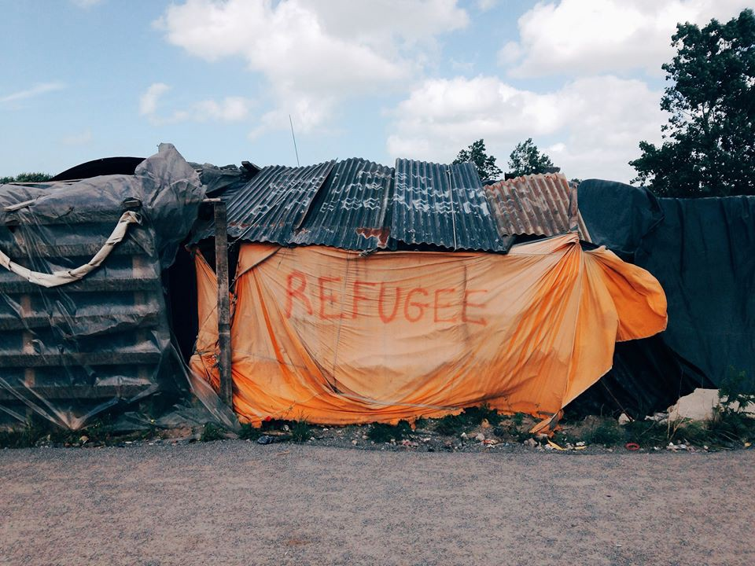

Photo by the Worldwide Tribe

_Refugee Community Kitchen in Calais needs donations as the camp population continues to increase while police closes down camp restaurants\. Yazidis from Nea Kavala camp move to a new camp in the area of Serres\. Aleppo hospital bombed for third time in two months\. 300 migrants tried to occupy area near French\-Italian border\._
#### Syria
### Syrians on Jordan border receive first aid since June

UN agencies announced the “successful completion” of a relief operation meant to provide more than 75,000 people with food and water\. The statement said “”sheltering in makeshift tents in harsh desert conditions with temperatures of up to 50 degrees Celsius and sudden sand storms, they are without sufficient food and have barely enough water to survive”\. Syrian refugees have been stranded in the desert since June, as Jordan closed its border with Syria after a suicide bombing claimed by ISIL killed seven soldiers\.

In an [essay](http://www.msf.ca/en/article/a-state-of-paralysis-a-canadian-msf-nurse-on-the-struggle-to-provide-care-to-syrians-trapped) , MSF nurse Mariko Miller describes how difficult it is to deliver aid in this border area, adding that “in desperation and for survival, some are even returning to Syria”\.
### Hospital in east Aleppo bombed for third time

An hospital in east Aleppo has been bombed for the third time, with Mohamed Khatoub, an advocacy manager for the Syrian American Medical Society, telling the [Middle East Eye](http://www.middleeasteye.net/news/hospital-aleppo-hit-third-time-month-syrian-government-1932518877) that the hospital was hit by an illegal vacuum bomb\. According to him, in July, health facilities have been attacked every 17 hours\.
#### Iraq
### Isil prevents people from fleeing

As civilians tried to flee the Hawija district in the Kirkuk province, ISIL fired openly into families, killing 12 on the spot\. 3,000 civilians have been prevented from escaping in the district\.
#### Greece
### Pre\-registration and asylum information

With many refugees worried about the length of the asylum procedure, News That Moves has conducted an interview with the Greek Asylum Service \(GAS\) \. The representative of the GAS says the date for pre\-registration is usually scheduled within five days after the Skype call, while registration appointments are usually scheduled within 5–7 months from the pre\-registration appointment\. The date for the asylum interview is scheduled within a month after final registration according to the representative\. The complete article and information can be found [here](https://newsthatmoves.org/en/pre-registration-how-long-does-the-process-last/) \.
### Refucomm updates information guide

[The six part information guide now includes:](http://refucomm.com/greece/)
1. Your Options in Greece
2. How to Apply for Asylum
3. The Asylum Interview
4. How to Prepare for your Asylum Interview
5. How to appeal a negative Asylum Decision
6. Assisted Voluntary Returns

### Women face harassment and violence in Greek refugee camps

[Reuters](http://uk.reuters.com/article/uk-greece-refugees-women-idUKKCN10G0CV) reports on the dangers faced by female refugees in Greece and recounts many women’s experiences with harassment and rape\. Separate bathrooms and sleeping areas can help mitigate those risks but they are almost non\-existent in refugee camps and detention centres\.

The paper also points out the dangers women face when sleeping rough in Athens, forced to wait for an asylum interview\.

A volunteer in Athens told us of similar stories, saying a lot of violence against women happens at night when going to the bathroom\. She told us that they started distributing whistles among women, as a way to both surprise the attacker and attract attention on herself — women reportedly liked the idea and took it seriously, carrying these whistles around their necks or in their pockets\.
### Voice from minors in Paranesti retention centre

In an interview with [Moving\-Europe](http://moving-europe.org/voices-of-minors-in-detention-from-paranestigreece/) , two minors say they have been detained in the Paranesti retention centre since June 10th, with police saying the detention is for their own protection\. One of the two boys says

_“Everybody knows why we escaped from our country, but no one wants to see our pain — we just don’t have another way to survive\. We have been beaten and insulted by the police in Bulgaria and Greece\._

_Why are we here? They say that the general attorney studies our case, but what is our ‚case‘ anyways? We experienced war, we are looking for peace somewhere\. We just need to survive\.”_

He adds that his brother is already in Germany and that he hopes to reunite with him\. He was separated from his mother by smugglers and was arrested before being able to rejoin her in Bulgaria\.
### Yazidis from Nea Kavala move to a new camp in the area of Serres

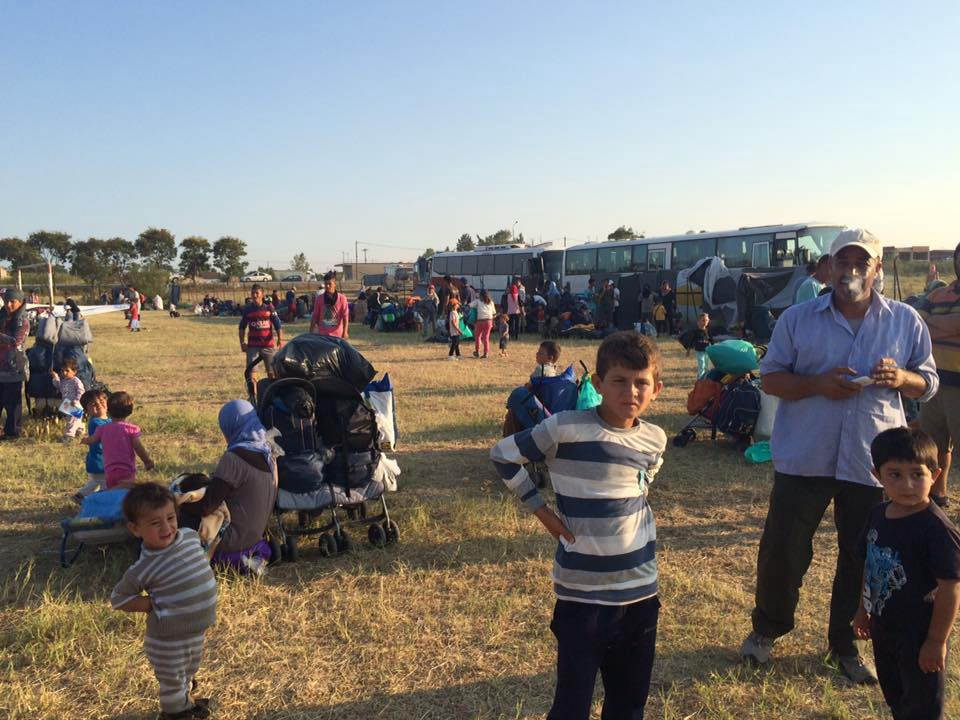

Photo by Molly Ananda

After leaving the camp because they felt unsafe and threatened by other refugees, the Yazidis of Nea Kavala were brought to a new camp in the area of Serres, called Dimitra\. InterVolve has helped with setting up the tents, registering people and distributing food\.

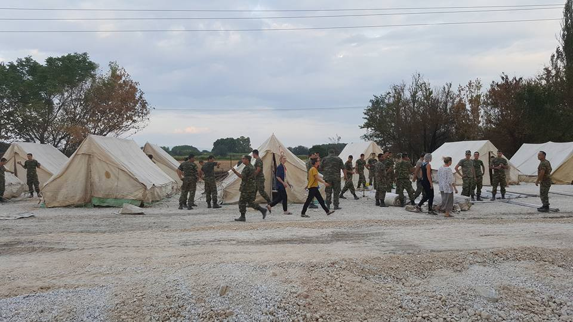

Photo by Hugo Miguel Caldeira

Around 70 people were identified as being vulnerable \(single mothers, pregnant women, handicapped people\) and will be able to sleep inside the former school building\.

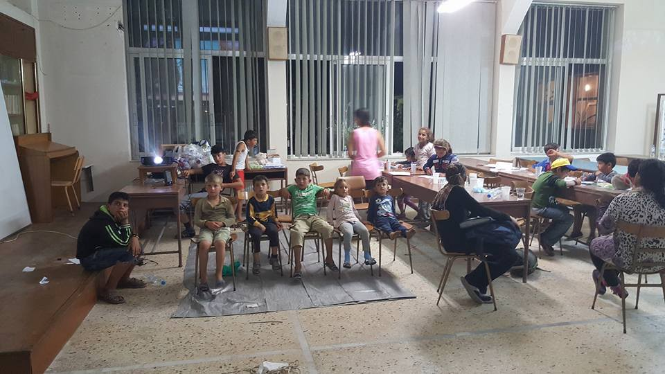

Photo by Hugo Miguel Caldeira

Intervolve is currently fundraising [here](https://fundrazr.com/718SN9?utm_campaign=new-campaign&utm_medium=email&utm_source=05-2016) and is looking for new volunteers, in particular Arabic translators and a driver/procurement officer\. The minimum commitment is three to four weeks and includes training on cultural awareness and safety\. Please contact them a [t intervolvegr@gmail\.com](mailto:intervolvegr@gmail.com) with the subject matter : VOLUNTEER APL050816
### Protests continue in Oreokastro

Refugees in Oreokastro also complain about their living conditions and about the length of the asylum procedure\. Hidden from the world, in these “warehouses of souls”, they express their anger and frustration however possible\.

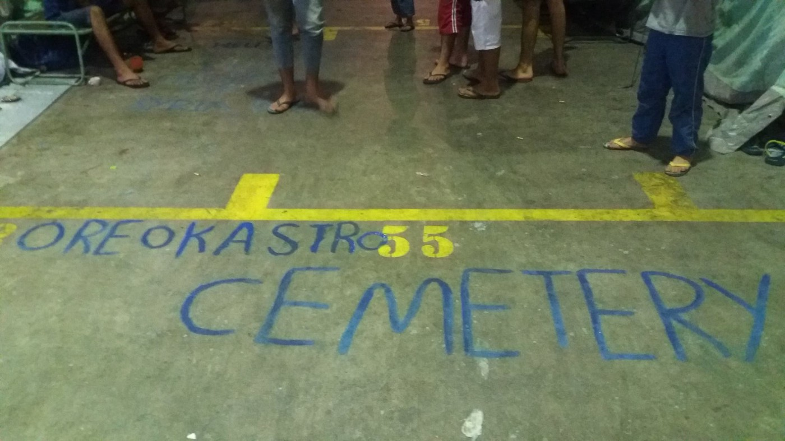

Photo by refugees\.tv

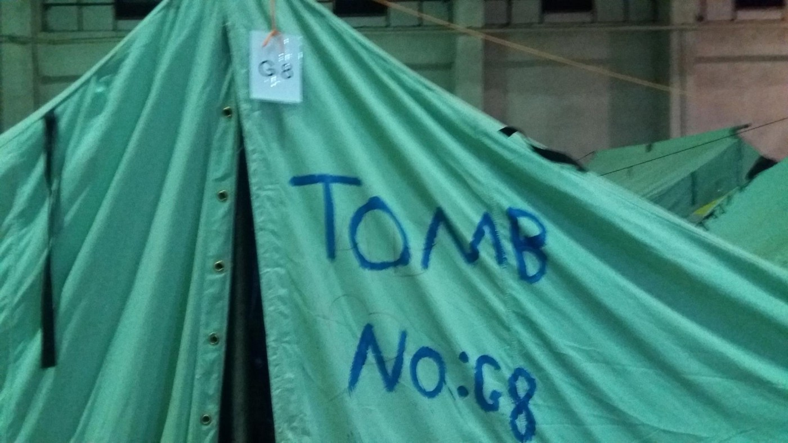

Photo by refugees\.tv

](assets/cc01b723c3c4/0*GQbTejfWtWhhKBS5.)

Photo by [Rezan Boyraz](https://www.facebook.com/profile.php?id=100006569595099&fref=nf)

Refugees have moved from Chalkero, known for its bad living conditions, to a knew camp called Asimakopoulou\.
### HSA new programme at the Agios Andreas Emergency Reception Site

Th Humanitarian Support Agency \(HSA\) says “residents have been falling ill from poor water supplies, insufficient food and inhumane living conditions”\.

They plan to improve food provision by enabling residents to cook for themselves and re\-take control of their diets\. HSA also wants to provide non\-food items such as clothes and hygiene items\. Finally, the group wants to upgrade shelters, as the current tents are ill\-adapted to the heat and wants to provide transportation to Athens for medical emergencies and asylum interviews\.
### _United Rescue Aid_ needs help for new alarm phone system

United Rescue Aid, a group that has been providing assistance for refugees in distress at sea, still needs €3,000 to establish a new alarm phone system\. The organisation tells us that they are currently using a Skype number as an alarm phone, but got blocked a couple of months back and fear that they will be blocked again if they keep logging on from more than 2 devices\. It’s therefore a matter of “personal survival at this point” to get a new system, as it is impossible to cover 24h shifts with only two people\. The new system will allow multiple caseworkers to use the same number across multiple locations\.

The group is also looking for old phones, but also smartphones and laptops to distribute to volunteers to get hold of an address to send your old phone to\.

New volunteers are also needed — in particular Arabic speakers living in other time zones\. Volunteers from the US, Canada or Australia could prove useful\.
#### No Border Social Center in Lesvos notified by police to leave

The No Border Social Center in Lesvos has been notified by the police to leave its place near Mytilene within several days, with police saying “we don’t need your help”\. The situation in Moria remains desperate, as the camp is overcrowded and lacks basic amenities\. The NoBorder Social Center provides food, drinks and activities and is situated in a factory hall near Mythilene, owned by Alpha Bank\. The Bank has given NoBorder an eviction notice on the 22nd of July\.
#### Mediterranean
### “Jugend Rettet”’ looking for staff for its rescue missions

“Jugend Rettet” is looking for crew members to participate in their rescue missions in the Mediterranean on board of the ship “IUVENTA”\. The boat is active off the Libyan coast\.

They are looking in particular for
• Seaman
• Engineers
• Doctors
• Paramedics / nurses
• Deckhands

Experience at sea and knowledge of languages is more than welcomed and the application form can be found [here](https://docs.google.com/forms/d/e/1FAIpQLSdf_IYzNZQo-NZho0rd9RCP_agJG-heYcVevfQ8O9PWiHMzkw/viewform) \.
#### Italy
### 250–300 migrants occupy area near French border

Around 300 migrants left the Red Cross camp in Ventimiglia during the night because of bad conditions and arrived at the woods of Balzi Rossi around 3am\. Police asked them to go back to the Red Cross centre, but they refused\. According to No Border activists they demanded an end to forced relocations, freedom for one Sudanese man, condemned last Monday and now detained in a CIE in Brindisi, and a better management of the Red Cross centre\. Two Italians and one French were arrested and volunteers were prevented from providing water and food by the police\. During the evening, police closed in on the group, clearing the woods, while some migrants tried to swim to France\. According to No Border, ten volunteers were arrested\.

Donations for Ventimiglia will be collected in Milan on the 7th, 9th and 10th of August in Milan\. Check out the [Facebook event](https://www.facebook.com/events/1556705694637529/) for more information\.

Meanwhile, 440 people are sleeping in the Como San Giovanni train station at the Italian\-Swiss border\. Action From Switzerland says there are only 4 portable \(broken\) showers, while 10% of people have scabies\.
#### Bulgaria
### Frontex to assist Bulgaria at the Turkish border

Frontex says in response to the request from Bulgarian authorities it will “significantly strengthen its ongoing activities at the country’s land borders”\. Additional assistance will focus on the border with Turkey but surveillance of the border with Serbia will also be reinforced\. Frontex Deputy Executive Director Berndt Koerner says Frontex will deploy “ border surveillance officers, patrol cars, thermo\-vision vans and dog teams to the land border with Turkey”\.
#### Serbia
### Info Park start distributing warm meals

Info Park is starting to distribute warm meals for lunch in the park near the bus station in Belgrade, everyday at 14h\. The group says it is able to provide enough food for everyone, allowing distribution to remain calm and peaceful — funds are sufficient to provide food until end of the month and they plan to continue distribution until the end of October\.
### Phone charging point and education space built in Kelebija

The Timber project has built a wifi/phone charging point in the Kelebija refugee camp and is about to complete an education space for children

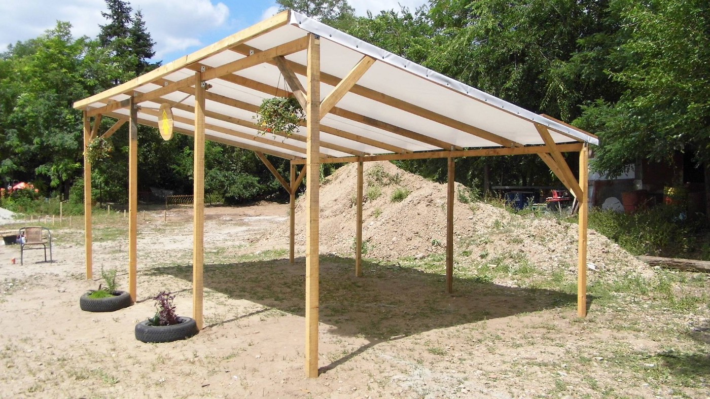

Photo by the Timber Project

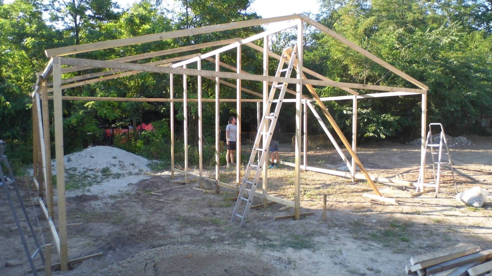

Photo by the Timber Project

The situation in Kelebija remains dire\. It its latest report, Human Rights Watch noticed a lack of “adequate humanitarian assistance such as shelter, showers, and proper food\. Kelebija is one of the spots outside the transit zones were refugees are forced to wait in order to enter Hungary, as only 15 people are admitted per day\.

“I’m Human Organization” says the Kelebija Learning Center will open on Sunday while another shelter for men will be built in the next few days\.

To participate and contribute to the learning center, you can send a mail to
[klc@iHo\.org\.uk](mailto:klc@iHo.org.uk)
#### UK
### Nine ambulances purchased by Anaya Aid

The nine ambulances are currently en route to Syria\. You can continue to support the project [here](http://www.totalgiving.co.uk/mypage/syriaconvoy) \.
### UK will not resettle 20,000 refugees by 2020

The Guardian says a parliamentarian report shows the UK is unlikely to reach its goal of resettling 20,000 Syrian refugees by 2020, with MPs calling the response to the arrival of refugees in 2015–2016, an “Europe\-wide failure”, as EU countries have been doing “too little, too late”\.

The report shows the UK received only 3\.2% of the EU’s first\-time asylum applications in 2015, while “thousands of people who were entitled to humanitarian protection and whose claims should be processed in the UK” remain in appalling conditions in the Calais camp\. The committee also suggested that the 157 unaccompanied children in Calais identified by Citizens UK as having family in the UK should be accepted into the country\.

Following this report, Vanessa Redgrave, Lord Alf Dubs and Aislin McGuckin have delivered a [letter](https://d3n8a8pro7vhmx.cloudfront.net/newcitizens/pages/1074/attachments/original/1470394853/Letter_to_Downing_St_Vanessa_Redgrave.pdf?1470394853) to Downing Street calling for an immediate amnesty for these unaccompanied minors\.

[Citizens UK](http://www.citizensuk.org/urgent_letter_to_downing_street) says that on average, three children a week are being reunited with their family and that given the current rate of reunification, many will face another winter in Calais\.
#### France
### Jungle Books Kids Restaurant forced to close

With unaccompanied children likely to remain in Calais for a while, police has handed an eviction notice to the Jungle Books Kids Restaurant, a place that provides two hot meals per day to the camp’s unaccompanied minors\. It is also a safe space for children where they can play and hang out\.

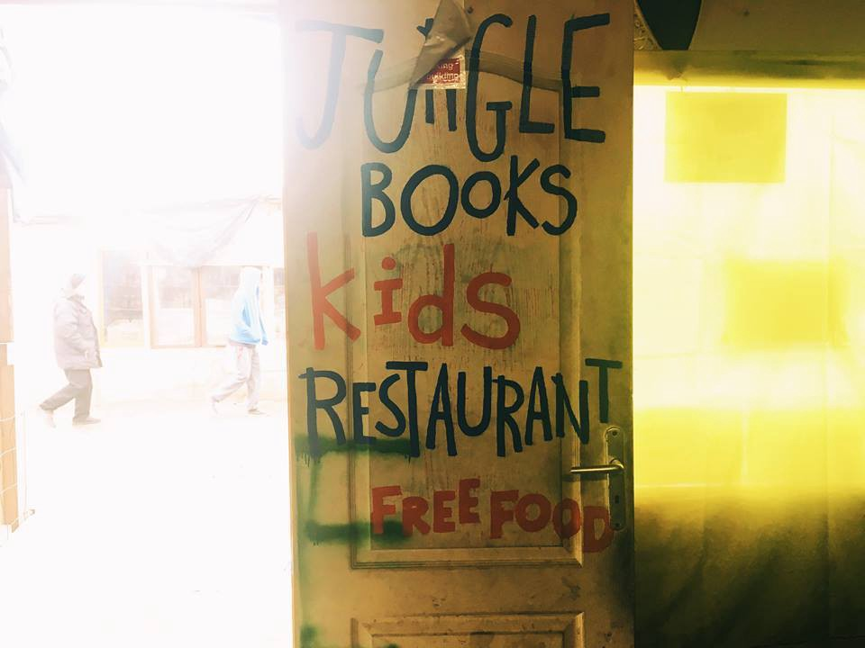

Photo by the Worldwide Tribe

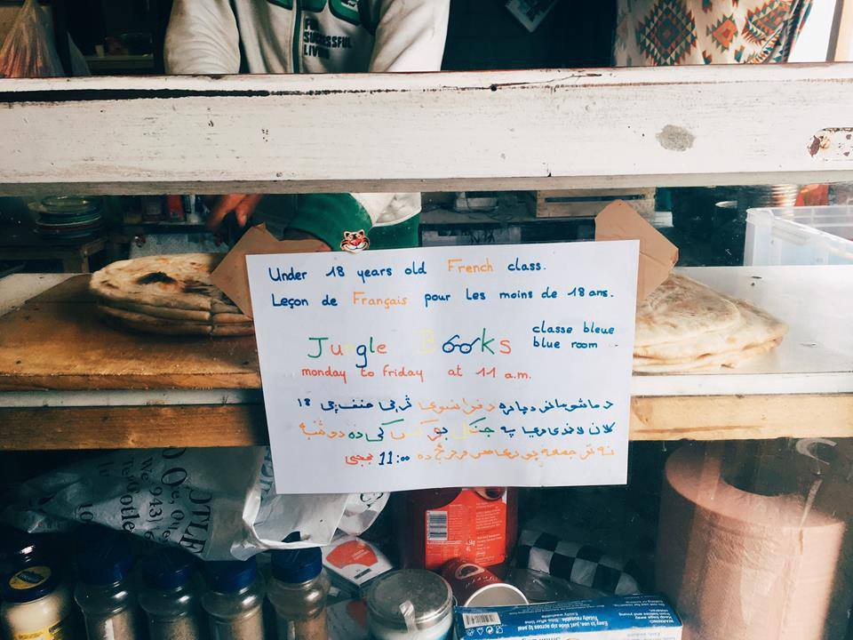

Photo by the Worldwide Tribe

Closing the Jungle Books Kids Restaurant will make the camp even more dangerous for unaccompanied minors\. Not only does it provide food and comfort, it also registers and keeps track of kids\. An essential task, given that 129 minors disappeared following the partial destruction of the camp, while aid workers report cases of abuse inside the jungle\.
### Severe food shortage in Calais

[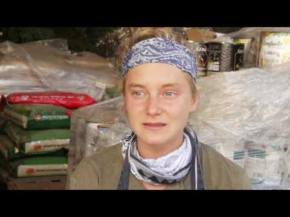](http://www.youtube.com/watch?v=a0XB7NspQC4)

The Refugee Community Kitchen in Calais says it needs to double its food output to 4,000 meals per day\. With police closing restaurants in the camp and the number of residents increasing everyday, food shortages become critical\. Financial aid is needed and recurring donations in particular allow the Kitchen to provide consistent support\. You can help them through their [fundraising page](https://mydonate.bt.com/charities/helprefugeesandrefugeecommunitykitchen) \.
### Food shortage in La Linière camp in Grande\-Synthe

The Kesha Niya Kitchen in Grande\-Synthe also experiences a drop in donations, despite growing responsibilities\. It wants to prepare for the winter and is trying to get a hold of a new field kitchen, sleeping bags, burner stoves and much more\. Financial contributions can be made through [Betterplace](https://www.betterplace.org/en/projects/44970) and donations in kind can be made by contacting donate@keshaniya\.org with your date of arrival and number of your registration plates, so that they make sure your vehicle can enter the camp\. Volunteers are also needed in the last two weeks of August and for the whole of September\. Please contact volunteer@keshaniya\.org\.
#### Germany
### Kurdish asylum\-seekers from Turkey on the rise

Der Tagesspiegel says growing domestic tensions in Turkey are causing more Turks to look to Germany for refuge, with most of them appearing to come from Turkey’s conflict\-ridden Kurdish regions\.

The Federal Office for Migration and Refugees says 1,719 Turks applied for asylum in Germany between January and June, with 1,510 of Kurdish origin\. In 2015, only 1,767 Turks applied for asylum\. Only 5\.2% of Kurdish Turks’ asylum requests were approved this semester\.

137 **43 deported in 2016**

[Der Spiegel](http://www.spiegel.de/politik/deutschland/fluechtlinge-bamf-zahlt-mckinsey-millionen-honorar-fuer-abschiebetipps-a-1106264.html) says that during the first half of 2016, 13\.743 foreigners have been deported to their country of origin, while 30\.000 have left voluntarily\. The [FAZ](http://www.faz.net/aktuell/politik/fluechtlingskrise/fluechtlinge-mehr-afghanen-kehren-zurueck-14372049.html) says 1,358 Afghans returned home in the second quarter, up from 764 in the first quarter\. The government says it expects to deny 350\.000 asylum requests this year, which is why it has hired consulting firm McKinsey to find ways to accelerate the pace of deportations\.

Meanwhile, 6,657 people were returned from EU states to Germany via Dublin rules, with 2,200 coming from Sweden\.

_Converted [Medium Post](https://areyousyrious.medium.com/ays-news-digest-5-8-severe-food-shortage-in-calais-cc01b723c3c4) by [ZMediumToMarkdown](https://github.com/ZhgChgLi/ZMediumToMarkdown)._
