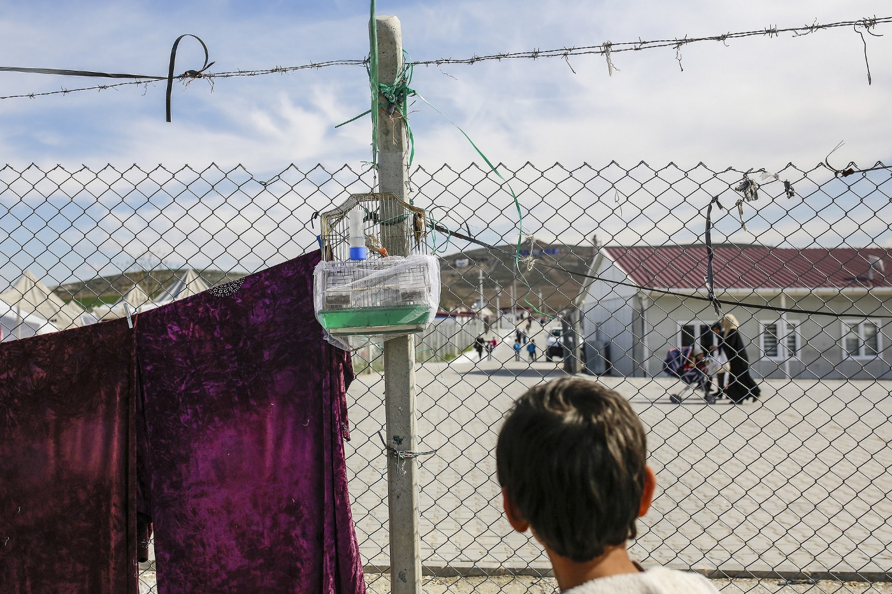
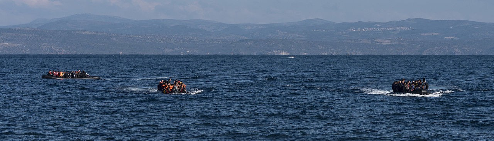
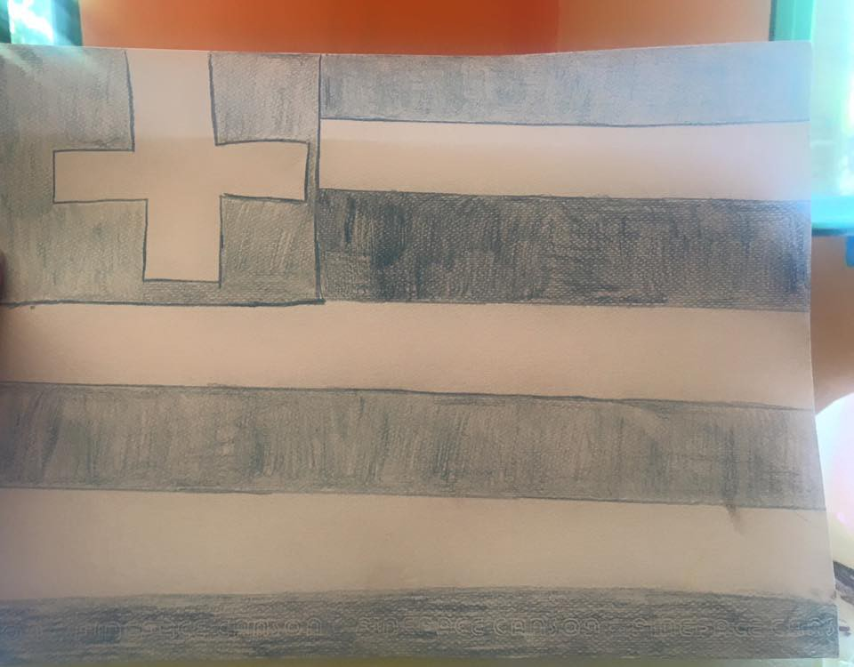
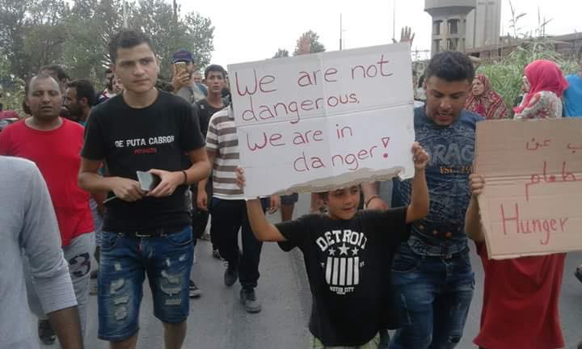
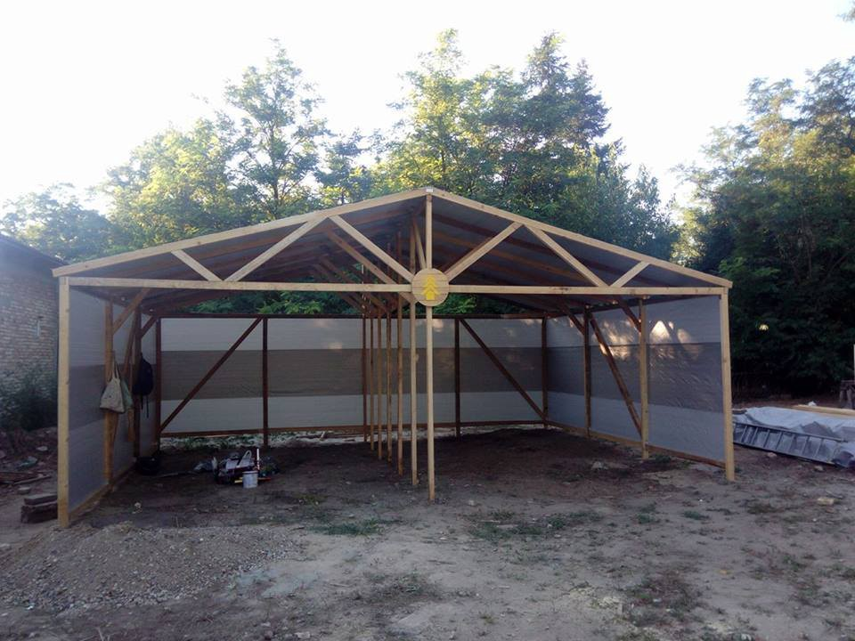
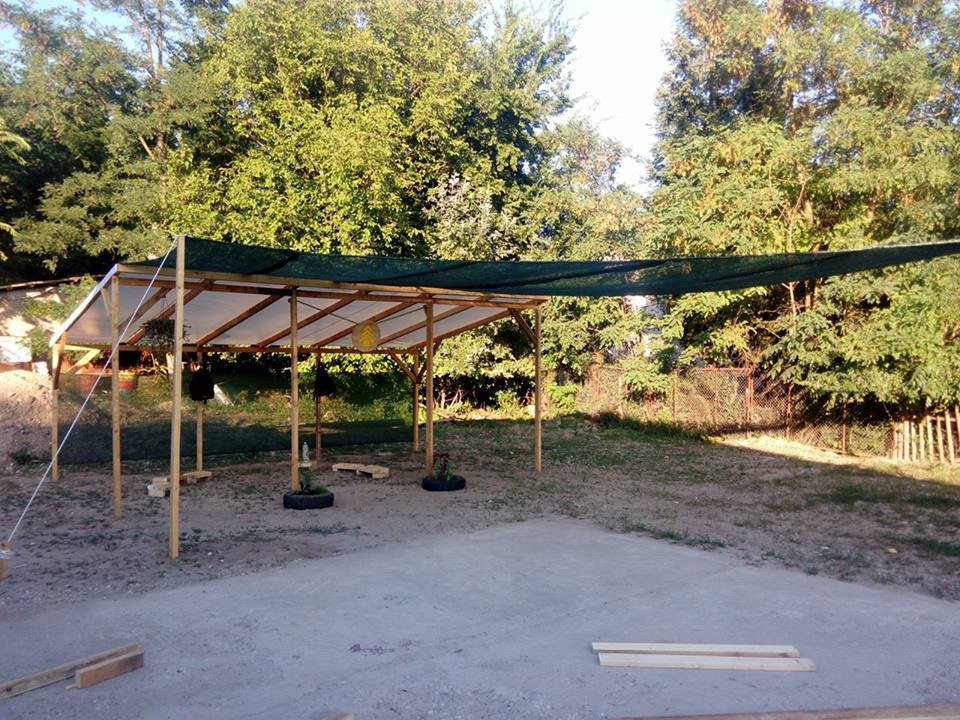
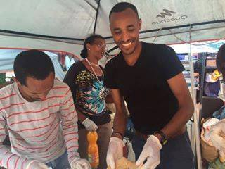

### AYS News Digest 8/8: Protesting against indifference

_Hunger used as a weapon of war; hospital specializing in children’s medicine bombed, killing medical staff, women and children in the war\-torn Idlib Governorate in Syria\. The “Nein\-Doch Spiel” between Turkey and the EU continues, affecting millions stuck in limbo, while many are forced to strike due to poor living conditions in refugee camps\. Many women in camps living in fear of violence, while Italy tries to resettle the growing number of refugees_

Syrian refugee camp © European Union 2016 — European Parliament
### SYRIA
### To whom it may concern?\!

The hospital that provided essential care for around 70,000 people living in Millis and the surrounding area, where a considerable number of displaced people had moved to escape front lines of fighting elsewhere in the north of Syria, was destroyed by aerial bombing\. According to [Médecins Sans Frontières](http://reliefweb.int/report/syrian-arab-republic/syria-msf-supported-hospital-idlib-bombed-ground-amid-increased) , four hospital staff, five children and two women were killed\. Six other hospital staff were wounded\. The bombing substantially destroyed the building, and the hospital is currently closed\. MSF said the strikes wrecked medical devices, the operating theatre, pediatric and intensive care units, ambulances and the hospital’s generator\.

In the first six months of 2016, the two largest MSF\-supported reference hospitals in Idlib Governorate reported 7 mass\-influxes of wounded, resulting in 294 wounded and 33 dead\.

> “Each time a hospital is destroyed, whether it is targeted or in an indiscriminate attack on civilian areas, it deprives Syrians of another lifeline of healthcare\. Some hospitals provide frontline care for war\-wounded, others provide frontline care for women having difficult pregnancies; all of them are needed to save lives”, says Dr\. Silvia Dallatomasina, Medical Manager of MSF operations in northwestern Syria\. 

Refugees arriving in boats to Lesvos, Greece \(Photo: Ggia\)
### **GENERAL**

**275,108** arrivals to Europe have been registered in 2016, according to the latest report by the [IOM](http://migration.iom.int/europe/) :
**263,636** by sea 
**11,472** by land 
**3,176** people who tried to reach Europe in search for safety are considered dead or missing

> “Wars are fed, not people” 

Pope Francis recently said this, strongly condemning the fact that it is more difficult to deliver humanitarian aid today than to obtain weapons\. 
Half a million people face a humanitarian catastrophe in Nigeria, while over half Yemen’s population are considered to be facing a food crisis or emergency\. Meanwhile in Syria, 8\.7 million people “need urgent food, nutrition and livelihood assistance”, particularly to farmers, [said](http://www.scmp.com/news/world/article/2000780/hunger-games-starvation-being-used-weapon-war-syria-yemen-nigeria) the UN agencies\.

Also, in some places hunger keeps the children away from school and even sparks child labour, Reuters [reports\.](http://www.reuters.com/article/us-mideast-crisis-education-idUSKCN10D2IZ)
#### Vulnerable, but resilient

Agriculture plays an important role in the resilience of populations faced with the shock of war\. Syria has become the first nation to make a withdrawal at the world’s seed bank buried in a mountain off the Svalbard islands in the Arctic Ocean to replace destroyed local seeds, [AFP](https://www.afp.com/en/home) reports\.

Al Fatiha Global Humanitarian Fund are now collecting donations to send food pallets to Syria\. For more information and list of supplies, check out their [website](https://www.alfatihaglobal.com/donate/syria-container/) \.
### TURKEY

“It is the Turkish parliament that will decide on the death penalty… I declare it in advance…”, Turkey’s president Recep Tayyip Erdogan said on Sunday, when about 1 million people in Istanbul rallied in support of Turkey’s government, [EU Observer](https://euobserver.com/foreign/134594) reports\.

Some 70,000 people have so far been sacked, arrested or detained since mid\-July in Turkey and almost 240 people killed and over 2,000 injured during the July 15 coup attempt\.

All this has had a big impact on the relationship between Turkey and the EU and the EU\-Turkey refugee agreement\. Turkish Foreign Minister said last weekend that Ankara would back out of the refugee agreement with the EU if the bloc did not deliver visa\-free travel\. That has been delayed due to a dispute over Turkish anti\-terrorism legislation and concern in the West about the scale of their crackdown following a failed coup\.

> The EU will make no compromises when it comes to human rights, freedom of thought and freedom of press, WU Commission President Juncker said in an interview for [Tagesspiegel,](http://www.tagesspiegel.de/politik/bruessel-und-ankara-beim-abkommen-mit-der-tuerkei-bin-ich-mit-meinem-gewissen-im-reinen/13979952.html) adding that the EU must continue to work with difficult partners like Turkey “not because we like their governments but because we owe it to all those who would suffer if we fail to agree\.” 

To support this, Angela Merkel’s chief of staff said on Friday there was “no Plan B” for the migrant deal and that he was convinced it would remain in place, [Al Jazeera](http://www.aljazeera.com/news/2016/08/majority-germans-eu-turkey-refugee-deal-160808074625566.html) reports\.

> “The deal with Turkey is an important part of our work as regards tackling the refugee crisis but by no means the only part,” the European Commissioner for Migration Affairs Dimitris Avramopoulos told Germany’s [Die Welt](http://www.welt.de/politik/ausland/article157538836/Was-passiert-wenn-der-Tuerkei-Deal-platzt.html) \. 

### GREECE

129 arrivals were registered in Greece since this morning, for a total of 57,047 refugees currently officially registered in the country\.

Children from the kindergarten class and volunteers at the Pikpa camp on Lesvos drew flags for their own Pikpa Olympics 2016 \(Photo: Lesvos Solidarity — Pikpa\)

Several families from the camp Nea Kavala went to Athens today for interviews in the process of the relocation programme\. While refugees are trying to get information on the status of their relocation case, patiently awaiting family reunification and registration interviews, more and more people are seeking for alternative options of leaving and possibilities for finding better accommodation while in Greece\. Some were reportedly arrested in the attempt to leave Greece by plane\.

We will try publish soon an AYS special on the topic of frequently asked legal questions by the refugees in Greece\.

Today in Thessaloniki: Refugees from camp Softex protested against poor living conditions 
 \(Photo: Refugees\.tv\)

Photo: Refugees\.tv

In the meantime, the Advocates Abroad team published a post on social networks concerning heat related and heat exacerbated medical conditions they came across while working in different places\. In the text, they stress the importance of constant hydration: “Please be aware of vulnerable individuals who are particularly susceptible to dehydration, sunburn, and heat strokes\. At this point, there are Advocates on four islands \(Chios, Lesvos, Samos, and Leros\), a large team in Athens, Ritsona, and others in Thessaloniki, Drama, and Nea Kavala\. We have a team that travels between Athens and Northern Greece\. Please feel free to approach any one of us if you have a major medical condition that you have reported to the hospital or medical personnel that has NOT been treated, or requires further treatment \(including medications or prescriptions that must be refilled\) \.” For any questions related to this, feel free to [contact](http://www.facebook.com/advocatesabroad) the team\.

African refugees living in Moria camp protesting today on a square in Mytilini, Lesvos
 \(Photo: Yvonne Smit\)

Doctors, drivers, and volunteers to work with children, sort out donations, take part in construction work etc\. are still needed in Greece\. For updates and information, please go to [www\.greecevol\.info](http://www.greecevol.info/)

> “Sheltering and supporting people fleeing bombs, bullets, torture and rape is not an act of charity, it is a legal and moral obligation prescribed both by international law and by our common humanity\.”
 

> Filippo Grandi, UN’s High Commissioner for Refugees 

In order for people to use their skills, ideas and aspirations, so they have the ability, at least in part, to shape their own destiny, it is important to try to provide a decent human accommodation, especially for the most vulnerable groups\. Consider supporting initiatives striving to find proper housing for the refugees, such as [The Housing Project](http://www.thehousingproject.gr/) \.
### MACEDONIA

[Legis](http://www.legis.mk/donate) Macedonia is looking for help in sanitation after the recent floods that have so far taken more than 20 lives and left significant material damage\. They are in need of:

· Water, canned food and baby food

· Disinfectants cleanser

· Rubber boots and gloves

· Shovels and buckets

· Hand light batteries, candles and batteries

it will be collected at their office in Skopje\. All those who can come and personally help as volunteers for some days are also welcome\. Donations can also be made [online](http://www.legis.mk/donate) \.
### SERBIA

iHo in collaboration with The Timber Project just finished building shelters in Kelebija and their next step is bulding showers in ‪Horgos\.

Photos: iHo
### ITALY
#### Instead of safety, women arriving into the hands of smugglers

There has been an increase in the numbers of unaccompanied Nigerian women arriving in Italy on migrant boats from Libya\. These women are regularly going missing from the reception centers as the traffickers are using migrant reception centers to collect and force women into prostitution across Europe\. According to [the Guardian](https://www.theguardian.com/global-development/2016/aug/08/trafficking-of-nigerian-women-into-prostitution-in-europe-at-crisis-level) , IOM’s anti\-trafficking expert said that instead of being processed in reception centers, these women should be placed in specialist shelters where they can be given the advice and support needed to break the chain of sexual exploitation\.
#### Como

Italian Ministry of Foreign Affairs and the local authorities in the region of the city of Como announced they are in a search for provisional and fixed accommodation facilities for more than 400 refugees camping close to the San Giovanni station and the surrounding park\. [La Provincia](http://www.laprovinciadicomo.it/stories/como-citta/profughi-ora-sono-500-apre-presidio-sanitario-tre-casi-di-scabbia_1196168_11/) also reports that medical points have been established in that area, with teams of doctors volunteering every day to treat all those in need of medical assistance, especially the pregnant women and newborns\.
#### Grosseto

On the other hand, in Grosseto, Tuscany, refugees are the ones providing help\. After the wildfire that broke out in the area, a group of Pakistani asylum seekers joined the team on site, cleaning up the remains of pine trees and ruins to reconstruct the area\.
 The region of Benevento invites companies and private individuals willing to help provide housing and assistance to refugees in the region to contact them via the official [document form](http://www.prefettura.it/benevento/contenuti/2901522.htm) issued today on their website\.
#### Rome

Volunteers working at the Baobab Experience centre in Rome need help and donations\. They need: snacks, long life milk, small package fruit juice, 0,5L bottles of water, bread and backpacks\. New volunteers are always welcome in one of the three shifts \(8\.30 a\.m\-1 p\.m; 1 p\.m\. \-5 p\.m; 5 p\.m\. \-9 p\.m\. \) \. Those interested can either contact Baobab via [Facebook](https://www.facebook.com/groups/1593668944245431/) or visit them in Via Cupa and simply join in\.

Eritrean athlete Elias Embaye and his friends brought and served zigihini for everybody
### UK
#### A map of possibilities

For all UK\-based volunteers or individuals wishing to contribute somehow, here’s a useful tool for finding warehouses, food collection/distribution points, group locations and clothes recycling sites near you: the Refugee Aid Resource Location [map](https://www.google.com/maps/d/u/0/viewer?mid=101pLsNs0xugexponJYhMLLlhyFk)
### Support AYS

As you already know, it’s been a while that our friend Rando had set up a gofundme campaign for us, so we like drop in a little reminder from time to time — if you can and wish to support our work with the refugees, here’s the link: [https://www\.gofundme\.com/areyousyrious](https://www.gofundme.com/areyousyrious) Thanks\!

_Converted [Medium Post](https://areyousyrious.medium.com/ays-news-digest-8-8-fighting-indifference-6cdaeb9b60cb) by [ZMediumToMarkdown](https://github.com/ZhgChgLi/ZMediumToMarkdown)._
