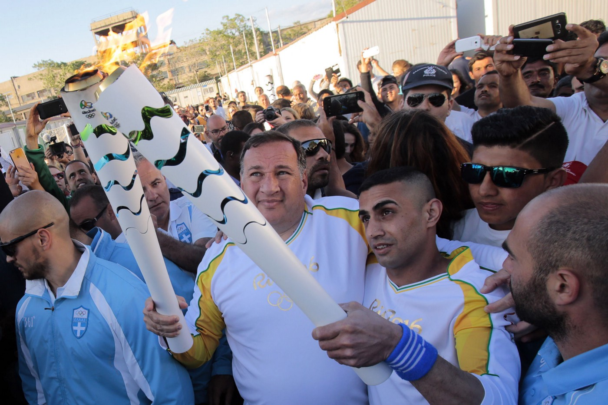
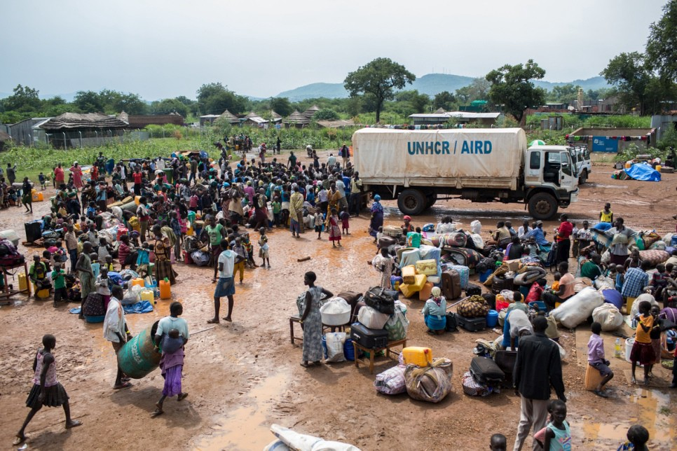
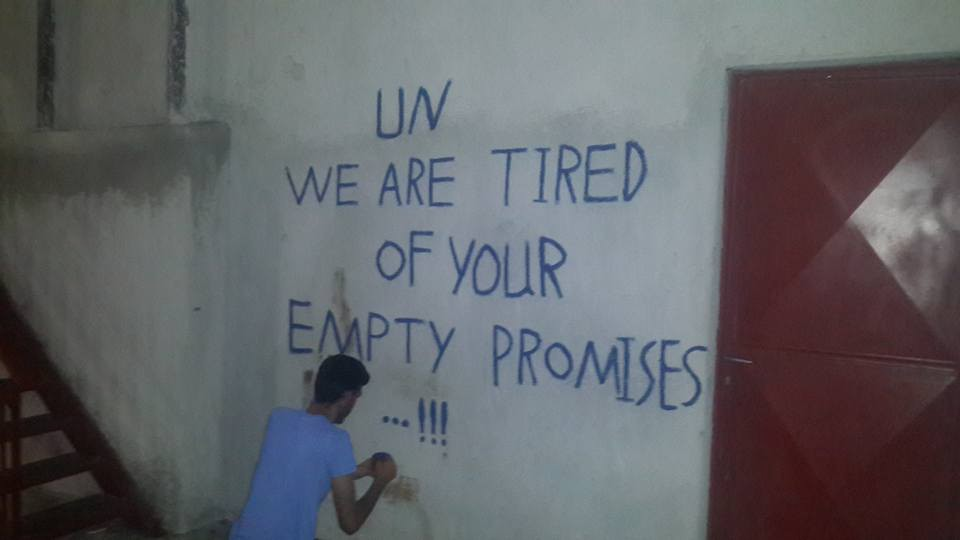

### \#WithWhom? Contextualizing Team Refugees\.

_by Kelsey Montzka_

Ibrahim Al Hussein\. Photo Courtesy of IOC

A refugee dingy is pushed onto a Greek island as a small wave slops up against the side of an Olympic pool\. A man running with a rifle towards a barren\-looking camp cuts to training footage of one of the athletes\. A shadowed rifle discharges, swimmers dive into their race\. This video, it says, is what Team Refugees is about — that no matter what, there can be a future\.

For the first time, a team of ten refugees are competing under the banner of The Olympics to represent the refugee community and to raise awareness of the global refugee crisis, mostly, it seems through a series of slick advertising campaigns similar to this video\. Compelling to say the least, but no amount of emotional gut\-punches can deflect from the uncomfortable reality of Team Refugees\.

[#TeamRefugees: Champions against all odds](http://www.youtube.com/watch?v=_-9y7oYW5lk)

UNHCR played an integral role in helping the International Olympic Committee \(IOC\) bring the athletes to the games\. In the case of the South Sudanese athletes, they were selected after representatives from the Tegla Loroupe Peace foundation [identified potential competitors during trials held at Kakuma refugee camp](http://allafrica.com/stories/201608040219.html) \. The qualifiers then trained at an off\-site camp\. UNHCR was involved throughout the process, and it is impossible to ignore that the UNHCR logo or insignia feature prominently in much of the promotional material, which introduces a problematic undercurrent\.

> UNHCR is an organization primarily responsible for supporting displaced peoples\. Surely capitalizing upon these athletes’ prowess and sufficiently “tragic yet inspirational” backstory comprises no small conflict of interest\. 

Refugees, displaced peoples, and asylum seekers are in a traumatic and vulnerable state\. Although these cases are being portrayed as a powerful “hand up” as opposed to a hand out, it cannot dismiss the problems of having an agency that is benefitting from the images and successes of vulnerable individuals also be the same agency that protects them from exploitation\.

With this foundation, the language used for promoting Team Refugee also reflects a cavalier disrespect that borders on exploitation\. The caption for the referenced ad campaign runs as follows:

> “Because those driven from their home are also driven to achieve\.” 

It’s hard to exactly pinpoint where the innocent drive for kitschy, catchy marketese ends and where gross disrespect begins\. The deeply disturbing experiences of the refugee community become retrofitted with some [Carpenteresque](https://www.youtube.com/watch?v=p35JDJLa9ec) mélange of “boot\-straps” ideology and inspiration porn\.

International Olympic Committee \(IOC\) President Thomas Bach further solidified this distressing connection in remarks during the introduction of the athletes selected for Team Refugees: [“These refugee athletes will show the world that despite the unimaginable tragedies that they have faced, anyone can contribute to society through their talent, skills and strength of the human spirit\.](https://www.olympic.org/news/refugee-olympic-team-to-shine-spotlight-on-worldwide-refugee-crisis) ”

**Because _that_ was everyone’s concern — whether or not people affected by war, oppression, and ethnic cleansing can sufficiently contribute to society\.**

This bizarre fusion was also reflected in President Barack Obama’s tweet on the team:

Other media are fraught with disempowering language like “ [From Helplessness to Hope](https://www.theguardian.com/sport/2016/aug/05/helplessness-rio-hope-olympic-refugee-team) ” or, again from the video, “Instead of running from something, now there’s something to run towards\.”

> The cruel irony of this recycled metaphor of running and flight is that the real crisis facing the majority of the refugee population world\-wide that they are not moving at all, instead are limited to waiting in refugee camps as large NGO partners slowly filter through applications\. 

President Bach returns _again_ with another casually insensitive remark in his welcome to team refugees at the opening ceremony of the Olympics in Rio: “ [In this Olympic world…we welcome you as an enrichment of our unity in diversity](https://www.theguardian.com/sport/live/2016/aug/05/olympics-opening-ceremony-rio-2016-live?page=with:block-57a54772e4b03b51a99e067a#block-57a54772e4b03b51a99e067a) ” singlehandedly othering refugees and pointing out that their purpose is to enrich the “us\.”

Doubtlessly, UNHCR and the IOC have been investing no shortage of man\-hours into finding the best angle for promoting Team Refugees\. It is exceptionally disturbing that these remarks were not flagged for their tactlessness, especially given the urgency of bringing Team Refugees to Rio to raise awareness\.

On the field and in seminars given by former humanitarian aid workers, volunteers are regularly, and rightly, chided for their distribution of “humanitarian selfies\.”

> Many photos by volunteers and professionals alike are exploitative and serve nothing but the ego and image\-building interests of volunteers themselves rather than those they are “helping\.” 

These practices directly conflict with the foundational “Humanitarian principles” that guide the actions of humanitarian aid workers\. Yet there is surprisingly little criticism of including deeply troubling imagery in ad campaigns or dehumanizing language in welcoming Team Refugees\. What criticism of it there is will be predictably silenced with the tired arguments explaining the “need” for distributing the photo of Aylan Kurdi\. Stop being such a nitpicker and get the bigger picture\. It’s for the greater good — raising awareness\!

But raising awareness of what, exactly? The “actionable outlet” provided by UNHCR campaigns include [signing an online petition](http://www.unhcr.org/refugeeday/) , with, of course, the chance to sign up for more UNHCR mailing lists, that will be delivered “to the United Nations headquarters in New York ahead of a meeting of the General Assembly of the United Nations, 19 September 2016\.” At this summit, world leaders were going to discuss a UN plan to resettle 10% of the world’s refugees; however with western European countries as well as the U\.S\., Russia, India, and others, [essentially gutting the plan on August 2nd](https://www.euractiv.com/section/global-europe/news/eu-us-reject-un-plan-to-resettle-refugees/) , the document, which was still adopted after these changes, is mostly meaningless\.

Although the narrative of “The Refugee Crisis” in popular media is largely limited to that of the European Refugee Crisis, it is imperative to understand that the actual refugee crisis spans far beyond this\. As mentioned before, much of the “crisis” revolves around a _lack_ of movement\.

Distribution for South Sudanese Refugees at Ugandan\-South Sudan border\. Photo Courtesy UNHCR

Five of the athletes are from communities that have been enduring a longer, more stagnant crisis\. James Chiengliek, Yiech Biel, Paulo Lokoro, Rose Lokonyen, and Anjelina Lohalith all hail from South Sudan but were all residing in the Kakuma refugee camp in Kenya, which is slated for closure \. [Kakuma was first opened in 1991 and is home to nearly 190,000 people](https://en.wikipedia.org/wiki/Kakuma) \. More and more reports trickle out of Kakuma and its “sister” camp Dadaab, which holds nearly twice as many people, [of sexual assault and other abuse](http://www.ibtimes.co.uk/string-rapes-kenyas-kakuma-refugee-camp-forces-communities-set-vigilante-groups-1567694) as the under\-served camps have stagnated over time\. Both camps are administered in partnerships with various Kenyan governmental organizations and UNHCR\.

This is, perhaps, the most prominent criticism one can have for the narrative around Team Refugees\. It may do some short term awareness raising of the plight of around 65 million people around the world; however, what it will most certainly do is redirect attention\. Despite the feel\-good message, the Olympics present a well\-timed opportunity to deflect criticism from UNHCR’s handling of the refugee crisis\. As of April 30th, [the current coffers for UNHCR top over two billion US dollars](http://www.unhcr.org/575e74567.html) , with warnings that UNHCR may need more money to support their programs involved in managing the refugee crisis\.

Although other INGO and local NGOs are also involved, many of these entities are funded through UNHCR partnerships\. At a glance: [“UNHCR work\[s\] to ensure that everybody has the right to seek asylum and find safe refuge, having fled violence, persecution, war or disaster at home\.”](http://www.unhcr.org/about-us.html) They maintain the primary monopoly on administering care and support\.

However UNHCR’s access is contingent primarily on the good graces of the countries that host them, making these efforts to “ensure” largely defunct should there be a conflict between these rights of the people and the interests of the host country\. This spring, UNHCR [according to a detailed report by The Syria Campaign](http://takingsides.thesyriacampaign.org/wp-content/uploads/2016/06/taking-sides.pdf) , was criticized along with other UN agencies of a lack of neutral practice in aid distribution in Syria\.

> In conversations regarding stakeholders, although “beneficiaries” are always included as a topic, it would seem that responding to the needs and requests of those being cared for takes a back\-seat to the interests of donors and government representatives\. The realpolitik of humanitarian aid\. 

Across the Balkan route, refugees and volunteers report multiple cases of “neutrality” bordering on complicity in state efforts to “evacuate” refugees from camps like Idomeni in Greece\. A cruel juxtaposition occurring as the forcible eviction occurred shortly before the much\-hailed World Humanitarian Summit, which prominently featured the role of the UN and other related programs of the UN in “solving” the crises of our time\. As pre\-registration in Greece for refugees creeps forward, deadlines and due dates being pushed into the far future, many of those stranded in camps may care little for this so\-called “profound symbol of hope\.”

Oreokastro Camp\. Photo courtesy of Rezan Boyraz

It is beyond question that UNHCR serves an integral role in supporting refugees worldwide, and many employees have proven their selfless dedication to protecting and upholding the rights of refugees\.

> The system cannot be reformed without the action of those inside it, and many UNHCR employees, former and present, are some of the strongest advocates for reform\. 

But in the broader context of reports of overreach, inaction, and abuse of authority, the monopoly and promotion of Team Refugees by UNHCR presents a very cynical image\.

This Olympics, by all means, cheer for Team Refugees, but recognize that this is only the start of our action\. And furthermore, recognize that action without context can often do more harm than good\. Advocate in your local government to support refugee initiatives\. Push for further transparency in organizations of ANY size that are supporting refugees\. Educate yourself on the political context precipitating the need to flee\. These are some of the ways we can take our support from watching flickering images on screens to planting them in our hearts, and in this way, we will truly be \#WithRefugees\.

_Kelsey Montzka originally hails from Boise, Idaho where she first got involved in refugee integration projects\. She moved to Serbia in 2014 through the Fulbright English Teaching Assistantship program and currently studies English Linguistics at the University of Niš, having volunteered in the refugee crisis throughout Serbia and assisted in online coordination efforts since 2015\. Her work has been published on [Balkanist](http://balkanist.net/instrumentalization-of-the-refugee-crisis-in-the-balkans/)_

_Converted [Medium Post](https://areyousyrious.medium.com/withwhom-contextualizing-team-refugees-bfb447ed817b) by [ZMediumToMarkdown](https://github.com/ZhgChgLi/ZMediumToMarkdown)._
