### AYS Daily News Digest 9/8: “Illegality”, “asylum process”, “assisted return” and other ills of our age

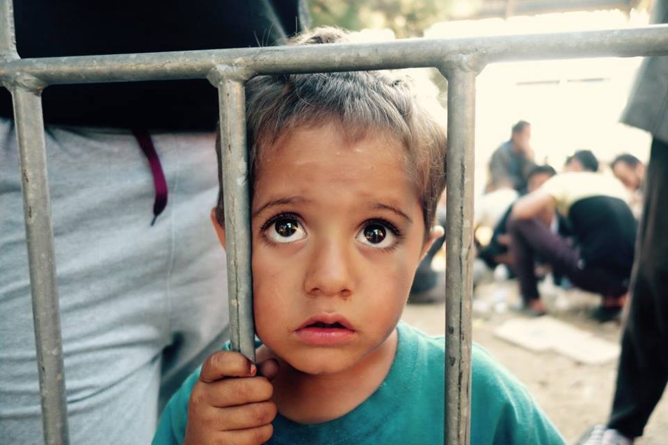

One of the Belgrade’s youngest refugees\. Credits: Info Park
#### General
### A rumour on impossibility for relocation for post March 19th arrivals is false\!

Nothing has changed in the law which makes people who arrived after 19 March not eligible for relocation\. The EU\-Turkey deal says nothing about cancelling the eligibility for relocation of people who arrive after 19 March, and even if it did, it is not itself legislation so it cannot amend the Relocation Council Decision 2015\.

The primary source of the rumour which has been misconstrued into saying that people arrived after 19 March are not \*eligible\* for relocation is: “currently provision of information on the relocation scheme in the Hotspot is suspended for migrants arriving after 20 March”

Heads of EASO and GAS Chios told us absolutely clearly and repeatedly that as far as they understand people who arrived after 19 March are still eligible for relocation, they’re just not being informed about it or referred for it yet and they \(the EASO and GAS officials\) are not confident that countries of relocation will actually accept them, but those are procedural and political problems with it, not about legal eligibility for it\.

None of the official public information sources say anything about a cut\-off date for eligibility for relocation for applicants from countries of origin still on the eligible list for relocation\.

New relocation map and statistics show the slowness of the process

](assets/32fe03e20595/1*mYqquPYcjUkXjAudgjzZFg.png)

Credits: ‎ [**Mobile Info Team for refugees in Greece**](https://www.facebook.com/mobileinfoteam/)

](assets/32fe03e20595/1*5sNiBVSCEbLP0UmkAqj-Tw.jpeg)

Credits: ‎ [**Mobile Info Team for refugees in Greece**](https://www.facebook.com/mobileinfoteam/)
### The Global Health Film Festival is inviting submissions that are related to refugee health for a festival coming up in November

The Global Health Film Festival believes that film has the power to communicate stories, to stir emotions, to inspire, to encourage action and to redress inequities in health\. The primary objective of the Festival is to use film and media as a catalyst for discussion and change on global health issues\.

The deadline is Aug 15th\. The festival will be at the Barbican centre in London\. Please see [website](https://filmfreeway.com/festival/GlobalHealthFilmFestival) for more details\.
### Research: Lengthy asylum processes decrease employment among refugees

Read a [study](http://advances.sciencemag.org/content/2/8/e1600432.full#T1) that provides evidence about how one central policy parameter, the length of time that refugees wait in limbo for a decision on their asylum claim, affects their subsequent economic integration\.
### 2016 is set to be the deadliest year yet for refugees\. Why is no one talking about it?

At least 3,034 refugees have died in the Mediterranean since the start of this year — almost as many as the whole of 2015\.

According to figures revealed by the [International Organization for Migration](https://www.iom.int/news/mediterranean-migrant-arrivals-reach-251557-deaths-sea-pass-3034) , there has been an alarming surge in the death rate on Europe’s shores\. Last year, 3,771 people in total are known to have lost their lives in the Mediterranean\. Only halfway through 2016, the current death toll is very close to surpassing this\.

“We are well on track to exceeding the total number of known deaths in 2015,” says Niels Frenzen, director at USC Gould School of Law’s Immigration Clinic, in an [interview with Al Jazeera\.](http://www.aljazeera.com/news/2016/07/desperate-journeys-3034-refugees-die-months-160730100626791.html)

Yet, no one is talking about this\. Or at least this tragedy is no longer front page news — despite the alarming increase in fatalities\. In May this year, [700 people drowned in the Mediterranean in just three days\.](http://www.aljazeera.com/news/2016/07/desperate-journeys-3034-refugees-die-months-160730100626791.html)

Rewind to last summer and [the headlines were flooded with news of the refugee crisis](http://www.bbc.co.uk/news/world-europe-33972632) — if not always for the right reasons, with journalists reporting on the unprecedented chaos as well as the human tragedy on Europe’s borders\. The publication of the photo of Alan Kurdi, a Syrian toddler washed up on the coast of Turkey, triggered a swell in outrage and compassion\. Yet now, the world is largely silent\.
#### Syria
### Online doctors needed to help the injured in Aleppo

Dr [Shajul Islam](https://www.facebook.com/shajul.islam.31392) , who is currently in Aleppo, and [One Nation](http://www.OneNationUK.org) are looking to form a WhatsApp group for international doctors and locals of Aleppo, where the injured could send their questions and queries to doctors in the group\.

If you know any doctors who can help, please ask them to contact:

07886582531

01924856923

[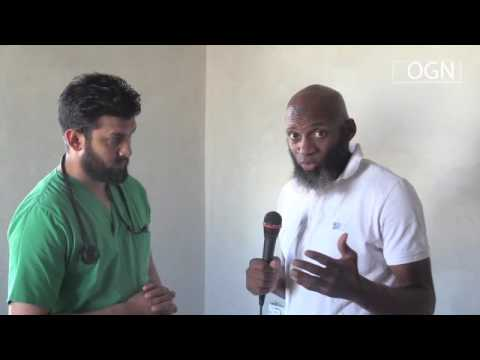](http://www.youtube.com/watch?v=G-y-hGszWEg)

### Phosphorus bombs, which are an ILLEGAL weapon of war, continue to kill people in Idlib city

These bombs are causing many more men, women and children to flee\.

](assets/32fe03e20595/1*uQE_cRmcys35SQd4Rv8CYQ.jpeg)

The destructive power of Poshphorus bombs\. Credits: [**Faces of Change**](https://www.facebook.com/FofCChangemakers/)
#### Turkey
### What happens to Syrians if they choose to return from Greece to Turkey under Assissted Voluntary Return program?

This information is intended for Syrian asylum seekers in Greece who are considering opting for the Assisted Voluntary Return scheme to go back to Turkey, either with the intention to stay in Turkey or in order to return to Syria\. Non\-Syrians experience a very different legal situation in Turkey\. Other nationalities have the possibility of Voluntary Assisted Repatriation \(to their countries of origin\), which is not possible for Syrians\.

It is your decision whether to opt into the assisted voluntary return scheme, but we believe that for your choice to be truly ‘voluntary’, you have to understand first what both options mean for you in the long\-term\. The decision to return to Turkey is almost certainly irreversible and will affect you for the rest of your life, and also your children’s lives\. Please make sure you are clear in your own mind before you request voluntary return that you are not just deciding this out of frustration or despair about how you have been treated the last few months or how you think the next few months or even the next couple of years may be\.

Read here about your rights and situation under the Assisted Voluntary Return:
[In English](https://docs.google.com/document/d/1j3YFzx6Szh1nA-Xdfx7VjazFkJjuAAVYrcukhgg7KJQ/edit) 
[In Arabic](https://lookaside.fbsbx.com/file/WhatHappensToSyriansWhenTheyReturntoTurkey-Arabic.docx?token=AWz14AkiDWACxH7bcZFvOc8IJY-8nov4sbB1toTT6hBH2fmdZyyMl3b-mSJhwsv1hxpTUXHiezrb1bkFGy58SzTPCeBlebF2oDfmRgjx8DflqBW3ZQDcsEP55GgQKrdXXNWu3CQyP6yLw8LjmyK17w5s)
#### Greece
### Arrivals summary report

View [here](http://media.gov.gr/index.php/%CF%85%CF%80%CE%B7%CF%81%CE%B5%CF%83%CE%B9%CE%B5%CF%83/%CF%80%CF%81%CE%BF%CF%83%CF%86%CF%85%CE%B3%CE%B9%CE%BA%CF%8C-%CE%B6%CE%AE%CF%84%CE%B7%CE%BC%CE%B1/summary-statement-of-refugee-flows-09-08-2016) \.
### Lesvos arrivals report

One boat with 34 people was picked up in the north and brought into Mytilene harbor\. People were transferred to Moria by port Police\.
### Cross\- Aegean journeys are increasing

According to data provided by the Greek government, a total of 126 migrants and refugees crossed the Aegean between Sunday and Monday morning, which was higher than the average of around 80 on previous days\.

The majority of new arrivals landed 99 on Chios, while 27 reached Samos\.
### Donate a SIM card\!

[Call](https://web.facebook.com/groups/204202716585823/permalink/324630621209698/) for volunteers to donate the SIM cards they leave behind when they leave Greece after their period of volunteering\. Donation would be really helpful, especially for work with unaccompanied minors\.
### Refugees from Soxtex camp walked to the centre of Thessaloniki to demonstrate the poor conditions of life in Greece

Watch a video of sit\-in demonstration here:

The protesters agreed to return to Softex upon the police intervention\. However, the police left the protesters to wait for transportation for several hours in the pouring rain, thus showing their inconsiderate attitude towards the refugees situation\.

There were about 130 protesters\.
### Yazidi rights activists and a former prosecutor of the International Criminal Court visited Yazidi refugees in a northern Greek camp Monday, hoping to build a case for the Hague\-based court

About 1,300 Yazidis live in the camp near the village of Petra Olympou under Mount Olympus\. They fled attacks in Iraq and Syria from the Islamic State group, which killed thousands and enslaved thousands more, mainly women and children\.

Luis Moreno Ocampo, who was the court’s first prosecutor, said Monday that this visit is very important for members of the Yazidi minority that the world recognizes them as victims of genocide\.
### Greece plans more apartments for refugees

A Greek cabinet official for immigration says the government is planning to substantially increase apartment housing for the 57,000 refugees and other migrants trapped in the country\.

Deputy Defense Minister Dimitris Vitsas, who heads a task force on migration, said Tuesday the government wants to close or improve many of the state\-run refugee camps on the mainland\.

Fewer than 7,000 people now live in apartments or hotels, well short of the initially targeted 20,000\.

Vitsas also announced plans to alleviate congested conditions at island camps, which have housed all new arrivals since a European Union\-Turkey deal in March\.

About 10,000 people are in the island camps, in conditions criticized by humanitarian organizations\.

Vitsas said refugees who have completed the first stage of their asylum application can move to the mainland\.
#### Serbia
### A direct report from volunteers helping refugees in Belgrade parks

> This was one of those special days in the park and our pictures say it all\. Just a perfect day, almost like in a Lou Reed song: a nice weather, lots of families, less worried faces than usual, more smiles, happy children everywhere, relaxed boys\. It looked like people left all the dark thoughts and memories of bad experiences from the road somewhere behind\. Almost like a summer holiday, especially under the pines behind Info Park\. 

> We had a plenty of people and hands full of work, but everything was easy and smooth — we loved it\. Some needed a doctor, some food, some juice or water or tea, some just a friendly chat\. Our volunteers Manuela and Sandra were all over, just as Abdol, Brankica, Tijana, Irena, friends from RAS, JRS and whoever came to us\. 

> Today Info Park and IRC provided more than 30 tickets for the refugee travel to various refugee aid centres or camps in Serbia\. It was our record high in August but we are happy that these families will sleep tonight in a bed and under a roof\. 

> A hero of the day was a proud father of a 5 months old baby boy born in Greece\. We are not sure if he’s aware that the baby boy is already a citizen of Europe but anyway, our respect goes to this proud man for taking all the parental duties from his partner\. This family is ready for Europe\. 

> Other two European heroes of the day were two young Afghan men who bought mountain bikes in Greece and made it all the way to Belgrade in a fully enviromental way, plus for a fraction of the cost they would pay to a smuggler\. If we would be a German Embassy, these two would get all the EU papers immediately\. 

> Actually, now we remember what is the news of the day — a fence is slowly but surely falling apart\. At some parts of the park, it collapsed under the weight of children playing around it\. Still, big parts of the park are still fenced but we believe it’s a matter of time when the park will be free again\. 

> We apologize to everyone oversensitive to the pictures of refugee kids but aren’t these great? So why not, especially since none of the them are made without a nod from the parents\. 

> Enjoy, just like us, and please be patient, make it through the whole photo reel, it’s worth it… 

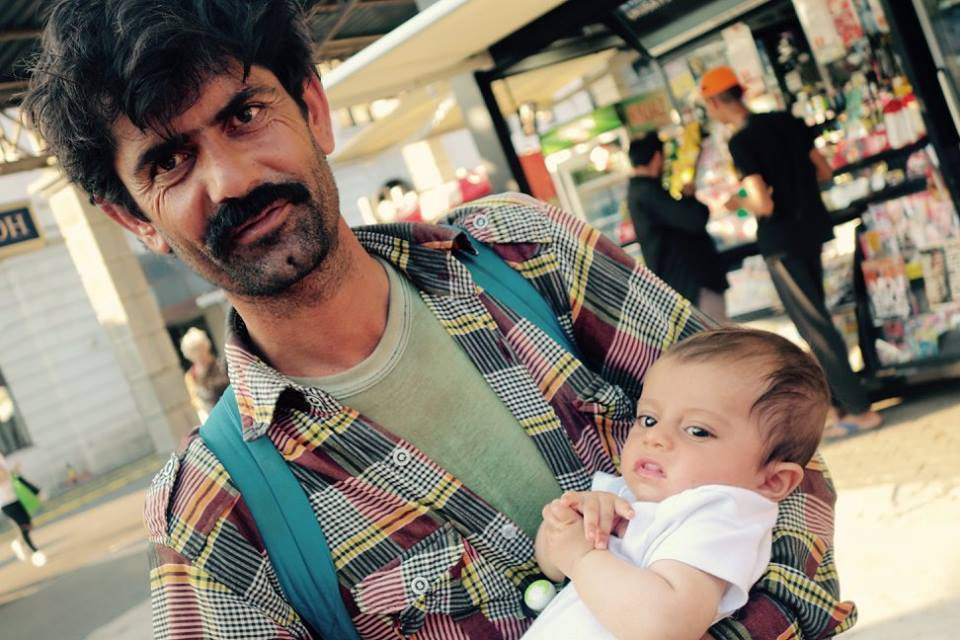

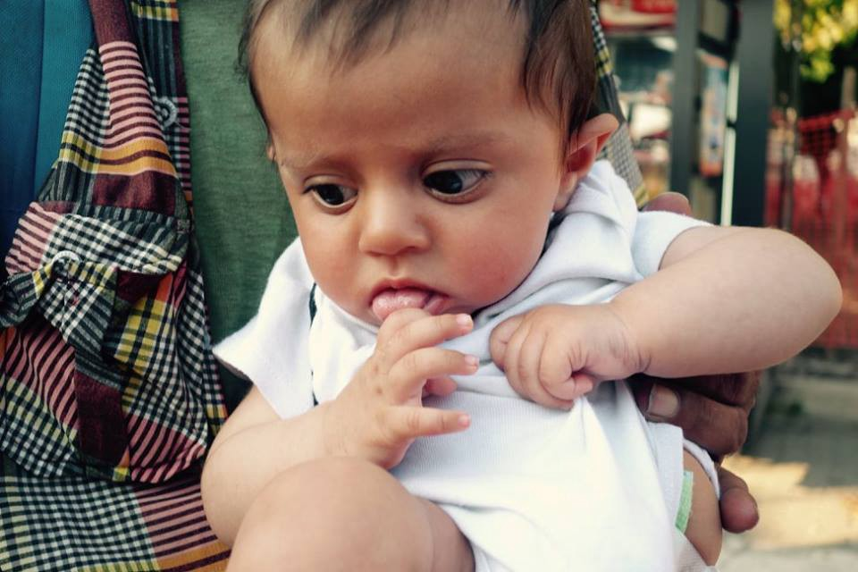

Father with a baby born in Greece\. Credits: Info Park

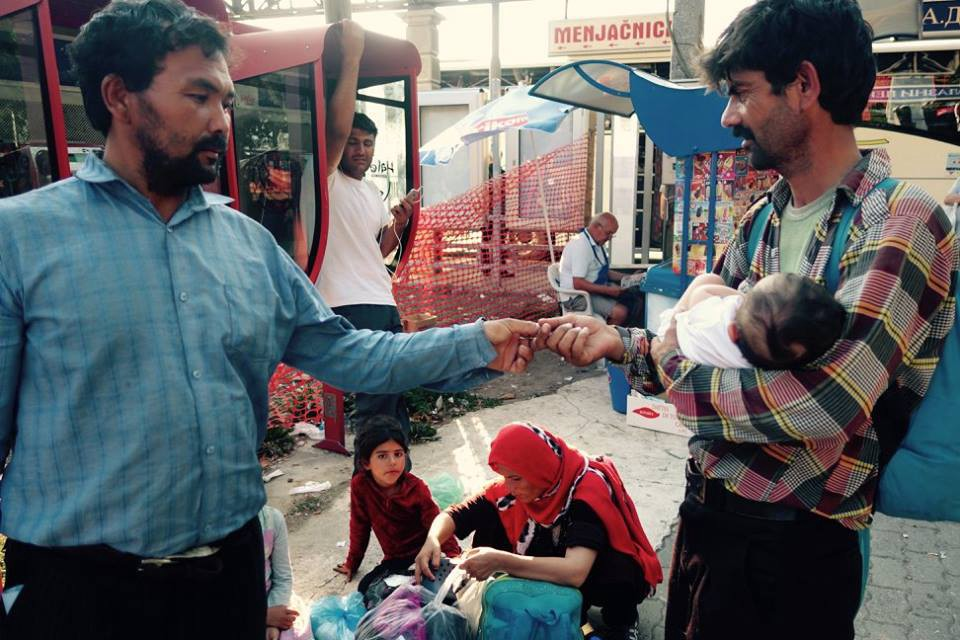

Credits: Info Park

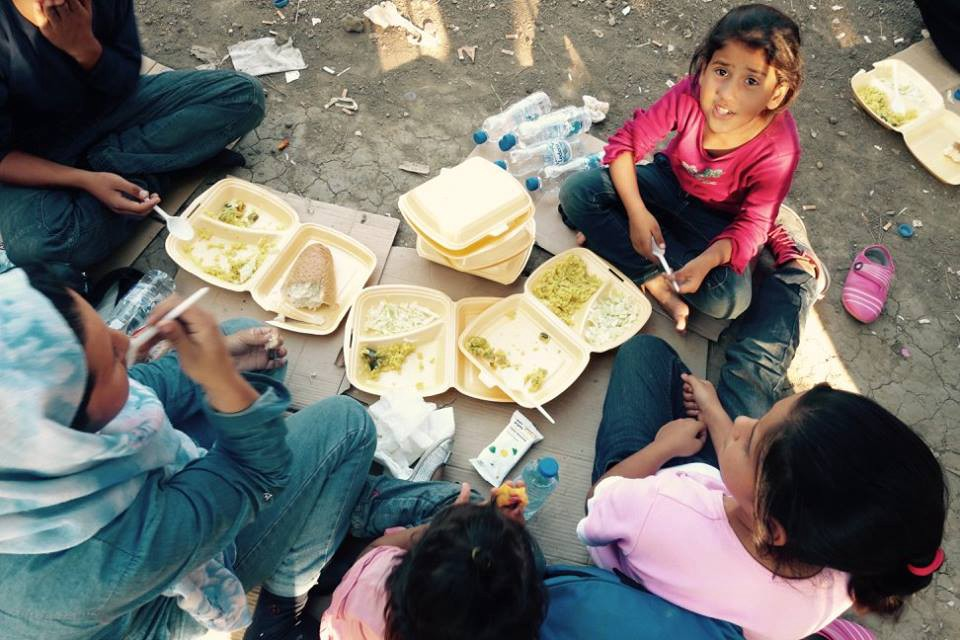

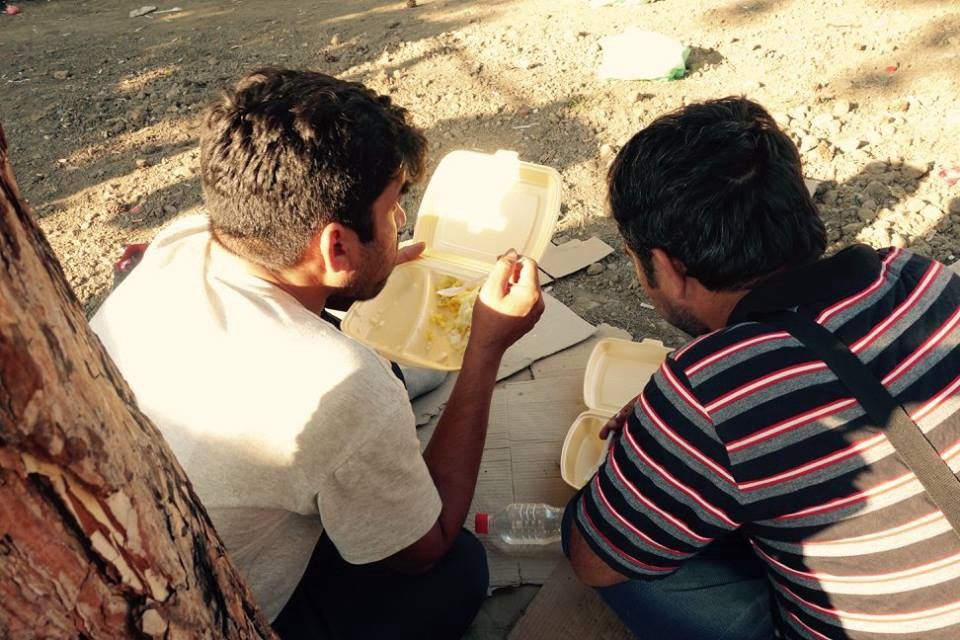

Lunch time\! Credits: Info Park

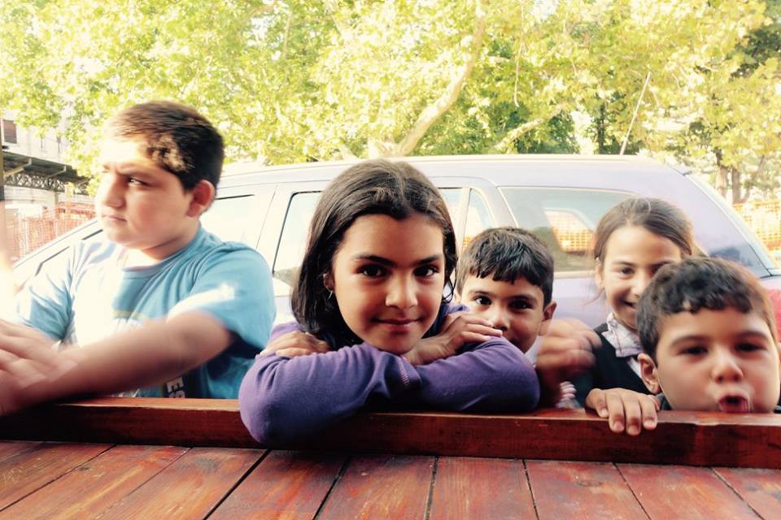

Credits: Info Park

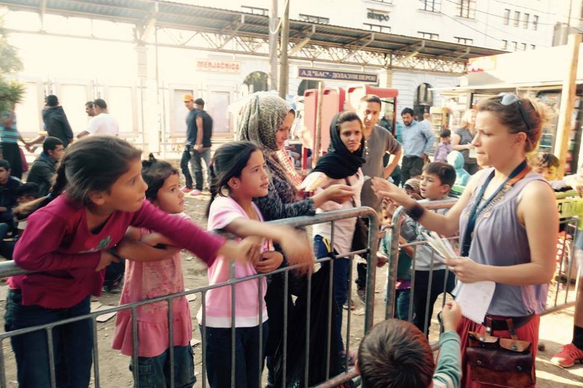

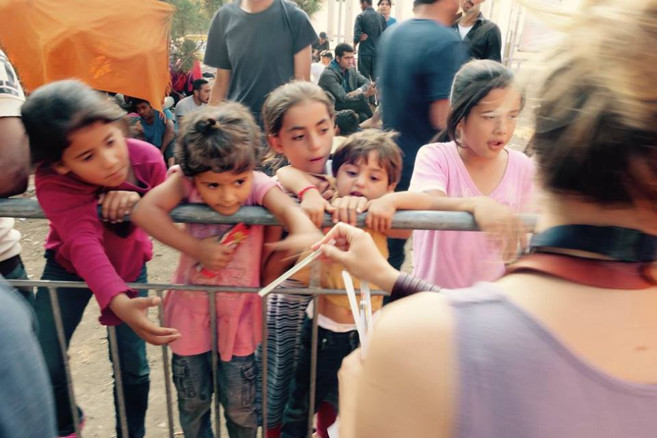

Colouring time\! Credits: Info Park

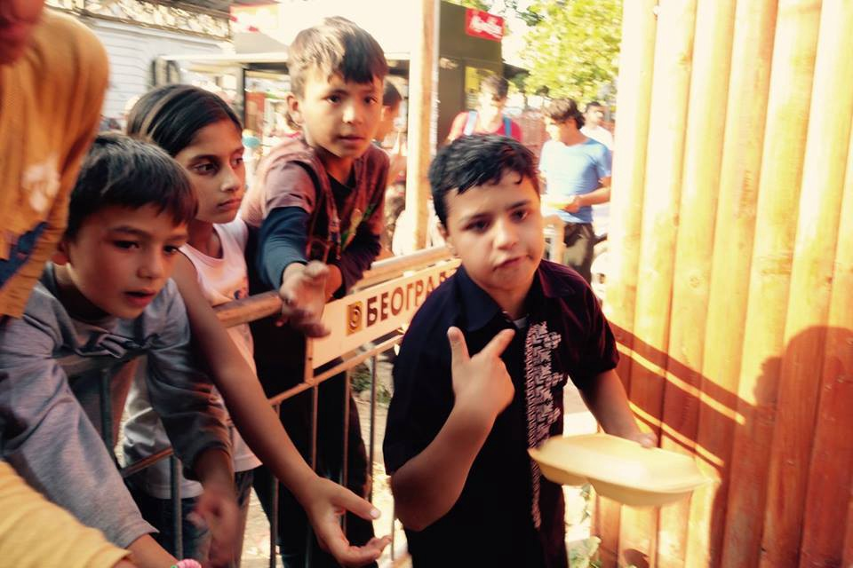

Credits: Info Park

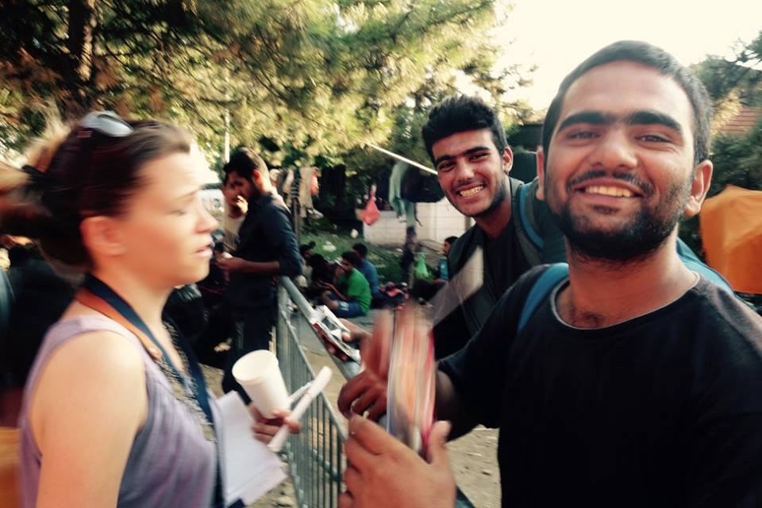

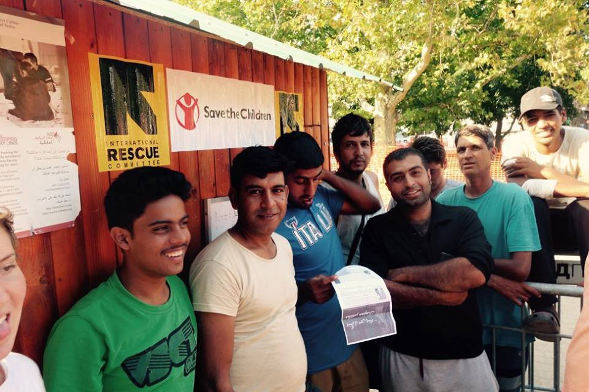

Credits: Info Park

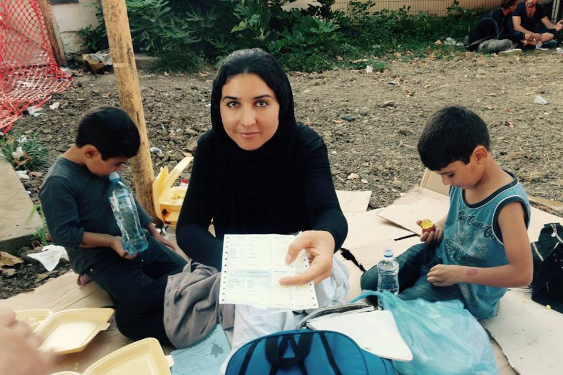

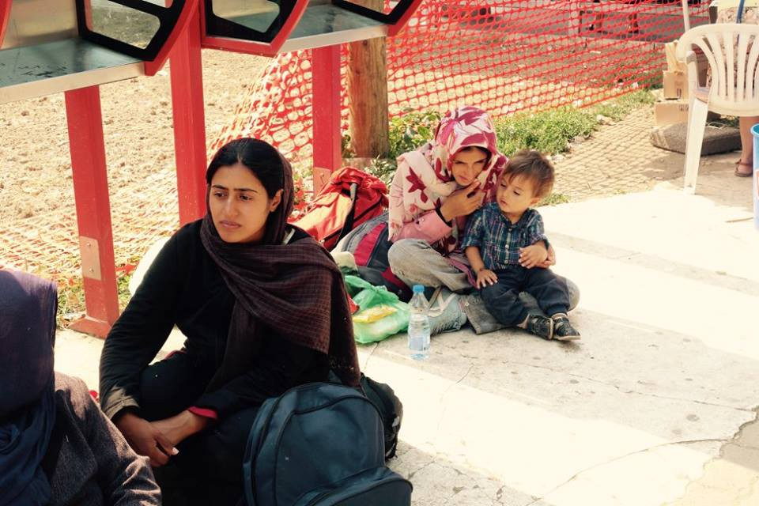

Credits: Info Park

Donations\. Credits: Info Park

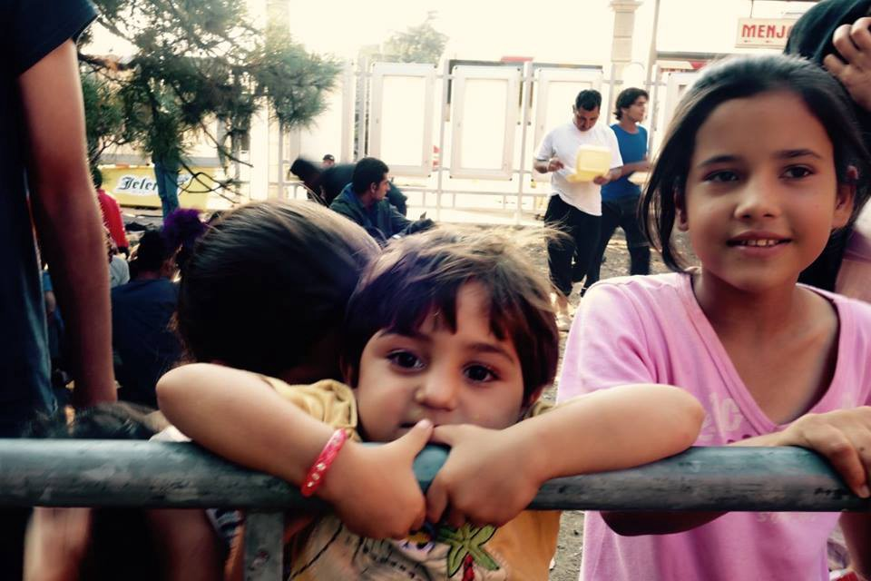

Credits: Info Park
### Is this the Europe refugees hoped for? See the refugees’ life at Kelebija

](assets/32fe03e20595/1*TnKEzC_Af6lKid7wtukL4A.jpeg)

Credits: [**Natali Ja**](https://www.facebook.com/natali.ja.7737)

](assets/32fe03e20595/1*uF6_n08EFEz8SkIl1OFXow.jpeg)

Credits: [**Natali Ja**](https://www.facebook.com/natali.ja.7737)

](assets/32fe03e20595/1*SawxYVXF0ktM5vN3pEQK9g.jpeg)

Credits: [**Natali Ja**](https://www.facebook.com/natali.ja.7737)

](assets/32fe03e20595/1*_T50m6AFmWYAQmZgISqqAw.jpeg)

Credits: [**Natali Ja**](https://www.facebook.com/natali.ja.7737)

](assets/32fe03e20595/1*X90Jcah8uacSM-JB8JjPSg.jpeg)

Credits: [**Natali Ja**](https://www.facebook.com/natali.ja.7737)

Donations are urgently needed, and their lack is the biggest problem at Kelebija border passage\. EVERYTHING is needed\! From clothes to hygiene products, from baby carriers to tents\. Please contact [**Natali Ja**](https://www.facebook.com/natali.ja.7737) if you can help\.
#### Germany
### Germany turned away 50 percent more people at its border in the first half of 2016 than in the whole of last year

Despite Angela Merkel’s supposed “open door policy” on refugees, new government figures show more people are being turned away at Germany’s borders\. Deportations, particularly of large groups, are also rising\.

Germany turned away 50 percent more people at its border in the first half of 2016 than in the whole of last year, according to government figures released on Tuesday\.
Border control officers stopped some 13,324 people from entering the country up until the end of June, compared to 8,913 in 2015, the new Interior Ministry figures show\.

Germany also looks set to increase its number of deportations — with 13,743 in the first six months of 2016, compared to 20,888 in the whole of 2015\. The numbers suggest that the introduction of border controls in September 2015 and the increased pressure on local authorities to deport more migrants from Interior Minister Thomas de Maiziere has started to show results\.

The new figures come in response to an official information request from Bundestag member Ulla Jelpke and other members of the Left party, who condemned the government’s policies as “irresponsible,” as it meant more people were facing return to crisis\-hit regions\.

The number of collective deportations were particularly alarming for Jelpke\. “In Germany an inhumane mass\-deportation practice has become increasingly established,” Jelpke said in a statement\. “The number of collective deportations has increased massively compared to the years before — its proportion of all deportations is now 74 percent\.”

“The EU and the \[German\] government can’t manage to sensibly coordinate the reception and processing of asylum applications, but when it comes to deportations, they outdo themselves,” she added\. “That is the opposite of humane asylum policy\.”

Jelpke also condemned Germany’s new asylum laws, introduced in three separate “packages” since last September, which have — among other things — made it easier to deport migrants\. Deportations are no longer announced in advance — which means that families are often woken in the early hours to be deported\. On top of this, health problems often no longer prevent deportations\.

This, opposition politicians claim, is part of a government “scare policy” — long bureaucratic waits, little job certainty, less opportunity to bring family members — designed to make it as difficult to settle in Germany as possible so that migrants leave the country voluntarily\. In fact, parts of the new asylum laws are specifically designed to introduce more integration opportunities, but nevertheless, Jelpke argues that most of the migrants leaving Germany are not really leaving voluntarily\. The figures show that some 3,322 Iraqis and 2,305 Afghans left the country voluntarily with government support\.

But a closer look at some of the entry denial figures — which have been broken down by country of origin and reason for denial — leads to other questions\. For instance, they show that some 4,912 Syrians, Iraqis, Afghans were turned away this year at Germany’s land borders, and in almost all cases the reason given was either the lack of a passport or the lack of a valid visa or residence permit\.

But this suggests that none of these people, apparently coming from war\-torn countries, asked for asylum, in which case they would have had to be allowed in as asylum seekers\. So what happened in these individual cases?

For this reason, refugee organization Pro Asyl — no fan of Germany’s asylum policy — argued that the new figures were not as meaningful as the Left party made it appear\. “We’re currently researching whether there were cases where we can prove that people were turned away and it wasn’t lawful,” a spokesman told DW\.
#### France
### Calais refugees painting their troubles out

Refugees located in Calais refugee camp have given a wonderful and much needed makeover to Care4Calais volunteers’ storage container\. Herewith, they also expressed many of their longings, sorrows, pains and hopes\. Check it out:

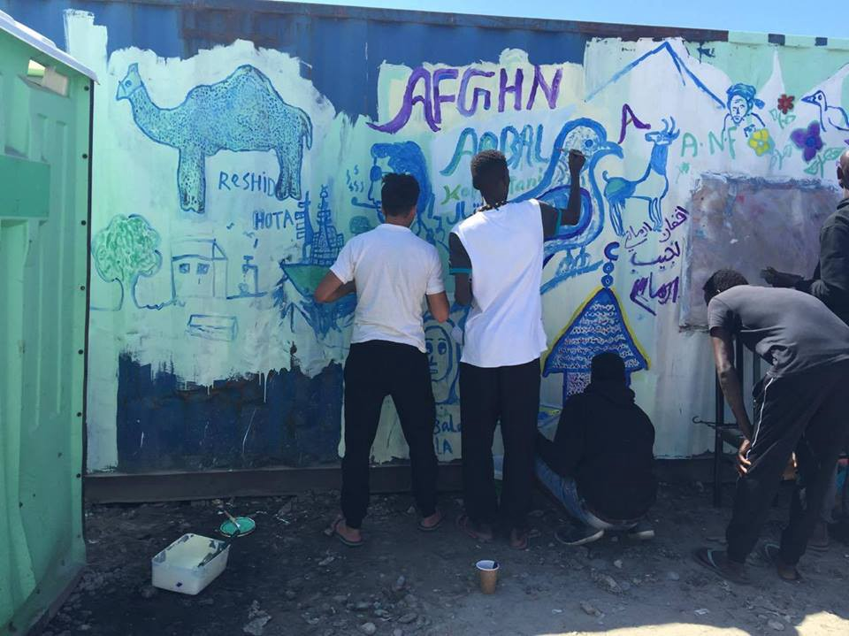

Credits: Care4Calais

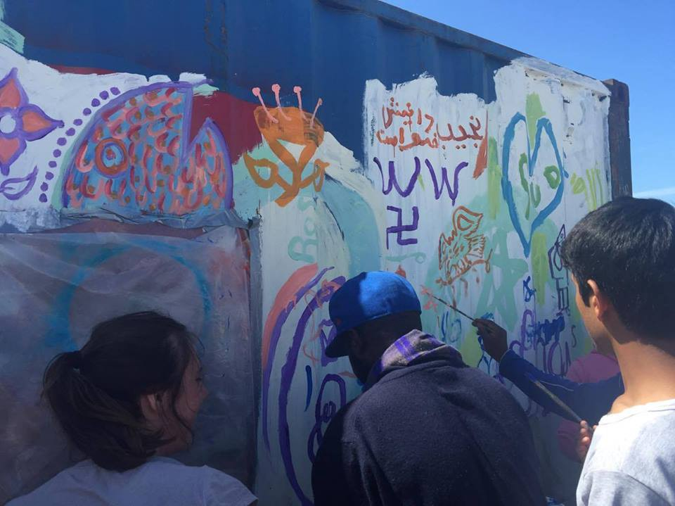

Credits: Care4Calais
### Court case against the demolition of the Calais shops and cafes to take place tomorrow, Wednesday, August 10th

The prefecture of Pas\-de\-Calais brought proceedings before the Administrative Court of Lille f [or the destruction of shops and restaurants](https://passeursdhospitalitesenglish.wordpress.com/2016/08/07/when-the-state-wants-to-destroy-the-shops-of-the-shantytown/) created by themigrants in the shantytown of Calais\. Also referred the Kids Restaurant, which provides free meals to 150 unaccompanied minors\. The hearing will take place tomorrow Wednesday at 8:30\.

**A [support](https://passeursdhospitalitesenglish.wordpress.com/2016/08/08/wednesday-august-10-in-lille-support-to-shopkeepers-in-the-shantytown/) [rally](https://passeursdhospitalitesenglish.wordpress.com/2016/08/08/wednesday-august-10-in-lille-support-to-shopkeepers-in-the-shantytown/) is planned at 8:30 am in front of the court, 5 rue Geoffroy de Saint Hilaire in Lille\.**

The decision on whether the shops and restaurants will be demolished is taking place on Wednesday morning\. If you have volunteered in Calais and can spare the time to write a handwritten testimonial before tomorrow about the important part you have seen the shops and restaurants play in the jungle, even if you can’t speak French, please message [Nadine Astroga](https://www.facebook.com/nadine.astorga.7?fref=nf) for details\. We need as many as possible in the next 2 days\. If you need a translation, let her know and she can organise one \(everything must be written in French\) \. You will also need access to a scanner as it has to be handwritten and scanned in\.
### Testiomony about Paris refugees from a volunteer

> We arrived in Paris not quite knowing what to expect, but as soon as we arrived we saw several hundred people sleeping on the pavements in full view of passers by, who turned away or carried on playing on their phones\.
 

> Two families, travelling together, had just arrived from Afghanistan\. Having survived the horror of the boat trip and a trek across Europe they now face sleeping on the streets of Paris\.
 

> The children, three girls and two boys, aged from 3 to 10 played and squabbled like normal kids, while their parents looked on exhausted\.
 

> We went to the shop with our contact Aref and bought food, water and sweets for the children\. 
 

> The children’s smiles when they were given Smarties and lollies was heartbreaking\. Worst of all was the eldest boy who stood pointing at the water\. He didn’t want sweets, he just needed a drink\.
 

> Aref, who is a refugee himself and works tirelessly, managed to find a room for one of the families but just for tonight\. 
 

> We have just heard that the other family, including the children, will be sleeping on the pavements tonight without even a tent\. 
 

> Remember this is Paris in 2016\. 
 

> We will be back out tomorrow, helping as much as we can\. Please continue to donate and share this page\. 
 

> The refugees in Paris feel forgotten\. 

See a [video](https://www.facebook.com/caitlin.cowan.10/videos/10153745304410808/)

School in Dunkirk camp has closed\. Why?

Edlumino school had been closed because the French state have offered school places for all children 5–12\. The organization previously providing education to kids is off to set up their amazing work in camps in Iraq and elsewhere; we all wish them the very best of luck\!

However the Dunkirk Children’s Centre remains open; and desperately needs volunteers\. It runs nursery sessions for 3–5 year olds, and play and activity sessions for 6–11 year olds\.

Volunteers need fluent English; some French would be good; and any Sorani would make you a very popular volunteer\. Experience working with behavioural and emotional problems is an advantage; but resilience and resourcefulness is more important\.

If you want to volunteer in the Children’s Centre \(a really vital role in camp\! \) please email dunkirkchildrenscentre@gmail\.com
#### Italy
### Fresh food for refugees at Via Cupa, Rome

The Rastaplatz touring kitchen will give its support by staying untill friday at Baobab Experience, cooking fresh meals for refugees\. Enjoy\!
#### UK
### The new Asylum Policy Instruction on [Sexual Orientation Issues in the Asylum Claim](https://www.gov.uk/government/uploads/system/uploads/attachment_data/file/543882/Sexual-orientation-in-asylum-claims-v6.pdf) , published last Wednesday, marks an unwelcome retrograde step for the UK Home Office

Namely, the Home Office continues to apply the ‘voluntary discretion test’ to gay asylum claims, even though this has been held to be unlawful, as a matter of EU law, since July 2015\.

Having made positive strides with respect to the quality of decision\-making since the public outcry over the sexually explicit methods of questioning gay asylum seekers in February 2014, in August 2016 this API will lead to sub\-standard and unlawful decisions by the Home Office, and arguably Courts and Tribunals who rely on the API, leading to devastating outcomes to those returned to countries where they will suffer persecution\.

Read more about the court cases [here](https://www.freemovement.org.uk/new-home-office-api-on-gay-asylum-claims-not-fit-for-purpose/) \.
### ‘Stubborn’ immigration detainees face solitary confinement

Liberty has written to the Home Office condemning unprecedented new guidance that would allow detainees at immigration removal centres to be placed in solitary confinement for being ‘stubborn’\.

The Detention Services Order sets out the first ever guidelines for Home Office staff on the use of solitary confinement within immigration removal centres — where those appealing deportation can be held indefinitely\.

The proposals allow for periods of segregation longer than 14 days and fail to safeguard against its repeated use — flying in the face of current rules and medical advice and risking permanent damage to detainees’ health\.

**Sara Ogilvie, Policy Officer at Liberty, said:** “Limitless immigration detention is a dark stain on our country’s human rights record\. Adding the cruel practice of solitary confinement to the mix is a grave injustice which risks causing serious harm to innocent and vulnerable individuals\.

“The UK Government should be ashamed at its failure to afford even the most basic dignity and security to those within its care\.”

_Converted [Medium Post](https://areyousyrious.medium.com/ays-daily-news-digest-9-8-illegality-asylum-process-assisted-return-and-other-ills-of-our-32fe03e20595) by [ZMediumToMarkdown](https://github.com/ZhgChgLi/ZMediumToMarkdown)._
