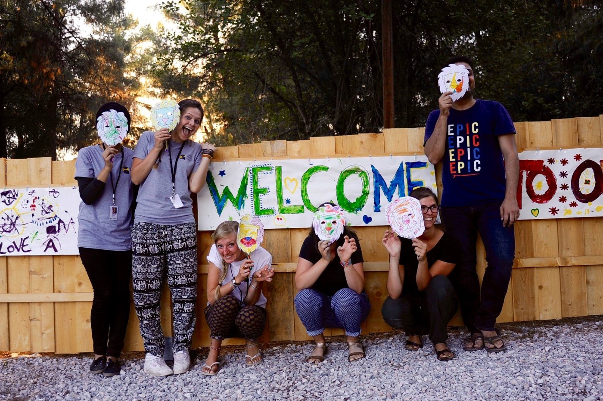
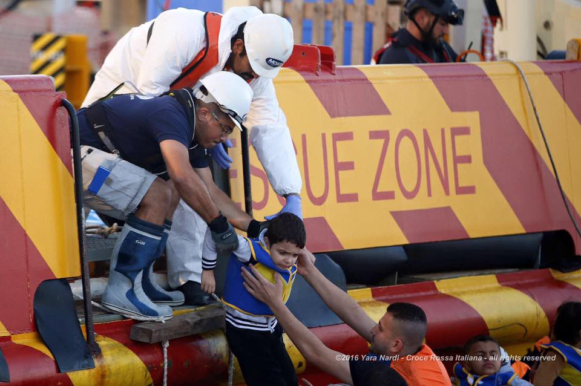
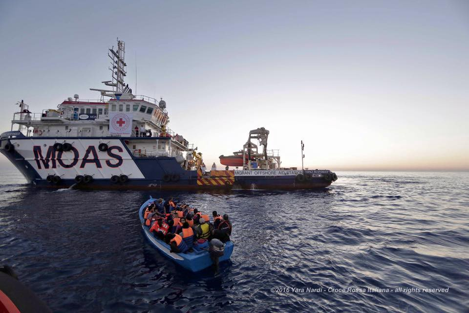
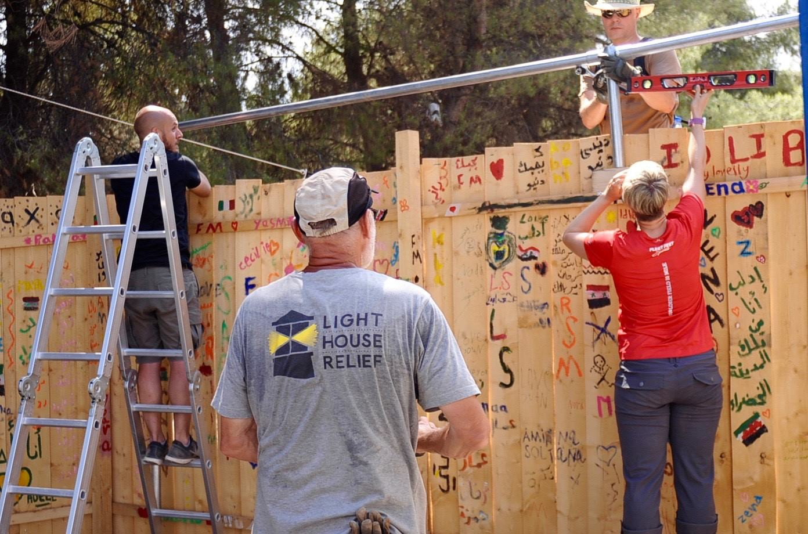

### AYS DAILY DIGEST 10/8: On average, 58 unaccompanied minors arrive to Italy every day

_While everybody expresses concern over the situation in Syria, little is done to stop the war\. Even less is done to stop the other wars that are going on, nor is much being done to improve living conditions in many countries where refugees are coming from\. Again, in huge number\. More people are registered in Italy, in Greece, all over the Balkans, and in the EU\. Not all have the same rights, according to human rights organizations\._

Lighthouse Relief volunteers take a break with masks created by children who attend the Child Friendly Space\. Photo by Madeleine Ball / Lighthouse Relief\.

_Syria_
### Civilians in Aleppo are in danger and they deserve peace

Just a couple of days ago, civilians in Aleppo were full of hope that the siege may end soon, or even that it ended\. However, today’s news is not good\. Attacks on civilians and civilian infrastructure continue\. This week, the city’s electric and water infrastructure was severely damaged, leaving over two million residents of Aleppo without electricity or access to the public water network\. Water is only available through wells and tanks, but it is not nearly enough\. The UN expresses its concerns, but nobody is really doing anything to stop the war\.

[The latest news about the Russian military’s proposal](http://www.aljazeera.com/news/2016/08/russia-declares-hour-daily-lull-aleppo-160810192646557.html) of a three\-hour daily freeze on fighting around Aleppo to allow humanitarian convoys is not enough\. The United Nations, which has earlier called for 48\-hour weekly pauses for the aid deliveries, said the three\-hour truce announced by Russia would not be enough to meet the needs of civilians in the war\-battered Syrian city\.

**](assets/e5315cc66279/1*P6M4VB9BjRV-Jo8FSMxRkw.jpeg)

**By [Real Progressives](https://www.facebook.com/RealProgressive/)**

Meanwhile, more people are forced to flee their homes and become refugees\.

_Mediterranean_
### Almost 500 people rescued from the sea

Today, almost 500 people were rescued at sea\. The first boat with 327 people was found in the central Mediterranean\. Another one was found with 169 people on board\. All are taken care of and safe\.

Brave people are saving lives every day\. Photo by MOAS\.

_Greece_
### Overcrowded islands

New arrivals are registered in Greece, too\. According to the volunteer’s network, this morning 31 people were picked up off the southeast coast of Lesvos, and 65 arrived on Chios\. Everybody is safe now\.

Greek islands are becoming once more overcrowded\. Currently, there are 10,042 refugees on islands, even though capacity is 7,450\. According to government data, the overall number of refugees in Greece is now is 57,098\.
### Important news for those who want to live in official camps

[News that Moves reports today](https://newsthatmoves.org/en/moving-to-an-official-camp-in-greece/) that asylum seekers and refugees who want to be hosted in official camps can do so by going directly to an organized camp\. The Coordinating Body advises people to check if there is available space at the camp they’re interested in before moving in\. They can do so by going to Twitter, where there is a daily update on space available at all organized camps\.
### Lack of basic care

Refugees who are in camps are still facing many difficulties due to unbearable conditions and lack of basic care\. Today, we were informed that one person from Basilica camp has been hospitalized after feeling dizzy\. Living in camp in this heat is impossible\. It could be better if those responsible take care of persistent food quality problems, provide refugees with water, and offer basics supplies\.

Chios is another place where living conditions are dire\. This is a [personal account of one volunteer](https://www.facebook.com/izzy.ellis/posts/10153855450703481?hc_location=ufi) about boat arrival in Chios\.

> “Today on Chios we spotted a boat that was filled with refugees, trying to make the dangerous crossing from Turkey\. We soon realized it was in difficulty and followed it for four hours nearly to the end of the land\. The authorities were repeatedly called and asked to pick it up\. They did not, despite being aware that it was adrift and in serious danger\. 

> There were 9 children onboard this boat\. Even worse, a team of rescuers was prevented from going to save them\. After the boat was nearly away from land and completely out to sea, they eventually went to collect the people\. 

> When they were brought to the port, the doctors were told they could not go to them and check their health; they were sopping wet, cold and shocked; our teams were not allowed to provide our small food parcels, dry clothes, information or simply reassure the people\. 

> I watched thirty people board a bus after being stuck out to sea; scared for their lives \(and rightly so\); be refused medical checks, food, clothing, information, or any kind of humanity\.
 

> Children who were almost too scared to walk properly, women who looked terrified, and men in utter disbelief\.
 

> The Europe many of you imagine, with its democracy, its human rights is a farce; it’s not real — it’s instead a complete disgrace\. Your governments who condemn regimes abroad are willing to do anything to keep a totally illegal deal with Turkey, to let people drown and prevent people who are long\-term victims of their disastrous foreign policy from even receiving healthcare, food, or dry clothes\. 

> The question is what will you do? Please, if you have humanity, you will do something\.” 

### Volunteers in action

Volunteers are doing their best to help refugees in need all over Greece\. But they need help\. [Lighthouse Relief is looking](http://www.lighthouserelief.org/volunteer) for a regional coordinator, gender\-based violence protection officer, and child protection officer, as well as skilled volunteers\.

> “If you have a background in midwifery, infant feeding, obstetrics and gynecology, child protection, gender\-based violence, psychosocial support, construction or communication, get in touch\!” 

In Ritsona camp, Lighthouse Relief volunteers collaborate to build a tarpaulin covering\. Photo Lighthouse Relief\.

In Chios, [experienced teachers are needed](https://www.facebook.com/refugeeeducationchios/?hc_location=ufi) for school:

> “Dear supporters and followers of our project, the small emergency education system for refugee children we are building here on the island of Chios is reaching the next level\. We are increasingly focused on providing the children in our school with a structured curriculum to develop their English language skills, which is the core need voiced by themselves and their families\. 

> In order to live up to that standard, we need long\-term support from volunteers with a professional background in teaching English \(as a second language\) \. So if you are an English speaker with teaching experience and you would like to volunteer in a challenging, but very rewarding project offering lessons to these otherwise forgotten and neglected children, it’s you we are looking for\.” 

_Italy_
### Kids are sleeping in the streets of Como

Mainstream media are reporting about Italy struggle to accommodate all the refugees who are arriving at this country\. AYS dedicated [a special report](https://medium.com/@AreYouSyrious/ays-special-situation-of-refugees-in-northern-italy-c5701864a3a4#.tzvf8fkua) to this situation in Italy couple of weeks ago\.

The situation is very bad in the area of Como where, according to Times, about 200 unaccompanied children are sleeping on the streets of Como\.

According to the UNHCR, 10,524 unaccompanied minors arrived in Italy in last 6 months, which is the average of 58 per day\.

_France_
### **Decision on restaurants in Calais to be delivered on Friday**

This morning, the group of people from Calais went to the court to fight for their businesses\. The French government wants to close down over 70 small restaurants in Jungle\. These restaurants are not the only place to eat, but they serve as social centers for citizens of Calais, refugees, and volunteers\. Nevertheless, the French Government argues that the food provided in these restaurants is unsanitary and that the owners do not pay taxes or comply with heath and safety measures\.

> “These reasons would be laughable if they were not so heartbreakingly unjust\. Whilst the Calais Jungle has yet to be recognized as an official refugee camp, the government provides no electricity, no medical care, no official registration and very little else\. The entire camp, in its very nature, is a breach of human rights let alone health and safety\. How can people pay taxes when their entire existence is deemed as ‘illegal?’” 

The verdict will be delivered on Friday\.

To sign the petition:
[https://www\.change\.org/p/save\-the\-kids\-cafe\-sauvons\-le\-caf%]() …

To donate:
[https://mydonate\.bt\.com/donation/start\.html?charity=128227](https://mydonate.bt.com/donation/start.html?charity=128227)

_General_
### Afghans have limited ways out of Greece, AI clams

[Amnesty International, in their latest report](https://www.amnesty.org/en/latest/campaigns/2016/08/messages-from-greece-afghan-refugees-running-out-of-options/?utm_source=facebook&utm_medium=article&utm_term&utm_campaign=social) , warned that people from Afghanistan, who are the second largest group among refugees in Greece after Syrians, have limited legal ways out of Greece\. They are not eligible for the relocation program because only nationalities which exceed the average asylum acceptance threshold in Europe can apply, and Afghans do not meet this criterion\.

However, according to the AI, even for nationalities who are eligible it remains largely an empty promise, with fewer that 3000 people having been accepted by other European countries so far, “mainly due to a lack of political will”\.

Because of this, there is a growing sense of despair among Afghans stuck in Greece and tensions are rising\.

> “With such limited legal options to get out of Greece, many Afghan refugees have no option but to try irregular, expensive and dangerous routes\. The slow and uncertain process of family reunification is their only option, but for those who don’t have family in Europe already, things look bleak\. Others simply need money to survive and are being exploited in the irregular labor market\. 

> Refugees stranded in Greece need protection and all European countries must share this responsibility\. But whilst Europe continues to ignore this reality and leaves people cooped up, living in inhumane conditions in Greece, Afghans and others will be at risk — this time on European soil\.” 

> A multi\-agency guidance note — “Mental Health and Psychosocial Support for Refugees, Asylum\-seekers and Migrants on the Move in Europe” is now available [here](http://mhpss.net/an-interagency-guidance-note-mhpss-for-refugees-asylum-seekers-and-migrants-on-the-move-in-europe-will-be-available-soon/) \. 

> Support AYS 

> As you already know, it’s been a while that our friend Rando had set up a gofundme campaign for us, so we like drop in a little reminder from time to time — if you can and wish to support our work with the refugees, here’s the link: [https://www\.gofundme\.com/areyousyrious](https://www.gofundme.com/areyousyrious) Thanks\! 

_Converted [Medium Post](https://areyousyrious.medium.com/pays-daily-digest-10-8-every-day-58-unaccompanied-minors-arrive-to-italy-e5315cc66279) by [ZMediumToMarkdown](https://github.com/ZhgChgLi/ZMediumToMarkdown)._
