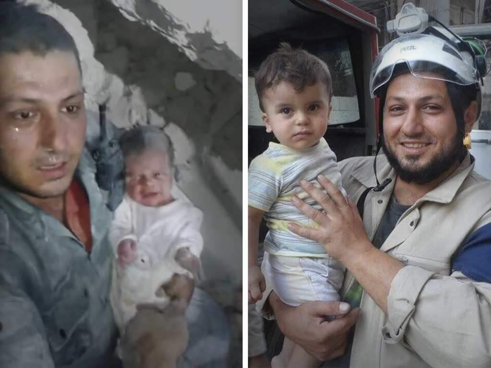

### AYS Digest 11/8: Camps continue to stagnate\.
#### AYS wants to hear about: more projects led by refugees\! Severe water shortage in Aleppo\. Athens prepares emergency plan for “sudden short\-term influx\.” More horrifying food problems in Vial\. Vasilika camp housing reaches 45 celsius in the summer heat, report says\. New reports from inside Serbia\-Hungary transit zones\. Baobab reports from Rome\. France promises more beds, but threatens refugee businesses in Calais\.

### GENERAL

_In the interest of bringing in more representation and voices from the communities we are trying to serve, we would like to put out a special call for submissions for projects that specifically benefit or represent refugee perspectives\._ **For example:**

THE JOURNAL OF INTERRUPTED STUDIES — CALL FOR SUBMISSIONS

The Journal of Interrupted Studies is currently accepting submissions forVolume 2 of their publication\. JIS is is an open\-access, Oxford\-based academic journal that publishes the works of academics, researchers and writers whose work has been interrupted by forced migration, exile and other adverse circumstances\. Language barriers and legal obstacles to continued study inEurope often prevent refugee and migrant scholars from gaining the qualifications necessary to publish in mainstream journals\. The Journal thus aims at providing a forum in which refugee and migrant academics, many of whom will have lost a lifetime of work in flight, can publish their research despite these restrictions, and regain agency in pursuing further study\.

The team is of course more than willing to edit and publish work which is incomplete or based on interrupted or partial research\. EU refugee status is by no means a prerequisite for submission, nor is perfect written English\. Tocon tribute or get in touch, contact the team via Twitter \(@InterruptedOx\) or Facebook \( [https://t\.co/5GOSyjQ1gU](https://www.facebook.com/l.php?u=https%3A%2F%2Ft.co%2F5GOSyjQ1gU&h=DAQFQM-ct&s=1&enc=AZMdiVI6P6e9AgEjQIwLuEnyt9EJyAsIkUH8IiFjjU6ft7jmt4DWiWdKbm14Gm7S6C24jHTBjMADncZ2PQK1wfcS&hc_location=ufi) \), or visit [https://t\.co/66ikbyR0hj](https://www.facebook.com/l.php?u=https%3A%2F%2Ft.co%2F66ikbyR0hj&h=mAQERYY09&s=1&enc=AZP_NKxTYBfqaxp4RsK04hib16EDk-FegWPc2tWbRF_sH06C2XvNS5aVItrdTEpl3uYdWi1RK7EQ217gEdoqbWrk&hc_location=ufi) \."

Those not aware of the **Through Refugee Eyes** project ought to check it out and support this unique way of centering the voices of refugees who are giving back to their communities\. Learn more about it [here](https://www.facebook.com/throughrefugeeeyes/?ref=ts&fref=ts&hc_location=ufi) \. They are currently in need of a van for a one\-day project\.

Another project that seeks to support refugee, migrant, and asylum seeker voices is the **International Committee of Refugees** which has established working groups for refugee right advocacy that specifically features the voices of refugees themselves\. Check out their page [here](https://www.facebook.com/refugeecommittee) and learn more\! Refugees interested in participating are encouraged to join their group [here](https://www.facebook.com/groups/526564654168545/) \.
### SYRIA

All Russian military action, air and artillery strikes will be halted between 10:00 \(07:00 GMT\) and 13:00 daily, a defense ministry official told a briefing in Moscow on Wednesday\. 
Despite these promises, UN Emergency Relief Co\-ordinator Stephen O’Brien said that to meet the needs “\[one would\] need two \(road\) lanes and you need to have about 48 hours to get sufficient trucks in\.”
It is not clear if Syrian rebel groups will also cease fire during the daily three\-hour window\.

UNICEF USA recently promoted a video documenting the severe water shortages that are affecting the citizens of Eastern Aleppo\.

Devastating news out of Syria as a face that many got to know worldwide as the man responsible for saving the ‘Miracle Baby’ was killed today\. Known by his first name, Khaled was the member of the White Helmets and worked alongside other members to rescue citizens of Syria as they endured countless bombardments\. The White Helmets officially reports:

> Khaled was one of the earliest volunteers of the White Helmets, since joining he has responded to thousands of attacks — and he made the same choice thousands of times — to run towards bombs knowing he could be killed\. Millions of people around the world have watched the Miracle Baby video and been inspired by Khaled and his bravery\. 

Photo courtesy of The White Helmets
### GREECE

According to GreekReporter, the number of refugees and asylum seekers in Greece has nearly reached 57,100 throughout Greece\. The news agency also reports that the [flow of incoming people has increased by 76%](http://greece.greekreporter.com/2016/08/11/migrant-flows-to-greek-islands-increase-76/) , although it is unclear what their range of analysis was or to what other range it was compared\.

Furthermore Athens is preparing for what could possibly signal repercussions of the fast straining EU\-Turkey deal or simply disruption in the wake of July 15th’s attempted coup\. Although the Greek government asserts that the refugee situation in Greece is “still under control,” plans are being drawn to [handle the sudden influx of large groups of people](https://www.euractiv.com/section/justice-home-affairs/news/greece-considers-migration-emergency-plan/) \.

There are more reports of Hepatitis A in various camps around Greece\. As such, volunteers and residents are encouraged to refer to these helpful factsheets on Hepatitis prevention, symptoms, and treatment\.

### Chios

Around 45 individuals landed today on Chios\. Now boats are landing in broad daylight yet again\. These arrivals will continue to put additional strain on the organizations, volunteers, and most of all refugees on Chios\.

Chios Refugees Infopoint reports that conditions in Vial are getting truly desperate\. According to some reports, in July, residents were not given food for three days\. Some members began to protest this, and also the low quality of food provided to them, with a hunger strike\. Their hunger strike eventually ended, but food quality for the camp has not improved\.

Chios Refugees InfoPoint also reports that there are some cases of racism against refugees, as some were told that “\[those of\] Us black we need to go Souda because blacks are there\.”

This video provides further details and information directly from inhabitants in the camp\.

### Lesvos

One boat landed today on Lesvos with around 44 aboard\. All were delivered safely\.

The Mosaik support centre is hosting a talent show on Friday night for both refugees and volunteers\. Expect dancing, music, poetry, rapping, and many other great activities\. The Mosaik Support Center is located in the center of Mytilene, off of Sapfous and Arionos, two blocks from water\. Buses to camps run at 5:30 pm and 8:30 pm\. For more information, [check out this post](https://www.facebook.com/groups/informationpointforlesvosvolunteers/permalink/561734660700652/?hc_location=ufi) \.
### Vasilika

The Pleiades NGO for Human Rights recently released a comprehensive report on the conditions of Vasilika camp\. The situation seems very bleak for the around 1,000 people living there\. The camp uses metrics based off of UNHCR standards of assessment\. A major takeaway from the report is the dangerous heat in many of the warehouses where tent camps are located\. Pleiades reports that due to the lack of air conditioning, the temperature often reaches around 45 degrees centigrade inside the halls\. There is also worrying information of a lack of regulation of water temperature for the solar\-heated showers\. This could result in serious burns\.

Food standards fall short in nutritional value, and around 60% of the food is thrown away due to low quality\. [The full report](http://hellenicaction.blogspot.rs/2016/08/1-utf-8-0-false-false-false-en-gb-x.html) includes many more details, and the methodological framework and approach could be applied for similar assessments at other camps\.
### SERBIA

Refugee Aid Miksaliste reports that despite having to reduce operational time in order to repair their roof, they were still able to provide some hot meals and rain coats to help deal with the cold snap that’s happened in Belgrade\.

Distribution in Miksalište

Volunteers at Kelebija and Horgos report a desperate need for a van in order to continue distribution efforts at the border\. Teams with vans would be very appreciated or in lieu of that fundraising efforts to help provide a van to these teams would be very helpful\. Those interested in supporting this work can contact [Dan Song](https://www.facebook.com/infisterra?fref=nf) \.

In a new report on the transit zones between Serbia and Hungary, [the New Internationalist paints](https://newint.org/features/web-exclusive/2016/08/11/in-the-long-crossing-to-hungary-refugee-families-get-stuck/) a vivid picture for live in the zones\. In Horgos, they report:

> The only source of water is a couple of sinks and there is a line of portable toilets alongside the fence\. There are no showers and no areas for children to play or adults to rest\. Most of the families stay all day in their makeshift homes made around small tents in an attempt to escape the dirt and the baking sun\. Some have carried their elderly mothers and fathers on their backs and in wheelchairs to reach Europe\. We meet pregnant women on the brink of delivery, mothers with new\-born babies, entire families who’ve left everything to escape the destruction of their hometowns by the armed group that calls itself Islamic State \(IS\) or the Taliban\. 

Around 2/3 of the individuals in Horgoš speak Farsi and around 1/3 speak Arabic, the report also notes\. Volunteers are hoping to set up long term projects in order to ease the tedium and unsure atmosphere at zones\.
### ITALY

The Baobab Experience page reports distressing news in Rome\.

> This morning the police came to pick up for forced identification, the migrants that don’t want to stop in Italy, and this is bad for the Dublin Convention\. 

> In the meanwhile, the \[person\] who want to ask asylum in Italy, have to pass the night in front of the only police headquarter in Rome, in Via Patini, that works on immigration, because they accept just 10 \[cases\] each day, and one for each nationality\! 

> After this, the \[individual\] must follow instructions \(written only in Italian\! \) for the other step to get formalization of the request of asylum and get a place in a structure after many weeks: this can be performed in another office, the only on Friday from 9\.a\.m\. to 12 p\.m\. 

Despite these dire conditions, The Baobab Experience continues to work\. They are in need of the following:
\- plastic glasses;
\- long\-shelf\-life milk;
\- hands disinfectant in gel;
\- sliced bread\.

They also need volunteers for the shifts of next week: 8\.30 a\.m\. \-1 p\.m\.; 1 p\.m\. \-5 p\.m\.; 5 p\.m\. \-9 p\.m\.

Radio Noborder has been broadcasting from the Italian border the last few days in order to get interviews from those waiting\. Listen to their voices [here](http://radionoborder.net/) \.
### FRANCE

The situation in Calais continues to deteriorate as Refugee Info Bus reports a disturbing event:

> CRS Police are back in the camp confiscating food and bikes from refugee run shops and restaurants\. The result of a court case concerning evictions from these premises is due tomorrow\. The restaurants provide food and emergency shelter for 150 people per night on average\. 

This seemingly indiscriminate cruelty is not only damaging to operations, but also disruptive to any modicum of normalcy in the camp\. Read the [report](https://www.facebook.com/RefugeeInfoBus/photos/a.1756184407950313.1073741828.1756144974620923/1813469382221815/?type=3&theater) for full details\.

Regarding the reports of police crackdowns and violence against refugees struggling to find a place to stay in Paris, several organizations have [denounced the action](http://www.liberation.fr/debats/2016/08/09/refugies-la-violence-de-l-etat-doit-cesser_1471297) \.

> In an Op\-Ed for Libération, local associations denounce the use of violence by police forces in Paris, describing a recent attack on migrants, including 20 women and children, to prevent them from installing a new camp\. It also denounces police harassment and the regular review of migrants’ “administrative situation”,forcing around 400 people to the police station and ordering 80 people, who did not have the time to apply for asylum, to leave the French territory\. 

The petition to save the Kids Cafe in Calais is in it’s final stretch\. Please sign and share\! Decision on whether or not to demolish particular “businesses” in Calais, of which Kids Cafe is only one, will be handed down today\.

The French Minister has stated that the French government will establish [3,000 more bed spaces in reception centers](http://www.lemonde.fr/societe/article/2016/08/10/emmanuelle-cosse-veut-augmenter-les-places-d-accueil-pour-les-migrants_4980610_3224.html?xtmc=cosse&xtcr=1) \. Around 50 people arrive each day in Paris, but beds are opening up at a rate of 80–100 per week\. There will be a center for unaccompanied minors with capacity for 72 in Calais\.

_Converted [Medium Post](https://areyousyrious.medium.com/ays-digest-11-8-camps-continue-to-stagnate-890464bcc122) by [ZMediumToMarkdown](https://github.com/ZhgChgLi/ZMediumToMarkdown)._
