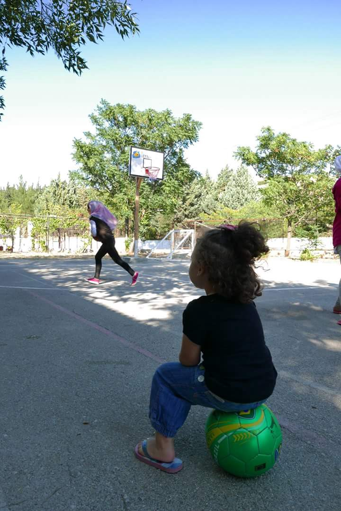
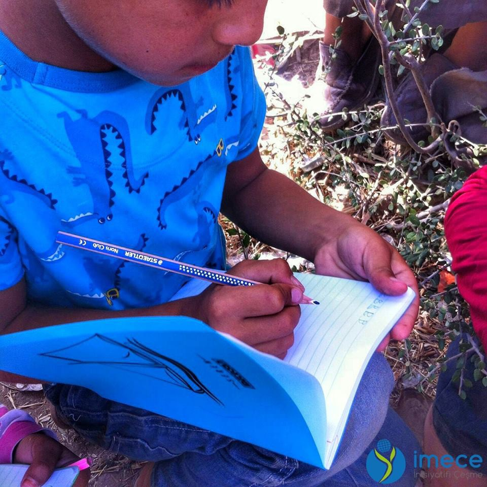
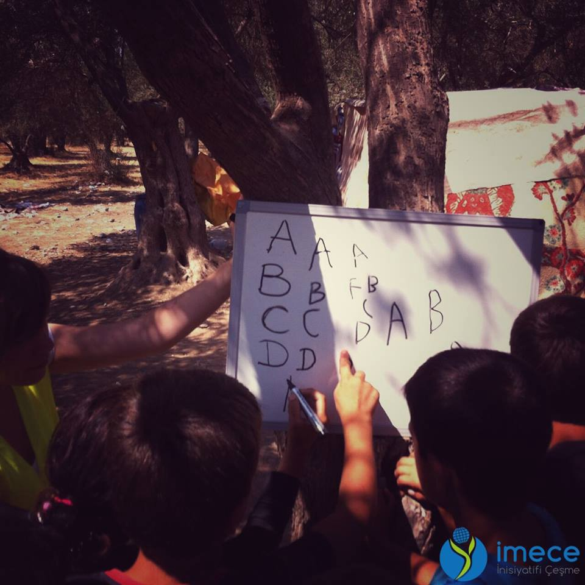
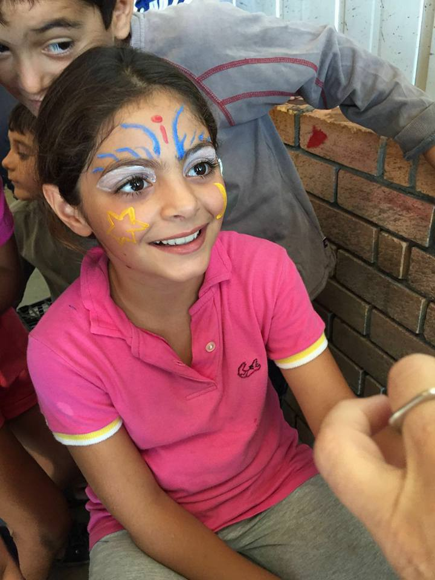
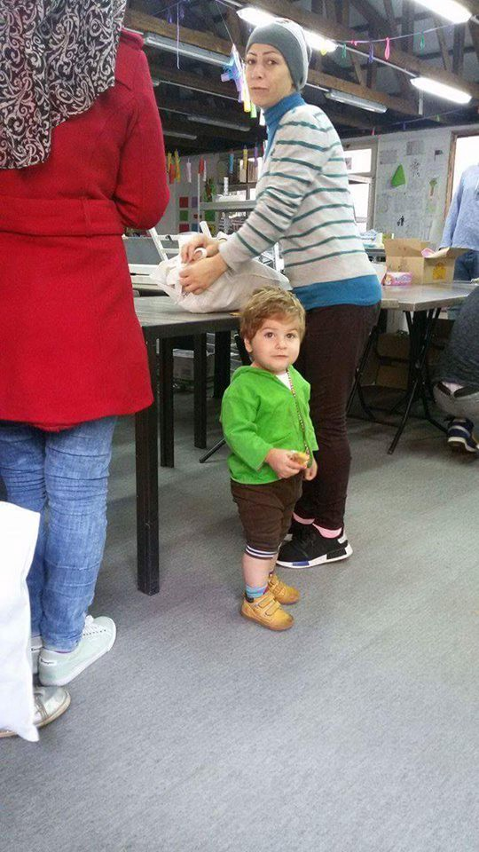
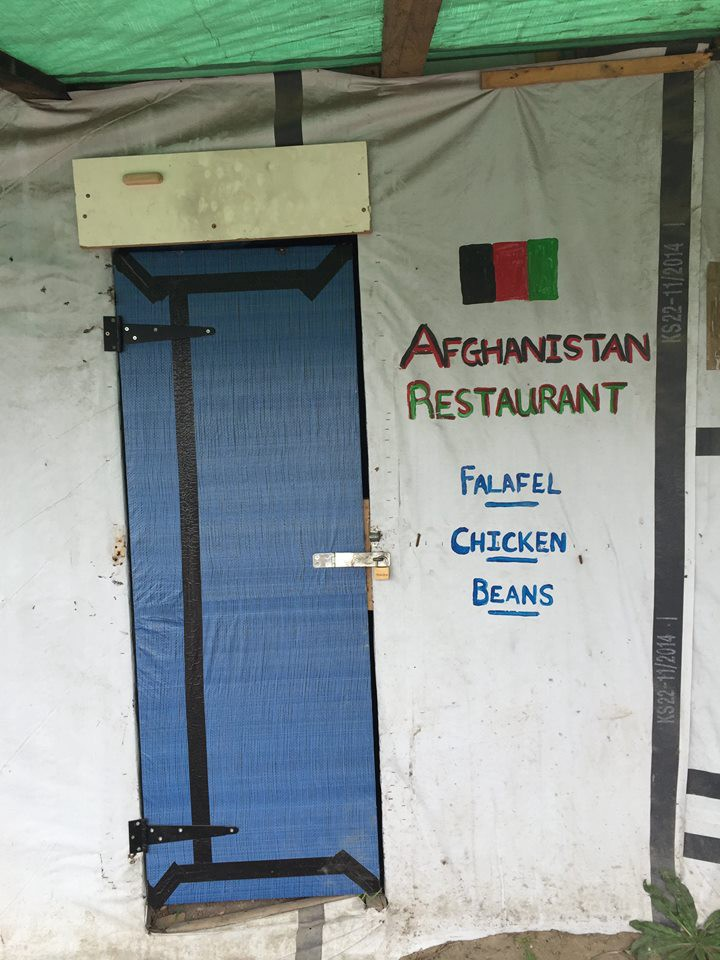

### AYS DAILY DIGEST 12/8: **Abuse of refugees rights across Europe matched by new initiatives gaining ground and old spaces for integration refusing to be closed**

> **The numbers in Greece for today and deportations in Lesvos\. Refugees learning to code, learning to swim and teaching tools for English\. Aid delivered to Syria in spite of fighting\. New plans for relocation in Greece and the Skype procedure for Preregistration\. Conditions in Macedonia camps worsening\. Arrests in Albania and Bulgaria and evictions in Serbia\. Heavy controls on Swiss/Albanian border\. Germany to gain access to refugees’ social media\. Sweden threatens to call out Hungary over Dublin\.** 

Credits: Elpida camp
#### **GENERAL**
### **The Migration Numbers in Greece and Relocation**

As of July 31, the Greek Asylum Service \(GAS\) registered 10,075 relocation applications, but only only 2,735 persons have been relocated from Greece to other European countries, the most recent [data](http://asylo.gov.gr/en/wp-content/uploads/2016/08/Relocation-procedures-up-to-31.7.16_en.pdf) from the GAS show\. Of the total of relocated persons, 1,569 are male and 1,116 are female asylum seekers\. Among the countries that accepted many refugees are France \(1,098\), The Netherlands \(342\), Portugal \(307\),Finland \(273\), Spain \(147\) and Romania \(122\) \. The total number of relocation places pledged for Greece at the EU level “remains low at 7,463 — only 11% of the total target of 66,400 to be relocated from Greece to other EU Member States by September 2017,” [UNHCR](http://data.unhcr.org/mediterranean/download.php?id=1783) said\.
### **Reintroducing the Nansen Passport?**

An idea for the reintroduction on the Nansen passport has been voiced, drawing on the document that existed until 1942 and helped approximately over 450,000 people\. The reintroduction of the Nansen passport — an ID card for refugees guaranteeing asylum — at the European level might be a useful and even necessary instrument to solve this legal uncertainty for refugees and to promote a common migration policy\. The Nansen passport was especially created for migrants who became stateless while fleeing from their countries of origin and in need of travel documents\. This passport provided people with international recognized travel documents whatever their national citizenship or status\. The EU\-Nansen passport could be handed out to people, for instance to Syrians, preventing them from being forced to cross the sea\. If nobody has to traverse the sea illegally, the smugglers’ business would dry up and people would no longer have to risk their lives\. This would be an efficient measure against human trafficking and death\. Moreover, the EU\-Nansen passport could create a common legal framework to provide a safe haven for current and future refugees\.
### **Refugees Can Now Learn to Code in the Hackyourfuture Program**

For all the Refugee supporters, a new project is on the works in London\. An opportunity to learn about coding and becoming a developer for free for refugees and recruiting its first batch of students in London/UK\. HackYourFuture is a free educational program that helps refugees learn computer programming\. The 6\-month program is focused on teaching refugees how to program, get skills that are demanded on the job\-market, and connect them with companies that hire programmers\. The program started in The Netherlands and their first 7 graduates have already found internships and jobs at great companies\! A new 6 months program is about to start in London teaching individuals how to become a full\-stack JavaScript web developer and languages such as HTML/CSS, Javascript, Angular, Node\.js, MongoDB and more in a weekly face\-to\-face day session\. Requirements are writing and reading English at a good level and high motivation\. email to [london@hackyourfuture\.net](mailto:london@hackyourfuture.net)

](assets/5595f6e5c2a3/1*4HeyJgaLAlzpLDujnmlU2Q.jpeg)

Refugees learning to code\. Credits: [**Germán D’Jesús**](https://www.facebook.com/germandj)

](assets/5595f6e5c2a3/1*Zo0LCKmMqa8yuDZ_Gwtxqw.jpeg)

Credits: [**Germán D’Jesús**](https://www.facebook.com/germandj)
#### **SYRIA**
### **In Spite of Continued Fighting Humanitarian Aid Arrives in Aleppo**

Turkey is sending 10 trucks of humanitarian aid into [_\#‎Aleppo‬_](https://www.facebook.com/hashtag/aleppo?source=feed_text&story_id=323526197990571) loaded with food and medical supplies\. Forty food aid trucks enter regime controlled areas west of Aleppo while there have been reports of explosive barrels targeted areas of Old Aleppo\. Clashes took place between regime forces and rebels in the southern and southern western sections of Aleppo\. Aerial bombardment targeted al\-Kallasa, Bustan al\-Qaser, and old Aleppo\. Shells fired by reels targeted areas al\-Akramia\. 40 food aid vehicles entered regime controlled areas west of Aleppo across the Castello road, Hendarat, Shekh Najjar, Khenaser\. Clashes took place between regime forces and rebels around Mahmia al\-Ghezlam in the southern countryside near Khanaser\-Ethria road, reports of advances for rebels in the area\.

Check out the video here:

#### TURKEY
### Education efforts in Izmir

](assets/5595f6e5c2a3/1*Jsk3SquqHqvLltOYItEYog.jpeg)

Credits: [**İmece İnisiyatifi Çeşme**](https://www.facebook.com/imeceinisiyatifi/)

](assets/5595f6e5c2a3/1*OG34du8NcVGFDfyAKnGntg.jpeg)

Credits: [**İmece İnisiyatifi Çeşme**](https://www.facebook.com/imeceinisiyatifi/)

](assets/5595f6e5c2a3/1*2CoeA56t4KsQIADahUZIww.jpeg)

Credits: [**İmece İnisiyatifi Çeşme**](https://www.facebook.com/imeceinisiyatifi/)
#### **GREECE**
### **Arrivals today**

Todays new arrivals Chios 44, Samos 8, Kalymnos 49 and Rhodos 2; making a total of 147\. Second boat today brought into Myitilni by coast guard, 43 people on board and all doing well\.
### **New Plan to Relocate Refugees to New Centers on Crete**

Migration Policy Minister Yiannis Mouzalas presented a plan to move some 2,000 people to four new centers on Crete by the end of the summer due to overcrowding of the migrant reception centers on the islands of the eastern Aegean as arrivals from neighboring Turkey increase\. Four centers are to be set up on the island, one in each of its prefectures, where the migrants are to be accommodated in prefabricated homes, and will be provided with food, medical care and schooling for children\. Efforts will be made to keep migrants of different ethnic groups separate as tensions relating to ethnicity have been occurring\. He has also stated that the government has pledged to improve accommodation for migrants\. The migrants the government is planning to move from the islands are those who have completed the first phase of their asylum applications\. A total of 22 unaccompanied minors who had been staying at the Aliens Bureau on Petrou Ralli Street were moved to hostels for children in Volos and on Crete\.
### **The Process of Preregistration in Case of Expired Police Note, Explained by GAS**

Persons with an expired police note \(karthi\) can pre\-register for asylum in Greece, family reunification and relocation, if they entered the country before March 20, a representative of the Greek Asylum Service \(GAS\) told News That Moves\. People with expired police notes will follow the same application procedure for asylum in Greece, family reunification or relocation that are followed by asylum seekers with valid documents\. Applicants with expired police notes can now pre\-register only through Skype\. The Greek Asylum Service has released an updated schedule for Skype calls\. The PDF document can be accessed here\. Once the Skype call is completed, the applicant will get a code and a date to pre\-register in person at the Asylum Service Office of his/her choice \(Athens, Thessaloniki, Alexandroupolis or Rhodes\) \. The date for pre\-registration is usually scheduled within five days from the Skype call, GAS said\.

For more information: [Pre\-registration Closed: What Happens Next?](https://newsthatmoves.org/en/pre-registration-closed-what-happens-next/) [Pre\-registration: How The Process Works?](https://newsthatmoves.org/en/pre-registration-how-long-does-the-process-last/) [Pre\-registration For Relocation: What To Expect?](https://newsthatmoves.org/en/pre-registration-for-relocation-what-to-expect/) [Unaccompanied Minors & Pre\-Registration](https://newsthatmoves.org/en/unaccompanied-minors-pre-registration/) [Help With Pre\-registration In Athens](https://newsthatmoves.org/en/help-with-pre-registration-in-athens/)
### **Teaching Refugees to Swim**

In Souda camp swimming lessons are organized for children according to swimming experience\. The activity quickly spread to adult swimming lessons\. Now at least 20 swimmers every day but often more and so far we have 6 children, 1 man and 1 women have been taught to swim\! In addition to the swimmers in the sea, families come and watch their children learn to swim and socialize on the beach and refugees are joining is as swimming coaches\.
### Beautifying the Frakapor camp: Cooperation between volunteers and refugees

](assets/5595f6e5c2a3/1*XUEafKigxIkymFk0oOzKig.jpeg)

Credits: [**schwizerchrüz\.ch Michael Räber**](https://www.facebook.com/swisscross.help/)

](assets/5595f6e5c2a3/1*fGahSW0pLZHy25zWm5dEOw.jpeg)

Credits: Credits: [**schwizerchrüz\.ch Michael Räber**](https://www.facebook.com/swisscross.help/)
### **No Border Kitchen Lesvos Stands Its Ground**

After being threatened with a \(repeated\) eviction of the social center at Mytilinis beach for the past week, No Border Kitchen Lesvos decided to not give in so easily and stay put\. So far the police did not come to make their threats true\.
### **A Pinterest Board for Teachers Available**

A pinterest board for teachers \(there is also another one for students on the refucomm account\) is available\. It should be useful for new teachers who have no experience in ESL, as well as trained professionals coming to work with the refugees\. The student board has some great links for students to access so let your classes know about it if they are interested in studying online as well\. Follow them for more pins and inspiration and spread any materials you have too\. Please contact Ele at refucomm@gmail\.com if you would like more worksheets, digital copies of textbooks and flashcards to use to set up English classes in squats and camps\. [https://www\.pinterest\.com/refucomm/esl\-teaching\-tips\-for\-teachers/?fb\_ref=6cab671adcd64246b185babecc44416c%3A211e1d171a99d6ebd613b0](https://www.pinterest.com/refucomm/esl-teaching-tips-for-teachers/?fb_ref=6cab671adcd64246b185babecc44416c%3A211e1d171a99d6ebd613b0)
### **Deportations in Lesvos**

Last night a refugees summary deportation took place by Turkish coast guards in Greek waters, half a mile away from the maritime border between both countries\. It is terrible that, following the EU\-Turkey agreement, the Greek authorities may deport those fleeing their countries, but it is illegal, and so we denounce, for Turkish authorities entering European maritime territory to carry out hot deportations to Turkey\. Not only the law in force is broken but also, and most serious, fundamental human rights [https://www\.facebook\.com/proactivaservice/posts/1212715698759279](https://www.facebook.com/proactivaservice/posts/1212715698759279?hc_location=ufi)
#### **ALBANIA**
### **Police in Albania arrest 26**

Police in Albania arrested 26 Afghan migrants who entered the neighboring country via the Kakavia border crossing\.
#### **MACEDONIA**
### **Conditions in Camps Worsening**

The FYROM branch of the Helsinki Committee for Human Rights is reporting that the conditions at two refugee camps operating in the country are worsening\. Refugees waiting at the transit camps of Gevgelija, near the FYROM\-Greece border, and in Tabanovce, near the FYROM\-Serbia border, are in difficult psychological state due to their uncertain future, the Helsinki Committee noted in a report\. According to the report: Many fights were reported in the Gevgelija camp between 18 and 24 July, with a growing tension in both sites; People at the camp are experiencing serious psychological disorder; In both camps there is no professional help for people suffering from mental distress\. According to the FYROM Ministry of Labour and Social Policies and to the Center for Crisis Management, there is currently no budget to hire psychologists; At the end of July, approximately 130 people were hosted in Gevgelija, 70 in Tabanovce\.
#### **SERBIA**
### **Police Evicting Refugees from Parks**

This morning police evicted all of the refugees from the parks and took them to the camp in Krnjaca\. Many refugees complained that they did not get enough food and that they were not treated well\. Furthermore, many refugees reported that police took all of their blankets so they could not spend any more nights in the parks\. Many refugees escaped Krnjaca, where they have been locked down, and run back to the parks\. They told us that parks are much better then the camp\. Refugees have been hiding around the parks for the whole day and around 19:30, the bus with the police and people from Commisionary of Serbian came back to pick them up and make them go back to Krnjaca camp\!
### **Park Festival to be Held in Belgrade on Sunday**

Believing that the parks should be what they are meant to be: a place to meet, to retreat, to relax and to stroll around, a festival “The parks are for All” is been organized in Serbia Sunday from 4pm until 3am at the park at the Faculty of economy\. With the goal of uniting the neighborhood, in the city and in the countryside — against oppression in Belgrade and everywhere\. For more info contact
 [parkjezasve@riseup\.net](mailto:parkjezasve@riseup.net) and [ttp://parkjezasve\.weebly\.com/our\-story — 1085107210961072…](http://l.facebook.com/l.php?u=http%3A%2F%2Fparkjezasve.weebly.com%2Four-story--1085107210961072-10871088108010951072.html&h=ZAQFzEtMZ)
### Food donations in Miksaliste

](assets/5595f6e5c2a3/1*pcbRLJUDOMMRliI-WE2jIQ.jpeg)

Credits: [**Refugee Aid Miksalište**](https://www.facebook.com/RefugeeAidMiksaliste/)

](assets/5595f6e5c2a3/1*XJWUhpvtxT0A0zEH82jAAw.jpeg)

Credits: [**Refugee Aid Miksalište**](https://www.facebook.com/RefugeeAidMiksaliste/)

](assets/5595f6e5c2a3/1*wOGfZtbnRFivDM-mhtBMIQ.jpeg)

Credits: [**Refugee Aid Miksalište**](https://www.facebook.com/RefugeeAidMiksaliste/)

](assets/5595f6e5c2a3/1*fXOFv7KugIEThzdyqQHtwQ.jpeg)

Credits: [**Refugee Aid Miksalište**](https://www.facebook.com/RefugeeAidMiksaliste/)
#### **BULGARIA**
### I **nspections of IDs and Detentions in Sofia**

More then 300 people’s documents have been inspected during the last 24 hours in Sofia, according to police sources who are claiming that the operation is still ongoing and that as many as 166 irregular migrants have been detained\. Bulgaria’s treatment of migrants and refugees arriving in the country may be violating international law, the United Nations’ High Commissioner for Human Rights has warned\. Zeid Ra’ad Al Hussein said two visits by UN staff had revealed “inhumane and unacceptable” policies which could put many migrants in a “Catch\-22 situation” in which they are unable to qualify as refugees in Bulgaria but are also unable to return to their home country\. Mr Zeid said: “One of the most serious problems is that virtually all people entering Bulgaria in an irregular manner are detained as a matter of course\.” “Even worse, they may also be prosecuted and jailed — for a year or even more — if they try to leave the country\. The act of leaving the country is criminalized in spite of the right of everyone, under international law, to leave a country, including their own,” He added: “This means that people who do not qualify under the strict definition of a refugee, but still have legitimate reasons for being unable to return to their home country, have hardly any avenues open to them\. This is clearly inhumane and unacceptable\.” Mr Zeid also raised concerns about the quality of the legal trials migrants and refugees go through when arriving in the country\. Persistent allegations of physical abuse and theft of the possessions of migrants arriving in the country by border control guards has also been documented, with little done to address such concerns the high commissioner said\.“The Bulgarian government is not doing enough to challenge these alarming trends\. Indeed in the view of some, it is actually encouraging intolerance\. Leadership is needed to create an environment conducive to respect for human rights, as well as to end violations and abuses when they occur\.”
#### **SWITZERLAND**
### **Heavy Control of Swiss/Italian Border**

There have been reports of continued heavy control of the Swiss/Italian border, especially controls of people crossing by train\. If not seeking asylum individuals are immediately sent back to Italy\.

](assets/5595f6e5c2a3/1*Wr3KLmagIhnFKEEkZm52jQ.jpeg)

Changes on the Swiss\-Italian border\. Credits: [**Welcome to Europe**](https://www.facebook.com/w2eu.info/)
#### **FRANCE**
### **Data on Calais by Help Refugees**

The Help Refugees latest census has revealed that there are now a staggering 9,106 people living in the Calais camp\. This is the highest number recorded since the monthly census has been conducted, showing that the population has increased by 29% since early July\. There are currently 865 children living in the Jungle\. 78% of them are alone\. This is the highest number of unaccompanied children relying on our services to date\. The Dubs Amendment was passed in May 2016\. Since then no unaccompanied refugee child has been resettled in the UK under this law\. For the first time people are reporting to the volunteer medical services saying that they are hungry\. The camp is running out food\.

](assets/5595f6e5c2a3/1*5qmNrXhZ83cfLnq2WBd7tA.jpeg)

Latest Calais census\. Credits: [**Help Refugees**](https://www.facebook.com/HelpRefugeesUK/)
### **Shops and Restaurants in Calais to Remain Open**

](assets/5595f6e5c2a3/1*-1Gzhck1a8O7smXBBj2fMA.jpeg)

Credits: [**Care4Calais**](https://www.facebook.com/care4calais/)

On average, each shop and restaurant of 36 surveyed, serves as emergency accommodation for 4 newly arrived people during the night, totalling 252 places to stay every night\. 30 people charge their phones in each one every day, totalling 2124 people who can keep in contact with their family on a daily basis\. 12 free meals and food items are served daily in each restaurant — this totals 857, includes 200 free meals a day for unaccompanied minors in the Jungle Books Café\. The Prefecture’s request to demolish the shops and restaurants in Calais was rejected on ALL COUNTS by the Tribunal Administrative in Lille and they will, for now, remain open\. What is needed the most is food and tents, to donate physical goods to Calais email: [calaisdonations@gmail\.com](mailto:calaisdonations@gmail.com) To purchase goods online to be delivered straight to the Calais warehouse go to: [https://www\.leisurefayre\.com/section](https://www.leisurefayre.com/section) [\.…/86100/1/help\_refugees](https://www.leisurefayre.com/section.php/86100/1/help_refugees) To donate to Refugee Community Kitchen: [https://mydonate\.bt\.com/](https://mydonate.bt.com/) […/helprefugeesandrefugeecommunityki…](https://mydonate.bt.com/charities/helprefugeesandrefugeecommunitykitchen)

](assets/5595f6e5c2a3/1*w8fTqGts_naOxoqvrUV_KA.jpeg)

An Afghan restaurant that now has the right to re\-open, after being demolished\. Credits: [**Calais Action**](https://www.facebook.com/calaisaction/)

](assets/5595f6e5c2a3/1*dEa5uPYl3y0hSb0TrPxWwA.jpeg)

Donations of sleeping bags and blankets arriving\. More are needed\. Credits: [**Calais Action**](https://www.facebook.com/calaisaction/)
### **The Welcome Caravan was forced to close**

The Welcome Caravan was forced to close this week as they have run out of sleeping bags and tents\. There are 500 new arrivals each week, about 70 a day\. This forces people to sleep rough in a dangerous and inhumane environment\.

[Jungle books library Calais](https://www.facebook.com/junglebookslibrarycalais/) **and Kids Cafe’s in Calais** The library and the Kids Cafe tells us about the importance of a stable, safe place for unaccompanied minors in the Calais camp\. Humanitarian Refugees work incredibly effectively in many ways the professional aid workers can not\.The Kids Cafe is a place run by people the children can talk to and naturally respect\.
### **Renegotiating the Touquet Agreements**

President of Hauts\-De\-France region and former UMP Minister, Xavier Bertrand, tells Le Figaro in an interview that ‘we must renegotiate the Touquet agreements that bind us with Britain’ and suggests Britain is not doing enough to ease the burden on the refugee situation, adding a recent UK parliamentary report shows the agreements are good for the UK, therefore they cannot be good for France\. He also says the northern Jungle should be evacuated and refugees should be prohibited from leaving the camp at night\.
#### **SWEDEN**
### **Sweden to call Hungarian Ambassador over Refusing to Implement Dublin Regulation**

Swedish Migration Minister Morgan Johansson, stated that Hungary refused to implement the Dublin Regulation, which allows to send asylum seekers to the country from which they entered the EU\. “All countries must follow common rules, otherwise they can not be members\. I’ll call next week the Hungarian ambassador to the point it out, “said the minister\.
#### **GERMANY**
### **Authorities will be granted access to search the social media accounts of refugees**

Authorities will be able to access social media accounts of refugees if they carry no passports or other identity cards\. People seeking international protection often have no ID papers, but most often carry smartphones\. The devices are crucial to refugees\. But de Maiziere said they also contain information that could reveal possible security threats\.

“If you want to come to Germany, we have to make safety checks on you\. And to make safety checks, we will ask you to show us your Facebook contacts from the last few months, which are public in principle anyway,” said de Maiziere\.

Similar mobile device schemes are already up and running in Denmark, Norway, Sweden and the Netherlands, reports the Guardian newspaper\. He also announced plans to ease doctor patient confidentiality, a move that drew sharp rebuke from the German Medical Association\. Meanwhile, any migrant seen as “endangering public safety” can now be kicked out of the country\.

“In this way, we will in future increasingly use the instrument of deportation for foreign criminals and people likely to pose a threat,” de Maiziere is quoted as saying in Deutsche Welle\.

The proposals, set to become law before the end of the year, comes in the wake of a knife attack in Wuerzburg and a suicide bombing in Ansbach last month\. Both were claimed by the Islamic State\. A German\-Iranian in Munich had also gone on a shooting rampage and a Syrian asylum seeker had stabbed to death a Polish woman in Reutlingen\. Neither incident was linked to Islamic State but have instead spooked a Germany that last year granted asylum to over one million people\.

_Converted [Medium Post](https://areyousyrious.medium.com/ays-daily-digest-12-8-abuse-of-refugees-rights-across-europe-matched-by-new-initiatives-gaining-5595f6e5c2a3) by [ZMediumToMarkdown](https://github.com/ZhgChgLi/ZMediumToMarkdown)._
