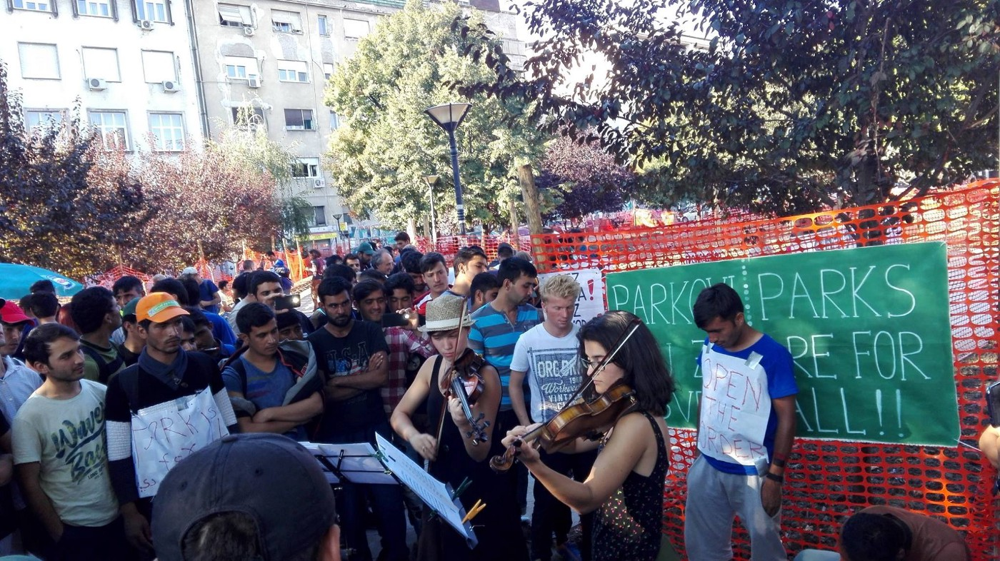
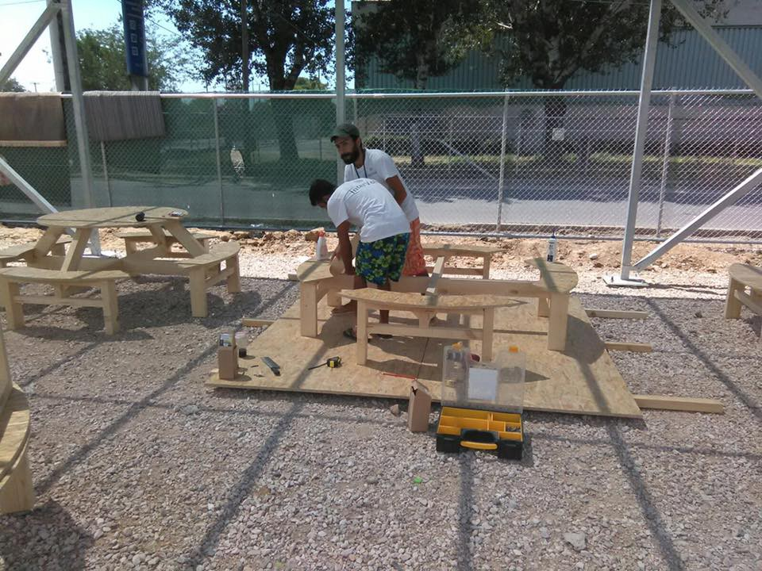
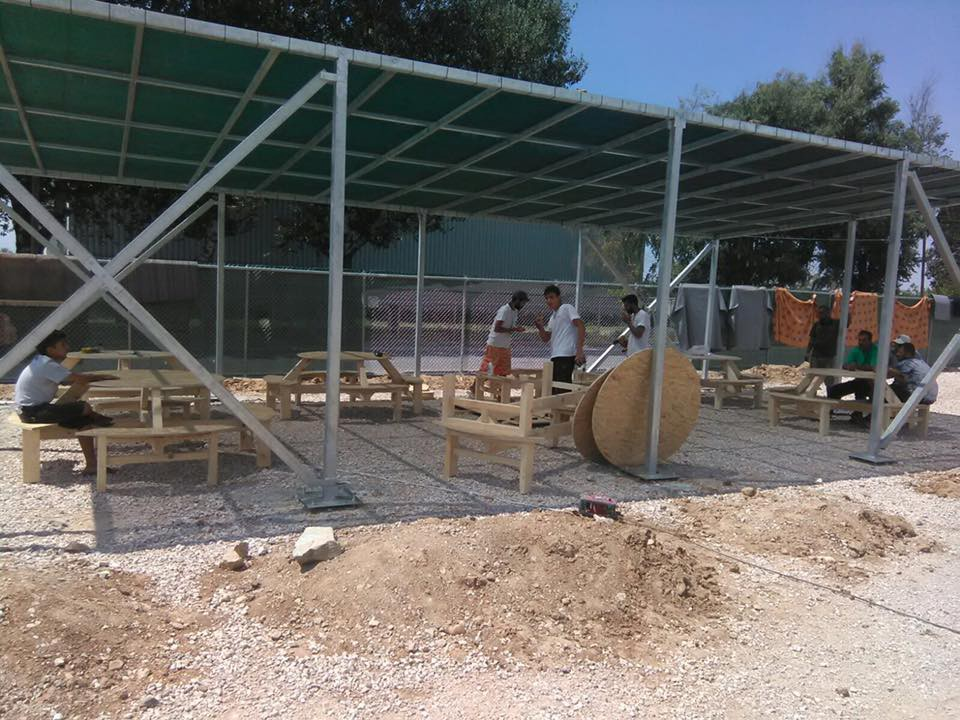
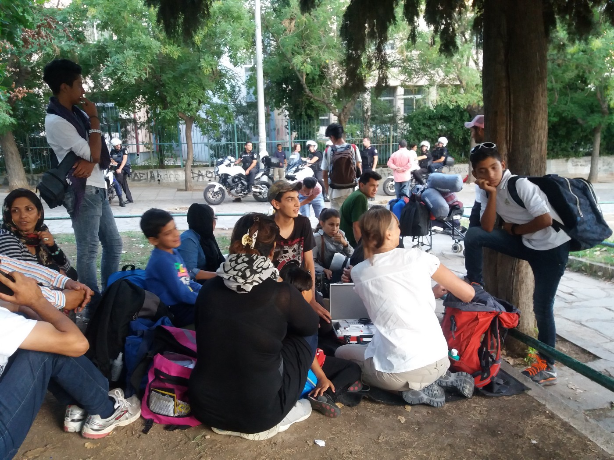
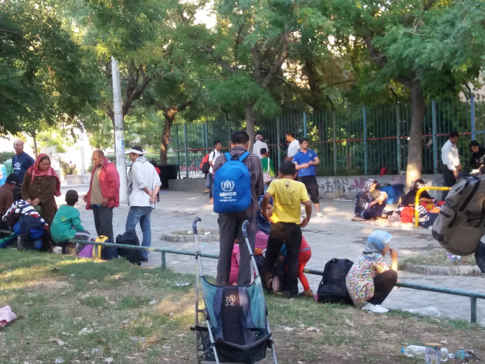
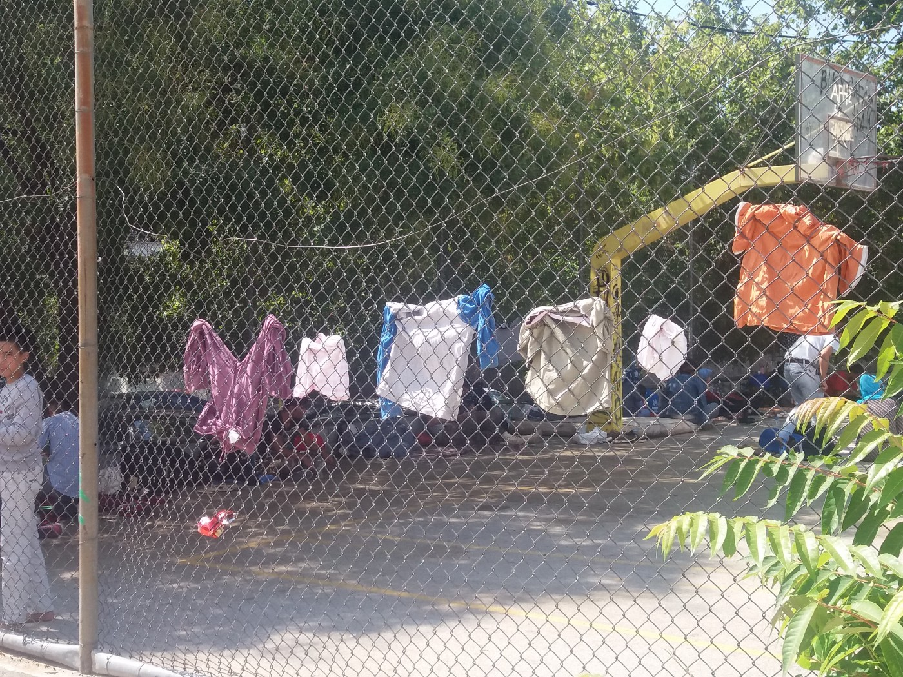
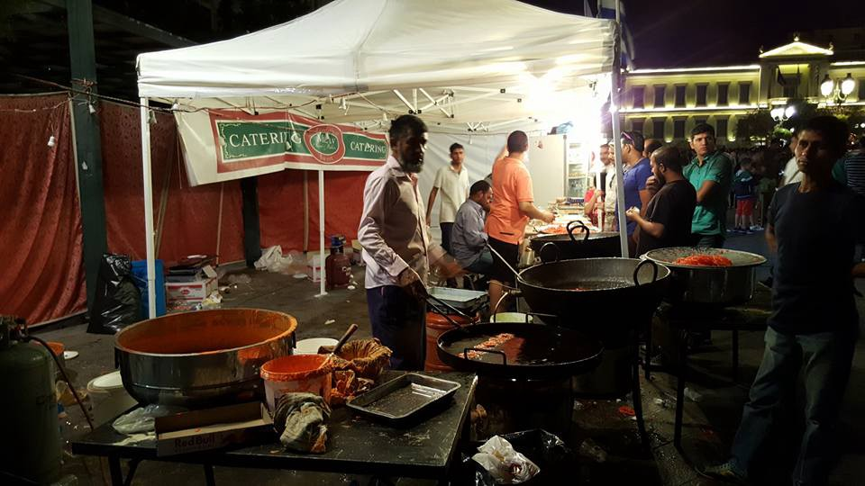
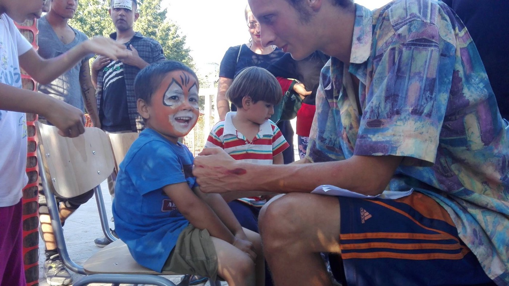
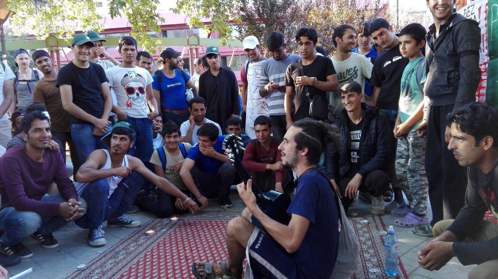
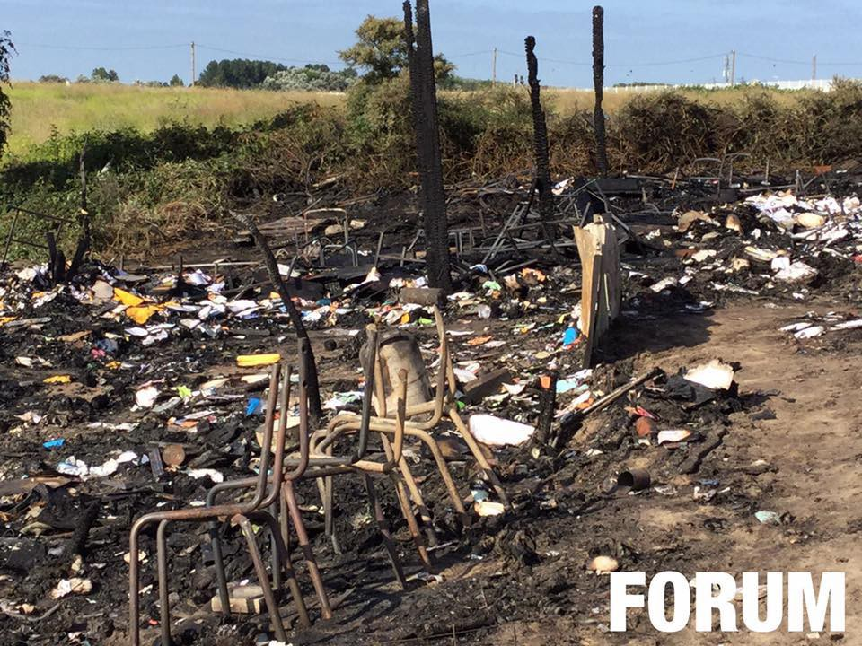

### AYS Digest: 14/8 Parks are for People\!
#### Airstrikes and bombing RAIDS on refugee camps near Turkish/Syrian border\. Choppy weather and uncertain futures in Greece\. Some answers on expired police documents for pre\-registration\. AYS reporting from Thessaloniki\. Protest\-Party in Belgrade Parks\. Full information on workflow in Subotica, Serbia\. Italy slowly preparing for more visitors\. In spite of optimism, new tragedies in Calais\.

Belgrade event\. Photo credit Leo Vinci
### SYRIA

Activists and local coordination groups report that around 50 individuals have been killed in a suicide attack near the Syrian/Turkish border\. Despite recent weeks’ optimism with possible restoration of services to civilians in Aleppo and the liberation of Manbij, this attack would bode ill for any hopes of stability in the near future\. As the EU\-Turkey deal continues to wobble along, one thing remains clear — more civilians need safety\.

UPDATE: As more information has been released, it appears that these attacks are not the work of suicide bombers, but rather aerial bombings that have hit refugee camps\. The death toll is unknown, but video from the scene is truly horrific\.
### GREECE

As summer slowly drifts towards fall, the weather will change with it\. [Athens\-Times reports](http://www.athens-times.com/greece/despite-the-poor-weather-conditions-refugees-are-trying-to-reach-the-islands-rescue-operation-in-lesvos/) that poor weather conditions are not stopping those wishing to attempt a crossing as several harrowing rescues have been made\. Although the numbers of people crossing is noticeably lower than last year, it is in direct conflict with the notion pushed by authorities that with the official closure of the Balkan route, that everything is quiet and under control\.

The New York Times published a report on the current state of affairs\. Most notably, [they pointed out](http://www.nytimes.com/2016/08/14/world/europe/migrant-crisis-greece.html?hp&action=click&pgtype=Homepage&clickSource=story-heading&module=first-column-region&region=top-news&WT.nav=top-news&_r=0) that “European Union member states have sent just 27 of the 400 asylum specialists and 24 of the 400 interpreters they had agreed to provide to process claims for refugees…\.” The also noted that less than half of those currently residing in Greece have been registered\. 21,000 of approximately 57,000 have been registered since the pre\-registration scheme went into effect, which was certainly delayed by the weeks during which the Skype\-powered system kicked back call after call due to insufficient capacity\.

NewsThatMoves has a comprehensive guide to pre\-registration for those who have an expire police notice\. Crucial information includes the following:

> People with expired police notes will follow the same application procedure for asylum in Greece, family reunification or relocation that are followed by asylum seekers with valid documents\. 

> Applicants with expired police notes can now pre\-register only through **Skype** \. 

Please see [NewsThatMoves](https://newsthatmoves.org/en/pre-registration-expired-police-note/) for more details\.
### Lesvos

One boat landed south east of Lesvos near air port 18 people on board two people lost at sea, search and rescue found later, medical was needed, well done every one involved\.
### Thessaloniki

The Intervolve volunteers at Thessaloniki have successfully constructed some charming benches and tables for the residents\! [Providing spaces to eat](https://www.facebook.com/nicholas.rangos/posts/10157582823245643?hc_location=ufi) that aren’t on the uncovered ground is an important part of reinforcing dignity that seems to have been systematically targeted throughout the crisis\. It is imperative that volunteers be on the lookout for every opportunity to reaffirm dignity and humanity\.

Photo credit: Intervolve International Volunteers

The following is a report from an on\-site member of AYS who is working in and around Thessaloniki\.

> There are hundreds of people in parks of Thessaloniki, mostly from Afghanistan & Iraq\. There, they wait for smugglers in order to attempt the crossing\. The current price is 1,300 euro, with two children counting as one person\. Many have attempted the journey multiple times\. One of the people talked to was on his 9th attempt\. Every day, volunteers distribute food and essential supplies\. There is a single doctor who is providing aid, but it is impossible to stay on top of the medical needs\. Every day, the police come and threaten to evict people from the camp, stating that they cannot have a camp in a public park\. Rather than addressing one of the major problems here, smugglers, the authorities, instead, focus on refugees — an easy target\. Although police are not using force, their manner is very curt and abrupt\. Behavior like this only highlights the importance of respecting autonomy of those volunteers meet\. 

### Athens

The broader public as well as refugees and volunteers celebrated Pakistan’s independence today with great festivity\. To the significant population of Pakistani individuals in camps across Greece, events like this bring a taste of home\.

](assets/7d4780f54305/1*PyOcDmWYeXdAclG8P_pScg.jpeg)

Photo credit: [**Hugo Miguel Caldeira**](https://www.facebook.com/hugocaldeira)
### SERBIA
### Belgrade

Volunteers and activists held a gathering today in the parks to protest the recent evictions of refugees\. With the slogans asking whose park it belonged to, they challenged the narrative that the parks were being cleared “on behalf of” Belgrade citizens\.

Meanwhile, refugees continue to report less than adequate conditions at Krnjača camp where most were ostensibly relocated\. The notion of it being an “open camp” is in doubt considering the number of refugees who were required to jump the fence in order to escape back to the city\. However, volunteers point out the dramatic irony in the fact that around forty people were not allowed into the camps and ordered by the authorities to go back to the parks from which they were driven\. Nothing is sure in Belgrade at the moment besides the fact that people are bewildered and frustrated with the authorities’ handling of the situation\.

Belgrade Protest\-Party\. Prorty\! Photos courtesy of Leo Vinci

Protest\-Party, Photo: Leo Vinci
### Kelebija/Horgoš/Subotica

Numbers at the Serbian\-Hungarian border are significantly lower than previously\. Authorities continue to pressure individuals to reside in the official camp in Subotica, but volunteers continue to distribute important aid\.

Full details on the volunteer support structure and system at Kelebija and Horgos in Serbia courtesy of Moritz Meyer\.

> In Subotiça area there are three camps: unofficial transit zone camp Kelebjia with about 220 people, unofficial transit zone camp Horgoš with about 400 people \(down from 800\+ a couple weeks prior\), and the official Camp in Subotiça with about 450 people \(run by Serbian Commissariat for Refugees and Migration\. \(The numbers are based on a UNHCR report from 7th of August, but they are changing a lot day by day\) \. 

> The team does **every day** a distribution at the local bus station, which serves people in transit as well as many families coming from the state\-run camp, and every **Monday** , **Wednesday** and **Friday** they distribute in the evening to people for the camp Kelebija \(which is located next to border\-crossing Kelebija\-Tompa\) \. **The Distribution for the Camp at Horgoš** has been an ongoing challenge due to border\-police not allowing to help people there, but we are constantly trying all possible channels to be able to help people there at a minimum 3 times per week basis\. 

> The distribution at bus station we do every day at lunch time\. People have to come to bus station and then walk back again to the official Camp Subotica\. Bus station\-distribution was originally intended for people hanging around the city and new arrivals or those in transit\. But we’ve had a pull effect, so that now most people are coming from official camp\. 

> At Busstation we give out 150 large Food Bags\. Bags are intended to be ‘family bags’ and designed that they can be eaten fresh or cooked\. We regularly distribute oil, salt, and recently tea/sugar depending on requests and feedback, and already distributed many pots and pans to all 3 camps, as well as other requested NFIs and food items\. With the Food Bags we give out warm Burek and also a bag of potatoes or rice\. 

> At Kelebija we currently give out 130 family food bags and also rice, potatoes, or pasta as well as occasionally burek, constantly adjusting the quantity based on changing numbers\. **We have costs for those distributions of about 350€ a day which all goes towards food purchases from local suppliers — not included is the occasional costs for a local van rental \(as we have yet to find a long\-term solution for a van\) \.** The rent for the warehouse/headquarter which is located in the center of Subotica is 200 euro a month, and has been already paid with a 3 month renewable contract\. All costs for volunteers’ personal expenses, mobile phones, and transport are covered by themselves\. 

> The people in the camps live in very unhuman conditions, without the help provided by this amazing group, they would have only the not really nutritious food given out by the military \(offical Camp Subotiča\), but rather a ‘survival’ diet which will lead to long\-term health problems — think of white bread and canned sardines every day for months\. The Camp Horgoš and Kalebija are only roughly supported by NGOs\. 

Please consider financially supporting the organization Flüchtlingen helfen e\.V\. in order to support their ongoing work\. Although the police now try to pressure refugees to move from the unofficial camps in the pre\-transit zones
### ITALY

The rate of migration to Italy has notably risen, notes one report, with Frontex having noted over 25,000 individuals, which is a 12% increase over 2015\. The situation in Ventmiglia is slowly being addressed, as can be read [below in Repubblica](http://www.repubblica.it/cronaca/2016/08/12/news/migranti_partiti_i_trasferimenti_da_ventimiglia_nuovi_sbarchi_in_sicilia_e_puglia-145846462/) :

> Meanwhile the plan to decompress the situation in Ventimiglia has started:on Thursday afternoon, two Pullmans took 50 migrants from the border to the airport in Genova, where they took a plane to the South of Italy\. There,they will be identified and relocated or expelled; today, a second Pullman will relocate the migrants who do not intend to stay in park Roja in Ventimiglia\. In 5 months, 2,000 migrants have been shifted from Liguria region to the South of Italy, but the arrivals keep exceeding the departures\. At the moment, park Roja counts 630 individuals, who become 800 during the day; a hundred people, mainly women and minors, are hosted in Sant’ Antonio church\. 

> Around 168 individuals landed in Italy last night\. 

New housing facilities have been announced in Montello, Como, and Ticino will open in order to relieve the stress on border cities\.

In more good news from Italy: the prefecture and the church in Genova are collaborating [to offer new hosting places within the region](http://www.ilsecoloxix.it/p/genova/2016/08/14/ASthWysD-migranti_parrocchie_nelle.shtml) \. This is an excellent step forward, and all genuinely hope that Europe and Italy will work to prevent another situation similar to that which is in Greece\.
### FRANCE

L’ecole d’arts et métiers sadly burned down last night\. This came subsequent to the relative victory of the ruling that businesses and cafes in the camp would not be shut down\. The cause of the fire is of yet unknown\.

Photo courtesy of Rachel Mantrell, Photo Credit: FORUM

All residents of Calais are advised that despite the ruling, that police have expanded rights to raid various buildings as they see fit\. Residents are encouraged to deliver any documents received from the police or the court in the event of a raid to the Legal Point, Open from 15\.00–18\.00 from Monday to Friday\. Leaflets were distributed with this information\.

Finally, although donations have dropped for Calais, the need hasn’t and is as urgent as ever\. [Kitchen in Calais](https://m.facebook.com/Kitchenincalais/?refid=52&__tn__=C) has put out an urgent request for donations\. They feed over 1,000 residents per day and often run out of food\. Please go to their Facebook page to learn more and don’t let the relative calm of the situation fool you — where governments fail, volunteers succeed, but not without your help\! \! The direct link to their fundraising page can be found [here](https://www.gofundme.com/kitchenincalais) \.

_Converted [Medium Post](https://areyousyrious.medium.com/ays-digest-14-8-parks-are-for-people-7d4780f54305) by [ZMediumToMarkdown](https://github.com/ZhgChgLi/ZMediumToMarkdown)._
