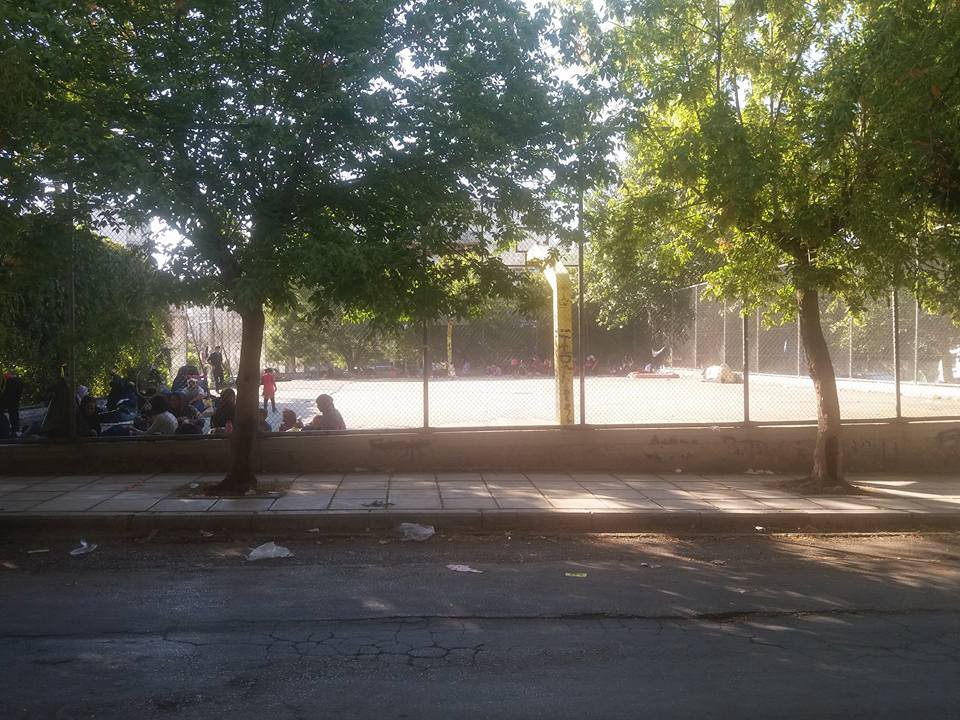
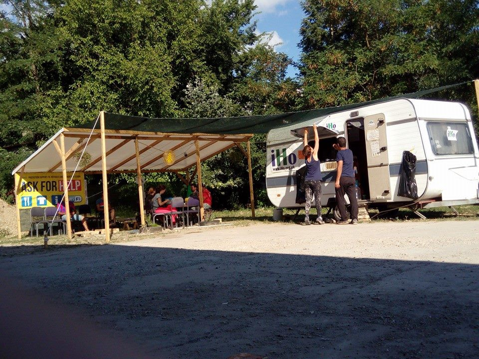
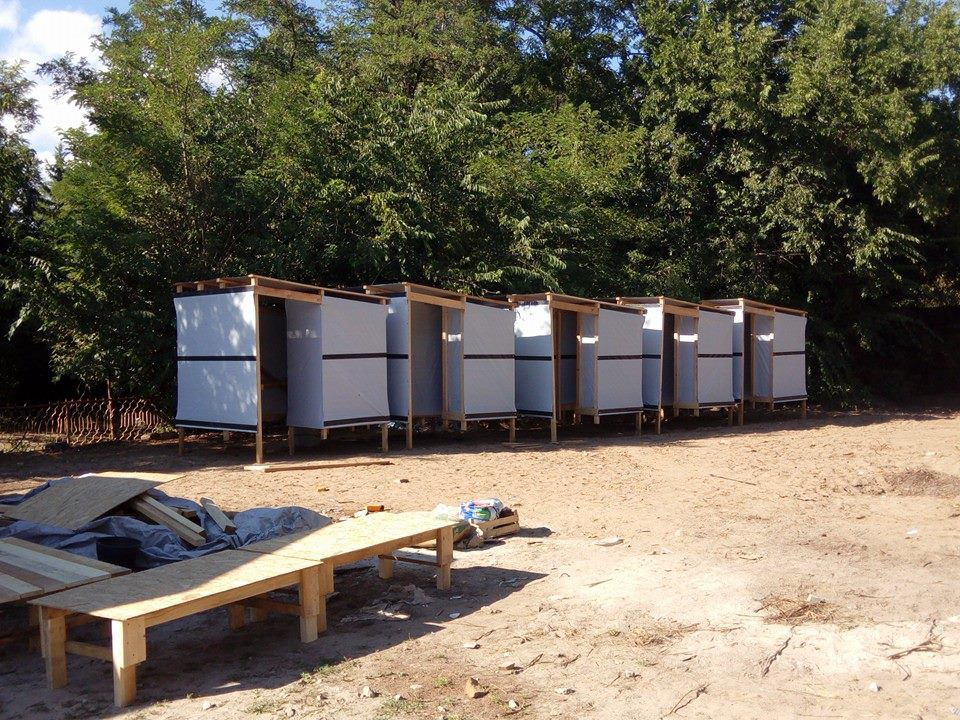

### Are You Syrious Digest 15/8 — Critically ill patients stuck in Syria

_Critically ill patients stuck in Syria\. Dire situation in the Serbian Krnjača camp\. Volunteer kitchen ransacked in Chios and dramatic increase in refugees sleeping in the parks of Thessaloniki\._
#### Syria
### Conjoined twin baby boys evacuated to Damascus but critically ill or injured patients still stuck in Aleppo and Madaya

[Reuters](http://www.reuters.com/article/us-mideast-crisis-syria-health-idUSKCN10N1JD) reports conjoined twin baby boys in Syria were being evacuated across lines from a rebel stronghold to Damascus Children’s Hospital on Friday, the first of at least 20 patients who need urgent transfers to be saved, according to the World Health Organization \(WHO\) \.

The WHO also wants to get seriously ill and wounded patients out of the divided city of Aleppo, where up to two million people are trapped\.

In addition, WHO has received a list of 16 critical medical cases in the government\-besieged town of Madaya who need evacuation and two adults in the opposition\-besieged Foua and Kefraya area, in Idlib province\.

Staffan de Mistura, U\.N\. special envoy for Syria, read out the names of the patients in Madaya and Foua, most of them young children, saying “the UN is ready to evacuate them\. They are in a desperate urgent medical emergency\. Why on earth should this not be possible?”\.

In a letter to the [Syrian American Medical Society](http://us13.campaign-archive1.com/?u=312257def2447c9436f277005&id=5eeb5e11ea) , Dr\. Muhammad Darwish, one of the last three remaining health workers in Madaya, says “between November and May, 86 people died from preventable causes — including 65 from starvation\.” He also says that malnutrition is rampant and medical supplies are lacking, adding that the siege needs to be lifted “once and for all”, while critical cases need to be evacuated immediately\.
### Refugees stranded at the Syrian\-Jordanian border

The situation remains terrible for medical cases at the Syrian\-Jordanian border as well\. The Jordanian border has been closed since the 21th of June, after a car bombing that day at a Jordanian military base, trapping 75,000 displaced people on Jordan’s desert frontier with Syria\. Jason Cone of Doctors without Borders says adequate food, water and medical supplies are not reaching refugees, while UN personnel reported that women had died in labor, children suffered from diarrhea and malnutrition and people with life\-threatening injuries cannot get out for treatment\. The situation is made worse by the arid desert conditions and the scorching heat\.

In the Rukban Camp, one little boy is suffering from inguinal hernia and volunteers have been trying to raise awareness for three weeks in order to evacuate him for medical treatment, so far to no avail\.
#### Yemen
### Saudi airstrikes hits hospital

Saudi airstrikes hit a hospital operated by MSF, killing at least 11 people and wounding 19\. The aid group said “the location of the hospital was well known, and the hospital’s GPS coordinates were repeatedly shared with all parties to the conflict, including the Saudi\-led coalition”, adding “this is the fourth attack against an MSF facility in less than 12 months”\.
#### EU
### Turkey Foreign Minister warns EU\-Turkey agreement could be cancelled

Turkish Foreign Minister Mevlüt Çavuşoğlu warned Turkey could cancel the EU\-Turkey agreement if the EU doesn’t grant visa\-free travel for Turkish citizens in October\. In response, the Austrian Foreign Minister Sebastian Kurz, speaking to Focus magazine, has said Europe should not allow itself to be blackmailed by Turkey, insisting ‘we do not need a deal with Turkey’ as the EU is strong and independent enough to protect its own borders\. He added that, should the EU\-Turkey deal fail, the EU should follow the Australian model and house migrants on islands where they could be processed or returned to their home countries\.
### Greece
### Landings in Lesvos

One boat with 45 people, including one medical case, land in the south\-east of Lesvos\.

Another boat with 51 people landed in Lesvos, assisted by Emergency Response Centre International \(ERCI\) \. The video below shows ERCI’s assistance, both on the sea and on the shore\.

### Volunteer kitchen ransacked in Chios

Gabrielle Tan in Chios reports a volunteer kitchen was ransacked on Saturday night and describes the overall situation on the island:

_On Sunday morning when they went to open the kitchen, preparing to feed the refugees on Chios as usual, the volunteers from Zaporeak Proiektua had a nasty surprise\. Their kitchen was raided and damaged\._ 
_This morning, they found their locks glued\._

_The doors of the European Union remain shut and none of the prosperous nations are living up to their promises of help\. Greece remains its whipping boy, holding 57,000 internationally displaced people in distressing limbo\. Chios holds about 3000ish — and numbers increasing steadily when the weather is calm\. Athens is scrambling to put an emergency plan together — which will probably take months\._

_This has caused much resentment within the local population and authorities, who are tired and fed up, which inadvertently affects the ability of the humanitarian actors to function on the island\._

_There is absolutely no excuse for such acts\. The refugees on Chios are already grappling with squalid conditions, inadequate nutrition and health care, and the psychological toll of living in constant uncertainty\._ 
_To vandalise this tireless group of volunteer efforts, whose main goal is only trying to ease the situation by filling hungry stomachs, is beyond despicable\._

The Zaporeak Project says that with the help of almost 40 volunteers from SMH, Dråpen i Havet and the Chios Eastern Shore Response Team, it managed to clean the kitchen and prepare 1,300 food rations for the refugees, adding “no one is going to scare us and we’ll keep working hard in order to continue cooking for the refugees in the island of Chios\.”

As a reminder, camps on the Aegean islands are overpopulated, with more 3,072 people in Chios for a maximum capacity of 1,100\.
### Dramatic increase in refugees on the streets of Thessaloniki

In the past two days, the number of refugees living in the streets and parks of Thessaloniki has dramatically increased, reaching almost 500, up from 200 on Monday, with around 200 new people coming from Athens\. Only a few volunteers are currently active and long\-term volunteers are desperately needed\. Police is coming everyday, asking for people to join the camps but they are unwilling to do so\. Volunteers report that “despair in the park is growing and the tension is high” and new people are expected to arrive today\. Please check out their post on [Greecevol](http://greecevol.info/task.list.php?ID=230) to see how to help\.

### Malaria cases reported in Thessaloniki camps and Hepatitis A outbreak in Ritsona camp

Volunteers and refugees are advised to use protection against mosquitoes, as several malaria cases have been reported in Thessaloniki camps\. Meanwhile, 24 cases of Hepatitis A have been reported in Ritsona camp and numbers are on the rise\.
### Housing project for vulnerable refugees

As the situation in the official camps seems worse than ever, it is important to remember that dignified and cost effective alternatives exist\. [Filoxenia International](http://filoxenia-intl.org) , a grassroots organization born in Idomeni is carrying one of these projects: a supported \(in terms of education, medical needs, legal advice, etc\. \) housing project for 150 people whose lives is currently at risk in official structures\. The cost of these holistic services breaks down to just 4\.35 euros per person per day, but they need your help right now to secure the building for the next 18 months and move in the first families in September\.
The emergency is to move people out of camps where their lives are at risk, but the project carried out by this team might also push other organization to act or to fund that type of project, and thus hopefully make a difference for much more than 150 people\. Please donate and share this campaign widely: [Help support vulnerable refugees from camps into safety](https://www.youcaring.com/the-most-vulnerable-refugees-in-northern-greece-619523)
### 30 terror experts sent to Greek refugee camps

The [EU Observer](https://euobserver.com/migration/134639) reports Europol will be sending 30 terror experts to Greek refugee camps, in an effort to single out potential jihadis among the nearly 60\.000 refugees stuck in the country\. Europol latest terrorism situation report shows no evidence that terrorists systematically use refugee routes to enter the EU, although there have been single cases of this happening\. The experts will look to identify individuals who risk being radicalised after being stuck in Greece’s camps\. Given the reports of sexual assault, lack of medical care, inadequate food and generally depressing situation in Greek refugee camps, we hope the EU will also make an effort to improve quality of life for refugees stuck in Greece, as well as send the remaining 373 out of the 400 asylum specialists and 376 out of the 400 interpreters they had agreed to provide to process claims for refugees\.
#### Serbia
### Dire situation in Krnjača camp

Yesterday, we reported that refugees were not allowed to leave the Krnjača camp and had to jump over the fence in order to escape back to the city\. Today, a video posted inside the camp shows why some refugees would rather sleep outside rather than in this camp, as more than 20 people have to sleep in a single room while others are forced to sleep in corridors\. Refugees say there is a lack of adequate food and two days ago 100 people were told to leave the camp in the middle of the night, due to a lack of space, forcing them to walk all the way back to Belgrade — a place were authorities are doing everything they can to evict them from the parks and bring them back to camps\.

### Infrastructure completed in Kelebija

Timber Project has finished setting up much needed infrastructure, in cooperation with I’m Human Organization \(IHO\) \. The projects include a wifi and mobile charging shelter in Kelebija as well as showers in Horgos\. IHO is hoping to have showers in Kelebija soon as well\.

Kelebij shelter\. Photo by IHO

Showers in Horgos\. Photo by IHO
### Projects led by refugees

After calling for projects that specifically benefit or represent refugee perspectives, we heard from a [Facebook page](https://www.facebook.com/Refugee-behind-the-closed-borders-1264829603528876/?notif_t=notify_me_page&notif_id=1471264007633836&ref=m_notif&__mref=message_bubble&hc_location=ufi) created by a refugee reporting on the situation at the border between Hungary and Serbia\. These voices are valuable and essential to understand the so\-called “refugee crisis” and the impact the closure of borders has on individual lives\.

_Converted [Medium Post](https://areyousyrious.medium.com/are-you-syrious-digest-15-8-critically-ill-patients-stuck-in-syria-b493adecb55a) by [ZMediumToMarkdown](https://github.com/ZhgChgLi/ZMediumToMarkdown)._
