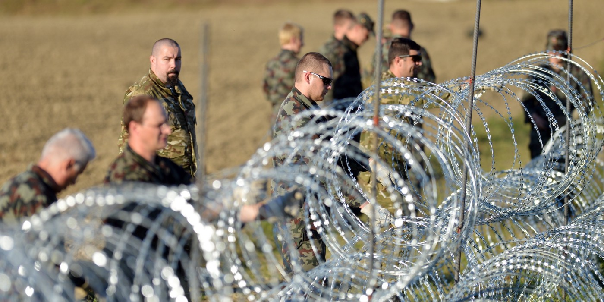
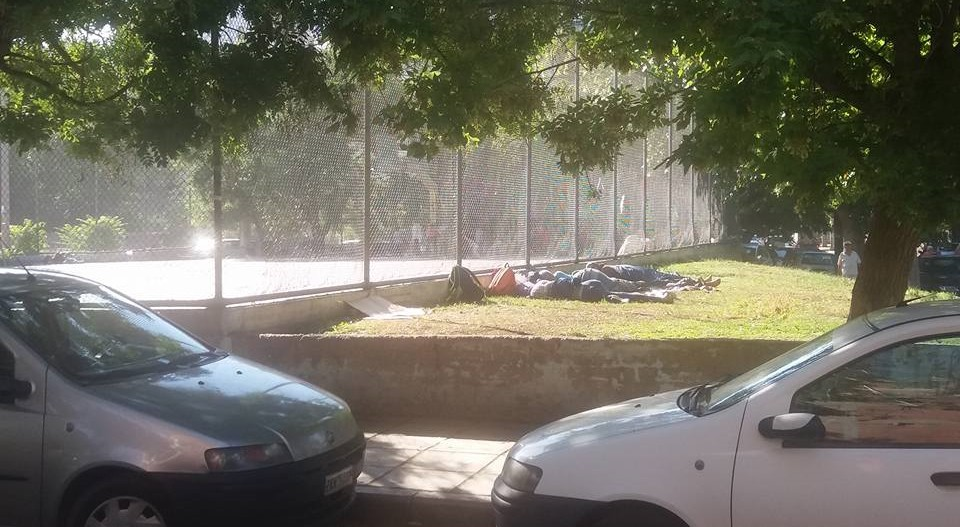
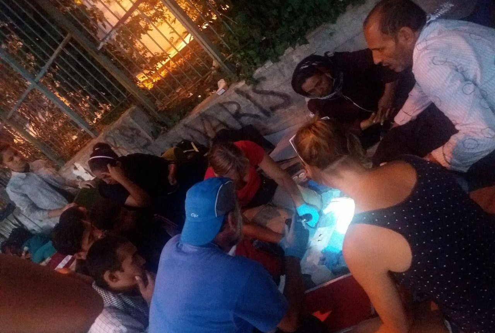
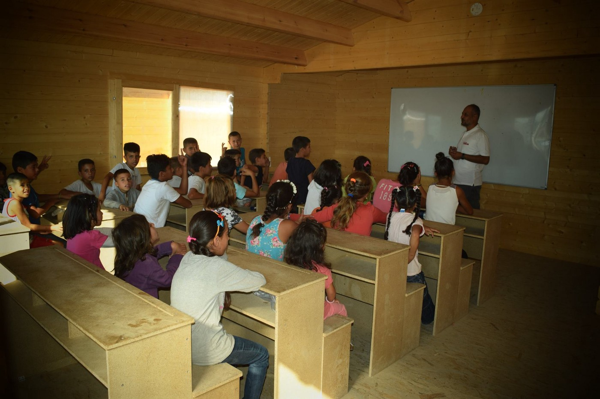
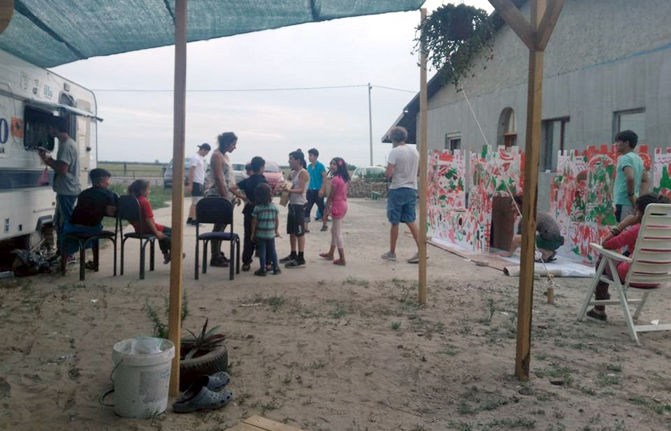
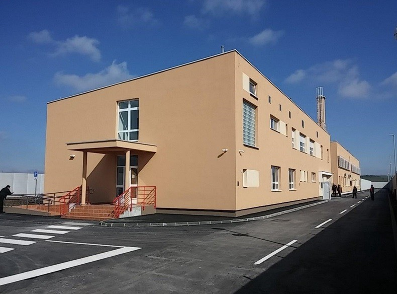
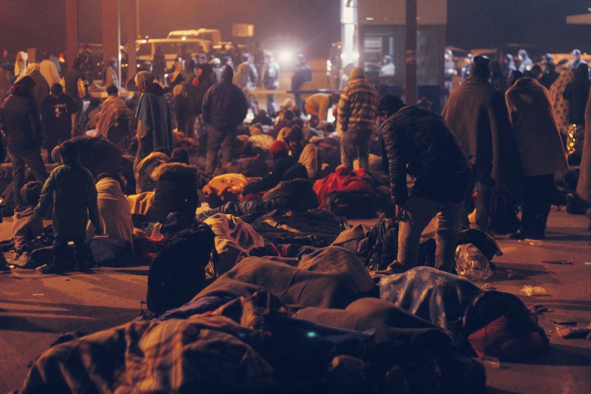
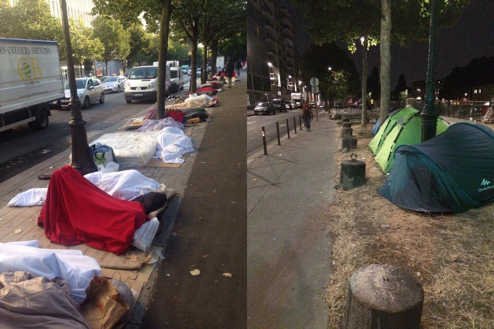

### AYS digest 16/8: Slovenia and Bulgaria trying to cut off refugee routes
#### Number of refugees in Greek camps declining every day\. Balkan countries putting their reception facilities on standby after the rise of irregular crossings\. Donations needed in Serbia and France\.

Slovenian military is now reinforcing the razor wire fence on its border with Croatia\. The fence was set up last November, in a failed attempt to stop the crossings\. Photo: PXL

42 refugees have been brought to North Lesvos by Greek coast guard today, including one pregnant woman\. According to Sandra Uselli, 50 people were taken to Skala Sikamineas harbor by Proactiva\.
### Refugees leaving Greek camps, sleeping on the streets or crossing to other countries

According to AYS volunteers on the ground, number of refugees in Greek camps, especially in the North, is on the sharp decline, while the number of people sleeping in the streets is rising\. Official numbers are also showing significant decline of the numbers in several camps, especially Cherso and Nea Kavala\. In the last week only, Cherso camp went from 3730 to 2560 people, and Nea Kavala from 3697 to 2378 people\. At the same time, the number of “self settled” refugees has risen “self settled population increased from 2,200 to 4,450 officially registered people living outside of the camps\.

Even the small children are sleeping in the open in Thessaloniki\. Photo: Nidzara Ahmetasevic of AYS

On Monday, AYS volunteers have encountered about 200 refugees roaming around Thessaloniki\. Yesterday it was more than 400, while today more than 500 refugees were encountered\. At least half of the refugees in the streets of Thessaloniki are reported to be children and even very small babies\. Food is being delivered by volunteers, as well as medical help\.

Dr\. Karin Tschare\-Fehr helping the refugees on the streets of Thessaloniki

In Cherso, volunteers say the number of residents has declined from last months’ 2,500 to only 950 people today, which is even less than the official statistics\. This can partially be attributed to relocation of 300 Yazidis to Petra, as well as relocation of Arabs to already packed Softex camp, but many refugees have also decided to find their own accommodation or to proceed to Macedonia, Serbia and further to Hungary and other EU countries\.

Same goes for Nea Kavala camp, where the number of the refugees is now 1,200 according to volunteers on the ground, again much less than official numbers \. Unbearable heat with no decent shade remains one of the biggest problems in Nea Kavala, forcing people to seek better places for their families\.

Refugees trying to grow crops in order to improve their nutrition in Nea Karvala camp\. Photo: AYS
### Housings projects bringing hope to refugees

As the situation in the official camps seems hopeless, it is important to remember that dignified and cost effective alternatives exist\. One of them is proposed by [Filoxenia International](http://filoxenia-intl.org) , a grassroots organization born in Idomeni, which carries out a supported \(in terms of education, medical needs, legal advice, etc\. \) housing project for 150 people whose lives would be at risk in official structures\. The cost of these holistic services breaks down to just 4\.35 euros per person per day, but they need your help right now to secure the building for the next 18 months and move in the first families in September\. The emergency is to move vulnerable people from the camps, but the project carried out by this team might also push other organizations to act or to fund similar projects, and thus hopefully make a difference for much more than 150 people\. If you want to donate or learn more, click [here](https://www.youcaring.com/the-most-vulnerable-refugees-in-northern-greece-619523) \.
### School starts in Softex: one of the rare good things in one of the ugliest camps in Northern Greece

While many refugees and volunteers share their stories about terrible living conditions in Softex camp, we are happy to present a rare nice photo from the site: first day of school for little refugees\! The school was built from the scratch up and will be run by InterVolve — International Volunteers\. They deserve all congratulations on their tremendous work\!

First day of school in Softex\. Photo:InterVolve — International Volunteers
### Frontex sending more officers to Bulgarian borders, new patrol veichles and dog teams announced

In response to the request from Bulgarian authorities, [Frontex has announced](http://frontex.europa.eu/news/frontex-to-reinforce-its-activities-in-bulgaria-PkLluH) it will significantly strengthen its ongoing activities at the country’s land borders\. Additional assistance will mainly focus on the border with Turkey but surveillance of the border with Serbia will also be reinforced\.

> “ In the coming weeks, Frontex will deploy border surveillance officers, patrol cars, thermo\-vision vans and dog teams to the land border with Turkey\. At the same time border surveillance will also be reinforced at the Bulgarian\-Serbian border,” said Berndt Koerner, Frontex Deputy Executive Director\. 

Frontex will also strengthen its presence at the border crossing points to help the Bulgarian authorities detect persons hidden in cars, buses and trains\. Frontex will also deploy more screening and debriefing experts\. Currently, Frontex deploys 63 experts of different profiles at the border with Turkey and 17 border surveillance officers at the Bulgarian border with Serbia\.
### Instead of going to Northern Serbia, consider donating to those who are already there

Following few very very bad months for the refugees stranded in Northern Serbia, volunteer efforts have made situation in Subotica area, including Kelebija and Horgos border crossings with Hungary, much better\. Basic facilities have been set up and food distribution is working, but with hundreds of families waiting in a hope to be admitted to Hungary, which still accepts only 30 people per day \(15 at each crossing\), volunteers can run out of funds quite fast\. That’s why we’d like to ask you to consider donating to valuable teams who are already there instead of spending that money on travelling to Serbia, because it seems there are enough volunteers at the moment\.

Makeshift infrastructure is improving in Kelebija and Horgos camps\. Photo: IHO

Some \(but not all\) of the teams and groups worth donating to are [IHO](https://www.facebook.com/imhumanIHO/) , [The Timber Project](https://www.facebook.com/thetimberproject.org/?fref=ts) and the independent volunteer team coordinated by [Dan Song](https://www.facebook.com/infisterra?pnref=story) on Serbian side of the border, as well as [MigSzol](http://www.migszol.com/) on Hungarian side\.
### People caught in illegal crossing to Croatia might be forwarded to the new reception centre in Tovarnik

Last week, Croatian Ministry of Interior has published [first photos](http://Tranzitni%20prihvatni%20centar%20za%20strance%20Tovarnik) of the new reception facility in Tovarnik, near the border with Serbia\. This is where irregular migrants caught on Croatian soil might be brought in the future\. According to announced police plans, people caught in irregular border crossings will first be forwarded to Tovarnik facility, and then forwarded to asylum seeker’s facilities in Zagreb or being pushed back to Serbia\.

New reception center for irregular migrants in Tovarnik\. Photo: Croatian Ministry of Interior
### Several groups of smugglers and irregular migrants caught on Croatian\-Slovenian border

At 7 AM yesterday, Croatian police caught a group of four Serbian nationals smuggling 40 people in the village of Lisac, on Croatian\-Slovenian border\. According to [official police report](http://www.primorsko-goranska.policija.hr/MainPu.aspx?id=242371) , a total of 26 Turkish, 6 Iraqi, 3 Pakistani, 3 Syrian and 2 Indian citizens were found in this raid, hiding in cargo compartment of smuggler’s vehicles\.

Earlier this weekend, additional 12 people coming from Algeria, Morroco, Lybia, Sahara, Sierra Leone and Syria were caught in nearby villages of Šapjane and Pasjak, also on Croatian\-Slovenian border\.

Two people from Serbia and Kosovo, one of them charged for facilitating illegal border crossing, were also arrested in Pasjak area this weekend\.
### Slovenia reinforcing wire fence after reported increase of irregular border crossings

Slovenian authorities have announced they will reinforce the wire fence along the border with Croatia, following the reported increase of irregular refugee arrivals\. According to unnamed government official cited in local newspapers, several smuggling attempts and irregular border crossings have been detected recently\. Some of the refugees who were caught were pushed back to Croatia, while others have asked for asylum in Slovenia\.

Humanitarian collapse on Croatian\-Slovenian border last October\. Photo: Tinka Kalajdzic of AYS
### Slovenian reception centres on standby in preparation for possible further increase of arrivals

According to Slovenian police, last week there were 311 refugees in accommodation and detention centres, but more people are thought to have passed the country without being registered\. Slovenian officials are getting ready for the possible scenario of re\-opening the route if Turkey decides to abandon its deal with EU and start letting more refugees to proceed to their journey towards EU countries\. Reception centres in Dobova, Lendava and Šentilj that were shut down after border closure in March are now put on standby, as Slovenian authorities are “preparing for 10 possible scenarios, including re\-opening of the route”\. Local UNHCR branch is cooperating in preparations for possible increase of arrivals, and some of the volunteers have been asked to “be prepared for possible support in autumn”\.
### Italian municipalities propose a plan for equal redistribution of migrants in the country

The national association of Italian municipalities \(ANCI\) [has proposed a plan](http://www.firenzepost.it/2016/08/16/migranti-accoglienza-limitata-a-non-piu-di-150-000-ogni-anno-laccordo-anci-ministero-interno/) to redistribute the presence of refugees in an equal way, considering the possibility to host an average of 2\.5 refugees for each 1,000 inhabitants in municipalities throughout the country\. The plan, thought to “protect metropolitan cities and small municipalities”, is basically extended from the regional method of distribution, spreading the Sprar \(system for receiving migrants\) model to all Italian municipalities, as opposed to the current emergency program aimed towards big concentrations in few areas\.

In an attempt to sensibilise locals about the needs and struggles of the refugees, Don Primiero Scortini, priest of Gragnana parish \(Carrara, Tuscany\) introduced 19 migrants from Benin, Nigeria, Ghana and Sudan to the 900 inhabitants of the small municipality\. The young refugees are supported by Servizi Toscani, the new regional service providing food and accommodation\.
### Situation in Paris declining: food, blankets and sleeping bags urgently needed for the newcomers

More newcomers are forced to sleep in the streets of Paris\. Photo: Christine Dolan

While many of us are looking towards Balkans and the Mediterranean, situation in France is getting worse every day\. Volunteers are reporting about many new refugees arriving to Paris without basic necessities\.

> “More asylum seekers arriving daily… close to Jaures and Flandres…\. families with tiny babies \( including a 1 month old\), toddlers, unaccompanied adolescents/teenagers, young pregnant women and hundreds of young men fleeing Sudan, Afghanistan, Eritrea, Somalia, Ethiopia, Chad…\. Almost daily police violence for these asylum seekers since 31/7 and before…\. \.tear gas, tazers, truncheons…\. continued trauma for most of whom have already lived major trauma…\. Stocks are low — almost zero — in the kitchen currently used to provide around 1000 meals per day \( growing between 50–100 per day\) \. Donations URGENTLY needed\. \. Lentils, chick peas, tins of tomato concentrate, onions, vegetables, pasta, rice\. There are many stores close to the camp areas so I will be happy to go shopping with you if you don’t know the area\. [Karim El Rifi](https://www.facebook.com/karim.elrifi75) is currently organising meals… Blankets and sleeping bags also URGENTLY needed, says volunteer [Christine Dolan](https://www.facebook.com/christine.dolan.10) , whom you can PM for more details\. 

The Facebook group [“Organisation Ravitaillement](https://www.facebook.com/groups/organisationravitaillement/?fref=ts) ” is also coordination the distribution of meals in Paris\.
### Berlin has fired a company operating refugee shelters after “unspeakable emails”

The city of Berlin has canceled its contract with the refugee housing management company PeWoBe, which stands for “Professional Housing and Assistance Company,” which runs 11 refugee shelters in the German capital, and several more in the states of Brandenburg and Saxony\-Anhalt\.

The decision had been made in the aftermath of correspondence in which several senior staff members of PeWoBe discussed what they should do with a 5,000 euro donation, including suggestions of “child guillotines” and adding that the “maximally pigmented refugees could do the cleaning up”\.

The email correspondence was leaked to the city of Berlin, and over the weekend\. We recommend [the article in DW](http://www.dw.com/en/berlin-cuts-ties-with-refugee-housing-firm-after-unspeakable-emails/a-19476506) for more details\.

_Converted [Medium Post](https://areyousyrious.medium.com/ays-digest-16-8-slovenia-and-bulgaria-trying-to-cut-off-refugee-routes-as-more-people-move-towards-e1a0f6f049ed) by [ZMediumToMarkdown](https://github.com/ZhgChgLi/ZMediumToMarkdown)._
