### AYS Digest 18/8: What choices for Syrian children?
#### Harrowing accounts of torture in Syrian prisons\. Refugees looking for smugglers while few are being relocated\. Man with serious health issues gets no help in Oreokastro\. More and more Syrians get subsidiary protection instead of refugee status in Germany\.

**](assets/c40388a5e008/0*wz34A2HWkwS-Vu3H.)

**Cartoon by [Khalid Albaih](https://www.facebook.com/KhalidAlbaih/)**
#### Syria
### Harrowing accounts of torture and mass deaths in Syria’s prisons\.

[Amnesty International](https://www.amnesty.org/en/latest/news/2016/08/harrowing-accounts-of-torture-inhuman-conditions-and-mass-deaths-in-syrias-prisons/) says an estimated 17,723 people have died in custody in Syria since March 2011 and spoke to 65 survivors [to reconstruct the Saydnaya torture prison and their experiences of detention](https://saydnaya.amnesty.org/) \. Prisoners were held in darkness and experienced beatings, electric shocks, burns and other torture methods, with 50 prisoners often crammed together in a 9 square meter cell for months and sometimes years on end\.

[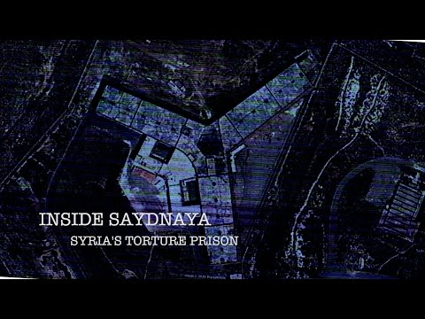](http://www.youtube.com/watch?v=ysgnadic3Yo)

### Omran’s photo

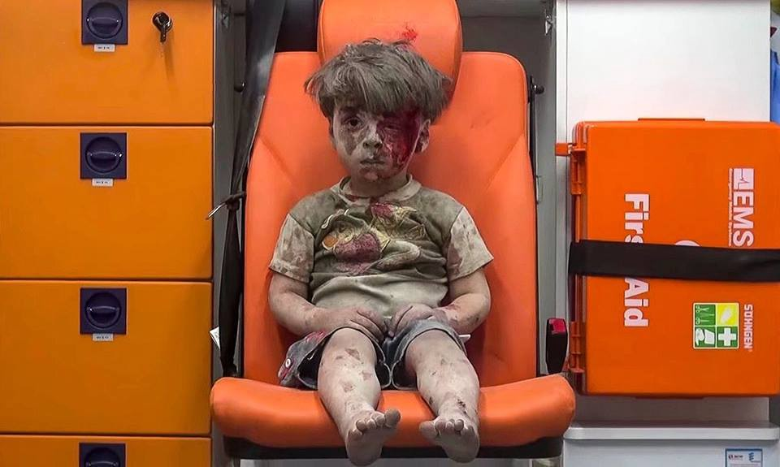

Photo by Mahmoud Rislan

The photo that has now traveled along the world was taken by Mahmoud Rislan\.

He says:

_The tears started to drop as I took the photo\. Its is not the first time I’ve cried\. I have cried many times while filming traumatized children\. I always cry\. We war photographers always cry\. Last night everyone cried\._

_Omran’s affected me because he was silent\. He didn’t cry\. He didn’t say a word\. He was shocked\._

_I thought of my 7 days old baby girl\. I thought to myself it could be her\. It could be any child in Aleppo or Syria\._

_Then the White Helmets team continued to rescue the family members\. Omar’s eldest sister who is 11 looked at me and said please don’t film\. I turned of my camera and told her “sure my darling I will not”\._

_Thank god all Omran’s family are safe\. His mother had some bad injuries in her legs\. His father suffered a minor head injury\. His 7 year old sister went through a surgical operation this afternoon and she is doing well\._

**_Today when i woke up to see the whole world using the photo and talking about it\. I thought to myself, I hope all photos of children and attacks in Syria go viral so the world know what is life like here\._**

**_If people knew what it was like maybe the war will stop the bombing will stop\._**

**_Maybe Omran and my daughter Amal can live normally like all children in the world\._**
### UN Syria envoy suspends humanitarian task force amid continued fighting\.

Staffan de Mistura, the UN’s special envoy for Syria, said it made “no sense” to plan aid deliveries when they would not be let into besieged areas, with convoys not being able to reach surrounded towns and cities throughout August\.

He added, _“what we are hearing and seeing is only fighting, offensives, counteroffensives, rockets, barrel bombs, mortars, hellfire cannons, napalm, chlorine, snipers, airstrikes, suicide bombers\.”_
#### Turkey
### Refugees struggling in Turkey

The [EUobserver](https://euobserver.com/migration/134669) reports only around 20% of refugees have been able to find shelter in dedicated camps and only one of the six EU\-funded reception camps can be used as intended, hosting up to 750 people\. The Council of Europe’s special representative on migration and refugees, Tomas Bocek, says ”for many refugees and asylum\-seekers outside the camps, it is a struggle to survive\. Harsh living conditions may be a very important push factor for those who decide to leave for other Council of Europe member States”\. Child labour is ”exploding”, he added and the number of child brides is on the rise as well\.
#### Greece
### 8 Syrians deported to Turkey from Greece

The eight refugees were sent to Turkey after reportedly withdrawing their claim for asylum in Greece\. A flight was chartered by Frontex and they were flown to Adana, southern Turkey, according to the Athens\-Macedonian News Agency\.
### Only 3,002 out of 66,400 refugees relocated so far

EU numbers show only 267 people have been relocated from Greece from the 31th of July to the 16th of August and only 3,002 out of 66,400 refugees that the EU wants to relocate until September 2017 have been relocated so far\. Belgium, Bulgaria, Cyprus, Croatia, the Czech Republic, Ireland and Spain have relocated nobody during this time frame— France has relocated one person, Germany five\. At this rate, it would take ten years, four months and 27 days to complete the relocation program\. UNHCR however reports that 400 pledges for Greece were opened by France on the 12th of August\.

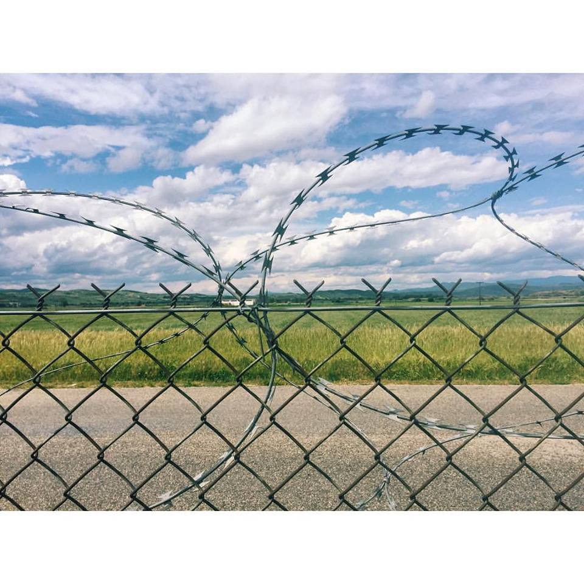

Nea Kavala\. Photo by Aida Kristina Ničija

**139 refugees land in Lesvos, 58 in Chios, 24 in Kos and 25 in Kalymnos**

Refugees are not able to leave Greece, but the number of people arriving on Greek islands keeps increasing\.

66 people, including eight children, were transferred on the UK Frontex Protector vessel in the north and brought down to Mytilene harbor\. One boat with 73 people, including 15–20 children and many women, was picked up in the south by Norwegian Frontex and brought into Mytilene harbor\.

39 men, 11 women and 8 children landed on Chios this morning\.

24 landed in Kos and 25 in Kalymnos\.

The 188 new arrivals are far more than the average of 99 people per day for August and of 60 per day for July\.
### Greece plans to build new facilities to decongest overcrowded camps

As of 14th of August, 161,599 refugees have arrived by sea in Greece, with 48% from the Syria, 25% from Afghanistan and 15% from Iraq\. UNHCR says the “ small increase of refugees and migrants arriving on the Aegean islands” has “placed additional pressure on the already overstretched reception facilities”\. On Chios, maximum capacity has been reached in Vial and in the informal sites of Souda and Dipethe\.

As part of the decongestion efforts, the government is planning to transfer 1,000 to 2,000 asylum\-seekers issued with asylum cards \(mainly Syrians\) to sites on the mainland\.

[Reuters](http://www.reuters.com/article/us-europe-migrants-greece-idUSKCN10S1N2?feedType=RSS&feedName=worldNews) reports on Greece’s plan to build several new facilities with a capacity of about 1,000 people each\. One Greek official said “the new facilities will be better, more permanent, smaller dwellings”\. The official admitted the slow processing of requests for asylum was creating frustration at the camps, as “people feel trapped and disillusion is growing\. They came very close to materializing their dream of reaching Europe but it didn’t happen”\.
### Asylum claims often rejected but the decisions can and should be appealed

Frustration is building not only because of the slow asylum process but also because asylum claims continue to be rejected, as Turkey is considered a “safe country”\. Yesterday, the applications of ten Syrians were rejected as inadmissible for that very reason and volunteers report that “despair is palpable”, with discussions around the use of smugglers intensifying\.

However, as far as we know, only two appeals so far were lost and went on to the next appeal stage\. It is therefore worth appealing asylum decision\. The deadline to appeal is five calendar days after the decision is delivered, but the deadline includes holidays and weekends\. Advice on how to prepare asylum interviews and how to appeal a negative decision is available on [Refucomm](http://refucomm.com/greece/) \.
### Refugees chased in Thessaloniki

The police continues to chase refugees away from parks and streets, arresting them and transferring them to different camps\. Despite this, refugees, including families with new born babies, keep coming back to wait for smugglers, as life in the camps has become unbearable\.

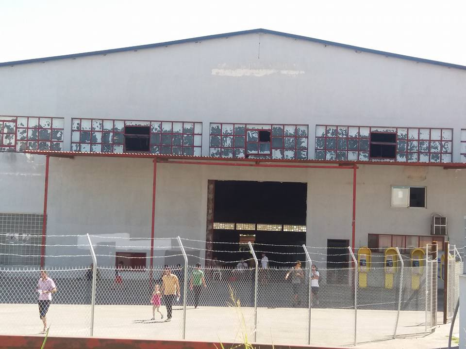

**Oreokastro camp\. Inadequate food remains an issue\. The heat is suffocating inside, with not enough fans or mosquito protection\. People sleep on floors or on wooden pallets and women in particular do not feel safe\.**

**Nea Kavala Camp\. The camp is in a remote area, in the middle of a field\. It is burning hot there and during the day it is completely silent as people prefer to stay in their tents\. There are no trees and no shade\. Until a couple of days ago they used to have running water restrictions and they are afraid it will happen again\.**

Others are in the streets because of a lack of public assistance\. In one recent case, a woman was brought from a camp to the hospital because of her seven month old baby’s fever\. After one day she was told to leave the hospital, but was not offered any help, leading her to wander the streets of Thessaloniki for two days with her baby, lost and afraid, without money and without food\.

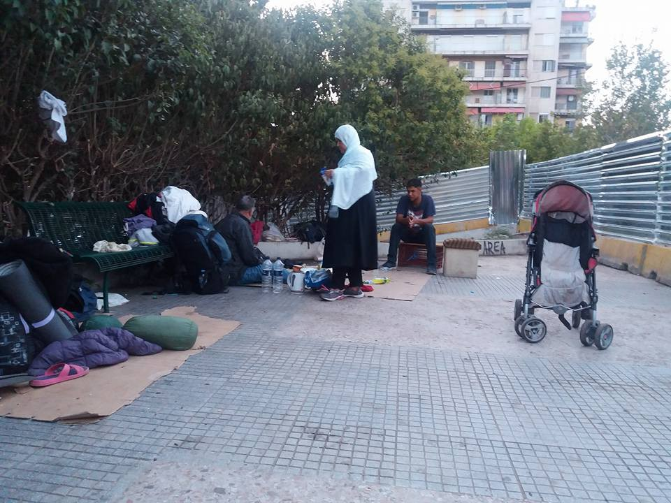

People sleeping in the streets and parks of Thessaloniki

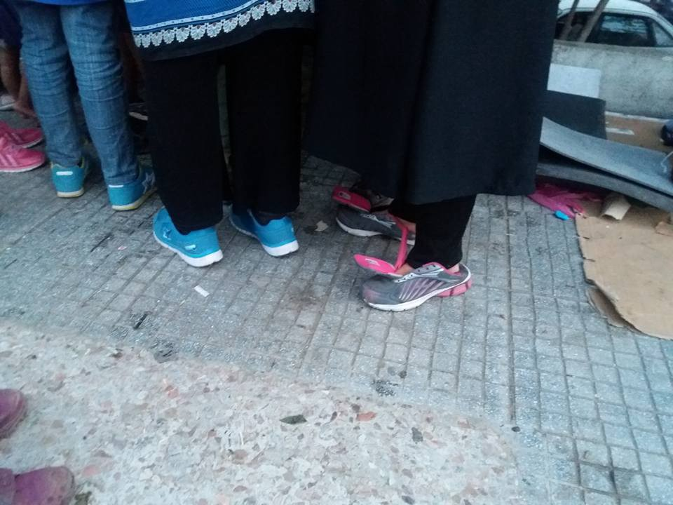

Refugees getting ready to walk \(1/2\)

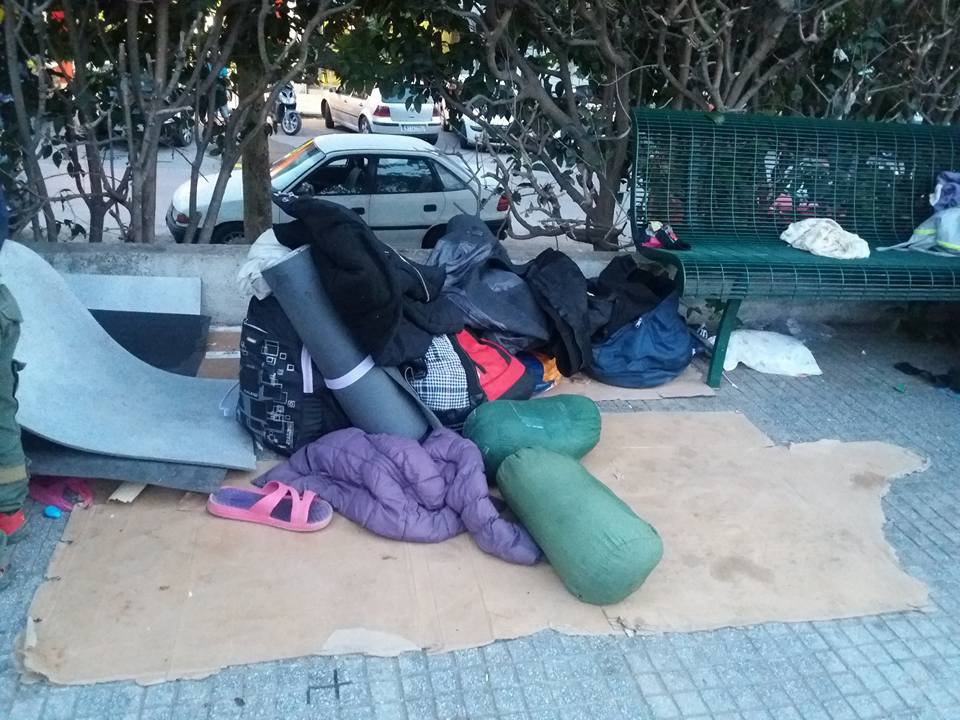

Refugees getting ready to walk \(2/2\)
### No help for man with serious health issues

UNHCR claims, that its “primary purpose is to safeguard the rights and well\-being of refugees”\. What an AYS volunteer experienced today in the Oreokastro camp in Thessaloniki was the complete opposite\. Instead of taking care of the refugees — especially the vulnerable cases — a representative was turning away\. Literally\.

The story: AYS already made an urgent call on Saturday to help Ibrahim\. He was shot in his chest/heart more than two years ago causing cardiac arrhythmia with multiple ectopies “occasionally resulting in loss of conciousness or pre\-syncope”, as a MDM doctor wrote in his diagnosis\. Already on Saturday, and of course before, he had serious health problems\. “Today we found him in a much worse condition“, our volunteer reports\. He still has problems breathing and can hardly stand up on his own\. Neighboring refugees also told us that he can’t walk without assistance\. He was in a hospital before but released without proper help\. At least three independent doctors assessed his condition\. All concluding he is in serious danger\. The first medical report dates from June\.

An independent doctor visited Ibrahim today and was told by an UNHCR representative, that Ibrahim would maybe have to wait until October to move to another shelter, where he could breathe more easily\. Furthermore, our volunteer got to know that UNHCR is aware of Ibrahim’s case \(and others\) but did — unfortunately — nothing\. It takes time, they are not responsible but the government, there are other cases, are some of the excuses the volunteer heard today\. Confronted with their mandate to protect refugees, the officer turned around and simply left\.

Dear High Commissioner for Refugees, is this how you ensure, how you safeguard the rights and well\-being of refugees? Is this how protection seekers with serious health problems should be treated? Until \(maybe\) October, Ibrahim maybe\( \! \) won’t be alive anymore\. The world is outraged with good cause by the tragedy of a five year old, wounded and traumatized by bombings on Aleppo\. Meanwhile, Europe fails to provide even minimum health care to humans in need living in a peaceful environment\.

If you, reader, see any possibility of helping Ibrahim, please contact us\.

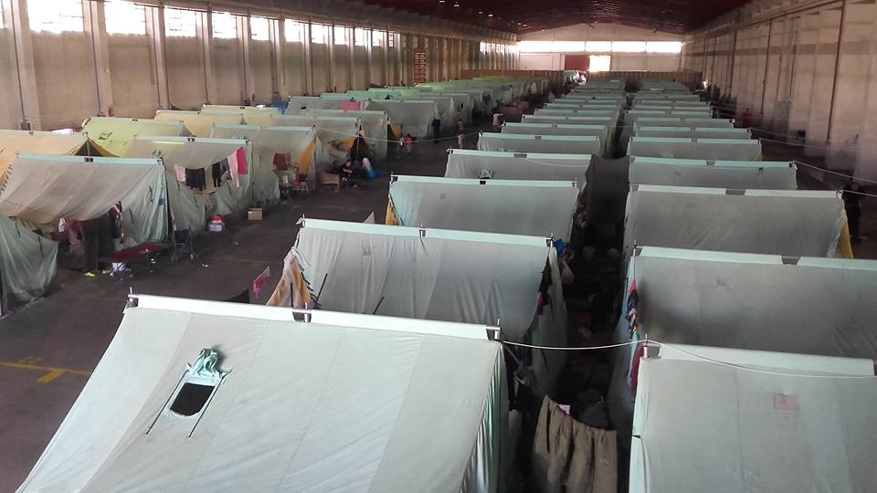

Oreokastro\.

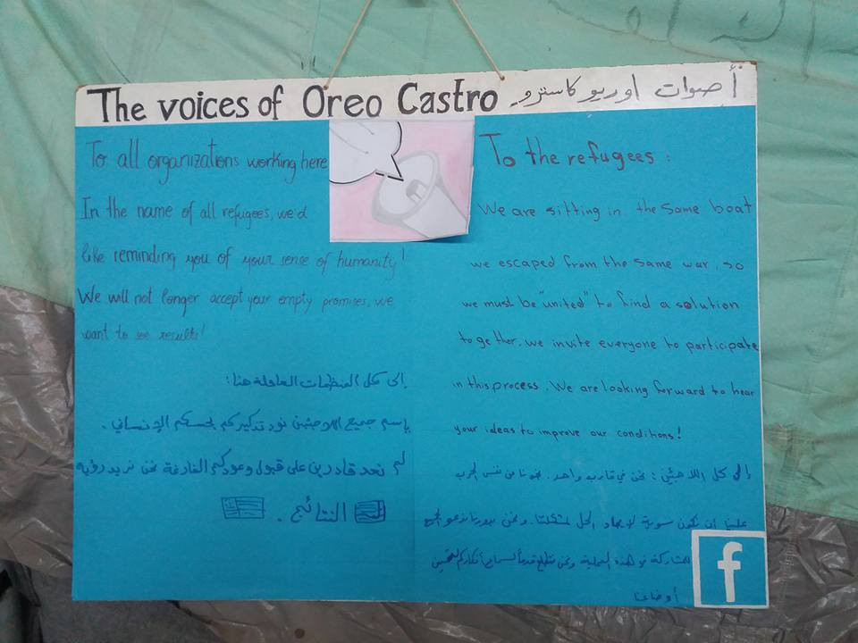

Self\-organization in the camp\.
### Isolated refugees at Kypselohori camp

The 150 Syrian refugees trapped in Kypselohori camp suffer from isolation and malnourishment, as the camp is located 18 km outside of Larisano, with no mini\-market or entertainment nearby\. 
The food provided by the army is reportedly very bad and inadequate and is composed of the usual array of rice, pasta and potatoes, with little protein or vegetables\.

On top of all this, the camp has insufficient access to medical care, a lack of quality water and close to no entertainment for kids\. It is one of the many smaller, regional and less visible camps that get insufficient aid\.
#### Serbia
### 3,112 migrants attempt to cross Serbian border since July 22nd

[Novonite](http://www.novinite.com/articles/175943/Serbian+Border+Patrols+Discover+over+3%2C000+Irregular+Migrants+since+July+22) reports joint army and police patrols at Serbia’s borders have found 3,112 migrants who attempted to cross illegally into the country since July 22 — two people traffickers trying to smuggle 30 migrants into Serbia were detained last night\.
### Timber Project completes projects in Kelebija and Horgos

Shower units for 500 people and two handwash stations were completed in the Horgos refugee camp, while one Learning Centre and a Wifi station were built for Kelebija\. Quality of life has slightly improved for refugees living in what some call ‘the new Idomeni” — new makeshift camps provoked by the closure of borders\.

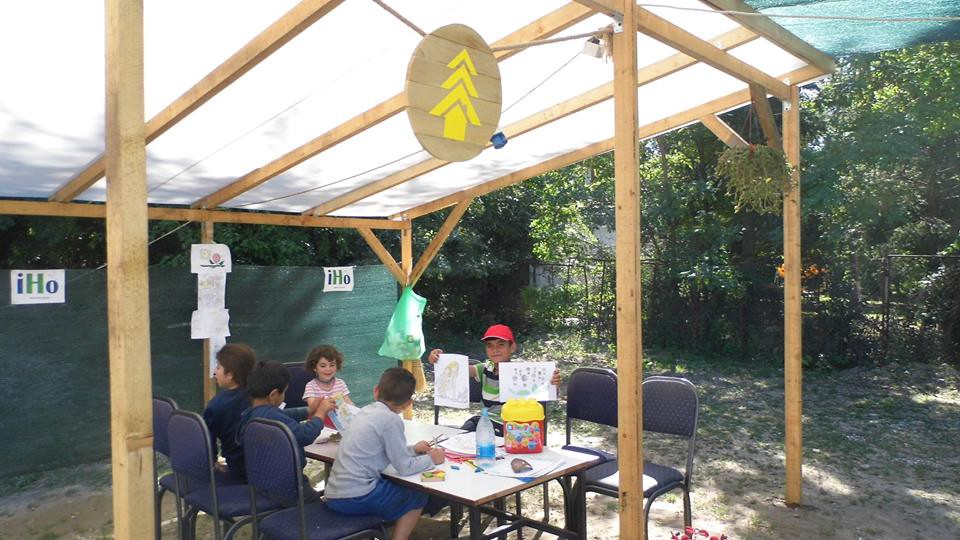

Kelebija — Photo by Timber Project

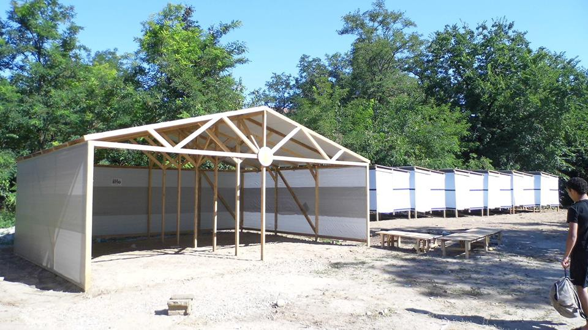

Horgos — Photo by Timber Project
### Germany
### More than 600 deportations cancelled

Die Süddeutsche reports more than 600 deportations have been cancelled between 2015 and June 2016 — in 322 cases the persons resisted, in 160 cases the airline or the pilot refused to transfer the migrants and in 37 cases the country of origin refused to take them back\. Over this same timeframe, 35n000 people were deported\.
### No returns to Greece until 2017

[Mobileinfoteam](https://mobileinfoteam.blogspot.fr/2016/08/deportation-stop-from-germany-to-greece.html) says the German Ministry of Interior has decided nobody seeking asylum in Germany can be returned to Greece, until at least the 8th of January 2017\.
### Syrians get subsidiary protection instead of refugee status

[NDR](http://www.ndr.de/nachrichten/fluechtlinge/Immer-weniger-Syrer-als-Fluechtling-anerkannt,syrer140.html) reports less Syrians are getting recognized as refugees and more get subsidiary protection, which suspends family reunification for two years\. The paper says almost all Syrians got a refugee status until February and the number of Syrians getting subsidiary protection has jumped to 55% in July\. Syrian men are under ‘immense psychological pressure”, as they had hoped to reunite with their families as fast as possible\. The Ministry of Interior argues Syrians are mostly victims of a civil war but are not individually persecuted but NDR notes decisions from several regional courts say Syrians have a right to the refugee status, as the simple fact of fleeing the country is a political statement that could lead to persecution if forced to return\.
### Italy sets up shelter near Swiss border after Switzerland cracks down on crossings

[Aljazeera](http://www.aljazeera.com/news/2016/08/italy-set-camp-refugees-shut-swiss-160818110337920.html) says Italy will set up a shelter to host as many as 300 asylum seekers stranded near the Swiss border, after Switzerland cracked down on crossings, forcing hundreds to sleep on the ground in a city park\.

Refugees wanting to cross into France or Switzerland are stuck in Italy, leading to the creation of makeshift camps — in Ventimiglia, near the French border, in Como, near the Swiss border but also in Milan, “the gateway to the north”\.

_Converted [Medium Post](https://areyousyrious.medium.com/ays-digest-18-8-what-choices-for-syrian-children-c40388a5e008) by [ZMediumToMarkdown](https://github.com/ZhgChgLi/ZMediumToMarkdown)._
