### AYS digest 20/8: Volunteers urged to report cases of malaria

> Greek government trying to set up four new refugee camps in Crete\. Fire destroyed the refugee camp in Thessaloniki port\. 376 people saved, at least 7 refugees drowned off Libyan coast\. Up to 3,600 refugees residing in Milan after being pushed back to Italy\. Situation in Northern Serbia improving thanks to independent volunteer teams\. Donations needed on several Greek sites\. 

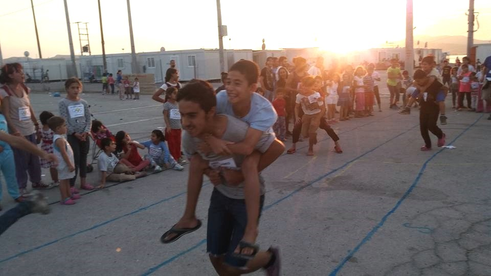

Olympic games event in Skaramagas camp\. Photo: Hussain Jeqou **‎**
### Malaria concern in Greece: Volunteers are urged to monitor situation and seek medical help if needed

Following yesterday’s concern of malaria in Sindos\-Frakapor camp, where several potential cases are still waiting to undergo malaria tests after showing symptoms of the disease, we’d like to urge all the volunteers in Greece not to raise panic, but to monitor the situation and seek medical help if any concern about possible infections arise\. According to [today’s news](http://www.ekathimerini.com/211353/article/ekathimerini/news/blood-giving-ban-due-to-malaria) , Malaria infections in 12 Greek municipalities have led to citizens and visitors to those areas being banned from giving blood\.

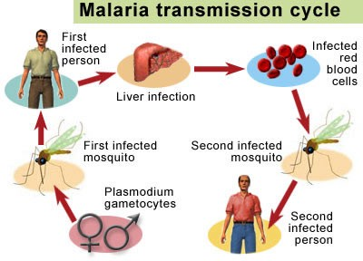

Malaria can spread in overcrowded environments such as refugee camps\.

The Hellenic Center for Disease Control and Prevention and the National Center for Blood Donation both issued malaria warnings regarding the 12 municipalities — namely Farkadona, Trikaia, Palama, Evrota, Halkidaia, Thiva, Tempe, Marathonos, Western Achaia, Andravida\-Kyllini, Lagada and Pylaia\. According to the [official epidemiological surveillance report](http://www.keelpno.gr/Portals/0/%CE%91%CF%81%CF%87%CE%B5%CE%AF%CE%B1/%CE%95%CE%BB%CE%BF%CE%BD%CE%BF%CF%83%CE%AF%CE%B1/2016/Malaria_report_ENG_03_08_2016.pdf) , immigrants make 42 cases out of a total number of 55 patients who were diagnosed with malaria from the beginning of the year up to the 3rd of August 2016\. [In the last two weeks, the official number of confirmed malaria patients has risen to 65](http://www.ekathimerini.com/211353/article/ekathimerini/news/blood-giving-ban-due-to-malaria) , but with 61 of these cases deemed to have been “imported”, meaning the carriers of the disease were infected abroad\. Spanish newspaper [El Mundo](http://www.elmundo.es/salud/2016/08/20/57b84093e2704eda478b45c9.html) also says that **out of the 65 cases, eight have been reported in refugee camps\.**

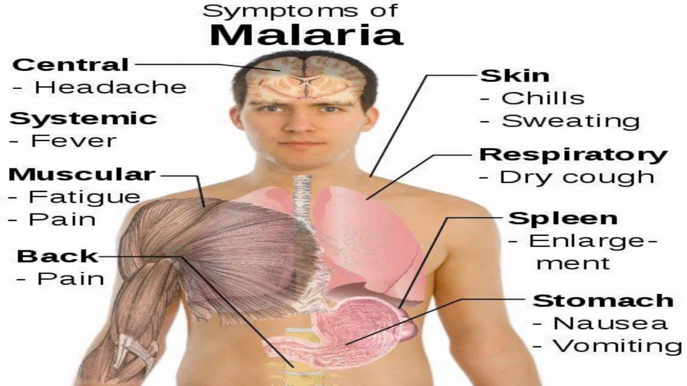

Seek professional medical assistance if you notice there symptoms\! Do not self\-medicate or give out medicine to others\!

According to MSF guidelines, uncomplicated malaria should be considered if a patient presents with fever, especially if it is associated with chills, sweating, headache, muscular ache, malaise or nausea\. In children, fever may be associated with abdominal pain, diarrhea and vomiting\. In addition, patients with severe malaria may present one of more following complications: impaired consciousness, generalised or focal seizures, extreme weakness, heavy breathing, weak pulse, cold extremities, abnormal bleeding\. Please use this for reference only and do not attempt to self\-diagnose or treat anyone: **professional medical assistance is crucial** to diagnose, treat and prevent spreading of the disease, especially in environments such as refugee camps\.

54 **people were intercepted by Norwegian Frontex off South Lesvos and brought to Mytilene around 7AM today\.** One 7\-year\-old Syrian boy was found with an injury on his right ankle, caused in the process of boarding the refugee boat, and was provided first aid before being forwarded to the local hospital for further checkup\. [Emergency Response Centre International](http://www.ercintl.org/) has published a video of the event\.

### Shameful court case against Spanish lifeguards accused of human smuggling still pending

Spanish firemen from PROEM\-AID NGO have published a video to remind us about the shameful legal case that’s pending against them\. They have rescued thousands while working as an emergency team on Lesvos, but their lifesaving actions were seen by the Greek government as human smuggling\. The legislation which allowed Julio, Manuel and Enrique to be accused of smuggling is being revised by the European Commission, but they could still face a sentence of 10 years of imprisonment\. Here’s their story:

[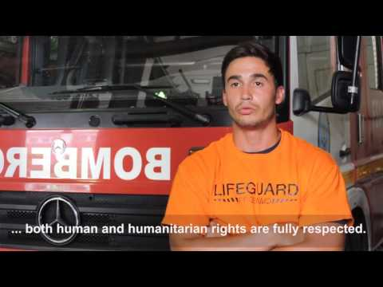](http://www.youtube.com/watch?v=RsWWhtkLPwI)

You can show your solidarity by signing the [petition](https://act.wemove.eu/campaigns/criminalising-humanity) to support their cause\.
### Government trying to set up four new refugee camps in Crete, local authorities opposing the plan

According to a [local news outlet](http://www.ekathimerini.com/211337/article/ekathimerini/news/concerns-rise-amid-migrant-uptick-news-of-german-plan-to-pressure-greece) , Greek government is in talks with local authorities in an attempt to set up four refugee accommodation facilities on Crete island, one in each of its prefectures\. Local authorities on Crete say they are concerned about the government’s plan to set up facilities there and have insisted on a meeting with Migration Policy Minister to air their grievances\.

> “Unfortunately there is no comprehensive plan\. We said that Crete should assume its responsibilities but subject to certain conditions”, said Crete’s regional governor, Stavros Arnaoutakis, at the meeting of local authority officials on Friday\. Ierapetra Mayor Theodosios Kalantzakis said he wanted concrete promises from the government\. “If we don’t have specific commitments, we won’t accept it,” he said\. “I say it clearly: Ierapetra will not accept even one refugee\.” 

### Refugee women of Samos learning to swim, local volunteers need donations to continue their work

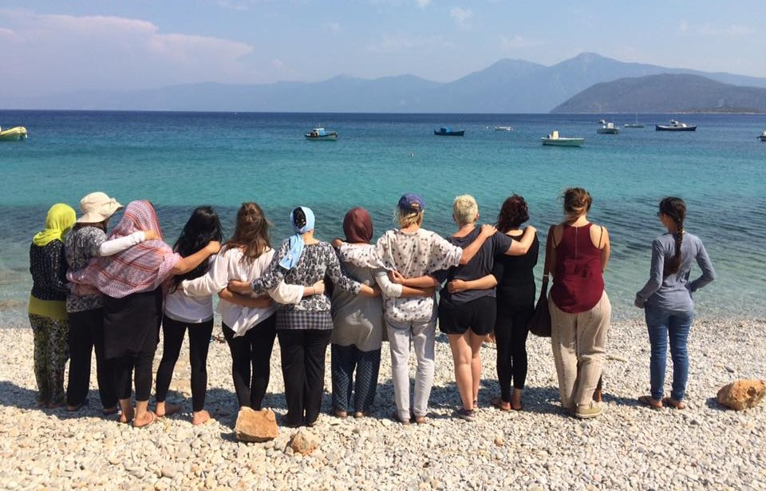

Samos Volunteers have had a second day of swimming lessons for refugee women at Mourtia Beach today\. Ten Afghani women and children attended, with five volunteers serving as swim teachers\. They started with floating and blowing bubbles through the nose\. By the end of the day, four women can swim without assistance in the shallow water\. The whole team of Samos Volunteers are unpaid; each of them are responsible for their own travel and daily expenses\. Therefore all donations go directly to their work supporting the refugees\. In addition to distributing emergency clothes and hygiene kits to the refugees, they are now expanding their activities into child protection, child education, activities for teenagers and adult learning\. They need 2,000 euros per month to fund their basic operations\. If you want to learn more and support them in their work, please click [here](https://samosvolunteers.wordpress.com/2016/08/09/donations/) \.
### Art contest in Softex: drawings show painful experiences of children stranded in Greece

Today, an art contest was held in Softex camp, funded by [Americans for Refugees in Crisis](http://americansforrefugees.org/) and [Welcome Foundation](http://www.welcomefoundation.org/) , in cooperation with [Charity United](https://www.facebook.com/charityunitedrefugeeaid/?ref=page_internal) \. Donations of school supplies, ice cream and fun activities brought smiles to children’s faces, making them forget about the hardship they have encountered in the notorious camp in Northern Greece\.

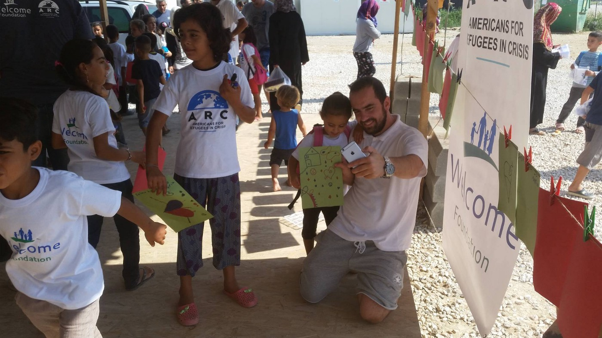

T\-shirts, school supplies and ice cream brought smiles to children’s faces\. Photo: Charity United

Their drawings, however, speak for themselves: They speak of all the horrible experiences they had to endure on their way to Greece\. War\-torn homeland\. Dangerous sea crossing\. Hope for the better future mixed with the pain of being stranded in the unknown country\. One especially painful drawing says: Syria at war is better than Europe at peace\.

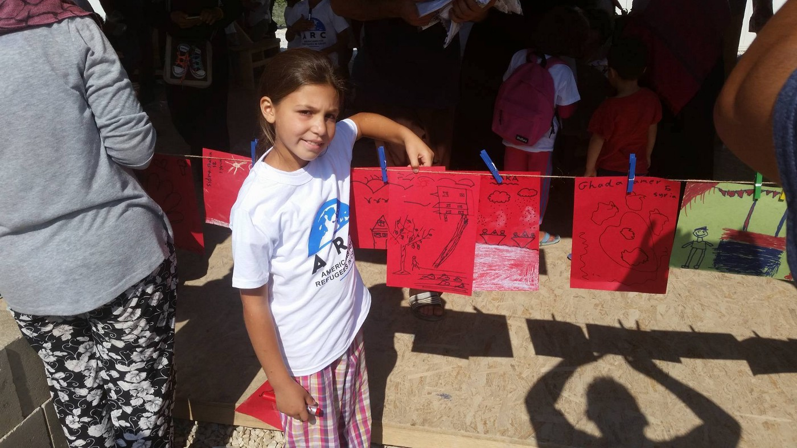

Young resident of Softex presenting her drawings\. Photo: Charity United\.

> We are happy that we have been able to join forces with these wonderful organizations to help make the event a success, and we hope it brought a bit of life and hope it the camp’s residents — wrote Charity United in a [statement](https://www.facebook.com/charityunitedrefugeeaid/photos/?tab=album&album_id=1763776967232426) issued shortly after the art contest in Softex camp was held\. 

### Fire destroyed the refugee camp in Thessaloniki port, officials looking for alternative accommodation

Today, a fire broke out in a refugee camp near the Thessaloniki Port Authority headquarters\. A team of 12 firemen and some coast guard officers managed to rescue dozens of refugees and put the blaze under control, but not before it had destroyed much of the camp, including beds and mattresses\. No one seems to be seriously injured in the fire, but [local news outlet](http://www.ekathimerini.com/211347/article/ekathimerini/news/fire-at-migrant-camp-in-thessaloniki-port) says one person was transferred to a local hospital to undergo medical checks\. Authorities in Thessaloniki are now seeking alternative accommodation for the refugees\.
### Refugee Support needs donations to renovate classrooms for children of Alexandreia camp

There are about 800 Syrian refugees living in tents in a former military base in Alexandreia\. About a third are aged 12 or under and just under half are under 16\. Following the agreement with The Ministry of Education, older children will be attending local schools, starting this September\. But there are 57 kids aged 4–7 years old who will need to be educated on the camp\. The Ministry of Education will provide 3 teachers for classes that will run from 8am\-12pm every weekday, but only if the camp can provide classrooms\.

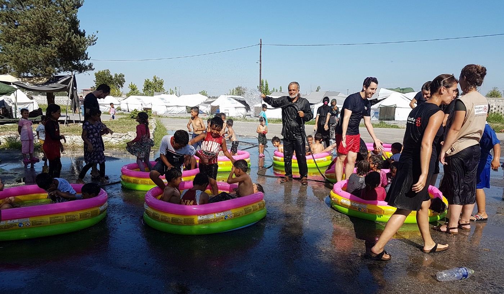

Children of Alexandreia camp need classrooms\! Photo: Refugee Support

[Refugee Support](http://www.refugeesupport.eu/) has been operating in Alexandreia since 4 April 2016, working closely with UN Refugee Agency, the camp commander and other NGOs on the camp\. Now [they need financial support](https://mydonate.bt.com/events/schoolrooms) to renovate two rooms on the camp with windows, doors, electricity, and heating, so the kids and teachers can start using them for their classes\. They will also need teaching materials, tables and chairs\. If the fundraising goes really well, they would even like to offer computers or tablets to residents of the camp\.
### Independent volunteers turning once\-dreadful Kelebija into an oasis of peace and friendship

One of AYS volunteers has joined IHO team in Kelebija, confirming they are doing a great job in Northern Serbia\. Despite increasing controls and pressure to shift refugees into official camps and away from independent help, IHO is continuing work out of the Kelebija Learning Center and the Mobile Team station\. More that providing free wifi and charging, there are now regular children’s programming in the afternoons for arts and crafts\.

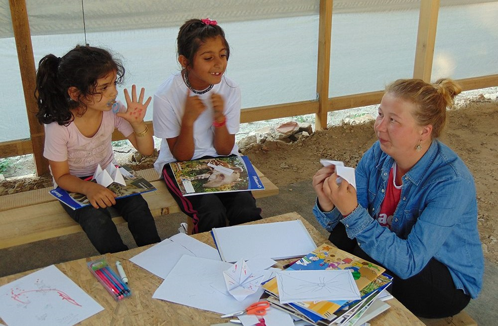

Afternoon workshops for children stuck in the transit zone\. Photo: IHO

These projects will continue to be supported through on\-site teams as well as through a partnership with [NorthStar](https://www.facebook.com/NorthStarSerbia/) Serbia, which will work onsite through September\. The location is rapidly turning into an oasis of peace and friendship in the otherwise uncertain situation at the Hungarian/Serbian border\. Current limitations block many outside attempts at aid at the Kelebija Transit Zone, Horgos Transit Zone, and Subotica One\-Stop centre, so for now, this is the post from which iHo and friends make contact with the community\.

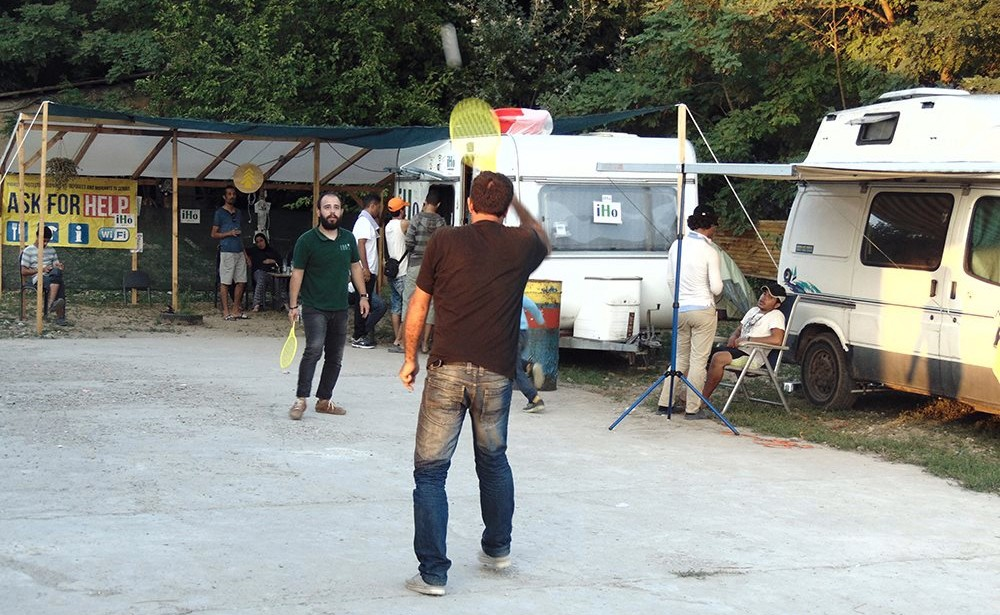

Relaxed, friendly atmosphere at once\-dreadful site\. Photo: IHO

With reports from visitors to the camp about the shortcomings and gaps in medical and other forms of care, it is vital to maintain this connection to the community should some people fall through the cracks in the system\. Despite this unfortunate news, the mood remains hopeful and lighthearted as spontaneous games and dancing nights form and disband\.

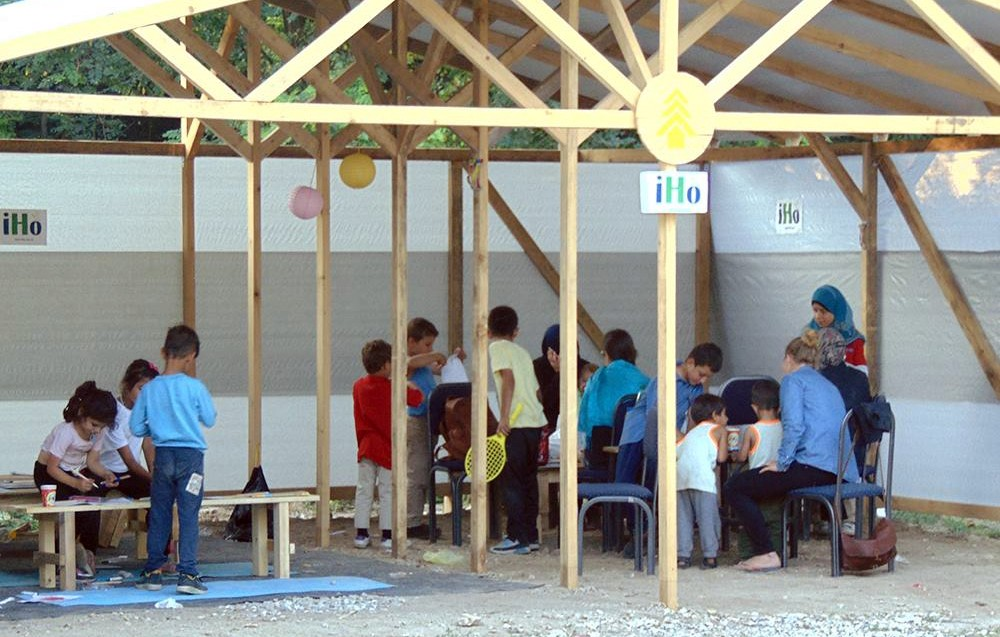

The Timber Project has helped to set up basic infrastructure in a makeshift camp\. Photo: IHO

Without the help of [The Timber Project](https://www.facebook.com/thetimberproject.org/) and Speranza\-Hope for Children, this dream may not have become a reality, and our friends from Kelebija are now expressing their hope that through continued support from all of the partners and volunteers, it will keep taking deeper root in the coming weeks\.

7 **refugees, including three children, died when the small wooden boat carrying 27 people, mostly Syrian refugees, capsized off Lybian coast** \. The U\.N\. refugee agency says that survivors have reported at least seven people have died in the shipwreck\. A Spanish aid group recovered five bodies, including two Syrian girls aged 8 months and 5 years, during the rescue Thursday\. UNHCR representative Medea Savary said that survivors arriving in the Sicilian port of Trapani on Saturday reported that a woman and another child also died, but the bodies couldn’t be recovered\. Survivors said that the boat began taking on water a few hours after departing Libya, and eventually capsized\. The Migrant Offshore Aid Station, MOAS, brought the five bodies to Trapani, along with 304 people rescued in recent days\.

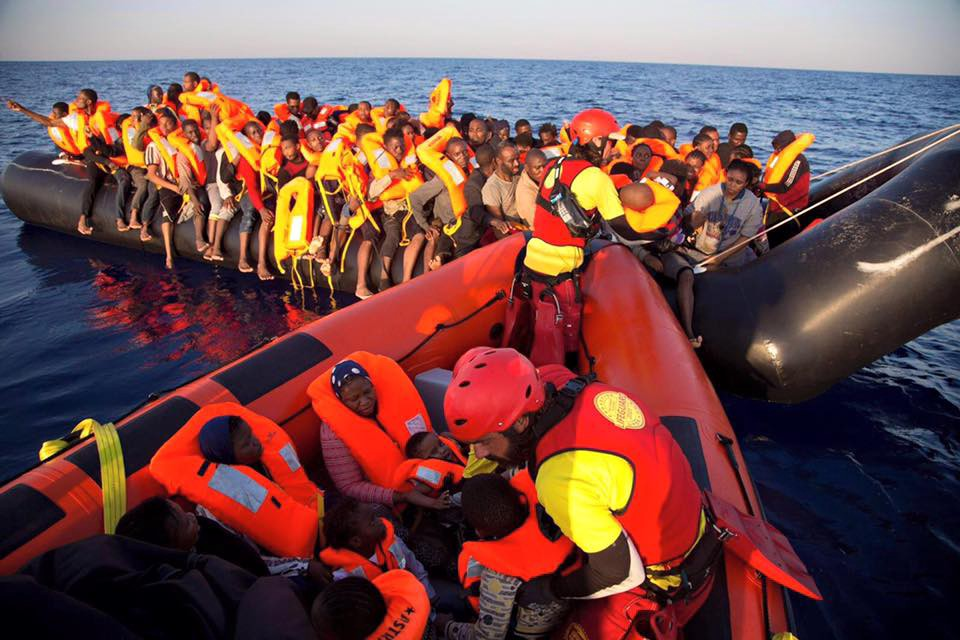

Proactiva rescue operation: they have saved 376 on this day alone\. Photo: Proactiva Open Arms

At the same time, Proactiva Open Arms group has published a photo of rescue operation in Mediterranean, saying they have assisted in saving of 376 people on this day alone, making it one of the hardest days recently\.
### Thousands of refugees returning to Milan after being rejected from Austrian, French and Swiss borders

Milan is becoming the new refugee bottleneck as thousands of refugees from Africa, many of them Eritreans, retreat to the city after being turned back at the borders to France, Austria and Switzerland\. According to The Times, “church buildings, army barracks, gyms and even the Holocaust memorial have been converted into dormitories” for refugees\. Refugees from Syria and Eritrea have been arriving in Milan since 2013, but their number has been sharply increasing in the past couple of days\. Officials are worried that another 1,000 refugees massed at Ventimiglia, on the French border, and at Como on the Swiss border will give up and return to Milan\.

> “We are at breaking point and if they show up here it will be a disaster,” said Pierfrancesco Majorino, a town hall official who is arranging cots and camp beds for more than 3,200 refugees, in a statement to The Times\. 

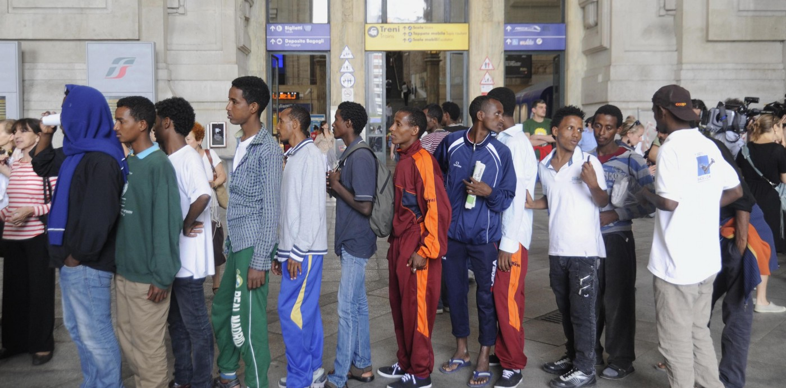

Number of the refugees returning to Milan is sharply increasing\. Photo: The Times

Many sensationalist news articles have been published recently, quoting Matteo Salvini, the outspoken leader of the anti\-refugee and anti\-Euro group, who said parts of Italy’s most populous city ware now “neither Italy nor Europe”, following what he called an “organised invasion”\. News are quoting his statement about Milan being “totally controlled by immigrants”, potentially causing great damage to already burdened refugees in the city\.
### Calais Jungle Boxing Club has a brand new gym\!

After 5 months of long term volunteering, instigating fitness workshops and engaging with ‘the jungle community’ [Calais Jungle Boxing Club](https://www.facebook.com/calaisjungleboxingclub/) now has a gym\! Not only that but the indoor community space is now recognised as such by [ACTED](https://www.facebook.com/ngoACTED/) which makes it harder for the french authorities to legally destroy the building should further evictions take place\.

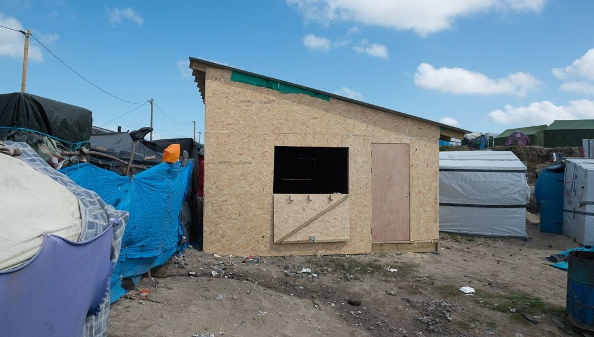

Brand new gym among the tents of Calais\. Photo: Josh McDonald

What they need now are personal trainers, fitness instructors, and martial arts practitioners to come out and dedicate some of their time in this new space\. If you are willing to contribute to this cause, you can [message Josh McDonald](https://www.facebook.com/profile.php?id=100007799580225) on Facebook or [send an email](http://calaisjungleboxingclub@gmail.com) to the initiative\.

_Converted [Medium Post](https://areyousyrious.medium.com/ays-digest-20-8-volunteers-urged-to-report-cases-of-malaria-3c2531178d2e) by [ZMediumToMarkdown](https://github.com/ZhgChgLi/ZMediumToMarkdown)._
