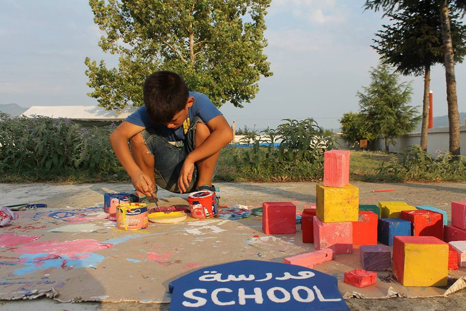
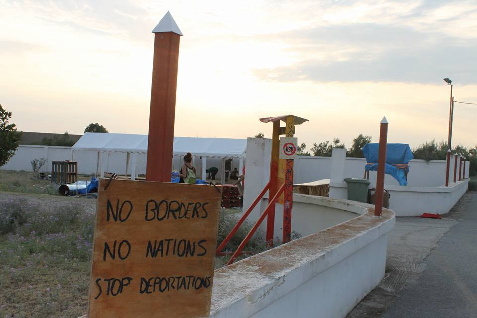
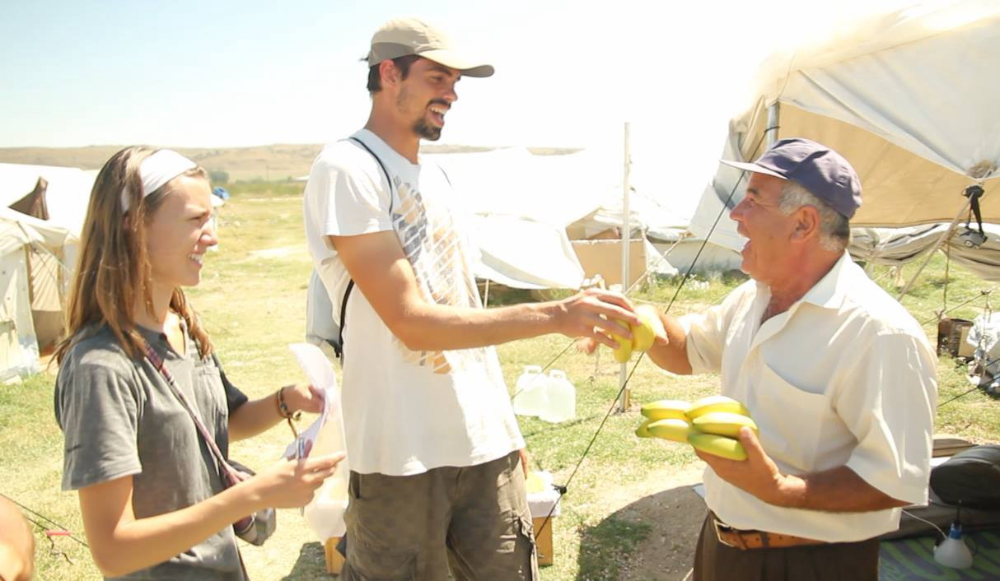
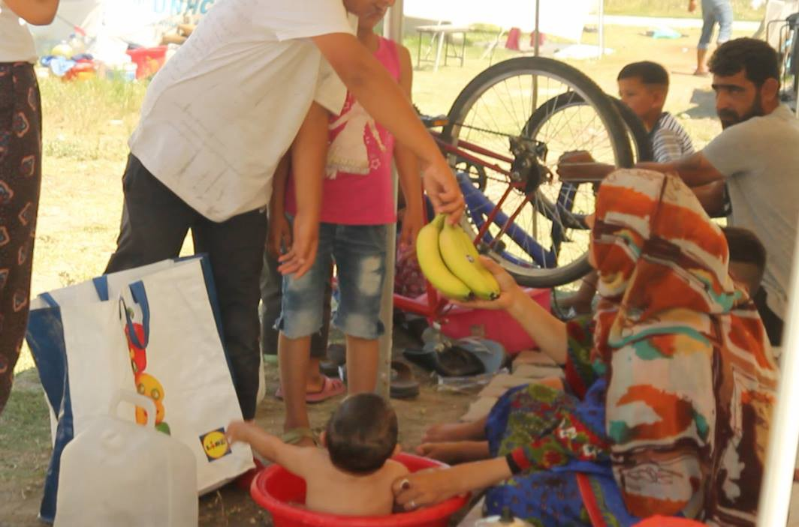
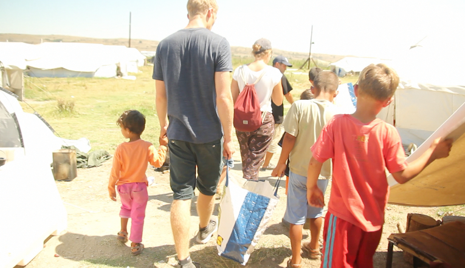

### AYS News Digest 21/8: 3,156 refugees have been declared dead or missing in 2016

Eco kitchen: Together hand by hand refugees and volunteers we can do every thing\. Photo by Hassan Alhomse\.

_At least 200 people saved from the sea\. Regional alliance to prevent new flow of the refugees proposed\. New arrivals to Greece\. Family i Sindos camps need your help urgently\. Volunteers needed all over Greece\. 58,380 refugees currently in Greece_
#### The Mediterranean
### At least 200 have been rescued in the Mediterranean\.

The boat was en\-route from Libya to Italy as it was picked up by a rescue crew\. The Mediterranean route continues to be the most fatal of the routes that refugees use to reach Europe, safer means being unavailable to them because of EU regulations\.

While the group in question was thankfully saved, many others who attempt this crossing cannot say the same\. A total of 3,156 refugees have been declared dead or missing in 2016 alone, and since 2014 over 10,000 have died making the attempt\. This problem needs to be solved, allowing for a safe entrance into Europe\.

Europe must be made to understand that shedding tears over the bodies of the dead while not taking any action to prevent future deaths is hypocrisy of the basest sort\.
#### Greece
### Today’s numbers

As always, the numbers of refugees present according to the Greek government may be found [here](http://media.gov.gr/index.php/%CF%85%CF%80%CE%B7%CF%81%CE%B5%CF%83%CE%B9%CE%B5%CF%83/%CF%80%CF%81%CE%BF%CF%83%CF%86%CF%85%CE%B3%CE%B9%CE%BA%CF%8C-%CE%B6%CE%AE%CF%84%CE%B7%CE%BC%CE%B1/%CF%83%CF%85%CE%BD%CE%BF%CF%80%CF%84%CE%B9%CE%BA%CE%AE-%CE%BA%CE%B1%CF%84%CE%AC%CF%83%CF%84%CE%B1%CF%83%CE%B7-%CF%80%CF%81%CE%BF%CF%83%CF%86%CF%85%CE%B3%CE%B9%CE%BA%CF%8E%CE%BD-%CF%81%CE%BF%CF%8E%CE%BD-21-08-2016) \. There are a total of 58,380 refugees currently in Greece\. The largest numbers reside in the following regions: 11,280 of them are residing in the islands, 17,594 are in Eastern Greece, and 9,624 are in in Attica\.
### A slow flow of refugees continues into Greece\.

Today a boat was picked up by Frontex to the southeast of Lesvos\. 37 people were onboard\.

Photo by Hassan Alhomse\.
### Tsipras seeks to form a regional alliance to tackle refugee migration

The Greek government is frantically seeking to form alliances to prevent new flow of refugees into the country\. Given unrest in Turkey, the numbers of refugees coming out of the country have risen, a prospect which strains Greece’s already overcrowded system of processing and housing refugees\.
### A family desperately needs your help\!

The family, currently residing in Sindos Camp in Thessaloniki, includes several children and a pregnant wife scheduled to give birth in 25 days\. The conditions in the camp, like in so many others, make the situation unbearable, especially for a family in such a position\. Those wishing to send money to alleviate their difficulties may do so by contacting [Michael Platenkamp](https://www.facebook.com/platenkamp) on Facebook\. Volunteer [Geo Messmer](https://www.facebook.com/DaGeo?fref=ufi) had already found the possible accommodation for the family, so we hope their situation might improve soon\. The original post calling for help may be found [here](https://www.facebook.com/platenkamp/posts/10153769297344249) \.
### Volunteering

Volunteers of all sorts are urgently needed in Petra Olympus\. Contact the Petra Volunteers Information Point [Facebook group](https://www.facebook.com/groups/1067477170001793/?hc_location=ufi) for more information\.

Team bananas needs volunteers from the 25 of this month to give out bananas and smiles\. A group with a car would be preferable, but all are welcome\. Whatsapp 00306984881468

A Drop in the Ocean team in the northern Greece is in need for volunteers starting asap\. If you have the time to commit to one week min, please send an email to frivillig@drapenihavet\.no\. Please note that we have a lower agelimit set to 25 years\.

And finally, important information for volunteers regarding the squat situation:

> _Dear volunteers,_ 
 

> _You will be aware that there have been difficulties at one or two squats making it very difficult for you to provide help to some of your families\._ 
 

> _The situation has not changed or improved but we are working on actions, some of which will take a little bit of time\. In the meantime, volunteers are still advised NOT to go to the hospital squat until i give the all clear on here\. Regardless of whether others are telling you that its safe\. \. please wait for my messages\._ 
 

> _In the meantime, I have a little bit of informal legal advice to pass on…_ 

> _There are unscrupulous and illegal activities taking place at the squats in question\. Those of you who have knowledge of these activities could inadvertently be helping and could be implicated by just staying silent and continuing to participate in the activities of the squat and therefore of the people in question\. The legal advice is:_ 
 

> _‘if volunteers are aware of illegal activity, they must report it\. Two reasons: it’ll get worse if unchecked \(the more important reason\) and second, they’re complicit if they’re aware and do nothing’_ 
 

> _Whilst i understand that there are worries about the families… they are currently choosing to support the activities and stay\. But as volunteers, you do have a choice\._ 
 

> _I am not asking any of you to do anything specific…that is being taken care of… however please remember that you are a guest in Greece and your visa or your visit, as a minimum, could be terminated very quickly if you are implicated in anything\._ 
 

> _Please also be very careful what you post on your own personal facebook pages\. Facebook is a public forum and we all know how fast posts can be shared\. Knowledge of certain activities can make people vulnerable of complicity if no action has been taken\._ 
 

> _Finally please note that this situation does not reflect the other squatting projects which foster good cooperation between refugees and volunteers and generally provide a safe working environment\. This is why this situation cannot be allowed to continue\._ 

### Team Banana in action

IHA and Team Banana distributing bananas in camp in Northern Greece\. Photo by IHA\.

Team Banana and IHA volunteers are visible on sites everywhere in Notheren Greece\. You will meet them in camp but also in the street of Thessaloniki where hundreds of people are sleeping every day\. Team Banan and comes and brings bananas and smiles\. They began distributing bananas to children and pregnant women in Idomeni in order to give the people hope in a hopeless situation and to make them smile\. Currently, they are doing that in eight official camps\.

> “It is unbelievable what a banana can change\. In some camps we were even able to expand the project and to distribute bananas to all refugees living in the camp not only to children and pregnant women\. 

> There are often problems with the food — and other topics — provided by the Greek authorities in the camps and therefore we are trying to further expand our distributions and develop new projects\.” 

Visit their [FB page](https://www.facebook.com/iha.help/photos/pcb.677755915707453/677755672374144/?type=3&theater) and help if you can\.

_Converted [Medium Post](https://areyousyrious.medium.com/ays-news-digest-21-8-3-156-refugees-have-been-declared-dead-or-missing-in-2016-b903137dd885) by [ZMediumToMarkdown](https://github.com/ZhgChgLi/ZMediumToMarkdown)._
