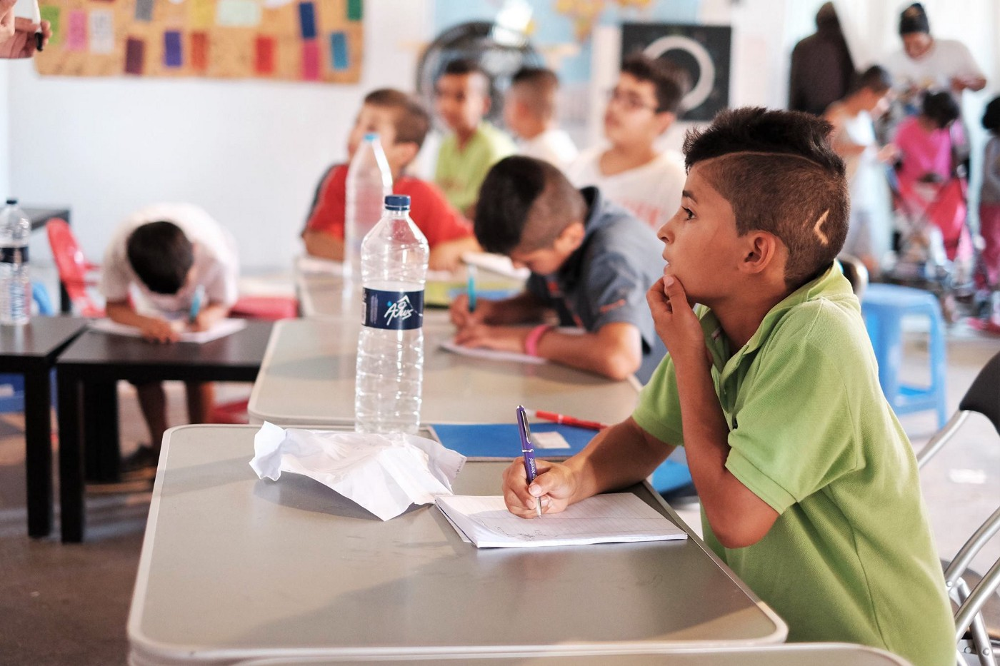
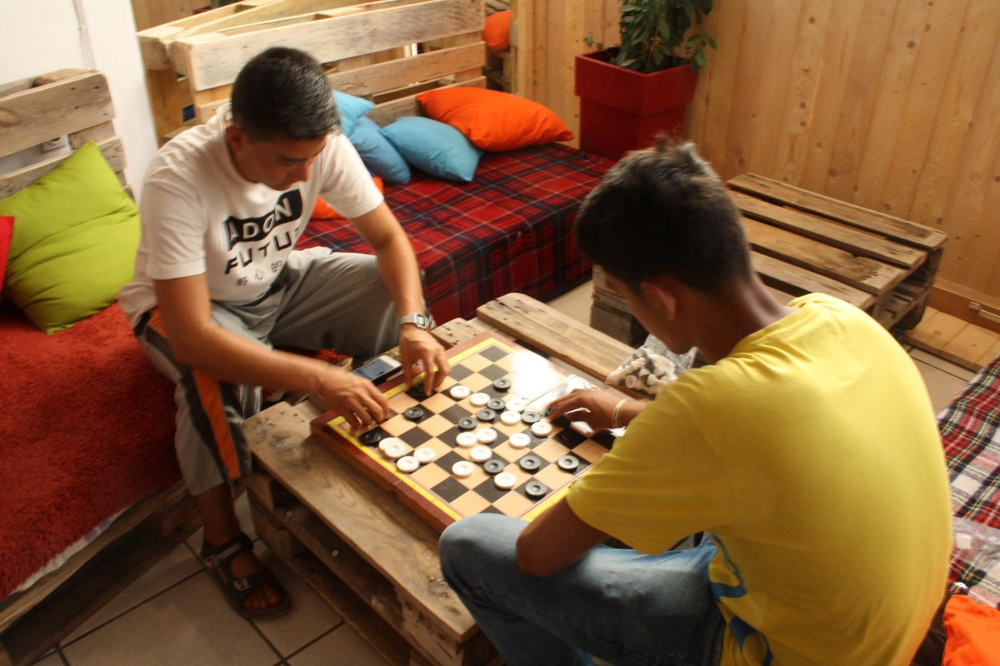
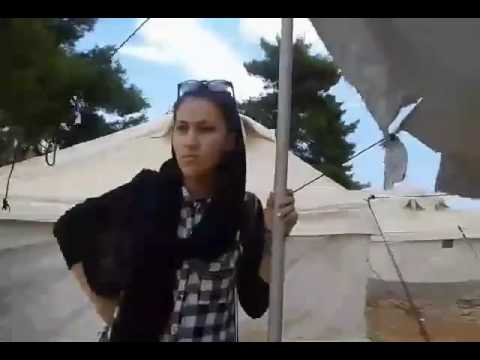
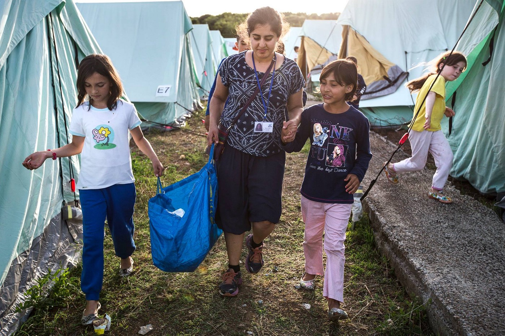
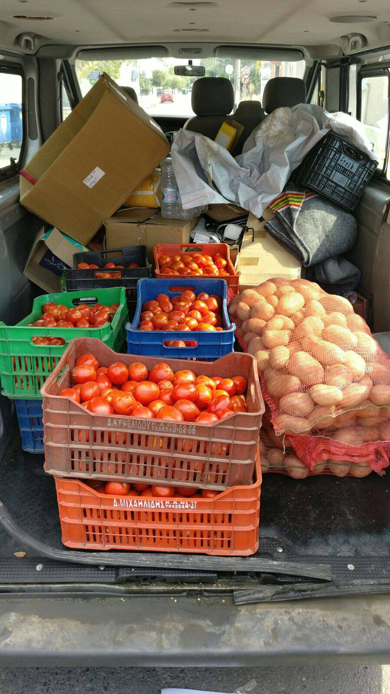
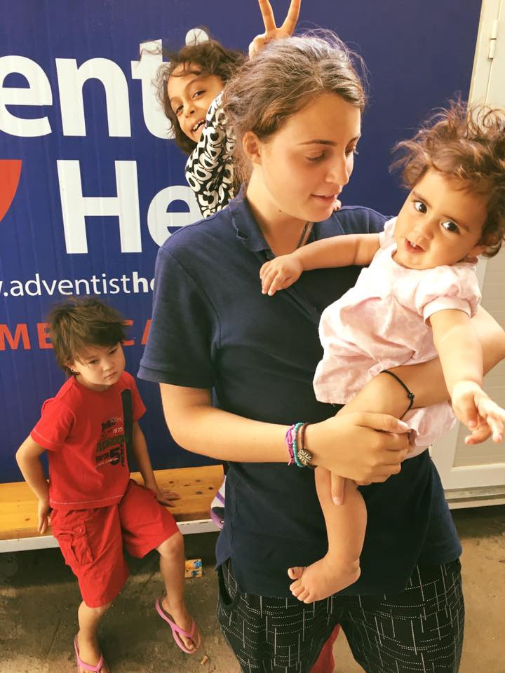

### AYS Digest 25/8: Back to School\! and Solidarity in Italy

Photo courtesy of Baschi Seelhofer for BE AWARE AND SHARE
### GREECE

With the arrival of 46 people to Lesvos and 78 people to Chios the morning of the 25th, this means that at least 585 people have arrived in Greece in the last week alone\. Support structures continue to grow, but also fracture, and as the stress accommodation of the system is put to the test, we must stay alert\.

Notably, Kathimerini reports that among those who have arrived in the last month and a half, among them were several Turkish citizens who applied for asylum\. With isolated reports of more, mostly political refugees from Turkey across the Balkan route, it hints to a possible new “source” of people seeking refuge\.

Refucomm has now released a video in Farsi for Farsi\-speakers in Greek looking to get more insight about applying for asylum in Greece\.

> This particular film will also be subtitled soon in various languages and shown in Greece via our team in the squats and hopefully the camps\. We have also made connections with some NGOs for them to show it\.
 

> By the end of this week, all our material will also be available as audio files on our website for those people who can’t read\. 

Check it out below\!

#### Strong words from Greek Government, barbs for Turkey

After accusing the Turks of collaborating [with smugglers in January](http://www.reuters.com/article/us-europe-migrants-greece-turkey-idUSKCN0UW131) ,the president of Greece is now saying Turkey is doing nothing to prevent people from illegally leaving the country because they don’t protect them inside Turkey, even after having received 8 mil euros from the EU precisely for that purpose\. Greece claims that Turkey is not the solution to the problem, but, rather, part of the problem and their minister of migration politics, Mouzalas, claims Greece should get the same type of support from the rest of the EU for taking the biggest load on their back\.

EU commission and UNHCR commission offer criticism\.

Die Welt reports that Commissioner Avramopoulos has called for more assistance to be given to Greece, saying member states need to send more asylum experts to support the EASO’s work\. The paper says 600 Frontex and 54 EASO employees as well as 48 translators have been sent to Greece, but local authorities have argued this constitutes only a fraction of the employees promised by the EU\. EU members states meanwhile have suggested Greece has been unable to create the right working conditions for experts\. The paper adds migrant arrivals have increased since the failed coup in Turkey, with Greece continuing to struggle to house refugees in adequate conditions\.

Meanwhile, the UN High Commissioner for Refugees Filippo Grandi, stated that the EU relocation system must be expanded and accelerated

> ‘it is one example of European solidarity and cooperation that can and must work so we need to put all our energy in trying to make it work\.’ 

](assets/2861eb65dc5f/1*nPXmmj0v9nQDzE-A6uFRYw.jpeg)

Classes at ECHO refugee library, Vasilika Camp\. Photo Courtesy of [ECHO Refugee Library](https://www.facebook.com/refugeelibrary/)
#### Chios

The Be Aware and Share team on Chios reports great success of their youth projects, with 120 children from Vial getting access to the classes and activities managed by volunteers\. In addition to learning, students also get a nutritious meal cooked by volunteers, making the benefits of this project manifold\.

 \.](assets/2861eb65dc5f/1*U5LiSIriqVX-5dumiSoFSQ.jpeg)

“This sign was posted by the refugees at the camp
They want to share the sadness, suffering, joy, love and smiles with the world, They want you to sense their feelings\. 
They want to prove that we didn’t change and we are still strong\. T [hrough Refugee Eyes](https://www.facebook.com/throughrefugeeeyes/?fref=ts) \.

> The focus for all children in our school has shifted towards intensive and increased English lessons — but still includes mathematics — in mixed classes consisting of up to 4 different mother tongues and half a dozen nationalities learning together\. The project classed designed and lead by our volunteers link to the knowledge just learned but also leave a lot of room for creativity\. This way, our spontaneous response to the misery in the camps is evolving more and more towards a “proper” school\. We are working hard on curriculums and lesson plans, develop learning focuses with our teachers and convince families of our program in order to constantly integrate new children\. 

Photo courtesy of Baschi Seelhofer for BE AWARE AND SHARE

Read the full report, and find out ways you can get involved [here](https://www.facebook.com/groups/1652972374920129/) \.

Finally, [two refugees on Chios](https://twitter.com/Theurgia_Goetia/status/768883807739076613) appeared to have participated in willingly taking a flight from Greece to Adana, Turkey, which could set precedent for many others who are trapped in Europe seemingly without options\.
#### Mainland

AYS volunteers report on the story of one family trapped in Greece\. A mother of 4 has been traveling for the past year in order to leave the insecurities and dangers of Afghanistan and to provide her children with the safe environment to continue school and have a safe life\. After having spent months in refugee camps and after a time of uncertainty in the parks of Thessaloniki, where her son was helping doctors and volunteers with translation to Farsi, they spent their last money to come back to Athens, to rest and to wait once again\. No news reaches them, but their news reaches us daily\.

Eiman, a 17 year old Afghan boy recorded a walk through a camp he now calls home and asks us is it a good place or a poor place to live in, being lost in everything he had heard so far\. This is what his young life has come down to\. “God knows what is my way — to die or to lead a difficult life”

These stories are just those of two; there are so many more waiting at any point in and around camps along the route\.

Photo courtesy of Aslam Obaid
#### Meanwhile, volunteers are working around the clock to try and ensure a better food supply to people in camps\.

> From day 1 the food has been in every single camp, without exception, a complete disaster\. Every day each person receives a breakfast, lunch and dinner meal in the camp with their family food card\. These services are run by the army or delivered by catering companies\. Though this might sound fair, the food is of extremely worrying quality: with catering contracts being assigned to the cheapest quotes the food contains very little nutritional value, and very few vitamins\. A breakfast would for instance be a processed croissant, lunch a dry sandwich with 1 falafel ball, and dinner a small box of potatoes\. 

But help is on the way\!

> So, we are launching a huge campaign to make sure EVERYBODY will get the vitamins they need to face the difficult day\. It is the most basic need of any person, and we want to be able to give people delicious and healthy food that will make the time when they sit together in their tents at the end of a day, a little more bearable\. We hope you will be a part of our Better Food Movement: let’s cook up a storm right across Northern Greece\!
 

> So far we have been trying to make a difference by distributing dry food, fruit & vegetable packages, cooking for people and giving out individual items of fruit, however: the need is much bigger than what we are currently providing so we are asking for your help and we do believe that it is one of the top priorities we are facing at the moment\!
 

> The food project isn’t just for one camp or for one group , but it is a project for over 15 camps as all volunteer groups have agreed to unify our efforts and requests to make this happen\! 

All those interested in getting involved should PM, [**Aslam Obaid**](https://www.facebook.com/aslam.obaid) \.

Photo courtesy of Aslam Obaid
### MEDITERRANEAN

Disturbing details emerge in the bizarre attack on the _Bourbon Argos\._ The MSF\-Chartered vessel was fired at and [boarded by a group of unidentified men on August 17th](https://www.theguardian.com/world/2016/aug/25/msf-mediterranean-bourbon-argos-armed-raid-libya-coast?CMP=share_btn_tw) \. According to individuals on the scene, the group seemed to be aiming to kill as it approached in a small speedboat\. All crew members were able to retreat to the safe room and, being inaccessible to the boarding party, were kept from harm\. The boarders left shortly thereafter\. Whether the attackers specifically targeted _Argos_ for it’s affiliation with MSF and relief activities or not is unknown\.
### ITALY

Refugees and migrants help in Amandoula, after region is devastated by earthquake\. 20 asylum seekers, almost all of them from North Africa, who are staying in accommodation provided by GUS \(Gruppo Umana Solidarietà\) from Monteprandone, [left this morning to go volunteer in Amandola](http://it.blastingnews.com/cronaca/2016/08/sisma-20-rifugiati-in-aiuto-alla-popolazione-colpita-dal-terremoto-nelle-marche-001080115.html) , one of the centres struck by the recent earhquake in the region of Marche, supporting the local forces of the Civil protection so as to help the locals\.

Refugees from a centre in Sprar di Gioiosa Ionica \(in provinceReggio Calabria\) have decided to [donate their pocket money](http://www.redattoresociale.it/Notiziario/Articolo/514113/Terremoto-i-rifugiati-donano-il-pocket-money-per-le-persone-sfollate) to those struck by the quake\. “A small symbolic gesture of solidarity from those who felt welcomed in Italy and now want to share\.”

Aid efforts remain ongoing to the affected regions, and it is clear that with Italy becoming an ever\-hotter\-hotspot, that all levels of institutions will be strained\. But with more people\-to\-people actions like this, perhaps some of the burden will be alleviated\.

Inofita\. Photo courtesy of Michael\-John Von Hörsten
#### Amidst these encouraging reports of solidarity come news of frustrating deportations to Sudan\.

48 migrants from Sudan, stuck in Ventimiglia hoping to cross the border, have been repatriated today, through an EgyptAir flight to Khartoum\. Milan Malpensa airport has been contacted at the time of the flight by some people to show their solidarity to the migrants, but in the end the flight took off from Torino\-Caselle\. After the attempt to cross the border, the Sudanese migrants have been taken from Ventimiglia to Imperia police headquarters, where the judge confirmed the decision to expel them\.

However, according to Caritas lawyer Alessandra Ballerini, this “mass expulsion” violates their fundamental rights, since they will be taken back to a country where their own life is in danger\. In 2015, 60% Sudanese requesting asylum obtained it; therefore, on one side, Italy recognizes the dangers from al Bashir’s dictatorship, while the other it deems it “safe third country” where to expel the migrants without right of protection\.

Moreover, on 4th August 2016 a Memorandum of Understanding between Italy and Sudan authorizes the latter’s delegates to go to Ventimiglia and help identifying the “irregular” citizens, even if the Geneva Convention forbids it, to protect a country’s citizens from persecution\.

This directly contradicts other stances by the Italian government which identifies the local ethnic tensions as well as persecution of religious minorities in Sudan as meriting funding of some 545,000 dollars to refugee camps in Sudan\.
### AUSTRIA
#### Dublin III deportations increase in Austria — some resources\.

As reports of increasing numbers of Dublin III deportations from Austria come out, the groups Border Crossing Spielefeld has collected a large amount of helpful information to be shared among people at risk of deportation\. In this information is also embedded troubling news about how these deportations are being carried out — swiftly and under cover of darkness\.

> We recommend to all supporters and affected or threatened by Dublin III deportation to do everything possible to remain in contact\.
 

> DEPORTATIONS ARE POSSIBLE WHILE YOUR APPEAL IS STILL ONGOING 
 

> There are only very few cases where people who are appealing their deportation were granted suspension; that means in general you could be deported without warning even while your appeal is going through the system\. At the moment there are so many deportations, because time is running out for the government\. They will have to deport you 11 months after your arrival here or 6 months after the other country has accepted responsibility for your case\. If you pass this deadline, get legal help \(Diakonie, Zebra, etc\) and notify the authorities\. In some cases people are deported very close to this deadline\.
 

> PREPARE FOR THE WORST CASE
 

> As the police usually arrive late at night or very early in the morning withoutprior notice, it is important to be prepared\. 

The full report as well as links to resources in other languages [can be found here](https://www.facebook.com/RefugeesSpielfeld/posts/1741791539414661) \. We wish best of luck to our friends in Austria who are facing this very strict system\.
### GERMANY
#### Another case of deportation to Hungary was halted in the German court system\!

The local court of Münster in North Rhine\-Westphalia stopped the deportation of a refugee to Hungary under the Dublin agreement, ruling that it is not a safe country for refugees\. Hungary has “systemic lacks” in its asylum system, the court explained\. Further the man would risk the “danger of an inhuman and humiliating treatment” and this risk with a”substantial possibility”, [Süddeutsche reports about the decision](http://www.sueddeutsche.de/panorama/kirchenasyl-von-der-brutalitaet-schockiert-1.3134549) \. “Hungary is neither willing nor able” to house and take care of asylum seekers, said the court\.

It is encouraging that the German legal system is recognizing the dramatic failure of the Hungarian asylum system, and the risk deportation poses to refugees\. This was an encouraging turn of events after this story broke headlines of the report of German police forcing the man out of a monastery, [where he was pleading for asylum](http://m.dw.com/en/police-force-migrant-out-of-german-church/a-19496599) \. Church leaders said his case was that of “exceptional hardship\.”

German Ex\-lawyer Klaus Walliczek is collecting positive court decisions on Dublin for Hungary, Greece, Italy and Malta\. From 1\.1\.2015 until 2\.8\.16 he found 289 cases, where German courts [stopped deportations to Hungary](http://German Ex-lawyer Klaus Walliczek is collecting positive court decisions on Dublin for Hungary, Greece, Italy and Malta. From 1.1.2015 until 2.8.16 he found 289 cases, where German courts stopped deportations to Hungary.) \.

Inofita\. Photo courtesy of Michael\-John Von Hörsten
### UK
#### Migrant children from Calais to be reunited with families\!

Wonderful news from Citizens UK as, thanks in no small part to their efforts, The Home Office decided to reunite 14 children from Calais with their families in the UK\. It is hoped that this case will create a framework for more family reunifications from across Europe\.

Photo Courtesy of Citizens UK

_Converted [Medium Post](https://areyousyrious.medium.com/ays-digest-25-8-back-to-school-and-solidarity-in-italy-2861eb65dc5f) by [ZMediumToMarkdown](https://github.com/ZhgChgLi/ZMediumToMarkdown)._
