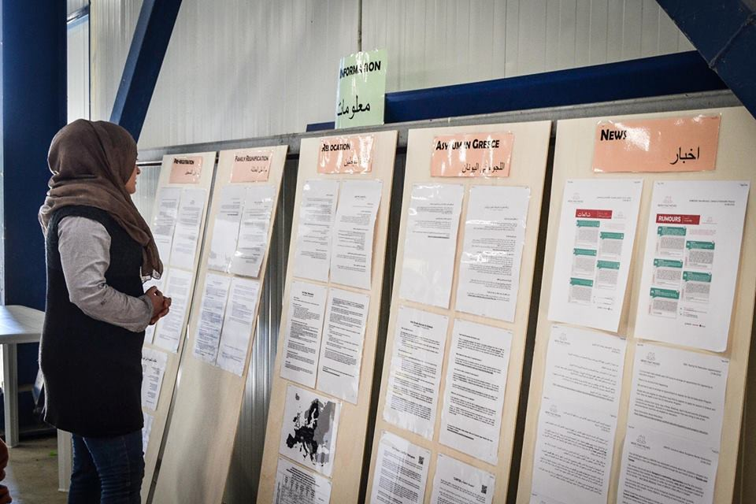
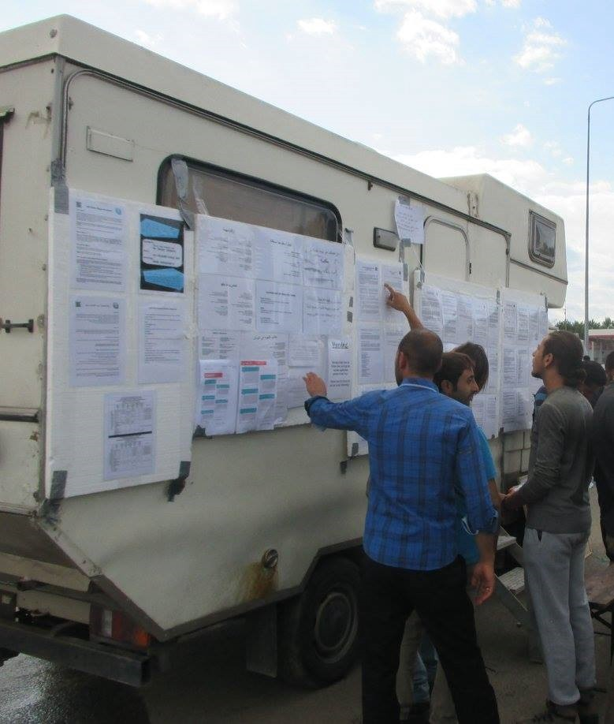
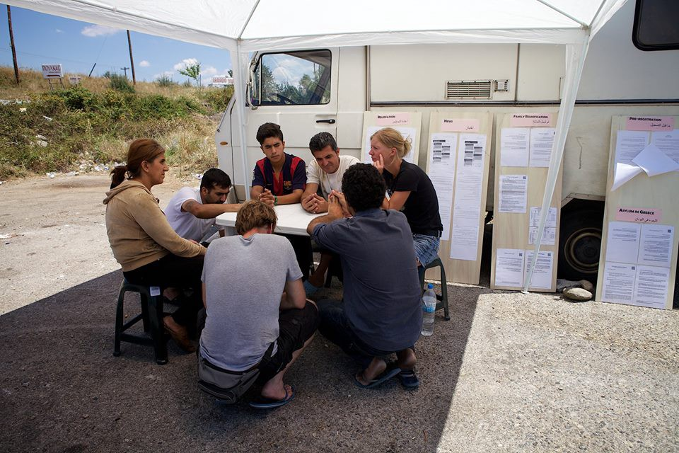
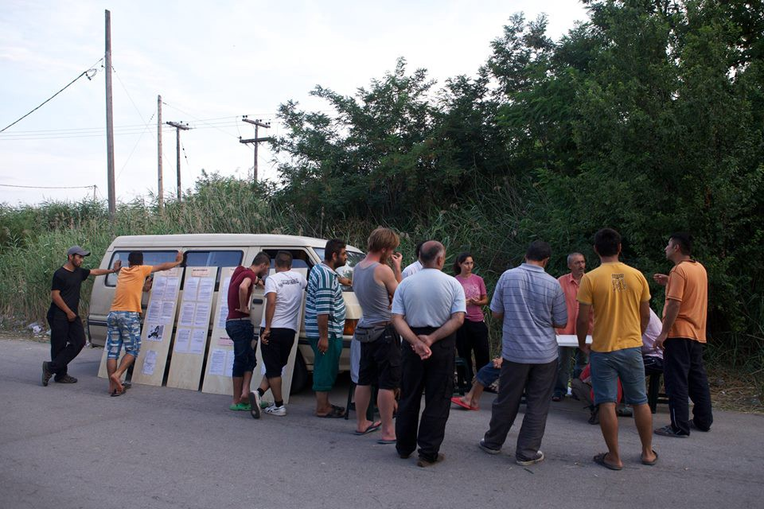
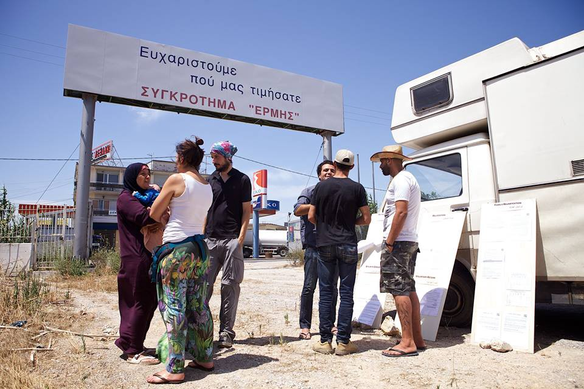

### AYS SPECIAL: Europe has no idea what happens in Greece

_Volunteers of the Mobile Info Team have been present in Northern Greece since April this year after the eviction of Idomeni and other independent camps in that part of the country\. Their mission started when they realized that refugees are seeking information as much as food\. Today, they are doing their best to provide answers to many questions that are left unanswered by official organizations and big NGOs\. However, they feel it is not enough and that life in uncertainty for refugees is becoming unbearable\._

The Mobile Info Team\.

Mariana and Els are part of a small team of dedicated volunteers who are trying to gather and spread information inside the refugee camps in Greece\. We met [the Mobile Info](https://www.facebook.com/mobileinfoteam/) Team volunteers for the first time in the front of Oreokastro camp\. They were sitting under a small white gazebo, beside a van and sheets of chipboard with information in [English, Arabic, Farsi and Urdu](https://drive.google.com/drive/folders/0B6Da1eGN7WCjN21WbGx3b0UyTXM) , and line of people asking for information\.

_“We drive around the camps in the North of Greece, speak to refugees, hear their situation and aim to empower them by giving them the information they need to make decisions about how to proceed with their case\. We hold ‘office hours’ in the camps to enable us to reach as many refugees as possible\.”_

**Els:** People always believe food is a basic need, but in our experience, people — especially when the border was closed — were really desperate for answers on when it would be open again, and if not, what will their future hold\. This lack of information drove people crazy, but to us, it showed the need to provide them with information\.

**Mariana:** At the beginning, information was also important to protect refugees from the consequences of their actions because people were so misinformed\.

But, when we talk generally about the differences between now and March, the eviction of unofficial camps near the border has created a huge gap between volunteers and refugees\. Today, all volunteers need permission to get into camps and that is a bureaucratic nightmare, to say at least\. People that lived in horrible conditions in those improvised camps could at least count on the overwhelming support of volunteers\. Now, they often feel abandoned; not because volunteers left them, but because they are forbidden access to some of the camps\. That has the huge impact on refugees’ morale, which only adds to the heat and the bad conditions they face in many official camps\. They were promised better logging, security, but at arrival is was not really better than the unofficial camps\.All this, combined with the slow realization that they are going to be here longer than they had expected, is having a huge impact on their mental health\.

**AYS:** _What are the most common questions they ask?_

**Els:** Often it is how long they will stay here, but even more so they keep asking how it could happen that Europe made them stay here, how it could be that they gave them the idea that they could pass through to a safe place and then close the doors in front of them and just leave them here? How could it happen that EU, the place they had heard stories about, where people have a better life than in their own countries, where they could finally be safe and their children would have access to education, where they could live in a house that will not be bombed, how could it be that the entire continent closed the doors and just left them here without any perspective?

**AYS:** _Do you have an answer to that question?_

**Els:** No\.

**AYS:** _So what do you tell them?_

**Els:** I tell them that I feel ashamed for my own continent\. I tell them that I think it is horrible what is happening right now and that I hope they realize that not all Europeans agree with just abandoning people like this\.

**AYS:** _Do people in Europe have a real picture what is going on here right now?_

**Mariana:** Not at all\. Especially after the eviction of the camps like Idomeni, an event that was visible and broadcast internationally\. People who followed that really believed that refugees were taken to proper camps or secure houses with proper medical care, proper food…

**Els:** People have no clue about the situation here\. When I am listening to Dutch news, I hear that there are no refugees coming to the Netherlands anymore\. There is no explanation that this is because we rudely closed the borders and because over 50\.000 people are waiting in Greece to have the possibility to apply for asylum\. People have no idea about all that\.

Photo by The Mobile Info Team

**AYS:** _Our feeling is that people in Europe and elsewhere are not really aware that camps in Greece are not safe places, even though guarded by police or military\. In some of the camps, it is very visible that the place is run by gangs and that people are afraid\. What is the task of the police and military?_

**Mariana:** We do not really know why police and military do not or cannot act adequately\. In general there is a problem with the Greek justice system, which is slow, and plus it requires 100 euros in order to file a claim\. I do not know many refugees who can afford that\. What is happening is that even if somebody is caught committing a crime, that person is taken to the police station and let out the next day\. Even if the victim decides to press charges, it will take 6 months to one year for the procedure, and people are afraid to become the victim of a revenge attack during this time\.

**Els:** The results are that the crimes are going unpunished and that mafia\-like people can easily exploit the most vulnerable refugees\.

**Mariana:** And there are a lot of minors who basically feel safer if they join gangs because of the “protection” they get in that way\. There are a lot of women who are afraid to go to the bathroom at night because they get attacked: there are a lot of people afraid to leave their tents: there are a lot of tensions between Arabs and Kurds that are not properly addressed by the authorities and tensions keep rising together with the desperation\.

**Els:** The problem is that this situation may have a huge impact, while it may be relatively easy to create better circumstances for people to live in\.

The Mobile Info Team\.

**AYS:** _There are more and more rumours about sexual assaults in camps, too\. Do you hear this?_

**Mariana:** I personally have not heard an account but everybody hears about Softex being a very problematic place\. We heard about gangs spreading from Softex to other camps, and we hear that from volunteers in the camps\. But, security is becoming an issue\. More and more people are reporting about daily fights and insecurity they only felt back in Idomeni\. Additionally, medical care is a huge issue\.

**AYS:** _But are there different organization inside camps dealing with the medical issue?_

**Mariana:** They can only provide primary care so everything beyond that needs an ambulance to go to a hospital, and the response is very slow\. There was a death in Softex couple of weeks ago because the delay of the ambulance in getting there\. And the Greek health system is collapsing in itself, for Greeks as well as for refugees\. If you break an arm it is very possible you may have to wait three days for a cast\. Forget about non\-emergency surgery; even people who have chronic diseases are basically left alone\.

One of the questions we get a lot is if Europe knows about the Greek health system, why do they keep them here? Why do they not let us go to countries that actually can provide them with proper health care, if they are slowly dying here? We are getting that question more and more\.

The Mobile Info Team\.

**AYS:** _When people ask you how long this will last, what is the answer you can give?_

**Mariana:** We answer that nobody can give them a definite answer, that the information we have is that it will depend on their date of their arrival in Greece, on what kind of asylum they requested, and if they are identified as vulnerable\. They are now waiting for an SMS with the date and time of their interview with the Greek Asylum Service or to make a full registration\. And from the date of that full registration, people that ask for relocation may hope for something between 3 to 6 months, people who ask for family reunification may face up to 11 months maximum, asylum in Greece may be fast\-tracked, but again, this also contributes to desperation of the refugees;there are so many uncertainties\. This is what we are told will happen, but nobody really knows if this SMS system will start at the end of August, nobody knows exactly how the Greek Asylum Service will work with all these applications, who will be prioritized, if someone… Because things do not tend to be so consistent in terms of respecting deadlines\. But basically, people are getting prepared to either stay a year or find alternative ways\.

**AYS:** _There are rumours about a refugee village being built in northern Greece\. Do you have more info on that?_

**Mariana:** There are some places being prepared in order to evacuate some refugees from some camps to better conditions\. But again, nobody really knows which camps, nobody really knows where to, nobody really knows which criteria, and nobody really knows if is going to happen anyway\.

There is a very strong feeling that almost everything in terms of this refugee crisis is managed in a completely random way\. So it is very much a matter of luck or if you are in the right place at the right time and you are taken to the camp that used to be a holiday resort and has houses for each family, or if you end up in Softex\. And there is no apparent logic guiding decisions that are made\.

**Els:** I think that generally the situation that appeared when Europe decided to close the borders was not planned carefully\. There was not the organization to deal with people and how they would feel if they are still in Greece\. A lot of things, including the relocation program, involve kind of trying and erring and finding out how it works in practice\. There is so much doubt and uncertainty around how these relatively new schemes will finally come to fruition and in most cases is not possible to answer these questions\.

**AYS:** _One big question that we are trying to find the answer to is who is responsible for all this horror that is happening here\. Who will be responsible if more people die in camps? If more women are raped? If kids become victims of negligence…?_

**Mariana:** That is also for us one of the biggest issues\. It has been months and you just cannot find a name to point to as responsible for anything\. For everything we have tried to find out, there is always this odd, mysterious and confusion about who is really responsible for camps, asylum procedures, evictions, criteria for vulnerable cases… It is very tiring for volunteers and I can only imagine how it impacts refugees in terms of chronic uncertainty\.

**Els:** But, having in mind that we have the Schengen agreement and that we are one continent with one outside border, collaborating with all these countries making, for example, migration law altogether, this means that in the EU we are all responsible for the people that are arriving to our continent\. The fact that we closed the borders and that people are stuck in Greece does not mean this is a Greek problem\. These people are in European countries, they arrived and got finger\-printed on European soil, the regulations around refugees here in Greece are European… From our perspective, it is the countries of the European Union as a whole that have a responsibility for this crisis\. What is happening right now — which is not the case only for Greece, but also for Italy and other countries where refugees are stuck — is that they are kind of left alone to deal with the situation\.

**AYS:** _Having that in mind, what can or should Europeans do, except coming and volunteering here?_

**Els:** Raise their voice against injustice, against their own governments, raise their voice that they disagree with the behaviour of the EU toward human beings that are left like animals in a country that has no money itself\. My personal dream is that people will stand up and say: “Dear government, I do not agree with our behaviour in Greece as a country and as a Union, can we please do something about the situation in Greece?

**Mariana:** What I think is that governments are trying to please voters who are basically terrified about the perceived refugee plus terrorist threat\. So before raising their voice, people should read, get better informed, fight their own prejudices and then act upon it and demand that their governments are more humane\.

**Els:** Ultimately, Europeans should stand up and let their governments know that this is an unacceptable and inhumane situation in our soil\.

Info provided by the Mobile Info Team can be found on their FB page and [here](https://mobileinfoteam.blogspot.ba/) \.

The Mobile Info Team\.

Info provided by the Mobile Info Team could be found on their FB page and [here](https://mobileinfoteam.blogspot.ba) \.

_Converted [Medium Post](https://medium.com/are-you-syrious/ays-special-europe-has-no-idea-what-happens-in-greece-9ed505f51fc3) by [ZMediumToMarkdown](https://github.com/ZhgChgLi/ZMediumToMarkdown)._
