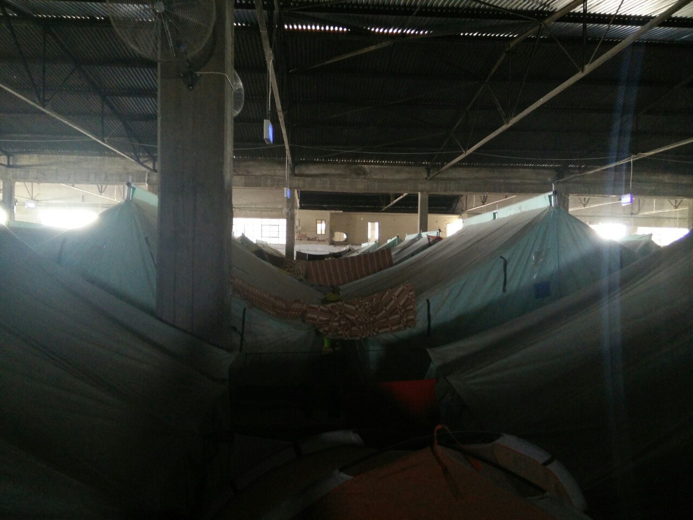
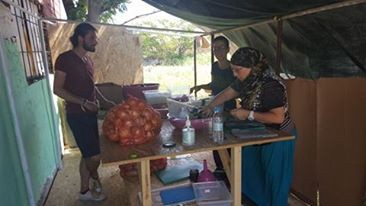

### AYS DAILY DIGEST 27/8: Animal\-like treatment of people in refugee camps

_List of all appointments by the Greek Asylum Service released\. Government in Greece announced opening of new centers that will have better living conditions, but no details are known to the public\. Meanwhile, more people are arriving to Greece and help is needed\. Police brutality in Hungary continues\. In Macedonia, around 70 people still stacked in Tabanovici with no freedom of movement\._

 \.](assets/839389877f90/1*Ff7VFWM9uaWZf98hkuRREw.jpeg)

“No one can take my smile away from me”\. By [Through Refugee Eyes](https://www.facebook.com/throughrefugeeeyes/photos/a.267469110309533.1073741828.266986607024450/321356258254151/?type=3&theater) \.
### Greece

Officially, there was 58\.580 refugees today in Greece\.

The Greek Asylum Service have released a list of all appointments in Greece in September\. You can look up your appointment at [the official GAS pag](http://asylo.gov.gr/wp-content/uploads/2016/08/CompleteSeptember2016FinalRefugeeSchedule1.pdf) \.

The Mobile Info Team [translated it into Arab](https://drive.google.com/drive/folders/0B6Da1eGN7WCjbHRVTFE0Q1ZsaE0) ic\.

If you are not on the list, you have to wait for your SMS from the Asylum Service\.
### Greek government promises and reality of refugees

Deputy Defense Minister Dimitris Vitsas [responded on criticism about](http://www.ekathimerini.com/211513/article/ekathimerini/news/greece-can-handle-volume-of-migrant-arrivals-minister-says) conditions at refugee camps in Greece saying that they were “created in order to take in evacuees from a large makeshift camp that had been set up last year on the country’s border” \(eg Idomeni\) and that they would either be “shut down or rebuilt”\.

He also said that the government plans to keep between 30 and 33 of the current 50 camps operating on the mainland, adding that new facilities will be made to hold a smaller number of people, while many will be relocated to apartments and hotels within the next few months\. However, minister gives no details about these plans, even though the summer is almost over\.

Most of the camps AYS team visited in Northern Greece are not places where a human being can and should live\. People are sleeping in deserted wear\-houses, in old industrial facilities; some of the camps are located near the swamps and garbage dumps, almost all of the camps are placed in remote areas with almost nothing around and people are forced to stay inside\. In some places tents are placed out in the open with no shade at all\. People are sleeping on the floor, on wooden pallets and military or UNHCR blankets\. Medical health is poor as well as food, while the activities for people who are living in camps are provided only by volunteers\. “We just sit and wait,” most of them told us\.

A team of volunteers offers psychological help in some camps in the North and they are saying that the conditions in these camps are unbearable\.

> “People keep telling us they are treated like animals\. They feel desperate\. Can you imagine a mother whose child get a fever in the night and she has nothing to give to him, and there is no doctor before the morning… Can you imagine young, strong, intelligent people having nothing to do but just to sit and wait\. Some of the camps are dangerous places to live and people are too afraid to walk around, especially during the night… But what is the hardest part for them is the lack of information\. They live in uncertainty that is killing them and makes them angry and desperate\.” 

Softex camp one of the most dangerous camps in Northern Greece, where mafia rules and police and military close their eyes\. Women more than anybody are afraid to walk freely around the camp\. Photo AYS\.
### Distracting attention from real issues

While people is camps are too afraid to walk around because of gangs that are present inside, smugglers are operating freely, the [Europe is announcing that a team of 200 counterterrorism officers](http://www.ekathimerini.com/211538/article/ekathimerini/news/europol-sending-team-to-root-out-jihadists-at-migrant-camps) will be deployed to the Greek islands over the next few weeks “to track down jihadists”\. The officers will be placed even in camps\. And it does not look like there are any plans to open borders or improve life of people in camps\.
### Community Center “We Are Here” continues to operate

[We Are Here — Community Center](https://www.facebook.com/WeAreHereCentre/) had now access to Serres, the new Yazidi camp and this week their team has been there to start work on building up our activities\.

> “On Sunday we had our first community centre team meeting with some old friends, and on Wednesday we ran two workshops with the adults: one with the team of people who have volunteered themselves to run children’s activities including song, dance and drama, and one with the teachers who will be teaching English to the children\. We left center managers with the material needed to organize the placement tests for the adults to be able to begin, or continue, English language lessons\.” 

Their center at Nea Kavala is still up and running\. Recently, the Spanish theater group Paramythades visited them and brought music, theater, and creative expression\. Last Saturday the play written by people from the camp was performed\. They provide also English language classes, and dance and yoga classes in the women’s space\.

> “All of these things are plasters on a wound but it is important, in spite of knowing that, that we keep working together to try to make sure the plaster stays in place\.” 

Plasters on a wound, but important plasters\. Photo by We Are Here — Community Center\.

A new issue of Rumors is out

To access in other languages, go [here](https://drive.google.com/drive/folders/0Byu3WazuFNLidHhVdGhKNEc1eHM) \.
### Your help is needed

[Soul Food Kitchen](https://www.facebook.com/dirtybunch/?fref=ts) is a new project in Thessaloniki area that Are Your Syrious supported, together with [The Distant Horizon](https://www.facebook.com/thedistanthorizon/?fref=ts) group from Sarajevo, Bosnia, [Graz Spendenkonvoi](https://www.facebook.com/groups/1706328169613315/) , Austria, Catch a Smile from Luxembourg, and many others are helping\. It aims to bring food for about 250–400 people who are sleeping in parks, being refugees or homeless people\. They also provide water and necessities\.

Park near Thessaloniki train station, people waiting for food\. Photo AYS\.

The cook is Pixi, a long\-term volunteer, who is cooking on Balkan Route since Sept 2015\. He cooked in Croatia, Serbia, Eko camp and Idomeni, and helped to establish and cooked in the Kalochori community kitchen\.

Photo by Soul Food Kitchen\.

With somewhere between 0\.35 and 0\.50 euro cents, the cook is able to prepare a fresh hot nutritious meal for 1 person\. In order to keep running the Soul, kitchen needs 100–200 euro a day\. The existence of a Kitchen is based only on donations\.

Help if you can\. All info available from their [FB Page](https://www.facebook.com/dirtybunch/?fref=ts) \.

Volunteer needed to help families in private accommodation in Athens\. The task is to, together with our long\-term friend and volunteer [Rando Wagner](https://www.facebook.com/rando.wagner?fref=ts) , get families familiar with locations of key organizations in Athens so that they can access hot meals, showing them where health organizations are etc\.

Please PM Rando if you are interested in this role and with helping families in private accommodation\.

[Health Point Foundation](https://www.facebook.com/healthpointfoundation/) dental team needs Arabic\-speaking volunteers, with or without clinical background \(they will receive training for assisting the dentists on the job\. \. \) Accommodation will be provided, the rest isself\-funded\.

[Boat Refugee Foundation](https://www.facebook.com/stichtingbootvluchteling/) is trying to start looking a dental mission in Moria Refugee Camp in Lesvos where there has never been a dentist\. Currently, dental cases only receive analgesics and antibiotics, causing the problems and the severe discomfort to persist\.

The plan is to start a dental mission of 4 weeks in Moria to provide acute dental care from 9\.00h\-16\.00h\. They have received a donation of dental material from a foundation specialized in this kind of missions\. The time frame we are looking at is somewhere in September\-October 2016\.

> Are you an experienced dentist and dental assistant, or do you know of any, and are you interested in helping the refugees of Moria on this dental mission? Please contact Jelmer Kooistra, the medical coordinator on Lesvos, on 
 

> jelmer@ bootvluchteling\.nl for more details\. 

[Lighthouse Relief in Skala Sykamineas](https://www.facebook.com/lighthouserelief/) is looking for volunteers for our Eco & Upcycling Project:

They need:
\-Long\-Term Cleanup Team Leaders\. \(ML, Climbers & Divers\)
\-Drivers with their own 4x4 vehicle\.
\-Medical Staff
\-Greek, Arab, Farsi, Urdu, Dari Speakers
\-Tailors & Designers
\-Skippers

> Welcome to the other side of the humanitarian crisis\. Let’s help the island become a natural paradise again and have fun while doing it\. We spend the mornings cleaning the shorelines on foot, with ropes, and by boat\. 

### Macedonia
#### Forgotten people of Tabanovci center

Since March this year, around 70 people are locked down in the center in Tabanovici\. They did not get any status or recived information about what will happen to them or when they will be informed about their future, and they have no freedom of movement\. They can go out from the center only if somebody needs to go to a hospital\.

Meanwhile, the number of refugees passing through Macedonia is increasing daily\. Some people are trying to cross without smugglers\. Families who manage to arrive at Tabanovici, 2 km from Serbia, are sometimes let to stay and rest for a while\. Daily, about 30 people are treated in this way\.

It is not possible to establish numbers, and Macedonian government is giving little information to the public, but volunteers in this area informed AYS about a huge number of people in villages of Lojane and Vaksince, two places that became smuggling hubs in Macedonia over the last year, and has been active again\. In June, Macedonian president told the media that smugglers had poked hundreds of holes in his country’s 50\-kilometre razor fence on the border\.

According to the [AFP](http://reliefweb.int/report/greece/ghost-migrants-eke-out-life-greek-macedonia-border?utm_source=twitterfeed&utm_medium=twitter) , every day Greek police intercept 50 to 200 people trying to reach the border with Macedonia\. Police turn them back, but they keep on trying\.
### Bulgaria

650 **new arrivals over the last week**

[Media are reporting](http://www.novinite.com/articles/176033/Bulgaria+to+Expand+Harmanli+Refugee+Centre#sthash.6fzAU0ln.dpuf) that the refugee center in Harmanli, southeastern Bulgaria, will be expanded to accommodate a further 400 people\. It will increase a capacity of the center to about 3\.000 people\. Between 50 and 60 migrants and refugees arrived daily in the center last week, while around 650 new arrivals have been found in Bulgaria over the past week, according to the Interior Ministry data\.
### Hungary
#### Hate atmosphere created by the government

Despite public pressure, the Hungarian government is doing nothing to stop systematic abuse of refugees at the border\. People are being beaten and tortured and bitten by police dogs\. [Most of these people are pushed back to Serbia](https://www.facebook.com/refugeesanthem/?qsefr=1) \. This has to be stopped\.

Lydia Gall, a European researcher at Human Rights Watch, in her opinion piece for the [EUobserver](https://euobserver.com/opinion/134762) , describes the atmosphere of hate created by pro\-government media\.

> “Asylum seekers and refugees are called “intruders,” and “potential terrorists,” bent on destroying Western civilization and Christianity\. Hungarian prime minister Viktor Orban himself in July referred to migration as “poison… A nationwide, government\-financed billboard campaign began in July with messages including: “Did you know that since the beginning of the immigration crisis more than 300 people died as a result of terror attacks in Europe?” and “Did you know that Brussels wants to settle a whole city’s worth of illegal immigrants in Hungary?”\.
 

> Another poster said: “Did you know that since the beginning of the immigration crisis the harassment of women has risen sharply in Europe?” 

The campaign is state\-sponsored\. So far the EU has done nothing to stop this\.
### UK
#### Scholarships for refugees

King’s College London, in partnership with [UNHCR](http://www.unhcr.org/uk/news/stories/2016/8/57b4751a4/summer-in-the-city-scholarships-for-refugees-at-kings-college-london.html) , offers summer school places to refugees\. The university is waiving the usual fees of £1,590 for refugees, in exchange for UNHCR staff teaching specialized classes on refugee protection and humanitarian issues on the international human rights module\.
#### People demand a new start based on respect and human principles

Not many, but still significant numbers of people gathered today in London, Trafalgar Square at a demonstration demanding that dehumanization of refugees must stop\.

> “The refugees are housed in shocking, subhuman conditions such as the ‘Jungle’ camp at Calais, where they are constantly harassed by police and threatened with eviction by the State\. Indeed, this camp \(home to 7000 people and 500 \(unaccompanied children\) is now threatened with another demolition; which will rob these homeless people of the little they have\. The camps already have almost no facilities and are run by hardworking overstretched volunteers relying on donations, not official agencies\. 

> The people who have reached the camps, after difficult and dangerous journeys, have clearly not done it from choice\. Our failure to treat them with decency and humanity shames us\. 

> We are demonstrating to demand a new start, based on respect and human principles\.” 

### GENERAL
#### Calls for protests

Protest are announced on the Mall in Washington, D\.C on August 28, from 10am\-2:30pm\. [Organizers are calling](http://www.DCRally4Refugees.Org) everybody to join and to stand in solidarity with the millions of refugees fleeing war and violence\.

Mass demonstrations are announced for August 29, at 18\.00 at Propylaea in Athens [in solidarity to the Notara 26](https://www.facebook.com/sol2refugeesen/?fref=nf) refugee housing squat\. The squat has been attacked last week\.

> “The flower of solidarity is not just blooming, it has taken deep root in the social ground\. It cannot be burned by the fire of fascists, it cannot be uprooted by riot police, it cannot be withered by mayoral smear campaigns\. Refugee housing squats, the hundreds of solidarity initiatives throughout Greece, the unwavering pro\-refugee stand taken by a large part of society, have created a political current the flow of which cannot be stemmed\. Sharing daily life with refugees opens up kernels of humanity and civilization, opposite to state organized misanthropy\. 

> We live together, we struggle together, we will win together\.” 

Meanwhile, in Australia thousands of people marched in solidarity with refugees\.

_Converted [Medium Post](https://areyousyrious.medium.com/ays-daily-digest-27-8-animals-like-treatment-of-people-in-refugee-camps-839389877f90) by [ZMediumToMarkdown](https://github.com/ZhgChgLi/ZMediumToMarkdown)._
