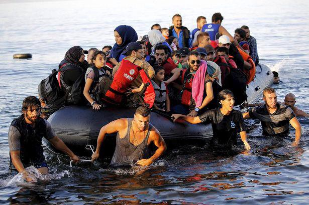

### AYS digest 30/8: Surge of new arrivals to Greece and Italy

](assets/c045c4e4cb47/1*kddRVGyH1Kr6fyvzLW8JUQ.jpeg)

Refugees from Eritrea and other war\-torn and poverty\-stricken areas on yesterday’s desperate attempt to reach Italian shores\. Photo: Emilio Morenatti / [Proactiva Open Arms](https://mediterranean.proactivaopenarms.org/)

6500 people were rescued from 40 boats in Mediterranean yesterday, including newborn twins who needed urgent medical help\. It was one of the most demanding days in recent recent history of Mediterranean operations\. MSF, Proactiva Open Arms and Italian coast guard crews did a heroic job rescuing so many from cramped boats off Lybian, Maltese and Italian coast\. The Italian coast guard said the rescued refugees are being taken to ports in Calabria and Sicily\. Story of two 5\-days old Syrian twins rescued from Mediterranean that was tweeted out by MSF caught attention of international media, reminding the readers of the ongoing crisis they’re so often keen to forget or disregard\.

462 refugees have arrived to Greek islands today, following yesterday’s arrival of 149 officially recorded refugees\. Since the beginning of the EU\-Turkey deal in March, number of refugees on Greek islands has jumped from 5,538 to 12,120 people, leaving the reception camps overcrowded and often unsafe\. A 50\-year old Turkish judge was found among the refugees who arrived to Chios yesterday, saying he’s fleeing from Erdogan regime and asking for asylum in Greece\. Last week, a total of seven Turkish nationals, including a pair of academics with two children and three businessmen, have crossed the Aegean together with the refugees, in fear of political prosecution in what EU officials describe as the “safe country”\. As of today, a total number of officially registered refugees in Greece has risen to 59,160\. At least 38% of them are children\.

3165 have dissapeared ot lost their lives crossing Aegean or Mediterranean sea this year alone\.
### **Through refugee eyes: a letter to UNHCR**

> Thank you so much UNHCR
 

> thank you for lying to our faces for six months\. I still remember you saying over and over again “it’s soon and it’s okay and every thing is gonna be okay\.” I still remember when I was in Idomeni and all your employees were saying “the program will not take long\.” I still remember how you removed us from a free camp to military\-camps that are run like prisons\. 

> What have you done in the camps?
 

> What have you done for us?
 

> If you speak about smuggling as being a bad solution, you should know that you pushed us to do that when you kept lying\. 

](assets/c045c4e4cb47/1*eiuHOcrKh0Ypjdc4d7m6Yg.jpeg)

Photo and text provided by our refugee friend and colleague Abdulazez Dukhan / [Through refugee eyes](https://www.facebook.com/throughrefugeeeyes/)
#### GREECE
### Reminder: a schedule for Asylum Office interviews

> Dear refugee friends, please [click here](https://drive.google.com/file/d/0B6Da1eGN7WCjWUp4NFo4dUo1RVk/view?pref=2&pli=1) to see the list of Asylum Office appointments scheduled for September\. You can find additional info about the interviews [here](http://asylo.gov.gr/en/wp-content/uploads/2016/07/NEXT-STEPS.pdf) \. 

According to [News That Moves](https://newsthatmoves.org/en/full-registration-schedule-for-september/) , Greek Asylum Service is also sending pre\-registered people an SMS with the date and location of the next appointment at the Asylum Service, but just to make sure, pre\-registered people can find their registration number on the list by pressing the Ctrl\+F shortcut and typing their registration number on computer, or using the ‘Find in page’ option on mobile browsers such as Chrome and Safari\.
### Greek island and port authorities demanding decongestion of overcrowded refugee camps

According to [local press](http://www.ekathimerini.com/211605/article/ekathimerini/news/greek-islands-raise-alarm-over-migrants) , local and port authorities on the islands of the eastern Aegean are demanding immediate government action to decongest overcrowded migrant camps, insisting that they cannot cope with the recent surge in arrivals from neighboring Turkey\. Lesvos Port Authority raised the alarm in a letter addressed to Shipping and Island Policy Minister Theodoros Dritsas, saying the island simply does not have the available infrastructure to accommodate the increased flows of refugees\. **The number of new arrivals to Lesvos has reached 5,226 while existing camps are only designed to host 3,500 people\. The situation on Chios is equally disheartening, with 3,309 refugees in accommodation for 1,100\.** While Interior Ministry officials have attributed the overcrowded conditions at the camps to delays in the registration process, some critics have interpreted the increased traffic as a form of pressure from Ankara, which has linked the deal’s implementation to visa\-free travel for its citizens within the EU\. Turkish Foreign Minister Mevlut Cavusoglu said as much in an interview with Kathimerini published Tuesday where he warned the pact with Brussels will collapse unless it grants Turks visa\-free travel by October “at the latest\.”

](assets/c045c4e4cb47/1*m8VGlMrpi2QQimjVCSbvGQ.jpeg)

Frontex officer assiting refugees intercepted off Lesvos shore yesterday early in the morning\. Photo: [SIRIUS\.HELP](https://www.facebook.com/sirius.help/)
### Expert advice needed: how to get a humanitarian visa for Switzerland for a family stuck in Greece?

One of the most amazing and reliable volunters, Gabrielle Tan who works on Chios with her Action from Switzerland team, has asked us to share her post\. We urge anyone who can help to [contact her directly\.](https://www.facebook.com/gabrielle.tan?fref=nf)

> Some people come into our lives and leave footprints on our hearts\. This is exactly what a family has made me feel since I’ve met them in March here on Chios\. They are safely accommodated in Athens but a medical condition needs to be treated that doctors on Chios and the Athens hospital have said they are unable to\. I am launching a heartfelt appeal to anyone who has experience in obtaining a humanitarian visa for Switzerland\. We are working against the clock\. Please help tag anyone you know who CAN help — especially Swiss lawyers well versed in asylum law and eye doctors, says [Gabrielle Tan](https://www.facebook.com/gabrielle.tan?fref=nf) \. 

### Help to clean up burned Notara 26 squat

Following yesterday’s big march of solidarity with Notara 26 squat, that was burned down in a recent attack, volunteers are working round the clock to redecorate the place and remove all the damage\. They have asked for donations of **liquid cleaning products, brooms and mops, buckets, sponges, wettex, and disposable gloves** \. Please consider to donate\.
### RefuComm needs volunteer translators in Athens

Versatile team of volunteers from RefuComm is [asking for Arabic and Farsi volunteer translators](https://www.facebook.com/groups/greecevolinfopoint/permalink/359200161077722/?hc_location=ufi) , preferably from the refugee community, to help their ambitious plan to support refugees in preparing for asylum and relocation or family reunification interviews at the Greece Asylum Service office in Athens\.
### Founder of Team Humanity still trapped in Greece

Some of you know Salam Aldeen, who came to Lesvos and created Team Humanity in 2015, a hands\-on NGO working to rescue people crossing the sea to Greece, fleeing war and imminent danger in their country\. Salam and another member of Team Humanity were arrested with three volunteers from Proem\-aid\. He was criminally charged with human trafficking and jailed\. He was released after paying a large fee but trapped in Greece, unable to leave, without support of Danish embassy or any other official instance of his country of origin\. Salam is awaiting trial where can receive 10 years in prison, as the only one of the five defendants remaining in Greece, submitting to weekly Police check\-ins and harassment by local law authorities\.

Salam dragging a boat full of refugees to the shore in September 2015\. Photo: Team Humanity

> I, Salam Aldeen, have been working effortlessly since the beginning of the refugee crisis in Lesvos, Greece\. While saving the lives of refugees from the shores of Lesvos, I was arrested on the basis of ‘Human Trafficking’\. During my arrest, my boat was confiscated by the HCG\. As a result of this arrest, I have been refused access to leave Greece, forbidding me from seeing my home, friends & family\. By signing this petition, you can help end my legal nightmare now, by expressing your voice in favor of my release, says Salam\. 

Meanwhile, he continues with the daily tasks of Team Humanity\. He works in camps near Thesaloniki, as well as attending to those families who cannot live in camps for special circumstances\. He continues managing resources, assisting families, and creating temporary housing\. He has not seen his family, his friends, or his home\. He cannot remember his normal life anymore\.
### Oreocastro getting a new women’s space

Volunteers and refugees from Oreokastro have decided to turn the small room across the school into a nice space for relaxing, chai drinking and different kind of activities\. They are planing to organise a big sewing party on Sunday, so feel free to join them if you have any sewing skills or just want to help\.
### Kalachori community kitchen needs volunteers

[Pharma Community Kitchen](https://www.facebook.com/farmacommunitykitchen/?hc_ref=PAGES_TIMELINE&fref=nf) is trying to fill the gap which forbids kitchens inside camps for security reasons, preventing the refugees to cook for themselves, by running an independent kitchen where everyone is welcome to prepare and share the food\. Now they need volunteers to come and assist cooking preparation from 11AM to 3PM, and/or to support distribution from 6PM to 8PM\. No skills needed, just your time and a smile\! If you are willing to help, do not hesitate to [contact Céline Delbarre](https://www.facebook.com/celine.delbarre?hc_ref=SEARCH&fref=nf) on Facebook\.

Volunteers and refugees are trying to create something nice in a place of misery\. Photo:
### Bottled water needed in the streets of Thessaloniki

Our friends from [SOUL Food Kitchen](https://www.facebook.com/dirtybunch/?fref=ts) have expressed their extreme frustration by not having enough bottled water to distribute to refugees sleeping in the streets and parks of Thessaloniki\.

> This is our reality\. I don’t have 1,5L of water to give out to these people, to their children\. At home, we shower with tens of liters of water\. And here they don’t have anything\. Day after day, night after night, we have to think of the way to provide enough food for all of them, and now I can’t provide them with damned 1,5L of water — said one of the volunteers in a very [emotional FB video](https://www.facebook.com/dirtybunch/?fref=ts) \. 

Currently they are providing one hot meal to hundreds of people per day, with the ambition to provide two meals a day in near future\. Unfortunately, their water funds have run out and at the moment they can’t buy more for the refugees in need\. We have cooperated with this crew and supported them both logistically and financially on several occasions, in Croatia, Serbia, and now in Greece\. If you want to join in, you can find their fundraiser [here](https://www.betterplace.org/en/projects/47875?utm_campaign=ShortURLs&utm_medium=project_47875&utm_source=PlainShortURL) \.
#### BALKANS
### Croatia mobilising additional police officers to patrol the border with Serbia following increase of arrivals

Situation on Balkan route remains relatively steady, with hundreds passing Kosovo, Macedonia, Serbia, Croatia and Slovenia illegally after being left with no other options\. The wait on Hungarian border takes weeks, so people have tried crossing the border to Croatia\. Local volunteers report groups of 20–40 people arriving by the former route to Tovarnik, only to be intercepted by Croatian police\. We’d like to use this opportunity to remind our refugee friends **they have the right to ask for asylum once they reach Croatian soil** \. Due to increased number of such arrivals, additional police officers were sent to the border\. The number of people in Porin and other asylum and detention centres has risen, not only because of the new arrivals from Serbia, but also due to recent returns from Austria, on the basis of Dublin regulations\.
#### MEDITERRANEAN
### MOAS calls for the safe passage in a moving video

> As the world grows ever more desensitised to recurring tragedies at sea, our conviction that safe and legal routes are the only conceivable way forward has been cemented by our experiences on the maritime crossings\. We call, therefore, on the international community not to allow this unnecessary loss of life to become ‘the new normal’ when it is so clearly avoidable\. It is only by treating the hundreds of thousands like the deserving individuals they are that dignified and humanitarian solutions can truly be reached, said Migrant Offshore Aid Station, urging people to share their new video about the crisis on Mediterranean\. 

#### GERMANY
### At least 100,000 of refugees working off the grid

The “NDR Info” program reported that up to 30 percent of the 1\.1 million refugees who arrived in Germany last year were working without being properly registered with the authorities\. NDR suggested that at least 100,000 were working in this way without their employers making sure that health and pension contributions and taxes were being paid into Germany’s elaborate social welfare system\. [According to DW](http://www.dw.com/en/thousands-of-asylum-seekers-reported-to-be-working-illicitly-in-germany/a-19512047) , many profiteers may include eateries, discos and private householders\.
#### FRANCE
### French politician’s call for discussions over a new asylum process in Calais sparks a huge debate

A call by Xavier Bertrand, a French regional politician, for an EU “ [asylum hotspot centre](https://www.theguardian.com/uk-news/2016/mar/03/calais-border-treaty-brexit-what-is-france-saying) ” to be set up so that refugees can have their claims for asylum in Britain processed on French soil has provoked tabloid outrage in the UK, according to a [very elaborate article in The Guardian](https://www.theguardian.com/world/2016/aug/30/calais-asylum-hotspot-proposal-main-questions-answered-uk-refugees) , which aims to provide the answers to many questions about the current situation in the camp\.

Volunteers have been calling for a new mechanism for months\. Photo: Care4Calais

> With the French elections coming up in April next year, various politicians in northern France have been making calls on their government to renegotiate the Le Touquet agreement which governs UK border controls in Calais\. The home secretary, Amber Rudd, is to travel to Paris this week to meet French Interior Minster Bernard Cazeneuve\. The politician representing the region around Calais, Xavier Bertrand, has suggested a new deal whereby migrants hoping to claim asylum in the UK would be able to do so at a “hotspot” in France, and if they were turned down they would be immediately deported out of France\. Care4Calais welcomes discussions over a mechanism whereby refugees can have their UK asylum claims processed in France, such as that suggested by M\. Bertrand\. Care4Calais supports measures which would remove the need for any genuine refugee to enter the UK illegally and so be of great benefit in combating the smuggling trade, reducing night time violence around Calais and removing cloaking illegal activities that disrupt truckers and transport links in the port town\. We have for a long time campaigned for safe passage for genuine refugees, specifically a mechanism whereby those in genuine need of asylum protection and young children who have a legal right to be reunited with families in the UK could be safely processed and thereby remove the need for them to risk their lives by night inside lorries and trains\. So far the current French president \(President Hollande\) and the French Interior Minster have, like Teresa May, remained firm that there will be no change to existing arrangement, said Care4Calais in a lengthy statement which can be found [here](https://www.facebook.com/care4calais/photos/a.1046164975416459.1073741829.1046117708754519/1269088333124121/?type=3&theater) \. 

### Rights of refugees in Calais and Grande\-Synthe: a report from the British Bar Human Rights Comitee

The Bar Human Rights Committee, which gathers lawyers from England and Wales, has recently [published a report](https://passeursdhospitalites.files.wordpress.com/2016/08/bhrc_calais_report_1-08-16_0.pdf) about breaches of human rights of refugees in North France, focusing on police violence and relying, among other data, on MSF reports about interventions following violence in camps\.
### Dunkirk Children’s Centre needs toys and volunteers

After 6 months of having one room for all of the children in the camp to share, Dunkirk Children’s Centre has finally got the use of a second building\. They now have two rooms, one for 3–7 year olds and one for 7\+ \. This means that they can now provide age appropriate activities for both age groups all day long and that young children can play safely, away from the more boisterous older children\! However, this also means that they now need more volunteers, both long\- and short\-term, to help run the children’s centre\. They also need need more donations to make the second space as cosy and fun as the first\. They do not have much storage space and cannot accept certain toys so please do ask before you donate\. Things that go down particularly well are toys that require concentration and focus such as construction kits, brio train sets and very easy board games\. If you think you have the right skills and experience to volunteer with Dunkirk Children’s Centre, or you are willing to donate toys, please get in touch with them by emailing dunkirkchildrenscentre@gmail\.com\.

_Converted [Medium Post](https://areyousyrious.medium.com/ays-digest-30-8-surge-of-new-arrivals-to-greece-and-italy-c045c4e4cb47) by [ZMediumToMarkdown](https://github.com/ZhgChgLi/ZMediumToMarkdown)._
