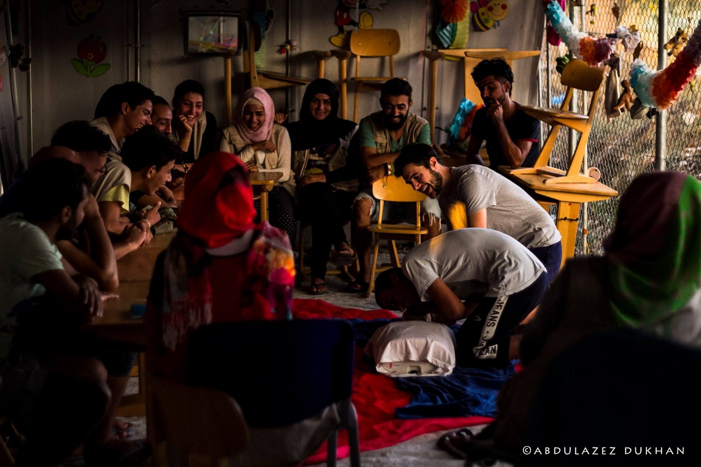
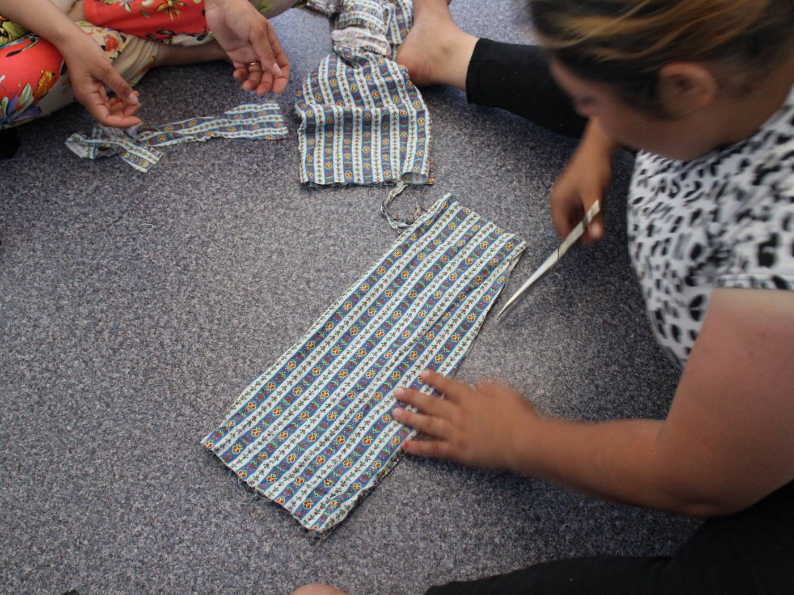
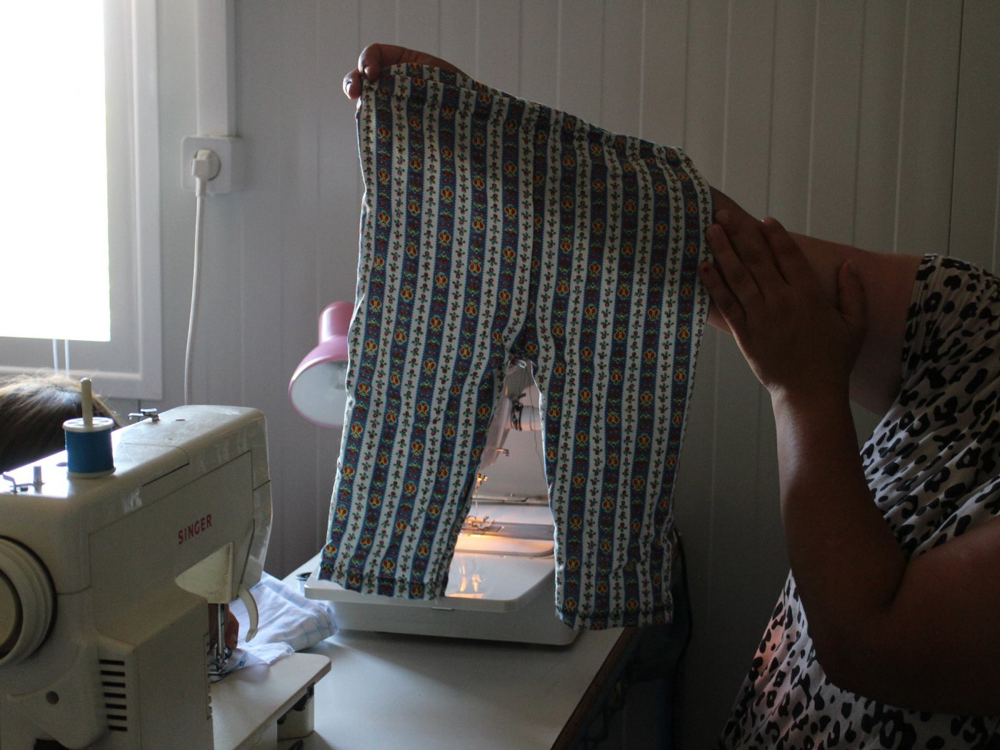
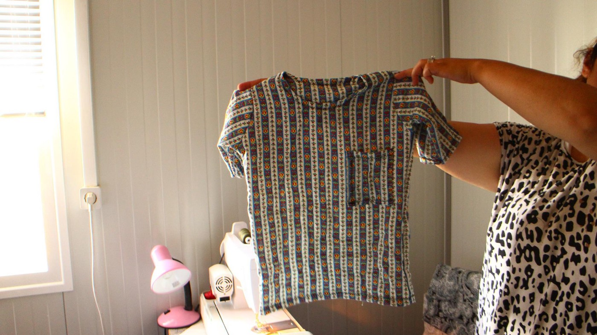
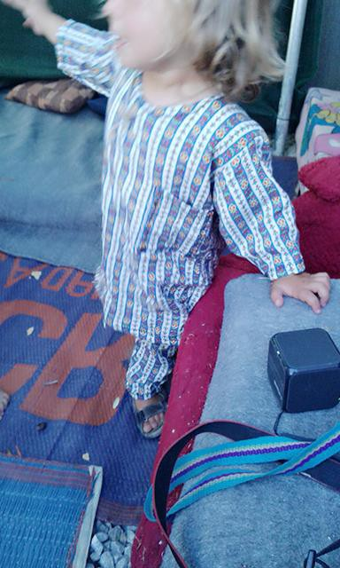
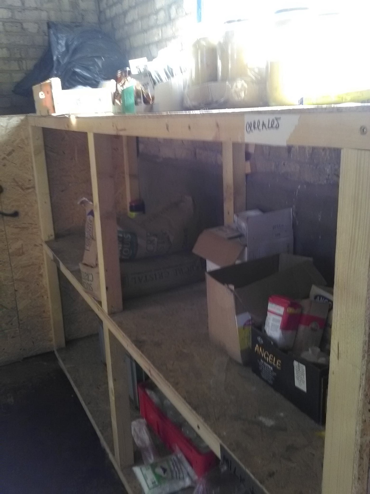

### AYS DAILY DIGEST 31/8: Devastating effects of the lack of information on refugees

_More arrivals to Italy and Greece and more help is needed\. Greece islands are overcrowded, again\. German Chancellor admits EU ignored the need for a pan\-European solution for refugee crisis\. Paris to open two new refugee centers\. Info for refugees who are being relocated to Romania_

 at Pikpa solidarity refugee camp\. \| Photos by Elizabeth Argyll & Jesper Houborg & some of the children at PIKPA](assets/1fcfd2e0b13/1*4gyEla314k2SOCpNQRxsuw.jpeg)

Music workshop delivered by the [Symbiosis team](https://www.facebook.com/symbiosislesvos/) at Pikpa solidarity refugee camp\. \| Photos by Elizabeth Argyll & Jesper Houborg & some of the children at PIKPA
### Greece
### Warning — Mistakes in the list of appointments

The Asylum Service have said that there are some mistakes in the list of appointments for September which they published on their website last weekend\. In addition, some of the SMSes which have been sent out contain incorrect Registration Numbers\.

[The Mobile Info Team for refugees in Greece](https://www.facebook.com/mobileinfoteam/) warns that if you are on the list or have gotten an appointment date by SMS, you should still go to the appointment you got\. Do not assume that it is wrong\. The Asylum Service plan to release a corrected list in the coming days\. The volunteers of the Mobile Info Team and AYS will let you know as soon as the corrected list is available\.
#### Questions to EU from Vasilika camp

More people arrived today\. According to the official figures, 59,230 people are in Greece today\. Yesterday official number was 59,160\.

According to the official figures, since March, the number of refugees on Greek islands has jumped from 5,538 to 12,120\. MSF warns that camps are at 160% of their capacities\. At the same time, the number of people arriving to Serbia and its border with Hungary is increasing, meaning that many people are leaving Greece with smugglers or by themselves\. They walk different paths, crossing through the Balkans, in order to get to the EU\. Many of them do have families living in western Europe and they have a right to be reunited with them\. But the borders are closed\.

Karrar and his sister are living in Vasilika camp\. He filmed a short video to show us the lives they and others lead in the camp\. Children from the camps have questions for Europeans\. Do we have answers?

[Help Refugees](http://helprefugees.org.uk) did a mini survey in Vasilika camp finding out that 1,093 people are living there\. Out of that number, 510 are under the age of 18\. The results are showing also that around half of the people in the camp have relatives in Europe, meaning they can join them\.

Among residents of the Vasilika camp are:
• 22 teachers: Arabic, sports, English, history
• 3 nurses
• 1 student doctor
• 4 Red Cross Paramedics
• 12 hairdressers and 6 barbers
• 4 businessmen
• 1 tattoo artist and 2 artists
• 33 tailors
• 11 carpenters
• 15 professional chefs
• various engineers, builders, metal workers and blacksmiths
#### Info for volunteers and those who are able to help

[Lighthouse Relief](http://www.lighthouserelief.org/donations) is also warning about an increase in the number of new arrivals to Greek islands\. In August, they provided initial relief to 400 people in 14 boats, which is 25% more than in July\.

> “We often encounter people who require medical attention\. In August, among the arrivals were people suffering dehydration, tuberculosis, a collapsed lung, and brothers who were paraplegic\. One woman who was eight months pregnant needed to go to a hospital to check that her baby was stable\.” 

They need your help to continue doing this\. Visit [their website](http://www.lighthouserelief.org/donations) or find them on FB\.

[The team of Idomeni volunteers](http://idomenivolunteers.info/new-volunteers/) gathered relevant info for those who wish to help, looking for volunteers and work equipment\.

Movement On The Ground is looking for a few good Farsi and Arabic volunteer translators to assist them in their sports program for the camps on Lesvos starting in October\. They’d like to find people who are:
- financially independent \(we offer low\-cost housing for long\-term volunteers\)
- 21\+
- Football loving
- flexible and positive
- affinity for social mediation
- willing to assist our coaches

For more information please send an email to:
[info@movementontheground\.com](mailto:info@movementontheground.com)
### Through refugee eyes

Our friend today writes about Lagadika camp\.

> “The most amazing thing we can learn is how to do things by ourselves\. Here you can see the awesome course for first aid\. People will be able to know what they have to do in an emergency\. I was so happy that there is big number of refugees just wanna learn and help to create a community inside the camp to do things by themselves\.
 

> Refugees still want to prove they are able to do everything and they are able to learn, they are able to help\.” 

[InterVolvere](https://www.facebook.com/219418945063168/photos/a.256091268062602.1073741829.219418945063168/331476300524098/?type=3&hc_location=ufi) needs your help, urgently\. Due to increasing demands in the two camps they work in, Softex and Vasilika, and emergency response to other camps in the region, their warehouse stock is running dangerously low\.

Below is the list of continuous needs for distributions in camps\.

> For weekly distribution:
 

> Diapers size 1 to 7
 

> Adult diapers 
 

> Toilet paper
 

> Washing liquid 
 

> Washing powder 
 

> Shampoo 
 

> Wet wipes 
 

> Mosquito repellent and after bite cream
 

> Baby bottles
 

> Deodorant 
 

> Shaving cream/foam
 

> Razors 
 

> Sanitary pads
 

> Food items
 

> Spice kits, salt & pepper, etc\.
 

> Cooking oil
 

> Sugar
 

> Coffee
 

> Tea
 

> Plastic cups
 

> Donations of fresh vegetables and fruit are always welcome\! \!
 

> For information please contact Simon on [operations@intervolvegr\.com](mailto:operations@intervolvegr.com) 

In Kara Tepe camp, [ART Angels Relief Team](https://www.facebook.com/AngelsReliefTeamART/) is working with refugees on creating beautiful things\. Both men and women from Afghanistan, Eritrea, Iraq and Syria are involved in their art, sewing, and music community\. But they need donations of fabrics textiles in white, black, brown, dark blue, cotton, viscose, and lino, plus sewing tools\. They also need three more chairs\.

Photo by ART\.

Latest figures are showing that 30 percent of the refugee population on Chios are women, aged 15 years or over\. Currently, there are only volunteer\-led social projects that exist on Chios and are aimed at mothers with babies, or provide schooling for children\. There are currently no facilities specifically catering to the needs of the women on the island\. They have no safe place to gather, to take a break from camp life and to just be themselves\.

> “We want to change that by creating [The Athena Women’s Centre](https://www.youcaring.com/athena-centre-for-refugee-women-600411) — a hub from where specific needs of the women refugee population of Chios will be addressed\. The vision for this center revolves around creating a “safe space” physically, mentally, and emotionally\. There are simple things that many take for granted, but which will make a wealth of difference to the women in the camps who have survived so much\.” 

HSA Agios Andreas \(Attica\), is urgently in need of donations and manpower, if someone could:
\- provide daily fruits and vegetable
\- provide tea bags and sugar for our hot drink distribution point
\- build shelves
\- bring clothes
\- provide 9 large garbage bins and 30–40 domestics bins
More info or offer, please contact: [fred@humanitarian\-support\-agency\.org](mailto:fred@humanitarian-support-agency.org)
### Italy
#### 13\.000 people arrived over four days

More than 1,000 people arrived in Lampedusa, where the hotspot is beyond its capacity since it can accommodate only 480 people, [the local media reports](http://react-text:%20218%20http://www.ilfattoquotidiano.it/.../migranti.../3005014/) \. Currently, there are 1,580 people in the hotspot\. One thousand landed in Palermo and more than 600 in Cagliari\. Altogether, 13,000 people arrived in Italy from North Africa in the last four days, mostly from Libya and Egypt\.

On August 30th alone, 3,000 people arrived\.

PM Matteo Renzi warned about the increase in number of new arrivals stating that Europe has to repatriate those who do not have the right to stay there\. “We must save human lives, but we also know there are limits,” Renzi said\.

According to [EU Commission’s data, 1,020 people have been relocated from Italy to other EU countries](http://ec.europa.eu/dgs/home-affairs/what-we-do/policies/european-agenda-migration/press-material/docs/state_of_play_-_relocation_en.pdf) , over the 39,600 foreseen within September 2017\.
### Romania
#### Volunteer network

Recently we have been receiving info about refugees relocated from Greece to Romania\. Many of them are reluctant to move to this EU country, not having enough info about life there and their future in that country\. We found the [Romanian Forum for Refugees and Migrants ARCA](https://www.facebook.com/ARCANGO/?fref=ts) , and organization that has many activities in the area of Bucharest, helping newcomers among other things\. They also organize integration events on every Friday, according to their FB page and distributing necessities to people living in Stolnicu camp\.

You can also get in touch with [Romanian UNHCR](http://www.unhcr.org/romania.html) \.

Or learn more from the [Refugee Pro Bono](http://www.refugeelegalaidinformation.org/romania-pro-bono-directory) directory\.

Romania does not belong to the Schengen area and the standard of living there is relatively low in comparison to other EU countries\. The first refugees arrived at the country in early March\. The country has promised to accept 6,351 refugees\.
### Germany
#### We need a pan\-European solution

In an [interview with Süddeutsche Zeitung](http://www.sueddeutsche.de/politik/bundeskanzlerin-angela-merkel-im-interview-aus-tiefer-ueberzeugung-1.3141421?reduced=true) , Chancellor Merkel admits Germany and other EU countries turned a blind eye to the refugee crisis growing outside its borders for too long, ignoring the need for a pan\-European solution\. She acknowledges Berlin fought for too long against badly needed EU reforms such as calls for a proportionate distribution of refugees out of concern that it would have infringed on national sovereignty\. She admits that her government did not deal with the problem in an appropriate way\. Merkel adds that the EU needs to improve cooperation with and dramatically increase developmental aid to countries in Africa as well as Turkey to help stem the flow of refugees fleeing their home countries\.

The paper notes that this unusually self\-critical analysis appears to be timed to coincide with the one\-year anniversary on Wednesday of her now\-famous statement ‘Wir schaffen das’ \(We can do it\! \)
### France
#### Two refugee camps to be open in Paris

The first approved refugee camp in Paris should be open by the end of September, Mayor Anne Hidalgo announced\. She also told the media that a second camp will follow\.

> “Two refugee camps will soon be open, one for men and another for women and children,” Hidalgo told France Inter radio\. 

The camp should provide shelter for more than 1,000 people\. The exact location is still not known to the public, but the Mayor said that the first one will be in northeast Paris, an area known for its large immigrant population and the second in the south of the city\.

Paris previously closed two unofficial camps set up by charities last year\.

[The Refugee Youth School](https://docs.google.com/document/d/1xuVqVZsTdknEqyUEZcAvh_N_4eyXKFvZcu5HQhvvbEI/edit) is looking for teachers\.

They run over ten classes a day across two schools on subjects from chemistry to French to David Attenborough\. At the moment they have three roles to fill: education coordinator, school manager, and teachers\.

> “If you are interested in a beautiful teaching or coordination posting with huge potential for self\-development and personal creativity send a CV to [ryseducation@gmail\.com](mailto:ryseducation@gmail.com) or just e\-mail if you have a question\.” 

#### Another cry for help from Dunkirk camp

Food is needed in the camp\. [Dunkirk Refugee Solidarity](https://www.facebook.com/groups/635003316641230/?ref=nf_target&fref=nf) is calling for help saying that currently the rice is the only thing they can offer for cooking dinner\. They need at least 500 euros per week for running the kitchen with Fresh Veggies\.

Please don’t forget them\.

Half empty kitchen shelves\. Photo by Dunkirk Refugee Solidarity\.
### General

MSF reports about 1,800 people rescued today, while three persons died\.

[WatchTheMed Alarm Phone](https://alarmphone.org/en/2016/08/28/weekly-reports-interceptions-push-backs-and-drownings-another-summer-in-the-mediterranean-sea/) issued a new two\-month report stating that the number of reported fatalities has increased in the Aegean Sea with 383 deaths recorded so far\. Crossings via the Central Mediterranean remains high, too\. Over the last two months, about 40,000 people took this route, mainly departing from Libya\.

The group of researchers from the [Mediterranean Missing Project](http://www.mediterraneanmissing.eu/wp-content/uploads/2015/10/Mediterranean-Missing-Family-report-260716.pdf) published results of the one year long investigation\. They interviewed 84 families of those who drowned in the sea, warning of the “devastating” effect that the lack of information has on families\.

Most of the bodies of people who lost their lives in the sea remain unidentified\. The report states how the “authorities in the countries of reception \(most notably Greece and Italy\), have been unprepared to deal with the nature and volume of this unprecedented humanitarian crisis”\.

> “Currently, there is a policy vacuum around the problem, marked by minimal cooperation among different state agencies, a lack of effective investigation, and little effort to contact the families of the missing\. This results in bodies being buried unidentified, with little respect for religious and cultural expectations or the rights of the families\. As such, thousands of families in countries of migrant origin remain unaware of the fate of their loved ones\.” 

> “The primary need of families is to know: they seek closure, through information concerning the fate of loved ones\. They want to know if the missing are dead or alive, and in any case where they are\. If those missing are dead, families need their bodies to be repatriated so they can be honored and buried where families can visit them, and they can take their place as a part of their community\.” 

[The Guardian](https://www.theguardian.com/world/2016/aug/31/are-you-helping-in-the-refugee-crisis-share-your-experiences?CMP=share_btn_tw) issued an call for volunteers to to share their experiences\. They would like to hear from individuals who’ve donated, community groups, or those working with organized groups or aid agencies\.

_Converted [Medium Post](https://areyousyrious.medium.com/ays-dail-digest-31-8-devastating-effects-of-the-lack-of-information-on-refugees-1fcfd2e0b13) by [ZMediumToMarkdown](https://github.com/ZhgChgLi/ZMediumToMarkdown)._
