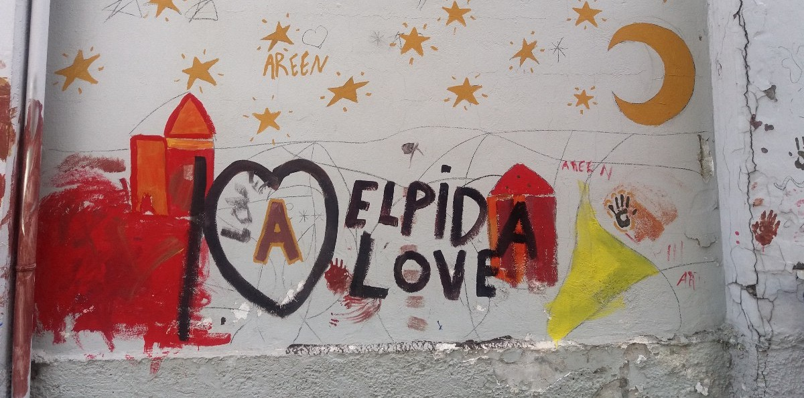
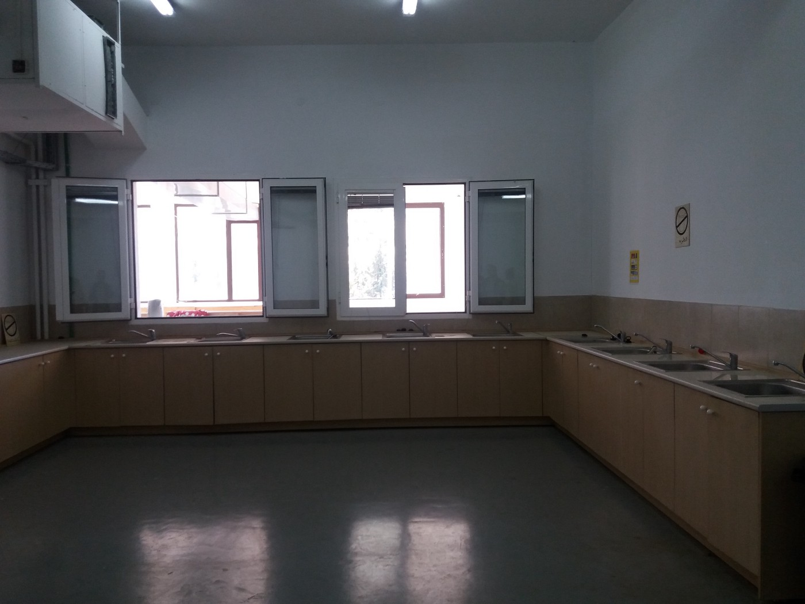
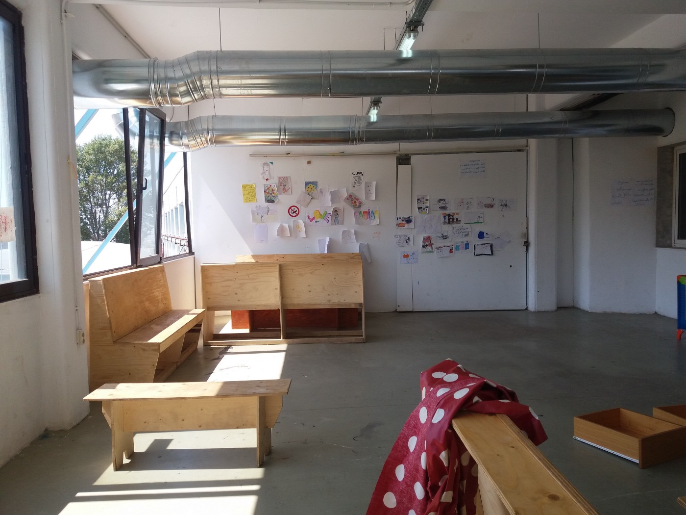
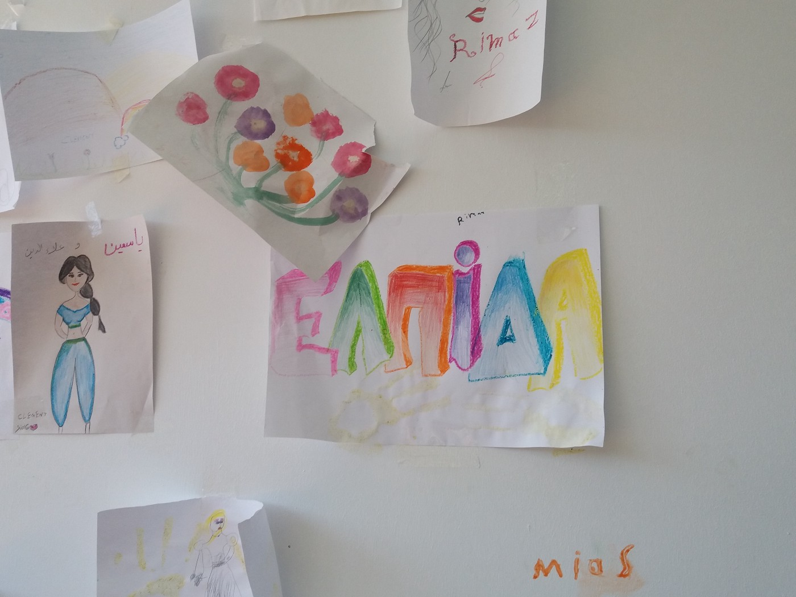
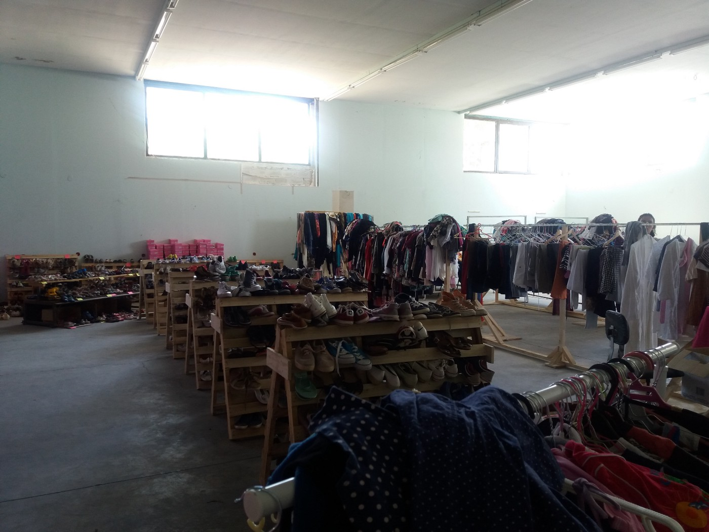
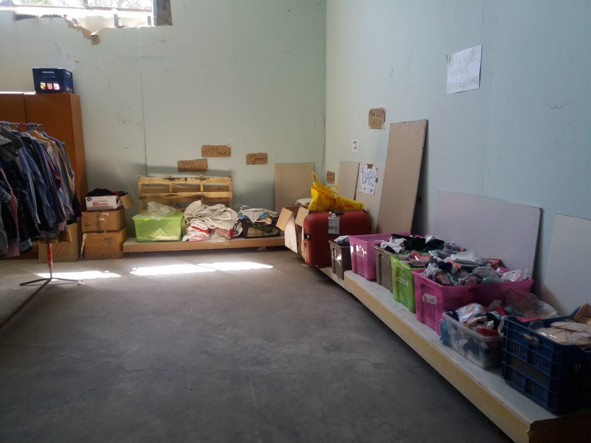
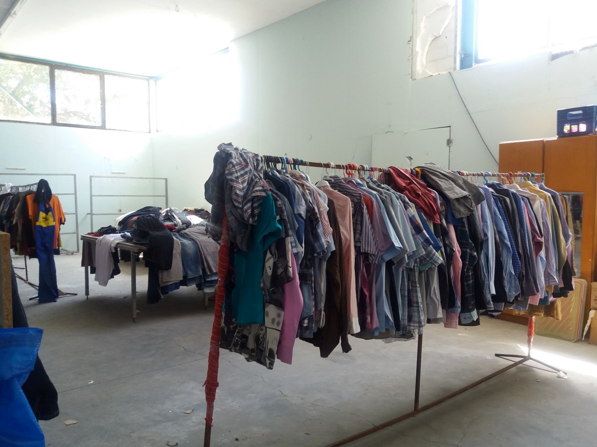
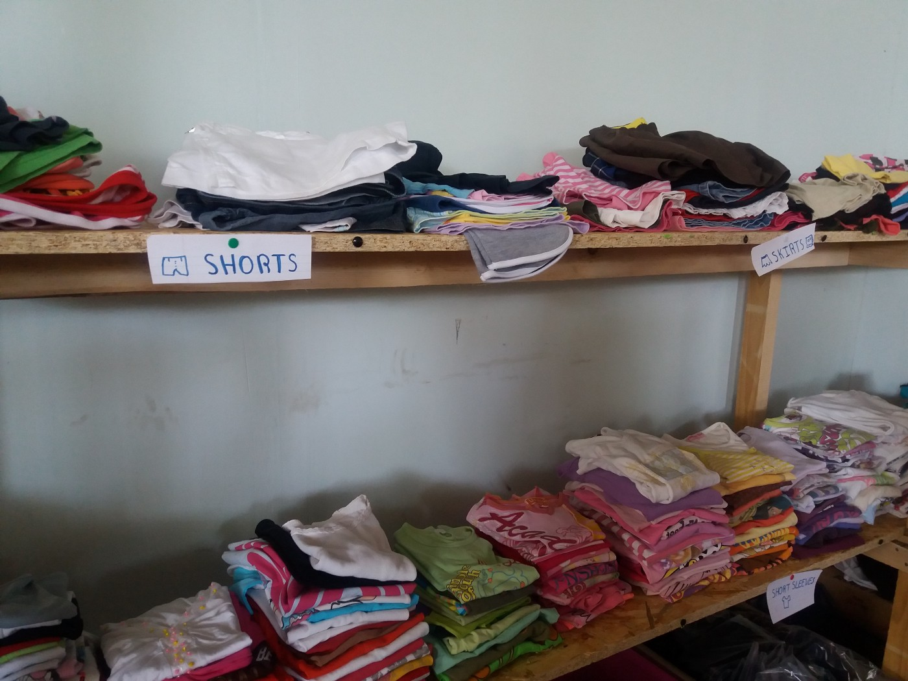

### AYS SPECIAL: Elpida — humanity, dignity, and community

_Two philanthropists invested their own money to establish Elpida, a place in Thessaloniki where refugees can find a safe place and, at least for the moment, rest and be calm\. The model they offer is easy to follow, it is simple, and yet it gives a lot to those in need\._

Kids drawings in Elpida garden\. Photo: AYS

Refugee camps in Greece are dreadful and sad places\. More than 40,000 people who have fled wars and misery are forced to live in these camps after the borders of Europe became closed to them in February\. Camps are established in the old factories and warehouses, next to dumpsters and swamps, usually far away from populated areas\. People live under tents in camps with no shade while the temperature often rises above 40 degrees Celsius\. Snakes, scorpions, mosquitos are the everyday pests of camp life\.

Food provided in camps is hardly edible, and it lacks fruits and vegetables\. Camps are overrun by gangs, despite the military and police presence, and are becoming very dangerous places — especially for women and children\. People hate camps and try to find a way out\. Many are ready to risk their lives one more time and are paying money to smugglers who are taking them over dangerous roads across the borders, making their way to Western Europe\.

The squats are places of hope, but they are being attacked and destroyed by authorities\. Additionally, [Elpida](https://www.facebook.com/elpidafactory/?fref=ts) , a housing and medical facility 20 minutes away from the center of Thessaloniki, is another successful example\.

Elpida was an old factory, like many other camps\. The Greek Migration Ministry gave it to Amed Khan and Frank Giustra who together invested their own money \($700 is used per person to create the home, including all construction work, furnishings, and initial clothes, food and necessities\) to turn it into a space where people could live in humane conditions\. Elpida’s capacity is around 650, and priority is given to the most vulnerable people\.

Resident share community space and kitchen where they can cook their own meal, the way they like it\. Freedom of choice makes a huge difference\. Photo AYS\.

What makes Elpida different is that it is not a camp but a place where people live together, in the best possible way\. It is clean, has many bathrooms, kitchens for all residents where all of them can cook for themselves, a yoga center, tea room, women’s space where women feel safe to take off their scarfs and, at least for a moment, be relaxed and free\. These are simple and small things, but they make a huge difference\. NGOs and different organizations in the field can propose people who could be moved to Elpida, while the final decision is made by the Ministry\.

Unlike those people who are living in camps, residents of Elpida, are calm and almost relaxed\. “For us, this is the first time to sleep in bed since February,” a Syrian family we met told us\. They moved in a couple of days before our visit in mid\-August\. Their room is not big, but it is clean, it has all white sheets, and it has big window\. None of the camps have anything like that\. “We do not want to stay in Greece; we want to continue toward Western Europe\. But for now, even if it takes longer, we are safe here,” they tell us\. And unlike many people we met in camps, this family is talking about their plans and the future\.

Amed Khan and Frank Giustra, who created Elpida, have been involved in the refugee crisis in different ways since 2015\. They made an agreement with the Greek Ministry of Migration that allows them to establish this place\. Elpida invited volunteers and different organizations to join them in their effort to make the old factory into a space for individual housing \(no more than 6 people per room\), with common spaces equipped with electricity, running water, plumbing, and kitchens\. Today, the government takes care of utilities and rent\. Volunteers from Together for Better Days are providing people to take care of waste management, outdoor infrastructure, and the distribution of non\-food items\. Emergency Response Center International, a Greek humanitarian NGO, works to establish educational programs for young people and teachers that speak Arabic\. The California\-based Team Rubicon is running a medical center and supplying the medical equipment to the center; NetHope is providing Wi\-Fi for all residents\. They officially opened on July 24th, and today they have about 160 people living there\.

> “My motivation was and is simple\. The International Community has failed war refugees\. Refugees are living in inhumane conditions and we simply set out to create basic human conditions that would qualify as protection\. I would say our guiding principles are humanity, dignity, and community\. Our primary concern is meeting the needs of those that suffer\. I suppose we wanted to demonstrate what is possible\. Elpida will remain open as long as there is a need,” Amed Khan told AYS\. 

Khan is very critical about the Western response toward the current crisis\. “EU powers joined the US, the wealthy Gulf Arab states and others to exacerbate the wars, creating unimaginable misery, leaving Greece \(a financially bankrupt state weighed down by EU imposed capital controls\) alone to deal with the mess\. It is clear to me that EU leadership does not want any more refugees coming their way, hence their lack of assistance to Greece and lack of movement on reunification and relocation\. Perhaps they should think about these things the next time they decide to funnel weapons in the pursuit of regime change\.”

Place that offers hope for humanity\. Photo AYS

People at Elpida and Amed Khan are hoping this project will inspire others to start similar initiatives ― or to simply fund them\. However, it does not look like many wealthy people are ready to offer help in this or any other way to people in need\.

“I wish I knew how to motivate more of the global elite to get involved with their time, expertise and resources\. We have collectively lost our concern for humanity and instead worship The God of Consumerism and Status\. The Mediterranean is awash in mega yachts, private planes, luxury hotels, restaurants, and clubs\. It is all the more heartbreaking that refugees fleeing from wars which they did not start often die in these very same waters,” Khan told AYS\. And too many people are overpowered with this religion of selfishness, which is one of the main causes for wars and crisis over the world, and a root cause for the refugee crisis\.”

Elpida has a limited capacity, but their founders are trying to find another place that will be turned into housing units\. It is not the fundamental solution to the current crisis \(the only one is to open borders\), but it can at least an easy period of waiting for people who are searching for peace and stability in their lives\.

Freedom of choice: people are free to choose their clothes and shoes, unlike in camps\. A simple thing with a big impact\. Photo AYS\.

_Converted [Medium Post](https://medium.com/are-you-syrious/ays-special-elpida-humanity-dignity-and-community-ad03b19f8950) by [ZMediumToMarkdown](https://github.com/ZhgChgLi/ZMediumToMarkdown)._
