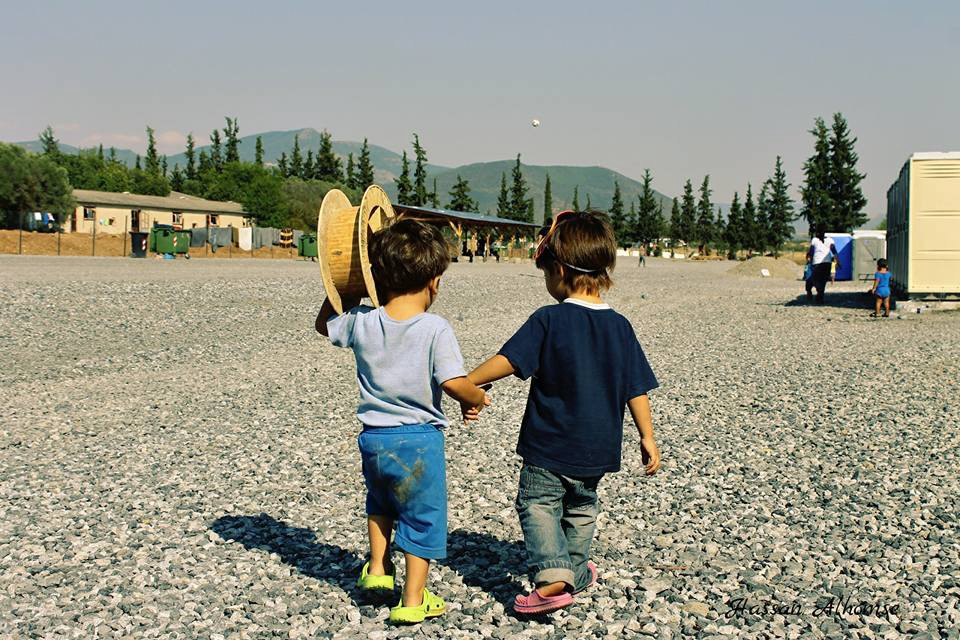
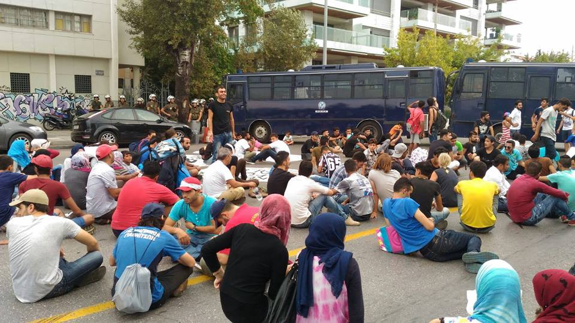
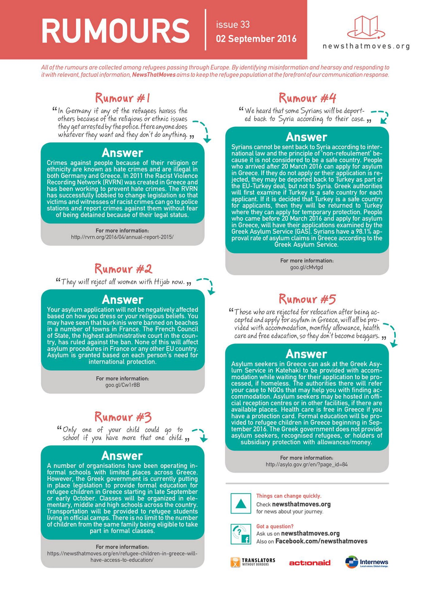

### Are You Syrious Digest 02/09 — French Interior Minister promises to dismantle Calais camp

_Protests in Thessaloniki over delays in the asylum procedure\. Finland has relocated 38 out of a total of 42 unaccompanied minors so far\. Bulgarian government looking to set up closed refugee camps\._

Friends at the Vasilika camp\. Photo by Hassan Alhomse
#### Greece
### 985 people reached Greek islands from 29th of August to 2nd of September

One speedboat dropped off 20 people \(ten men, five women, four children and one baby\) today on Korakas’s cliffs, in northern Lesvos\.
### Protests in Thessaloniki

A group of refugees held a protest in Thessaloniki, demanding open borders and expressing their frustration with delays in the asylum processing system and the relocation procedure\.

Photo by refugees\.tv

 \.](assets/4aa37c2599ef/0*KracOHnEPfFkpWYP.)

Photo: [Through Refugees Eyes](https://www.facebook.com/throughrefugeeeyes/) \.

Meanwhile, [Ekathimerini](http://www.ekathimerini.com/211677/article/ekathimerini/news/pressure-mounting-at-fyrom-border-again) reports there is a noticeable spike of people trying to cross into FYROM\. A police officer says “they come by train to the village of Mouries adding “others try to \[cross the border\] outside the village of Hamilo, near Idomeni\.”
According to Ekathimerini, authorities have also noted a rise in the number of refugees and migrants leaving camps and heading out alone or in groups to try to breach the border, fed up with long delays in the asylum processing system\.
### Debunked rumours

The new weekly issue of “Rumours” by Newsthatmoves is out\. [The information is also available in Greek, Farsi and Arabic\.](https://drive.google.com/drive/folders/0B-_rJ_0o5IZIR2VXMDRJQjJGYVU)

### Winter is coming at Alexandreia camp

A volunteer at the Alexandreia camp, shows us that conditions are dire, even at one of the better camps\.

There are structural reasons for that, which are almost impossible for volunteers to change\. Living in tents, with your family and kids, is a bad situation to be in, both from a physical and psychological standpoint\. The summer has been hard for refugees, with unbearable temperatures both inside and outside tents\. Winter however, will also bring its lot of challenges\. Northern Greece in the winter is cold and rainy and even more difficult if you’re forced to live in a tent\. “Refugee Support Greece”, who works in Alexandreia, are looking for [volunteers from mid\-September](http://www.refugeesupport.eu/help-us-with-your-time/) \. They run a free shop, clothes boutique, community centre, children’s activities and warehouse\. For all other volunteering opportunities, there is of course [Greecevol](http://greecevol.info/task.list.php.) \.
### 40 refugees relocated to Finland today

42 refugees were relocated from Greece to Finland on Monday and 40 today, including 38 Syrians, one Iraqi and one Eritrean\. Ten unaccompanied minors were among them\.

Since the beginning of the relocation program, 419 people have been relocated from Greece to Finland, including 38 unaccompanied children\. **Only four unaccompanied children have been relocated to other EU Member States\.**

Meanwhile, the UNHCR says that as of the 11th of August, 1,472 unaccompanied children are on the waiting list for shelter, with the UNHCR providing 275 places between December 2015 and end of August 2016\. At least 1,609 unaccompanied children have been referred to the National Centre for Social Solidarity \(EKKA\) for accommodation since the beginning of 2016\.

For Greece, no official distinction between accompanied and unaccompanied children, although the UNHCR estimates that at least 10% of children arrived without parents or guardians\.
### Some good news at last — the Macarena is making a comeback in Serres\!

#### Bulgaria
### Bulgarian government looking to set up closed refugee camps

[Balkan Insight](http://www.balkaninsight.com/en/article/battle-in-refugee-camp-leaves-bulgarian-town-nervous-09-02-2016#sthash.HxoaEVzX.dpuf) reports on a massive fight between over 500 people of different nationalities inside the Harmanli refugee centre on August 28th\. 
Following this brawl, the government decided to allow the State Agency for Refugees to set up closed refugee camps, or transform existing open camps into closed facilities if they assess that it is necessary\.

The decision has drawn criticism from human rights activists, who argue that existing Bulgarian laws should simply be applied to individuals that break them\.

Harmanli, the largest refugee camp in Bulgaria, hosts around 1,500 asylum seekers mainly from Afghanistan, Syria, Iraq and Pakistan\.
While the camp held just over 150 asylum seekers only few weeks ago, the number of refugees stuck in Bulgarian refugee camps has steadily grown since Serbia tightened controls over its border with Bulgaria in July\.

Asylum seekers sent to closed camps will be those with unclear identity and nationality or who have violated public order\.

[Bordermonitoring Bulgaria](http://bulgaria.bordermonitoring.eu/2016/09/02/bulgarias-government-approved-changes-for-restricted-movement-regime/) adds that asylum seekers who have “broken the rules” will have to stay in detention spaces that are installed within the “open camps”\. Bordermonitoring warns that such a regulation could easily lead to despotic regime within the camps and will increase social pressure, and says the Harmanli brawl was only an excuse, as these closed spaces were created weeks ago and such changes were planned for a long time\.
#### Kosovo
### Seven refugees stopped in Kosovo

Yesterday, Kosovo police stopped seven people in Prizren\. After identifying them, police confirmed they are Afghans\. They have requested asylum in Kosovo and are now in a center for asylum seekers in Prishtina\.
#### France
### French Interior Minister vows to close Calais camp

French Interior Minister Bernard Cazeneuve vows to close the Calais refugee camp, with the Calais mayor Natacha Bouchart saying Cazneuve promised a ‘total dismantlement’ of the northern zone of the Calais jungle, ‘in one step’\. In an interview to a regional newspaper however, he said the dismantlement would take place in several stages, adding that more places of accommodation need to be created in the rest of France to relieve Calais\. He says the dismantlement will be accompanied by the creation of 2,000 new beds in reception and orientation centres \(CAO\), while 6,000 new places are being created in reception centres for asylum seekers \(CADA\) \. Cazeneuve also says 200 additional policemen will be sent to Calais, while President Hollande will come to Calais end of September\.

Road hauliers plan to protest on Monday and have called on shopkeepers and locals to join them in their protest\.

Citizens of Calais are expected to block traffic on the bridge over the southern part of the Jungle, demanding the immediate closure of the camp\. Residents of the Jungle have been advised to not move outside on that day or worse try and get on the lorries\.

Meanwhile, [Le Figaro](http://www.lefigaro.fr/actualite-france/2016/09/01/01016-20160901ARTFIG00355-le-nombre-de-demandeurs-d-asile-afghans-bondit8230-de-964.php?redirect_premium) reports that the number of asylum seekers from Afghanistan has surged by 964% in five months, while the number of applications by Sudanese citizens rose by 174% in the same period\.

_Converted [Medium Post](https://areyousyrious.medium.com/are-you-syrious-digest-02-09-french-interior-minister-promises-to-dismantle-calais-camp-4aa37c2599ef) by [ZMediumToMarkdown](https://github.com/ZhgChgLi/ZMediumToMarkdown)._
