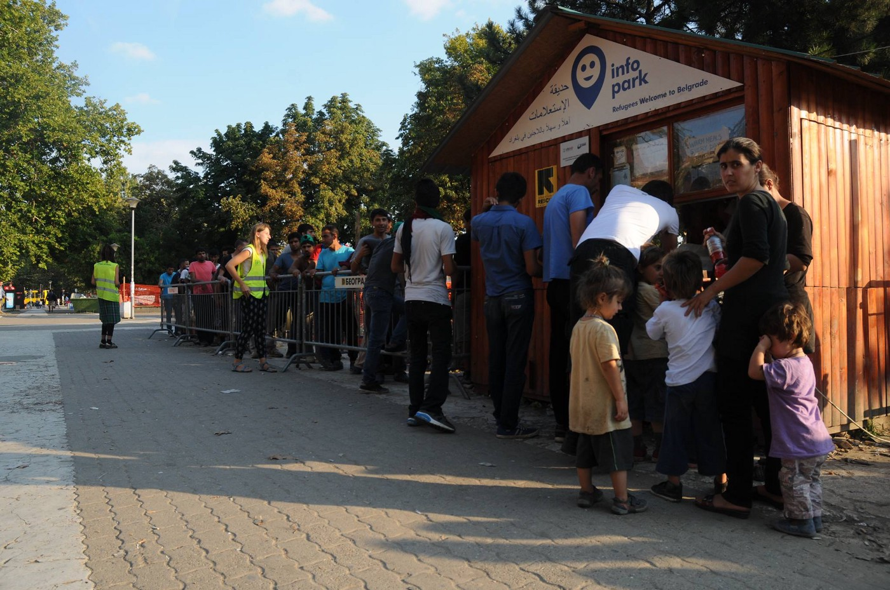

### AYS DAILY DIGEST 3/9: Italians are opening their homes for refugees

_Only 5 percent of people relocated so far from Greece and Italy\. Government is looking for solution for overcrowded islands in both countries\. 65 cases of malaria registered in Greece\. School year for refugees should start by the end of September\. Warm welcome for refugees by people in Tuscany, Italy\. Europe has no plan to open the borders and time soon\. People in Šid, Serbia, want to impose restrictions on freedom of movement for refugees_

 \.](assets/fa73d8325ba7/1*zVhWOebcjO54X1d_ed0uTA.jpeg)

Under siege\. By [Therough refugee eyes](https://www.facebook.com/throughrefugeeeyes/?fref=ts) \.
### Greece

**11,662 people arrived this year**

While tens od thousands of people are stuck in inhuman conditions in camps for over six months now, relocation remains shamefully slow: only 5 percent \(3,386\) so far\.

Meanwhile, people are arriving continuously to overcrowded islands\. Over the last three days, 78 people reached Kos\. According to the UNHCR data, between 22 and 28 August, 521 people crossed the sea, which is less than the week before \(923\) \. But overall, more people arrived so far in August \(2,810\) than in July \(1,920\) \. The total since April is 11,662 \(same period last year it was 225,505\) \.

People from Syria are still the majority of those who are arriving, followed by Afghanistan, and Iraq\. Children have comprised 38 percent of arrivals, while men are 41 percent and women 21 percent\.

Capacity at the islands is 7,450 and currently there are 11,690 persons there\. UNHCR and the government are trying to find a solution\. One of the proposed solutions is to transfer people who have completed the 25 days identification period to Kalymnos Island\. Transfers are expected to take place next week\.

Alternate Minister for Migration Policy spoke again about the plan to build new camps saying that it should be done by the end of December\. At the beginning, the deadline was the end of September, and that November\.

65 **malaria cases**

The Panhellenic Medical Association and the Hellenic Center for Disease Control and Prevention \(KEELPNO\) are warning about [the spike in cases of malaria](http://www.ekathimerini.com/211730/article/ekathimerini/news/medical-association-head-raises-alarm-over-malaria) \. In a statement, they noted “the need for the removal of sources of infection of Anopheles mosquitoes,” coupled with rapid improvements in the living conditions of refugees and migrants\. Previously, AYS reported about suspected [malaria cases in Sindos Frakapor camp](https://medium.com/@AreYouSyrious/ays-19-8-malaria-unofficially-confirmed-in-sindos-frakapor-camp-7a2b45cd64b3#.hx0yiioxl) , Northern Greece\.

According to KEELPNO, 65 cases of the mosquito\-borne disease have been reported in the country until mid\-August\.
#### Borders will remain closed

Today, we heard several rumors about possible opening of the borders\. Unfortunately, there are no official plans for something like that anytime soon\. [The Mobile Info Team for refugees in Greece](https://www.facebook.com/mobileinfoteam/?fref=ts) reports about the rumor that Germany wants to take 300,000 people\.

> “Many people have recently told us that the borders may be opened because Germany wants to take 300,000 refugees\. This is not true\. The German migration authorities have only said that Germany EXPECTS 300,000 people, not that it wants them\. Germany is still trying to limit new arrivals to Europe through the EU\-Turkey deal\.” 

The borders are officially not open, but some people are crossing while risking their lives\. Those who manage to enter Serbia irregularly, do have a chance to enter Hungary after several weeks, sometimes even months of waiting at the border in Northern Serbia\.

There are several refugee camps in Serbia, and help \(food, clothes\) provided by volunteers in Belgrade, as well as at the border with Hungary\. Since recently, people caught in the illegal crossing or without registration documents, are being taken to Preševo that is a closed camp now\.

There’s no way to enter Croatia or Slovenia legally\. However, if a refugee is found on Croatian soil, he or she can ask for asylum \(there are no guarantees he or she will get it\) \.
#### School year for refugees to start by the end of September

Kids in Greece started their school year this week\. All, but refugee kids whose only opportunity to go to school are cultural centers and schools inside camps run by volunteers and refugees themselves\. Earlier, [Greek government promised](https://newsthatmoves.org/en/classes-for-refugee-children-at-the-end-of-september/) that refugee children will be involved in an education system by the end of September\.

News That Moves reports that the plan includes that:

> • Refugee students will attend school between 14\.00 and 18\.00 on weekdays;
 

>  • Classes will be organized in groups of 20 students per class in elementary, middle schools and high schools across the country;
 

>  • Transportation to schools, excluding kindergarten, will be offered only to refugee students living in official camps\. There is no provision yet for transportation from unofficial camps;
 

>  • Classes for Greek and refugee students will be held separately during the 2016–2017 school year;
 

>  • The longer\-term goal for future years is to have refugee and Greek children attend classes together, the official said\. 

> **Classes for refugee children will include:** 
 

>  • Greek language classes;
 

>  • Mathematics;
 

>  • Computer courses;
 

>  • Arts and crafts;
 

>  • A foreign language course, which will be determined\. 

Kindergarten classrooms will be created in containers in organized camps\. Preschool classes in camps are expected to start in early October\.

There is no information regarding education for children who entered Greece after March 20 and are living on Greek islands\.

![“Try to realize\! 
Try to imagine what we were able to do in that time\.
Seven months, we were able to learn new language, continue our school or start new work
when we left our country we were dreaming to find new way, to build our life and then when the war in Syria will stop we will be back in our country to build it again, it’s not so big dreams to continue your school, to live safe and to work But the world saw it so big for us \. \. every time we are looking at the mirror it’s the same we still here in Greece, just date is changing, just the time\.” By [Through refugee eye](https://www.facebook.com/throughrefugeeeyes/photos/a.267469110309533.1073741828.266986607024450/341090519614058/?type=3&theater) s\.](assets/fa73d8325ba7/1*hUW60IKGl3fr9E80UBdWeQ.jpeg)

“Try to realize\! 
Try to imagine what we were able to do in that time\.
Seven months, we were able to learn new language, continue our school or start new work
when we left our country we were dreaming to find new way, to build our life and then when the war in Syria will stop we will be back in our country to build it again, it’s not so big dreams to continue your school, to live safe and to work But the world saw it so big for us \. \. every time we are looking at the mirror it’s the same we still here in Greece, just date is changing, just the time\.” By [Through refugee eye](https://www.facebook.com/throughrefugeeeyes/photos/a.267469110309533.1073741828.266986607024450/341090519614058/?type=3&theater) s\.
### Call for help

> HSA Agios Andreas \(Attica\), is urgently in need of donations and manpower, if someone could:
 

> \- provide daily fruits and vegetable
 

> \- provide tea bags and sugar for our hot drink distribution point
 

> \- build shelves
 

> \- bring clothes
 

> \- provide a daily or weekly or even bi\-monthly transportation for the people who have to go to town
 

> \- help with any donation… 

Contact [Fred Morle](https://www.facebook.com/fred.morlet.1) t [fred@humanitarian\-support\-agency\.org](mailto:fred@humanitarian-support-agency.org)
### Serbia

**4,400 refugees in Serbia**

According to UNHCR data, last week 4,400 were present in Serbia last week, most of them, 80 percent, are accommodated in camps and asylum or reception centers\.

The number of people on the Serbian side of the border with Hungary, dropped below 350 from 840 last month\. Some people were moved to centers around the country, while some, after registering to the list to cross to Hungary, are finding accommodation on their own\. Hungary continues to admit around 30 people each day\. Most of the people who are waiting at the border to cross are from Afghanistan are Syrians\.

Photo by Mitra Nazar in Belgrade\.
#### Petition for restriction on freedom of movement

Local authorities in Šid are demanding from the government to reconsider asylum center in this town and to increase security\. Locals are accusing refugees of different criminal offenses\. The Security Council of the town established a fact\-finding commission with the task to investigate the “harm made by refugees”\. The Council announced that if nothing is done by the government, they will demand the relocation of the Center\. Meanwhile, people from Šid are signing a petition demanding the restriction of freedom of movement for asylum seekers\. During the first day, 650 people signed the petition\. The population of Šid is around 15\.000\.
#### New center for refugees in Belgrade

[Refugees Foundation](https://www.facebook.com/izbegliceusrbiji/posts/1330998750244432) has opened a center for refugees to relax and take part in many different activities while in Belgrade\.

Working hours will be from 15 to 21, 7 days a week\.

For more info, [visit their FB](https://www.facebook.com/izbegliceusrbiji/posts/1330998750244432) \.

](assets/fa73d8325ba7/1*O6sD8gOI_dD_KZ3Jp4lKWA.jpeg)

Place to rest, socialize and relax\. Photo by [**Refugees Foundation Serbia**](https://www.facebook.com/izbegliceusrbiji/?fref=nf)
### Italy
#### Number of new arrivals to Italy on par with the last year

During the last week, UNHCR registered 1,953 new arrivals to Italy by sea\. The number of arrivals in 2016 continues to be on par with 2015: 105,628 this year, compared to 116,149 in the same period the previous year\.

Most of the people coming to Italy are from Nigeria, Eritrea, and Gambia, while 15 percent of all arrivals are unaccompanied and separated children\.

According to o [fficial numbers from Italy](http://lanuovasardegna.gelocal.it/regione/2016/09/02/news/migranti-sono-oltre-semila-i-profughi-ospitati-in-sardegna-1.14048383) , over 6,000 people are hosted in receiving centers in Sardinia, while over 1,200 arrived over the last week\.
#### Arrested in attempt to help refugees

Swiss socialist deputy Lisa Bosia Mirra, president of Associazione Firdaus, [has been arrested by the border police in Stabio](http://magseriesusa.net/2016/09/03/deputata-svizzera-fermata-mentre-aiuta-migranti-minorenni-a/) , on the border with Italy, while taking four minor refugees to Switzerland\. She is accused of “favoring clandestine migration”\.
#### Good people of Tuscany

Letitia \(journalist\) and Sergio \(graphic designer\) are the first couple in Tuscany to host a refugee as a part of the regional project, [local media are reporting](http://corrierefiorentino.corriere.it/…/migranti-via-proget…) \.

> “In this society, children grow up unhappy; we want to teach ours the smile and the luck they have been having\. Hosting an asylum seeker in our family will not only support him but also help us educating our children, through the world’s injustice and their luck”\. 

The trial period is three months; the new inhabitant will be a man \(women and children are in protected structures\), coming from a receiving center in Florence\. The family will receive a per\-diem of 16 euros, while other 16 will go to the cooperative Il Cenacolo, which guarantees legal assistance, courses of Italian language and vocational training, along with 2,50€ pocket money\.
### UK
#### September 17th is almost here

Volunteers in the UK are calling all to join them in solidarity with the refugees\. They plan a march toward the Parliament Square\.

](assets/fa73d8325ba7/1*nJFFwE2u9_toXq0Dm5vQ9w.jpeg)

Photo [**Care4Calais**](https://www.facebook.com/care4calais/?fref=nf)

> “We want to tell the government that we are waiting to help\. The UK should be leading the way and working with other states to give refugees safe, legal routes to asylum, ending the trade in people smuggling\.
 

> We know that public pressure can make a difference\. So save the day and make your voice heard\!” 

[Join the event](https://www.facebook.com/events/1563121147327378/?ti=icl) and get more info\.

_Converted [Medium Post](https://areyousyrious.medium.com/ays-daily-digest-3-9-italians-are-opening-their-homes-for-refugees-fa73d8325ba7) by [ZMediumToMarkdown](https://github.com/ZhgChgLi/ZMediumToMarkdown)._
