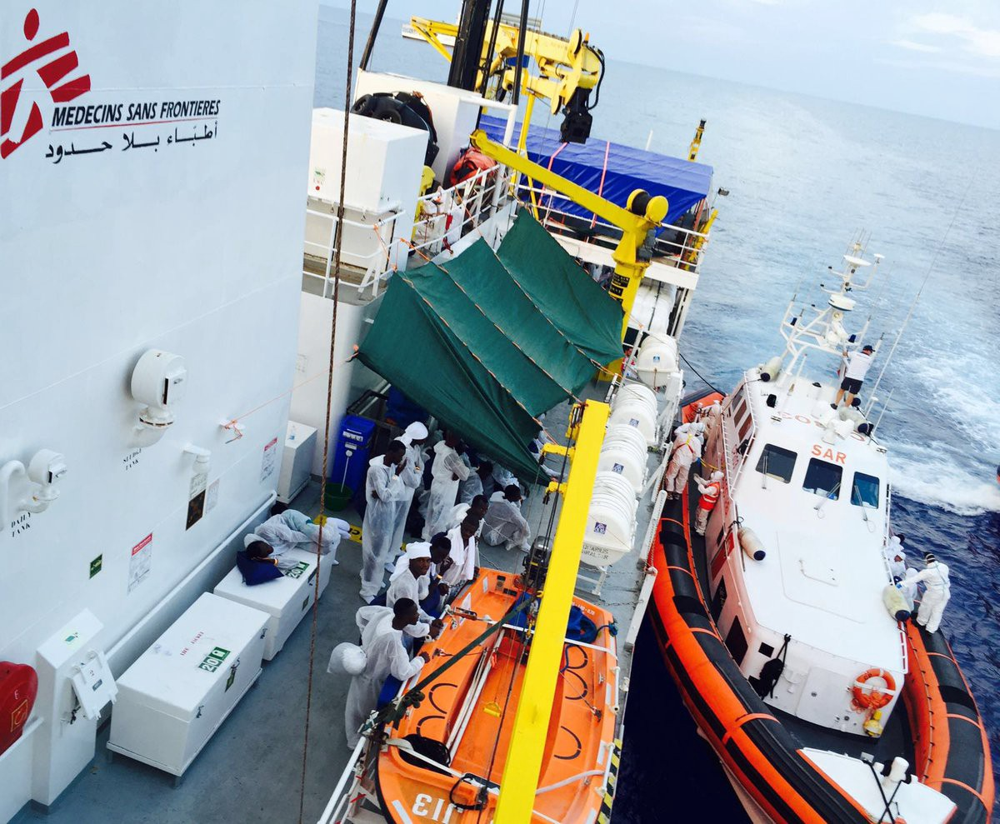
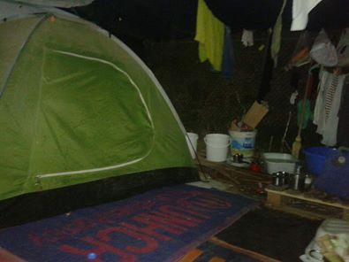
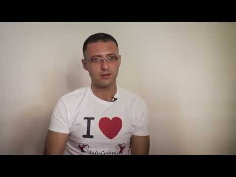
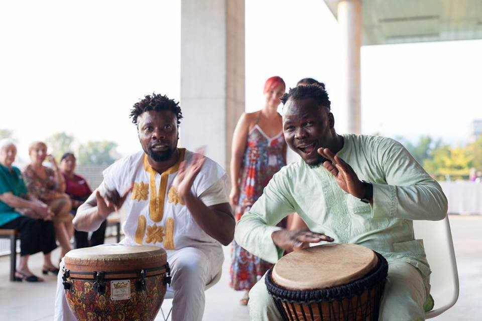
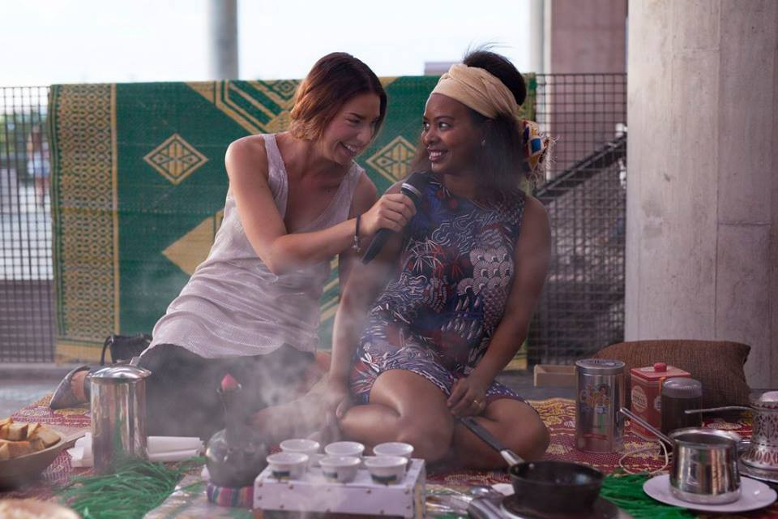
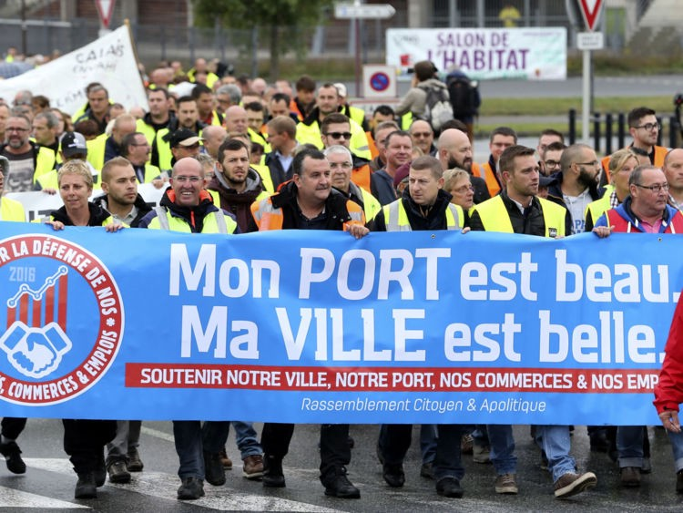

### AYS digest 05/09: Mediterranean swallows more lives\. How many more until safe passage?

MSF on today’s rescue mission
### **Deaths in the Mediterranean\. Again\.**

Reuters [reports](http://af.reuters.com/article/worldNews/idAFKCN11B1BQ) that “fifteen bodies were recovered and more than 2,700 boat migrants rescued off the coast of Libya on Monday, the Italian coastguard said, in another day of mass departures from north Africa\. Italy’s navy and coastguard, ships patrolling on a European Union anti\-smuggling mission, vessels run by humanitarian groups, and a commercial tug boat aided in the rescues\.”

Unfortunately, even more bodies were discovered today with MSF reporting 7 bodies pulled out of the sea\. We stress today’s [message](https://twitter.com/MSF_Sea/status/772829028965294084) from MSF, which reads: “Dreadful news from the [\#Med](https://twitter.com/hashtag/Med?src=hash) where another 7 lives have been lost to the sea\. How many more until [\#SAFEPASSAGE](https://twitter.com/hashtag/SAFEPASSAGE?src=hash) ?”
#### Greece
### **110 new arrivals to Greek islands**

As of 8 o’clock this morning, 110 new arrivals had reached the Greek islands\. Most of them arrived to Leros, where 72 people landed, and the rest to Lesvos\.

In total, 59,569 people are now stranded throughout Greek territory\.

people sleeping in small tents for months on end
### **Show solidarity not just to the city of Aleppo, but also to people from Aleppo that fled to Europe**

As we are constantly reporting, even though many activist groups are trying to improve the conditions in the camps, despair grows with each passing day\. A man from Syria whose family is stuck in Souda camp has written a letter to the international community that feels solidarity towards city of Aleppo\. The world, he writes, must also not to turn a blind eye to the people from Aleppo who are waiting in Greek camps for their situation to be resolved, who lack answers or relief\.
### **Information about an interview in Greece**

If you are able to get an interview, here are some instructions posted in Arabic by Refucomm:

### **Information on family reunification procedure in Germany**

If you have family in Germany and are trying to apply for reunification, the [Immigrant and Refugee Support Group in Athens](https://www.facebook.com/groups/204202716585823/) Facebook group has translated the directions you should undertake\. Please follow this [link](https://www.facebook.com/groups/204202716585823/permalink/338082689864491/?hc_location=ufi) for more detailed information\.
### **Call for donations to Samos**

Samos volunteers report that they have seen an increase in arrivals in the last two days and are low on donations\. “The long process of applying for asylum means many asylum seekers are spending a very long period of time at the camp,” the says\. “This is an alarming prospect and due to the low stock on items of clothing and an increasing number of arrivals we are in need of donations\.”

If you are able to help, please follow [this link\.](http://bit.ly/2ceVo7d)
### **Clashes in Moria camp**

With tensions growing high, Lesvosnews\.net has [reported](http://www.lesvosnews.net/articles/news-categories/astynomiko-reportaz/agries-sygkroyseis-sti-moria-traymatieskolasi) clashes in Moria camp\. Apparently there were heavy clashes between Afghan and Syrian youth\. Four children ended up in hospital\.

The news outlet warns more of such conflicts must be expected, given that some 3,500 people are crammed into a space designed for 2,000\.
### **Volunteers working on Open cultural center in Chierso**

](assets/681830b7adce/1*-1609ZSL99xNUcpj0RZNnA.jpeg)

Photo: [**Open Cultural Center — OCC — former Idomeni Cultural Center**](https://www.facebook.com/OpenCulturalCenter/)

In an effort to create a more livable environment in the camps, volunteers are working tirelessly on cleaning classrooms, building furniture, and putting the finishing touches on a new community center in Chierso\.

](assets/681830b7adce/1*Ai8In6iTwXSRGqjHQE1TFA.jpeg)

Photo: [**Open Cultural Center — OCC — former Idomeni Cultural Center**](https://www.facebook.com/OpenCulturalCenter/)

](assets/681830b7adce/1*oBebTIG8bKkfepuglpqVgQ.jpeg)

Photo: [**Open Cultural Center — OCC — former Idomeni Cultural Center**](https://www.facebook.com/OpenCulturalCenter/)
### **Fire under control**

Further up north, we received information that the fire which broke out in Frakapora camp near Thessaloniki is now under control\.
### **Calls for volunteers**

We have also received two calls for volunteers in locations throughout Greece\. If you are an experienced volunteer and able to come to Greece to help with Earth project, please follow this link for more information and [application form](https://docs.google.com/forms/d/e/1FAIpQLSdgTPA86W8-mxZdGaQOYI0yK81tCJREOz5D717x5hZjPNsdgQ/viewform?c=0&w=1) \.

There is also an urgent call for help from Tsepelovo camp near Ioannina\. If you can come, please contact [gaiaazul@yahoo\.es](mailto:gaiaazul@yahoo.es)

Additionally, Core Relief will be hosting a free humanitarian design workshop in Lesvos from 3–9 October\. Designers and techies with an interest in applying design solutions to humanitarian challenges are invited to apply\. For more, follow this [link](http://www.corerelief.org/opencall) \.
#### Croatia
### **Croatia approves international protections for Syrians and Iraqis**

Initiative Welcome from Croatia has recently received statistics from Croatian Ministry of Interior that say that in a period between 15 July and 01 August 2016, 831 people applied for protection\. Out of that number, 81 were denied and 34 approved\. 486 of the total left Croatia “willingly,” according to the Ministry\. In the same period, Croatia received 162 people that previously been in other EU countries\. These returns were carried out under the provisions of Dublin agreement\.

As these are the numbers for period ending on August 1st, there have been some changes in the statistics as we are witnessing on the ground, but more current information is not yet available\.
### **Croatia can also be a home**

Taste of home donation party\. Photo: Neven Petrović

In brighter news, the cooperative [Taste of Home](http://www.okus-doma.hr/en) , whose founding members are asylum seekers currently living in Croatia, held a donation event this Friday at Zagreb’s Museum of Contemporary Art\. Three hundred friends and supporters attended this wonderful night of unity, interculturality and solidarity\.

Taste of home donation party\. Photo: Neven Petrović
#### Italy
### **Volunteers needed in Milan**

If you happen to be somewhere in or around Milan, Milan’s hub in Via Sammartini 120 needs volunteers\. There are many children and many new arrivals\. The volunteering shift usually goes from 10:00 to 14:00, but if someone is free only for lunch time, he/she’s more than welcome\. Sammartini hub can be reached with the Red Metro or bus 87\.
#### Germany
### **Merkel loses her stronghold to AfD — anti immigrant right wing party**

Even as we hear more stories about people stuck in dire conditions on the periphery of the EU, news is hardly better in the center, where decisions are made\. In Sunday’s regional elections, Angela Merkel’s CDU fell to third place in the north\-eastern state of Mecklenburg\-Vorpommern, behind the center\-left Social Democrats and AfD, an anti\-immigrant right\-wing party\. This region is traditionally a CDU stronghold, and many believe that this election is an indicator for next year’s national elections in Germany\.

As has been reported, most of the pre\-election campaign rhetoric was concentrated on the issues of immigration\. For more, follow this [link](https://euobserver.com/news/134906) \.
#### France
### **Unfortunate strikes in Calais**

Protest in Calais\. Photo borrowed from Sky news

In a misguided effort to save themselves from real dangers of trafficking and looting, French farmers and truck drivers have staged a blockade demanding the demolition of the “Jungle\.” Although the threats for safety of truckers and their cargo are real, aid workers warn that a hasty dismantling of the camp would bring about much worse humanitarian crises\.

We would add that this anger, as well as the demands for safety are once more directed to the wrong culprit, the refugees, as opposed to the traffickers, who form the real threat\. Indeed, it’s the refugees themselves who are most menaced by the trafficking industry\. The only way to ensure safety in Calais is to allow people to travel freely to the UK, without the use of smugglers, to apply for asylum there\.

For more on this story, follow the [link](http://news.sky.com/story/travellers-face-disruption-in-calais-migrant-road-block-protest-10565664) \.
#### U\.K\.
### **Solidarity organized by people, hate organized by the politicians**

As it is clear by now, hate, as well as solidarity is very much organized\. And while politicians insist on inciting hatred, the people continue to come together in the spirit of solidarity\.

The death of Arkadiusz Jozwik, a Polish citizen who had been living in the UK for four years, has raised legitimate concerns about the rhetoric of the Brexit campaign\. According to a report published by the UN, the Brexit referendum campaign was marked by “divisive, anti\-immigrant and xenophobic rhetoric”, in which some politicians “created and entrenched prejudices, thereby emboldening individuals to carry out acts of intimidation and hate\.”

While hatred has gained power and momentum in the UK, however, the vigils organized by average citizens in Jozwik’s memory prove that popular acts of solidarity are still possible\.

For more links and analysis, follow this [link](https://www.hrw.org/news/2016/09/05/britains-brexit-hate-crime-problem) \.

_Converted [Medium Post](https://areyousyrious.medium.com/mediterranean-swallows-more-lives-how-many-until-safe-passage-681830b7adce) by [ZMediumToMarkdown](https://github.com/ZhgChgLi/ZMediumToMarkdown)._
