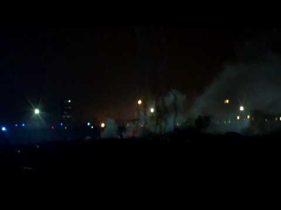

### AYS Digest 7/9 — Europe builds up its walls and conflicts emerge over Dublin rules

_Some Greek camps to close and camps in northern Greece flooded by heavy rain\. Relocation remains slow\. Austria threatens to sue Hungary if it does not take back refugees while UK plans to build ‘big, new wall” in Calais\._

Watermelons in Kavala\. Photo by Northern Lights Aid\.
#### Syria
### Four White Helmets volunteers killed in double\-tap attack

The Syria Campaign says Hasan Hannan, pictured above, and three other volunteers were killed in a double\-tap attack, when airstrikes targeted rescuers responding to an earlier attack\.
### Shells kill only pediatrician in Shekh Maqsoud

The Syrian Observatory for Human Rights says the doctor was killed by shelling in fights between “Islamic factions”\.
### Chlorine attack in eastern Aleppo

A suspected chlorine attack has hit eastern Aleppo on Tuesday, with eyewitnesses saying the attack came from a missile fired by a Syrian government jet

#### Greece
### Greece to close some refugee camps and open new ones

[Ekathimerini](http://www.ekathimerini.com/211810/article/ekathimerini/news/govt-overhauling-migrant-center-planning-as-islands-appeal-for-help) reports that government officials on Tuesday determined which reception centers for refugees across the country are to close and where new, improved facilities are to open but did not determine a time\-frame\.

Among the facilities that are to close are those in Sindos and Oraiokastro and in Nea Kavala\. Reception centers in Diavata and Vassilika are to be upgraded, while a new reception center for minors is to start operating at the Amygdaleza facility, north of the capital, next Monday\.

Heavy rain today has demonstrated why facilities need to be improved, with several camps in northern Greece completely flooded\.

Nea Kavalah camp after the rain\. Photo by Mohamad Hadi Almadanis\.

Oreokastro camp\. Photo by Mohamad Hadi Almadanis\.

Vasilika camp\. Photo by Araz Kurdish\.

Volunteers in Vasilika say the camp is completely inundated and say water as well as fecal matters poured through the tents\.

The Giannitsa camp had to be evacuated, with Syrian refugees going to Drama, Afghans to Malakasa and Yazidis to Serres\.

The government has also said it will build new camps to decongest hotspots and reception centres on the Aegean islands\. More than 12,600 refugees are currently living in Lesvos, Chios, Kos, Leros and Samos, despite a maximum capacity of only 7,450\.

NewsThatMoves however reports the governmental Coordinating Body for the Refugee Crisis Management said there will be no massive and organized transfer of people from the islands to the mainland\.

Refugee numbers continue to increase, with one boat of 47 people arriving in Chios and one boat of 61 people landing in northern Lesvos, including 20 children and two infants\. UNHCR notes that between 29 August and 04 September, 1,052 refugees and migrants crossed the sea to Greece, almost double the 521 that crossed the previous week\.

UNHCR is also concerned that refugees in Chios will resort to camping outside of designated sites, as all sites have surpassed maximum capacity\. Volunteers said refugees that landed today in Chios had to sleep on the beach\.

Photo posted on Through Refugees Eyes

Photo posted on Through Refugees Eyes
### Children to start attending school at end of the month

Ekathimerini reports that child refugees will start attending Greek schools at the end of this month — those aged between 4 and 7 will attend kindergartens set up within refugee camps while children aged 7 to 15 will join classes at public schools near the refugee camps where they are staying\. Unaccompanied minors aged 14 to 18 will be able to join vocational training classes if they so desire\.

A poll performed by the Norwegian Refugee Council within northern Greece refugee camps shows that education remains a priority for families — when asked which services respondents would want to have access to, in case they were transitioning to an off\-camp housing option, the most common answer was “education for children”, with 76%\.
### Iraqis who entered Greece after 16th of June not eligible for relocation

The Greek Asylum Office provides answers to frequently asked questions and has one again [clarified relocation rules](http://asylo.gov.gr/en/wp-content/uploads/2016/09/Qandanswers_ENG_Sep1_final.pdf) , stating that Iraqis who have entered Greece after 16 June 2016 will not be eligible for relocation\. The 16th of June is the day on which European governments were informed that less than 75% of Iraqis are granted international protection in Europe on average\.

The 75% rule prevents Iraqis from being relocated, but Eurostat data shows that in the second quarter of 2016, the acceptance rate was above 75% for the two countries that are meant to accept the most refugees under the relocation deal — 76\.4% for France and 86\.7% for Germany\. Meanwhile, countries that have accepted no refugees at all are far below the 75% rate — Hungary’s rate remains at 28% and Denmark’s at 10%\.

The 75% rule therefore seems to prevent Iraqis from relocating to the EU because the percentage is being weighted down by countries who accept very few refugees under the relocation program anyway\.
### Your weekly reminder that relocation is still extremely slow

Could Greece become Europe’s Nauru, as recently noted by the EU\-Turkey deal’s architect Gerald Knaus? It could, if relocation continues at this pace\. Relocation numbers remain extremely low, with only 3,493 refugees \(5\.2%\) relocated out of a target of 66,400\. Even worse, only 42 unaccompanied children have been relocated so far, 38 out of them to Finland\.

The European Council on Refugees and Exiles \(ECRE\) points out different challenges to the scheme\. On one hand, countries such as Germany and Croatia have made a limited number of places available \(250 for Germany and 26 for Croatia\) compared to their theoretical share of refugees as set out by the European Commission\. On the other hand, countries like Estonia, Latvia and Lithuania have simply rejected asylum requests without providing substantiated reasons\. The ECRE also argues that relocation is slow because refugees refuse to go to certain countries — so far however, only 106 refugees have withdrawn their application — 36 that were meant to go to Bulgaria, 18 to Poland and 20 to Romania\.
### The relocation scheme continues to work in parallel to the Dublin system

The ECRE notes that a “perverse element in the nature of the relocation scheme is its operation parallel to the Dublin system”\. Switzerland for example, has relocated only 34 people from Italy since the beginning of the program, but transferred 730 asylum seekers in the first semester of 2016\. Sweden has relocated 39, but sent back 156 to Italy\.

Comments made by German Interior Minister Thomas de Maiziere to return asylum seekers to Greece in accordance with the Dublin Regulation could put Greece at a breaking point and completely contradicts the EU’s wish to reallocate refugees across the continent\.

However, Simon Cox, a migration lawyer for the Open Society Justice Initiative, writes on Twitter that he expects German courts to block Dublin returns to Greece should the German government take this decision, arguing that “Greece is systemically failing to register & decide asylum claims & to provide safe accommodation & resources for destitute claimants”\.
### Updates on the GreeceVol website

[GreeceVol](http://www.greecevol.info/) has sorted refugee camps by nationality and languages spoken, allowing volunteers with language skills to better plan their trip\. You can now click on one of the refugee camps, see which organizations work there and if they have an active call for volunteers\.
### Greek volunteers win Nansen Refugee Award

[Euronews](http://www.euronews.com/2016/09/07/greek-volunteers-win-2016-nansen-refugee-award?utm_source=dlvr.it&utm_medium=gplus) reports the Hellenic Rescue Team and human rights activist and psychologist Efi Latsoudi, who helped thousands of migrants reaching Greek shores, are the joint winners of this year’s prestigious Nansen Refugee Award\.

“One of the most difficult tasks we ever had, and one I will never forget, was when we had to treat a young mother, who had lost three of her children\. We were all speechless\. We were desperately trying to find a way to ease her pain, but there was no way,” Latsoudi told Euronews
### Call for help at the Trikala Atlantic Camp in Central Greece

Refugees at the camp have started a protest and are calling for help, saying conditions are really bad, especially the food\.

#### Serbia
### Donations needed for Refugee Aid Mikaliste

Refugee Aid Mikaliste in Belgrade needs warm clothes as weather deteriorates and as winter approaches\. You can find the location of their donation centres on their [website](http://refugeeaidmiksaliste.rs/donate-now/) \.

Photo by Refugee Aid Mikaliste
### Austria
### Austria threatens to sue Hungary if they refuse to take back refugees

[Reuters](http://www.reuters.com/article/us-europe-migrants-austria-hungary-idUSKCN11D0JV?il=0) reports Austria’s interior minister threatened on Wednesday to sue Hungary if it refused to take back migrants crossing their shared border and accuses Hungary of letting migrants enter its territory in defiance of Dublin Regulations\. Hungary has countered that most most refugees enter its territory from other EU states, notably Italy and Greece\.

A Hungarian government spokesman said “”Hungary cannot and will not take responsibility for, and suffer the consequences of, the irresponsible conduct of other member states — Austria, Germany — which expressly suggested ignoring the rules, or for other states — Greece — that neglected to do their job”\.

Austria has also finalized a draft law to prevent asylum applications once an upper limit of 37,500 has been reached\. Around 29,000 applications have been filed in the first seven months of this year and Slovenian Prime Minister expects Austria to close its borders in September or October\. He adds that this would lead to a domino effect, leading all countries along the balkan route to close their borders to prevent a backlog in their own country\. The Austrian newspaper Der Standard, says some 2,200 soldiers could be deployed at the borders should refugees arrive en masse\.

Austria is also thinking about reactivting border controls at its border with Italy — the South Tyrol region in Italy has already invested €2m to buy containers, beds and hygiene items in preparation of a potential refugee backlog\.
#### France
### UK plans to build “big, new wall” in Calais

The Guardian reports UK’s immigration minister Robert Goodwill says work is about to begin on “a big, new wall” in Calais, to prevent refugees from reaching the UK\. The £1\.9m wall will be built in two sections on either side of the road to prevent migrants from jumping on lorries\. François Guennoc of Auberge des Migrants says _“when you put walls up anywhere in the world, people find ways to go round them\. It’s a waste of money\. It could make it more dangerous for people, it will push up tariffs for people smugglers and people will end up taking more risks\.”_ Goodwill adds the wall is only one part of a £17m deal with France and admits he is yet to visit Calais\.

Photo by the Worldwide Tribe

The Refugee Rights Data Project points out that the wall is unlikely to make the jungle disappear and believes it will only make refugees more desperate, keeping them longer in Calais looking for a way to reach the UK\. The group says 13% of residents have been in the jungle for more than a year\. It also says that 74\.3% have no information about European immigration rules, making it unlikely for them to seek legal pathways to immigration, once the wall is built\.

Tear\-gas was shot at refugees in Calais by French police at least four times Tuesday night, according to Direct Action Volunteers\. Here’s a video of what happened\.

_Converted [Medium Post](https://areyousyrious.medium.com/ays-digest-7-9-europe-builds-up-its-walls-and-conflicts-emerge-over-dublin-rules-74adba7bf40f) by [ZMediumToMarkdown](https://github.com/ZhgChgLi/ZMediumToMarkdown)._
