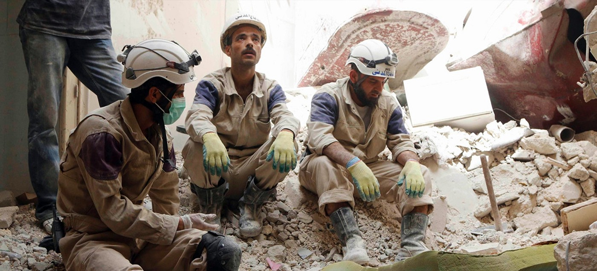
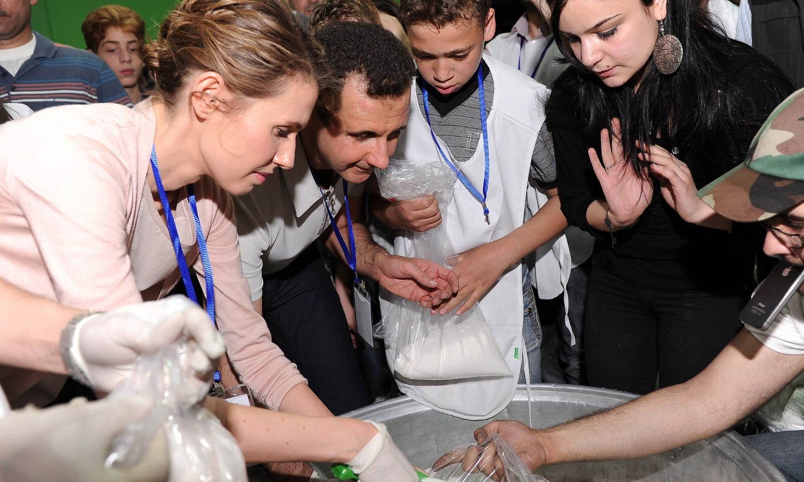
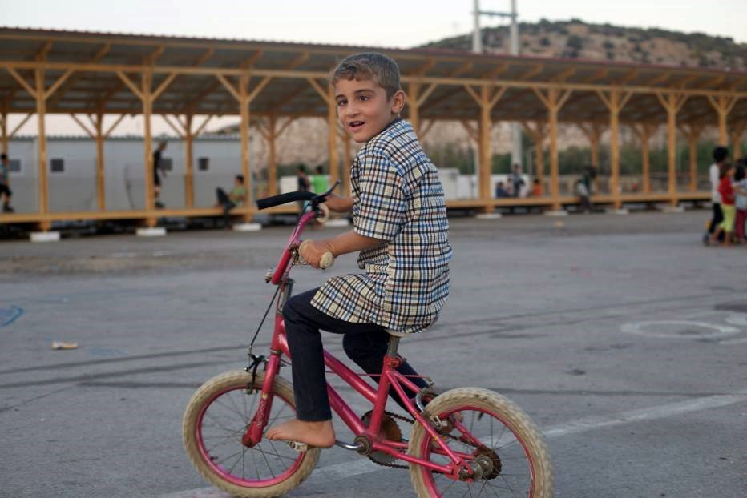
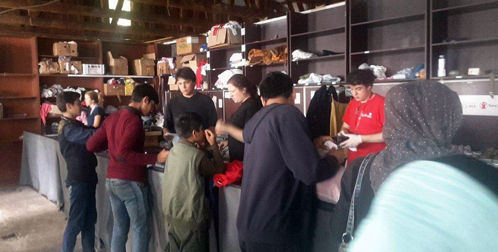
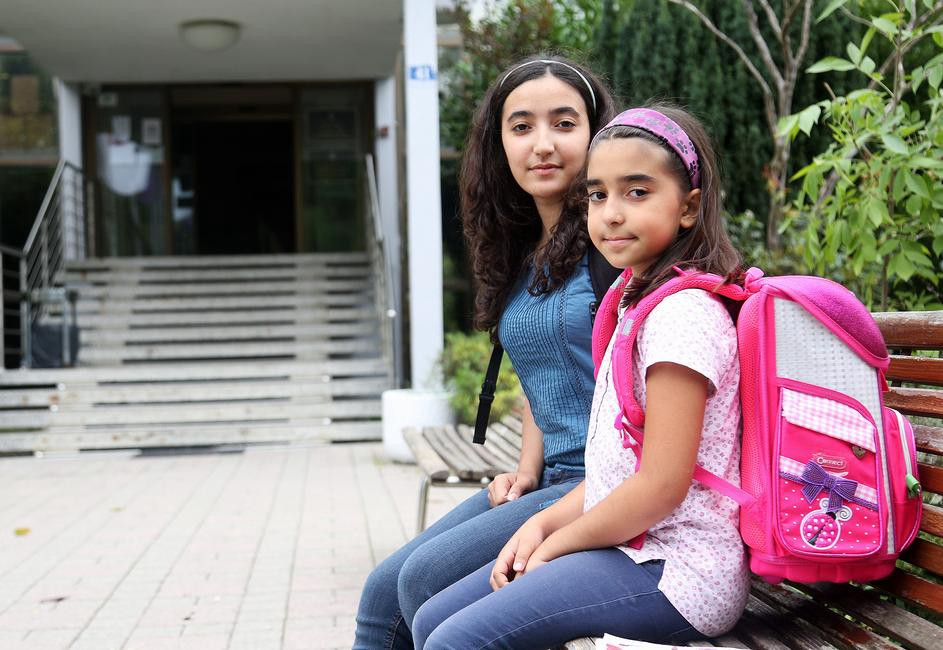
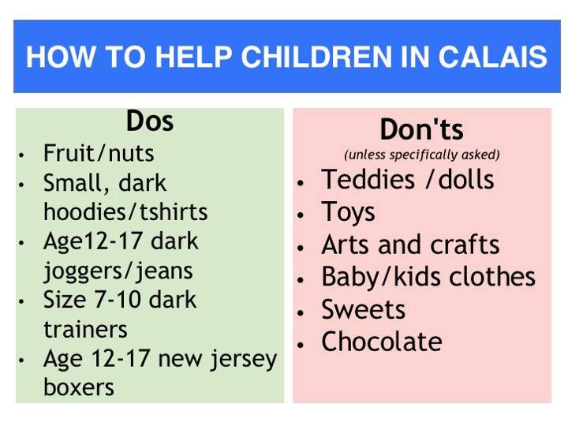

### AYS digest 8/9: 73 Syrian NGOs have stopped cooperation with UN
#### Only 2,9% of promised 160,000 refugees have been relocated in the first year of a 2\-year EU program\. Warm, waterproof clothes and shoes needed again as the winter approaches\. Serious food shortage in overpopulated Calais camp\.

Syrian Civil Defense \(White Helmets\) have pulled from any cooperation with UN’s agencies in the country\. Photo: The White Helmets
#### SYRIA
### 73 different aid groups suspend cooperation with UN in Syria because of influence of Assad regime

Today, 73 different NGO’s working on humanitarian response to Syria and neighboring countries have issued a [joint statement](https://www.sams-usa.net/foundation/images/UN%20Position%20Paper%20Final.pdf) demanding an immediate investigation into UN’s operations in the country, and suspending their cooperation with UN bodies in Syria until further notice\.

> It has become clear to many organizations that the Syrian government in Damascus has a significant and substantial influence on the performance of UN agencies based in Damascus as well as their partners SARC and other humanitarian actors \(…\) we must express our concern over the manipulation of humanitarian relief efforts by the political interests of the Syrian government that deprives other Syrians in besieged areas from services of those programs\. The Syrian government has interfered with the delivery of humanitarian assistance in multiple instances, including the blocking of aid to besieged areas, the removal of medical aid from inter\-agency convoys, the disregard for needs\-assessments and information coming from humanitarian actors in Syria, and the marginalization of other humanitarian actors in the critical planning phases of crisis response \(…\) yet, UN agencies based in Damascus and their main partner, SARC, have been making the final decisions, shaped by the political influence of the Syrian government\. The 2016 Humanitarian Response Plan \(HRP\) is a very clear example of this — the NGO’s have warned\. 

Bashar al Assad and his wife posing for journalists at a food distribution centre in Damascus\. Photo: AFP

The NGOs signed onto this paper provide humanitarian assistance to over 7 millions Syrians, over 6 millions in Syria and others in the 3 neighboring countries of Jordan, Lebanon and Turkey in all humanitarian sectors, health , education, food security, shelter, wash, protection, livelihood and many others\. They include many members of Syrian NGO Alliance, Syria Releif Network and Shamil CSOs Coalition, as well as courageous independent groups such as Syrian Civil Defense \(White Helmets\) and Independent Doctors Association IDA\.
### Increase in suicide attempts and mental illness among children of besieged Madaya

The besieged Syrian town of Madaya has seen a worrying increase in suicide attempts and mental illness among children and young adults, as desperately needed aid is blocked for more than four months\. According to the [Save the Children](http://www.savethechildren.org.uk/2016-09/increase-child-suicide-attempts-madaya-sieges-worsen-across-syria?hootPostID=6bfff6202ce49dbbb6ec43bdbd38a165) report, medical staff in Madaya have reported that at least six teenagers — the youngest a 12 year old girl — and seven young adults have attempted suicide in the past two months, compared to almost no cases before July 2015 when the siege was first imposed\. Doctors say hundreds more people are suffering from psychological problems and mental illness including severe depression and paranoia, often brought on or exacerbated by the conditions they are living in\. Specialised mental health care and even basic medical treatment is not available\. In addition to the surge in suicide attempts, there are reports of a serious meningitis outbreak\.
#### EUROPE
### Only 2,9% of promised 160,000 refugees have been relocated in the first year of a 2\-year EU program

](assets/d966a1c40234/1*ISe_oGCy40aqFlRZTByYwg.jpeg)

Thousands are left in inhumane conditions, waiting for the EU to fulfil its promises\. Photo: [Refugee Support Greece](https://www.facebook.com/RefugeeSupportGreece/)

According to the official European Commission [document](http://ec.europa.eu/dgs/home-affairs/what-we-do/policies/european-agenda-migration/press-material/docs/state_of_play_-_relocation_en.pdf) on Emergency relocation mechanism, only 4,669 out of promised 160,000 refugees were relocated from Greece and Italy to other parts of European Union as of 7 September 2016\. Additionally, only 13,288 out of promised 160,000 places have been made available in host countries so far\.

The temporary emergency relocation scheme was established in two Council of Europe decisions in September 2015, in which member states committed to relocate 160,000 people from Italy and Greece \(and if relevant from other member states\) by September 2017\. According to the [factsheet](http://europa.eu/rapid/press-release_MEMO-15-5698_en.htm) that was published last September, EU had dedicated funding of €780 million to support this scheme, “including a 50% pre\-financing rate to ensure that national authorities have means to act very swiftly”\.

**_So far, they have only managed to relocate 2,9% of the promised number, proving once again EU has been not only unrealistic in the initial proposal of the programme, but also ineffective in its implementation\._**
#### GREECE

164 **refugees landed to Greek islands today\.** Volunteers from Chios have repotred three boats with 16, 42 and 45 persons this morning, but the government has only registered the boat with 45 people\. According to official numbers, additional 61 people have arrived to Lesvos\.
### Notara 26 re\-equipping after the attacks

Notara 26 has published a new list of needs, including hygiene products and kid’s necessities, bit also appliances, furniture and other needs caused by arson attack on the 24th of August, and severe damage caused by the fire\. Material donations can be brought to the site\. Also, [Real Democracy Now Edinburgh](https://www.facebook.com/events/1754473634777392/) has also started collecting money to support Notara 26\.
### Support groups for LGBT refugees in Greece

LGBT refugees are one of the most vulnerable groups, but often not recognised as such\. News That Mover has bundled [a list of groups](https://newsthatmoves.org/en/qa-assistance-to-lgbt-persons/) working with LGBT individuals, including umbrella organisation [OLKE](http://www.olke.org/) , [Geeek Transgender Association](http://www.transgender-association.gr/) and [Colour Youth](http://colouryouth.gr/en/) for young refugees\.
### New volunteer initiative provides eyeglasses to refugee kids who lost them on their way to safety

Many children have lost, broken or overgrown their glasses on a turbulent way to Greece\. Photo: ESBWN

A new initiative called [**Eye See a Better World Now**](https://www.facebook.com/EyeSeeaBetterWorldNow/?hc_ref=PAGES_TIMELINE) was started, to give refugee children the chance to see clear again after losing/breaking their glasses during their turbulent trip to Greece\. They connect kids from refugee camps with private sponsors, who then cover their expenses that range from 50€ to 60€ for the eye examination and a new pair of glasses\!
### Refugees leaving the camps in Northern Greece

Considering slow and complicadet process of registrations, relocations and other official mechanisms of coping with the crisis, it’s no wonder refugees are loosing hope in EU mechanisms and resorting to dangerous irregular crossings of borders instead of rotting for years in inhumane refugee camps, where many don’t have the crucial medical support, not to mention protection of their personal safety and adequate schooling mechanisms for children\. Daily statistics from refugee camps, especially those in Northern Greece, show significant drop of numbers in the last couple of months, while at the same time, the number of refugees and irregular crossings is increased throughout the Balkans and central Europe\. Our recent report about the number of refugees who are leaving the Greece was confirmed by News That Mover [report](https://newsthatmoves.org/en/people-leaving-camps-in-north-of-greece/) today, relying on official registration numbers of Marazakis camp \(down from 3,370 on August 5 to 1,800 people as of September 6\) and Nea Kavala camp \(down from and 3,682 on August 5 to 1,975 refugees\) \.
### Greek and Bulgaria to jointly patrol borders

According to [Greek press](http://www.ekathimerini.com/211841/article/ekathimerini/news/greece-bulgaria-to-jointly-patrol-borders) , Greek and Bulgarian police are to start joint patrols along the Greek\-Bulgarian and Bulgarian\-Turkish borders in a bid to prevent undocumented refugees from continuing their journeys via the Balkan route\. According to the report, both Greece and Bulgaria have come under European pressure to thwart refugees who entered Greece from Turkey and aim to continue to Central and Western Europe via Balkan route\.
#### BALKANS
### Winter clothes and shoes needed as the weather gets colder, and more refugees arrive on daily basis

Miksaliste is reporting a shortage of warm slothes and shoes, especially for kids and women\. Photo: Miksaliste

We’re getting calls for donations from both Serbia and Hungary, where the weather is getting colder and many refugees are still stuck in makeshift border camps or sleeping in the streets\. [Refugee Aid Miksaliste](https://www.facebook.com/RefugeeAidMiksaliste/) from Belgrade is asking for donations of womens and childrens clothes and shoes\. [Refugees Foundation Serbia](https://www.facebook.com/izbegliceusrbiji/) needs support for their new integration center\. [IHO team](https://www.facebook.com/imhumanIHO/) needs donations to keep supporting refugees in Kelebija\. Wonderful [NorthStar team](https://www.gofundme.com/qc54ns3g) is filling in all the gaps left by bigger organisations\.

> **_We recommend all of the potential donors to start collecting winter clothes and shoes again, as the needs will most probably rise in the following weeks\. Of course, don’t send anything without previous consultation with volunteers on the ground\._** 

In Hungary, [International Relations for Peace](https://www.facebook.com/IRPeace.org/?fref=ts) is currently collecting warrm clothes, diapers, hygiene items and factory packed food for the refugees\. [MigSzol](https://www.facebook.com/migszolcsoport/?fref=ts) is also a great address for anything related to refugees in Hungary, doing field work, providing information support and advocacy\.
### Croatia shows its ugly face, brings little refugee sisters and their loving mother to tears

Iranian sisters Negar and Malania managed to learn the language in only five months\. Photo: 24sata

Our little Iranian friends Negar \(14\) i Melania \(9\) have spent entire summer vigorously learning Croatian\. In only five months since their arrival to our country, they managed to learn the language and they have been enrolled to a public school in Zagreb, which started this week\. Both Negar and Melania, their caring mother and all of us volunteers were tremendously proud of their success, and they’ve shared their personal story with [local newspapers](http://www.24sata.hr/news/djevojcice-iz-irana-lijepo-nam-je-u-hrvatskoj-zelimo-ostati-490174) \. Unfortunately, the article has triggered a wave of hateful online comments, and since they can now read and understand Croatian, the family has spent entire day crying in shock\. This event broke our hearts and we’d like to find a way to show them not everyone is a xenophobic prick\. If you’d like to write a message of support to the girls and their mother \(the father is still stuck in Greece\), please send it to our [FB inbox](https://www.facebook.com/areyousyrious/) and we’ll forward it to them\. Both English and Croatian is fine\. :\)
#### FRANCE
### Serious food shortage in overpopulated Calais

Our colleague Rando Wagner has published a report from Calais camp, warning that both Belgian and Malaysian kitchen desperately need rice, tinned tomatoes, chick peas, cooking oil and milk in order to feed up to 10,000 refugees\. As result, many are left without their daily meal\.

> Every time I visit the Calais Camp it seems like going to a new place, due to the forced closure of one part or the other, or the demolition of the ‘high street’ the one constant is the £19m fence towering above the camp and the hundreds of CRS police\. On driving in, it is very noticeable that the population has gone from 6000 to nearly 10000 in the space of a few months, which has resulted in a severe food shortage and long time volunteers are for the first time unable to feed everyone\. They are roughly 2500 meals short every day\. If you want to help and have a spare day, fill up your car with the items above \( uk prices are way lower than French ones\) and take a day trip to Calais\. Media reports about war like conditions on the motorways seem to be more Hollywood inspired than based on fact\. We felt perfectly safe at all times, he wrote, adding that The Belgian Kitchen is also looking for short and long term volunteers\. 

With Eid coming on September 11th, Calais kitchens would also like to provide normalcy distributing biscuits & dates on what’s meant to be a happy day full of celebrating and treats\. You can either send those items strait to the camp, or make a donation on this [link](https://mydonate.bt.com/donation/start.html?charity=152188) \.

With 676 unaccompanied children in Calais, according to last month’s census, many people want to help these children stuck in limbo\. There are many ways you can positively help, with specific donations of much needed items\. You can also help support the legal battle by Citizens UK’s Safe Passage team in getting the unaccompanied kids entitled to family reunification in the UK under Dubs a reality\. Today, they celebrate getting the 50th child to the UK safely\. You can also find their fundraiser [here](https://www.justgiving.com/fundraising/safe-passage) \.

_Converted [Medium Post](https://areyousyrious.medium.com/ays-digest-73-syrian-ngos-have-stopped-cooperation-with-un-d966a1c40234) by [ZMediumToMarkdown](https://github.com/ZhgChgLi/ZMediumToMarkdown)._
