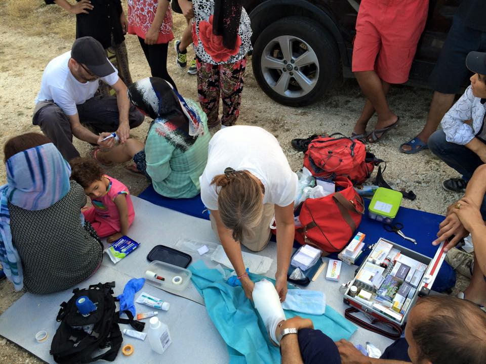
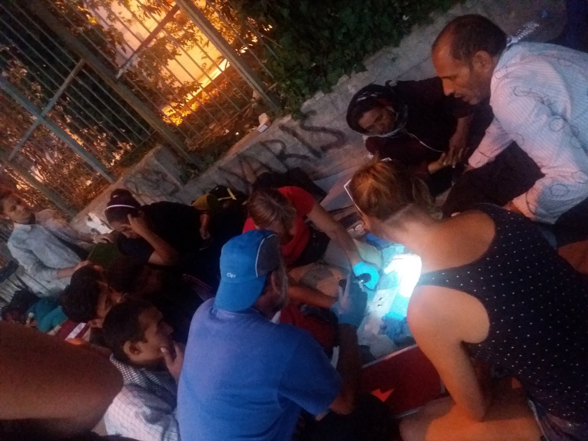
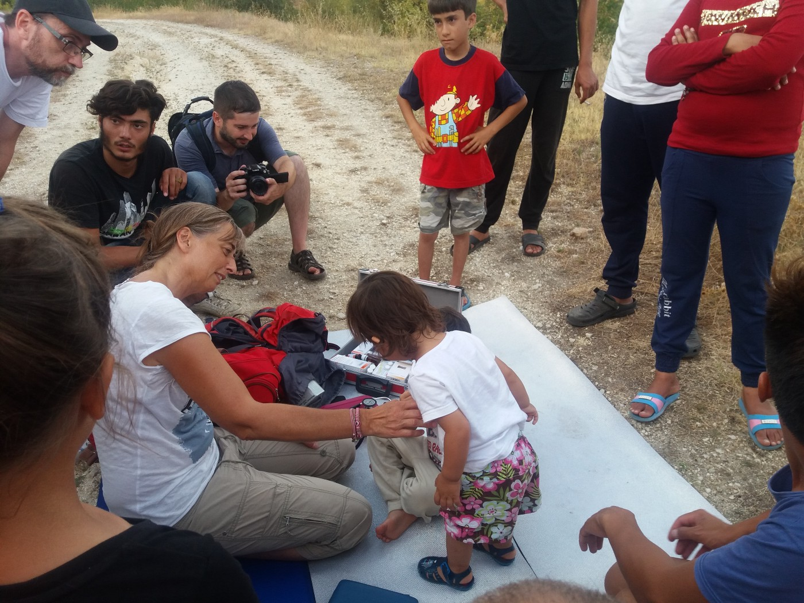

### AYS SPECIAL: Dr\. Karin, tireless hero of stranded refugees

](assets/db18c360fcdd/1*bnlOhrybUbV2DEPZVc4iKg.jpeg)

Dr Karin Tschare\-Fehr ambulance is where ever refugees are\. She offers medical help, smile and encouragement to refugees and volunteers\. Photo by [**Arye Wachsmuth**](https://www.facebook.com/arye.wachsmuth)

Among the of hundreds volunteers in Greece, there are people of many different backgrounds and professions, including doctors\. Several of them are working independent of any organization, investing their own means to help people who are forgotten and left in inhumane condition in refugee camps or just out in the streets of Greek cities\. For several days, the AYS team accompanied one of them, the tireless Dr\. Karin Tschare\-Fehr from Austria, who has been working on the refugee route for over a year\.

We met Dr\. Karin in the park near the train station in Thessaloniki\. She spent two weeks there, arriving to the park at around 10 in the morning, working until about 2pm, and then going to visit at least one camp in Thessaloniki area, only to come back around 7pm to the park where she works as long she has strength, and as long there is a need for a doctor, which is often much longer than she can endure\.

She walks around the park, chats with people, and if somebody needs her, she sits down on the ground, pulls out her suitcase full of medical equipment, and starts working\. On the first day we met her, there were about 100 people in the park\. The day after it was over 200, and a day after over 400\.

Her car is stuffed with clothes, vitamins, baby diapers and food, and medicine\. She puts bandages on the feet of people who walked the night before trying to cross the border and continue further north\. She examines babies with fever\. She gives vitamins to women and children\. Sometimes when needed, she just talks to people and plays with the kids\. On the last day of her stay in Thessaloniki, we went to visit one of her patients who was caught by police while trying to cross the border, and was brought to the camp where he didn’t want to stay\. When we arrived, police and military did not want to let us in and, while standing at the gate, Dr\. Karin announced that all people who need to see the doctor should come out\. She asked some of them to bring blankets from their tents, and then she started working on the ground in the forest road near the camp\. She worked there for over three hours, hardly able to stand up when the last patient left\. All of them were hugging her and thanking her for what she have done, even when it was just listening to them or saying something encouraging\.

](assets/db18c360fcdd/1*LZ16ViwkFgc8zMf5JP-U4A.jpeg)

Days in park near train station in Thessaloniki\. Dr Karin used to see daily more than 100 people who needed medical help\. Photo by [**Arye Wachsmuth**](https://www.facebook.com/arye.wachsmuth)

> “I am working here, in the European Union, on the dirty ground, putting bandages to people with gangrene who are trying but cannot cross the border because it is closed; helping kids with fever whose parents are caring them for months trying to reach a place where they will be safe and free\. Who in the world do this? Even in Syria where there is a war, people go to hospitals or clean places to get help\. And I am in the EU\. It makes me so angry,” Dr\. Karin speaks with tears in her eyes and lot of sadness in her voice\. 

Dr\. Karen has been on the refugee route for over a year\. “I could not stay at home and continue watching TV after first pictures of refugees I saw,” she recalls first days of volunteering as a doctor along the refugee route\.

“With the first pictures of people arriving to Austria, I went to the border together with my 20 year old daughter\. I decided just to go and ask if my help is needed\. Since then, I have been working at Roske, Hungarian\-Serbian border, I was at places along the way where people were thrown out from trains and pushed to walk for kilometers with their babies in their hands… Volunteers used to come with their cars and help mothers with babies who were too tired to continue walking\. I worked near Hungarian border with Austria, and that in March, I went to Idomeni\. I wanted to work with the Red Cross, which I am a member of, but they told me that I need to obtain their accreditation first\. I could not wait because too many people everywhere around me needed help\. And I started working as an independent doctor and went from tent to tent asking people if they need my help\. On a first day, I examined over than 100 children\. I came to visit them day after day as long I was there”, Dr\. Karin says\.

She remembers seeing many sick children, people in despair, staying in flimsy tents, even in muddy and rainy conditions\. “In the evenings, all I could do was cry\. I asked myself how can Europe deal with people in this way? Is this Europe?”

Dr\. Karin did not stop after Idomeni\. During her days in Greece, she has visited many camps and once again encountered people she had met in Idomeni\. She remembers them well, and all of them were happy to see her again\. Their encounters look like family reunions\. Nevertheless, Dr\. Karin concludes that situation is now even worse than it was back in March\.

“People are desperate and that will cause many issues to be dealt with in the future\. They need, among other things, therapeutic help and that is barely coming\. It would take a lot of doctors and treatments for these people to be healthy again\. And every day we lose on the way, it will cost more money and more engagement of therapist,” she claims\.

Police often camps to park and moves away refugees\. But they do not stop Dr\. Karin from helping who ever needs her help\. Photo by AYS\.

“In Idomeni, people had their hopes that the border will be open again\. They were waiting at the very symbolic place, the rail\-track\. Now they are sitting in camps, doing nothing, spending time hidden in empty fabric halls, under the tents, with no daylight, surrounded with plastics… Even the most healthy people will get sick in this environment\. They are without any hope and information about their future\. And that is the worst part”, she says\.

Bigger camps are provided with medical teams available from 8am to 5pm\. Usually, they provide just basic medicine\. Outside of working hours, people have to rely on the collapsing Greek healthcare system, which can barely provide for the needs of local people\. Refugees are the last priority\. As we were told by many refugees in a different camp, it takes an ambulance 2 to 12 hours to arrive\. Some of the camps have over 1000 residents, hundreds of whom are children\. Medical help is needed 24/7\.

Dr\. Karin adds that the worst situation is with the people who have chronic illnesses, such as diabetes or high blood pressure\. They are unable to get their medicine on time nor in adequate quantities\.

> “It is up to the EU to provide what is best for these people\. The EU is responsible, not only for refugees but also Greeks who are in this desperate situation that they can not provide basic heath care for themselves, and can hardly give anything extra”, Dr\. Karin warns\. 

She also warns of another problem, and that is extensive use of the cesarean sections on women\. Dr\. Karin has examined women who told her that doctors in hospitals are using this method for almost all the women, regardless of their choice\. Just a couple of days after the procedure, women and their newborn babies are sent back to live in the unhygienic tents of the camps, some lacking even running water\.

Second shift in the park starts around 7pm and ends late in the night\. Photo by AYS\.

Due to the lack of the medical care and life conditions, some routine issues become life\-threatening\. For example, an 8 year old boy named Muhammed in Softex camp needs a battery for his pacemaker\. When we visited him with Dr\. Karin, Muhammed was pale and his heart beats were very slow\. He does not go out from his tent often, partly because he is too weak, partly because he is too afraid to go out\. Softex is one of the most dangerous camps, where many people are afraid to move around\.

Dr\. Karin and a group of people tried to help Mohammed find better accommodations, but with no success\. Elpida, the best and the nearest place, is not currently accepting more people\. UNHCR is aware of the case, as well as many others organizations working in Softex, but have not done anything to move Mohammed from Softex while we were there\. The operation is not the option for now and nobody is mentioning it, even though doctors who saw him do recommend it\. He is now Dr\. Karin’s patient and she is trying to find somebody who will help him\. “He just needs normal life conditions,” she speaks in a desperate voice\.

After military and police did not let her in the camp, Dr\. Karin worked at the road in nearby forest seeing hundreds of people over couple of hours\. Photo by AYS\.

“All the countries of the EU are so rich\. There should be a serious plan for dealing with these people, in a humane way, but there is not\. They should be provided the same rights everywhere in Europe, at least\. They just need a shelter and to go back to normal life\. It does not cost us that much now\. But every day we wait, it will costs more and more\. Now, it does not look like anybody is looking for the solution,” she concluded to call on all European to do more and to press their government to help refugees\. “It is about time,” Dr\. Karin concludes\.

_Reported by Nidzara Ahmetasevic, AYS volunteer_

_Converted [Medium Post](https://medium.com/are-you-syrious/ays-special-dr-karin-tireless-hero-of-stranded-refugees-db18c360fcdd) by [ZMediumToMarkdown](https://github.com/ZhgChgLi/ZMediumToMarkdown)._
