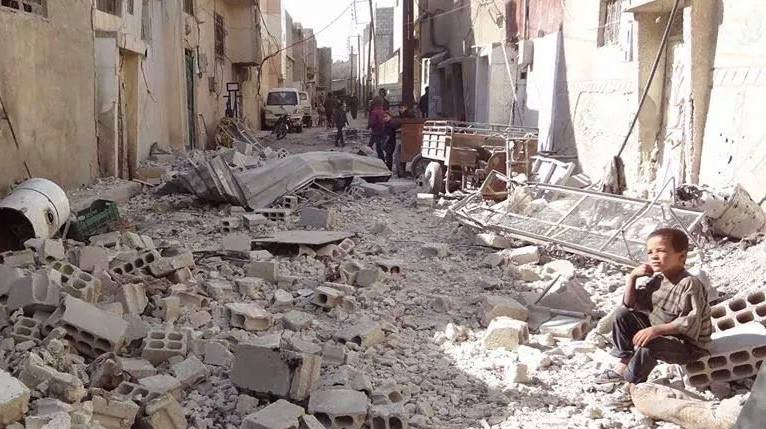
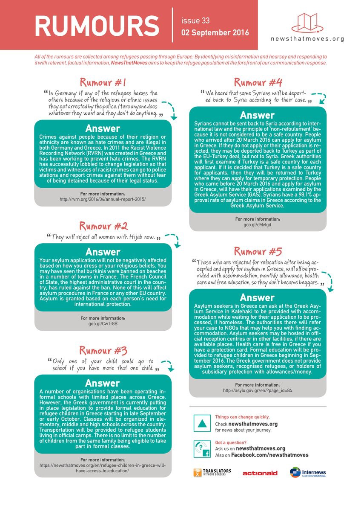

### AYS NEWS DIGEST 09\.09\.2016 — Xenophobic sentiments in Greece threaten refugees’ well\-being\.
#### A Nazi group has claimed responsibility for an arson attack in a Greek squat in Athens populated by refugees\. They threaten more violence until “Al\-Nusra leaves,” pejoratively referring to the Syrian refugees who were forced to flee their country by violence unleashed by the Assad regime as well as groups such as ISIS and Al\-Nusra\. Meanwhile, as it is time to go back to school, parents have staged a sit\-in in an elementary school in protest of co\-education between their children and the children of refugees\. These events signal the importance of combating the racism which targets already vulnerable refugees\.

A boy sits surrounded by rubble in the city of Aleppo\.
#### Syria
### Another round of peace talks brings John Kerry to Geneva\.

The US secretary of state is to meet in Geneva with his Russian counterpart at a time when American foreign policy in Syria is increasingly lining up with that of Russia\. The secretary’s spokesman said in a statement only a few hours prior to his departure said that issues made it “ not worth his while to go have a meeting,” but this contradiction shows that the two sides at this point have more in common than setting them apart\. Formally, the Russians support the Assad regime and its allies as America backs various opposition groups as well as the Kurdish YPG, but in practice the two sides are in cooperation in the fight against ISIS, which in reality means the undertaking by Russian and regime forces of attacks against other opposition groups\.

A peace deal would presumably begin with a ceasefire in the besieged city of Aleppo, which has been one of the main points of attention in Syria as a result of the particularly brutal conditions faced by remaining civilian residents in the rebel\-controlled eastern half\. The US Syrian envoy, in a [letter](http://www.al-monitor.com/pulse/files/live/sites/almonitor/files/documents/ratney_letter_syria_rebels_us_russia_deal.pdf) published by Al\-Monitor News, called for a Russian prohibition on Syrian regime planes flying, in exchange for coordination to weaken Al\-Qaeda affiliated groups\.
### Charity organizations pen letter criticizing regime influence over the UN\.

73 organizations have sent an open letter to the UN, accusing the organization and it’s agencies of being under the sway of the Syrian regime\. “We have little hope that the UN\-coordinated humanitarian response might operate independently of the political priorities of the Syrian government,” the letter said, and concluded by calling for an independent agency to oversee charity efforts\. The writers say that the Assad regime has been diverting aid from areas outside of its control as a way to mount pressure\. In protest, several organizations said that they will be suspending an information\-sharing program with the agency\. [Investigative work](https://www.theguardian.com/world/2016/aug/29/un-pays-tens-of-millions-to-assad-regime-syria-aid-programme-contracts) by the Guardian has also shown that money has gone to a charity established by Asma al\-Assad, the wife of dictator Bashar al\-Assad\.
### Karam Foundation is calling for donations\!

The organization is currently receiving donations to help the resettlement of people from Daraya, who were forcibly displaced by regime forces following four years of a brutal siege\. You may find the fundraising page [here](https://give.karamfoundation.org/fundraise?fcid=754983) \.
#### Turkey
### EU to fund debit cards for 3 million refugees in Turkey\.

[News That Moves](https://newsthatmoves.org/en/europe-to-fund-refugee-debit-cards/) reported that the initiative will be used to cover expenses such as food, housing, and schooling\. Assuming that it is properly implemented, the move will provide much needed aid for refugees living in Turkey, where conditions are notoriously difficult, a big contributor to the refugee crisis as we know it today\. Refugees in Turkey often live on the margins of society, having to work illegally \(assuming they could find work at all\) and as a result being extremely exploited\. Many refugee children in Turkey have also been unable to access schooling for years\. Turkey has for a very long time refused to call refugees from Syria by the title, referring to them instead as “guests”, as a way of sidestepping responsibilities that they are obligated to perform under international law\.
#### Greece
### A fascist nationalist group has claimed responsibility for arson attack on a refugee squat\.

The group, previously unknown, staged an attack last week on a squat in downtown Athens in Exarchia after gaining access to the facility by posing as supporters\. The group threatened to undertake further attacks\. Please be on the lookout\!
### Parents protest coeducation with refugee children\. Future of schooling on islands remains unclear\.

As refugee children are to start attending school on Monday, the parents of students in Palaiokastro have staged a protest and occupied a school to voice their racist disapproval of refugee children mingling with Greek children\. This event should be seen as part of the larger picture of anti\-refugee sentiments prevalent in many European countries\. Such sentiments, in addition hindering hinder the integration of refugees into society, pose a very real threat at a time when the far\-right is experiencing a resurgence all over Europe\. Sentiments such as these must be exposed for what they are: racism\.

On the topic of schooling, News That Moves has reported that there are currently no plans in place for schooling, given that refugees are expected to be relocated to the mainland for their interviews\. This means that education for children, many of whom are years behind on their education as it is, will be further delayed\.
### Unaccompanied minors continue to be held in deplorable conditions\.

We have reported before on the difficulties faced by unaccompanied minors in Greece\. Today we learn that the situation has not changed since then\. Human Rights Watch released a [report](https://www.hrw.org/news/2016/09/08/greece-migrant-children-held-deplorable-conditions) today after conducting interviews with 42 such minors, detailing the cramped and dirty cells that children are forced into\. According to the law, unaccompanied minors should be separated from the general refugee population for their own safety\. However, the conditions that they find themselves in are sometimes even worse than that in the camps\. The minors were sometimes even held in cells together with adults, defeating the entire purpose\. Greek authorities are already well aware of the issues, but supposedly do not have the means to put the children in better conditions\. Greek authorities have registered 3,300 unaccompanied minors this year through August\. Only 47 of them have been relocated thus far, most to Finland\.
### IOM offers enlightening statistics on relocated refugees as Greece fights against pushbacks\.

In a [report](http://www.iom.int/news/eu-relocation-asylum-seekers-gathers-pace-222-are-relocated-week) released today, the IOM reveals that 183 asylum seekers were relocated from Greece to Germany and Ireland this week\. Over the last three months, an average of 865 people per month were relocated, a marked increase over the average of 233 per month in the 8 months prior\. Furthermore, 1,356 are scheduled to be relocated in September, the largest total since the relocation program came into effect\. A total of 4,742 refugees have thus far been relocated under this program\.

These statistics come at a time when Greece is [fighting against the](http://www.ekathimerini.com/211884/article/ekathimerini/news/greece-rejects-return-of-eu-rule-on-reverse-migration-flow) reinstitution of the Dublin Regulation which would allow countries to deport refugees to Greece\.
### 13 men were deported from Frontex to Turkey today\.

Even as the EU\-Turkey deal is collapsing, deportations continue\. The men in question were from Pakistan, Iraq, Egypt, Morocco, Yemen, Algeria, Palestine, and Lebanon\. They are to be resettled in a camp in Turkey\. Yesterday 5 Syrians were also deported to Turkey\. All of the people in question reportedly waived their right to asylum\.
### Rumors continue to circulate\. Here is a handy answer sheet to common claims\.

People living in precarious circumstances are prone to rumors, some instilling hope, others signalling worse things to come\. Rumors have resulted in misunderstandings which were quite dangerous, i\.e\. the rumors circulated in Idomeni pertaining to the opening of the border with Macedonia\. News That Moves has fortunately made a convenient guide to dispelling some of the common myths currently in circulation\. This guide should prove useful to volunteers\.

### 32 people were rescued from a boat near Frontex\. They are being transferred to Moria Camp\.

[Greek government figures](http://media.gov.gr/index.php/%CF%85%CF%80%CE%B7%CF%81%CE%B5%CF%83%CE%B9%CE%B5%CF%83/%CF%80%CF%81%CE%BF%CF%83%CF%86%CF%85%CE%B3%CE%B9%CE%BA%CF%8C-%CE%B6%CE%AE%CF%84%CE%B7%CE%BC%CE%B1/summary-statement-of-refugee-flows-09-09-2016) report that a total of 172 have arrived in addition to this number, 112 to Chios, 46 to Kos, and 14 to Megisti\.
### Greek government agency reports that 7,800 refugees are unaccounted for\.

The revelation may account for the unexpected and often unpredictable fluctuations in refugee population according to figures provided by the Greek government\. Refugees have also been unexpectedly disappearing from their camps\. The refugees’ unaccounted for locations pose difficulties and worries, given the precarity of their situation and the violent tide of racist sentiments\.
### Prayer areas for Eid have been announced\.

Prayers in Athens will be conducted in the Peace and Friendship Stadium \(SEF\) in Neo Faliro and the Olympic Stadium \(OAKA\) in Maroussi\. Refugees in other parts of the country should inquire with local officials to learn the location in their area\.
### A protest calling for open borders will take place tomorrow in Thessaloniki and Kamara\.
#### Serbia
### The Serbian border police has stopped over 1,000 refugees this week\.

According to [Ansa](http://www.ansa.it/sito/notizie/mondo/europa/2016/09/08/serbia-fermati-migliaia-di-clandestini_2ccf46dd-b100-47ea-b6de-7eda8f2210d4.html) , 1,044 refugees were stopped crossing over from Bulgaria and Macedonia\. They also report that from July 22 to today, 6,470 refugees were intercepted while crossing over, of whom 5,634 were rejected while the other 836 were accommodated in reception centers in Serbia\. Serbia used to be an important crossing point for refugees who were trying to reach Germany while the Balkan Route was still open, and many who travel northward using the services of smugglers continue to pass through the country\.
#### Germany
### Leaked list of CSU demands sparks outrage\.

The party, a sister party to Merkel’s CDU, have issued a number of demands to be discussed at a meeting, including an upper limit on the number of refugees accepted and the controversial “burqa ban”, which continues to be proposed in spite of a distinct lack of burqa\-wearing women in Germany\. “Germany must remain Germany,” the list of demands reads\. The CSU would also like to see the repatriation of refugees to their countries of origin as soon as humanly possible\. German politics has shifted rightwards after the far\-right AfD became the second largest party in the parliament\.
#### Italy
### Thousands of refugee children have disappeared\.

According to a [report by Oxfam](https://www.oxfam.org/en/research/children-alone-pulled-sea-fallen-wayside) , 28 refugee children disappear in Italy each day\. There have been 5,222 disappearances in the last 6 months\. Many of these are believed to have run away in hope of reaching countries where their relatives reside\. The trend is nonetheless disturbing, as falling between the cracks means an increased chance of being exploited\. There have been reports of refugee minors becoming victims of sex trafficking, for instance\. Oxfam says that many minors are spurned to leave by the poor conditions in the reception centers, a situation similar to that in Greece\. The problem could be mitigated by investing in safer and more comfortable lodgings, where residents can live in dignity\.

_Converted [Medium Post](https://areyousyrious.medium.com/ays-news-digest-09-09-2016-c985156bf49e) by [ZMediumToMarkdown](https://github.com/ZhgChgLi/ZMediumToMarkdown)._
