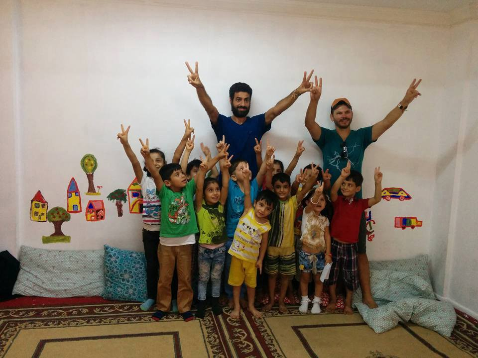
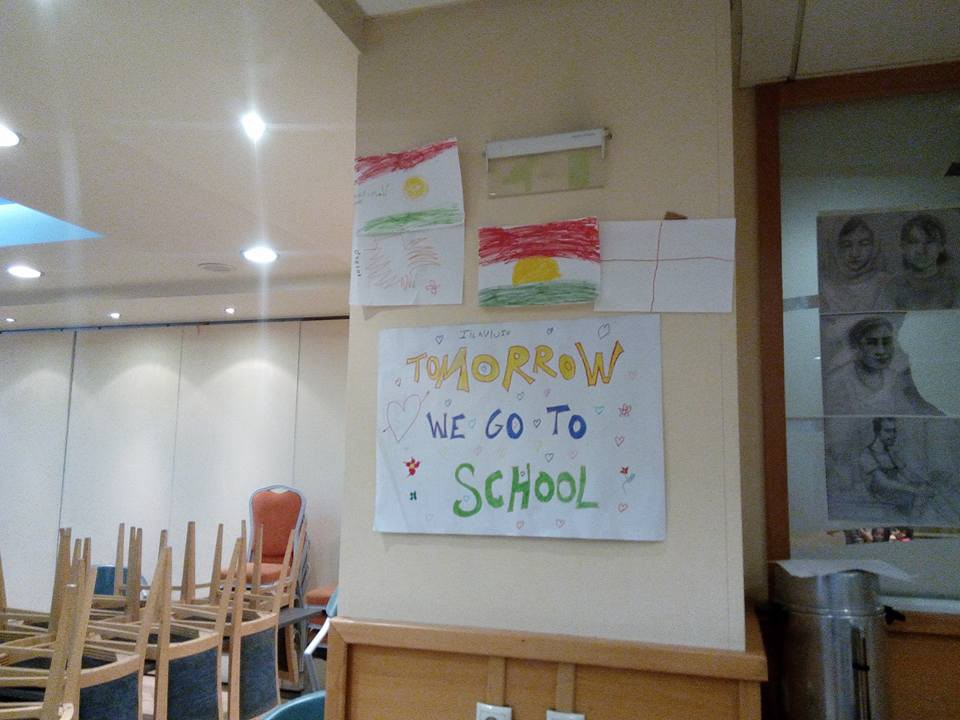

### **AYS DAILY DIGEST 11/9: Bulgarian media is inciting hate against refugees**

_Siege of Aleppo is taking more civilian lives while people are hoping to leave the city\. Over 150 people arrived in Greece in last 24 hours while over 2300 were rescued during the weekend in the Mediterranean\. Hostility toward refugees in Bulgaria increases even more, and it is encouraged by part of the media and from the government\. The UK agreed to take 20,000 vulnerable Syrians from Lebanon and Jordan\._

![“This is a testament to one family trapped in the anonymous column previously pictured\. As a European, I’ve always seen borders keeping people out\. A man from Aleppo described the borders as ‘penning his family in hell’\. He has succeeded in reaching Greece, but living in a derelict hospital with no right to work, is not the life this professional pharmacist hoped to build\. He can’t bring his family out the war\-torn wasteland of Aleppo, so I sketched them from photographs he showed me”, [September 2016 by Ella Baron](https://www.facebook.com/artagainstproject/photos/a.639651369417634.1073741828.639605726088865/1118356528213780/?type=3&theater) \.](assets/197f4b02c995/1*THRpAfyCKXKkaRYqh6_0IA.jpeg)

“This is a testament to one family trapped in the anonymous column previously pictured\. As a European, I’ve always seen borders keeping people out\. A man from Aleppo described the borders as ‘penning his family in hell’\. He has succeeded in reaching Greece, but living in a derelict hospital with no right to work, is not the life this professional pharmacist hoped to build\. He can’t bring his family out the war\-torn wasteland of Aleppo, so I sketched them from photographs he showed me”, [September 2016 by Ella Baron](https://www.facebook.com/artagainstproject/photos/a.639651369417634.1073741828.639605726088865/1118356528213780/?type=3&theater) \.
### Eid Mubarak\!

On September 12th, Muslims around the world will celebrate Eid el Adha, the biggest religious holiday in a year\. We wish to all who are celebrating a happy and blessed Eid\. All the people have a right to celebrate their holidays in peace and happiness, in their homes with families and friends, and too many do not have that possibility\.

[The Guardian](https://www.theguardian.com/world/2016/sep/11/syrian-people-of-aleppo-prepare-for-eid-under-siege) published a story about Eid preparation in this city\. The article quotes resident Abo Aljood, saying that people lost too much to be happy for the holiday\.

> “If you ask anyone who lives in Aleppo if they’re happy, or if they’re capable of being happy and forgetting, most of them will tell you my son is dead and won’t be with me this Eid or my wife is gone, and those who did not lose anyone are living in terror and you cannot be happy when you’re living in terror\.” 

Peace, love and solidarity, it is all we need\.
### Syria
### Aleppo is still burning

No sign of peace in this country, yet\. In Aleppo, the city under the siege, the situation aggravated further on over the last couple of weeks\. [The last report](http://www.reachresourcecentre.info/system/files/resource-documents/syr_situation_overview_eastern_aleppo_city_6_september_2016_0.pdf) by [IMPACT, a Geneva\-based think\-and\-do\-tank](https://www.facebook.com/IMPACT.init/posts/1122306907826178) , concerns period from mid august until the beginning of September\.

Civilians and infrastructure are continuously under attack, and people have less and less possibility to move around the city\. According to some investigation, if it were possible, on average up to 50% of the population would leave eastern Aleppo within the next two weeks\.

> “In all neighborhoods, the escalation of conflict and insecurity in Aleppo City was the most commonly reported reason for wanting to leave\. Other less commonly reported push factors include the loss of income; and the opening of safe routes to leave\.” 

### Turkey
#### Help kids to go to school

A [volunteers from Izmir \(ReVi\)](https://www.facebook.com/photo.php?fbid=1091798774243382&set=gm.1082750498499437&type=3&theater) are working with refugee children who are forced to work in order to support their families, some of them are no more than 10\-years\-old\.

Kids are working 12 hours a day, six days a week, for $35 to $70 per week\. One of their volunteers, Ellen Orr, a teacher from the US, got her 4th grade at St\. James Day School in Texarkana, Texas, to run a campaign to sponsor a child to go back to school\. The students have committed to $140 USD monthly to get one child back to school\. Two more kids will be sponsored thanks to another volunteer, but more is needed\.

> “At ReVi, we follow these families closely, so we’ll be able to monitor their attendance, grades, and help if they need some extra tutoring, etc\. It won’t be easy, as many of them haven’t been in school in 3 or 5 years\.” 

If you can, please help this wonderful project\. Info about sponsorship can be found [here](http://supportrevi.org/worktoschool) \.

If you have any other ideas or questions on how you can help, please contact [Felipe Coimbra](https://www.facebook.com/twtfelipe) \.

Photo by ReVi\.
### Italy

2300 **people rescued this weekend in the sea**

People were on 17 rubber boats and one fisher boat\. A Spanish, Irish and four ships of NGOs took part in the rescue operations\.
### Greece

New arrivals in Greece even today\. Only at Chios, 45 people arrived this morning\. The overall number of new arrivals in Greece in the last 24 hours is 165\.

Officially, there are 59\.778 refugees in Greece today\.

The situation at the islands remains very difficult\. Camps and other facilities are overcrowded, and people who arrive are often sent to Athens, where they end up in the streets\. Help is offered mostly by volunteers\.

We have received information about huge reluctance among people of Athens to accept refugees in their apartments, even if they have insurance that rent will be paid on time\. At the same time, Athens is becoming overcrowded and it is very hard to find accommodation for all the people who are coming\.

According to official sources, around 3000 people have arrived in Greece over the past month alone\. The government plans to move refugees to the mainland, but the detailed plan is not out in public, yet\.

> IMPORTANT\! 

> [Updated Q & A from the Ministry of Interior and Administrative Reform](http://asylo.gov.gr/en/wp-content/uploads/2016/09/Qandanswers_ENG_Sep1_final.pdf) on pre\-registration, full registration, transportation, procedural issues and some general information 

#### Triumph of solidarity

The municipal of Trikala, central Greece, [thanked Syrian refugees](http://www.ekathimerini.com/211937/article/ekathimerini/news/trikala-thanks-refugees-for-help-in-distributing-water-to-flooded-villages) for their help in distributing drinking water to flooded villages in the area\.

People in villages of Fotada and Kaloneri were cut off from the main water supply after a flood on Saturday\. Refugees joined volunteers, municipal workers, and crews, to distribute bottles of water to homes that are cut off\.

> “From the horrors of war to volunteering their services to the flooded villages of the Municipality of Trikala\. From bombs and bloodshed, to devastated livelihoods\. Volunteerism, the act of giving and concern for our fellow man triumphed on Saturday\.” 

Closed borders are very lucrative business\. A volunteer [Michael Soehner](https://www.facebook.com/MichaelSoehner?hc_ref=NEWSFEED) found out about new smuggler rates:

to Northern Europe
€4\.000 Patras — Italy by ferry in a truck \(the rate is higher, because of the 100% success rate\)
€2\.800 Athens by plane
€2\.200 Athens the land route
from Chios to Northern Europe
by car
€1\.500 for adults
€800 for teenagers
€750 for children
by plane to Northern Europe
€2\.800 for adults
€2\.000 for teenagers
€1\.400 for children
€ 800 from Chios to Athens by ferry \(many try illegally, under truck\)
€14,000 plane to Canada
€8,000 fake Passport
€600 from Çeşme, Turkey — Chios, Greece; just 5 miles/ 8km
#### First school day in City Plaza

Tomorrow, a school year starts for children in City Plaza in Athens\.

> We wish you a great first day in school\! 

Photo by Χώρος Στέγασης Προσφύγων City Plaza

 \. By Therough refugee eyes\.](assets/197f4b02c995/1*4Zm8-2YKPpq0rvj4O4Gy6A.jpeg)

“I hope to go to school\.“ That is what Razan Issa said in her simple drawing\. Razan Issa is a refugee from Damascus, 11 years old she just stayed in Greece 6 months then she was trying to shout and tell the world about her suffering and refugees sufferings by her drawing she has an amazing mind and ideas and always trying to do it by simple drawing\. Share her story and support her at her FB page [Razan\. The road to Europe a dream](https://www.facebook.com/RazanThe-road-to-Europe-a-dream-167376783700603/) \. By Therough refugee eyes\.
#### _Free kids show for Eid_

_Eid celebration should last for three days\. NGOs in Thessaloniki who are interested in a free kids show in Arabic, please contact us, [Humanity Crew](https://twitter.com/HumanityCrew) \._
#### Calls for help

The increase in new arrivals brings the increase in calls for volunteers all over Greece, especially on islands\. In the island of [Samos volunteers](http://react-text: 92 https://www.facebook.com/samosvolunteers/ /react-text) \(especially long\-term\) are needed asap\.

They also [need donations](https://samosvolunteers.wordpress.com/) of man’s clothes and shoes for adults: school items and financial means\.

Humanitarian Support Agency is looking for a Deputy Head of Operations on a volunteer basis for its site of Lesbos/Kara Tepe \(min\. 3 months\), starting ASAP\.

HSA offers free accommodation and food, phone and Internet forfeit, as well as a monthly allowance\.

The deputy Head of Ops will be ensuring that:
\- all aspects of daily operations of HSA run effectively and efficiently
\- appropriate standards of conduct are established and complied with\. 
\- the strategic objectives, as well as the values of HSA, are put into practice\.

Profile:
\- Minimum age: 28 y\.o\.
\- Good knowledge of English
\- Education: Advanced degree in a field of study that offers a comprehensive view of community organization and/or social sciences \(e\.g\. humanitarian affairs, development studies, political science, or a related field\), or an equivalent combination of camp management and humanitarian experience in a related area\.
Demonstrated field experience working in camps or other communal settings\.

More info and application: [fred@humanitarian\-support\-agency\.org](mailto:fred@humanitarian-support-agency.org)

Help is needed for [No Border Kitchen at Lesvos](https://noborderkitchenlesvos.noblogs.org/vii-support/) \. They are cooking 650 meals daily\. Last month they had a total of about 5800 Euro expenses only for cooking, more than 1800 meals\.

With 31cents per meal, they are trying to keep the expenses as low as possible\. But, they need money for a generator and for fuel and demo material\.

Every donation of any kind is welcome\!

[Amurtel Athens project](https://www.facebook.com/AmurtelHellasforRefugeeMothersandBabies/posts/320061565015726?hc_location=ufi) is looking for volunteers for the new Center that will be open on September 15th\. Local volunteers need to commit at least one day or half a day on a regular weekly basis and the other at least two weeks\.

Midwives, doulas, and lactation specialists are very welcome, but there are also general things to be done like working in the reception area, helping with child care and baby bathing, and assisting the kitchen flow for preparing and serving food for the babies and toddlers\.

Send them a message if you can help\.

The new center is located near Victoria Square\.

It is estimated that one out of 10 refugees are pregnant\. Amurtel, helps pregnant and breastfeeding moms and infants, who are the most vulnerable refugee population\.
### Bulgaria
#### Stronger border control

Even though there are many people who are arriving in Bulgaria every day, the government has said there is no plan to set up new accommodation centers\.

Nevertheless, FRONTEX will soon bring new equipment and dogs, while German police are sending vehicles and thermal surveillance cameras, public broadcaster BNR reports\.

Official sources are reporting that about 20,000 people passed through the Sofia Busmantsi Detention Centre\. Currently, 1,631 people is accommodated there, even though the capacity of the center is 940\. Additionally, 395 persons registered outside the Detention Centre are living at their own\. Most of the people arriving in Bulgaria now are from Afghanistan, Pakistan, and Iraq, but sometimes, entire Syrian families arrive\.

The Busmantsi Detention center is near Sofia and is officially referred to as a Special Home for Temporary Placement of Foreigners with the Migration Directorate of the Ministry of the Interior\.

According to [the weekly statistics of the Interior Ministry](http://www.novinite.com/articles/176202/Sofia+Busmantsi+Detention+Centre+Overcrowded#sthash.2OkkyWT6.dpuf) , until September 9, 13,005 migrants have entered the territory of Bulgaria since the beginning of 2016\. In the period September 2–8 alone, another 664 people has crossed over into Bulgaria\. 36 foreigners have been taken out of the country in the last week\.
#### Hate speech against refugees

Media in Bulgaria are using with fear mongering against refugees\. One of the examples is the report about people from Afghanistan who are blamed for a fire that broke out on Tuesday in the area of Gramatikovo, near the Bulgarian\-Turkish border\. Police detained these seven people\.

At the same time, public broadcaster BNT, blamed a group, of Syrians, who were also arrested\. Many right wing groups are doing the same\. On Sunday, the [Patriotic Front \(PF\) and the nationalistic Ataka, called](http://www.novinite.com/articles/176124/Bulgarian+Nationalists+Call+for+Immediate+Closure+of+Refugee+Centres#sthash.Pl690ocr.dpuf) for the immediate closure of refugee centers in Bulgaria, and the return of their inhabitants to Turkey or their countries of origin\.

Among the organizers of the protest of the right wing is the member of parliament Angel Dzhambazki who claims that refugees are “threat to national security and Bulgarian society”\.

At the protest, they also asked for the introduction of curfew, ban on melee weapons and heightened police presence to ensure order and safety in the town\.
### France
#### Food for children and pregnant women

[Calais Food](https://www.facebook.com/calaiskitchens/) is starting a project focused on providing nutritious food to pregnant women and young children\.

Please help them get a regular supply of fresh fruit and/or money to support the initiative\.
### Germany
#### German politicians helped to a child to reunite with his father

Diether Dehm , a member of parliament from The Left \(Die Linke\) party helpped an African refugee from Italy to some to Germany where his father lives\. [Speaking for the news agency DPA](http://en.europeonline-magazine.eu/hard-left-politician-admits-smuggling-refugee-into-germany_483788.html) , he did not want to give more details in order to protect the young refugee\.

Apparently, Dehm had taken the boy to his holiday home on Lake Maggiore for a few days before bringing him by car through Switzerland to Germany, where he handed the boy over to refugee reception workers\.

The young man, who wanted to be reunited with his father, was not registered by immigration officials at the border, Dehm told the Bild\.

Dehm commented: “I am at ease with myself\.”
#### Deal about voluntary return with Afghanistan

Germany is about to finish negotiations with Afghanistan about a return of refugees\. T [he details have been discussed in Berlin](http://www.handelsblatt.com/politik/deutschland/magazinbericht-fluechtlingsabkommen-mit-afghanistan-offenbar-kurz-vor-abschluss/14527250.html) \. Afghanistan will take back refugees on the voluntarily basis and those who are deported\.
### UK
#### New program for vulnerable Syrians

The UK has agreed to take 20,000 vulnerable Syrians from Lebanon and Jordan as part of a resettlement plan\. This is done through UNHCR\.

> If you are vulnerable \(severe health problems etc\) and living in Jordan or Lebanon as a refugee, you must register with UNHCR and request to be resettled in the UK under the VPR scheme\. 

> Be patient and persistent because your claim will take awhile to process, but when it is approved, it will happen very quickly and you will be flown to the UK\. You will be met at the airport and all medical and housing will be provided for you and you will be given support while you settle in\. 

For more details, see [here](https://www.gov.uk/government/publications/syrian-vulnerable-person-resettlement-programme-fact-sheet) \.

_Converted [Medium Post](https://areyousyrious.medium.com/ays-daily-digest-11-9-bulgarian-media-are-using-hate-speech-against-refugees-197f4b02c995) by [ZMediumToMarkdown](https://github.com/ZhgChgLi/ZMediumToMarkdown)._
