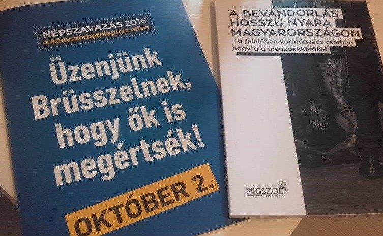
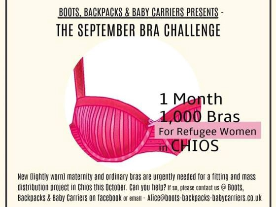

### AYS digest 10/9: Compelled by the reports on poor conditions and slow progress, EU raises the stakes in Greece
#### With the “approval” of the Syrian regime, the US and Russia set diplomatic foundation for a possible ceasefire in Syria, hours afterwards dozens lose their lives in airstrikes\. As Greek islands still struggle with the overcapacity, finally plans to close some camps and move people to mainland\. Faced with the fact that tens of thousands of people might enter winter months in seriously poor conditions in camps due to the ineffective and slow system of relocation, the EU announces extra funding to help front line member states improve refugees’ conditions\. ‘Disobedient’ Hungarians refuse to give in to moral austerity and call for solidarity\.

](assets/2c3cfa8d8179/1*chsIGWRIT2VRw1tt2zI2LQ.jpeg)

“I saw a lot of tears today, a part of a family will leave and the rest will continue waiting\. 
 We are together, sharing the suffering, the happiness and sharing all our feelings\. Refugees still moving from one spot to another\. Refugees still suffering, but one day we will be together in our country, inshallah\.” Photo: [Through Refugee Eyes](https://www.facebook.com/throughrefugeeeyes/?fref=ts)
#### SYRIA
### **Skepticism over ceasefire rises**

The nationwide “cessation of hostilities” will begin at sundown on September 12, when Muslims observe the religious holiday Eid al\-Adha — this common agreement sums up the joint [announcement](http://m.dw.com/en/us-russia-announce-syria-ceasefire-plan/a-19541407) by the US Secretary of State and Russian Foreign Minister who met in Geneva\. Under the new deal, both sides — Russian\-backed government forces and rebel groups supported by the U\.S\. and Gulf states, — are to halt fighting as a confidence building measure\. Immediate implementation of such an agreement is a key initial impulse for the possible negotiations to soon take hold, they agreed, but just hours later the [airstrikes struck Idlib](http://www.middleeasteye.net/news/idlib-market-hit-deadly-air-raid-hours-after-syria-ceasefire-plan-agreed-228090973) , killing at least 40 civilians, raising doubts that this ceasefire would hold\.
#### IRAQ

At least forty people were killed and a further 60 were wounded following twin explosions in downtown Baghdad\. Last Tuesday, IS carried out a similar attack and, [reportedly](http://m.dw.com/en/midnight-bombings-kill-40-injure-60-outside-baghdad-shopping-mall/a-19541663) , the officials have warned that as IS fighters lost ground in Iraq and Syria, they were likely to carry out many smaller\-scale terror attacks on civilians\.
#### GREECE
### Closing of camps on Chios announced

Refugees staying at the Greek island of Chios, one of the prominent Greek islands that only today counted together 52 new arrivals, those who had submitted their papers for asylum would very soon be moved to the mainland, Greek Migration Policy Minister Yiannis Mouzalas said this Friday, after the meeting with the officials on Chios\. The expected result of that is closing of the two camps on the island and a reduction of numbers at the notorious VIAL facility, Ekathimerini [reports](http://www.ekathimerini.com/211911/article/ekathimerini/news/move-to-ease-overcrowding-at-migrant-camps) \.
### EU agrees to raise funds to help improve refugees’ conditions

Thousands of refugee children are considered missing, but for many of them the whereabouts are well known, as they are among those who are held in detention centres across Greece\. The commonly poor circumstances in those camps are well known by now and the appalling [story from Amygdaleza](https://www.theguardian.com/world/2016/sep/10/child-refugees-greece-camps?CMP=share_btn_tw) only confirms the previous claims\. Following the negative report, embarrassing for both Greece and the EU, on the treatment of unaccompanied children detained in Greece that the HRW [released](https://www.hrw.org/report/2016/09/08/why-are-you-keeping-me-here/unaccompanied-children-detained-greece) two days ago, the European Commission [announced](http://europa.eu/rapid/press-release_IP-16-2986_en.htm) 115 million euros in extra funding today to help improve conditions for refugees in Greece\. This joint declaration signed by France, Italy, Spain, Portugal, Cyprus, Malta and host Greece said the European Union should double funding for strategic investment and for additional European experts to help front\-line states tackle migration The four priorities they stress out are:

> 1\. Improvement of existing shelters and construction of new ones in the camp facilities ahead of the upcoming winter\. At the same time improvement of sanitation conditions and provision of other infrastructure such as heating\. 

> 2\. Delivery of direct assistance to refugees through cash/voucher schemes\. This will help refugees to cover the basic needs of their families, such as food, in a dignified manner and at the same time support the local economy\. 

> 3\. Enable refugee children to access education 

> 4\. Help unaccompanied minors who are especially vulnerable and need special care and protection\. 

Overall, the European Union is reaching over €1 billion of support to Greece in tackling current migration challenges\.

Judging by the alternative travel routes many refugees have been led to take \(due to a number of dangerous elements in their stay at the army camps in Greece and in spite of the futile tries to speed up the processes of reunification and relocation that are still moving at a glacial pace\), the sum that the criminal milieu collects consistently and with very few interruptions could soon be rising up to the one the EC boasts with\.
#### HUNGARY
### Indignation

As the situation concerning the refugees in Hungary is getting more and more serious, dangerous and uncertain for many, the members of the Migrant Solidarity Group of Hungary are extending their invitation to join a [protest](http://freetheroszke11.weebly.com/) that will be held this month in solidarity with the Roszke11, but also as a gesture to call for a boycott of the upcoming referendum imposed by the government\. The event will take place on September 22 in [Budapest](https://www.facebook.com/events/1698455760479969/) and also the following day, September 23, in [Szeged](https://www.facebook.com/events/1733169590233449/) , in front of the court where Ahmed H\. of the Roszke11 will have a trial\.

Along with wallpapering the country with xenophobic billboards, the Hungarian government’s “We must stop Brussels” booklet for Hungary’s includes a warning about the so called “no go zones” in Europe — “In those European cities, where immigrants live in great numbers, several hundred “no\-go” zones exist”, the booklet reveals\.

The Migrant Solidarity Group of Hungary published a counter propaganda booklet telling about all the human rights violations stemming from their country’s political decisions regarding refugees
#### SERBIA

In the wake of recent changes in the number of refugees, but also in political atmosphere, the future of refugees in Serbia seems more and more uncertain to them\. We have received a number of refugees’ claims about the poor conditions in the camps and about daily evening listing of everyone present at the camp, thus limiting the refugees’ already limited freedom of movement\. As usual, the biggest support comes from the volunteers who — even though in many cases they don’t know the answer to the ever changing legal aspects — try to support, inform and help in all places where refugees are present\.
#### GERMANY

Bavaria’s conservatives have agreed on a list of changes they want made to the government’s refugee policy\. The CSU executive [agreed](http://m.dw.com/en/bavarias-csu-conservatives-urge-changes-to-refugee-policy/a-19541640) on an upper limit of 200,000 refugees per year as part of its catalogue of demands\. According to [Deutsche Welle,](http://m.dw.com/en/csu-comes-under-fire-for-catalogue-of-inhumanity-over-refugee-policy/a-19538184) their drastic tightening of the refugee and immigration policy which has drawn widespread criticism from across Germany’s political parties\. However, after criticism from the CDU, the CSU executive did agree to relent on some demands and the final conclusion to this debate is possible already after his meeting with the German chancellor this Sunday\. Hopefully, afterwards questions and doubts regarding the [talks](https://www.rt.com/news/358905-germany-afghan-refugees-karzai/) about the possible deportation of a certain number of Afghans from Germany would be explained as well\.
#### UK

Boots, backpacks & baby carriers — Aid for refugees in Chios is sending 1000 bras and knickers to the women living in the camps in Chios\. They would also like to distribute washable/reusable breast pads with the nursing and maternity bras\. They anticipate that they will need approximately 150 pairs \(so each lady can be given 2 pairs\) and in order to succeed, they ask for help and [support](https://www.youcaring.com/chios-refugee-aid-541259) from the women in the UK\.

_Converted [Medium Post](https://areyousyrious.medium.com/ays-digest-10-9-compelled-by-the-reports-on-poor-conditions-and-slow-progress-eu-raises-stakes-in-2c3cfa8d8179) by [ZMediumToMarkdown](https://github.com/ZhgChgLi/ZMediumToMarkdown)._
