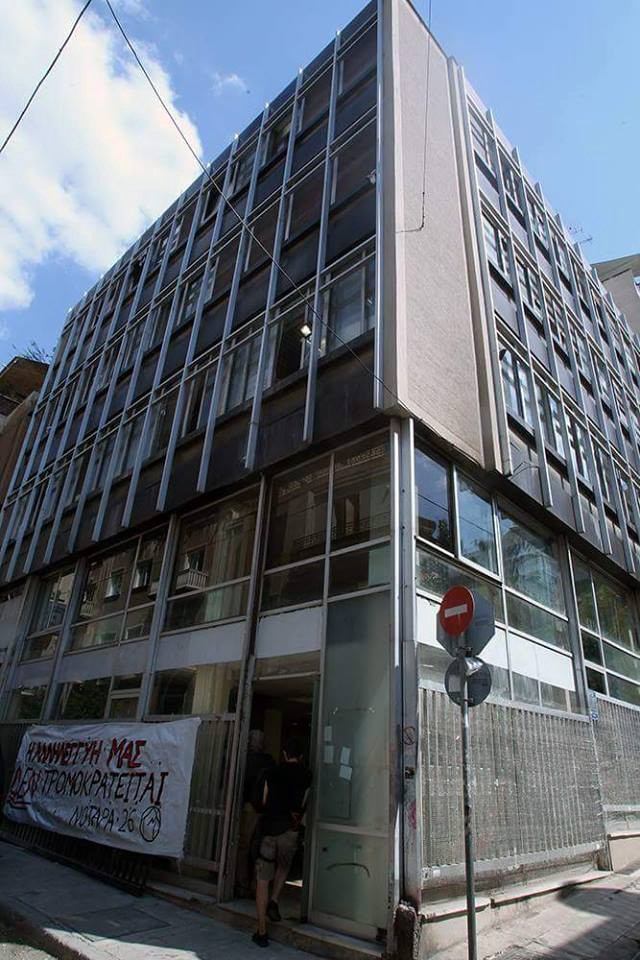
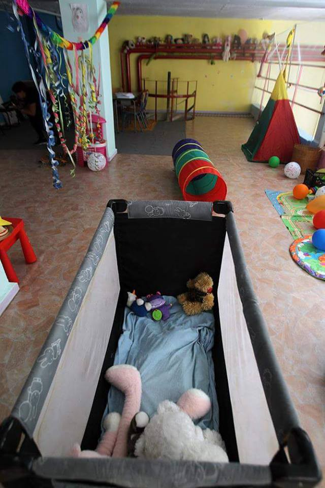

### AYS News Digest 14/9: Refugee squat Notara 26 is open again

> Anti\-refugee riots on Chios\. Calls for medical professionals, volunteers and donations\. Volunteers working hard on providing refugees with living spaces and playgrounds\. Can Europe do more? It definitelly can, here is how\. 

](assets/5d8c700a38c2/1*KcBBYtNkYBByG7i_Qj7K6A.jpeg)

Credits: [**Refugee Accommodation and Solidarity Space City Plaza**](https://www.facebook.com/sol2refugeesen/)
#### Turkey
### Medical Professionals WANTED\!

Medical Volunteers International \(MedVint\) is calling for voluntary medical doctors from October 7\. and nurses from from October 28\. 2016 for their operation in Western Turkey\. The minimum stay should be 1 week\. Please register here: [www\.medvint\.org/volunteering](http://www.medvint.org/volunteering)
#### Greece

**No new arrivals** were reported by the volunteers on Greek islands, but government says **79 new people** \(probably arrived earlier\) were registered on the islands, including 6 on Chios, 48 on Samos, and 25 on Kos\.
### Anti\-refugee riots on Chios

International volunteers have reported a anti\-refugees rally that was held on Chios last night\. According to the people on site, loud explosion was heard around 8pm at the main square before some of the thugs moved to Souda trying to intimidate the refugees\. The crowd was much bigger than the last protest and refugees were frightened\. Riot police had to intervene and the protest caused a massive backlog of traffic in the town\. Some of the volunteers were taken to the police station and held for few hours after standing up against the riot\. There are no reports about arrests of the local thugs yet\. Our fellow volunteers have expressed their frustration following the arrests, saying most of the thugs who are constant presence were never taken in\.
### Volunteers needed in Greece

Volunteers are needed in several OCC projects\. OCC project builds schools and cultural centers for refugees in Greece which, in turn, the OCC operates in partnership with refugees, implementing educational and cultural programs\.

The following are the positions which you may take:
- Cultural Center Coordinator \(long term\)
- Teacher
- Teacher Support
- Field Volunteer to lead or support cultural activities and social work

Internship opportunities are also available\! You can contact them through [Facebook](https://www.facebook.com/OpenCulturalCenter/) or send and email to openculturalcenter@gmail\.com\.

[Amurtel](http://www.amurtel.org) is also looking for volunteers\. Amurtel is a global disaster relief and development organization managed by women, specifically for the needs of women and children\. If you would like to volunteer or work in coalition with Amurtel, please contact them at amurtel\.gr@amurtel\.org\.
### Donations needed in Greece

Amurtel suceeded in finsing a place from which to operate near Victoria Square, the refugee hub of Athens\. They will have an opening event sometime this month to thank you all for your wonderful help, and we will make sure to keep you updated on this one\!

That being said, more donations are needed and would be greatly appreicated\. Here is a list of items refugees have on their wish lists\. Please contact us if you wish to donate any of these items or know where the organisation could buy them at reasonable prices\.
- Infant changing table
- Pillows of all sizes
- Chairs
- Small couch for waiting area
- Small desks or tables
- Folding chairs
- Children’s tables/chairs
- Examining table for prenatal exams
- Foam mats or large cushions for sitting on the floor
- Children’s building blocks
- Life size dolls \(not Barbies or the like\)
- Children’s play kitchen
- Toy trucks, cars, etc\.

### Refugee squat Notara 26 is open again

](assets/5d8c700a38c2/1*KcBBYtNkYBByG7i_Qj7K6A.jpeg)

Credits: [**Refugee Accommodation and Solidarity Space City Plaza**](https://www.facebook.com/sol2refugeesen/)

](assets/5d8c700a38c2/1*NcIvcRf0a5qc4RTXfZhWVA.jpeg)

Credits: [**Refugee Accommodation and Solidarity Space City Plaza**](https://www.facebook.com/sol2refugeesen/)

](assets/5d8c700a38c2/1*7bljC5nbto6NTTjvLpqtVQ.jpeg)

Credits: [**Refugee Accommodation and Solidarity Space City Plaza**](https://www.facebook.com/sol2refugeesen/)

](assets/5d8c700a38c2/1*SV2xfl-hlD8SC_FKyQ94Cg.jpeg)

Credits: [**Refugee Accommodation and Solidarity Space City Plaza**](https://www.facebook.com/sol2refugeesen/)
### The final touches on the kids playground at the Skaramangas Camp

The number one challenge of the day was trying, with varying levels of success, to convince dozens of kids that the playground wasn’t quite open yet and that there was still work to do\!

](assets/5d8c700a38c2/1*GivbEFukvs9VKbPtetc0Zw.jpeg)

Credits: [**David Ang**](https://www.facebook.com/david.ang.790)

](assets/5d8c700a38c2/1*BEiX83lVYYT9TGQwTcKNyA.jpeg)

Credits: [**David Ang**](https://www.facebook.com/david.ang.790)
#### Romania
### Romanian border police says they have detained four Serbs suspected as acting as guides for two dozen Syrian migrants

Police said Wednesday that heat\-detecting equipment helped them spot the migrants and a guide in western Romania late Tuesday\. The group was heading toward the border with Hungary\. Romania is a member of the European Union, but is not in the Schengen area, where there is passport\-free travel\. Border police, working with organized crime prosecutors and local police, say they located a second guide allegedly connected to the group in the city of Timisoara\. The other two were detained near the border crossing to which the migrants were thought to be heading\. Police are questioning the 24 migrants and the guides Wednesday in Timisoara\.
#### Bulgaria
### Viktor Orban says: The future of the European Union will be decided at Bulgaria’s border with Turkey

AP reports the Hungarian and the Bulgarian priministers Viktor Orban and Boiko Borisov emphasized the importance of “defending” the border of Bulgaria with Turkey during a joint inspection of a fence equipped with razor wire at the Bulgarian border village Lesovo\. [Orban urges the EU to provide more money for Bulgaria’s border defense\.](http://www.the-journal.com/article/20160914/AP/309149953/The-Latest:-Hungary:-Bulgaria-Turkey-border-key-to-EU-future)
#### Serbia
### A photo story from the Serbian\-Hungarian border

Available [here](http://www.cnet.com/pictures/europe-refugee-crisis-hungary-serbia-border-fence/16/) \.
#### UK
### Join us for Refugees Welcome Here 2016 event in London

Last September, the image of 3 year old Aylan Kurdi’s body on a Turkish beach horrified the world\. Thereafter, 100,000 people marched in London in to tell the government that they want to welcome refugees in the UK, and to stop the drownings\. Since then, thousands of even more terrified and desperate refugees, including hundreds of children, have lost their lives trying to reach safety in Europe\.

This September, world leaders will meet to discuss the refugee crisis at two crucial summits\. This is the biggest opportunity of 2016 to show the UK government and the world that Britain is ready to welcome more refugees\.

Many British people have responded to the tragedy they see unfolding on their doorstep with extraordinary displays of humanity and generosity\. They’ve been moved to act after seeing many thousands trapped in camps in Greece without running water or baby formula; thousands of people drowning in the Mediterranean as refugees seek increasingly dangerous routes to safety since the closing of borders and the sea route from Turkey; the continuing misery of the camp in Calais; the injustices and inefficiencies of Britain’s own asylum system\.

80% of Britons want the government to give more to help\. Polls now show that 1 in 4 would welcome a refugee in their own home\. By coming to the protest, tell the government that you are ready to help\. The UK should be leading the way and working with other states to give refugees safe, legal routes to asylum, ending the trade in people smuggling\.

Since the referendum campaign and vote, divisive rhetoric has been ever more prevalent from a small but vocal minority\. In the light of this, the need to come together in a spirit of welcome has become even more acute\. Most of the people are keen to welcome refugees, and we need to make it clear to everyone that this is the case\.

Last year, in the week of our demonstration, the government agreed to resettle 20,000 Syrian refugees\. We know that public pressure can make a difference\. So save the day to help refugees on September 17th: Join us and make your voice heard\!
### UK must do more to stop migrants from Libya drowning due to its role in country’s destabilisation

The report from the Foreign Affairs Committee said: “Given its role in the conflict and subsequent destabilisation in Libya, the UK has a particular responsibility in relation to migrants and refugees, an issue which has been exacerbated by the collapse of the Libyan state\.”

The cross\-party group of politicians claimed the UK bears “particular responsibility” for the migration crisis that the Libya intervention sparked and called on ministers to reassess their claim that rescuing people from sea creates a “pull factor” for more to come\.

The demands were included in a damning report on the 2011 Libya campaign, which concluded that it lacked both “accurate intelligence” and a coherent strategy for the aftermath of removing Colonel Gaddafi\.
### A group of 50 leading refugee charities and aid agencies has condemned the government’s record on the refugee crisis

In a letter to the prime minister before two crucial international refugee summits, which Theresa May is due to attend, the charities state that the global response so far has been inadequate\. The charities and aid agencies described the support offered by the UK as “not enough — not even close”\.

The charities call on the UK government to adopt three commitments during next week’s talks in the US, requesting that the UK should take a leading role in “developing a humane, coordinated international response to the millions fleeing crisis”, offer safe passage to more refugees, in part by removing obstacles to family reunification, and commit to providing better support for those refugees who reach the UK so they can rebuild their lives here\.
### Why does resettling a refugee cost £17,000 in the US, but £85,000 in Britain?

No two countries’ circumstances are the same, and comparing them is not always fair or useful\. But if we examine the cost of an individual refugee for each of these countries, we find that a refugee in Germany costs the state about £21,000, while in the US the figure is £17,000 and in Canada it’s £16,000\. In Britain, it is expected to be £85,000\.

It’s surprising that the UK resettlement programme should cost 425% more than what the Canadian government spent on the resettlement of more refugees, 25,000, within a much shorter timeframe of six months\. What accounts for this difference in cost?

The main thing is the method, says Stephen Hale, the head of Refugee Action, one of the main charities involved in the UK’s resettlement scheme\. Of the 25,000 people resettled in Canada last winter, [43% of them were welcomed by private individuals, groups or churches](https://niskanencenter.org/blog/canada-reaches-its-goal-resettles-25000-syrian-refugees-in-just-four-months/) \. This meant that, although the Canadian government still covers the cost of the refugees’ education, welfare and healthcare, private individuals pay for their accommodation\. Whereas, says Hale, everyone resettled in the UK is being housed by the government\.

However, as Hale argues, this is also the wrong way of discussing the resettlement of human beings\. “There’s two ways to approach it — you either look at it as a burden and try to minimise costs, or you look at it as an investment, and the more you invest, the more they can contribute to the country\.”

Research by dozens of academics appears to bear this out: in the short term, resettled refugees cost the state money\. But in the long term, they create jobs, pay taxes and generally contribute to the economy of their new homes\. In the clearest summary of this research, Philippe Legrain, a former adviser to the president of the European commission, found that refugees who arrived in Europe last year could repay spending on them [almost twice over within just five years](https://www.theguardian.com/world/2016/may/18/refugees-will-repay-eu-spending-almost-twice-over-in-five-years-report) \. While the absorption of so many refugees may increase public debt by almost €69bn \(£58bn\) by 2020, during the same period refugees will help GDP grow by €126\.6bn\.
### The Red Cross has been drafted in to act as a middleman between the Home Office and vulnerable asylum seekers being housed in ‘horrific’ conditions in Glasgow\.

Many refugees are too scared to speak out about their accommodation, described as the worst in the UK\. “It was identified by the Home Office that people who are dependent on the Home Office for their status are unlikely to complain to the Home Office about their accommodation,” she said\. So the British Red Cross has now had to step in as a go\-between\.

The intervention by the Red Cross was welcomed by Stuart McDonald, the SNP MP and a member of the committee\. “It is difficult for people to differentiate between Serco \(who hold the contract\), Orchard and Shipman \(the subcontractors in Glasgow\) and the Home Office,” he said\.

Earlier this year Serco admitted that allegations that 40 people had had to share a kitchen in Glasgow’s Tartan Lodge hostel were “substantially correct”\. It also said it had been unable to investigate claims that staff taunted asylum seekers with threats of deportation and even handcuffs\. But it rejected reports that some residents had been put in rooms with blood\-spattered walls, saying that the substance involved had been fruit juice\.
### **Symposium: New strategies and initiatives for the support of unaccompanied and separated children**

This conference will include presentations by academics, legal and social work practitioners and campaigners\. Themes to be considered include:
- What are the current legal, care and human rights challenges emerging from the rising numbers of unaccompanied children?
- What immediate and longer\-term strategies can be adopted to provide support to unaccompanied children and reduce their vulnerability?

There will be many opportunities for discussion and a key aim of the event is to consider ways forward in terms of practice and research\.

Read more about the event [here](http://www.uncertainjourneys.org.uk/symposium-8/) \.

Date: 15th September 2016, 10am\-4\.30pm

Venue: Goldsmiths University of London
#### Italy
### [Central Med: six rescue operations today](http://www.rainews.it/dl/rainews/articoli/Migranti-Ue-Soccorsi-Usa-23c739e8-59b5-4a78-970d-0e8691af2f84.html)

Today, the coast guard coordinated six rescuing operations on 5 dinghies and a small boat, saving 650 migrants\. The intervention has been led by the military navy, NGO Moas and Irish navy, which picked up also 5 corpses\.
### [Italian founded cemetery for burying dead refugees from the Mediterranean Sea with dignity](http://thesubmarine.it/2016/09/14/a-tarsia-cimitero-migranti/)

From 2014, over 8,000 people died in the Mediterranean Sea, trying to reach Europe\. Many of the corpses have never been found, the ones reaching the shores have been buried without a precise criterion, but according to the land’s availability, around different cemeteries spread in the South of Italy\.

To bury with dignity the bodies of people who aimed for a better life is Franco Corbelli’s mission\. The man, an activist from Calabria, leader of the movement Diritti Civili \(civil rights\), had been particularly astonished by the death of 360 people drawning in October 2013\. “Watching those nameless coffins, seeing those bodies buried with a number, is inhumane\. We must allow them dignity at least for their death” Corbelli declared, officialising his project to create an international cemetery for migrants\. After having explored opportunities among different municipal governments, he made an agreement with Tarsia \(province of Cosenza\), where Mussolini had created Italy’s biggest concentration camp in the 40s, “Ferramonti”\. Therefore, this place will have a highly symbolic meaning, pairing up the current tragedy with the past horrors\. However, Corbelli reminded that “the cemetery is real, all the dead people will be buried individually, hoping to identify each person, in full respect of the different cultures and religions”\.
The cemetery will cost around 4 million euro, it will be co\-founded by Tarsia municipality, region Calabria and Ministry of Interiors\. Even private citizens and other European nations will participate\. The place should be realized in two\-three months \(Corbelli hopes the Italian bureaucracy will not slow down the construction\) \.
### [Rome’s Administration declares self\-incapacity to set up a proper refugee camp](https://www.facebook.com/BaobabExperience/posts/1095496037193814)

Rome Municipality surrends\. On Monday, it declared itself “unable” to set up a tent camp for the transiting migrants, of any number\. Facing the humanitarian emergency in Rome, the Administration decided to step back, interrupting a summer of promises and negotiations protracted from July 2016\.
Madrid, Paris, Berlin and Milan found their way to manage such critical issues\. Meanwhile, in Rome temperatures are lowering, food and blankets are not sufficient\. The chance to install showers has been denied, and the eight chemical toilets in via Tiburtina are paid with donations from associations and citizens\. The latest rains have ruined tents and mattresses, proving the migrants’ health\. The transportation for the specialized visits and to the first aid have been fully paid by volunteers and activists\. Meanwhile, the crazy and expensive deportations from Ventimiglia and Como to the South of Italy might turn Rome in a bottleneck for the migrants transiting towards the North\. With the latest arrivals, the current 300 people will rise to an unmanageable number\.
Having stated this, it is incomprehensible why to deny the use of an abandoned structure\. As Baobab had explained in a project previously presented \(December 2015\), such a solution would be able to meet the criterion of “low threshold”, meaning a minimal cost fore the Administration, while guaranteeing quality legal and health assistance to the migrants\. The building would have been the ex Centro Ittiogenico, perfectly substitutable with other solutions\. Backed up by funding associations and assistance providers for legal and health topics, and by architects ready to plan the new camp according to the real necessities of the migrants, we proposed a feasible solution at almost zero cost for the Roman Administration, dramatically failed and forgotten\.
We will keep on demanding a structural solution\. Stop ignoring this issue, thus harming the migrants: a self\-declaration of incapacity is not an acceptable answer from a democratically elected and politically accountable Administration\. We will not simply stare and watch\.
### Refugee life in Rome

](assets/5d8c700a38c2/1*sqK0jpb6juAfwcLLdA0SFg.jpeg)

Credits: [**Baobab Experience**](https://www.facebook.com/BaobabExperience/)

](assets/5d8c700a38c2/1*iyf390Ng3Pe2R9j8CW_wEQ.jpeg)

Credits: [**Baobab Experience**](https://www.facebook.com/BaobabExperience/)
#### Netherlands
### [One injured in fire at Dutch refugee center](http://presstv.com/Detail/2016/09/14/484633/Netherlands-Luttelgeest-refugee-center-fire)

A fire was broken out at a camp sheltering refugees in the Netherlands, injuring at least one person\.

The incident happened in the village of Luttelgeest, in the province of Flevoland, in the early hours of Wednesday\. The blaze was contained within half an hour\. The cause of the fire has not yet been determined, but it may have been a deliberate incident, as anti\-refugee sentiments exist in some of the European countries — including the Netherlands — where thousands of irregular asylum seekers have been settled\. In January, a group of Dutch people rallied against government plans to open a refugee center for 500 people in Heesch\.

Suspected arson attacks have been previously reported at refugee camps in Germany, too\. The Luttelgeest refugee center was established in 1987 and can accommodate up to 1,000 people\. Europe has been facing an unprecedented influx of refugees, most of whom are fleeing conflict zones in North Africa and the Middle East, particularly Syria\. Last year alone, well over a million refugees made their way into the continent\.

Many blame major European powers for the exodus of the refugees from their home countries as the conflicts and violence that force them out are usually a result of Western policies\.
#### Sweden
### Swedish Welcome app for helping refugees in Denmark, Estonia, Finland, Iceland, Latvia, Lithuania and Norway

In the app, locals can post activities that newly arrived refugees can join\. “Welcomers” and refugees can chat with real time auto\-translate powered by Bing\. Finally, you can reach out by posting a question or answering one\.

Download it [here](http://welcomeapp.se/) and see hoe the app can help you\!
#### Australia
### Will Australia stop detaining refugees?

The Australian Human Rights Commission has released a “blueprint” canvassing a range of alternatives to Australia’s offshore detention regime on [Manus Island](https://www.theguardian.com/australia-news/manus-island) and Nauru amid an “impasse” over Australia’s controversial policies\.

[The commission’s report](https://www.humanrights.gov.au/our-work/asylum-seekers-and-refugees/publications/pathways-protection-human-rights-based-response) has been released in a turbulent period for the Australian government and its offshore detention regime\. The Manus Island detention centre [is set to close after an adverse ruling from Papua New Guinea’s supreme court](https://www.theguardian.com/australia-news/2016/aug/17/manus-island-detention-centre-to-close-australia-and-papua-new-guinea-agree) \.

[The Guardian’s publication of the Nauru files](https://www.theguardian.com/australia-news/2016/aug/10/the-nauru-files-2000-leaked-reports-reveal-scale-of-abuse-of-children-in-australian-offshore-detention) has put the treatment and conditions of asylum seekers held on the remote Pacific island back into the spotlight\. The 2,000 incident reports contained detailed accounts of the abuse of asylum seekers, particularly children held by Australia on Nauru\.

“The recent election of a new federal government provides an opportunity to consider alternatives to third\-country processing that will both secure Australia’s sovereign borders and provide refugees with protection consistently with their human rights,” Triggs writes\.

Save the Children released the results of a poll on Wednesday that show that two\-thirds \(66%\) of Australians believe the prime minister should act urgently to resettle refugees held in offshore detention by the end of the year\.

In the poll 77% of respondents, including 75% of Liberal party voters, said Turnbull should accept New Zealand’s offer to resettle refugees, which [he rejected in late April](https://www.theguardian.com/australia-news/2016/apr/29/turnbull-rejects-new-zealand-offer-to-take-150-refugees-from-detention) \. Turnbull is under increasing pressure to end the stalemate over offshore detention amid criticism over the policy from within Australia and overseas\.
#### EU
### Should the EU aid to refugees be talked about as “coming from the heart” or is it a fundamental obligation of europe towards ensuring the proliferation of human rights in this world?

European Commission President Jean\-Claude Juncker says solidarity cannot be imposed on EU member countries amid vehement opposition in some states to his refugee quota scheme\. Juncker told EU lawmakers Wednesday that “solidarity must be voluntary, must come from the heart\.”

His Commission drew up an obligatory scheme to share 160,000 refugees in Greece and Italy and any other overwhelmed country among their EU partners over two years\. Slovakia, which currently holds the EU’s rotating presidency, and others have refused to take part\. Hungary even launched a legal challenge\. One year on, fewer than 5,000 refugees have been moved\.

Despite the about\-face, Juncker appealed to EU nations to do their “fair share” and relocate refugees, and resettle others from places like Turkey\.
### What about integration?

Europe should boost its efforts to integrate newcomers from places like Syria, Iraq and Afghanistan, the UN refugee agency chief said Tuesday, calling it “one of the great challenges” of the future\.

“More thinking and more resources” should go into the integration of refugees, he said, because if done properly, it could “counter xenophobic tendencies, violent rejection and propaganda against foreigners” that have accompanied the influx at times\.

One of the important “deliverables” in New York will be to promote “the notion of acceptance and inclusion,” he said\.

“We believe the time has come to look at integration programs more systematically, and this is, I think, one of the great challenges of the future,” said Grandi, an Italian who previously headed the UN agency for Palestinian refugees and took over at UNHCR in January\.
### Dalai Lama plea to Europe: Take these refugees

#### USA
### An initiative to provide access to American University courses to refugees

Through the initiative, refugees Refugee receive guaranteed Financial Aid for Coursera courses, thus ensuring universal access to world\-class education\.

Check it out [here](https://refugees.coursera.org/) \.
### A N\.J\. church group offered to help resettle Syrian refugees in the U\.S

First to be resettled will be a family of 6 with a father badly wounded\. It’s a year\-long commitment for the volunteers, especially in this case where refugees have special care needs and we admire the community’s bravery and dedication\.

Read [more](http://www.npr.org/2016/09/14/493881290/n-j-church-group-to-resettle-syrian-refugee-family-with-special-needs) \.
### **White House raises refugee target to 110,000**

The Obama administration will seek to accept 110,000 refugees from around the world in fiscal 2017, officials announced Wednesday\.

Secretary of State John F\. Kerry briefed lawmakers Tuesday on the new goal, which is an increase from 85,000 in fiscal 2016 and 70,000 in the previous three years\. It represents a 57 percent increase in refugee arrivals since 2015, as ongoing conflicts in Syria, Iraq and elsewhere have spurred an exodus of migrants seeking asylum in Europe, Canada and other regions\.

“That does represent a substantial increase in our commitment to addressing the refugee problem around the world,” White House press secretary Josh Earnest said Wednesday, adding the U\.S\. is the world’s largest humanitarian donor when it comes to refugees\. “But I think what we need to see around the world is a greater commitment to not just shunting this burden off to a handful of countries\.”
#### General
### Human Rights Watch and Amnesty International **criticize UN over their refugee response**

The planned outcome document for next week’s United Nations summit on refugees falls short of what is needed to deal with the massive crisis, two prominent human rights groups said Tuesday\.

In separate statements, Human Rights Watch called the draft of the final document “a missed opportunity,” and Amnesty International accused member states of stripping away any proposals of substance\.

“The U\.N\. summit has been sabotaged by states acting in self\-interest, leaving millions of refugees in dire situations around the world on the edge of a precipice,” said Salil Shetty, Secretary General of Amnesty International\.

Amnesty said the outcome document had been rendered toothless after member states removed a clause asking governments to resettle 10 percent of the world’s refugees each year, thus making sure there was no obligation to take in a specific number of people\.

Leaders from around the world will meet in New York on Monday to discuss what to do about the world’s over 21\.3 million refugees — more than any time since World War II\.

The next day, U\.S\. President Barack Obama will host a “Leader’s Summit,” in hopes of raising money for refugee initiatives\.
### UNHCR finally “discovers” what AYS has been saying all along: Access to mobile technology and internet is crucial for saving refugee lives

“New” study by UNHCR and Accenture finds mobile phone and internet access is as critical to refugees’ safety and security as food, shelter and water\.

The report _, “_ [Connected Refugees: How the Internet and Mobile Connectivity Can Improve Refugee Well\-being and Transform Humanitarian Action](http://www.unhcr.org/5770d43c4) ,” is based on research undertaken in 44 countries on four continents\. It shows that for many refugees a connected device is a lifeline and a critical tool for self\-empowerment\.

The study finds that while affordability is often a barrier to connectivity, refugees living in urban areas tend to have similar access to mobile networks as other urban populations\. But for refugees in rural locations the picture is very different, with only one in six located in areas with 3G access, and one in five having no mobile coverage at all — significantly lower than for the population at large\.

Most importantly, connectivity can help broaden the opportunities for refugees to improve their own lives and pursue a vision of a future that would otherwise be denied to them\. Thusly, faced with a pressing need, the study recommends additional investments in three main areas, which together form the basis of a new [UNHCR Global Strategy for Connectivity for Refugees](http://www.unhcr.org/strategy-and-implementation.html) \. These include increasing the availability of mobile networks, improving affordability, and providing access to training, digital content and services\.

_Converted [Medium Post](https://areyousyrious.medium.com/ays-news-digest-14-9-refugee-squat-notara-26-is-open-again-5d8c700a38c2) by [ZMediumToMarkdown](https://github.com/ZhgChgLi/ZMediumToMarkdown)._
